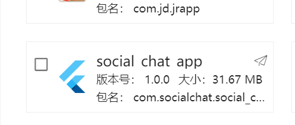
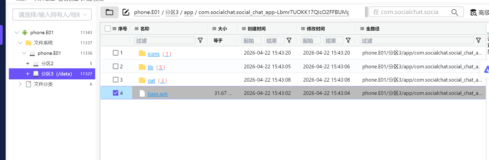
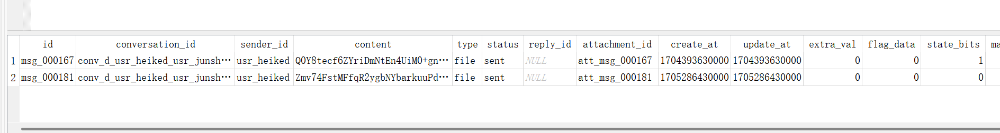
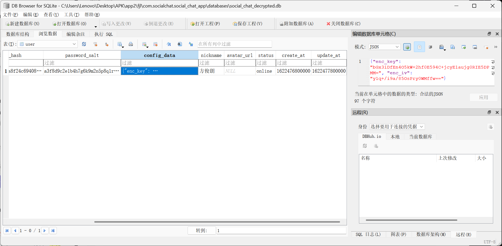
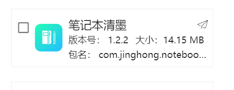
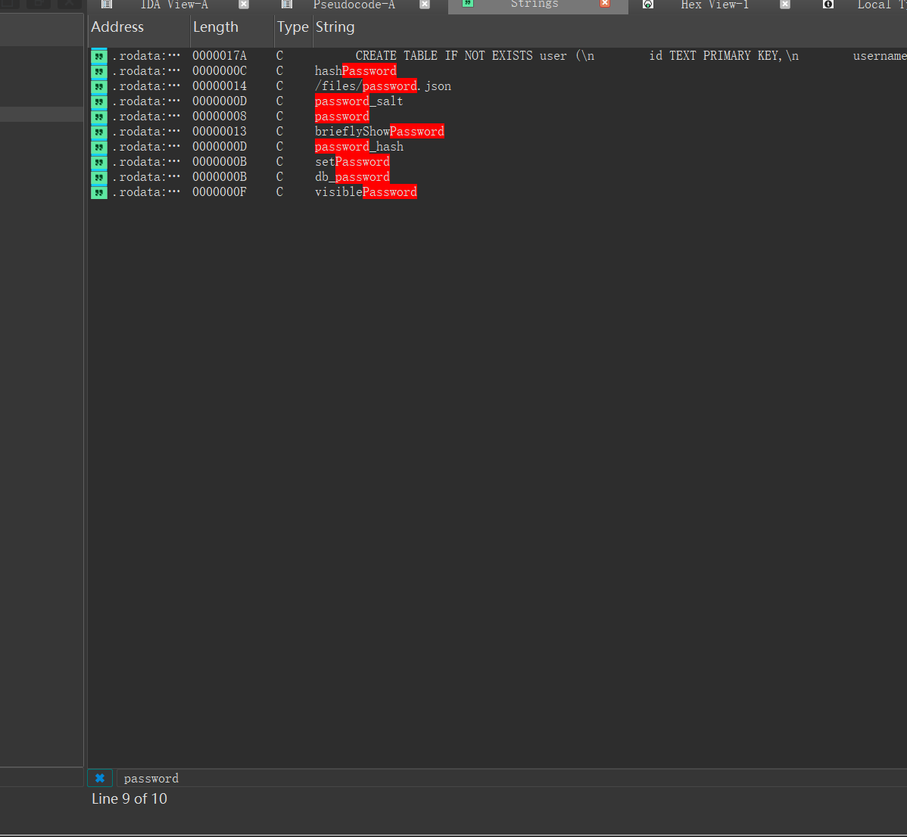
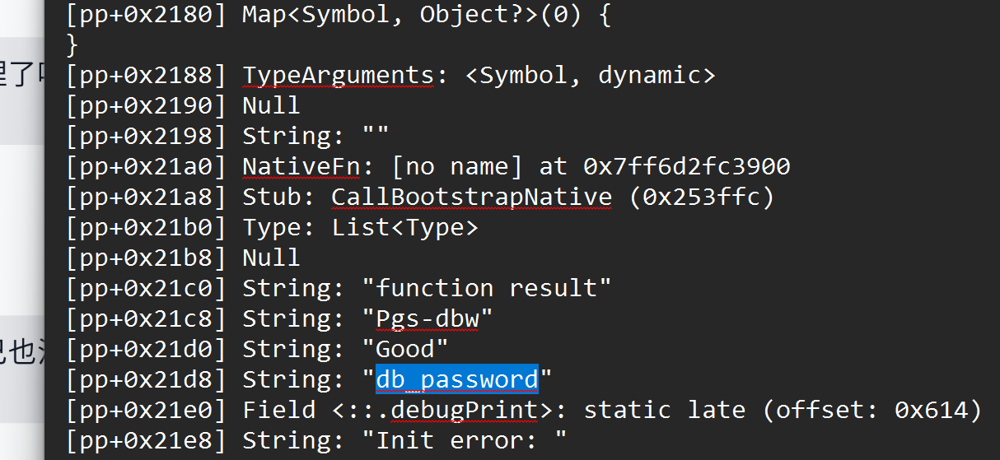

# 2026盘古石杯初赛\-恼人的Flutter

这几道题都是针对这个flutter app的。

# 1\.分析黄志远phone\.E01检材，黄志远使用其内部通联工具进行沟通，其账号的登陆密码是多少？\[答案格式：123456\]

08164085


Flutter app在此





取出app相关数据

打开数据库发现打不开，可能是加密数据库，用DB Browser for SQLCipher打开

shared\_pref里面看，发现数据库密码错误

```Java
<string name="flutter.db_password">Pgs-dbw1776839203359Good</string>
```

实际密码是 s\-dbw1776839203359Goo 

编写数据库解密脚本：

```Python
"""Decrypt a SQLCipher database into a normal SQLite database.

Examples:
    python sqlcipher_decryptor.py encrypted.db -p "your-password"
    python sqlcipher_decryptor.py encrypted.db -p "your-password" -o plain.db
    python sqlcipher_decryptor.py --compatibility 4 --force
    python sqlcipher_decryptor.py --password-stdin
"""

from __future__ import annotations

import argparse
import os
import secrets
import shutil
import sqlite3
import sys
from pathlib import Path
from typing import Any


# Change these defaults here, or override them from the command line.
DEFAULT_COMPATIBILITY = "auto"
DEFAULT_FORCE = False

SUPPORTED_COMPATIBILITIES = (4, 3, 2, 1)


def sql_literal(value: str) -> str:
    """Return a safely quoted SQL string literal."""
    return "'" + value.replace("'", "''") + "'"


def load_sqlcipher_module() -> Any:
    """Load either supported Python SQLCipher DB-API implementation."""
    try:
        import sqlcipher3

        return sqlcipher3
    except ImportError:
        pass

    try:
        import pysqlcipher3.dbapi2 as pysqlcipher3

        return pysqlcipher3
    except ImportError:
        pass

    raise RuntimeError(
        "Missing a Python SQLCipher module. Install one with:\n"
        "  python -m pip install sqlcipher3-binary"
    )


def verify_plain_sqlite(path: Path) -> None:
    """Verify that the exported file is a valid, readable SQLite database."""
    connection = sqlite3.connect(str(path))
    try:
        result = connection.execute("PRAGMA integrity_check").fetchone()
        if not result or str(result[0]).lower() != "ok":
            raise RuntimeError(f"SQLite integrity_check failed: {result!r}")
    finally:
        connection.close()


def export_with_compatibility(
    sqlcipher: Any,
    input_db: Path,
    output_db: Path,
    password: str,
    compatibility: int,
) -> None:
    """Export one database using one SQLCipher compatibility setting."""
    if output_db.exists():
        output_db.unlink()

    connection = sqlcipher.connect(str(input_db))
    try:
        connection.execute(f"PRAGMA key = {sql_literal(password)}")
        connection.execute(f"PRAGMA cipher_compatibility = {compatibility}")

        # Reading sqlite_master forces SQLCipher to validate the key.
        connection.execute("SELECT count(*) FROM sqlite_master").fetchone()

        connection.execute(
            f"ATTACH DATABASE {sql_literal(str(output_db))} "
            "AS plaintext KEY ''"
        )
        connection.execute("SELECT sqlcipher_export('plaintext')")
        connection.execute("DETACH DATABASE plaintext")
    finally:
        connection.close()

    verify_plain_sqlite(output_db)


def decrypt_database(
    input_db: str | Path,
    output_db: str | Path,
    password: str,
    compatibility: str = DEFAULT_COMPATIBILITY,
    force: bool = DEFAULT_FORCE,
) -> int:
    """Decrypt input_db and atomically create output_db."""
    sqlcipher = load_sqlcipher_module()
    input_path = Path(input_db).expanduser().resolve()
    output_path = Path(output_db).expanduser().resolve()

    if not input_path.is_file():
        raise FileNotFoundError(f"Input database does not exist: {input_path}")
    if input_path == output_path:
        raise ValueError("Input and output paths must be different")
    if output_path.exists() and not force:
        raise FileExistsError(
            f"Output already exists: {output_path}\n"
            "Use --force to replace it."
        )

    output_path.parent.mkdir(parents=True, exist_ok=True)
    temporary_path = output_path.with_name(
        f".{output_path.name}.{secrets.token_hex(8)}.tmp"
    )

    if compatibility == "auto":
        versions = SUPPORTED_COMPATIBILITIES
    else:
        try:
            selected = int(compatibility)
        except ValueError as exc:
            raise ValueError(
                f"Invalid compatibility {compatibility!r}; use auto, 1, 2, 3, or 4"
            ) from exc
        if selected not in SUPPORTED_COMPATIBILITIES:
            raise ValueError(
                f"Unsupported compatibility {selected}; use auto, 1, 2, 3, or 4"
            )
        versions = (selected,)

    errors: list[str] = []
    try:
        for version in versions:
            print(f"[auto] trying SQLCipher compatibility {version}...", flush=True)
            try:
                export_with_compatibility(
                    sqlcipher,
                    input_path,
                    temporary_path,
                    password,
                    version,
                )
                if output_path.exists():
                    output_path.unlink()
                shutil.move(str(temporary_path), str(output_path))
            except Exception as exc:
                errors.append(f"compatibility {version}: {exc}")
                if temporary_path.exists():
                    temporary_path.unlink()
                continue

            print(f"Decrypted database: {output_path}")
            print(f"SQLCipher compatibility detected: {version}")
            return 0
    finally:
        if temporary_path.exists():
            temporary_path.unlink()

    raise RuntimeError("Decryption failed:\n" + "\n".join(errors))


def read_password(args: argparse.Namespace) -> str:
    if args.password_stdin:
        password = sys.stdin.readline().rstrip("\r\n")
        if not password:
            raise ValueError("Password read from stdin is empty")
        return password
    if args.password is None:
        raise ValueError("Password is required; use -p/--password or --password-stdin")
    return args.password


def default_output_path(input_path: str | Path) -> Path:
    input_path = Path(input_path)
    return input_path.with_name(f"{input_path.stem}_decrypted{input_path.suffix}")


def build_parser() -> argparse.ArgumentParser:
    parser = argparse.ArgumentParser(
        description="Decrypt a SQLCipher database into a normal SQLite database."
    )
    parser.add_argument(
        "db_path",
        help="path to the encrypted SQLCipher database",
    )
    parser.add_argument(
        "-o",
        "--output",
        help="plain SQLite output path (default: <db_name>_decrypted.db)",
    )
    parser.add_argument(
        "-p",
        "--password",
        help="SQLCipher password",
    )
    parser.add_argument(
        "--password-stdin",
        action="store_true",
        help="read the password from the first line of standard input",
    )
    parser.add_argument(
        "--compatibility",
        choices=("auto", "1", "2", "3", "4"),
        default=DEFAULT_COMPATIBILITY,
        help=f"SQLCipher compatibility version (default: {DEFAULT_COMPATIBILITY})",
    )
    parser.add_argument(
        "--force",
        action="store_true",
        default=DEFAULT_FORCE,
        help="replace the output file if it already exists",
    )
    return parser


def main() -> int:
    args = build_parser().parse_args()
    password = read_password(args)
    output = args.output or default_output_path(args.db_path)
    return decrypt_database(
        input_db=args.db_path,
        output_db=output,
        password=password,
        compatibility=args.compatibility,
        force=args.force,
    )


if __name__ == "__main__":
    try:
        raise SystemExit(main())
    except Exception as exc:
        print(f"error: {exc}", file=sys.stderr)
        raise SystemExit(1)

```

解密后看登录密码


密码是哈希 哈希特征很像sha256 

[2026 第四届 “盘古石杯“ 晋级赛 全解 \(write up\)](https://blog.csdn.net/Aniparty/article/details/161772917)

```Python
import hashlib
import sys
import time
from concurrent.futures import ThreadPoolExecutor, as_completed
from threading import Event, Lock
import itertools

TARGET_HASH = "fc29eb768c139c05c0bfcb697d9b26d194878a66451b3ab91b202e9710874a63"
SALT = "a3f8d9c2e1b4h7g6k9m2n5p8q1r4t7w"

def h(data: bytes) -> str:
    return hashlib.sha256(data).hexdigest()

def d(data: bytes) -> bytes:
    return hashlib.sha256(data).digest()

strategies = [
    ("SHA256(pwd+salt)",           lambda p: h(p.encode() + SALT.encode())),
    ("SHA256(salt+pwd)",           lambda p: h(SALT.encode() + p.encode())),
    ("SHA256(pwd)",                lambda p: h(p.encode())),
    ("SHA256(hex SHA256(pwd+salt))", lambda p: h(h(p.encode()+SALT.encode()).encode())),
    ("SHA256(raw SHA256(pwd+salt))", lambda p: h(d(p.encode()+SALT.encode()))),
    ("SHA256(hex SHA256(salt+pwd))", lambda p: h(h(SALT.encode()+p.encode()).encode())),
    ("SHA256(raw SHA256(salt+pwd))", lambda p: h(d(SALT.encode()+p.encode()))),
    ("MD5(pwd+salt)",              lambda p: hashlib.md5(p.encode()+SALT.encode()).hexdigest()),
    ("MD5(salt+pwd)",              lambda p: hashlib.md5(SALT.encode()+p.encode()).hexdigest()),
]

# 全局控制变量
found_event = Event()
counter_lock = Lock()
total_checked = 0
start_time = time.time()
NUM_THREADS = 32

def check_batch(passwords, batch_id):
    """检查一批密码"""
    global total_checked
    local_checked = 0
    
    for password in passwords:
        if found_event.is_set():
            return None, 0
        
        for name, hash_func in strategies:
            if hash_func(password) == TARGET_HASH:
                found_event.set()
                return (name, password), local_checked
        
        local_checked += 1
        
        # 每10000次更新一次全局计数器
        if local_checked % 10000 == 0:
            with counter_lock:
                total_checked += 10000
                if total_checked % 500000 == 0:
                    elapsed = time.time() - start_time
                    rate = total_checked / elapsed
                    print(f"  进度: {total_checked:,} 次, 耗时 {elapsed:.0f}秒, 速度 {rate:.0f} 次/秒", end="\r")
                    sys.stdout.flush()
    
    with counter_lock:
        total_checked += (local_checked % 10000)
    
    return None, local_checked

def generate_batches(digits, total, batch_size=50000):
    """生成密码批次"""
    for start in range(0, total, batch_size):
        end = min(start + batch_size, total)
        batch = [f"{i:0{digits}d}" for i in range(start, end)]
        yield batch

def crack_digit_length(digits, total):
    """破解指定位数的密码"""
    global total_checked
    
    print(f"\n[*] 正在尝试 {digits} 位数字密码 (0~{10**digits-1})...")
    
    with ThreadPoolExecutor(max_workers=NUM_THREADS) as executor:
        futures = []
        batch_id = 0
        
        # 提交所有批次任务
        for batch in generate_batches(digits, total):
            if found_event.is_set():
                break
            future = executor.submit(check_batch, batch, batch_id)
            futures.append(future)
            batch_id += 1
        
        # 处理完成的任务
        for future in as_completed(futures):
            if found_event.is_set():
                result, _ = future.result()
                if result:
                    return result
                break
            
            result, checked = future.result()
            if result:
                # 取消所有未完成的任务
                for f in futures:
                    f.cancel()
                return result
    
    return None

# 主程序
digit_lengths = [
    (1, 10),          # 0-9
    (2, 100),         # 00-99
    (3, 1000),        # 000-999
    (4, 10000),       # 0000-9999
    (5, 100000),      # 00000-99999
    (7, 10_000_000),  # 0000000-9999999
]

print(f"[*] 启动 {NUM_THREADS} 线程爆破...")
print(f"[*] 目标哈希: {TARGET_HASH}")
print(f"[*] 盐值: {SALT}")
print(f"[*] 策略数量: {len(strategies)}")

try:
    for digits, total in digit_lengths:
        if found_event.is_set():
            break
        
        result = crack_digit_length(digits, total)
        if result:
            name, password = result
            elapsed = time.time() - start_time
            print(f"\n\n[+] 找到密码！")
            print(f"[+] 策略: {name}")
            print(f"[+] 密码: {password}")
            print(f"[+] 耗时: {elapsed:.2f}秒")
            print(f"[+] 总尝试次数: {total_checked:,}")
            sys.exit(0)
    
    if not found_event.is_set():
        print(f"\n[-] 1-7位数字密码穷举完成，共 {total_checked:,} 次尝试，未找到匹配密码")
        
        # 尝试8位数字
        print(f"\n[*] 正在尝试 8 位数字密码...")
        result = crack_digit_length(8, 100_000_000)
        if result:
            name, password = result
            elapsed = time.time() - start_time
            print(f"\n\n[+] 找到密码！")
            print(f"[+] 策略: {name}")
            print(f"[+] 密码: {password}")
            print(f"[+] 耗时: {elapsed:.2f}秒")
            print(f"[+] 总尝试次数: {total_checked:,}")
            sys.exit(0)
        else:
            elapsed = time.time() - start_time
            print(f"\n[-] 全部穷举完成，共 {total_checked:,} 次尝试，耗时 {elapsed:.0f}秒，未找到匹配密码")

except KeyboardInterrupt:
    print(f"\n\n[!] 用户中断")
    elapsed = time.time() - start_time
    print(f"[*] 已尝试: {total_checked:,} 次, 耗时 {elapsed:.0f}秒")
    sys.exit(1)
```

最终结果：

```Plain Text
[+] 找到密码！
[+] 策略: SHA256(hex SHA256(pwd+salt))
[+] 密码: 08164085
[+] 耗时: 137.93秒
```

08164085

# 2\.分析黄志远phone\.E01检材，黄志远一共发送过几个文件给代号军师的嫌疑人？\[答案格式：1\]

2

```Plain Text
select * from message WHERE conversation_id like '%junshi%' and type='file'
```




# 3\.分析方俊朗phone\.E01检材，方俊朗使用其内部通联工具时，共加入过几个群？\[答案格式：7\]

2


# 4\.分析周文杰Image\.zip检材，内部通联app聊天数据库名称是？\[答案格式：abc\.db\]

social\_chat\.db


# 5\.分析周文杰Image\.zip检材，内部通联app聊天数据库密码保存在哪个文件中？\[答案格式：Abc\.txt\]

FlutterSharedPreferences\.xml


# 6\.分析周文杰Image\.zip检材，周文杰内部通联app聊天数据库密码是？\[答案格式：123\-abc\]

s\-dbw1776853545473Goo

```Plain Text
<string name="flutter.db_password">Pgs-dbw1776853545473Good</string>
```

原理见结尾

# 7\.分析周文杰Image\.zip检材，内部通联app聊天数据使用的什么加密算法?\[答案格式：ABCDEF\]

AES

找任何人的数据库都可以

```Plain Text
{
    "enc_key": "bGx3iDfEn4O5kW+2hf0E594C+jcyE1aujg0RIE5DPMM=", 
    "enc_iv": "y1q+/i9a/85OsPry0WMffw=="
}
```

enc\_key 转 hex 为32字节，enc\_iv 16字节

典型的AES128 CBC



# 8\.分析周文杰Image\.zip检材，内部通联app用户密码的盐值是？\[答案格式：1234abcd\]

a3f8d9c2e1b4h7g6k9m2n5p8q1r4t7w


# 9\.分析周文杰Image\.zip检材，记录周文杰内部通联app登录密码提示的应用包名是？\[答案格式：com\.temp\.app\]

com\.jinghong\.notebookkssjh



# 10\.分析周文杰Image\.zip检材，内部通联app登录密码是？\[答案格式：123abc\]

mb202623


提示 英文\*2 \+数字\*6 然后尝试爆破

```Python
import hashlib
import string
import itertools
from concurrent.futures import ProcessPoolExecutor, as_completed
import multiprocessing
import time
 
target_hash = "5d85b77d7d6d1a76cd589c3ba21d1839b1dd28568e39f1d2facc3a1b7d2e8bcb"
salt = "a3f8d9c2e1b4h7g6k9m2n5p8q1r4t7w"
 
def crack_batch(args):
    letter_pairs, target, salt_val = args
    digits = '0123456789'
 
    for letter_pair in letter_pairs:
        for d1, d2, d3, d4, d5, d6 in itertools.product(digits, repeat=6):
            password = letter_pair + d1 + d2 + d3 + d4 + d5 + d6
 
            first_hash = hashlib.sha256((password + salt_val).encode()).hexdigest()
            final_hash = hashlib.sha256(first_hash.encode()).hexdigest()
 
            if final_hash == target:
                return password
    return None
 
def main():
    letters = string.ascii_letters
 
    all_letter_pairs = [''.join(combo) for combo in itertools.product(letters, repeat=2)]
    num_workers = multiprocessing.cpu_count()
 
    total_combinations = len(all_letter_pairs) * 1000000
 
    print(f"[*] Target hash: {target_hash}")
    print(f"[*] Salt: {salt}")
    print(f"[*] Password format: 2 letters + 6 digits")
    print(f"[*] Total combinations: {total_combinations:,}")
    print(f"[*] Using {num_workers} CPU cores")
    print(f"[*] Starting brute-force...\n")
 
    chunk_size = max(1, len(all_letter_pairs) // num_workers)
    chunks = []
    for i in range(0, len(all_letter_pairs), chunk_size):
        chunks.append(all_letter_pairs[i:i + chunk_size])
 
    tasks = [(chunk, target_hash, salt) for chunk in chunks]
 
    start_time = time.time()
    completed_pairs = 0
 
    with ProcessPoolExecutor(max_workers=num_workers) as executor:
        future_to_chunk = {executor.submit(crack_batch, task): len(task[0]) for task in tasks}
 
        for future in as_completed(future_to_chunk):
            chunk_letter_count = future_to_chunk[future]
            completed_pairs += chunk_letter_count
            elapsed = time.time() - start_time
            progress = completed_pairs / len(all_letter_pairs) * 100
            speed = completed_pairs * 1000000 / elapsed if elapsed > 0 else 0
            eta = (len(all_letter_pairs) - completed_pairs) * 1000000 / speed if speed > 0 else 0
 
            print(f"[*] Progress: {progress:.2f}% | Speed: {speed:,.0f} pwd/s | ETA: {eta:.0f}s", end='\r')
 
            try:
                result = future.result()
                if result:
                    elapsed = time.time() - start_time
                    print(f"\n\n[+] Password found: {result}")
                    print(f"[+] Time elapsed: {elapsed:.2f}s")
                    first_hash = hashlib.sha256((result + salt).encode()).hexdigest()
                    final_hash = hashlib.sha256(first_hash.encode()).hexdigest()
                    print(f"[+] Hash verification: {final_hash}")
                    print(f"[+] Target hash:       {target_hash}")
                    print(f"[+] Match: {final_hash == target_hash}")
                    return result
            except Exception as e:
                print(f"\n[-] Error: {e}")
    
    elapsed = time.time() - start_time
    print(f"\n\n[-] Password not found after {elapsed:.2f}s")
    return None
 
if __name__ == "__main__":
    main()
```

```Plain Text
[*] Target hash: 5d85b77d7d6d1a76cd589c3ba21d1839b1dd28568e39f1d2facc3a1b7d2e8bcb
[*] Salt: a3f8d9c2e1b4h7g6k9m2n5p8q1r4t7w
[*] Password format: 2 letters + 6 digits
[*] Total combinations: 2,704,000,000
[*] Using 32 CPU cores
[*] Starting brute-force...

[*] Progress: 3.11% | Speed: 521,066 pwd/s | ETA: 5028s

[+] Password found: mb202623
[+] Time elapsed: 161.21s
[+] Hash verification: 5d85b77d7d6d1a76cd589c3ba21d1839b1dd28568e39f1d2facc3a1b7d2e8bcb
[+] Target hash:       5d85b77d7d6d1a76cd589c3ba21d1839b1dd28568e39f1d2facc3a1b7d2e8bcb
[+] Match: True
```

mb202623

# 11\.分析周文杰Image\.zip检材，周文杰在内部通联app中删除了几条聊天记录？\[答案格式：123\]

6

宰相一共6条记录


直接重构

安装app后删掉目录，然后

```Plain Text
adb push .\com.socialchat.social_chat_app /data/data/
```

用户名 zhouwenjie 密码 mb202623


查看app聊天记录，删了4条

# 12\.分析周文杰Image\.zip检材，聊天数据库中，显示聊天数据删除的是哪个字段?\[答案格式：ab\_cd\]

extra\_val

注意不要和state\_bits搞混了，state\_bits只有5条，extra\_val6条


# 为什么数据库密码不正确？

要看数据库密码加密的逻辑位置，也就意味着我们要逆向flutter app

使用blutter

```Plain Text
blutter .\base.apk base_blutter
```

打开libapp\.so 使用ida脚本恢复符号表,猜测逻辑

Blutter 恢复后，Dart app 的入口主函数通常显示成：

`xxx_main_main_<addr>`

例如这个 app：

```Python
package:social_chat_app/main.dart
  Dart/Blutter: ::main
  IDA: social_chat_app_main_main_5da990
```

一般命名规律：

`package:<app_package>/<path>/<file>.dart :: <function>`

转到 IDA 名称后大概变成：

`<app_package>_<path>_<file>_<function>_<addr>`

最终使用ai在`social_chat_app_main_::main_5da990` 发现数据库密码选取代码。

先搜password。



password无xref,但是pp\.txt不要忘了



再在 asm 目录搜这个 字符串

在main\.dart找到

```Assembly language
0x5daa90: r1 = "db_password"
0x5daa90: ldr             x1, [PP, #0x21d8]  ; [pp+0x21d8] "db_password"
```

在ida的代码中

```Assembly language
.text:00000000005DAA98  BL social_chat_app$core$utils$storage_utils_StorageUtils__setString_3a1acc
```

说明数据库密码来自shared\_pref 的字符串

然后继续看：

```Assembly language
.text:00000000005DAAAC loc_5DAAAC                              ; CODE XREF: social_chat_app$main___main_5da990+48↑j
.text:00000000005DAAAC                 STUR            X0, [X29,#-0x80]
.text:00000000005DAAB0                 LDUR            W1, [X0,#7]
.text:00000000005DAAB4                 SBFX            X2, X1, #1, #0x1F
.text:00000000005DAAB8                 SUB             X1, X2, #1
.text:00000000005DAABC                 LSL             X2, X1, #1
.text:00000000005DAAC0                 STR             X2, [X15] ;Dart_Smi(password+length-1)
.text:00000000005DAAC4                 MOV             X1, X0
.text:00000000005DAAC8                 MOV             X2, #2
.text:00000000005DAACC                 LDR             X4, [X27,#0x2A8]
.text:00000000005DAAD0                 BL              dart_core__StringBase__substring_25f518
```

```Assembly language
0x5daaac: stur            x0, [fp, #-0x80]   ; x0 = db_password 原始字符串
  0x5daab0: LoadField: r1 = r0->field_7        ; 字符串长度
  0x5daab4: r2 = LoadInt32Instr(r1)
  0x5daab8: sub             x1, x2, #1         ; end = length - 1
  0x5daabc: lsl             x2, x1, #1           ; 转成 Dart Smi 格式
  0x5daac8: r2 = 2                              ; start = 2
  0x5daad0: bl              #0x25f518          ; _StringBase::substring
  0x5daad4: StoreStaticField(0xe64, r0)         ; 保存截取后的密码
```

对应伪代码

```Assembly language
*(v11 - 16) = String_5dd614;
  *v16 = 2 * (((__int64)*(int *)(String_5dd614 + 7) >> 1) - 1);
  *(_QWORD *)(*(_QWORD *)(v6 + 104) + 7368LL) = dart_core__StringBase::substring_25f518(String_5dd614, String_5dd614, 2);
```

第二句代码实现了类似效果：如果原始长度是 N，则计算结果为 `2 * ((N/2) - 1) = N - 2`

第三句像是`substring(2)`

但是实际上汇编有 `sub x1, x2, #1` 

`5DAAB0`的 `[X0,#7]`地址存放的是字符串长度，长度是Dart\_Smi编码的 放到 w1 看作`(int32_t)x1`

`0x5daab4: sbfx x2, x1, #1, #0x1f` 等价于 `x2 = ((int32_t)x1) >> 1;`x2就是真实字符串长度length，x1 拿到的，就是length\-1 ，然后在 0x5daabc进行Dart\_Smi编码传给x2，最后的`STR X2, [X15]` 做了

DartVM的隐式参数传递。

所以真正的逻辑是`substring(2, dbPassword.length - 1)`。

我们已经知道显示密码是 `Pgs-dbw1776839203359Good` ，那么密码就是`s-dbw1776839203359Goo`。

# 登录逻辑解析

在ida函数里面搜password

找到函数`social_chat_app_core_utils_crypto_utils_CryptoUtils::hashPassword_3a1ef8`

```C++
__int64 __fastcall social_chat_app_core_utils_crypto_utils_CryptoUtils::hashPassword_3a1ef8(
        __int64 a1,
        __int64 a2,// password
        __int64 a3)// salt
{
  __int64 v3; // x15
  __int64 v4; // x22
  __int64 v5; // x26
  __int64 v6; // x29
  __int64 v7; // x30
  __int64 v8; // x29
  __int64 v9; // x3
  __int64 v10; // x0
  __int64 ArrayStub_5d7638; // x0
  __int64 *v12; // x15
  __int64 v13; // x0
  __int64 v14; // x1
  __int64 v15; // x0

  *(_QWORD *)(v3 - 16) = v6;
  *(_QWORD *)(v3 - 8) = v7;
  v8 = v3 - 16;
  v9 = a2;//password
  v10 = a3;//salt
  *(_QWORD *)(v3 - 24) = a2;
  *(_QWORD *)(v3 - 32) = a3;
  if ( (unsigned __int64)(v3 - 40) <= *(_QWORD *)(v5 + 56) )
    v10 = StackOverflowSharedWithoutFPURegsStub_5d7740(a3);
  if ( (_DWORD)v10 == (_DWORD)v4 )// salt == null
  {
    v13 = v9;
    v14 = v9; // input = password
  }
  else
  {
    ArrayStub_5d7638 = AllocateArrayStub_5d7638(v10, v4, 4);
    *(_DWORD *)(ArrayStub_5d7638 + 15) = *(_QWORD *)(v8 - 8);//password
    *(_DWORD *)(ArrayStub_5d7638 + 19) = *(_QWORD *)(v8 - 16);//salt
    *v12 = ArrayStub_5d7638;
    v13 = dart_core__StringBase::_interpolate_25dce4();//password+salt
    v14 = v13;
  }
  v15 = social_chat_app_core_utils_crypto_utils_CryptoUtils::sha256_3a1e34(v13, v14);
  return social_chat_app_core_utils_crypto_utils_CryptoUtils::sha256_3a1e34(v15, v15);
}
```

`social_chat_app_core_utils_crypto_utils_CryptoUtils::sha256_3a1e34`函数说明`hashPassword` 函数是计算SHA256

交叉引用发现了登录函数`social_chat_app_data_repositories_auth_repository_AuthRepository::login_3a13cc`


看了登录函数没有什么东西但`hashPassword`展示了核心算法，被登录注册函数所共用。

我们关注代码结尾，发现：

```C++
v15 = social_chat_app_core_utils_crypto_utils_CryptoUtils::sha256_3a1e34(v13, v14);
  return social_chat_app_core_utils_crypto_utils_CryptoUtils::sha256_3a1e34(v15, v15);
```

交叉引用发现 v13, v14 是同一个参数 

v15 就是sha256的结果，再sha256。这段相当于 `sha256(ha256(input))`。

那`input` 是什么呢？

```C++
if ( (_DWORD)v10 == (_DWORD)v4 )// salt == null
  {
    v13 = v9;
    v14 = v9; // input = password
  }
  else
  {
    ArrayStub_5d7638 = AllocateArrayStub_5d7638(v10, v4, 4);
    *(_DWORD *)(ArrayStub_5d7638 + 15) = *(_QWORD *)(v8 - 8);//password
    *(_DWORD *)(ArrayStub_5d7638 + 19) = *(_QWORD *)(v8 - 16);//salt
    *v12 = ArrayStub_5d7638;
    v13 = dart_core__StringBase::_interpolate_25dce4();//password+salt
    v14 = v13;
  }
```

`dart_core__StringBase::_interpolate_25dce4` 是Dart语言的字符串相加的底层实现

也就意味着：

```Python
if salt == null:
    hash = SHA256_HEX(SHA256_HEX(password))
else:
    hash = SHA256_HEX(SHA256_HEX(password + salt))
```

这与之前的猜测吻合！

```C++
__int64 __fastcall social_chat_app_core_utils_crypto_utils_CryptoUtils::sha256_3a1e34(__int64 a1)
{
  __int64 v1; // x15
  __int64 v2; // x26
  __int64 v3; // x27
  __int64 v4; // x29
  __int64 v5; // x30
  __int64 v6; // x0
  __int64 v7; // x0
  __int64 *v8; // x15

  *(_QWORD *)(v1 - 16) = v4;
  *(_QWORD *)(v1 - 8) = v5;
  if ( (unsigned __int64)(v1 - 24) <= *(_QWORD *)(v2 + 56) )
    StackOverflowSharedWithoutFPURegsStub_5d7740(a1);
  v6 = dart_convert_Utf8Encoder::convert_508eec();
  v7 = crypto_src_hash_Hash::convert_50a0c4(v6, *(_QWORD *)(v3 + 68536), v6);
  *v8 = v7;
  return crypto_src_digest_Digest::toString_4b52e0();
}
```

sha256算法返回的结果是String，说明结果肯定是sha256 hex，这一点可在数据库印证。

所以登录的算法是 `sha(sha256(((salt!=null)?(password+salt):password)))`


