# CISCN复盘

# Crypto

## EzFlag

### 题目分析

这个密码题与一般的场景有很大区别。这是一个Linux可执行程序，所以需要一些逆向的知识去辅助解题，同时结合一些数学知识。

用IDA反编译之后得到主函数逻辑：

```C++
int __fastcall main(int argc, const char **argv, const char **envp)
{
  __int64 v3; // rax
  __int64 v4; // rax
  _BYTE v6[32]; // [rsp+0h] [rbp-50h] BYREF
  _BYTE v7[12]; // [rsp+20h] [rbp-30h] BYREF
  int v8; // [rsp+2Ch] [rbp-24h] BYREF
  char v9; // [rsp+33h] [rbp-1Dh]
  int i; // [rsp+34h] [rbp-1Ch]
  unsigned __int64 v11; // [rsp+38h] [rbp-18h]

  std::string::basic_string(v6, argv, envp);
  //输出 Enter password: 
  std::operator<<<std::char_traits<char>>(&_bss_start, "Enter password: ");
  //接收输入
  std::getline<char,std::char_traits<char>,std::allocator<char>>(&std::cin, v6);
  //判断密码是否为 V3ryStr0ngp@ssw0rd
  if ( (unsigned __int8)std::operator!=<char>(v6, "V3ryStr0ngp@ssw0rd") ) 
  {
    //如果不相等，就输出 Wrong password!
    v3 = std::operator<<<std::char_traits<char>>(&_bss_start, "Wrong password!");
    std::ostream::operator<<(v3, &std::endl<char,std::char_traits<char>>);
  }
  else
  { 
    //如果相等，就进入解密flag流程
    std::operator<<<std::char_traits<char>>(&_bss_start, "flag{");
    std::ostream::flush((std::ostream *)&_bss_start);
    v11 = 1;
    for ( i = 0; i <= 31; ++i )
    {
      v9 = f(v11);//关键的解密逻辑，重要！！！传入了要循环的次数
      std::operator<<<std::char_traits<char>>(&_bss_start, (unsigned int)v9);
      std::ostream::flush((std::ostream *)&_bss_start);
      if ( i == 7 || i == 12 || i == 17 || i == 22 )
      {
        std::operator<<<std::char_traits<char>>(&_bss_start, "-");
        std::ostream::flush((std::ostream *)&_bss_start);
      }
      v11 *= 8LL;   // 循环的次数更新
      v11 += i + 64;// 循环的次数更新
      v8 = 1;
      std::chrono::duration<long,std::ratio<1l,1l>>::duration<int,void>(v7, &v8);
      std::this_thread::sleep_for<long,std::ratio<1l,1l>>(v7);//sleep 1秒
    }
    v4 = std::operator<<<std::char_traits<char>>(&_bss_start, "}");
    std::ostream::operator<<(v4, &std::endl<char,std::char_traits<char>>);
  }
  std::string::~string(v6);
  return 0;
}
```

我们可以梳理出程序的主要流程：

1. **密码验证阶段**：

    - 提示用户输入密码

    - 读取用户输入

    - 与硬编码的密码字符串比较

    - 密码错误则输出提示并退出

2. **Flag生成阶段**：

    - 输出"flag\{"前缀

    - 初始化v11 = 1，循环变量i = 0

    - 进入循环（共32次）

    - 每次循环调用函数f\(v11\)生成一个字符

    - 更新v11：v11 = \(v11 \<\< 3\) \+ \(64 \+ i\)

    - 在特定位置插入连字符

从这个main函数中我们可知，程序运行后会叫你输入密码，如果密码为`V3ryStr0ngp@ssw0rd`，就进行flag解密流程，否则，输出`Wrong password!`。

我们观察f函数：

```C++
__int64 __fastcall f(unsigned __int64 a1)
{
  __int64 v2; // [rsp+10h] [rbp-20h]
  unsigned __int64 i; // [rsp+18h] [rbp-18h]
  __int64 v4; // [rsp+20h] [rbp-10h]
  __int64 v5; // [rsp+28h] [rbp-8h]

  v5 = 0; //初始值定义
  v4 = 1; //初始值定义
  for ( i = 0; i < a1; ++i )
  {
    v2 = v4;
    v4 = ((_BYTE)v5 + (_BYTE)v4) & 0xF; // 模16运算
    v5 = v2;
  }
  return *(unsigned __int8 *)std::string::operator[](&K, v5); // return K[v5];
}
```

这段代码是什么意思呢？让我们仔细分析：

**变量初始化**：

- v5 = 0

- v4 = 1

**循环体**：

- 保存v4的值到临时变量

- 计算v5 \+ v4，然后对16取模（`& 0xF`等价于`% 16`）

- 将结果赋值给v4

- 将之前保存的v4值赋给v5

这个模式是什么呢？让我们手动计算前几项：

- 第0次循环前：v5=0, v4=1

- 第1次循环后：v5=1, v4=1

- 第2次循环后：v5=1, v4=2

- 第3次循环后：v5=2, v4=3

- 第4次循环后：v5=3, v4=5

- 第5次循环后：v5=5, v4=8

这个时候，我们发现了v5的规律：

`0, 1, 1, 2, 3, 5, 8, 13, 21, 34, 55, ...`

是的，这就是著名的**Fibonacci数列**！

那么我们假设这段v5数列为F\(n\)，则

$F(0)=0,F(1)=1,F(n+2)=F(n+1)+F(n) \space(n>=0)$

那么v4数列$G(n)=F(n+1) mod 16$。

最后，函数将Fibonacci数列第n项模16的结果作为索引，从字符表`"012ab9c3478d56ef"`中查找对应的字符。

这个时候，我们就可以得出f函数每一轮运算下来获得的索引：

```Plain Text
n    F(n)    G(n-1)
0    0       0
1    1       1
2    1       1
3    2       2
4    3       3
5    5       5
6    8       8
7    13      13
8    21      5
9    34      2
10   55      7
11   89      9
12   144     0
13   233     9
14   377     9
15   610     2
```

这是我们发现在f函数里面，传入一个参数a1，就是循环次数，查看main函数，传入的参数是v11。

v11在每一轮f调用完会更新：

```C++
v11 *= 8LL;
v11 += i + 64;
```

相当于`v11=v11*8+(i+64)`，其中i表示是在第几个循环。

让我们计算前几次的seed值：

```Plain Text
第0次：seed = 1
第1次：seed = (1 << 3) + 64 = 8 + 64 = 72
第2次：seed = (72 << 3) + 65 = 576 + 65 = 641
第3次：seed = (641 << 3) + 66 = 5128 + 66 = 5194
第4次：seed = (5194 << 3) + 67 = 41552 + 67 = 41619
```

可以看到seed值增长非常快。到第30次循环时，seed已经是一个天文数字。

所以我们要优化这个算法。

### 性能优化的关键：Pisano周期

如果我们直接按照函数f的逻辑来实现，当seed非常大时（比如第30次循环），需要循环数万亿次甚至更多。这在实际计算中是不可行的，程序会运行极其缓慢。

但题目程序能够正常运行，说明一定有优化方法。这个优化的关键就是**Pisano周期**。

#### 什么是Pisano周期

Pisano周期是数论中的一个重要概念，由意大利数学家Leonardo Pisano（即Fibonacci）的名字命名。

**定义**：对于任意正整数m，Fibonacci数列模m是一个周期序列，其最小正周期π\(m\)称为Pisano周期。

**核心性质**：

$F(n)\space mod \space m = F(n \space mod \space π(m)) \space mod \space m$

这意味着，Fibonacci数列模m的值会周期性重复。

#### Pisano周期在此题中的应用

对于模16的情况，周期是多少呢？

我们编写以下程序：

```C++
#include **<**iostream**>**

**int** main**(){**
    **int** a**=**0**;**
    **int** b**=**1**;**
    **int** seq**[**50**]={**0**};**
    **int** tmp**=**0**;**
    **for(int** i**=**0**;**i**<**50**;**i**++){**
        tmp**=(**a**+**b**)%**16**;**
        a**=**b**;**
        b**=**tmp**;**
        seq**[**i**]=**a**;**
    **}**
    **for(int** i**=**0**;**i**<**50**;**i**++){**
        **std::**cout**<<**seq**[**i**]<<",";**
    **}**
    **std::**cout**<<"..."<<std::**endl**;**
    **return** 0**;**
**}**
```

程序运行结果为：

`1,1,2,3,5,8,13,5,2,7,9,0,9,9,2,11,13,8,5,13,2,15,1,0,1,1,2,3,5,8,13,5,2,7,9,0,9,9,2,11,13,8,5,13,2,15,1,0,1,1,...`

这个时候，我们发现从第25个开始重复了，所以周期为24。

最后的最后，需要找到索引与flag字符的对应关系。

在f函数的最后的返回语句，发现字符串K，按下X键通过交叉引用发现初始化字符串的函数：

```C++
int __static_initialization_and_destruction_0(void)
{
  char v1; // [rsp+7h] [rbp-19h] BYREF
  char *v2; // [rsp+8h] [rbp-18h]

  v2 = &v1;
  std::string::basic_string(&K, "012ab9c3478d56ef", &v1);
  std::__new_allocator<char>::~__new_allocator(&v1);
  return __cxa_atexit((void (*)(void *))&std::string::~string, &K, &_dso_handle);
}
```

所以,`string K="012ab9c3478d56ef";`。

### 题目求解

编写解题脚本：

```Python
K = "012ab9c3478d56ef"

def fib(n):
    n = n % 24  # 利用周期性优化
    a, b = 0, 1
    for _ in range(n):
        a, b = b, (a + b) % 16
    return a

def solve():
    *"""*
*    模拟程序的flag生成逻辑*
*    """*
*    *seed = 1
    result = []

    # 生成32个字符
    for i in range(32):
        # 计算Fibonacci数并查表
        fib_index = fib(seed)
        char = K[fib_index]
        result.append(char)

        # 更新seed
        seed = ((seed << 3) + (0x40 + i)) & 0xFFFFFFFFFFFFFFFF

    # 拼接字符串
    s = "".join(result)

    # 插入连字符：在位置8, 13, 18, 23后插入
    # 格式：8-5-5-5-9
    flag = f"flag{{{s[:8]}-{s[8:13]}-{s[13:18]}-{s[18:23]}-{s[23:]}}}"

    return flag

if __name__ == "__main__":
    flag = solve()
    print(f"Flag: {flag}")
```

Flag: flag\{10632674\-1d219\-09f29\-14769\-f60219a24\}

解题脚本\(C\+\+\)：

```C++
#include **<**iostream**>**
#include **<**cstdint**>**
**int** f**(**uint64_t times**){**
    times**%=**24**;**
    **int** a**=**0**;**
    **int** b**=**1**;**
    **int** tmp**=**0**;**
    **for(int** i**=**0**;**i**<**times**;**i**++){**
        tmp**=(**a**+**b**)%**16**;**
        a**=**b**;**
        b**=**tmp**;**
    **}**
    **return** a**;**
** }**

**int** main**(){**
    **char** K**[]="012ab9c3478d56ef";**
    uint64_t n**=**1**;**
    **std::**cout**<<"flag{";**
    **for(int** i**=**0**;**i**<**31**;**i**++){**
        **int** index **=** f**(**n**);**
        **std::**cout**<<**K**[**index**];**
        **if** **(** i **==** 7 **||** i **==** 12 **||** i **==** 17 **||** i **==** 22 **)**
        **{**
            **std::**cout**<<"-";**
        **}**
        n ***=** 8LL**;**
        n **+=** i**+**64**;**
    **}**
    **std::**cout**<<"}";**
    **return** 0**;**
** }**
```

### 源代码预测

这题的源代码（主包推测）：

```C++
#include **<**iostream**>**
#include **<**cstdint**>**
#include **<**windows**.**h**>**
**using** **namespace** **std;**
string K**;**

__attribute__**((**constructor**))** **void** __static_initialization_and_destruction_0**(void){**
    K**="012ab9c3478d56ef";**
**}**


**int** f**(**uint64_t a1**){**
    __int64 v2**;**
    uint64_t i**;**
    __int64 v4**;**
    __int64 v5**;**
    
     v5 **=** 0**;**
    v4 **=** 1**;**
    **for** **(** i **=** 0**;** i **<** a1**;** **++**i **)**
    **{**
        v2 **=** v4**;**
        v4 **=** **(**v5 **+** v4**)** **&** 0xF**;**
        v5 **=** v2**;**
    **}**
    **return** K**[**v5**];**
**}**

**int** main**(){**
    string pwd**;**
    **int** second**;**
    uint64_t n**;**
    **int** i**;**
    **char** ch**;**
    cout**<<"Enter** **password:** **";**
    cin**>>**pwd**;**
    **if(**pwd**!="V3ryStr0ngp@ssw0rd"){**
        cout**<<"Wrong** **password!"<<**endl**;**
    **}else{**
        **std::**cout**<<"flag{";**
        n**=**1**;**
        **for(**i**=**0**;**i**<**31**;**i**++){**
            ch **=** f**(**n**);**
            **std::**cout**<<**ch**;**
            **if** **(** i **==** 7 **||** i **==** 12 **||** i **==** 17 **||** i **==** 22 **)**
            **{**
                **std::**cout**<<"-";**
            **}**
            n ***=** 8LL**;**
            n **+=** i**+**64**;**
            
            second**=**1000**;**
            Sleep**(**second**);**
        **}**
        **std::**cout**<<"}";**
    **}**
    **return** 0**;**
**}**
```

优化版：

```C++
#include <iostream>
#include <cstdint>
#include <windows.h>
using namespace std;
string K;

__attribute__((constructor)) void __static_initialization_and_destruction_0(void){
    K="012ab9c3478d56ef";
 }


int f(uint64_t a1){
    __int64 v2;
    uint64_t i;
    __int64 v4;
    __int64 v5;
    
    a1%=24;//优化
    
    v5 = 0;
    v4 = 1;
    for ( i = 0; i < a1; ++i )
    {
        v2 = v4;
        v4 = (v5 + v4) & 0xF;
        v5 = v2;
    }
    return K[v5];
 }

int main(){
    string pwd;
    int second;
    uint64_t n;
    int i;
    char ch;
    cout<<"Enter password: ";
    cin>>pwd;
    if(pwd!="V3ryStr0ngp@ssw0rd"){
        cout<<"Wrong password!"<<endl;
    }else{
        std::cout<<"flag{";
        n=1;
        for(i=0;i<31;i++){
            ch = f(n);
            std::cout<<ch;
            if ( i == 7 || i == 12 || i == 17 || i == 22 )
            {
                std::cout<<"-";
            }
            n *= 8LL;
            n += i+64;
            
            *//second=1000;*
            *//Sleep(second);*
        }
        std::cout<<"}";
    }
    return 0;
 }
```

### 更一般的数学知识总结：Pisano周期的计算

斐波那契数列定义：

$F(n+2)=F(n+1)+F(n)\quad(n\ge0)$

$F(0)=0,F(1)=1$

对于任意整数*n*, 数列$G(n)=F(n) \enspace mod \enspace i$为周期数列。皮萨诺周期$\pi(i)$记为该数列的周期。

#### 计算周期的方法1：直接观察法

我们可以编写以下脚本：

```Python
i=abs(int(input("请输入模数："))) # 模数
fib=[]
a=0 #初始值
b=1
length=100 # 预输出长度

for _ in range(length):
    a,b=b,(a+b)%i
    fib.append(a)

print(fib)
```

甚至可以查表：

此图中，$f(x,y)=\pi(n)=\pi(x+y)$。

#### 计算周期的方法2：更一般的方法

数学原理参考以下链接：

http://shuxueji\.com/w/11386

https://zhuanlan\.zhihu\.com/p/646539368

https://www\.luogu\.com\.cn/problem/solution/P4000?orderBy=weight

附上洛谷[**飞雨烟雁**](https://www.luogu.com.cn/user/375984)大师傅的代码：

```C++
#include <iostream>
#include <cstdio>
#include <cstring>
#define ll long long
using namespace std;

ll FastPow(ll a, ll b, ll mod){
    ll res = 1;
    while(b){
        if(b & 1) res = res * a % mod;
        b >>= 1, a = a * a % mod;
    }
    return res;
}

ll FastPowNoMod(ll a, ll b){
    ll res = 1;
    while(b){
        if(b & 1) res = res * a;
        b >>= 1, a = a * a;
    }
    return res;
}

const int Mx = 3e7 + 10;
int Fac[30], Tim[30], tot;
char N[Mx];

void Divide(int p){ *// 分解质因数*
    for(int i = 2; i * i <= p; ++i) if(p % i == 0){
        Fac[++tot] = i;
        while(p % i == 0) p /= i, ++Tim[tot];
    }
    if(p != 1) Fac[++tot] = p, Tim[tot] = 1;
}

ll PrimeLoop(ll p){ *// 求 pi(p)*
    if(p == 2) return 3;
    if(p == 5) return 20;
    if(FastPow(5, (p - 1) >> 1, p) == 1) return p - 1;
    return 2 * p + 2;
}

ll PrimePow(int id){ return FastPowNoMod(Fac[id], Tim[id] - 1) * PrimeLoop(Fac[id]);} *// 求 pi(p^k)*

ll Gcd(ll a, ll b){ return b == 0 ? a : Gcd(b, a % b);}

ll GetLoop(){ *// 求 pi(P)*
    ll res = PrimePow(1), temp;
    for(int i = 2; i <= tot; ++i) temp = PrimePow(i), res = res / Gcd(res, temp) * temp;
    return res;
}

int P;

struct Matrix{
    ll val[3][3];
    Matrix operator * (const Matrix& a) const {
        Matrix Res = (*this);
        for(int i = 1; i <= 2; ++i) for(int j = 1; j <= 2; ++j)
            Res.val[i][j] = (val[i][1] * a.val[1][j] % P + val[i][2] * a.val[2][j] % P) % P;
        return Res;
    }
    Matrix operator *= (const Matrix& a) { return (*this) = a * (*this);}
    Matrix operator ^ (ll k) const {
        Matrix Res, Temp = (*this);
        Res.val[1][1] = Res.val[2][2] = 1, Res.val[1][2] = Res.val[2][1] = 0;
        while(k){
            if(k & 1) Res *= Temp;
            k >>= 1, Temp *= Temp;
        }
        return Res;
    }
} Fibo, Cell;

void Solve(ll n){
    if(n == 0){
        printf("0");
        return;
    }
        Fibo.val[1][1] = 0, Fibo.val[2][1] = Fibo.val[1][2] = Fibo.val[2][2] = 1;
        Cell.val[1][1] = 1, Cell.val[1][2] = 1;
    Matrix Res = Cell * (Fibo ^ (n - 1));
    printf("%lld", Res.val[1][1] % P);
}

int main(){
    scanf(" %s %d", N, &P);
    if(P == 1){
        printf("0");
        return 0;
    }
    Divide(P);
    ll Loop = GetLoop(), n = 0;
    int Len = strlen(N);
    for(int i = 0; i < Len; ++i) n = (n * 10 + (N[i] ^ 48)) % Loop;
    Solve(n);
    return 0;
}
```

在此基础上，书写皮萨诺周期一把梭源码：

```C++
#include <iostream>
#define ll long long
using namespace std;

ll FastPow(ll a, ll b, ll mod){
    ll res = 1;
    while(b){
        if(b & 1) res = res * a % mod;
        b >>= 1, a = a * a % mod;
    }
    return res;
 }

ll FastPowNoMod(ll a, ll b){
    ll res = 1;
    while(b){
        if(b & 1) res = res * a;
        b >>= 1, a = a * a;
    }
    return res;
 }

int P=0;
int Fac[30], Tim[30], tot;

void Divide(int p){ *//* *分解质因数*
    for(int i = 2; i * i <= p; ++i) if(p % i == 0){
        Fac[++tot] = i;
        while(p % i == 0) p /= i, ++Tim[tot];
    }
    if(p != 1) Fac[++tot] = p, Tim[tot] = 1;
 }

ll PrimeLoop(ll p){ *//* *求* *pi(p)*
    if(p == 2) return 3;
    if(p == 5) return 20;
    if(FastPow(5, (p - 1) >> 1, p) == 1) return p - 1;
    return 2 * p + 2;
 }

ll PrimePow(int id){ 
     return FastPowNoMod(Fac[id], Tim[id] - 1) * PrimeLoop(Fac[id]);
 } *//* *求* *pi(p^k)*

ll Gcd(ll a, ll b){ 
     return b == 0 ? a : Gcd(b, a % b);
 }

ll GetLoop(){ *//* *求* *pi(P)*
    ll res = PrimePow(1), temp;
    for(int i = 2; i <= tot; ++i) temp = PrimePow(i), res = res / Gcd(res, temp) * temp;
    return res;
 }

int main(){
    printf("请输入模数：");
    scanf("%d", &P);
    if(P == 0){
        printf("除数不能为0");
        return 0;
    }
    P=abs(P);
    if(P == 1){
        printf("pisano周期：1");
        return 0;
    }
    Divide(P);
    ll Loop = GetLoop(), n = 0;
    cout<<"pisano周期："<<Loop;
    return 0;
 }
```

# Reverse

## BabyGame

https://www\.freebuf\.com/articles/others\-articles/465699\.html

### 题目分析

#### 文件信息

拿到附件，发现这是一个64位Windows可执行程序。

运行程序，发现这是一个小游戏，据说吃完金币，到达终点就能拿到flag。

游戏概况：


打通关之后显示的字符串


用字符串当flag结果是错的，看来需要进一步分析。

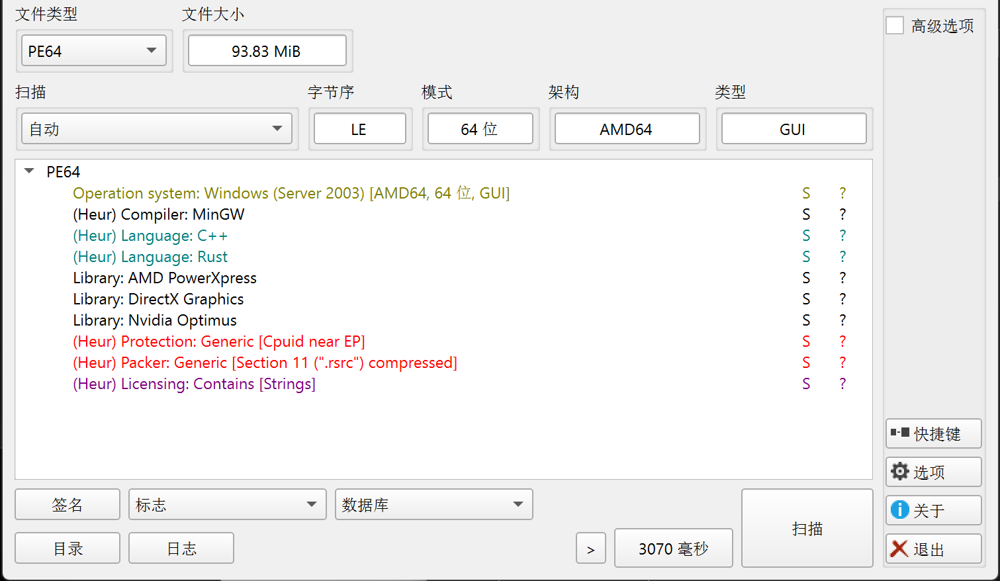

查看文件大小，发现文件大小高达93MB，对于一个普通的可执行程序来说，98MB的体积是非常大的，这暗示文件中可能包含了大量的游戏资源数据，或者和运行环境一起打包进去的情况。

查看程序运行的图标，我们发现这是一个**使用Godot游戏引擎开发的程序**。

简介：https://godotengine\.org/

用010editor打开，在程序末尾发现这些字段：

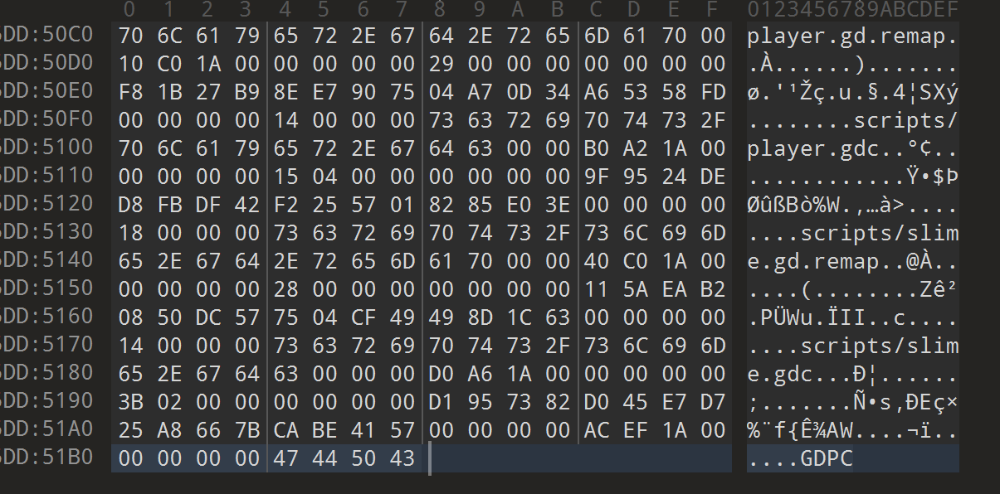

同时，尝试进入ida反编译，查找字符串scripts:

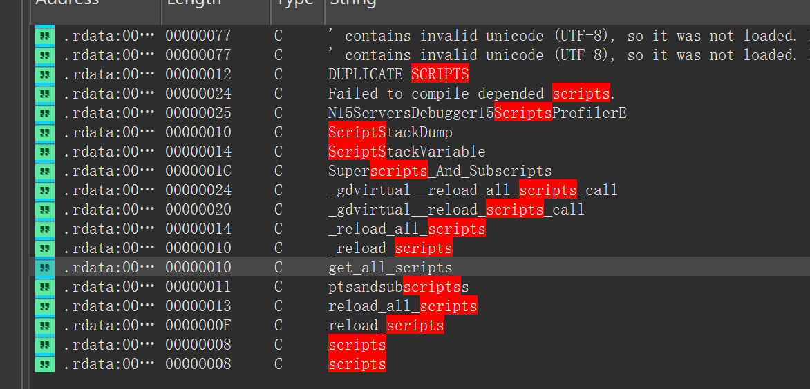

这进一步印证了这个程序的源代码是在引擎上面跑的，点击get\+all\_scripts。

上下翻找就发现了引擎的名字。

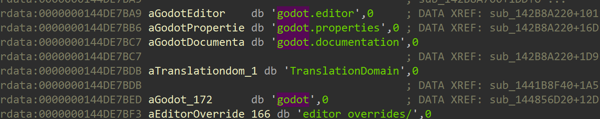

所以各个方面的证据表明，这是**使用Godot游戏引擎开发的程序。**

#### **Godot游戏引擎程序原理**

Godot是一个开源的2D/3D游戏引擎，使用自己的脚本语言GDScript（语法类似Python）。当Godot将游戏打包为可执行文件时，会将所有资源（脚本、图片、音频等）打包到一个PCK（Pack）文件中。

这个PCK文件可能是：

1. 独立的\.pck文件

2. 嵌入到exe文件中

Godot的PCK文件有一个固定的魔数标识：`GDPC`（Godot Pack的缩写）。

所以直接在文件中搜索这个魔数即可。


我们发现文件末尾就有，说明PCK资源包确实嵌入在exe文件中。

### 解题方法：GDRE逆向工具

#### 工具介绍

https://blog\.csdn\.net/gitblog\_00286/article/details/154820826

#### 源码分析

我们把程序拖入工具当中，项目就解包成源码文件了。


然后在里面找关键文件，发现关于flag验证的代码。

```JavaScript
extends CenterContainer

@onready var flagTextEdit: Node = $ PanelContainer / VBoxContainer / FlagTextEdit
@onready var label2: Node = $ PanelContainer / VBoxContainer / Label2

static var key = "FanAglFanAglOoO!" # AES key
var data = ""

func _on_ready() -> void :
    Flag.hide()

func get_key() -> String:
    return key

func submit() -> void :
    data = flagTextEdit.text # 接收flag输入

    var aes = AESContext.new() # AES加密,ECB模式
    aes.start(AESContext.MODE_ECB_ENCRYPT, key.to_utf8_buffer())
    var encrypted = aes.update(data.to_utf8_buffer())
    aes.finish()

    if encrypted.hex_encode() == "d458af702a680ae4d089ce32fc39945d": # 加密 flag
        label2.show()
    else:
        label2.hide()

func back() -> void :
    get_tree().change_scene_to_file("res://scenes/menu.tscn")

```

从这个脚本可以知道，这道题获取flag输入，将其AES加密，密钥是key，再判断与加密flag是否相等。

但是仔细看我们发现，key与之前游戏上面显示的不一样，这是怎么回事？

继续查看逆向代码文件，发现：

game\_manager\.gdc

```JavaScript
extends Node

@onready var fan = $ "../Fan"

var score = 0

func add_point():
    score += 1
    if score == 1:
        Flag.key = Flag.key.replace("A", "B")
        fan.visible = true

```

这段代码的含义是，如果吃了一个金币，就把key里面所有的A换成B。


于是我们编写解题脚本：

```Python
from Crypto.Cipher import AES
import binascii

key = b"FanBglFanBglOoO!"
cipher_hex = "d458af702a680ae4d089ce32fc39945d"
cipher_bytes = binascii.unhexlify(cipher_hex)

cipher = AES.new(key, AES.MODE_ECB)
plaintext = cipher.decrypt(cipher_bytes)

print("Decrypted (bytes):", plaintext)
print("Decrypted (string):", plaintext.decode('utf-8', errors='ignore').strip())
```


Flag: flag\{wOW\~youAregrEaT\!\}

## wasm\-login

题目描述：某人本想在2025年12月第三个周末爆肝一个web安全登录demo，结果不仅搞到周一凌晨，他自己还忘了成功登录时的时间戳了，你能帮他找回来吗？

提交格式为flag\{时间戳正确时的check值\}。是一个大括号内为一个32位长的小写十六进制字符串。

https://www\.freebuf\.com/articles/others\-articles/465702\.html

### 题目分析

解压题目压缩包后，得到如下文件结构：

```Plain Text
.
├── index.html           # 前端登录页面
├── crypto-js.js         # CryptoJS 库（提供 MD5 功能）
└── build/
    ├── release.js       # WASM JavaScript 胶水代码
    ├── release.wasm     # 编译后的 WebAssembly 二进制文件
    └── release.wasm.map # Source Map 文件
```

从文件结构可以看出，这是一个典型的 WebAssembly 应用。

此题要求算出对的时间戳。在index\.html中得到要求的MD5值就是flag。


先查看index\.html中的验证模块:

```HTML
<script src="crypto-js.js"></script>
  <script src="build/release.js"></script>
  <script type="module">
     import { authenticate } from "./build/release.js";
    // 初始化 WASM 模块
    async function initWasm() {
      const wasmStatus = document.getElementById('wasm-status');
      const loginForm = document.getElementById('login-form');
      const loginBtn = document.getElementById('login-btn');
      const loginSpinner = document.getElementById('login-spinner');
      const statusMessage = document.getElementById('status-message');
      const errorMessage = document.getElementById('error-message');
      const passwordInput = document.getElementById('password');
      const togglePasswordBtn = document.getElementById('toggle-password');
      
      try {

        // 初始化完成
        wasmStatus.textContent = 'WASM 已加载';
        wasmStatus.classList.add('text-success');
        
        // 切换密码可见性
        togglePasswordBtn.addEventListener('click', function() {
          const type = passwordInput.getAttribute('type') === 'password' ? 'text' : 'password';
          passwordInput.setAttribute('type', type);
          
          const icon = this.querySelector('i');
          const text = this.querySelector('span');
          
          if (type === 'text') {
            icon.classList.remove('fa-eye-slash');
            icon.classList.add('fa-eye');
            text.textContent = '隐藏';
          } else {
            icon.classList.remove('fa-eye');
            icon.classList.add('fa-eye-slash');
            text.textContent = '显示';
          }
        });
        
        // 登录表单提交处理
        loginForm.addEventListener('submit', async function(e) {
          e.preventDefault();
          
          // 显示加载状态
          loginBtn.disabled = true;
          loginSpinner.classList.remove('hidden');
          statusMessage.classList.add('hidden');
          
          try {
            const username = document.getElementById('username').value;
            const password = document.getElementById('password').value;
            
            // 调用 WASM 中的 authenticate 函数
            const authResult = authenticate(username, password);
            const authData = JSON.parse(authResult);
            
            // 模拟发送到服务器
            console.log('发送到服务器的数据:', authData);
            
            // 模拟服务器响应
            simulateServerRequest(authData)
              .then(response => {
                if (response.success) {
                  // 登录成功
                  alert('登录成功！');
                } else {
                  // 登录失败
                  showError(response.message || '登录失败，请重试');
                }
              })
              .catch(error => {
                console.error('登录错误:', error);
                showError('网络错误，请稍后重试');
              })
              .finally(() => {
                // 恢复按钮状态
                loginBtn.disabled = false;
                loginSpinner.classList.add('hidden');
              });
            
          } catch (error) {
            console.error('WASM 处理错误:', error);
            showError('内部错误，请联系管理员');
            
            // 恢复按钮状态
            loginBtn.disabled = false;
            loginSpinner.classList.remove('hidden');
          }
        });
        
        // 显示错误消息
        function showError(message) {
          errorMessage.textContent = message;
          statusMessage.classList.remove('hidden');
          
          // 添加动画效果
          const errorBox = statusMessage.querySelector('div');
          errorBox.classList.add('animate-shake');
          setTimeout(() => {
            errorBox.classList.remove('animate-shake');
          }, 500);
        }
        
        // 模拟服务器请求
        function simulateServerRequest(data) {
          return new Promise(resolve => {
            // 模拟网络延迟
            setTimeout(() => {
              // 实际应用中这里应该是真实的 API 请求
              // 这里仅作演示，使用本地判断
              const check = CryptoJS.MD5(JSON.stringify(data)).toString(CryptoJS.enc.Hex);
              if (check.startsWith("ccaf33e3512e31f3")){
                resolve({ success: true });
              }else{
                resolve({ success: false });
              }
            }, 1000);
          });
        }
        
      } catch (error) {
        console.error('WASM 加载失败:', error);
        wasmStatus.textContent = 'WASM 加载失败';
        wasmStatus.classList.add('text-danger');
        
        // 禁用登录按钮
        loginBtn.disabled = true;
        loginBtn.classList.add('bg-neutral-400');
        loginBtn.classList.remove('bg-primary', 'hover:bg-primary/90');
      }
    }
    
    // 页面加载完成后初始化 WASM
    window.addEventListener('load', initWasm);
  </script>
```

每一次加载网页时，就会调用`initWasm()`函数，说明JavaScript渲染网页的逻辑入口就是这个函数。

#### 发现测试账号

在源码末尾：

```HTML
<!-- 测试账号 admin 测试密码 admin-->
```

#### 发现MD5

注意到其中的重要函数

```JavaScript
// 模拟服务器请求
function simulateServerRequest(data) {
    return new Promise(resolve => {
        // 模拟网络延迟
        setTimeout(() => {
            // 实际应用中这里应该是真实的 API 请求
            // 这里仅作演示，使用本地判断
            const check = CryptoJS.MD5(JSON.stringify(data)).toString(CryptoJS.enc.Hex);
            if (check.startsWith("ccaf33e3512e31f3")){
                resolve({ success: true });
            }else{
                resolve({ success: false });
            }
        }, 1000);
    });
}
```

这段代码揭示了登录成功的真正条件：

1. 将认证数据`data`对象序列化为 JSON 字符串

2. 计算该 JSON 字符串的 MD5 哈希值

3. MD5 值必须以`ccaf33e3512e31f3`开头才能登录成功

这个发现非常重要：题目的成功条件并非简单的用户名密码匹配，而是需要构造特定的数据使其 MD5 哈希值满足前缀要求。

**说明目标时间戳生成JSON字符串对象的MD5开头为****`ccaf33e3512e31f3`****。**

#### 发现WASM函数

继续追踪script语句,发现调用此语句的部分，以及传入变量`authData`：

```JavaScript
simulateServerRequest(authData).then(response => {
    if (response.success) {
        // 登录成功
        alert('登录成功！');
    } else {
        // 登录失败
        showError(response.message || '登录失败，请重试');
    }
}).catch(error => {
    console.error('登录错误:', error);
    showError('网络错误，请稍后重试');
}).finally(() => {
    // 恢复按钮状态
    loginBtn.disabled = false;
    loginSpinner.classList.add('hidden');
});
```

继续追踪script语句,发现定义authData的语句。

```JavaScript
// 调用 WASM 中的 authenticate 函数
const authResult = authenticate(username, password);
const authData = JSON.parse(authResult);
```

我们发现，调用了WASM模块的authenticate函数，这个函数不是在JavaScript层的，而是在WebAssembly层的。

[WASM底层原理](https://blog.csdn.net/Triste__chengxi/article/details/148541107#:~:text=WASM%20%E7%9A%84%E6%8C%87%E4%BB%A4%E9%9D%9E%E5%B8%B8%E6%8E%A5%E8%BF%91%E5%BA%95%E5%B1%82%E6%9C%BA%E5%99%A8%E8%AF%AD%E8%A8%80%EF%BC%8C%E6%80%A7%E8%83%BD%E5%8F%AF%E8%BE%BE%E5%8E%9F%E7%94%9F%E5%BA%94%E7%94%A8%E7%9A%84%2080%25~90%25%E3%80%82%20%E7%BC%96%E8%AF%91%E5%90%8E%E7%9A%84%20.wasm%20%E6%96%87%E4%BB%B6%E5%8F%AF%E4%BB%A5%E5%9C%A8%E4%BB%BB%E6%84%8F%E6%94%AF%E6%8C%81%20WASM,%E7%9A%84%E7%8E%AF%E5%A2%83%E4%B8%AD%E8%BF%90%E8%A1%8C%EF%BC%8C%E5%A6%82%E6%B5%8F%E8%A7%88%E5%99%A8%E3%80%81Node.js%E3%80%81%E5%8C%BA%E5%9D%97%E9%93%BE%E8%BF%90%E8%A1%8C%E6%97%B6%E7%AD%89%E3%80%82%20%E8%BF%90%E8%A1%8C%E5%9C%A8%E6%B5%8F%E8%A7%88%E5%99%A8%E7%9A%84%20%E6%B2%99%E7%AE%B1%E7%8E%AF%E5%A2%83%E4%B8%AD%EF%BC%8C%E6%97%A0%E6%B3%95%E7%9B%B4%E6%8E%A5%E8%AE%BF%E9%97%AE%E6%96%87%E4%BB%B6%E7%B3%BB%E7%BB%9F%E6%88%96%E7%BD%91%E7%BB%9C%EF%BC%8C%E5%8F%AA%E8%83%BD%E8%AE%BF%E9%97%AE%E6%98%8E%E7%A1%AE%E6%8E%88%E6%9D%83%E7%9A%84%E8%B5%84%E6%BA%90%E3%80%82%20%E8%AE%BE%E8%AE%A1%E7%9B%AE%E6%A0%87%E4%B8%8D%E6%98%AF%E5%8F%96%E4%BB%A3%20JS%EF%BC%8C%E8%80%8C%E6%98%AF%E8%A1%A5%E5%BC%BA%E2%80%94%E2%80%94JS%20%E5%81%9A%E9%80%BB%E8%BE%91%E6%8E%A7%E5%88%B6%EF%BC%8CWASM%20%E5%A4%84%E7%90%86%E9%AB%98%E5%BC%BA%E5%BA%A6%E4%BB%BB%E5%8A%A1%E3%80%82)

WASM是一种 **低级字节码格式**，可由高级语言（如 C、C\+\+、[Rust](https://so.csdn.net/so/search?q=Rust&spm=1001.2101.3001.7020)）编译生成，并由浏览器中的 WebAssembly 引擎执行。

简而言之，**WASM 是浏览器中的一个“轻量虚拟机”**，它的目标是运行速度快、安全性高、体积小，适合执行计算密集型任务。

引入模块对应语句是：

```JavaScript
import { authenticate } from "./build/release.js";
```

其实authenticate的底层到底是怎么实现的我们不需要知道，因为本题目的目标是得到与题意相同开头的MD5就可以了，所以只需要**调用这个编译好的authenticate模块，执行时间戳爆破**即可。

#### 明确时间范围

**同时根据题意，时间范围是2025年12月第三个周末到周一凌晨。**

查看文件修改时间，范围可以进一步缩小：

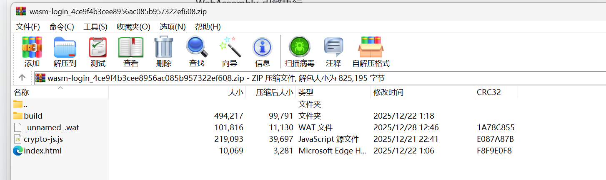

**大概就是2025年12月20日00:00:00到22日2:00:00之间。**

### 题目求解

编写解题脚本：

```JavaScript
import { authenticate } from "./build/release.js";
import CryptoJS from './crypto-js.js';

const start = new Date('2025-12-20T00:00:00Z').getTime();
const end = new Date('2025-12-22T02:00:00Z').getTime();
const originalNow = Date.now;

for (let ts = end; ts >= start; ts -= 1) {
    //每次尝试都临时修改 Date.now() 的返回值
    //调用 authenticate("admin", "admin") 函数，该函数很可能使用 Date.now() 生成动态凭证
    Date.now = () => ts; 
    console.log(ts);
    const authResult=authenticate("admin","admin");
    const data = JSON.parse(authResult);
    const check = CryptoJS.MD5(JSON.stringify(data)).toString(CryptoJS.enc.Hex);
    if(check.startsWith("ccaf33e3512e31f3")){
        console.log('MD5:', check);
        console.log('flag{'+check+"}");
        break;
    }
}
Date.now=originalNow;

```

跑了很久，最后结果返回`ccaf33e3512e31f36228f0b97ccbc8f1`。

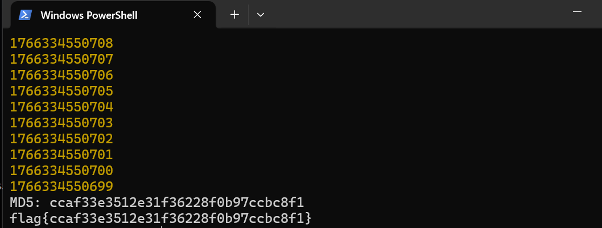

Flag: flag\{ccaf33e3512e31f36228f0b97ccbc8f1\}

## eternum

https://www\.freebuf\.com/articles/others\-articles/465700\.html

### 题目分析

题目提供了三个文件:

- kworker: Linux ELF可执行文件\(2\.4MB\)

- tcp\.pcap: 网络流量捕获文件\(9\.7KB\)

- run\.sh: 启动脚本

#### run\.sh:

```Shell
kworker 192.168.8.160:13337
```

说明这是会话ip的某一方。

#### tcp\.pcap:

打开流量包进行流量分析，发现这是TCP流量数据。

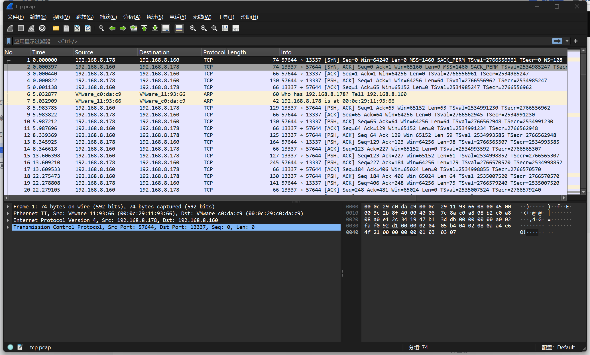

鼠标右键\-\>追踪流\-\>TCP Stream，查看传输数据。

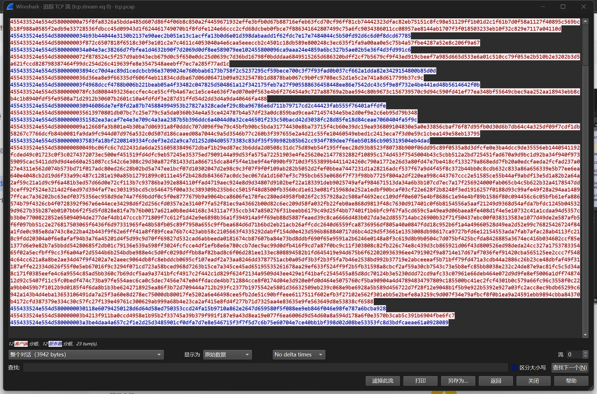

观察十六进制数据,发现一个明显的模式:每条消息都以`455433524e554d58`开头。转ASCII后为`ET3RNUMX`。

这是协议的魔数\(Magic Number\)。魔数"ET3RNUMX"中的"3"可以理解为"E",即"ETERNUMX",呼应题目名称"Eternum"\(永恒\)。


**什么是协议魔数?**

魔数是一个固定的字节序列,用于标识数据格式或协议类型,主要作用:

1. 快速识别数据类型 \- 例如PNG文件以`89 50 4E 47`开头

2. 防止解析错误 \- 确保接收到的是预期格式的数据

3. 协议同步 \- 在数据流中定位消息边界


对数据包的格式进行归纳，可以总结出协议格式:

|0\-7|8\-11|12以后|
|---|---|---|
|魔数\(ET3RNUMX\)|数据长度\(大端序\)|Data\(明文或者加密数据\)|

**为什么使用大端序?**

网络字节序通常使用大端序,这是一个历史约定:

- 大端序\(Big Endian\): 高位字节在前,如0x12345678存储为12 34 56 78

- 小端序\(Little Endian\): 低位字节在前,如0x12345678存储为78 56 34 12

- 网络传输使用大端序,便于不同架构的机器之间通信


但是，我们直接查看原始数据，发现data部分是不可读的，说明大概率被加密了，所以我们要对程序进行逆向工程。


#### kworker:

用IDA打开，发现程序加壳了，查壳工具发现是是UPX，需要脱壳。

脱壳之后进行逆向。

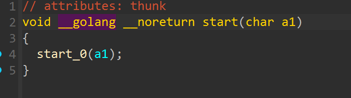

程序入口点的修饰符初见端倪，这不是C语言写的程序，而是Go语言。

查找字符串golang,发现：

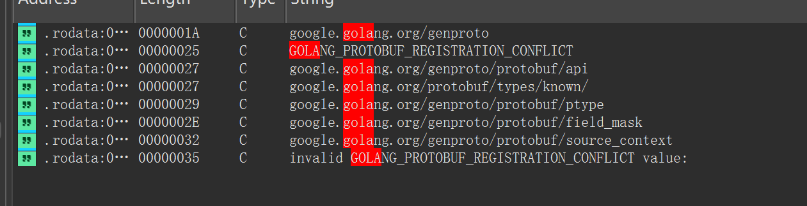

发现这是Go语言写的恶意程序，那么应该怎么下手呢？

https://blog\.csdn\.net/further\_eye/article/details/112506505中说道：

*Go语言类似于C语言，目标是一个二进制文件，逆向的也是native代码，它有如下特性：*

*● 强类型检查的编译型语言，接近C但拥有原生的包管理，内建的网络包，协程等使其成为一款开发效率更高的工程级语言。*

*● 作为编译型语言它有运行速度快的优点，但是它又能通过内置的运行时符号信息实现反射这种动态特性。*

*● 作为一种内存安全的语言，它不仅有内建的垃圾回收，还在编译与运行时提供了大量的安全检查。*

*尽管是编译型语言，Go仍然提供了一定的动态能力，这主要表现在接口与反射上，而这些能力离不开类型系统，它需要保留必要的类型定义以及对象和类型之间的关联，这部分内容无法在二进制文件中被去除，否则会影响程序运行，****因此在Go逆向时能获取到大量的符号信息，大大简化了逆向的难度，****对此类信息已有大量文章介绍并有许多优秀的的工具可供使用，例如go\_parser与redress，因此本文不再赘述此内容，此处推荐《Go二进制文件逆向分析从基础到进阶——综述》。*


那么我们需要知道，加密算法是标准的加密算法还是自定义的？加密算法的函数在哪里呢？根据Go硬编码源码的特性，尝试从字符串中搜索crypto。

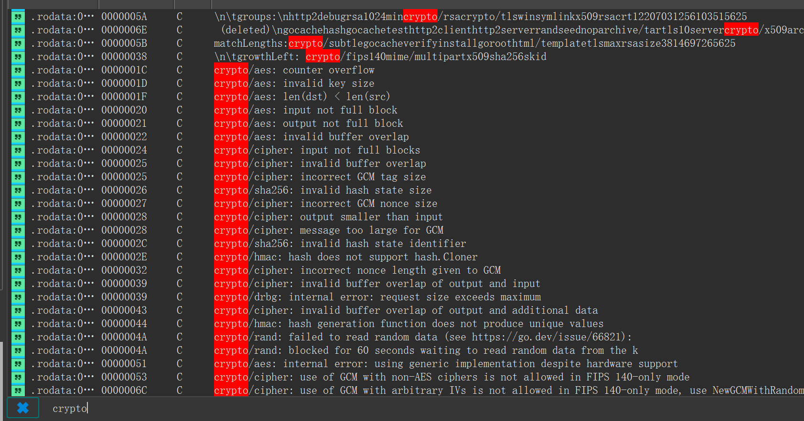

这个时候我们发现，crypto相关字符串有aes、sha256算法，sha256为哈希算法，只有aes是对称加密算法。

所以我们需要找到加密密钥和加密函数。先随机选一个字符串，比如`crypto/aes: len(dst) < len(src)`。

按下X键，交叉引用发现调用这个字符串的函数，根据这个函数的特征，以及其子函数的特征，这极大概率就是Go语言**AES加密**的主函数，加密模式为**GCM**，调用了`"crypto/aes"`这个库中的函数。

```C
__int64 __fastcall sub_612A60(__int64 a1, __int128 *a2, __int64 a3, __int64 a4, __int64 a5, __int64 a6)
{
  __int64 v6; // rax
  unsigned __int64 v7; // rbx
  unsigned __int64 v8; // r10
  __int64 v9; // r14
  __int128 v10; // xmm15
  __int64 v11; // rdx
  __int64 v12; // rbx
  __int128 v13; // kr00_16
  __int64 v14; // r9
  __int64 v15; // r10
  bool v16; // cc
  _OWORD *v17; // rax
  __int64 v18; // r9
  __int64 v19; // r8
  __int128 *v20; // rbx
  unsigned __int64 v21; // r10
  unsigned __int64 v22; // r11
  __int64 result; // rax
  bool v24; // cc
  __int64 v25; // [rsp-8h] [rbp-120h]
  __int128 v26; // [rsp+20h] [rbp-F8h] BYREF
  __int128 v27; // [rsp+30h] [rbp-E8h] BYREF
  __int128 v28; // [rsp+40h] [rbp-D8h] BYREF
  __int128 v29; // [rsp+50h] [rbp-C8h] BYREF
  unsigned __int64 v30; // [rsp+60h] [rbp-B8h]
  __int64 v31; // [rsp+68h] [rbp-B0h]
  __int64 v32; // [rsp+70h] [rbp-A8h]
  unsigned __int64 v33; // [rsp+78h] [rbp-A0h] BYREF
  unsigned __int64 v34; // [rsp+80h] [rbp-98h]
  __int64 v35; // [rsp+88h] [rbp-90h]
  unsigned __int64 v36; // [rsp+90h] [rbp-88h]
  __int64 v37; // [rsp+98h] [rbp-80h]
  __int128 v38; // [rsp+A0h] [rbp-78h]
  __int64 v39; // [rsp+B0h] [rbp-68h]
  __int64 v40; // [rsp+B8h] [rbp-60h]
  __int64 v41; // [rsp+C0h] [rbp-58h]
  __int64 v42; // [rsp+C8h] [rbp-50h]
  __int64 v43; // [rsp+D0h] [rbp-48h]
  __int64 v44; // [rsp+D8h] [rbp-40h]
  __int128 *v45; // [rsp+E0h] [rbp-38h]
  __int128 *v46; // [rsp+E8h] [rbp-30h]
  __int128 *v47; // [rsp+F0h] [rbp-28h]
  __int128 *v48; // [rsp+F8h] [rbp-20h]
  __int128 *v49; // [rsp+100h] [rbp-18h]
  __int128 *v50; // [rsp+108h] [rbp-10h]
  __int64 v51; // [rsp+120h] [rbp+8h]
  _OWORD *v52; // [rsp+128h] [rbp+10h]
  __int64 v53; // [rsp+138h] [rbp+20h]
  unsigned __int64 v56; // [rsp+158h] [rbp+40h]

  if ( (unsigned __int64)&v33 <= *(_QWORD *)(v9 + 16) )
  {
LABEL_37:
    *(_QWORD *)&v26 = a2;
    *((_QWORD *)&v26 + 1) = a5;
    *(_QWORD *)&v27 = a6;
    *((_QWORD *)&v27 + 1) = v8;
    sub_480160();
  }
  if ( a5 > a4 )
  {
LABEL_36:
    sub_47A3E0(v25); // "crypto/aes: len(dst) < len(src)" 字符串
    goto LABEL_37;
  }
  v51 = v6;
  v56 = v8;
  v52 = (_OWORD *)v7;
  v53 = a1;
  if ( a5 && a2 != (__int128 *)v7 && (unsigned __int64)a2 + a5 - 1 >= v7 && a5 + v7 - 1 >= (unsigned __int64)a2 )
  {
    sub_47A3E0(v25);
    goto LABEL_36;
  }
  sub_604EA0();
  v11 = v56 >> 4;
  v12 = v56 & 0xF;
  if ( (v56 & 0xF) != 0 )
  {
    v13 = (v56 >> 4) + *(_OWORD *)(v51 + 488);
    v35 = *((_QWORD *)&v13 + 1);
    v31 = v13;
    v29 = v10;
    v27 = v10;
    v44 = (unsigned __int8)((v12 - 16) >> 63) & (unsigned __int8)v56 & 0xF;
    v14 = a5;
    v15 = 16 - v12;
    if ( a2 == (__int128 *)((char *)&v29 + v44) )
    {
      v16 = a5 <= v15;
    }
    else
    {
      v43 = 16 - v12;
      sub_482C20();
      v16 = a5 <= v43;
      v14 = a5;
      v15 = v43;
    }
    if ( !v16 )
      v14 = v15;
    v32 = v14;
    ((void (*)(void))sub_613400)();
    v11 = v44;
    v17 = v52;
    if ( v52 != (__int128 *)((char *)&v27 + v44) )
    {
      sub_482C20();
      v17 = v52;
    }
    v18 = a6 - v32;
    a1 -= v32;
    a2 = (__int128 *)((char *)a2 + (v32 & ((v32 - a6) >> 63)));
    v19 = a5 - v32;
    v20 = (_OWORD *)((char *)v17 + (v32 & ((v32 - v53) >> 63)));
    v21 = v31 + 1;
    v22 = __CFADD__(v31, 1) + v35;
  }
  else
  {
    v20 = v52;
    v18 = a6;
    v19 = a5;
    v22 = ((v56 >> 4) + *(_OWORD *)(v51 + 488)) >> 64;
    v21 = (v56 >> 4) + *(_QWORD *)(v51 + 488);
  }
  for ( result = v51; ; result = v51 )
  {
    v44 = v19;
    v50 = v20;
    v43 = v18;
    v49 = a2;
    v42 = a1;
    v33 = v22;
    v36 = v21;
    if ( v19 <= 127 )
      break;
    sub_613640(v21, v22, v11, a2);
    v18 = v43 - 128;
    a2 = (__int128 *)((char *)v49 + (((128 - v43) >> 63) & 0x80));
    a1 = v42 - 128;
    v11 = ((128 - v42) >> 63) & 0x80;
    v20 = (__int128 *)((char *)v50 + v11);
    v19 = v44 - 128;
    v21 = v36 + 8;
    v22 = __CFADD__(v36, 8) + v33;
  }
  if ( v19 >= 64 )
  {
    sub_613580(v21, v22, v11, a2);
    v18 = v43 - 64;
    a1 = v42 - 64;
    a2 = (__int128 *)((char *)v49 + (((64 - v43) >> 63) & 0x40));
    v11 = v44 - 64;
    v20 = (__int128 *)((char *)v50 + (((64 - v42) >> 63) & 0x40));
    v21 = v36 + 4;
    v22 = __CFADD__(v36, 4) + v33;
    result = v51;
    v19 = v44 - 64;
  }
  if ( v19 >= 32 )
  {
    v41 = a1;
    v40 = v19;
    v48 = v20;
    v39 = v18;
    v47 = a2;
    *((_QWORD *)&v38 + 1) = v22;
    *(_QWORD *)&v38 = v21;
    sub_6134C0(v21, v22, v11, a2);
    v18 = v39 - 32;
    a1 = v41 - 32;
    a2 = (__int128 *)((char *)v47 + (((32 - v39) >> 63) & 0x20));
    v11 = v40 - 32;
    v20 = (__int128 *)((char *)v48 + (((32 - v41) >> 63) & 0x20));
    v22 = (v38 + (unsigned __int128)2uLL) >> 64;
    v21 = v38 + 2;
    result = v51;
    v19 = v40 - 32;
  }
  if ( v19 >= 16 )
  {
    v44 = a1;
    v37 = v19;
    v46 = v20;
    v43 = v18;
    v45 = a2;
    v34 = v22;
    v30 = v21;
    sub_613400(v21, v22, v11, a2);
    a2 = (__int128 *)((char *)v45 + (((16 - v43) >> 63) & 0x10));
    v20 = (__int128 *)((char *)v46 + (((16 - v44) >> 63) & 0x10));
    v21 = v30 + 1;
    v22 = __CFADD__(v30, 1) + v34;
    result = v51;
    v19 = v37 - 16;
  }
  if ( v19 )
  {
    v50 = v20;
    v28 = v10;
    v26 = v10;
    if ( a2 == &v28 )
    {
      v24 = v19 <= 16;
    }
    else
    {
      v44 = v19;
      v33 = v22;
      v36 = v21;
      sub_482C20();
      v24 = v44 <= 16;
      v19 = v44;
      v21 = v36;
      v22 = v33;
    }
    if ( !v24 )
      v19 = 16;
    v44 = v19;
    sub_613400(v21, v22, &v28, &v28);
    result = (__int64)v50;
    if ( v50 != &v26 )
      return sub_482C20();
  }
  return result;
}
```

接下来我们需要找密钥，AES支持三种密钥长度：**128位、192位和256位**，相当于**16字节、24字节、32字节**，每种长度适用于不同的安全需求和应用场景。

尝试搜索32为字符串：

```PowerShell
strings .\kworker | Select-String '^.{32}$'
```

返回结果：

```Plain Text
internal/bytealg.IndexByteString
internal/abi.(*FuncType).InSlice
......
iupHvc2q4.(*JknAcmzt).Descriptor
xfqGcVjrOWp5tUGCPFQq448nPDjILTe7
```

我们发现`xfqGcVjrOWp5tUGCPFQq448nPDjILTe7`极有可能是真正的密钥，放在IDA里面搜搜看。

我们发现：

```Plain Text
.noptrdata:000000000098F740 aXfqgcvjrowp5tu db 'xfqGcVjrOWp5tUGCPFQq448nPDjILTe7',0
.noptrdata:000000000098F740                                         ; DATA XREF: .data:off_99B220↓o
.noptrdata:000000000098F761                 align 4

.data:000000000099B220 off_99B220      dq offset aXfqgcvjrowp5tu
.data:000000000099B220                                         ; DATA XREF: sub_658CA0+29↑r
.data:000000000099B220                                         ; sub_658DE0+AE↑r
.data:000000000099B220                                         ; "xfqGcVjrOWp5tUGCPFQq448nPDjILTe7"
```

```C
__int64 __fastcall sub_658DE0(__int64 a1, __int64 a2, __int64 a3, __int64 a4)
{
  __int64 v4; // rax
  __int64 v5; // rbx
  __int64 v6; // r14
  __int64 v7; // rax
  __int64 v8; // rdx
  __int64 v9; // rcx
  unsigned __int64 v10; // rcx
  char *v11; // rdi
  _UNKNOWN *retaddr; // [rsp+0h] [rbp+0h] BYREF
  __int64 v14; // [rsp+8h] [rbp+8h]

  if ( (unsigned __int64)&retaddr <= *(_QWORD *)(v6 + 16) )
    sub_480160();
  if ( v5 >= 12
    && (v14 = v4, v7 = sub_6584A0(), (unsigned __int8)sub_658FA0(v7, v5, v8, a4, v9))
    && (v10 = _byteswap_ulong(*(_DWORD *)(v14 + 8)) + 12, v5 >= (__int64)v10) )
  {
    if ( v10 < 0xC )
      sub_482320();
    v11 = off_99B220; // xfqGcVjrOWp5tUGCPFQq448nPDjILTe7
    sub_6586C0(off_99B220, qword_99B228, v14, a4 - 12, qword_99B230);
    if ( v11 )
      return 0;
    else
      return sub_658A60();
  }
  else
  {
    sub_502B00();
    return 0;
  }
}

__int64 __fastcall sub_6586C0(__int64 a1, __int64 a2, __int64 a3, unsigned __int64 a4)
{
  __int64 v4; // rax
  __int64 v5; // rbx
  __int64 v6; // r14
  __int128 v7; // xmm15
  __int64 v8; // rdx
  __int64 v9; // rcx
  __int64 v10; // rax
  __int64 v11; // rcx
  __int64 v12; // rax
  __int64 v14; // [rsp+68h] [rbp-18h]
  _UNKNOWN *retaddr; // [rsp+80h] [rbp+0h] BYREF
  __int64 v16; // [rsp+88h] [rbp+8h]

  if ( (unsigned __int64)&retaddr <= *(_QWORD *)(v6 + 16) )
    sub_480160();
  v16 = v4;
  sub_61C360();
  if ( v9 )
    return 0;
  v10 = sub_61ADC0(a1, a2, v8);
  if ( v11 )
    return 0;
  v14 = v10;
  v12 = (*(__int64 (**)(void))(v10 + 24))();
  if ( v12 > v5 )
  {
    sub_502B00();
    return 0;
  }
  else
  {
    if ( v12 > a4 )
      sub_4822E0();
    return (*(__int64 (__fastcall **)(_QWORD, __int64, __int64, _QWORD, __int64, unsigned __int64, __int64, __int64, unsigned __int64, _QWORD, _QWORD, _QWORD))(v14 + 32))(
             0,
             v16,
             v16 + (v12 & ((__int64)(v12 - a4) >> 63)),
             0,
             v12,
             a4,
             v16 + (v12 & ((__int64)(v12 - a4) >> 63)),
             v5 - v12,
             a4 - v12,
             v7,
             *((_QWORD *)&v7 + 1),
             0);
  }
}

__int64 __fastcall sub_61ADC0(__int64 a1, __int64 a2, __int64 a3)
{
  __int64 v3; // r14
  _QWORD *v4; // rax
  _UNKNOWN *retaddr; // [rsp+0h] [rbp+0h] BYREF

  if ( (unsigned __int64)&retaddr <= *(_QWORD *)(v3 + 16) )
    sub_480160();
  if ( !byte_9CB46C )
    return sub_61AE60(16, a2, a3, 12);
  v4 = (_QWORD *)runtime_newobject();
  v4[1] = 108;
  *v4 = "crypto/cipher: use of GCM with arbitrary IVs is not allowed in FIPS 140-only mode, use NewGCMWithRandomNonce";
  return 0;
}
```

```Plain Text
'xfqGcVjrOWp5tUGCPFQq448nPDjILTe7' -> off_99B220 -> sub_658DE0 -> sub_61ADC0 -> "crypto/cipher: use of GCM with arbitrary IVs is not allowed in FIPS 140-only mode, use NewGCMWithRandomNonce"
```

从代码的精确调用过程可能难以找到，但是这个大概率就是密钥了。


AES\-GCM 加密简介

https://zhuanlan\.zhihu\.com/p/828343043

文章中说：

*先对块进行顺序编号，然后将该块编号与初始向量\(IV\)组合，并使用密钥k，对输入做AES加密，然后，将加密的结果与明文进行XOR运算来生成密文。像CTR模式下一样，应该对每次加密使用不同的IV。对于附加消息，会使用密钥H\(由密钥K得出\)，运行GMAC，将结果与密文进行XOR运算，从而生成可用于验证数据完整性的身份验证标签。最后，密文接收者会收到一条完整的消息，包含IV\(计数器CTR的初始值\)、密文、身份验证标签\(Tag\)。*

|0\-7|8\-11|12\-23|24之后|后16字节|
|---|---|---|---|---|
|魔数\(ET3RNUMX\)|数据长度\(大端序\)|IV|CipherText|Tag|

### 题目求解

从题目分析可以知道，加密算法为AES，密钥是`xfqGcVjrOWp5tUGCPFQq448nPDjILTe7`，加密模式为GCM。

所以可以提取流量分析的数据进行解密：

```Python
from Crypto.Cipher import AES
import codecs
tcps="""455433524e554d5800000034c96e7de65400a76b2122b0584b544c1d99760e0a2d9e91e81673bf99172ee000e690a58c8431a2fab77bd4a304ed89d5964e872e
455433524e554d5800000033c8250252aab6d388bd562cee09f4ce88dad989dcc4d50f400b2c2c99b0e667ecc635b0d26fd5f3fafab1c67a883bc380c3f726
455433524e554d5800000034d70228e9e42faa665cd6fad4f3a943ae4d16464a94ac2fa7976300c1db22d78caec13b77c9b82b8c3fc92732e96a8389ed2992f7
455433524e554d580000002f12d29894ae5835bed448531df3e9b2c1e286b82715660d985dc6003af0787b361ede4cd277cbc19574c4c412a8ef7d
455433524e554d580000005674e53ec9890140f222055846f60152892972b1cc1fa94a9b4055235a59a6a868a133f7676d14d8466a6606575bed32589b521d95e8e30600ad764f5344e26751a7d16fc059cbe9931d73f11ae406b4390ac75bfab27f
455433524e554d5800000031974d385b582644a3b9645621c3bec8807b21e3bc408cd4d9107d75445fb598a0a6b85d6ab0f2f1a35e8dd07be9d62a96ff
455433524e554d58000000a75f8fa8326a5bdda485d607d86f4f06b8c850a2f4459671932effe3bfb0d67b88716efeb63fcd70cf96ff81cb74442323dfac82eb75151c8fc98e51129ff1b01d2c1f61b7d0f58a1127f40895c569bcb18f988a0585f2edb9e33728536fdbcc45d09943d1f624461749070b1f8fdfe124e66ccc2cfd68dcbeb0fbce7f886341642807499c75a6fc9034386011cc08957ae8144ab1707f3f018503233eb10f32c829e7117a04110d
455433524e554d5800000034b93b44044e3130b2137e90aec2b051e13c1acffa13b0d6e01d398dabaadd1f62fdc7e17e7484044c5b50fd92d6c6d0f8dcd67785
455433524e554d580000003f872c6507818f6518c30f3e101c2e7c4611c4053040a4e6caa5eeeccb2c4501c18db589e800248c3ec635f1fa9a00aa0e5c75b4a57fbe4287a52e8c206f9a67
455433524e554d5800000034a04e3ac38266d7fbfea1d4632b90f7d2069d0df8ee589079ee102455800096ca9aaa24e4859a6bc327b5ae02b5e36f4d3fd991c6
455433524e554d5800000072f878524c5f257d9ab943ecb679d0c5f650e0dc25d0639c7d36bd16798f0bdddaa6849515265d686320bdff2cf7b5679cf9f43ed919cbeef7a985d665d533e6a01c510cc79f053e2b510b2e3202b3d5a621fccd828798387464f99dc254d26c419639fe8e3547548aeebff7ec7a285f77ad1c
455433524e554d580000003894cc70d4ac89d1cedcbcb96e3709024e760bbab6173b758f2c5237295cf59bece700c3f7f93fad0b037cf662a1dda82e3429154800b85d0d
455433524e554d5800000036d36ea8e9f66335df606f4eb11834cddba67d06d06471b09a92325478b1d8878bab067c9b0fc9708ec52d1e5c2e741a8d617799b37c9c
455433524e554d580000003f4968dccf4788b006b221beab05a4f33482c047825d504861a12f342175feb7a27f905588636458448ee86e7542dc43c5f9e8f732e4be441ed48b5614642f0b
455433524e554d5800000078fc3d8084493236eccfec4ce55cffb4a67ac1e5ce4e636f7ed070e0f563e4b6f276454a9c727a88769a2bae594c80b9673c156739570c9d94c590fd41ef77ea348bf55649cbec9aa252aa18943ebb8cb4c1b8940fdf5fe9508a71d2912b30607b2601c10a4fdfdf3e287d31ffd54d2dd3d4a9da40646fa488
455433524e554d5800000030946086de7ef8fd2a87b745884994953b27827a328cadef29c8ba96786e6d711b79717cd2c44423fab555f76401affdfe
455433524e554d5800000035613970801db07bc7c25e779c5a5da0360b34e4a53ce424787b4a57df23a0dc859bad9cea471457434e5be2d0ef9e2c6eb95d79b348
455433524e554d58000000351582ea3acaf7e4e3e709c4a3aa2387b5b396ddc6a4044d0a32ce46501f233c50bacd42d3038fc28d85fe18d84ceae7060404fa5f9c
455433524e554d580000009a12668fa3b801e4b30ba7d06931a8f0dddc707d096f9e79c45bfb90bc5bda31774430e8ba73715f4cb60e39dc19ea936809104830e5a0e33856cbaf76f87d95fb0d30d6b7db64c4a325df09f7cdf1db58267c7766dcfb84b0081fa9da9fc944d07d976a532c0d507d186caaed08a7044c9a5d3546b77c260b3f397655e2a4d21c55fe10460549ebed1c2413eca7f3d0e59c1cbea149e58eb13795
455433524e554d5800000037583fa18bf2208149334fcdef3e2d2a9ca7d1252d04d05573383c83df35f59b982b85b62cc934f789dee7f6eb50186cb905319504eb4dad
455433524e554d580000080049bc06fc6c7d22431da6da25160583849672dbaf1b29ed87ec3b6dda2d0508c31dc75d89eb54f195ffeec28d93b8523f80738b900f06dd95c89f0535a8d3dfcfe0e3ba4dcc9de35556eb1440541192fcded49c01723c0f3c0274372073ec500ef451519fd4dfc9eb57245e35375ed7909144a99d53fa575a72251903e4fe25620e21477832882f10895c174d453f7545004b43c5cbb512a2bd725451fad670a9d9bc1d92ba34f940f97359095cac5411dd9d9d4e660a251087cc542c6e308c29d30a872f81433d1a866715dca84f5f4e1be9f4ef090bf9710d3f553899b4411424260c790a1772e26d3a80fd47e7be418cf133279a868edd7fb20a0edcfaeda2fcfad237a027e4311e562d074b573bd71f017adc80ed26c28b02bd5a747ee1bcf07d10302047d2e98c9c3f07f9f0f109ab282b5052d2fef0bbea7447231d1a28216adcf537f67a9d4f45f8c372b44bb0c8cdb632c833a86a656339e5b77ee6ea640e4048cb2d19d6f33a99c487c1281e190a85b12791899c0111e45f2b428db843667ac0dc3ec067da1d1607ef3c795bcb653e0686f7f73f98bb7725f804a2df220ea998c443767ccc2e51585ce55b44af9abdf13e5d1a82b2a64a2af59c21a1d9c9f6a481b3ed57d66d0e72cf113b7c93786ba392e884110ffad4719aec924e8d9d34807d9102bef22a183391deb9025749afaf984671513da34a6b3b107cd7ec7a17f256924000fab065cb4c5b622b32a4178547dd3ceff92f524e3214d2f6ed97d394faf7ec303195bcd5cb546475f00a33c389309b235b6cc5015f48d8500fb3560cd1e613e081f15968de252a1edbf90bcaf03cf22e628f2b8248f3ed1916257f0188d93c99afe49f28a294aa14897ffcac7a36202bc63edf0375356ec958d9de74a7f69bddf0c5f0e8777679b9a9064bca8606fe178fec280ed4958fb026f2c357928a2c508af4692ecc109dff0e6075e4bf8686c1e94e4bf89b1586f80c094456c6c05bfb61efa886574b79f4326cb4f0728392f967e6e44ece34298d6f2d256cfd0357e2e3140f7fa52f81ec9a43662b00d82c6ec209d58fa032fb22feb0ae868d9813f48c7630d917401c0f6b8154556a5aaf21249d9368d54afda7bfdc1245b045329d9627b35b287eb0107bb6f2f5d5fd828e81fa7b76b0017a621a0b8ed44168c34311a7f35ccb347a850276f31beebb6179c49d25f4bb77401f1b6bfc9f67fa5cd659c5a49ea9d06baea8fe408d1f4e5e10732c41a1cdaa94d5357cb3b0e7700822852e65094094de277def4db147cccb771809f7c612f1d42e9e6898b36a1f394914a9ff69eb88d5887feaed39c8ca6666d483b027da3e2d855714abc26900b32f71f50437ebc00f038313583e1077d49de2e587afb5f6f097bb51c2e276817503065f6436f6d97331965fe48b58fb05c89f7950a655c9ffbea684d6d71b6bd2eb21acb26affcdc2640d6559fca8736956df805a40a0847fdd18c952b6f1a4a49660528d49ea2d52e99c76825426724f84a1fde0c985e8da743c8e22ba42b443f9f62e6fff41a8ff89fcea76b7c423abb58c2105663f4335292dabff154d0e423d596b868840717d6bc4d29d5f3661e1353008db98617ca9727bfd6e12154553ada7fab7afac28ab4113fc218c9fdd20304a0f6e8afaf94b3a76a45201d4f5d99c9d70ff69827d532cad6abbeeda0181674cb87607ba84e73bd8ddbf690f65e9591a2b6246e0148a8f3c619d8b9b0504c7d075bf425bcfda8426885a3674ec416b034602ccf85e1377d6e9e82b7a5bbdd54280685f2db01c79136e539a598ff3024fcfcce4df1efb8e6e780ccb7dec9ac99d0dfb416f9cd7a87f0bc9c11f303808c82fb226c74e8c439d3cb865921d06f43d800526ed98deda24cc327a175378335465f02a5ecfbff9cc3f6a04af2d5544b6b254bdbe988e4c5d0fc0298dffbb8af82bad8c6f06d281ee133ec808894582b1fd645419e94d675b6f622020936396ee4791902f9a8714e17d67af7036fef91420cba565125ee2ccc7f5484c64cc621a8a8be2ae34d47f9f4202a7e2aeec9064db8fc8ebddcb0695cf107eadf2a73aa8246dd3787751acb0a05df3b3f2b3f5fa7b46e2538bd992b37719e2abceeeaf5b71bff79fd471a3cdb44a2886c26b23ce48dbfaf49f31187affe22334d626f55f0e5eb67016f9c3294f071cd723a58bced968d7263b15ce7a345ce45ad65195535261678aa29ef633f524ff9f2b5fb31598a8cbcf2af59a30cb7543c73e5b8efc85bb8038e232c24de87e9ac81fc5c5d34a8c171f0385eefe4c6a9554c85ad5bb360c7b69dcf5aa9a3741bfcf4917c2f442c1d829f624f2134a9509d43ee429e1f41bafc2545455a85d8dc70124b3e5230ddd72cd9afc33c07961e66deb464e072d9d9fe8ef5006a1dff7487412d92c5407f11c5fc0bedf474c73ba97fe554aec6ca0c5dec7456e747e04ffdacde4bb712884cce8f0174d04e3d920e0fd0d464e5075760cf5ba90904a4d47894834797809c185500bc41ec2fcf4301b0c579a66fc96c3558f0c22a9bb0459b7f1012b9d0185f4f6da8b1b3be6242718925ea86f3b72d709444a712b293fc2377b1975542e5801d36632509eb239c068e9be6928a5b589d456722d7f28f12e9048b1f5b9e922b5392e927a03fc2acc8ec9bdb65299c6942a143b4d4eba13653106491da7a25f3a60e8d278ec75000db80017fe5202a6e46498cee5fb2de51c90bffeee6117511f602efb3f27102e562f301ebb5e2befe8a3259c9d007f34e79afbcf8f0b1ea9a24591ebb9894cbba84370b4172cfd387379e334c30c57fc27f139e49761c300629ab999a68b4e23ca2af415e8fd4f277b71d7325aa4e83635e9fe563649d8e53838cf6588
455433524e554d5800000030118e60794250128d6d64d58ed750353ccd24fa15b9710a862e2647d659580f5f088ee9eb846f046e98fe787a6bcba928
455433524e554d580000003b4213f911ba0ccd4958e1b95b2f33745a39b379f991f187e9a43d8ea19e077f6ea6006d9d54d60a8a594d178a6f0e3570b3cab5c391b6904fbe6fc7
455433524e554d580000003a3be4daa4a657c2f1e2d25d3485901cf0dfa7d7e8e546715f3f7f5d7c6b75e60704e7ce40bb1bf398d02d08be53353fc8d3bdfcaeae61a0928089""".split("\n")

# strings .\kworker-unp | Select-String '^.{32}$'

tcps=[codecs.decode(i[24:],'hex') for i in tcps]
key=b"xfqGcVjrOWp5tUGCPFQq448nPDjILTe7"

for i in range(len(tcps)):
    iv = tcps[i][0:12]
    cipher = tcps[i][12:-16]
    tag = tcps[i][-16:]
    decrypt =AES.new(key, AES.MODE_GCM, nonce=iv).decrypt_and_verify(cipher, tag)
    print(decrypt)

```

解密结果：

```Plain Text
b'(\xb5/\xfd\x04\x00Y\x00\x00\x08\x04\x12\x07\n\x05viper;#\xc2\xa7'
...
b'(\xb5/\xfd\x04\x00y\x02\x00\x08\x01\x12K\x12IMZWGCZ33MI3WGNJYG4YDALJSMIYDCLJUMRSDILJYGUZDMLLBGRQTIN3BGY2WCMLBHF6QU===\n\xa1o\xf2\x12'
...
b'(\xb5/\xfd\x04\x00\x89\x00\x00\x12\x0f\n\rpkill kworker\xc1C\xaf\x7f'
```

其中这条最可疑：

```Plain Text
b'(\xb5/\xfd\x04\x00y\x02\x00\x08\x01\x12K\x12IMZWGCZ33MI3WGNJYG4YDALJSMIYDCLJUMRSDILJYGUZDMLLBGRQTIN3BGY2WCMLBHF6QU===\n\xa1o\xf2\x12'
```

提取Base32字符串`MZWGCZ33MI3WGNJYG4YDALJSMIYDCLJUMRSDILJYGUZDMLLBGRQTIN3BGY2WCMLBHF6QU===`

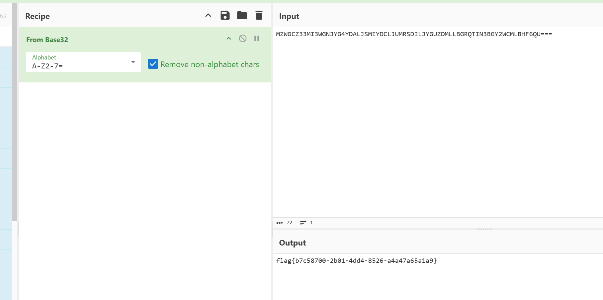

Flag: flag\{b7c58700\-2b01\-4dd4\-8526\-a4a47a65a1a9\}

## vvvmmm

https://www\.freebuf\.com/articles/others\-articles/465701\.html

https://qmeimei10086\.github\.io/2025/12/28/%E9%95%BF%E5%9F%8E%E6%9D%AF%E5%88%9D%E8%B5%9B\-2025\-vvvmmm\-%E6%9C%80%E5%A4%B1%E8%B4%A5%E7%9A%84%E4%B8%80%E9%9B%86/

### 题目概况

尝试运行程序：

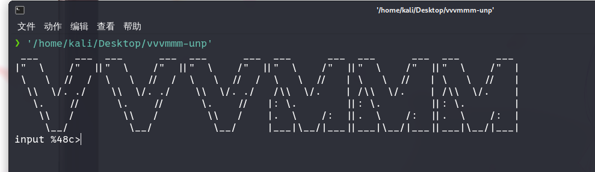

这个格式说明符非常关键。`%48c`表示程序会读取固定的48个字符。我们需要提供恰好48字节的输入。

如果输入错误,程序返回"Try again\~";如果输入正确,程序输出"Good\."并显示flag。

逆向后发现被upx加壳，脱壳，打开后，主函数的逻辑：

```C
__int64 __fastcall sub_401C60(__int64 a1, __int64 a2, __int64 a3, __int64 a4, int a5, int a6)
{
  bool v6; // zf
  _UNKNOWN **v7; // rdx
  _BOOL4 v8; // ecx
  int v9; // eax
  int v10; // eax
  int v11; // edx
  int v12; // ecx
  int v13; // r8d
  int v14; // r9d
  int v15; // edx
  int v16; // ecx
  int v17; // r8d
  int v18; // r9d
  __int64 v19; // r12
  __int64 v20; // rax
  int v21; // eax
  char v23[4]; // [rsp+0h] [rbp-160h] BYREF
  _BOOL4 v24; // [rsp+4h] [rbp-15Ch]
  _BOOL4 v25; // [rsp+8h] [rbp-158h]
  _BOOL4 v26; // [rsp+Ch] [rbp-154h]
  _BOOL4 v27; // [rsp+10h] [rbp-150h]
  _BOOL4 v28; // [rsp+14h] [rbp-14Ch]
  _BOOL4 v29; // [rsp+18h] [rbp-148h]
  _BOOL4 v30; // [rsp+1Ch] [rbp-144h]
  _BOOL4 v31; // [rsp+20h] [rbp-140h]
  _BOOL4 v32; // [rsp+24h] [rbp-13Ch]
  _BOOL4 v33; // [rsp+28h] [rbp-138h]
  _BOOL4 v34; // [rsp+2Ch] [rbp-134h]
  _UNKNOWN **v35; // [rsp+30h] [rbp-130h]
  _UNKNOWN **v36; // [rsp+38h] [rbp-128h]
  _UNKNOWN **v37; // [rsp+40h] [rbp-120h]
  _UNKNOWN **v38; // [rsp+48h] [rbp-118h]
  _UNKNOWN **v39; // [rsp+50h] [rbp-110h]
  _UNKNOWN **v40; // [rsp+58h] [rbp-108h]
  _UNKNOWN **v41; // [rsp+60h] [rbp-100h]
  _UNKNOWN **v42; // [rsp+68h] [rbp-F8h]
  _UNKNOWN **v43; // [rsp+70h] [rbp-F0h]
  _UNKNOWN **v44; // [rsp+78h] [rbp-E8h]
  _UNKNOWN **v45; // [rsp+80h] [rbp-E0h]
  _UNKNOWN **v46; // [rsp+88h] [rbp-D8h]
  _UNKNOWN **v47; // [rsp+90h] [rbp-D0h]
  _UNKNOWN **v48; // [rsp+98h] [rbp-C8h]
  _UNKNOWN **v49; // [rsp+A0h] [rbp-C0h]
  _UNKNOWN **v50; // [rsp+A8h] [rbp-B8h]
  _UNKNOWN **v51; // [rsp+B0h] [rbp-B0h]
  _UNKNOWN **v52; // [rsp+B8h] [rbp-A8h]
  _UNKNOWN **v53; // [rsp+C0h] [rbp-A0h]
  _UNKNOWN **v54; // [rsp+C8h] [rbp-98h]
  char *v55; // [rsp+D0h] [rbp-90h]
  char *v56; // [rsp+D8h] [rbp-88h]
  char *v57; // [rsp+E0h] [rbp-80h]
  char *v58; // [rsp+E8h] [rbp-78h]
  int v59; // [rsp+F4h] [rbp-6Ch]
  int v60; // [rsp+F8h] [rbp-68h]
  int v61; // [rsp+FCh] [rbp-64h]
  int v62; // [rsp+100h] [rbp-60h]
  int v63; // [rsp+104h] [rbp-5Ch]
  int v64; // [rsp+108h] [rbp-58h]
  int v65; // [rsp+10Ch] [rbp-54h]
  int v66; // [rsp+110h] [rbp-50h]
  int v67; // [rsp+114h] [rbp-4Ch]
  int v68; // [rsp+118h] [rbp-48h]
  int v69; // [rsp+11Ch] [rbp-44h] BYREF
  char *v70; // [rsp+120h] [rbp-40h]
  int *v71; // [rsp+128h] [rbp-38h]
  char *v72; // [rsp+130h] [rbp-30h]

  v6 = 0;
  v35 = jpt_401DD6;
  v59 = 0;
  v60 = dword_68E7B0;
  v69 = 222989985;
  v71 = &v69;
  v36 = jpt_401DD6;
  v61 = 1;
  v37 = jpt_401E36;
  v38 = jpt_401E50;
  v39 = jpt_401E6A;
  v40 = jpt_401E80;
  v41 = jpt_4021CC;
  v42 = jpt_401F47;
  v43 = jpt_401EC7;
  v44 = jpt_401EE1;
  v45 = jpt_401EF7;
  v46 = jpt_401DEF;
  v7 = jpt_401F87;
  v47 = jpt_401F87;
  v48 = jpt_401DD6;
  v62 = 19;
  v49 = jpt_401DD6;
  v63 = 19;
  v50 = jpt_401DD6;
  v64 = 19;
  v51 = jpt_401DD6;
  v65 = 19;
  v52 = jpt_401DD6;
  v66 = 19;
  v53 = jpt_401DD6;
  v67 = 19;
  v54 = jpt_401DD6;
  v68 = 0;
  while ( 2 )
  {
    v9 = v69;
    v8 = v61;
    switch ( v61 )
    {
      case 0:
        continue;
      case 1:
LABEL_6:
        v24 = v9 < 222989985;
        switch ( v9 < 222989985 )
        {
          case 0:
            goto LABEL_7;
          case 1:
            goto LABEL_11;
        }
      case 2:
LABEL_7:
        v25 = v9 < 274682543;
        switch ( v9 < 274682543 )
        {
          case 0:
            goto LABEL_8;
          case 1:
            goto LABEL_15;
        }
      case 3:
LABEL_8:
        v6 = v9 == 2096283220;
        v8 = v9 < 2096283220;
        v26 = v8;
        switch ( v9 < 2096283220 )
        {
          case 0:
            goto LABEL_9;
          case 1:
            goto LABEL_23;
        }
      case 4:
LABEL_9:
        v27 = v6;
        switch ( v6 )
        {
          case 0:
            goto LABEL_3;
          case 1:
            goto LABEL_10;
        }
      case 5:
LABEL_23:
        v6 = v9 == 274682543;
        v8 = v9 == 274682543;
        v28 = v8;
        switch ( v9 == 274682543 )
        {
          case 0:
            goto LABEL_3;
          case 1:
            goto LABEL_24;
        }
      case 6:
LABEL_15:
        v6 = v9 == 222989985;
        v8 = v9 == 222989985;
        v29 = v8;
        switch ( v9 == 222989985 )
        {
          case 0:
            goto LABEL_3;
          case 1:
            goto LABEL_16;
        }
      case 7:
LABEL_11:
        v30 = v9 < -1389416023;
        switch ( v9 < -1389416023 )
        {
          case 0:
            goto LABEL_12;
          case 1:
            goto LABEL_19;
        }
      case 8:
LABEL_12:
        v6 = v9 == -1114784493;
        v8 = v9 < -1114784493;
        v31 = v8;
        switch ( v9 < -1114784493 )
        {
          case 0:
            goto LABEL_13;
          case 1:
            goto LABEL_2;
        }
      case 9:
LABEL_13:
        v32 = v6;
        switch ( v6 )
        {
          case 0:
            goto LABEL_3;
          case 1:
            goto LABEL_14;
        }
      case 10:
LABEL_2:
        v6 = v9 == -1389416023;
        v8 = v6;
        v33 = v6;
        switch ( v6 )
        {
          case 0:
            goto LABEL_3;
          case 1:
            goto LABEL_25;
        }
        goto LABEL_25;
      case 11:
LABEL_19:
        v6 = v9 == -1936057337;
        v8 = v6;
        v34 = v6;
        switch ( v6 )
        {
          case 0:
            goto LABEL_3;
          case 1:
            goto LABEL_20;
        }
      case 12:
LABEL_3:
        v9 = v62;
        switch ( v62 )
        {
          case 0:
            continue;
          case 1:
            goto LABEL_6;
          case 2:
            goto LABEL_7;
          case 3:
            goto LABEL_8;
          case 4:
            goto LABEL_9;
          case 5:
            goto LABEL_23;
          case 6:
            goto LABEL_15;
          case 7:
            goto LABEL_11;
          case 8:
            goto LABEL_12;
          case 9:
            goto LABEL_13;
          case 10:
            goto LABEL_2;
          case 11:
            goto LABEL_19;
          case 12:
            goto LABEL_3;
          case 13:
            goto LABEL_16;
          case 14:
            goto LABEL_24;
          case 15:
            goto LABEL_20;
          case 16:
            goto LABEL_14;
          case 17:
            goto LABEL_10;
          case 18:
            goto LABEL_25;
          case 19:
            goto LABEL_4;
        }
      case 13:
LABEL_16:
        v6 = v60 == 0;
        v10 = -1936057337;
        if ( !v60 )
          v10 = 274682543;
        v8 = (int)v71;
        *v71 = v10;
        v9 = v63;
        switch ( v63 )
        {
          case 0:
            continue;
          case 1:
            goto LABEL_6;
          case 2:
            goto LABEL_7;
          case 3:
            goto LABEL_8;
          case 4:
            goto LABEL_9;
          case 5:
            goto LABEL_23;
          case 6:
            goto LABEL_15;
          case 7:
            goto LABEL_11;
          case 8:
            goto LABEL_12;
          case 9:
            goto LABEL_13;
          case 10:
            goto LABEL_2;
          case 11:
            goto LABEL_19;
          case 12:
            goto LABEL_3;
          case 13:
            goto LABEL_16;
          case 14:
            goto LABEL_24;
          case 15:
            goto LABEL_20;
          case 16:
            goto LABEL_14;
          case 17:
            goto LABEL_10;
          case 18:
            goto LABEL_25;
          case 19:
            goto LABEL_4;
        }
      case 14:
LABEL_24:
        byte_64C980 = byte_64C720 ^ 0xA7;
        byte_64C981 = byte_64C721 ^ 0x9E;
        byte_64C982 = byte_64C722 ^ 0x1D;
        byte_64C983 = byte_64C723 ^ 0x21;
        byte_64C984 = byte_64C724 ^ 0xEC;
        byte_64C985 = byte_64C725 ^ 0x58;
        byte_64C986 = byte_64C726 ^ 0x2D;
        byte_64C987 = byte_64C727 ^ 0x90;
        byte_64C988 = byte_64C728 ^ 2;
        byte_64C989 = byte_64C729 ^ 0x79;
        byte_64C98A = byte_64C72A ^ 0xDB;
        byte_64C98B = byte_64C72B ^ 0x51;
        byte_64C98C = byte_64C72C ^ 0xBD;
        byte_64C98D = byte_64C72D ^ 0x19;
        byte_64C98E = byte_64C72E ^ 0x56;
        byte_64C98F = byte_64C72F ^ 0x4B;
        byte_64C990 = byte_64C730 ^ 0x70;
        byte_64C991 = byte_64C731 ^ 0x91;
        byte_64C992 = byte_64C732 ^ 0xAA;
        byte_64C993 = byte_64C733 ^ 0xBE;
        byte_64C994 = byte_64C734 ^ 0x3A;
        byte_64C995 = byte_64C735 ^ 0x4B;
        byte_64C996 = byte_64C736 ^ 0x38;
        byte_64C997 = byte_64C737 ^ 0x12;
        byte_64C998 = byte_64C738 ^ 0xF3;
        byte_64C999 = byte_64C739 ^ 0xB0;
        byte_64C99A = byte_64C73A ^ 0x68;
        byte_64C99B = byte_64C73B ^ 0xAC;
        byte_64C99C = byte_64C73C ^ 0x5B;
        byte_64C99D = byte_64C73D ^ 0xC9;
        byte_64C99E = byte_64C73E ^ 0x3D;
        byte_64C99F = byte_64C73F ^ 0xC8;
        byte_64C9A0 = byte_64C740 ^ 0x97;
        byte_64C9A1 = byte_64C741 ^ 0xF2;
        byte_64C9A2 = byte_64C742 ^ 0x98;
        byte_64C9A3 = byte_64C743 ^ 0x29;
        byte_64C9A4 = byte_64C744 ^ 0x8D;
        byte_64C9A5 = byte_64C745 ^ 0x63;
        byte_64C9A6 = byte_64C746 ^ 0x50;
        byte_64C9A7 = byte_64C747 ^ 0x37;
        byte_64C9A8 = byte_64C748 ^ 0x2B;
        byte_64C9A9 = byte_64C749 ^ 0x81;
        byte_64C9AA = byte_64C74A ^ 0xB3;
        byte_64C9AB = byte_64C74B ^ 0xEE;
        byte_64C9AC = byte_64C74C ^ 0x55;
        byte_64C9AD = byte_64C74D ^ 0x8C;
        byte_64C9AE = byte_64C74E + 0x80;
        byte_64C9AF = byte_64C74F ^ 0x61;
        byte_64C9B0 = byte_64C750 ^ 0xE0;
        byte_64C9B1 = byte_64C751 + 0x80;
        byte_64C9B2 = byte_64C752 ^ 0x63;
        byte_64C9B3 = byte_64C753 ^ 0x21;
        byte_64C9B4 = byte_64C754 ^ 0x1D;
        byte_64C9B5 = byte_64C755 ^ 0x78;
        byte_64C9B6 = byte_64C756 ^ 0xFC;
        byte_64C9B7 = byte_64C757 ^ 0x26;
        byte_64C9B8 = byte_64C758 ^ 0x19;
        byte_64C9B9 = byte_64C759 ^ 0x1A;
        byte_64C9BA = byte_64C75A ^ 0x14;
        byte_64C9BB = byte_64C75B ^ 0x99;
        byte_64C9BC = byte_64C75C ^ 0x16;
        byte_64C9BD = byte_64C75D ^ 0xD6;
        byte_64C9BE = byte_64C75E ^ 0x9D;
        byte_64C9BF = byte_64C75F ^ 0xD9;
        byte_64C9C0 = byte_64C760 ^ 0xF8;
        byte_64C9C1 = byte_64C761 ^ 0x99;
        byte_64C9C2 = byte_64C762 ^ 0x2A;
        byte_64C9C3 = byte_64C763 ^ 0x44;
        byte_64C9C4 = byte_64C764 ^ 0x63;
        byte_64C9C5 = byte_64C765 ^ 0x27;
        byte_64C9C6 = byte_64C766 ^ 0x6B;
        byte_64C9C7 = byte_64C767 ^ 0x10;
        byte_64C9C8 = byte_64C768 ^ 0x82;
        byte_64C9C9 = byte_64C769 ^ 0x42;
        byte_64C9CA = byte_64C76A ^ 0x86;
        byte_64C9CB = byte_64C76B ^ 0xF8;
        byte_64C9CC = byte_64C76C ^ 0xC4;
        byte_64C9CD = byte_64C76D ^ 0xA3;
        byte_64C9CE = byte_64C76E ^ 0x59;
        byte_64C9CF = byte_64C76F ^ 0x15;
        byte_64C9D0 = byte_64C770 ^ 0xEB;
        byte_64C9D1 = byte_64C771 ^ 0xCF;
        byte_64C9D2 = byte_64C772 ^ 0x1A;
        byte_64C9D3 = byte_64C773 ^ 6;
        byte_64C9D4 = byte_64C774 ^ 0xBD;
        byte_64C9D5 = byte_64C775 ^ 0x40;
        byte_64C9D6 = byte_64C776 ^ 0x2D;
        byte_64C9D7 = byte_64C777 ^ 0x6F;
        byte_64C9D8 = byte_64C778 ^ 0x96;
        byte_64C9D9 = byte_64C779 ^ 0x12;
        byte_64C9DA = byte_64C77A ^ 0x38;
        byte_64C9DB = byte_64C77B ^ 0xF1;
        byte_64C9DC = byte_64C77C ^ 0x89;
        byte_64C9DD = byte_64C77D ^ 0xEB;
        byte_64C9DE = byte_64C77E ^ 0x4A;
        byte_64C9DF = byte_64C77F ^ 0x72;
        byte_64C9E0 = byte_64C780 ^ 0x1C;
        byte_64C9E1 = byte_64C781 ^ 0x7D;
        byte_64C9E2 = byte_64C782 ^ 0x39;
        byte_64C9E3 = byte_64C783 ^ 0xA1;
        byte_64C9E4 = byte_64C784 ^ 0x8F;
        byte_64C9E5 = byte_64C785 ^ 0x3B;
        byte_64C9E6 = byte_64C786 ^ 0xEE;
        byte_64C9E7 = byte_64C787 ^ 0xA5;
        byte_64C9E8 = byte_64C788 ^ 0xCD;
        byte_64C9E9 = byte_64C789 ^ 0xB3;
        byte_64C9EA = byte_64C78A ^ 0xB9;
        byte_64C9EB = byte_64C78B ^ 0x53;
        byte_64C9EC = byte_64C78C ^ 0x5E;
        byte_64C9ED = byte_64C78D ^ 0x8B;
        byte_64C9EE = byte_64C78E ^ 0x29;
        byte_64C9EF = byte_64C78F ^ 0x9C;
        byte_64C9F0 = byte_64C790 ^ 0xFA;
        byte_64C9F1 = byte_64C791 ^ 0x48;
        byte_64C9F2 = byte_64C792 ^ 0x84;
        byte_64C9F3 = byte_64C793 ^ 0x77;
        byte_64C9F4 = byte_64C794 ^ 0x18;
        byte_64C9F5 = byte_64C795 ^ 0x38;
        byte_64C9F6 = byte_64C796 ^ 0x5F;
        byte_64C9F7 = byte_64C797 ^ 0x3E;
        byte_64C9F8 = byte_64C798 ^ 0x14;
        byte_64C9F9 = byte_64C799 ^ 0x20;
        byte_64C9FA = byte_64C79A ^ 0x7E;
        byte_64C9FB = byte_64C79B ^ 0xC6;
        byte_64C9FC = byte_64C79C ^ 0x7C;
        byte_64C9FD = byte_64C79D ^ 0x42;
        byte_64C9FE = byte_64C79E ^ 0x1D;
        byte_64C9FF = byte_64C79F ^ 0x79;
        byte_64CA00 = byte_64C7A0 ^ 0x15;
        byte_64CA01 = byte_64C7A1 ^ 0xC;
        byte_64CA02 = byte_64C7A2 ^ 0x51;
        byte_64CA03 = byte_64C7A3 ^ 0x69;
        byte_64CA04 = byte_64C7A4 ^ 0xE6;
        byte_64CA05 = byte_64C7A5 ^ 0xFC;
        byte_64CA06 = byte_64C7A6 ^ 0xB;
        byte_64CA07 = byte_64C7A7 ^ 0x30;
        byte_64CA08 = byte_64C7A8 ^ 0x57;
        byte_64CA09 = byte_64C7A9 ^ 0xBF;
        byte_64CA0A = byte_64C7AA ^ 0x11;
        byte_64CA0B = byte_64C7AB ^ 0xEC;
        byte_64CA0C = byte_64C7AC ^ 0xC1;
        byte_64CA0D = byte_64C7AD ^ 0x87;
        byte_64CA0E = byte_64C7AE ^ 0xD;
        byte_64CA0F = byte_64C7AF ^ 0xBB;
        byte_64CA10 = byte_64C7B0 ^ 0x3E;
        byte_64CA11 = byte_64C7B1 ^ 0xBE;
        byte_64CA12 = byte_64C7B2 ^ 0xC0;
        byte_64CA13 = byte_64C7B3 ^ 0xAF;
        byte_64CA14 = byte_64C7B4 ^ 0x24;
        byte_64CA15 = byte_64C7B5 ^ 0x8B;
        byte_64CA16 = byte_64C7B6 ^ 0x28;
        byte_64CA17 = byte_64C7B7 ^ 0xEE;
        byte_64CA18 = byte_64C7B8 ^ 0x22;
        byte_64CA19 = byte_64C7B9 ^ 0xEC;
        byte_64CA1A = byte_64C7BA ^ 0x84;
        byte_64CA1B = byte_64C7BB ^ 0xD9;
        byte_64CA1C = byte_64C7BC ^ 0x32;
        byte_64CA1D = byte_64C7BD ^ 0x5B;
        byte_64CA1E = byte_64C7BE ^ 0xA3;
        byte_64CA1F = byte_64C7BF ^ 0xB;
        byte_64CA20 = byte_64C7C0 ^ 0x94;
        byte_64CA21 = byte_64C7C1 ^ 0xB6;
        byte_64CA22 = byte_64C7C2 ^ 0xC7;
        byte_64CA23 = byte_64C7C3 ^ 0x6E;
        byte_64CA24 = byte_64C7C4 ^ 0xC2;
        byte_64CA25 = byte_64C7C5 ^ 0xE8;
        byte_64CA26 = byte_64C7C6 ^ 0x26;
        byte_64CA27 = byte_64C7C7 ^ 0x56;
        byte_64CA28 = byte_64C7C8 ^ 0x27;
        byte_64CA29 = byte_64C7C9 ^ 7;
        byte_64CA2A = byte_64C7CA ^ 0x98;
        byte_64CA2B = byte_64C7CB ^ 0x54;
        byte_64CA2C = byte_64C7CC ^ 0xA;
        byte_64CA2D = byte_64C7CD ^ 0xA1;
        byte_64CA2E = byte_64C7CE ^ 0xA2;
        byte_64CA2F = byte_64C7CF ^ 0x58;
        byte_64CA30 = byte_64C7D0 ^ 0x7B;
        byte_64CA31 = byte_64C7D1 ^ 0x45;
        byte_64CA32 = byte_64C7D2 ^ 0x7E;
        byte_64CA33 = byte_64C7D3 ^ 0x66;
        byte_64CA34 = byte_64C7D4 ^ 0x78;
        byte_64CA35 = byte_64C7D5 ^ 0xC8;
        byte_64CA36 = byte_64C7D6 ^ 0xEC;
        byte_64CA37 = byte_64C7D7 ^ 0x4E;
        byte_64CA38 = byte_64C7D8 ^ 0x2F;
        byte_64CA39 = byte_64C7D9 ^ 0x8A;
        byte_64CA3A = byte_64C7DA ^ 0x8D;
        byte_64CA3B = byte_64C7DB ^ 0x97;
        byte_64CA3C = byte_64C7DC ^ 0x5A;
        byte_64CA3D = byte_64C7DD ^ 0x10;
        byte_64CA3E = byte_64C7DE ^ 0x39;
        byte_64CA3F = byte_64C7DF ^ 0x61;
        byte_64CA40 = byte_64C7E0 ^ 0xE9;
        byte_64CA41 = byte_64C7E1 ^ 0xA8;
        byte_64CA42 = byte_64C7E2 ^ 0x5F;
        byte_64CA43 = byte_64C7E3 ^ 0x62;
        byte_64CA44 = byte_64C7E4 ^ 0xFD;
        byte_64CA45 = byte_64C7E5 ^ 0x97;
        byte_64CA46 = byte_64C7E6 ^ 0xB8;
        byte_64CA47 = byte_64C7E7 ^ 0xF2;
        byte_64CA48 = byte_64C7E8 ^ 0x93;
        byte_64CA49 = byte_64C7E9 ^ 0x8D;
        byte_64CA4A = byte_64C7EA ^ 0xCF;
        byte_64CA4B = byte_64C7EB ^ 0x57;
        byte_64CA4C = byte_64C7EC ^ 0xCB;
        byte_64CA4D = byte_64C7ED;
        byte_64CA4E = byte_64C7EE ^ 0x3A;
        byte_64CA4F = byte_64C7EF ^ 0x4E;
        byte_64CA50 = byte_64C7F0 ^ 0xDD;
        byte_64CA51 = byte_64C7F1 ^ 0xA;
        byte_64CA52 = byte_64C7F2 ^ 0x30;
        byte_64CA53 = ~byte_64C7F3;
        byte_64CA54 = byte_64C7F4 ^ 0x45;
        byte_64CA55 = byte_64C7F5 ^ 0xC1;
        byte_64CA56 = byte_64C7F6 ^ 0xEA;
        byte_64CA57 = byte_64C7F7 ^ 0x26;
        byte_64CA58 = byte_64C7F8 ^ 0x4F;
        byte_64CA59 = byte_64C7F9 ^ 0xD6;
        byte_64CA5A = byte_64C7FA ^ 0x74;
        byte_64CA5B = byte_64C7FB ^ 0xF8;
        byte_64CA5C = byte_64C7FC ^ 0x1E;
        byte_64CA5D = byte_64C7FD ^ 0x79;
        byte_64CA5E = byte_64C7FE ^ 0xD;
        byte_64CA5F = byte_64C7FF ^ 0x72;
        byte_64CA60 = byte_64C800 ^ 0x15;
        byte_64CA61 = byte_64C801 ^ 0x53;
        byte_64CA62 = byte_64C802 ^ 0xDE;
        byte_64CA63 = byte_64C803 ^ 0xEA;
        byte_64CA64 = byte_64C804 ^ 0x6A;
        byte_64CA65 = byte_64C805 ^ 0x20;
        byte_64CA66 = byte_64C806 ^ 0x41;
        byte_64CA67 = byte_64C807 ^ 0xC5;
        byte_64CA68 = byte_64C808 ^ 0xFB;
        byte_64CA69 = byte_64C809 ^ 0xE4;
        byte_64CA6A = byte_64C80A ^ 0xC;
        byte_64CA6B = byte_64C80B ^ 0x3C;
        byte_64CA6C = byte_64C80C ^ 0xD0;
        byte_64CA6D = byte_64C80D ^ 0x7F;
        byte_64CA6E = byte_64C80E ^ 0x86;
        byte_64CA6F = byte_64C80F ^ 3;
        byte_64CA70 = byte_64C810 ^ 0x1E;
        byte_64CA71 = byte_64C811 ^ 0x64;
        byte_64CA72 = byte_64C812 + 0x80;
        byte_64CA73 = byte_64C813 ^ 0xB3;
        byte_64CA74 = byte_64C814 ^ 0x8C;
        byte_64CA75 = byte_64C815 ^ 0x62;
        byte_64CA76 = byte_64C816 ^ 0x7C;
        byte_64CA77 = byte_64C817 ^ 0xA5;
        byte_64CA78 = byte_64C818 ^ 0xF1;
        byte_64CA79 = byte_64C819 ^ 0xAE;
        byte_64CA7A = byte_64C81A ^ 0xBF;
        byte_64CA7B = byte_64C81B ^ 0x74;
        byte_64CA7C = byte_64C81C ^ 0xE;
        byte_64CA7D = ~byte_64C81D;
        byte_64CA7E = byte_64C81E ^ 0x52;
        byte_64CA7F = byte_64C81F ^ 0xD;
        byte_64CA80 = byte_64C820 ^ 0x2B;
        byte_64CA81 = byte_64C821 ^ 0x27;
        byte_64CA82 = byte_64C822 ^ 0x65;
        byte_64CA83 = byte_64C823 ^ 0x5D;
        byte_64CA84 = byte_64C824 ^ 0x72;
        byte_64CA85 = byte_64C825 ^ 0x2B;
        byte_64CA86 = byte_64C826 ^ 0xA4;
        byte_64CA87 = byte_64C827 ^ 0xA0;
        byte_64CA88 = byte_64C828 ^ 0xD9;
        byte_64CA89 = byte_64C829 ^ 0xA6;
        byte_64CA8A = byte_64C82A ^ 0xD8;
        byte_64CA8B = byte_64C82B ^ 0x2A;
        byte_64CA8C = byte_64C82C ^ 0x37;
        byte_64CA8D = byte_64C82D ^ 0x70;
        byte_64CA8E = byte_64C82E ^ 5;
        byte_64CA8F = byte_64C82F ^ 0x82;
        byte_64CA90 = byte_64C830 ^ 0x81;
        byte_64CA91 = byte_64C831 ^ 0x47;
        byte_64CA92 = byte_64C832 ^ 0x5B;
        byte_64CA93 = byte_64C833 ^ 0xFE;
        byte_64CA94 = byte_64C834 ^ 0xEA;
        byte_64CA95 = byte_64C835 ^ 7;
        byte_64CA96 = byte_64C836 ^ 0xF6;
        byte_64CA97 = byte_64C837 ^ 0x99;
        byte_64CA98 = byte_64C838 ^ 0xD7;
        byte_64CA99 = byte_64C839 ^ 0x16;
        byte_64CA9A = byte_64C83A ^ 0xD5;
        byte_64CA9B = byte_64C83B ^ 0x35;
        byte_64CA9C = byte_64C83C ^ 0xA4;
        byte_64CA9D = byte_64C83D ^ 0xE7;
        byte_64CA9E = byte_64C83E ^ 0xA2;
        byte_64CA9F = byte_64C83F ^ 0x28;
        byte_64CAA0 = byte_64C840 ^ 0x4F;
        byte_64CAA1 = byte_64C841 ^ 0x61;
        byte_64CAA2 = byte_64C842 ^ 0xF7;
        byte_64CAA3 = byte_64C843 ^ 0xE1;
        byte_64CAA4 = byte_64C844 ^ 0x29;
        byte_64CAA5 = byte_64C845 ^ 0xFD;
        byte_64CAA6 = byte_64C846 ^ 0x95;
        byte_64CAA7 = byte_64C847 ^ 0x94;
        byte_64CAA8 = byte_64C848 ^ 0x59;
        byte_64CAA9 = byte_64C849 ^ 0xF3;
        byte_64CAAA = byte_64C84A ^ 0x42;
        byte_64CAAB = byte_64C84B ^ 0xAC;
        byte_64CAAC = byte_64C84C ^ 0xAC;
        byte_64CAAD = byte_64C84D ^ 0x88;
        byte_64CAAE = byte_64C84E + 0x80;
        byte_64CAAF = byte_64C84F ^ 0x36;
        byte_64CAB0 = byte_64C850 ^ 0x10;
        byte_64CAB1 = byte_64C851 ^ 0xCA;
        byte_64CAB2 = byte_64C852 ^ 8;
        byte_64CAB3 = byte_64C853 + 0x80;
        byte_64CAB4 = byte_64C854 ^ 0x71;
        byte_64CAB5 = byte_64C855 ^ 0x9B;
        byte_64CAB6 = byte_64C856 ^ 0x5B;
        byte_64CAB7 = byte_64C857 ^ 0xF4;
        byte_64CAB8 = byte_64C858 ^ 0xD6;
        byte_64CAB9 = byte_64C859 ^ 0xFE;
        byte_64CABA = byte_64C85A ^ 0xB5;
        byte_64CABB = byte_64C85B ^ 0x12;
        byte_64CABC = byte_64C85C ^ 0x45;
        byte_64CABD = byte_64C85D ^ 0x76;
        byte_64CABE = byte_64C85E ^ 0x15;
        byte_64CABF = byte_64C85F ^ 0x1C;
        byte_64CAC0 = byte_64C860 ^ 0x93;
        byte_64CAC1 = byte_64C861 ^ 0x9A;
        byte_64CAC2 = byte_64C862 ^ 0x50;
        byte_64CAC3 = byte_64C863 ^ 0x54;
        byte_64CAC4 = byte_64C864 ^ 0x37;
        byte_64CAC5 = byte_64C865 ^ 0x50;
        byte_64CAC6 = byte_64C866 ^ 0x42;
        byte_64CAC7 = byte_64C867 ^ 0xE0;
        byte_64CAC8 = byte_64C868 ^ 0x2B;
        byte_64CAC9 = byte_64C869 ^ 0x14;
        byte_64CACA = byte_64C86A ^ 0xD2;
        byte_64CACB = byte_64C86B ^ 0x6F;
        byte_64CACC = byte_64C86C ^ 0x2C;
        byte_64CACD = byte_64C86D ^ 0xF6;
        byte_64CACE = byte_64C86E ^ 0x59;
        byte_64CACF = byte_64C86F ^ 0x9D;
        byte_64CAD0 = byte_64C870 ^ 0xDE;
        byte_64CAD1 = byte_64C871 ^ 0x41;
        byte_64CAD2 = byte_64C872 ^ 0x84;
        byte_64CAD3 = byte_64C873 ^ 0x21;
        byte_64CAD4 = byte_64C874 ^ 0x16;
        byte_64CAD5 = byte_64C875 ^ 0x2A;
        byte_64CAD6 = byte_64C876 ^ 0x36;
        byte_64CAD7 = byte_64C877 ^ 0x5A;
        byte_64CAD8 = byte_64C878 ^ 0xB1;
        byte_64CAD9 = byte_64C879 ^ 0xFC;
        byte_64CADA = byte_64C87A ^ 0xDD;
        byte_64CADB = byte_64C87B ^ 0x98;
        byte_64CADC = byte_64C87C ^ 0x8B;
        byte_64CADD = byte_64C87D ^ 0x51;
        byte_64CADE = byte_64C87E ^ 0xB0;
        byte_64CADF = byte_64C87F ^ 0xDE;
        byte_64CAE0 = byte_64C880 ^ 0xEC;
        byte_64CAE1 = byte_64C881 ^ 0x37;
        byte_64CAE2 = byte_64C882 ^ 0x1C;
        byte_64CAE3 = byte_64C883 ^ 0x8C;
        byte_64CAE4 = byte_64C884 ^ 0x30;
        byte_64CAE5 = byte_64C885 ^ 0x75;
        byte_64CAE6 = byte_64C886 ^ 0xBC;
        byte_64CAE7 = byte_64C887 ^ 0xBB;
        byte_64CAE8 = byte_64C888 ^ 0xAC;
        byte_64CAE9 = byte_64C889 ^ 7;
        byte_64CAEA = byte_64C88A ^ 0x9E;
        byte_64CAEB = byte_64C88B ^ 0xA1;
        byte_64CAEC = byte_64C88C ^ 0xEE;
        byte_64CAED = byte_64C88D ^ 0x73;
        byte_64CAEE = byte_64C88E ^ 0xB4;
        byte_64CAEF = byte_64C88F ^ 0x92;
        byte_64CAF0 = byte_64C890 ^ 0x82;
        byte_64CAF1 = byte_64C891 ^ 0x83;
        byte_64CAF2 = byte_64C892 ^ 0xF;
        byte_64CAF3 = byte_64C893 ^ 0xE6;
        byte_64CAF4 = byte_64C894 ^ 0xCF;
        byte_64CAF5 = byte_64C895 ^ 0x6C;
        byte_64CAF6 = byte_64C896 ^ 0x20;
        byte_64CAF7 = byte_64C897 ^ 0x2F;
        byte_64CAF8 = byte_64C898 ^ 0x25;
        byte_64CAF9 = byte_64C899 ^ 0x66;
        byte_64CAFA = byte_64C89A ^ 0xD2;
        byte_64CAFB = byte_64C89B ^ 0x20;
        byte_64CAFC = byte_64C89C ^ 0x77;
        byte_64CAFD = byte_64C89D ^ 0xF6;
        byte_64CAFE = byte_64C89E ^ 0xDC;
        byte_64CAFF = byte_64C89F ^ 0x1E;
        byte_64CB00 = byte_64C8A0 ^ 0x37;
        byte_64CB01 = byte_64C8A1 ^ 0x70;
        byte_64CB02 = byte_64C8A2 ^ 0xD0;
        byte_64CB03 = byte_64C8A3 ^ 0xEF;
        byte_64CB04 = byte_64C8A4 ^ 0x54;
        byte_64CB05 = byte_64C8A5 ^ 0xAF;
        byte_64CB06 = byte_64C8A6 ^ 0xDF;
        byte_64CB07 = byte_64C8A7 ^ 0xCA;
        byte_64CB08 = byte_64C8A8 ^ 0x58;
        byte_64CB09 = byte_64C8A9 ^ 0xA9;
        byte_64CB0A = byte_64C8AA ^ 0x8B;
        byte_64CB0B = byte_64C8AB ^ 0xF0;
        byte_64CB0C = byte_64C8AC ^ 0xAB;
        byte_64CB0D = byte_64C8AD ^ 0x40;
        byte_64CB0E = byte_64C8AE ^ 0xB4;
        byte_64CB0F = byte_64C8AF ^ 0xEE;
        byte_64CB10 = byte_64C8B0 ^ 0x60;
        byte_64CB11 = byte_64C8B1 ^ 0x9B;
        byte_64CB12 = byte_64C8B2 ^ 0x75;
        byte_64CB13 = byte_64C8B3 ^ 0x5D;
        byte_64CB14 = byte_64C8B4 ^ 0x13;
        byte_64CB15 = byte_64C8B5 ^ 0x95;
        byte_64CB16 = byte_64C8B6 ^ 0x16;
        byte_64CB17 = byte_64C8B7 ^ 0xD5;
        byte_64CB18 = byte_64C8B8 ^ 0x96;
        byte_64CB19 = byte_64C8B9 ^ 0xAB;
        byte_64CB1A = byte_64C8BA ^ 0x66;
        byte_64CB1B = byte_64C8BB ^ 0xDC;
        byte_64CB1C = byte_64C8BC ^ 0xDC;
        byte_64CB1D = byte_64C8BD ^ 0x72;
        byte_64CB1E = byte_64C8BE ^ 0xCB;
        byte_64CB1F = byte_64C8BF ^ 0x34;
        byte_64CB20 = byte_64C8C0 ^ 0x76;
        byte_64CB21 = byte_64C8C1 ^ 0xE0;
        byte_64CB22 = byte_64C8C2 ^ 0x86;
        byte_64CB23 = byte_64C8C3 ^ 0xCA;
        byte_64CB24 = byte_64C8C4 ^ 0xD1;
        byte_64CB25 = byte_64C8C5 ^ 0x27;
        byte_64CB26 = byte_64C8C6 ^ 0x26;
        byte_64CB27 = byte_64C8C7 ^ 0x38;
        byte_64CB28 = byte_64C8C8 ^ 0x40;
        byte_64CB29 = byte_64C8C9 ^ 0x85;
        byte_64CB2A = byte_64C8CA ^ 0xE9;
        byte_64CB2B = byte_64C8CB ^ 0xE3;
        byte_64CB2C = byte_64C8CC ^ 0x9A;
        byte_64CB2D = byte_64C8CD ^ 0xD4;
        byte_64CB2E = byte_64C8CE ^ 0x19;
        byte_64CB2F = byte_64C8CF ^ 0xC2;
        byte_64CB30 = byte_64C8D0 ^ 0x91;
        byte_64CB31 = byte_64C8D1 ^ 0xD6;
        byte_64CB32 = byte_64C8D2 ^ 0x22;
        byte_64CB33 = byte_64C8D3 ^ 0x4C;
        byte_64CB34 = byte_64C8D4 ^ 0x8B;
        byte_64CB35 = byte_64C8D5 ^ 0xDD;
        byte_64CB36 = byte_64C8D6 ^ 0xA8;
        byte_64CB37 = byte_64C8D7 ^ 0x33;
        byte_64CB38 = byte_64C8D8 ^ 0x73;
        byte_64CB39 = byte_64C8D9 ^ 0xDB;
        byte_64CB3A = byte_64C8DA ^ 0x42;
        byte_64CB3B = byte_64C8DB ^ 0xC9;
        byte_64CB3C = byte_64C8DC ^ 0x12;
        byte_64CB3D = byte_64C8DD ^ 0x56;
        byte_64CB3E = byte_64C8DE ^ 0x22;
        byte_64CB3F = byte_64C8DF ^ 0xC;
        byte_64CB40 = byte_64C8E0 ^ 0x9F;
        byte_64CB41 = byte_64C8E1 ^ 0xDE;
        byte_64CB42 = byte_64C8E2 ^ 0x15;
        byte_64CB43 = byte_64C8E3 ^ 0x36;
        byte_64CB44 = byte_64C8E4 ^ 0x43;
        byte_64CB45 = byte_64C8E5 ^ 0x1A;
        byte_64CB46 = byte_64C8E6 ^ 0x37;
        byte_64CB47 = byte_64C8E7 ^ 0xCA;
        byte_64CB48 = byte_64C8E8 ^ 0x87;
        byte_64CB49 = byte_64C8E9 ^ 0x17;
        byte_64CB4A = byte_64C8EA ^ 0x30;
        byte_64CB4B = byte_64C8EB ^ 0x6B;
        byte_64CB4C = byte_64C8EC ^ 0xEC;
        byte_64CB4D = byte_64C8ED ^ 0xA7;
        byte_64CB4E = byte_64C8EE ^ 0x6B;
        byte_64CB4F = byte_64C8EF ^ 0xF7;
        byte_64CB50 = byte_64C8F0 ^ 0x74;
        byte_64CB51 = byte_64C8F1 ^ 0xF9;
        byte_64CB52 = byte_64C8F2 ^ 0xC5;
        byte_64CB53 = byte_64C8F3 ^ 0x65;
        byte_64CB54 = byte_64C8F4 ^ 0x8D;
        byte_64CB55 = byte_64C8F5 ^ 0xCE;
        byte_64CB56 = byte_64C8F6 ^ 0x44;
        byte_64CB57 = byte_64C8F7 ^ 0xB1;
        byte_64CB58 = byte_64C8F8 ^ 0x39;
        byte_64CB59 = byte_64C8F9 ^ 0x67;
        byte_64CB5A = byte_64C8FA ^ 0xEA;
        byte_64CB5B = byte_64C8FB ^ 0xE6;
        byte_64CB5C = byte_64C8FC ^ 0x6F;
        byte_64CB5D = byte_64C8FD ^ 0xF;
        byte_64CB5E = byte_64C8FE ^ 0xDB;
        byte_64CB5F = byte_64C8FF ^ 0xE;
        byte_64CB60 = byte_64C900 ^ 0xC4;
        byte_64CB61 = byte_64C901 ^ 0xD7;
        byte_64CB62 = byte_64C902 ^ 0xED;
        byte_64CB63 = byte_64C903 ^ 0x14;
        byte_64CB64 = byte_64C904 ^ 0x9A;
        byte_64CB65 = byte_64C905 ^ 0x7F;
        byte_64CB66 = byte_64C906 ^ 0x13;
        byte_64CB67 = byte_64C907 ^ 0xF;
        byte_64CB68 = byte_64C908 ^ 0x1B;
        byte_64CB69 = byte_64C909 ^ 0xD3;
        byte_64CB6A = byte_64C90A ^ 0x17;
        byte_64CB6B = byte_64C90B ^ 0xCD;
        byte_64CB6C = byte_64C90C ^ 0x69;
        byte_64CB6D = byte_64C90D ^ 0xB;
        byte_64CB6E = byte_64C90E ^ 0x65;
        byte_64CB6F = byte_64C90F ^ 0xE4;
        byte_64CB70 = byte_64C910 ^ 0x7E;
        byte_64CB71 = byte_64C911 ^ 0x6B;
        byte_64CB72 = byte_64C912 ^ 0xC3;
        byte_64CB73 = byte_64C913 ^ 5;
        byte_64CB74 = byte_64C914 ^ 0x20;
        byte_64CB75 = byte_64C915 ^ 0x3D;
        byte_64CB76 = byte_64C916 ^ 0xBC;
        byte_64CB77 = byte_64C917 ^ 0xF6;
        byte_64CB78 = byte_64C918 ^ 0xAE;
        byte_64CB79 = byte_64C919 ^ 0xA4;
        byte_64CB7A = byte_64C91A ^ 0xB1;
        byte_64CB7B = byte_64C91B ^ 0x52;
        byte_64CB7C = byte_64C91C ^ 0x67;
        byte_64CB7D = byte_64C91D ^ 0xB8;
        byte_64CB7E = byte_64C91E ^ 0x7A;
        byte_64CB7F = byte_64C91F ^ 0x3D;
        byte_64CB80 = byte_64C920 ^ 0x6E;
        byte_64CB81 = byte_64C921 ^ 0xC5;
        byte_64CB82 = byte_64C922 ^ 0x59;
        byte_64CB83 = byte_64C923 ^ 0x10;
        byte_64CB84 = byte_64C924 ^ 0xED;
        byte_64CB85 = byte_64C925 ^ 0x9A;
        byte_64CB86 = byte_64C926 ^ 0x77;
        byte_64CB87 = byte_64C927 ^ 0x45;
        byte_64CB88 = byte_64C928 ^ 0x4B;
        byte_64CB89 = byte_64C929 ^ 0xB7;
        byte_64CB8A = byte_64C92A ^ 0x32;
        byte_64CB8B = byte_64C92B ^ 0x56;
        byte_64CB8C = byte_64C92C ^ 0xF1;
        byte_64CB8D = byte_64C92D ^ 2;
        byte_64CB8E = byte_64C92E ^ 0x27;
        byte_64CB8F = byte_64C92F ^ 0xE3;
        byte_64CB90 = byte_64C930 ^ 0x76;
        byte_64CB91 = byte_64C931 ^ 0xC9;
        byte_64CB92 = byte_64C932 ^ 0xE;
        byte_64CB93 = byte_64C933 ^ 0x69;
        byte_64CB94 = byte_64C934 ^ 0x5D;
        byte_64CB95 = byte_64C935 ^ 0xAA;
        byte_64CB96 = byte_64C936 ^ 0x35;
        byte_64CB97 = byte_64C937 ^ 0x2E;
        byte_64CB98 = byte_64C938 ^ 0xDB;
        byte_64CB99 = byte_64C939 ^ 0x32;
        byte_64CB9A = byte_64C93A ^ 0x9A;
        byte_64CB9B = byte_64C93B ^ 0xDF;
        byte_64CB9C = byte_64C93C ^ 0xE3;
        byte_64CB9D = byte_64C93D ^ 0x5E;
        byte_64CB9E = byte_64C93E ^ 0xB7;
        byte_64CB9F = byte_64C93F ^ 6;
        byte_64CBA0 = byte_64C940 ^ 0xBC;
        byte_64CBA1 = byte_64C941 ^ 0xFC;
        byte_64CBA2 = byte_64C942 ^ 0x4F;
        byte_64CBA3 = byte_64C943 ^ 0xA8;
        byte_64CBA4 = byte_64C944 ^ 0xBF;
        byte_64CBA5 = byte_64C945 ^ 0x7D;
        byte_64CBA6 = byte_64C946 ^ 0x5D;
        byte_64CBA7 = byte_64C947 ^ 0x7A;
        byte_64CBA8 = byte_64C948 ^ 0x5E;
        byte_64CBA9 = byte_64C949 ^ 0x52;
        byte_64CBAA = byte_64C94A ^ 0x98;
        byte_64CBAB = byte_64C94B ^ 0xC2;
        byte_64CBAC = byte_64C94C ^ 0x6C;
        byte_64CBAD = byte_64C94D ^ 0x73;
        byte_64CBAE = byte_64C94E ^ 0x99;
        byte_64CBAF = byte_64C94F ^ 0x77;
        byte_64CBB0 = byte_64C950;
        byte_64CBB1 = byte_64C951 ^ 0xF6;
        byte_64CBB2 = byte_64C952 ^ 0x21;
        byte_64CBB3 = byte_64C953 ^ 0x7C;
        byte_64CBB4 = byte_64C954 ^ 0xFC;
        byte_64CBB5 = byte_64C955 ^ 0xF8;
        byte_64CBB6 = byte_64C956 ^ 0x57;
        byte_64CBB7 = byte_64C957 ^ 0xBF;
        byte_64CBB8 = byte_64C958 ^ 0x21;
        byte_64CBB9 = byte_64C959 ^ 0x4B;
        byte_64CBBA = byte_64C95A ^ 0xA4;
        byte_64CBBB = byte_64C95B ^ 0xCE;
        byte_64CBBC = byte_64C95C ^ 0x33;
        byte_64CBBD = byte_64C95D ^ 0xC3;
        byte_64CBBE = byte_64C95E ^ 0x6C;
        byte_64CBBF = byte_64C95F ^ 0xA9;
        byte_64CBC0 = byte_64C960 ^ 0x21;
        byte_64CBC1 = byte_64C961 ^ 0x56;
        byte_64CBC2 = byte_64C962 ^ 0xA7;
        byte_64CBC3 = byte_64C963 ^ 0x89;
        byte_64CBC4 = byte_64C964 ^ 0xDB;
        byte_64CBC5 = byte_64C965 ^ 0xA5;
        byte_64CBC6 = byte_64C966 ^ 0x50;
        byte_64CBC7 = byte_64C967 ^ 0x76;
        byte_64CBC8 = byte_64C968 ^ 0xA8;
        byte_64CBC9 = byte_64C969 ^ 0x70;
        byte_64CBCA = byte_64C96A ^ 0x23;
        byte_64CBCB = byte_64C96B ^ 0xA;
        byte_64CBCC = byte_64C96C ^ 0x6F;
        byte_64CBCD = byte_64C96D ^ 0x73;
        byte_64CBCE = byte_64C96E ^ 0x1E;
        byte_64CBCF = byte_64C96F ^ 0xB9;
        byte_64CBD0 = byte_64C970 ^ 0x5E;
        byte_64CBD1 = byte_64C971 ^ 0x35;
        byte_64CBD2 = byte_64C972 ^ 0x20;
        LOBYTE(off_64C714) = byte_64C711 ^ 0xE8;
        BYTE1(off_64C714) = byte_64C712 ^ 0x5A;
        BYTE2(off_64C714) = byte_64C713 ^ 0x59;
        byte_64C6ED = byte_64C6E1 ^ 0x75;
        byte_64C6EE = byte_64C6E2 ^ 0x49;
        byte_64C6EF = byte_64C6E3 ^ 0x33;
        byte_64C6F0 = byte_64C6E4 ^ 0xAE;
        byte_64C6F1 = byte_64C6E5 ^ 0xC1;
        byte_64C6F2 = byte_64C6E6 ^ 0x12;
        byte_64C6F3 = byte_64C6E7 ^ 0xB7;
        byte_64C6F4 = byte_64C6E8 ^ 0x31;
        byte_64C6F5 = byte_64C6E9 ^ 0x30;
        byte_64C6F6 = byte_64C6EA ^ 0x49;
        byte_64C6F7 = byte_64C6EB ^ 0x23;
        byte_64C6F8 = byte_64C6EC ^ 0x78;
        byte_64C68B = byte_64C686 ^ 0xF2;
        byte_64C68C = byte_64C687 ^ 0x26;
        byte_64C68D = byte_64C688 ^ 0x5D;
        byte_64C68E = byte_64C689 ^ 0xAB;
        byte_64C68F = byte_64C68A ^ 0x62;
        byte_64C3F0 = byte_64C150 ^ 0x81;
        byte_64C3F1 = byte_64C151 ^ 0x78;
        byte_64C3F2 = byte_64C152 ^ 0xD;
        byte_64C3F3 = byte_64C153 ^ 0xA9;
        byte_64C3F4 = byte_64C154 ^ 0x66;
        byte_64C3F5 = byte_64C155 ^ 0x14;
        byte_64C3F6 = byte_64C156 ^ 0x48;
        byte_64C3F7 = byte_64C157 ^ 0x5E;
        byte_64C3F8 = byte_64C158 ^ 0x14;
        byte_64C3F9 = byte_64C159 ^ 0x55;
        byte_64C3FA = byte_64C15A ^ 0x13;
        byte_64C3FB = byte_64C15B ^ 0x68;
        byte_64C3FC = byte_64C15C ^ 0x38;
        byte_64C3FD = byte_64C15D ^ 0xBD;
        byte_64C3FE = byte_64C15E ^ 0xE6;
        byte_64C3FF = byte_64C15F ^ 0x9C;
        byte_64C400 = byte_64C160 ^ 0xAD;
        byte_64C401 = byte_64C161 ^ 0x54;
        byte_64C402 = byte_64C162 ^ 0x3D;
        byte_64C403 = byte_64C163 ^ 0xD2;
        byte_64C404 = byte_64C164 ^ 0x51;
        byte_64C405 = byte_64C165 ^ 0xDB;
        byte_64C406 = byte_64C166 ^ 0xDF;
        byte_64C407 = byte_64C167 ^ 0xD4;
        byte_64C408 = byte_64C168 ^ 0x35;
        byte_64C409 = byte_64C169 ^ 0x1A;
        byte_64C40A = byte_64C16A ^ 0x83;
        byte_64C40B = byte_64C16B ^ 0x89;
        byte_64C40C = byte_64C16C ^ 0xD1;
        byte_64C40D = byte_64C16D ^ 0x9D;
        byte_64C40E = byte_64C16E ^ 0x96;
        byte_64C40F = byte_64C16F ^ 0x5B;
        byte_64C410 = byte_64C170 ^ 0xED;
        byte_64C411 = byte_64C171 ^ 0x47;
        byte_64C412 = byte_64C172 ^ 6;
        byte_64C413 = byte_64C173 ^ 0xD8;
        byte_64C414 = byte_64C174 ^ 0xFD;
        byte_64C415 = byte_64C175 ^ 0xB7;
        byte_64C416 = byte_64C176 ^ 0xB9;
        byte_64C417 = byte_64C177 ^ 0x47;
        byte_64C418 = byte_64C178 ^ 0x58;
        byte_64C419 = byte_64C179 ^ 0xDD;
        byte_64C41A = byte_64C17A ^ 0xDC;
        byte_64C41B = byte_64C17B ^ 0x52;
        byte_64C41C = byte_64C17C ^ 0x56;
        byte_64C41D = byte_64C17D ^ 0xCB;
        byte_64C41E = byte_64C17E ^ 0xC6;
        byte_64C41F = byte_64C17F ^ 0xA6;
        byte_64C420 = byte_64C180 ^ 0xF1;
        byte_64C421 = byte_64C181 ^ 0xEA;
        byte_64C422 = byte_64C182 ^ 0x41;
        byte_64C423 = byte_64C183 ^ 0x96;
        byte_64C424 = byte_64C184 ^ 0xC2;
        byte_64C425 = byte_64C185 ^ 0x6C;
        byte_64C426 = byte_64C186 ^ 0xD5;
        byte_64C427 = byte_64C187 ^ 0xB1;
        byte_64C428 = byte_64C188 ^ 0x9C;
        byte_64C429 = byte_64C189 ^ 0x58;
        byte_64C42A = byte_64C18A ^ 0x76;
        byte_64C42B = byte_64C18B ^ 0x83;
        byte_64C42C = byte_64C18C ^ 0x42;
        byte_64C42D = byte_64C18D ^ 0xDD;
        byte_64C42E = byte_64C18E ^ 0x84;
        byte_64C42F = byte_64C18F ^ 0x2F;
        byte_64C430 = byte_64C190 ^ 0xD9;
        byte_64C431 = byte_64C191 ^ 0xB8;
        byte_64C432 = byte_64C192 ^ 0x13;
        byte_64C433 = byte_64C193 ^ 0x66;
        byte_64C434 = byte_64C194 ^ 0x44;
        byte_64C435 = byte_64C195 ^ 0xB1;
        byte_64C436 = byte_64C196 ^ 0xF2;
        byte_64C437 = byte_64C197 ^ 0x6F;
        byte_64C438 = byte_64C198 ^ 0x26;
        byte_64C439 = byte_64C199 ^ 0xE;
        byte_64C43A = byte_64C19A ^ 0x8F;
        byte_64C43B = byte_64C19B ^ 0x75;
        byte_64C43C = byte_64C19C ^ 0xA6;
        byte_64C43D = byte_64C19D ^ 0xF6;
        byte_64C43E = byte_64C19E ^ 0x4B;
        byte_64C43F = byte_64C19F ^ 0x9E;
        byte_64C440 = byte_64C1A0 ^ 0xB;
        byte_64C441 = byte_64C1A1 ^ 0x62;
        byte_64C442 = byte_64C1A2 ^ 0xAD;
        byte_64C443 = byte_64C1A3 ^ 0xF5;
        byte_64C444 = byte_64C1A4 ^ 0x7E;
        byte_64C445 = byte_64C1A5 ^ 0x36;
        byte_64C446 = byte_64C1A6 ^ 0xE4;
        byte_64C447 = byte_64C1A7 ^ 9;
        byte_64C448 = byte_64C1A8 ^ 0xD;
        byte_64C449 = byte_64C1A9 ^ 0x9F;
        byte_64C44A = byte_64C1AA ^ 9;
        byte_64C44B = byte_64C1AB ^ 0x1D;
        byte_64C44C = byte_64C1AC ^ 0xC2;
        byte_64C44D = byte_64C1AD ^ 0x3E;
        byte_64C44E = byte_64C1AE ^ 0x7C;
        byte_64C44F = byte_64C1AF ^ 0x92;
        byte_64C450 = byte_64C1B0 ^ 0xD;
        byte_64C451 = byte_64C1B1 ^ 0x14;
        byte_64C452 = byte_64C1B2 ^ 0x74;
        byte_64C453 = byte_64C1B3 ^ 0x4D;
        byte_64C454 = byte_64C1B4 ^ 0xBB;
        byte_64C455 = byte_64C1B5 ^ 0x51;
        byte_64C456 = byte_64C1B6 ^ 0x75;
        byte_64C457 = byte_64C1B7 ^ 0x7A;
        byte_64C458 = byte_64C1B8 ^ 0xAA;
        byte_64C459 = byte_64C1B9 ^ 0xC1;
        byte_64C45A = byte_64C1BA ^ 0xD2;
        byte_64C45B = byte_64C1BB ^ 0x4D;
        byte_64C45C = byte_64C1BC ^ 0x73;
        byte_64C45D = byte_64C1BD ^ 0x5A;
        byte_64C45E = byte_64C1BE ^ 0x29;
        byte_64C45F = byte_64C1BF ^ 0xCF;
        byte_64C460 = byte_64C1C0 ^ 0x9A;
        byte_64C461 = byte_64C1C1 ^ 0x86;
        byte_64C462 = byte_64C1C2 ^ 0xAD;
        byte_64C463 = byte_64C1C3 ^ 0xCE;
        byte_64C464 = byte_64C1C4 ^ 0x8B;
        byte_64C465 = byte_64C1C5 ^ 8;
        byte_64C466 = byte_64C1C6 ^ 0x64;
        byte_64C467 = byte_64C1C7 ^ 0xB;
        byte_64C468 = byte_64C1C8 ^ 0xA4;
        byte_64C469 = byte_64C1C9 ^ 0x10;
        byte_64C46A = byte_64C1CA ^ 0x9B;
        byte_64C46B = byte_64C1CB ^ 0x88;
        byte_64C46C = byte_64C1CC ^ 0xEA;
        byte_64C46D = byte_64C1CD ^ 0xBB;
        byte_64C46E = byte_64C1CE ^ 0xC2;
        byte_64C46F = byte_64C1CF ^ 0x7D;
        byte_64C470 = byte_64C1D0 ^ 0xF3;
        byte_64C471 = byte_64C1D1 ^ 0x4A;
        byte_64C472 = byte_64C1D2 ^ 0xFA;
        byte_64C473 = byte_64C1D3 ^ 0x2E;
        byte_64C474 = byte_64C1D4 ^ 0xD7;
        byte_64C475 = byte_64C1D5 ^ 0x95;
        byte_64C476 = byte_64C1D6 ^ 0x1E;
        byte_64C477 = byte_64C1D7 + 0x80;
        byte_64C478 = byte_64C1D8 ^ 0x6B;
        byte_64C479 = byte_64C1D9 ^ 0xD4;
        byte_64C47A = byte_64C1DA ^ 0xCE;
        byte_64C47B = byte_64C1DB ^ 0xAC;
        byte_64C47C = byte_64C1DC ^ 0xA3;
        byte_64C47D = byte_64C1DD ^ 0x4C;
        byte_64C47E = byte_64C1DE ^ 0x52;
        byte_64C47F = byte_64C1DF ^ 0xD0;
        byte_64C480 = byte_64C1E0 ^ 3;
        byte_64C481 = byte_64C1E1 ^ 0x44;
        byte_64C482 = byte_64C1E2 ^ 0xE2;
        byte_64C483 = byte_64C1E3 ^ 0xB6;
        byte_64C484 = byte_64C1E4 ^ 0xD0;
        byte_64C485 = byte_64C1E5 ^ 0xBE;
        byte_64C486 = byte_64C1E6 ^ 0xE8;
        byte_64C487 = byte_64C1E7 ^ 8;
        byte_64C488 = byte_64C1E8 ^ 0x12;
        byte_64C489 = byte_64C1E9 ^ 0x56;
        byte_64C48A = byte_64C1EA ^ 0x32;
        byte_64C48B = byte_64C1EB ^ 0xE;
        byte_64C48C = byte_64C1EC ^ 0x4F;
        byte_64C48D = byte_64C1ED ^ 0xB8;
        byte_64C48E = byte_64C1EE ^ 0xCE;
        byte_64C48F = byte_64C1EF ^ 0x64;
        byte_64C490 = byte_64C1F0 ^ 0xF5;
        byte_64C491 = byte_64C1F1 ^ 0xA3;
        byte_64C492 = byte_64C1F2 ^ 0xD6;
        byte_64C493 = byte_64C1F3 ^ 0x5C;
        byte_64C494 = byte_64C1F4 + 0x80;
        byte_64C495 = byte_64C1F5 ^ 0xA7;
        byte_64C496 = byte_64C1F6 ^ 0xF1;
        byte_64C497 = byte_64C1F7 ^ 0xB1;
        byte_64C498 = byte_64C1F8 ^ 0x7A;
        byte_64C499 = byte_64C1F9 ^ 0x1D;
        byte_64C49A = byte_64C1FA ^ 0xA5;
        byte_64C49B = byte_64C1FB ^ 0xCE;
        byte_64C49C = byte_64C1FC ^ 0x90;
        byte_64C49D = byte_64C1FD;
        byte_64C49E = byte_64C1FE ^ 0x60;
        byte_64C49F = byte_64C1FF ^ 0x4F;
        byte_64C4A0 = byte_64C200 ^ 0x9E;
        byte_64C4A1 = byte_64C201 ^ 0x1D;
        byte_64C4A2 = byte_64C202 ^ 0xBD;
        byte_64C4A3 = byte_64C203 ^ 0x6B;
        byte_64C4A4 = byte_64C204 ^ 0x5E;
        byte_64C4A5 = byte_64C205 ^ 0xF7;
        byte_64C4A6 = byte_64C206 ^ 0x22;
        byte_64C4A7 = byte_64C207 ^ 0x8E;
        byte_64C4A8 = byte_64C208 ^ 0xD4;
        byte_64C4A9 = byte_64C209 ^ 0xDB;
        byte_64C4AA = byte_64C20A ^ 0xE;
        byte_64C4AB = byte_64C20B ^ 0xA8;
        byte_64C4AC = byte_64C20C ^ 0x39;
        byte_64C4AD = byte_64C20D ^ 0xCD;
        byte_64C4AE = byte_64C20E ^ 0xA9;
        byte_64C4AF = byte_64C20F ^ 0xDC;
        byte_64C4B0 = byte_64C210 ^ 0x90;
        byte_64C4B1 = byte_64C211 ^ 0x4D;
        byte_64C4B2 = byte_64C212 ^ 0xC4;
        byte_64C4B3 = byte_64C213 ^ 0xB1;
        byte_64C4B4 = byte_64C214 ^ 0xF1;
        byte_64C4B5 = byte_64C215 ^ 0xC5;
        byte_64C4B6 = byte_64C216 ^ 0xFC;
        byte_64C4B7 = byte_64C217 ^ 0x8E;
        byte_64C4B8 = byte_64C218 ^ 0x47;
        byte_64C4B9 = byte_64C219 ^ 0xD4;
        byte_64C4BA = byte_64C21A ^ 0x7B;
        byte_64C4BB = byte_64C21B ^ 1;
        byte_64C4BC = byte_64C21C ^ 9;
        byte_64C4BD = byte_64C21D ^ 0xEC;
        byte_64C4BE = byte_64C21E ^ 0x4F;
        byte_64C4BF = byte_64C21F ^ 0xF0;
        byte_64C4C0 = byte_64C220 ^ 0x4C;
        byte_64C4C1 = byte_64C221 ^ 0x35;
        byte_64C4C2 = byte_64C222 ^ 0xF9;
        byte_64C4C3 = byte_64C223 ^ 0xE6;
        byte_64C4C4 = byte_64C224 ^ 0x8A;
        byte_64C4C5 = byte_64C225 ^ 0x98;
        byte_64C4C6 = byte_64C226 ^ 0x47;
        byte_64C4C7 = byte_64C227 ^ 0xEA;
        byte_64C4C8 = byte_64C228 ^ 0x45;
        byte_64C4C9 = byte_64C229 ^ 0x32;
        byte_64C4CA = byte_64C22A ^ 0xC7;
        byte_64C4CB = byte_64C22B ^ 0xBD;
        byte_64C4CC = byte_64C22C ^ 0xB0;
        byte_64C4CD = byte_64C22D ^ 0x29;
        byte_64C4CE = byte_64C22E ^ 0xA1;
        byte_64C4CF = byte_64C22F ^ 0x22;
        byte_64C4D0 = byte_64C230 ^ 0x92;
        byte_64C4D1 = byte_64C231 ^ 0x8D;
        byte_64C4D2 = byte_64C232 ^ 0x6C;
        byte_64C4D3 = byte_64C233 ^ 0x45;
        byte_64C4D4 = byte_64C234 ^ 0xDB;
        byte_64C4D5 = byte_64C235 ^ 0x64;
        byte_64C4D6 = byte_64C236 ^ 0xA4;
        byte_64C4D7 = byte_64C237 ^ 0x30;
        byte_64C4D8 = byte_64C238 ^ 0xD4;
        byte_64C4D9 = byte_64C239 ^ 0x2F;
        byte_64C4DA = byte_64C23A ^ 3;
        byte_64C4DB = byte_64C23B ^ 0x9A;
        byte_64C4DC = byte_64C23C ^ 0x96;
        byte_64C4DD = byte_64C23D ^ 0x1C;
        byte_64C4DE = byte_64C23E ^ 0x3B;
        byte_64C4DF = byte_64C23F ^ 0xAA;
        byte_64C4E0 = byte_64C240 ^ 0x82;
        byte_64C4E1 = byte_64C241 ^ 0x37;
        byte_64C4E2 = byte_64C242 ^ 0x66;
        byte_64C4E3 = byte_64C243 ^ 0xBE;
        byte_64C4E4 = byte_64C244 ^ 0xD7;
        byte_64C4E5 = byte_64C245 ^ 0x7A;
        byte_64C4E6 = byte_64C246 ^ 0xE8;
        byte_64C4E7 = byte_64C247 ^ 0xC3;
        byte_64C4E8 = byte_64C248 ^ 0xE3;
        byte_64C4E9 = byte_64C249 ^ 0x73;
        byte_64C4EA = byte_64C24A ^ 0x91;
        byte_64C4EB = byte_64C24B ^ 0xB6;
        byte_64C4EC = byte_64C24C ^ 0x79;
        byte_64C4ED = byte_64C24D ^ 0xB;
        byte_64C4EE = byte_64C24E ^ 0xB9;
        byte_64C4EF = byte_64C24F ^ 0x6B;
        byte_64C4F0 = byte_64C250 ^ 0xEF;
        byte_64C4F1 = byte_64C251 ^ 0x6A;
        byte_64C4F2 = byte_64C252 ^ 0x26;
        byte_64C4F3 = byte_64C253 ^ 0x2C;
        byte_64C4F4 = byte_64C254 ^ 6;
        byte_64C4F5 = byte_64C255 ^ 0x93;
        byte_64C4F6 = byte_64C256 ^ 0x77;
        byte_64C4F7 = byte_64C257 ^ 0xA7;
        byte_64C4F8 = byte_64C258 ^ 0x83;
        byte_64C4F9 = byte_64C259 ^ 0xF4;
        byte_64C4FA = byte_64C25A ^ 0x83;
        byte_64C4FB = byte_64C25B ^ 0x26;
        byte_64C4FC = byte_64C25C ^ 0xDF;
        byte_64C4FD = byte_64C25D ^ 0xC6;
        byte_64C4FE = byte_64C25E ^ 0x6F;
        byte_64C4FF = byte_64C25F ^ 0x14;
        byte_64C500 = byte_64C260 ^ 0xEE;
        byte_64C501 = byte_64C261 ^ 0x56;
        byte_64C502 = byte_64C262 ^ 0xED;
        byte_64C503 = byte_64C263 ^ 0xFE;
        byte_64C504 = byte_64C264 ^ 0x5E;
        byte_64C505 = byte_64C265 ^ 0x63;
        byte_64C506 = byte_64C266 ^ 0x62;
        byte_64C507 = byte_64C267 ^ 0xB8;
        byte_64C508 = byte_64C268 ^ 0x59;
        byte_64C509 = byte_64C269 ^ 0xE2;
        byte_64C50A = byte_64C26A ^ 0xBD;
        byte_64C50B = byte_64C26B ^ 0xE9;
        byte_64C50C = byte_64C26C ^ 0x75;
        byte_64C50D = byte_64C26D ^ 0x32;
        byte_64C50E = byte_64C26E ^ 0x8C;
        byte_64C50F = byte_64C26F ^ 0x5C;
        byte_64C510 = byte_64C270 ^ 0x87;
        byte_64C511 = byte_64C271 ^ 0xFA;
        byte_64C512 = byte_64C272 ^ 0x45;
        byte_64C513 = byte_64C273 ^ 0x1D;
        byte_64C514 = byte_64C274 ^ 0x7F;
        byte_64C515 = byte_64C275 ^ 0x39;
        byte_64C516 = byte_64C276 ^ 0x57;
        byte_64C517 = byte_64C277 ^ 0xA3;
        byte_64C518 = byte_64C278 ^ 2;
        byte_64C519 = byte_64C279 ^ 7;
        byte_64C51A = byte_64C27A ^ 0x5E;
        byte_64C51B = byte_64C27B ^ 0x18;
        byte_64C51C = byte_64C27C ^ 0xF1;
        byte_64C51D = byte_64C27D ^ 0xCF;
        byte_64C51E = byte_64C27E ^ 0x59;
        byte_64C51F = byte_64C27F ^ 0xDC;
        byte_64C520 = byte_64C280 ^ 6;
        byte_64C521 = byte_64C281 ^ 0x58;
        byte_64C522 = byte_64C282 ^ 0x7D;
        byte_64C523 = byte_64C283 ^ 0xCB;
        byte_64C524 = byte_64C284 ^ 0xB0;
        byte_64C525 = byte_64C285 ^ 0x1E;
        byte_64C526 = ~byte_64C286;
        byte_64C527 = byte_64C287 ^ 0x82;
        byte_64C528 = byte_64C288 ^ 0x54;
        byte_64C529 = byte_64C289 ^ 0x7D;
        byte_64C52A = byte_64C28A ^ 0x81;
        byte_64C52B = byte_64C28B ^ 0x4F;
        byte_64C52C = byte_64C28C ^ 0x29;
        byte_64C52D = byte_64C28D ^ 0xE;
        byte_64C52E = byte_64C28E ^ 0x96;
        byte_64C52F = byte_64C28F ^ 0xA9;
        byte_64C530 = byte_64C290 ^ 0xC6;
        byte_64C531 = byte_64C291 ^ 0x85;
        byte_64C532 = byte_64C292 ^ 0x3E;
        byte_64C533 = byte_64C293 ^ 0x90;
        byte_64C534 = byte_64C294 ^ 9;
        byte_64C535 = byte_64C295 ^ 0x37;
        byte_64C536 = byte_64C296 ^ 0xDA;
        byte_64C537 = byte_64C297 ^ 0x1B;
        byte_64C538 = byte_64C298 ^ 0xEC;
        byte_64C539 = byte_64C299 ^ 0x90;
        byte_64C53A = byte_64C29A ^ 0x5C;
        byte_64C53B = byte_64C29B ^ 0x8A;
        byte_64C53C = byte_64C29C ^ 0x65;
        byte_64C53D = byte_64C29D ^ 0xA7;
        byte_64C53E = byte_64C29E ^ 0xD3;
        byte_64C53F = byte_64C29F ^ 0x27;
        byte_64C540 = byte_64C2A0 ^ 0xE1;
        byte_64C541 = byte_64C2A1 ^ 0xEC;
        byte_64C542 = byte_64C2A2 ^ 0x3A;
        byte_64C543 = byte_64C2A3 ^ 0x75;
        byte_64C544 = byte_64C2A4 ^ 0x18;
        byte_64C545 = byte_64C2A5 ^ 0x47;
        byte_64C546 = byte_64C2A6 ^ 0x62;
        byte_64C547 = byte_64C2A7 ^ 0xAC;
        byte_64C548 = byte_64C2A8 ^ 0xCB;
        byte_64C549 = byte_64C2A9 ^ 0x25;
        byte_64C54A = byte_64C2AA ^ 0xA6;
        byte_64C54B = byte_64C2AB ^ 0x97;
        byte_64C54C = byte_64C2AC ^ 0x56;
        byte_64C54D = byte_64C2AD ^ 0xD2;
        byte_64C54E = byte_64C2AE ^ 0xD2;
        byte_64C54F = byte_64C2AF ^ 0xD9;
        byte_64C550 = byte_64C2B0 ^ 0x52;
        byte_64C551 = byte_64C2B1 ^ 0x3E;
        byte_64C552 = byte_64C2B2 ^ 0x35;
        byte_64C553 = byte_64C2B3 ^ 0xC4;
        byte_64C554 = byte_64C2B4 ^ 0xD6;
        byte_64C555 = byte_64C2B5 ^ 0x2E;
        byte_64C556 = byte_64C2B6 ^ 0x53;
        byte_64C557 = byte_64C2B7 ^ 0x6D;
        byte_64C558 = byte_64C2B8 ^ 0x9D;
        byte_64C559 = byte_64C2B9 ^ 0xB5;
        byte_64C55A = byte_64C2BA ^ 0x15;
        byte_64C55B = byte_64C2BB ^ 0x57;
        byte_64C55C = byte_64C2BC ^ 0xD4;
        byte_64C55D = byte_64C2BD ^ 0x59;
        byte_64C55E = byte_64C2BE ^ 0x14;
        byte_64C55F = byte_64C2BF ^ 0x1D;
        byte_64C560 = byte_64C2C0 ^ 0xB;
        byte_64C561 = byte_64C2C1 ^ 0x82;
        byte_64C562 = byte_64C2C2 ^ 8;
        byte_64C563 = byte_64C2C3 ^ 0x8D;
        byte_64C564 = byte_64C2C4 ^ 0x81;
        byte_64C565 = byte_64C2C5 ^ 0xE4;
        byte_64C566 = byte_64C2C6 ^ 0x58;
        byte_64C567 = byte_64C2C7 ^ 0x8E;
        byte_64C568 = byte_64C2C8 ^ 0x12;
        byte_64C569 = byte_64C2C9 ^ 0x92;
        byte_64C56A = byte_64C2CA ^ 0x9C;
        byte_64C56B = byte_64C2CB ^ 0x4A;
        byte_64C56C = byte_64C2CC ^ 0xAE;
        byte_64C56D = byte_64C2CD ^ 0x75;
        byte_64C56E = byte_64C2CE ^ 0x92;
        byte_64C56F = byte_64C2CF ^ 0x45;
        byte_64C570 = byte_64C2D0 ^ 0xF5;
        byte_64C571 = byte_64C2D1 ^ 0xB5;
        byte_64C572 = byte_64C2D2 ^ 0xB0;
        byte_64C573 = byte_64C2D3 ^ 0x3C;
        byte_64C574 = byte_64C2D4 ^ 0x42;
        byte_64C575 = byte_64C2D5 ^ 0xD4;
        byte_64C576 = byte_64C2D6 ^ 0xB6;
        byte_64C577 = byte_64C2D7 ^ 0x33;
        byte_64C578 = byte_64C2D8 ^ 0x3F;
        byte_64C579 = byte_64C2D9 ^ 0xC;
        byte_64C57A = byte_64C2DA ^ 0xEA;
        byte_64C57B = byte_64C2DB ^ 0xC;
        byte_64C57C = byte_64C2DC ^ 0x8F;
        byte_64C57D = byte_64C2DD ^ 0x47;
        byte_64C57E = byte_64C2DE ^ 0x29;
        byte_64C57F = byte_64C2DF ^ 0xE1;
        byte_64C580 = byte_64C2E0 ^ 0xB;
        byte_64C581 = byte_64C2E1 ^ 0x56;
        byte_64C582 = byte_64C2E2 ^ 0x39;
        byte_64C583 = byte_64C2E3 ^ 0xDB;
        byte_64C584 = byte_64C2E4 ^ 0xE2;
        byte_64C585 = byte_64C2E5 ^ 0xD1;
        byte_64C586 = byte_64C2E6 ^ 0xFA;
        byte_64C587 = byte_64C2E7 ^ 0xEE;
        byte_64C588 = byte_64C2E8 ^ 3;
        byte_64C589 = byte_64C2E9 ^ 0x6B;
        byte_64C58A = byte_64C2EA ^ 0x62;
        byte_64C58B = byte_64C2EB ^ 0x4C;
        byte_64C58C = byte_64C2EC ^ 0xB4;
        byte_64C58D = byte_64C2ED ^ 0xED;
        byte_64C58E = byte_64C2EE ^ 0x2F;
        byte_64C58F = byte_64C2EF ^ 0xAB;
        byte_64C590 = byte_64C2F0 ^ 0x2B;
        byte_64C591 = byte_64C2F1 ^ 0xF3;
        byte_64C592 = byte_64C2F2 ^ 0x23;
        byte_64C593 = byte_64C2F3 ^ 0x59;
        byte_64C594 = byte_64C2F4 ^ 0x2C;
        byte_64C595 = byte_64C2F5 ^ 0x21;
        byte_64C596 = byte_64C2F6 ^ 0x27;
        byte_64C597 = byte_64C2F7 ^ 0xC3;
        byte_64C598 = byte_64C2F8 ^ 0xCE;
        byte_64C599 = byte_64C2F9 ^ 0x91;
        byte_64C59A = byte_64C2FA ^ 0xAF;
        byte_64C59B = byte_64C2FB ^ 0xC5;
        byte_64C59C = byte_64C2FC ^ 0xA7;
        byte_64C59D = byte_64C2FD ^ 0x51;
        byte_64C59E = byte_64C2FE ^ 0x20;
        byte_64C59F = byte_64C2FF ^ 0x28;
        byte_64C5A0 = byte_64C300 ^ 0x10;
        byte_64C5A1 = byte_64C301 ^ 0xFB;
        byte_64C5A2 = byte_64C302 ^ 0x43;
        byte_64C5A3 = byte_64C303 ^ 0xA5;
        byte_64C5A4 = byte_64C304 ^ 0x54;
        byte_64C5A5 = byte_64C305 ^ 0xA7;
        byte_64C5A6 = byte_64C306 ^ 0xE0;
        byte_64C5A7 = byte_64C307 ^ 0x4A;
        byte_64C5A8 = byte_64C308 ^ 0xCB;
        byte_64C5A9 = byte_64C309 ^ 0x2B;
        byte_64C5AA = byte_64C30A ^ 0x6E;
        byte_64C5AB = byte_64C30B ^ 0x34;
        byte_64C5AC = byte_64C30C ^ 0x8D;
        byte_64C5AD = byte_64C30D ^ 0x91;
        byte_64C5AE = byte_64C30E ^ 0xC3;
        byte_64C5AF = byte_64C30F ^ 0x6B;
        byte_64C5B0 = byte_64C310 ^ 0xA7;
        byte_64C5B1 = byte_64C311 ^ 0x2A;
        byte_64C5B2 = byte_64C312 ^ 0x3F;
        byte_64C5B3 = byte_64C313 ^ 0x83;
        byte_64C5B4 = byte_64C314;
        byte_64C5B5 = byte_64C315 ^ 0xC3;
        byte_64C5B6 = byte_64C316 ^ 0xFA;
        byte_64C5B7 = byte_64C317 ^ 0x79;
        byte_64C5B8 = byte_64C318 ^ 0x1A;
        byte_64C5B9 = byte_64C319 ^ 0x4D;
        byte_64C5BA = byte_64C31A ^ 0xDC;
        byte_64C5BB = byte_64C31B ^ 0x6A;
        byte_64C5BC = byte_64C31C ^ 0x86;
        byte_64C5BD = byte_64C31D ^ 0xAB;
        byte_64C5BE = byte_64C31E ^ 0xFA;
        byte_64C5BF = byte_64C31F ^ 0x3E;
        byte_64C5C0 = byte_64C320 ^ 0x67;
        byte_64C5C1 = byte_64C321 ^ 0x52;
        byte_64C5C2 = byte_64C322 ^ 0xA2;
        byte_64C5C3 = byte_64C323 ^ 0x59;
        byte_64C5C4 = byte_64C324 ^ 0x3F;
        byte_64C5C5 = byte_64C325 ^ 0xB0;
        byte_64C5C6 = byte_64C326 ^ 0x6F;
        byte_64C5C7 = byte_64C327 ^ 4;
        byte_64C5C8 = byte_64C328 ^ 0xC3;
        byte_64C5C9 = byte_64C329 ^ 0xC5;
        byte_64C5CA = byte_64C32A ^ 0xF0;
        byte_64C5CB = byte_64C32B ^ 0xA3;
        byte_64C5CC = byte_64C32C ^ 0x4F;
        byte_64C5CD = byte_64C32D ^ 0x20;
        byte_64C5CE = byte_64C32E ^ 0x6A;
        byte_64C5CF = byte_64C32F ^ 6;
        byte_64C5D0 = byte_64C330 ^ 0xCA;
        byte_64C5D1 = byte_64C331 ^ 0x4B;
        byte_64C5D2 = byte_64C332 ^ 0x41;
        byte_64C5D3 = byte_64C333 ^ 0x65;
        byte_64C5D4 = byte_64C334 ^ 0xAD;
        byte_64C5D5 = byte_64C335 ^ 0x65;
        byte_64C5D6 = byte_64C336 ^ 0x9B;
        byte_64C5D7 = byte_64C337 ^ 0x8F;
        byte_64C5D8 = byte_64C338 ^ 0xE0;
        byte_64C5D9 = byte_64C339 ^ 0xCC;
        byte_64C5DA = byte_64C33A ^ 0x38;
        byte_64C5DB = byte_64C33B ^ 0x98;
        byte_64C5DC = byte_64C33C ^ 0xB;
        byte_64C5DD = byte_64C33D ^ 0x16;
        byte_64C5DE = byte_64C33E ^ 0x73;
        byte_64C5DF = byte_64C33F ^ 0xDF;
        byte_64C5E0 = byte_64C340 ^ 0x7C;
        byte_64C5E1 = byte_64C341 ^ 0x5F;
        byte_64C5E2 = byte_64C342 ^ 0x58;
        byte_64C5E3 = byte_64C343 ^ 0xFD;
        byte_64C5E4 = byte_64C344 ^ 0x47;
        byte_64C5E5 = byte_64C345 ^ 0x5A;
        byte_64C5E6 = byte_64C346 ^ 0xCC;
        byte_64C5E7 = byte_64C347 ^ 0x5D;
        byte_64C5E8 = byte_64C348 ^ 0x56;
        byte_64C5E9 = byte_64C349 ^ 0x72;
        byte_64C5EA = byte_64C34A ^ 0xB3;
        byte_64C5EB = byte_64C34B ^ 0xD1;
        byte_64C5EC = byte_64C34C ^ 0x56;
        byte_64C5ED = byte_64C34D ^ 0xAE;
        byte_64C5EE = byte_64C34E ^ 0x28;
        byte_64C5EF = byte_64C34F ^ 0xC3;
        byte_64C5F0 = byte_64C350 ^ 0x51;
        byte_64C5F1 = byte_64C351 ^ 0xE5;
        byte_64C5F2 = byte_64C352 ^ 0x12;
        byte_64C5F3 = byte_64C353 ^ 0x38;
        byte_64C5F4 = byte_64C354 ^ 0x9F;
        byte_64C5F5 = byte_64C355 ^ 0xD8;
        byte_64C5F6 = byte_64C356 ^ 0x21;
        byte_64C5F7 = byte_64C357 ^ 0x24;
        byte_64C5F8 = byte_64C358 ^ 0xCB;
        byte_64C5F9 = byte_64C359 ^ 0xEA;
        byte_64C5FA = byte_64C35A ^ 0xE7;
        byte_64C5FB = byte_64C35B ^ 0x1C;
        byte_64C5FC = byte_64C35C ^ 0xF3;
        byte_64C5FD = byte_64C35D ^ 0x20;
        byte_64C5FE = byte_64C35E ^ 0x2F;
        byte_64C5FF = byte_64C35F ^ 0x38;
        byte_64C600 = byte_64C360 ^ 0xE1;
        byte_64C601 = byte_64C361 ^ 0x4E;
        byte_64C602 = byte_64C362 ^ 0xF1;
        byte_64C603 = byte_64C363 ^ 0x17;
        byte_64C604 = byte_64C364 ^ 0xF6;
        byte_64C605 = byte_64C365 ^ 0x26;
        byte_64C606 = byte_64C366 ^ 0x91;
        byte_64C607 = byte_64C367 ^ 0xF8;
        byte_64C608 = byte_64C368 ^ 0x96;
        byte_64C609 = byte_64C369 ^ 0xF0;
        byte_64C60A = byte_64C36A ^ 0xED;
        byte_64C60B = byte_64C36B ^ 0x39;
        byte_64C60C = byte_64C36C ^ 0x68;
        byte_64C60D = byte_64C36D ^ 0x7C;
        byte_64C60E = byte_64C36E ^ 0xA;
        byte_64C60F = byte_64C36F ^ 0xC0;
        byte_64C610 = byte_64C370 ^ 0xCB;
        byte_64C611 = byte_64C371 ^ 0xC2;
        byte_64C612 = byte_64C372 ^ 0x3B;
        byte_64C613 = byte_64C373 ^ 0x22;
        byte_64C614 = byte_64C374 ^ 5;
        byte_64C615 = byte_64C375 ^ 0xEF;
        byte_64C616 = byte_64C376 ^ 0xE2;
        byte_64C617 = byte_64C377 ^ 0x70;
        byte_64C618 = byte_64C378 ^ 0xA2;
        byte_64C619 = byte_64C379 ^ 0xF5;
        byte_64C61A = byte_64C37A ^ 0xC2;
        byte_64C61B = byte_64C37B ^ 0x20;
        byte_64C61C = byte_64C37C ^ 9;
        byte_64C61D = byte_64C37D ^ 0xD2;
        byte_64C61E = byte_64C37E ^ 0xBB;
        byte_64C61F = byte_64C37F ^ 0xCD;
        byte_64C620 = byte_64C380 ^ 0xB0;
        byte_64C621 = byte_64C381 ^ 0xAC;
        byte_64C622 = byte_64C382 ^ 0x44;
        byte_64C623 = byte_64C383 ^ 0x45;
        byte_64C624 = byte_64C384 ^ 0x33;
        byte_64C625 = byte_64C385 ^ 0x9D;
        byte_64C626 = byte_64C386 ^ 0xC6;
        byte_64C627 = byte_64C387 ^ 0xB4;
        byte_64C628 = byte_64C388 ^ 0x1C;
        byte_64C629 = byte_64C389 ^ 8;
        byte_64C62A = byte_64C38A ^ 0xC0;
        byte_64C62B = byte_64C38B ^ 3;
        byte_64C62C = byte_64C38C ^ 0xC5;
        byte_64C62D = byte_64C38D ^ 0x6A;
        byte_64C62E = byte_64C38E ^ 0xCC;
        byte_64C62F = byte_64C38F ^ 0xA3;
        byte_64C630 = byte_64C390 ^ 0xB2;
        byte_64C631 = byte_64C391 ^ 0x59;
        byte_64C632 = byte_64C392 ^ 0xE;
        byte_64C633 = byte_64C393 ^ 0xFE;
        byte_64C634 = byte_64C394 ^ 0x79;
        byte_64C635 = byte_64C395 ^ 0x5D;
        byte_64C636 = byte_64C396 ^ 0xB5;
        byte_64C637 = byte_64C397 ^ 0xBB;
        byte_64C638 = byte_64C398 ^ 0xB7;
        byte_64C639 = byte_64C399 ^ 0x67;
        byte_64C63A = byte_64C39A ^ 3;
        byte_64C63B = byte_64C39B ^ 0x8A;
        byte_64C63C = byte_64C39C ^ 0x64;
        byte_64C63D = byte_64C39D ^ 0xC1;
        byte_64C63E = byte_64C39E ^ 0xAE;
        byte_64C63F = byte_64C39F ^ 0xAB;
        byte_64C640 = byte_64C3A0 ^ 0xFC;
        byte_64C641 = byte_64C3A1 ^ 0x68;
        byte_64C642 = byte_64C3A2 ^ 0xE8;
        byte_64C643 = byte_64C3A3 ^ 0xAD;
        byte_64C644 = byte_64C3A4 ^ 0x67;
        byte_64C645 = byte_64C3A5 ^ 0x3E;
        byte_64C646 = byte_64C3A6 ^ 0x57;
        byte_64C647 = byte_64C3A7 ^ 0x85;
        byte_64C648 = byte_64C3A8 ^ 0x63;
        byte_64C649 = byte_64C3A9 ^ 0xBA;
        byte_64C64A = byte_64C3AA ^ 0xD1;
        byte_64C64B = byte_64C3AB ^ 0x7D;
        byte_64C64C = byte_64C3AC ^ 0xB9;
        byte_64C64D = byte_64C3AD ^ 0x9C;
        byte_64C64E = byte_64C3AE ^ 0xC2;
        byte_64C64F = byte_64C3AF ^ 0x1A;
        byte_64C650 = byte_64C3B0 ^ 0x79;
        byte_64C651 = byte_64C3B1 ^ 0xF7;
        byte_64C652 = byte_64C3B2 ^ 0xC2;
        byte_64C653 = byte_64C3B3 ^ 0x8C;
        byte_64C654 = byte_64C3B4 ^ 0xAE;
        byte_64C655 = byte_64C3B5 ^ 1;
        byte_64C656 = byte_64C3B6 ^ 0x75;
        byte_64C657 = byte_64C3B7 ^ 0x9F;
        byte_64C658 = byte_64C3B8 ^ 0xAF;
        byte_64C659 = byte_64C3B9 ^ 0x69;
        byte_64C65A = byte_64C3BA ^ 0xA5;
        byte_64C65B = byte_64C3BB ^ 0x4F;
        byte_64C65C = byte_64C3BC ^ 0x4C;
        byte_64C65D = byte_64C3BD ^ 0x97;
        byte_64C65E = byte_64C3BE ^ 0x6D;
        byte_64C65F = byte_64C3BF ^ 0xA7;
        byte_64C660 = byte_64C3C0 ^ 0x61;
        byte_64C661 = byte_64C3C1 ^ 0x89;
        byte_64C662 = byte_64C3C2 ^ 0x64;
        byte_64C663 = byte_64C3C3 ^ 0x10;
        byte_64C664 = byte_64C3C4 ^ 0xC9;
        byte_64C665 = byte_64C3C5 ^ 0xA1;
        byte_64C666 = byte_64C3C6 ^ 0x9A;
        byte_64C667 = byte_64C3C7 ^ 0xC7;
        byte_64C668 = byte_64C3C8 ^ 0xF3;
        byte_64C669 = byte_64C3C9 ^ 0x70;
        byte_64C66A = byte_64C3CA ^ 0xDA;
        byte_64C66B = byte_64C3CB ^ 0xD5;
        byte_64C66C = byte_64C3CC ^ 0x14;
        byte_64C66D = byte_64C3CD ^ 0x21;
        byte_64C66E = byte_64C3CE ^ 0x5D;
        byte_64C66F = byte_64C3CF ^ 3;
        byte_64C670 = byte_64C3D0 ^ 0x39;
        byte_64C671 = byte_64C3D1 ^ 0x6D;
        byte_64C672 = byte_64C3D2 ^ 0x47;
        byte_64C673 = byte_64C3D3;
        byte_64C674 = byte_64C3D4 ^ 0xCF;
        byte_64C675 = byte_64C3D5 ^ 0xA1;
        byte_64C676 = byte_64C3D6 ^ 0xD1;
        byte_64C677 = byte_64C3D7 ^ 0x11;
        byte_64C678 = byte_64C3D8 ^ 0x34;
        byte_64C679 = byte_64C3D9 ^ 0xD3;
        byte_64C67A = byte_64C3DA ^ 0x95;
        byte_64C67B = byte_64C3DB ^ 0x91;
        byte_64C67C = byte_64C3DC ^ 0x67;
        byte_64C67D = byte_64C3DD ^ 0x35;
        byte_64C67E = byte_64C3DE ^ 0x94;
        byte_64C67F = byte_64C3DF ^ 0x66;
        byte_64C680 = byte_64C3E0 ^ 0x23;
        byte_64C681 = byte_64C3E1 ^ 0xB3;
        byte_64C682 = byte_64C3E2 ^ 0xAE;
        byte_64C683 = byte_64C3E3 ^ 0xD7;
        byte_64C684 = byte_64C3E4 ^ 0x64;
        byte_64C685 = byte_64C3E5 ^ 0xBB;
        byte_64C705 = byte_64C6F9 ^ 0x2C;
        byte_64C706 = byte_64C6FA ^ 0x20;
        byte_64C707 = byte_64C6FB ^ 0x31;
        byte_64C708 = byte_64C6FC ^ 0x8B;
        byte_64C709 = byte_64C6FD ^ 0xFB;
        byte_64C70A = byte_64C6FE ^ 0x28;
        byte_64C70B = byte_64C6FF ^ 0xC1;
        byte_64C70C = byte_64C700 ^ 0xA5;
        byte_64C70D = byte_64C701 ^ 0x5D;
        byte_64C70E = byte_64C702 ^ 0xCA;
        byte_64C70F = byte_64C703 ^ 0x77;
        byte_64C710 = byte_64C704 ^ 0xBF;
        byte_64C6C0 = byte_64C690 ^ 0xE1;
        byte_64C6C1 = byte_64C691 ^ 0x61;
        byte_64C6C2 = byte_64C692 ^ 0xCA;
        byte_64C6C3 = byte_64C693 ^ 0xEA;
        byte_64C6C4 = byte_64C694 ^ 3;
        byte_64C6C5 = byte_64C695 ^ 0x11;
        byte_64C6C6 = byte_64C696 ^ 0x70;
        byte_64C6C7 = byte_64C697 ^ 0x9A;
        byte_64C6C8 = byte_64C698 ^ 0x1D;
        byte_64C6C9 = byte_64C699 ^ 0x26;
        byte_64C6CA = byte_64C69A ^ 0x1B;
        byte_64C6CB = byte_64C69B ^ 0xF8;
        byte_64C6CC = byte_64C69C ^ 0x23;
        byte_64C6CD = byte_64C69D ^ 0x5E;
        byte_64C6CE = byte_64C69E ^ 0x73;
        byte_64C6CF = byte_64C69F ^ 0xBB;
        byte_64C6D0 = byte_64C6A0 ^ 0x43;
        byte_64C6D1 = byte_64C6A1 ^ 0x47;
        byte_64C6D2 = byte_64C6A2 ^ 0xE7;
        byte_64C6D3 = byte_64C6A3 ^ 0x73;
        byte_64C6D4 = byte_64C6A4 ^ 0xDA;
        byte_64C6D5 = byte_64C6A5 ^ 0xEA;
        byte_64C6D6 = byte_64C6A6 ^ 0x34;
        byte_64C6D7 = byte_64C6A7 ^ 0xE7;
        byte_64C6D8 = byte_64C6A8 ^ 0x99;
        byte_64C6D9 = byte_64C6A9 ^ 0xE8;
        byte_64C6DA = byte_64C6AA ^ 0x89;
        byte_64C6DB = byte_64C6AB ^ 0xAD;
        byte_64C6DC = byte_64C6AC ^ 0x3B;
        byte_64C6DD = byte_64C6AD ^ 0xC0;
        byte_64C6DE = byte_64C6AE ^ 8;
        byte_64C6DF = byte_64C6AF ^ 0xC5;
        byte_64C6E0 = byte_64C6B0 ^ 0x43;
        byte_64C130 = byte_64C110 ^ 0x72;
        byte_64C131 = byte_64C111 ^ 0x9B;
        byte_64C132 = byte_64C112 ^ 0x32;
        byte_64C133 = byte_64C113 ^ 0x3E;
        byte_64C134 = byte_64C114 ^ 0xCA;
        byte_64C135 = byte_64C115 ^ 0xB6;
        byte_64C136 = byte_64C116 ^ 0xCC;
        byte_64C137 = byte_64C117 ^ 0xED;
        byte_64C138 = byte_64C118 ^ 0xA5;
        byte_64C139 = byte_64C119 ^ 0x74;
        byte_64C13A = byte_64C11A ^ 0xC4;
        byte_64C13B = byte_64C11B ^ 0xCB;
        byte_64C13C = byte_64C11C ^ 0x1F;
        byte_64C13D = byte_64C11D ^ 0x74;
        byte_64C13E = byte_64C11E ^ 0xE2;
        byte_64C13F = byte_64C11F ^ 0xCE;
        v6 = (unsigned __int8)byte_64C120 == 0xAC;
        byte_64C140 = byte_64C120 ^ 0xAC;
        *v71 = -1936057337;
        v9 = v64;
        switch ( v64 )
        {
          case 0:
            continue;
          case 1:
            goto LABEL_6;
          case 2:
            goto LABEL_7;
          case 3:
            goto LABEL_8;
          case 4:
            goto LABEL_9;
          case 5:
            goto LABEL_23;
          case 6:
            goto LABEL_15;
          case 7:
            goto LABEL_11;
          case 8:
            goto LABEL_12;
          case 9:
            goto LABEL_13;
          case 10:
            goto LABEL_2;
          case 11:
            goto LABEL_19;
          case 12:
            goto LABEL_3;
          case 13:
            goto LABEL_16;
          case 14:
            goto LABEL_24;
          case 15:
            goto LABEL_20;
          case 16:
            goto LABEL_14;
          case 17:
            goto LABEL_10;
          case 18:
            goto LABEL_25;
          case 19:
            goto LABEL_4;
        }
      case 15:
LABEL_20:
        dword_68E7B0 = 1;
        v70 = &v23[-64];
        v72 = &v23[-16];
        v55 = &v23[-16];
        v56 = &v23[-16];
        v57 = &v23[-16];
        v58 = &v23[-16];
        sub_5306F0(&byte_64C980);
        sub_5212D0((unsigned int)&off_64C714, (unsigned int)&byte_64C6ED, v11, v12, v13, v14, v23[0]);
        v70[48] = 0;
        sub_521200((unsigned int)&byte_64C68B, (_DWORD)v70, v15, v16, v17, v18, v23[0]);
        sub_4075E0(8, 8, v72);
        sub_408850(*(_QWORD *)v72, 0, 4096, 7);
        sub_408330(*(_QWORD *)v72, 0, &byte_64C3F0, 662);
        sub_408850(*(_QWORD *)v72, 1879048192, 0x10000, 7);
        *(_QWORD *)v55 = 1879113472;
        sub_407DD0(*(_QWORD *)v72, 3, v55);
        sub_408850(*(_QWORD *)v72, 0x10000000, 4096, 7);
        sub_408850(*(_QWORD *)v72, 268439552, 4096, 7);
        v19 = *(_QWORD *)v72;
        v20 = j_ifunc_542170(v70);
        sub_408330(v19, 0x10000000, v70, v20);
        sub_408330(*(_QWORD *)v72, 268439552, &byte_64C6C0, 32);
        *(_QWORD *)v56 = 0x10000000;
        *(_QWORD *)v57 = 268439552;
        sub_407DD0(*(_QWORD *)v72, 11, v56);
        sub_407DD0(*(_QWORD *)v72, 12, v57);
        sub_4099D0(*(_QWORD *)v72, 0, 662, 2000000, 0);
        sub_407D40(*(_QWORD *)v72, 11, v58);
        v6 = *(_QWORD *)v58 == 0;
        v21 = -1114784493;
        if ( !*(_QWORD *)v58 )
          v21 = 2096283220;
        v8 = (int)v71;
        *v71 = v21;
        v9 = v65;
        switch ( v65 )
        {
          case 0:
            continue;
          case 1:
            goto LABEL_6;
          case 2:
            goto LABEL_7;
          case 3:
            goto LABEL_8;
          case 4:
            goto LABEL_9;
          case 5:
            goto LABEL_23;
          case 6:
            goto LABEL_15;
          case 7:
            goto LABEL_11;
          case 8:
            goto LABEL_12;
          case 9:
            goto LABEL_13;
          case 10:
            goto LABEL_2;
          case 11:
            goto LABEL_19;
          case 12:
            goto LABEL_3;
          case 13:
            goto LABEL_16;
          case 14:
            goto LABEL_24;
          case 15:
            goto LABEL_20;
          case 16:
            goto LABEL_14;
          case 17:
            goto LABEL_10;
          case 18:
            goto LABEL_25;
          case 19:
            goto LABEL_4;
        }
        goto LABEL_25;
      case 16:
LABEL_14:
        sub_5212D0((unsigned int)&byte_64C130, (_DWORD)v70, (_DWORD)v7, v8, a5, a6, v23[0]);
        *v71 = -1389416023;
        v9 = v66;
        switch ( v66 )
        {
          case 0:
            continue;
          case 1:
            goto LABEL_6;
          case 2:
            goto LABEL_7;
          case 3:
            goto LABEL_8;
          case 4:
            goto LABEL_9;
          case 5:
            goto LABEL_23;
          case 6:
            goto LABEL_15;
          case 7:
            goto LABEL_11;
          case 8:
            goto LABEL_12;
          case 9:
            goto LABEL_13;
          case 10:
            goto LABEL_2;
          case 11:
            goto LABEL_19;
          case 12:
            goto LABEL_3;
          case 13:
            goto LABEL_16;
          case 14:
            goto LABEL_24;
          case 15:
            goto LABEL_20;
          case 16:
            goto LABEL_14;
          case 17:
            goto LABEL_10;
          case 18:
            goto LABEL_25;
          case 19:
            goto LABEL_4;
        }
      case 17:
LABEL_10:
        sub_5306F0(&byte_64C705);
        *v71 = -1389416023;
        v9 = v67;
        switch ( v67 )
        {
          case 0:
            continue;
          case 1:
            goto LABEL_6;
          case 2:
            goto LABEL_7;
          case 3:
            goto LABEL_8;
          case 4:
            goto LABEL_9;
          case 5:
            goto LABEL_23;
          case 6:
            goto LABEL_15;
          case 7:
            goto LABEL_11;
          case 8:
            goto LABEL_12;
          case 9:
            goto LABEL_13;
          case 10:
            goto LABEL_2;
          case 11:
            goto LABEL_19;
          case 12:
            goto LABEL_3;
          case 13:
            goto LABEL_16;
          case 14:
            goto LABEL_24;
          case 15:
            goto LABEL_20;
          case 16:
            goto LABEL_14;
          case 17:
            goto LABEL_10;
          case 18:
            goto LABEL_25;
          case 19:
            goto LABEL_4;
        }
        goto LABEL_25;
      case 18:
        goto LABEL_25;
      case 19:
LABEL_4:
        v9 = v68;
        switch ( v68 )
        {
          case 0:
            continue;
          case 1:
            goto LABEL_6;
          case 2:
            goto LABEL_7;
          case 3:
            goto LABEL_8;
          case 4:
            goto LABEL_9;
          case 5:
            goto LABEL_23;
          case 6:
            goto LABEL_15;
          case 7:
            goto LABEL_11;
          case 8:
            goto LABEL_12;
          case 9:
            goto LABEL_13;
          case 10:
            goto LABEL_2;
          case 11:
            goto LABEL_19;
          case 12:
            goto LABEL_3;
          case 13:
            goto LABEL_16;
          case 14:
            goto LABEL_24;
          case 15:
            goto LABEL_20;
          case 16:
            goto LABEL_14;
          case 17:
            goto LABEL_10;
          case 18:
            break;
          case 19:
            goto LABEL_4;
        }
LABEL_25:
        sub_407720(*(_QWORD *)v72);
        return 0;
    }
  }
}
```

尝试使用字符串搜索，发现搜索不到，原来是字符串被包裹在虚拟机里面。

我们发现了大量虚拟机的字节码会解密然后执行，所以我们进行动态调试，在这里打下断点远程调试。

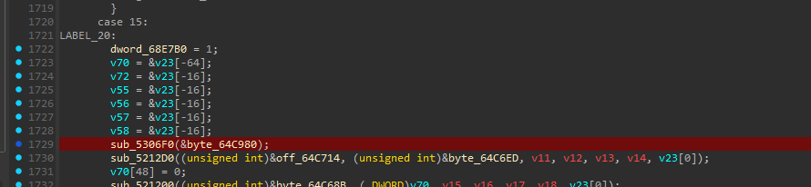

把字节码导出成二进制文件，使用010editor查看。

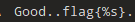

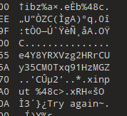

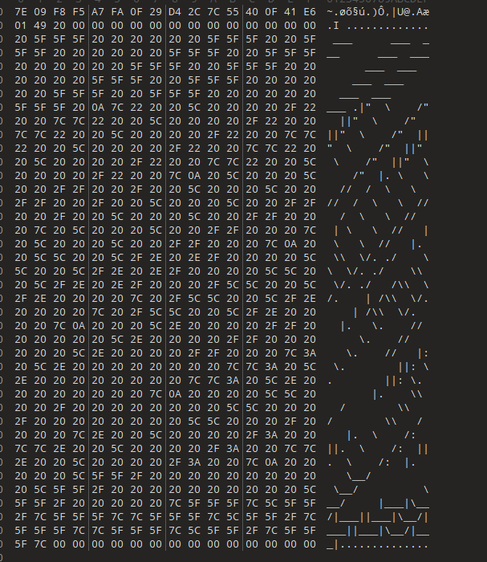

这些都是一些关键信息，程序输出的一些字符串我们就发现了。

### 技术简介\-Unicorn Engine

在字符串里面，我们发现qemu大量出现，经过搜索，我们发现这是Unicorn Engine虚拟机框架程序。

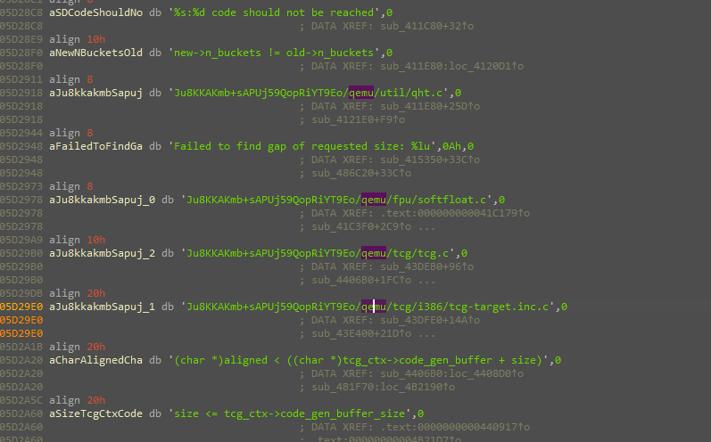

https://blog\.csdn\.net/m0\_57836225/article/details/154300825

Unicorn是基于QEMU的轻量级CPU模拟框架,具有以下特点:

1. 支持多种架构:ARM, ARM64, MIPS, SPARC, X86, RISC\-V等

2. 可以嵌入应用程序中模拟执行其他架构的代码

3. 提供完整的内存管理和寄存器访问API

4. 常用于恶意软件分析、fuzzing和安全研究

在CTF逆向题中,Unicorn常被用于实现虚拟机保护:

- 将核心算法编译为非本地架构的指令

- 在运行时通过虚拟机模拟执行

- 增加静态分析和反汇编的难度

### 题目分析

在大神的基础上，恢复部分内容：

```C
dword_68E7B0 = 1;
        v70 = &v7[-16];
        uc_engine = (__int64 *)&v7[-4];
        v28 = &v7[-4];
        v29 = &v7[-4];
        v30 = &v7[-4];
        final_reg = &v7[-4];
        IO_puts((__int64)&asc_64C980);          // vvvmmm
        _printf((__int64)&off_64C714, &aInput48c);
        *((_BYTE *)v70 + 48) = 0;
        _isoc99_scanf((__int64)&a48c, v70);     // input 48c
        sub_4075E0(8, 8, uc_engine);
        uc_mem_map(*uc_engine, 0, 4096, 7);
        uc_mem_write(*uc_engine, 0, (__int64)&byte_64C3F0, 0x296u);// start the vm
        uc_mem_map(*uc_engine, 1879048192, 0x10000, 7);
        *v28 = 1879113472;
        uc_reg_write(*uc_engine, 3, (__int64)v28);
        uc_mem_map(*uc_engine, 0x10000000, 4096, 7);
        uc_mem_map(*uc_engine, 268439552, 4096, 7);
        v3 = *uc_engine;
        v4 = j_ifunc_542170(v70);
        uc_mem_write(v3, 0x10000000, (__int64)v70, v4);
        uc_mem_write(*uc_engine, 268439552, (__int64)&aE4y8yrxvzg2hrr, 0x20u);
        *v29 = 0x10000000;
        *v30 = 268439552;
        uc_reg_write(*uc_engine, 11, (__int64)v29);
        uc_reg_write(*uc_engine, 12, (__int64)v30);
        vm_run(*uc_engine, 0, 662, 2000000, 0);
        uc_reg_read(*uc_engine, 11, (__int64)final_reg);
        v0 = *final_reg == 0;
        v5 = -1114784493;
        if ( !*final_reg )
          v5 = 2096283220;
        *p_n222989985 = v5;
        v1 = n19_3;
```

找到字符串：

```Plain Text
.data:000000000064C121 align 10h
.data:000000000064C130 aGoodFlagS db 'Good.',0Ah               ; DATA XREF: sub_401C60+29E↑o
.data:000000000064C130                                         ; sub_401C60+52E4↑w ...
.data:000000000064C136 db 'flag{%s}',0Ah
.data:000000000064C13F db 0Ah,0
.data:000000000064C141 align 10h

.data:000000000064C68B a48c db '%48c',0                        ; DATA XREF: sub_401C60+161↑o
.data:000000000064C68B                                         ; sub_401C60+2932↑w ...

.data:000000000064C6B1 align 20h
.data:000000000064C6C0 aE4y8yrxvzg2hrr db 'e4Y8YRXVzg2HRrCUy35CM0Txq91HzMGZ',0

.data:000000000064C6ED aInput48c db 'input %48c>',0            ; DATA XREF: sub_401C60+15A↑o
.data:000000000064C6ED                                         ; sub_401C60+287E↑w ...

.data:000000000064C705 aTryAgain db 'Try again~',0Ah,0         ; DATA XREF: sub_401C60:loc_401E83↑o
.data:000000000064C705                                         ; sub_401C60+5041↑w ...

.data:000000000064C980 asc_64C980 db ' ___      ___  ___      ___  ___      ___  ___      ___  ___     '
.data:000000000064C980                                         ; DATA XREF: sub_401C60+38E↑o
.data:000000000064C980                                         ; sub_401C60+578↑w ...
.data:000000000064C9C1 db ' ___  ___      ___ ',0Ah
.data:000000000064C9D5 db '|"  \    /"  ||"  \    /"  ||"  \    /"  ||"  \    /"  ||"  \    '
.data:000000000064CA16 db '/"  ||"  \    /"  |',0Ah
.data:000000000064CA2A db ' \   \  //  /  \   \  //  /  \   \  //  /  \   \  //   | \   \  /'
.data:000000000064CA6B db '/   | \   \  //   |',0Ah
.data:000000000064CA7F db '  \\  \/. ./    \\  \/. ./    \\  \/. ./   /\\  \/.    | /\\  \/.'
.data:000000000064CAC0 db '    | /\\  \/.    |',0Ah
.data:000000000064CAD4 db '   \.    //      \.    //      \.    //   |: \.        ||: \.    '
.data:000000000064CB15 db '    ||: \.        |',0Ah
.data:000000000064CB29 db '    \\   /        \\   /        \\   /    |.  \    /:  ||.  \    '
.data:000000000064CB6A db '/:  ||.  \    /:  |',0Ah
.data:000000000064CB7E db '     \__/          \__/          \__/     |___|\__/|___||___|\__/'
.data:000000000064CBBF db '|___||___|\__/|___|',0
.data:000000000064CBD3 align 20h
```

所以vm字节码从byte\_64C3F0开始向后0x296字节。

把这段字节码dump出来进行反汇编，字节码属于risc\-v字节码，可以用riscv64\-unknown\-elf\-objdump进行反汇编

使用apt安装

```Shell
sudo apt update
sudo apt install gcc-riscv64-unknown-elf binutils-riscv64-unknown-elf
```

执行反汇编

```Shell
riscv64-unknown-elf-objdump -D -b binary -m riscv '/home/kali/Desktop/VM.bin'  > asm.txt
```

得到结果：

```Assembly language

/home/kali/Desktop/VM.bin:     file format binary


Disassembly of section .data:

0000000000000000 <.data>:
   0:        711d                        addi        sp,sp,-96
   2:        eca2                        sd        s0,88(sp)
   4:        e8a6                        sd        s1,80(sp)
   6:        e4ca                        sd        s2,72(sp)
   8:        e0ce                        sd        s3,64(sp)
   a:        fc52                        sd        s4,56(sp)
   c:        0005c603                  lbu        a2,0(a1)
  10:        ce01                        beqz        a2,0x28
  12:        0585                        addi        a1,a1,1
  14:        4705                        li        a4,1
  16:        40c706b3                  sub        a3,a4,a2
  1a:        0005c603                  lbu        a2,0(a1) # 加载key字符
  1e:        0716                        slli        a4,a4,0x5 # h << 5 (相当于h*32)
  20:        8f15                        sub        a4,a4,a3 # h = h*32 - (1 - key[i])
  22:        0585                        addi        a1,a1,1
  24:        fa6d                        bnez        a2,0x16
  26:        a011                        j        0x2a
  28:        4705                        li        a4,1
  2a:        1357a6b7                  lui        a3,0x1357a
  2e:        01075613                  srli        a2,a4,0x10
  32:        002c                        addi        a1,sp,8
  34:        0511                        addi        a0,a0,4
  36:        bdf68893                  addi        a7,a3,-1057 # 0x13579bdf
  3a:        03810813                  addi        a6,sp,56
  3e:        da46                        sw        a7,52(sp) # 加载魔数
  40:        56d2                        lw        a3,52(sp)
  42:        57d2                        lw        a5,52(sp)
  44:        03416403                  lwu        s0,52(sp)
  48:        03416903                  lwu        s2,52(sp)
  4c:        03416483                  lwu        s1,52(sp)
  50:        03416a03                  lwu        s4,52(sp)
  54:        03416983                  lwu        s3,52(sp)
  58:        03416f83                  lwu        t6,52(sp)
  5c:        03416f03                  lwu        t5,52(sp)
  60:        03416e83                  lwu        t4,52(sp)
  64:        03416e03                  lwu        t3,52(sp)
  68:        03416383                  lwu        t2,52(sp)
  6c:        03416303                  lwu        t1,52(sp)
  70:        03416283                  lwu        t0,52(sp)
  74:        da46                        sw        a7,52(sp)
  76:        02d6763b                  remuw        a2,a2,a3
  7a:        56d2                        lw        a3,52(sp)
  7c:        02d776bb                  remuw        a3,a4,a3
  80:        02f6773b                  remuw        a4,a2,a5
  84:        57d2                        lw        a5,52(sp)
  86:        02f6f7bb                  remuw        a5,a3,a5
  8a:        1602                        slli        a2,a2,0x20
  8c:        1702                        slli        a4,a4,0x20
  8e:        02c73733                  mulhu        a4,a4,a2
  92:        02877733                  remu        a4,a4,s0
  96:        03416403                  lwu        s0,52(sp)
  9a:        1682                        slli        a3,a3,0x20
  9c:        1782                        slli        a5,a5,0x20
  9e:        02d7b7b3                  mulhu        a5,a5,a3
  a2:        0287f7b3                  remu        a5,a5,s0
  a6:        03416403                  lwu        s0,52(sp)
  aa:        9201                        srli        a2,a2,0x20
  ac:        02c70733                  mul        a4,a4,a2
  b0:        03277733                  remu        a4,a4,s2
  b4:        9281                        srli        a3,a3,0x20
  b6:        02d787b3                  mul        a5,a5,a3
  ba:        0287f7b3                  remu        a5,a5,s0
  be:        03416403                  lwu        s0,52(sp)
  c2:        02c70733                  mul        a4,a4,a2
  c6:        02977733                  remu        a4,a4,s1
  ca:        02d787b3                  mul        a5,a5,a3
  ce:        0287f7b3                  remu        a5,a5,s0
  d2:        03416403                  lwu        s0,52(sp)
  d6:        02c70733                  mul        a4,a4,a2
  da:        03477733                  remu        a4,a4,s4
  de:        02d787b3                  mul        a5,a5,a3
  e2:        0287f7b3                  remu        a5,a5,s0
  e6:        03416403                  lwu        s0,52(sp)
  ea:        02c70733                  mul        a4,a4,a2
  ee:        03377733                  remu        a4,a4,s3
  f2:        02d787b3                  mul        a5,a5,a3
  f6:        0287f7b3                  remu        a5,a5,s0
  fa:        03416403                  lwu        s0,52(sp)
  fe:        02c70733                  mul        a4,a4,a2
 102:        03f77733                  remu        a4,a4,t6
 106:        02d787b3                  mul        a5,a5,a3
 10a:        0287f7b3                  remu        a5,a5,s0
 10e:        03416483                  lwu        s1,52(sp)
 112:        02c70733                  mul        a4,a4,a2
 116:        03e77733                  remu        a4,a4,t5
 11a:        02d787b3                  mul        a5,a5,a3
 11e:        0297f7b3                  remu        a5,a5,s1
 122:        03416483                  lwu        s1,52(sp)
 126:        02c70733                  mul        a4,a4,a2
 12a:        03d77733                  remu        a4,a4,t4
 12e:        02d787b3                  mul        a5,a5,a3
 132:        0297f7b3                  remu        a5,a5,s1
 136:        03416483                  lwu        s1,52(sp)
 13a:        02c70733                  mul        a4,a4,a2
 13e:        03c77733                  remu        a4,a4,t3
 142:        02d787b3                  mul        a5,a5,a3
 146:        0297f7b3                  remu        a5,a5,s1
 14a:        03416483                  lwu        s1,52(sp)
 14e:        02c70733                  mul        a4,a4,a2
 152:        02777733                  remu        a4,a4,t2
 156:        02d787b3                  mul        a5,a5,a3
 15a:        0297f7b3                  remu        a5,a5,s1
 15e:        03416483                  lwu        s1,52(sp)
 162:        02c70733                  mul        a4,a4,a2
 166:        02677733                  remu        a4,a4,t1
 16a:        02d787b3                  mul        a5,a5,a3
 16e:        0297f7b3                  remu        a5,a5,s1
 172:        03416483                  lwu        s1,52(sp)
 176:        02c70633                  mul        a2,a4,a2
 17a:        02567633                  remu        a2,a2,t0
 17e:        02d786b3                  mul        a3,a5,a3
 182:        0296f733                  remu        a4,a3,s1
 186:        ffc52683                  lw        a3,-4(a0)
 18a:        411c                        lw        a5,0(a0)
 18c:        8eb1                        xor        a3,a3,a2
 18e:        8fb9                        xor        a5,a5,a4
 190:        fed5ae23                  sw        a3,-4(a1)
 194:        c19c                        sw        a5,0(a1)
 196:        05a1                        addi        a1,a1,8
 198:        0521                        addi        a0,a0,8
 19a:        eb0592e3                  bne        a1,a6,0x3e
 19e:        45035537                  lui        a0,0x45035
 1a2:        534765b7                  lui        a1,0x53476
 1a6:        44b37837                  lui        a6,0x44b37
 1aa:        4692                        lw        a3,4(sp)
 1ac:        4722                        lw        a4,8(sp)
 1ae:        47b2                        lw        a5,12(sp)
 1b0:        44c2                        lw        s1,16(sp)
 1b2:        44c3f2b7                  lui        t0,0x44c3f
 1b6:        79bb68b7                  lui        a7,0x79bb6
 1ba:        42a1e337                  lui        t1,0x42a1e
 1be:        3edb83b7                  lui        t2,0x3edb8
 1c2:        f6350513                  addi        a0,a0,-157 # 0x45034f63
 1c6:        2d258593                  addi        a1,a1,722 # 0x534762d2
 1ca:        00a6ce33                  xor        t3,a3,a0
 1ce:        00b74eb3                  xor        t4,a4,a1
 1d2:        46d2                        lw        a3,20(sp)
 1d4:        4762                        lw        a4,24(sp)
 1d6:        4672                        lw        a2,28(sp)
 1d8:        5402                        lw        s0,32(sp)
 1da:        d0480513                  addi        a0,a6,-764 # 0x44b36d04
 1de:        00a7cf33                  xor        t5,a5,a0
 1e2:        30e157b7                  lui        a5,0x30e15
 1e6:        d6a28593                  addi        a1,t0,-662 # 0x44c3ed6a
 1ea:        00b4c2b3                  xor        t0,s1,a1
 1ee:        4d3ac837                  lui        a6,0x4d3ac
 1f2:        0b088493                  addi        s1,a7,176 # 0x79bb60b0
 1f6:        76730513                  addi        a0,t1,1895 # 0x42a1e767
 1fa:        e6c38593                  addi        a1,t2,-404 # 0x3edb7e6c
 1fe:        51d78793                  addi        a5,a5,1309 # 0x30e1551d
 202:        0096c3b3                  xor        t2,a3,s1
 206:        00a74333                  xor        t1,a4,a0
 20a:        00b648b3                  xor        a7,a2,a1
 20e:        00f44fb3                  xor        t6,s0,a5
 212:        5612                        lw        a2,36(sp)
 214:        5722                        lw        a4,40(sp)
 216:        54b2                        lw        s1,44(sp)
 218:        5442                        lw        s0,48(sp)
 21a:        aa480593                  addi        a1,a6,-1372 # 0x4d3abaa4
 21e:        8db1                        xor        a1,a1,a2
 220:        6aa2a637                  lui        a2,0x6aa2a
 224:        94860613                  addi        a2,a2,-1720 # 0x6aa29948
 228:        8e39                        xor        a2,a2,a4
 22a:        51ce9737                  lui        a4,0x51ce9
 22e:        84770713                  addi        a4,a4,-1977 # 0x51ce8847
 232:        8f25                        xor        a4,a4,s1
 234:        516244b7                  lui        s1,0x51624
 238:        faf48493                  addi        s1,s1,-81 # 0x51623faf
 23c:        8c25                        xor        s0,s0,s1
 23e:        001e3493                  seqz        s1,t3
 242:        001eb513                  seqz        a0,t4
 246:        9526                        add        a0,a0,s1
 248:        001f3493                  seqz        s1,t5
 24c:        0012b693                  seqz        a3,t0
 250:        96a6                        add        a3,a3,s1
 252:        0013b493                  seqz        s1,t2
 256:        00133793                  seqz        a5,t1
 25a:        97a6                        add        a5,a5,s1
 25c:        001fb493                  seqz        s1,t6
 260:        0015b593                  seqz        a1,a1
 264:        95a6                        add        a1,a1,s1
 266:        9536                        add        a0,a0,a3
 268:        0018b693                  seqz        a3,a7
 26c:        96be                        add        a3,a3,a5
 26e:        00163613                  seqz        a2,a2
 272:        95b2                        add        a1,a1,a2
 274:        9536                        add        a0,a0,a3
 276:        00173613                  seqz        a2,a4
 27a:        95b2                        add        a1,a1,a2
 27c:        952e                        add        a0,a0,a1
 27e:        00143593                  seqz        a1,s0
 282:        9d2d                        addw        a0,a0,a1
 284:        1551                        addi        a0,a0,-12
 286:        00153513                  seqz        a0,a0
 28a:        6466                        ld        s0,88(sp)
 28c:        64c6                        ld        s1,80(sp)
 28e:        6926                        ld        s2,72(sp)
 290:        6986                        ld        s3,64(sp)
 292:        7a62                        ld        s4,56(sp)
 294:        6125                        addi        sp,sp,96

```

### 汇编代码分析与题目求解

#### 模块一：DJB31哈希算法

第一段代码对种子字符串进行哈希计算。

```Python
def djb31_hash(seed: bytes) -> int:
    h = 1
    for b in seed:
        if b == 0:
            break
        h = (31 * h + b) & MASK64
    """
       c:        0005c603                      lbu            a2,0(a1)   # 加载key的第一个字符到a2
      10:        ce01                        beqz        a2,0x28    # 如果字符为0，跳转到0x28
      12:        0585                        addi        a1,a1,1    # 指针移动到下一个字符
      14:        4705                        li            a4,1       # h = 1 (a4)
      16:        40c706b3                      sub            a3,a4,a2   # a3 = h - key[i] (当前字符的补码)
      1a:        0005c603                      lbu            a2,0(a1)   # 加载key的下一个字符
      1e:        0716                        slli        a4,a4,0x5  # h << 5 (相当于h*32)
      20:        8f15                        sub            a4,a4,a3   # h新 = h*32 - (h - key[i]) = 31*h + (h-h+key[i]) = 31*h + key[i]
      22:        0585                        addi        a1,a1,1    # 指针移动到下一个字符
      24:        fa6d                        bnez        a2,0x16    # 如果字符不为0，继续循环
      26:        a011                        j            0x2a       # 跳转到0x2a
      28:        4705                        li        a4,1           # 空字符串时h=1
    """
    return h
```

##### 算法特点

1. DJB31算法由Daniel J\. Bernstein设计

2. 使用魔数31作为乘法因子

    - 31 = 2^5 \- 1,可优化为移位和减法

    - 乘以31等价于:\(h \<\< 5\) \- h

3. 在64位整数范围运算,溢出自然截断

4. 初始值为1\(标准DJB算法通常用5381\)


#### 模块二: 伪随机密钥流生成

第二段代码实现了一个定制的伪随机数生成器,用于生成加密密钥流。

##### 核心参数

```Plain Text
MOD = 0x13579bdf  # 魔数模数
```

这个模数是一个精心选择的质数,用于模运算以保证输出的伪随机性。

##### 关键RISC\-V指令

###### mulhu \- 高位无符号乘法

```Assembly language
mulhu rd, rs1, rs2
```

功能:计算rs1 \* rs2的128位乘积,取高64位存入rd

在64位架构中:

```Python
product = rs1 * rs2  # 128位结果
rd = product[127:64]  # 取高64位
```

###### remuw \- 32位无符号取模

```Assembly language
remuw rd, rs1, rs2
```

功能:计算\(rs1\[31:0\] mod rs2\[31:0\]\),结果符号扩展到64位

特点:

- 只使用低32位参与运算

- 结果会进行符号扩展填充高32位

```Python
def step(a2: int, a4: int) -> tuple[int, int]:
    # 第一组32位模运算
    a2 = remuw(a2, MOD)
    a3 = remuw(a4, MOD)
    a4 = remuw(a2, MOD)
    a5 = remuw(a3, MOD)

    # 左移32位准备高位乘法
    a2_shift = (a2 << 32) & MASK64
    a4_shift = (a4 << 32) & MASK64

    # 高位乘法并取模
    a4 = remu(mulhu(a4_shift, a2_shift), MOD)

    a3_shift = (a3 << 32) & MASK64
    a5_shift = (a5 << 32) & MASK64

    a5 = remu(mulhu(a5_shift, a3_shift), MOD)

    # 恢复原始值
    a2 = (a2_shift >> 32) & MASK64
    a3 = (a3_shift >> 32) & MASK64

    # 迭代混淆10次
    for _ in range(10):
        a4 = remu((a4 * a2) & MASK64, MOD)
        a5 = remu((a5 * a3) & MASK64, MOD)

    # 最终密钥流输出
    a2 = remu((a4 * a2) & MASK64, MOD)
    a4 = remu((a5 * a3) & MASK64, MOD)

    return a2, a4
```

##### 密钥流生成

通过6轮迭代,每轮产生2个32位值,总共生成12个密钥流值

#### 模块三: XOR流加密验证

第三段代码将用户输入与密钥流进行XOR运算,然后与预设目标值比较。

##### 加密方案

这是一个标准的流加密\(Stream Cipher\)方案:

1. 明文处理:将48字节输入解析为12个32位整数\(小端序\)

2. 密钥流生成:使用前述算法生成12个32位密钥

3. 加密操作:ciphertext = plaintext XOR keystream

4. 验证:比较加密结果与预设目标值，全为0则通过


### 题目求解

所以可以编写脚本：

```Python
from __future__ import annotations
import struct

# riscv64-unknown-elf-objdump -D -b binary -m riscv '/home/kali/Desktop/VM.bin'  > asm.txt
"""
addi    寄存器值与12位立即数相加,rd = rs1 + imm ADDI rd, rs1, imm
sd      将寄存器中的64位双字存储到内存 SD rs2, offset(rs1)
lbu     加载8位字节（零扩展）  LBU rd, offset(rs1)
beqz    如果寄存器rs1'等于零，则跳转到PC相对偏移地址 BEQZ rs1', offset
li      将符号扩展的6位立即数加载到寄存器rd中 LI rd, imm
sub     从第一个寄存器值中减去第二个寄存器值,rd = rs1 - rs2 SUB rd, rs1, rs2
slli    立即数逻辑左移 SLLI rd, rs1, imm
bnez    如果寄存器rs1'不等于零，则跳转到PC相对偏移地址 BNEZ rs1', offset
j       跳转 J addr
lui     加载上位立即数 LUI rd, imm
srli    立即数逻辑右移 SRLI rd, rs1, imm
sw      存储32位字 SW rs2, offset(rs1)
lw      加载32位字 LW rd, offset(rs1)
lwu     加载32位字并零扩展到64位 LWU rd, offset(rs1)
remuw   32位无符号整数求余，结果符号扩展到64位 REMUW rd, rs1, rs2
mulhu   32位无符号整数乘法，返回结果的高32位 MULHU rd, rs1, rs2
remu    32位无符号整数求余 REMU rd, rs1, rs2
mul     32位有符号整数乘法，返回结果的低32位 MUL rd, rs1, rs2
xor     按位异或运算 XOR rd, rs1, rs2
bne     不等时分支 BNE rs1, rs2, offset
seqz    条件清零指令，当rs2等于零时返回rs1，否则返回0 SEQZ rd, rs1, rs2
add     将两个寄存器的值相加 ADD rd, rs1, rs2
addw    32位加法运算，结果符号扩展到64位（RV64专用） ADDW rd, rs1, rs2
ld      从内存加载64位双字到寄存器 LD rd, offset(rs1)
"""
seed = b"e4Y8YRXVzg2HRrCUy35CM0Txq91HzMGZ" # 解密字节码提取
"""
  uc_mem_write(*uc_engine, 268439552, (__int64)&aE4y8yrxvzg2hrr, 0x20u);
  .data:000000000064C6C0 aE4y8yrxvzg2hrr db 'e4Y8YRXVzg2HRrCUy35CM0Txq91HzMGZ',0
  .data:000000000064C6C0                                         ; DATA XREF: sub_401C60+16F↑o
  .data:000000000064C6C0                                         ; sub_401C60+50F5↑w ...
"""

MOD = 0x13579bdf # 反汇编提取
"""
  36:        bdf68893                  addi        a7,a3,-1057 # 0x13579bdf
"""

MASK64 = (1 << 64) - 1
target = [# 反汇编提取
    0x45034f63, 0x534762d2, 0x44b36d04, 0x44c3ed6a,
    0x79bb60b0, 0x42a1e767, 0x3edb7e6c, 0x30e1551d,
    0x4d3abaa4, 0x6aa29948, 0x51ce8847, 0x51623faf
]
"""
 1c2:        f6350513                  addi        a0,a0,-157 # 0x45034f63
 1c6:        2d258593                  addi        a1,a1,722 # 0x534762d2
...
 1da:        d0480513                  addi        a0,a6,-764 # 0x44b36d04
...
 1e6:        d6a28593                  addi        a1,t0,-662 # 0x44c3ed6a
...
 1f2:        0b088493                  addi        s1,a7,176 # 0x79bb60b0
 1f6:        76730513                  addi        a0,t1,1895 # 0x42a1e767
 1fa:        e6c38593                  addi        a1,t2,-404 # 0x3edb7e6c
 1fe:        51d78793                  addi        a5,a5,1309 # 0x30e1551d
...
 21a:        aa480593                  addi        a1,a6,-1372 # 0x4d3abaa4
...
 224:        94860613                  addi        a2,a2,-1720 # 0x6aa29948
...
 22e:        84770713                  addi        a4,a4,-1977 # 0x51ce8847
...
 238:        faf48493                  addi        s1,s1,-81 # 0x51623faf
...
"""
def u32(x: int) -> int: return x & 0xFFFFFFFF
def u64(x: int) -> int: return x & 0xffffffffffffffff
def sext32(x: int) -> int:
    """32位符号扩展到64位"""
    x &= 0xffffffff
    if x & 0x80000000:
        return x | 0xffffffff00000000
    return x

def remuw(dividend: int, divisor: int) -> int:
    """32位无符号取模,结果符号扩展"""
    res = (dividend & 0xffffffff) % (divisor & 0xffffffff)
    return sext32(res)

def mulhu(x: int, y: int) -> int:
    """64位无符号乘法,取高64位"""
    return ((x & MASK64) * (y & MASK64) >> 64) & MASK64

def remu(x: int, d: int) -> int:
    """64位无符号取模"""
    return (x & MASK64) % (d & MASK64)


def djb31_hash(seed: bytes) -> int:
    h = 1
    for b in seed:
        if b == 0:
            break
        h = (31 * h + b) & MASK64
    """
       c:        0005c603                      lbu            a2,0(a1)   # 加载key的第一个字符到a2
      10:        ce01                        beqz        a2,0x28    # 如果字符为0，跳转到0x28
      12:        0585                        addi        a1,a1,1    # 指针移动到下一个字符
      14:        4705                        li            a4,1       # h = 1 (a4)
      16:        40c706b3                      sub            a3,a4,a2   # a3 = h - key[i] (当前字符的补码)
      1a:        0005c603                      lbu            a2,0(a1)   # 加载key的下一个字符
      1e:        0716                        slli        a4,a4,0x5  # h << 5 (相当于h*32)
      20:        8f15                        sub            a4,a4,a3   # h新 = h*32 - (h - key[i]) = 31*h + (h-h+key[i]) = 31*h + key[i]
      22:        0585                        addi        a1,a1,1    # 指针移动到下一个字符
      24:        fa6d                        bnez        a2,0x16    # 如果字符不为0，继续循环
      26:        a011                        j            0x2a       # 跳转到0x2a
      28:        4705                        li        a4,1           # 空字符串时h=1
    """
    return h
def step(a2: int, a4: int) -> tuple[int, int]:
    """
      2a:        1357a6b7                      lui            a3,0x1357a  # 初始化，加载MOD的高位
      2e:        01075613                      srli        a2,a4,0x10  #
      32:        002c                        addi        a1,sp,8     #
      34:        0511                        addi        a0,a0,4     #
      36:        bdf68893                      addi        a7,a3,-1057 # 0x13579bdf = MOD
      3a:        03810813                      addi        a6,sp,56    # 初始化
      3e:        da46                        sw        a7,52(sp)       # 加载魔数
      40:        56d2                        lw        a3,52(sp)       .
      42:        57d2                        lw        a5,52(sp)       .
      44:        03416403                      lwu        s0,52(sp)       .
      48:        03416903                      lwu        s2,52(sp)       .
      4c:        03416483                      lwu        s1,52(sp)       .
      50:        03416a03                      lwu        s4,52(sp)       .
      54:        03416983                      lwu        s3,52(sp)       .
      58:        03416f83                      lwu        t6,52(sp)       .
      5c:        03416f03                      lwu        t5,52(sp)       .
      60:        03416e83                      lwu        t4,52(sp)       .
      64:        03416e03                      lwu        t3,52(sp)       .
      68:        03416383                      lwu        t2,52(sp)       .
      6c:        03416303                      lwu        t1,52(sp)       .
      70:        03416283                      lwu        t0,52(sp)       .
      74:        da46                        sw        a7,52(sp)       # 初始化
    """
    # 第一组32位模运算
    a2 = remuw(a2, MOD)
    a3 = remuw(a4, MOD)
    a4 = remuw(a2, MOD)
    a5 = remuw(a3, MOD)
    """
      76:        02d6763b                  remuw        a2,a2,a3  # a2 = remuw(a2, MOD)
      7a:        56d2                lw            a3,52(sp) # 重新加载 MOD
      7c:        02d776bb                  remuw        a3,a4,a3  # a3 = remuw(a4, MOD)
      80:        02f6773b                  remuw        a4,a2,a5  # a4 = remuw(a2, MOD)
      84:        57d2                lw            a5,52(sp) # 重新加载 MOD
      86:        02f6f7bb                  remuw        a5,a3,a5  # a5 = remuw(a3, MOD)
    """
    # 左移32位准备高位乘法
    a2_shift = (a2 << 32) & MASK64
    a4_shift = (a4 << 32) & MASK64
    """
      8a:        1602                        slli        a2,a2,0x20
      8c:        1702                        slli        a4,a4,0x20
    """
    # 高位乘法并取模
    a4 = remu(mulhu(a4_shift, a2_shift), MOD)

    a3_shift = (a3 << 32) & MASK64
    a5_shift = (a5 << 32) & MASK64

    a5 = remu(mulhu(a5_shift, a3_shift), MOD)
    """
      8e:        02c73733                  mulhu        a4,a4,a2
      92:        02877733                  remu        a4,a4,s0   # a4 = remu(mulhu(a4_shift, a2_shift), MOD)
      96:        03416403                  lwu            s0,52(sp)  # 重新加载 MOD
      9a:        1682                slli        a3,a3,0x20 # a3_shift = (a3 << 32) & MASK64
      9c:        1782                slli        a5,a5,0x20 # a5_shift = (a5 << 32) & MASK64
      9e:        02d7b7b3                  mulhu        a5,a5,a3
      a2:        0287f7b3                  remu        a5,a5,s0   # a5 = remu(mulhu(a5_shift, a3_shift), MOD)
      a6:        03416403                  lwu            s0,52(sp)  # 重新加载 MOD
    """
    # 恢复原始值
    a2 = (a2_shift >> 32) & MASK64
    a3 = (a3_shift >> 32) & MASK64
    """
      aa:        9201                        srli        a2,a2,0x20
      ac:        02c70733                      ...
      b0:        03277733                      ...
      b4:        9281                        srli        a3,a3,0x20
    """
    # 迭代混淆10次
    for _ in range(10):
        a4 = remu((a4 * a2) & MASK64, MOD)
        a5 = remu((a5 * a3) & MASK64, MOD)
    """
      a6:        03416403                  lwu        s0,52(sp)
      aa:   9201                ...
      ac:        02c70733                  mul            a4,a4,a2
      b0:        03277733                  remu        a4,a4,s2
      b4:   9281                ...
      b6:        02d787b3                  mul            a5,a5,a3
      ba:        0287f7b3                  remu        a5,a5,s0
      
      be:        03416403                  lwu            s0,52(sp)
      c2:        02c70733                  mul            a4,a4,a2
      c6:        02977733                  remu        a4,a4,s1
      ca:        02d787b3                  mul            a5,a5,a3
      ce:        0287f7b3                  remu        a5,a5,s0
      
      d2:        03416403                  lwu            s0,52(sp)
      d6:        02c70733                  mul            a4,a4,a2
      da:        03477733                  remu        a4,a4,s4
      de:        02d787b3                  mul            a5,a5,a3
      e2:        0287f7b3                  remu        a5,a5,s0
      
      e6:        03416403                  lwu            s0,52(sp)
      ea:        02c70733                  mul            a4,a4,a2
      ee:        03377733                  remu        a4,a4,s3
      f2:        02d787b3                  mul            a5,a5,a3
      f6:        0287f7b3                  remu        a5,a5,s0
      
      fa:        03416403                  lwu            s0,52(sp)
      fe:        02c70733                  mul            a4,a4,a2
     102:        03f77733                  remu        a4,a4,t6
     106:        02d787b3                  mul            a5,a5,a3
     10a:        0287f7b3                  remu        a5,a5,s0
     
     10e:        03416483                  lwu            s1,52(sp)
     112:        02c70733                  mul            a4,a4,a2
     116:        03e77733                  remu        a4,a4,t5
     11a:        02d787b3                  mul            a5,a5,a3
     11e:        0297f7b3                  remu        a5,a5,s1
     
     122:        03416483                  lwu            s1,52(sp)
     126:        02c70733                  mul            a4,a4,a2
     12a:        03d77733                  remu        a4,a4,t4
     12e:        02d787b3                  mul            a5,a5,a3
     132:        0297f7b3                  remu        a5,a5,s1
     
     136:        03416483                  lwu            s1,52(sp)
     13a:        02c70733                  mul            a4,a4,a2
     13e:        03c77733                  remu        a4,a4,t3
     142:        02d787b3                  mul            a5,a5,a3
     146:        0297f7b3                  remu        a5,a5,s1
     
     14a:        03416483                  lwu            s1,52(sp)
     14e:        02c70733                  mul            a4,a4,a2
     152:        02777733                  remu        a4,a4,t2
     156:        02d787b3                  mul            a5,a5,a3
     15a:        0297f7b3                  remu        a5,a5,s1
     
     15e:        03416483                  lwu            s1,52(sp)
     162:        02c70733                  mul            a4,a4,a2
     166:        02677733                  remu        a4,a4,t1
     16a:        02d787b3                  mul            a5,a5,a3
     16e:        0297f7b3                  remu        a5,a5,s1
     
    """
    # 最终密钥流输出
    a2 = remu((a4 * a2) & MASK64, MOD)
    a4 = remu((a5 * a3) & MASK64, MOD)
    """
     172:        03416483                  lwu            s1,52(sp)
     176:        02c70633                  mul            a2,a4,a2
     17a:        02567633                  remu        a2,a2,t0
     17e:        02d786b3                  mul            a3,a5,a3
     182:        0296f733                  remu        a4,a3,s1
    """
    return a2, a4

def derive_input_bytes() -> bytes:
    if len(keystream) != 12 or len(target) != 12:
        raise ValueError("MASK_U32/EXPECTED_U32 must be 12 dwords each")

    inp_u32 = [u32(m ^ e) for m, e in zip(keystream, target)]
    return struct.pack("<12I", *inp_u32)
"""
 19e:        45035537                  lui        a0,0x45035     # 加载
 1a2:        534765b7                  lui        a1,0x53476     # 加载
 1a6:        44b37837                  lui        a6,0x44b37     # 加载
 1aa:        4692                lw        a3,4(sp)       # 加载
 1ac:        4722                lw        a4,8(sp)       # 加载
 1ae:        47b2                lw        a5,12(sp)      # 加载
 1b0:        44c2                lw        s1,16(sp)      # 加载
 1b2:        44c3f2b7                  lui        t0,0x44c3f     # 加载
 1b6:        79bb68b7                  lui        a7,0x79bb6     # 加载
 1ba:        42a1e337                  lui        t1,0x42a1e     # 加载
 1be:        3edb83b7                  lui        t2,0x3edb8     # 加载
 
 1c2:        f6350513                  addi        a0,a0,-157 # 0x45034f63
 1c6:        2d258593                  addi        a1,a1,722  # 0x534762d2
 1ca:        00a6ce33                  xor            t3,a3,a0
 1ce:        00b74eb3                  xor            t4,a4,a1

 1d2:        46d2                lw            a3,20(sp)  # 加载
 1d4:        4762                lw            a4,24(sp)  # 加载
 1d6:        4672                lw            a2,28(sp)  # 加载
 1d8:        5402                lw            s0,32(sp)  # 加载

 1da:        d0480513                  addi        a0,a6,-764 # 0x44b36d04
 1de:        00a7cf33                  xor            t5,a5,a0

 1e2:        30e157b7                  lui            a5,0x30e15 # 加载

 1e6:        d6a28593                  addi        a1,t0,-662 # 0x44c3ed6a
 1ea:        00b4c2b3                  xor            t0,s1,a1

 1ee:        4d3ac837                  lui        a6,0x4d3ac     # 加载

 1f2:        0b088493                  addi        s1,a7,176  # 0x79bb60b0
 1f6:        76730513                  addi        a0,t1,1895 # 0x42a1e767
 1fa:        e6c38593                  addi        a1,t2,-404 # 0x3edb7e6c
 1fe:        51d78793                  addi        a5,a5,1309 # 0x30e1551d
 202:        0096c3b3                  xor            t2,a3,s1
 206:        00a74333                  xor            t1,a4,a0
 20a:        00b648b3                  xor            a7,a2,a1
 20e:        00f44fb3                  xor            t6,s0,a5

 212:        5612                lw            a2,36(sp)  # 加载
 214:        5722                lw            a4,40(sp)  # 加载
 216:        54b2                lw            s1,44(sp)  # 加载
 218:        5442                lw            s0,48(sp)  # 加载

 21a:        aa480593                  addi        a1,a6,-1372 # 0x4d3abaa4
 21e:        8db1                xor            a1,a1,a2
 
 220:        6aa2a637                  lui            a2,0x6aa2a # 加载
 
 224:        94860613                  addi        a2,a2,-1720 # 0x6aa29948
 228:        8e39                xor            a2,a2,a4

 22a:        51ce9737                  lui            a4,0x51ce9 # 加载

 22e:        84770713                  addi        a4,a4,-1977 # 0x51ce8847
 232:        8f25                xor            a4,a4,s1

 234:        516244b7                  lui            s1,0x51624 # 加载

 238:        faf48493                  addi        s1,s1,-81   # 0x51623faf
 23c:        8c25                xor            s0,s0,s1
"""


######################################------main------######################################
""" # 初始化
   0:        711d                        addi        sp,sp,-96 # 虚拟机开始
   2:        eca2                        sd            s0,88(sp)
   4:        e8a6                        sd            s1,80(sp)
   6:        e4ca                        sd            s2,72(sp)
   8:        e0ce                        sd            s3,64(sp)
   a:        fc52                        sd            s4,56(sp)
"""
h = djb31_hash(seed)
a2 = h >> 16  # 取高位
a4 = h        # 取全值

keystream = []
for i in range(6):
    a2, a4 = step(a2, a4)
    keystream.append(a2 & 0xffffffff)
    keystream.append(a4 & 0xffffffff)

"""
 186:        ffc52683                      lw            a3,-4(a0)   
 18a:        411c                        lw            a5,0(a0)
 18c:        8eb1                        xor            a3,a3,a2  # a2 & 0xffffffff
 18e:        8fb9                        xor            a5,a5,a4  # a4 & 0xffffffff
 190:        fed5ae23                      sw            a3,-4(a1)
 194:        c19c                        sw            a5,0(a1)
 196:        05a1                        addi        a1,a1,8
 198:        0521                        addi        a0,a0,8
 19a:        eb0592e3                      bne            a1,a6,0x3e
"""

print("keystream:")
for i in keystream:
    print("0x{0:0>8}".format(hex(i)[2:]))

print("flag{"+derive_input_bytes().decode("ascii")+"}")

""" # 检查每个解密值是否为零,12个寄存器
 23e:        001e3493                      seqz        s1,t3
 242:        001eb513                      seqz        a0,t4
 246:        9526                        add            a0,a0,s1
 248:        001f3493                      seqz        s1,t5
 24c:        0012b693                      seqz        a3,t0
 250:        96a6                        add            a3,a3,s1
 252:        0013b493                      seqz        s1,t2
 256:        00133793                      seqz        a5,t1
 25a:        97a6                        add            a5,a5,s1
 25c:        001fb493                      seqz        s1,t6
 260:        0015b593                      seqz        a1,a1
 264:        95a6                        add            a1,a1,s1
 266:        9536                        add            a0,a0,a3
 268:        0018b693                      seqz        a3,a7
 26c:        96be                        add            a3,a3,a5
 26e:        00163613                      seqz        a2,a2
 272:        95b2                        add            a1,a1,a2
 274:        9536                        add            a0,a0,a3
 276:        00173613                      seqz        a2,a4
 27a:        95b2                        add            a1,a1,a2
 27c:        952e                        add            a0,a0,a1
 27e:        00143593                      seqz        a1,s0      # 如果 s0 == 0，则a1 = 1，否则a1 = 0
 282:        9d2d                        addw        a0,a0,a1   # a0 = 总共为零的个数
 284:        1551                        addi        a0,a0,-12  # a0 = 个数 - 12
 286:        00153513                      seqz        a0,a0      # 如果 a0 == 0，则 a0 = 1 ，否则 a0 = 0
 28a:        6466                        ld            s0,88(sp)
 28c:        64c6                        ld            s1,80(sp)
 28e:        6926                        ld            s2,72(sp)
 290:        6986                        ld            s3,64(sp)
 292:        7a62                        ld            s4,56(sp)
 294:        6125                        addi        sp,sp,96   # 虚拟机结束
"""
```

flag\{fANUES0XtUXBDEbOXs4xFcXDb3Q5kMU87bZLMZJfuRnCvfwX\}


