# FIC2026服务器取证

天崩开局之火眼扫不出文件系统，低版本的火眼仿不起来，要用高版本，比赛前火眼不更新，直接爆0哈哈哈

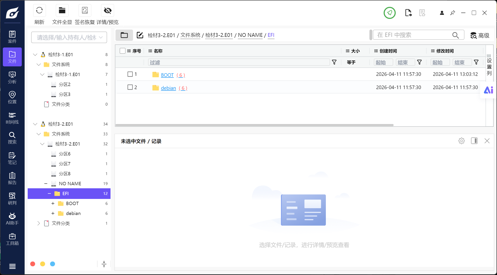

膜拜大神的wp:[mei\-you\-qian\.github\.io](https://mei-you-qian.github.io/2026/05/07/2026FIC%E5%88%9D%E8%B5%9B)

# 前置工作

无法出目录，直接仿真。仿真两个盘全勾上。强行选“其他”，因为镜像自带操作系统了，网络开NAT。

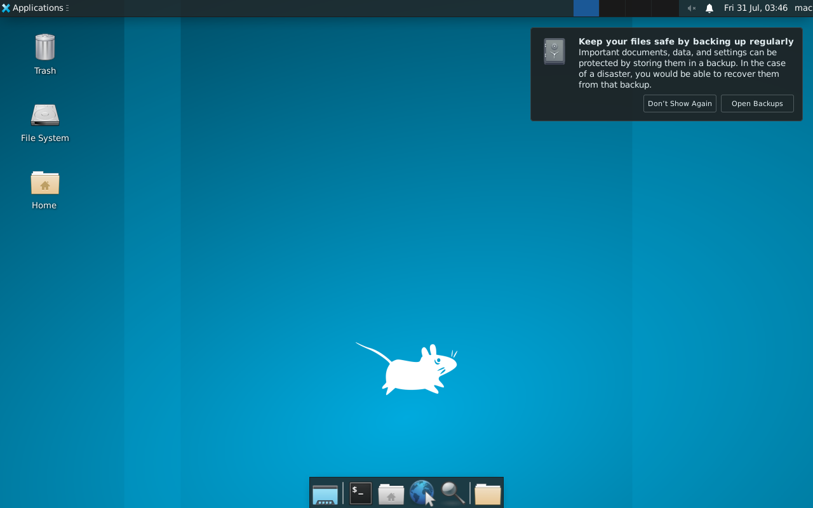

CPU开多一点，直接开仿，密码123456进去了。

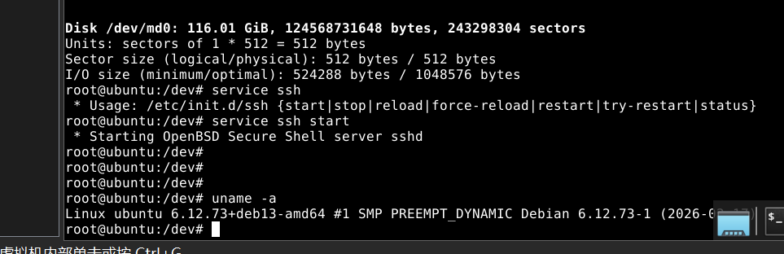

这里有坑！实际上自己在容器里面,容器的ssh别开，不然后续端口占用很麻烦：

```Assembly language
cat /proc/1/cgroup
```

如果回显有docker，说明在容器里面。

`Ctrl + Alt + F2` 是在 Linux 物理机或虚拟机上切换 TTY（虚拟终端） 的快捷键，直接退出容器

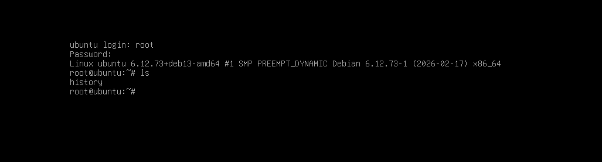

这才是宿主机，密码123456。

查看ip

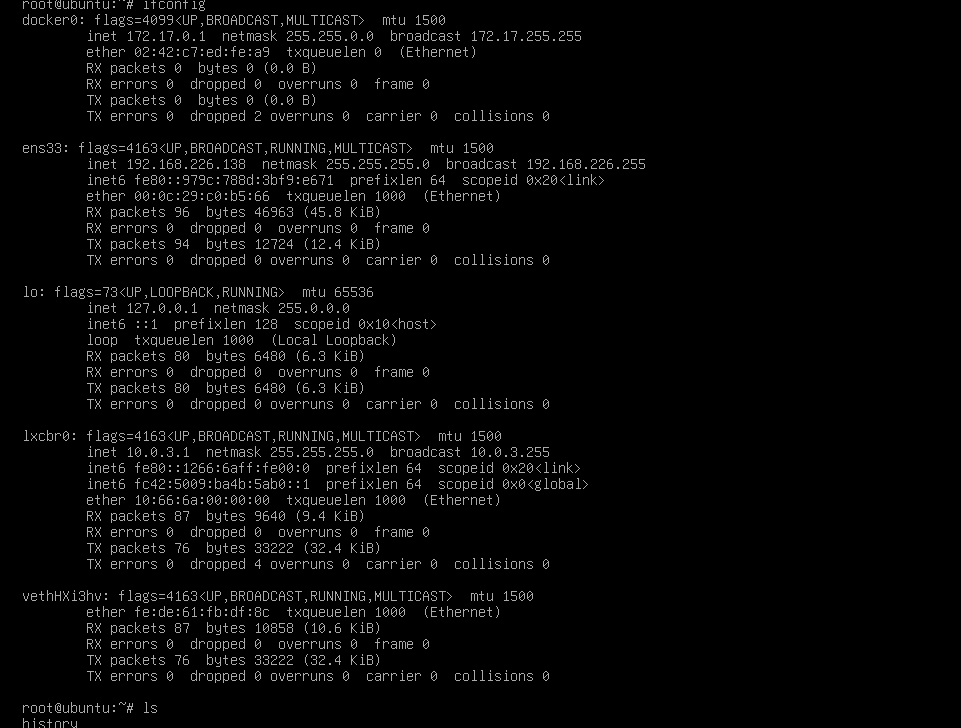

然后安装ssh

```Assembly language
sudo apt update
sudo apt install openssh-server
sudo systemctl status ssh 
sudo ufw allow ssh
```

装好ssh，即使输入正确的用户名和密码但认证失败。

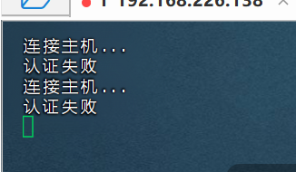

这是怎么回事？FinalShell 成功建立了加密通道，但在最后一步的“用户认证”环节失败了。

这是因为有些情况下，有时为了安全，SSH服务端会关闭密码登录。需要检查服务端配置文件 `/etc/ssh/sshd_config`

```Assembly language
cat /etc/ssh/sshd_config
vim /etc/ssh/sshd_config
```

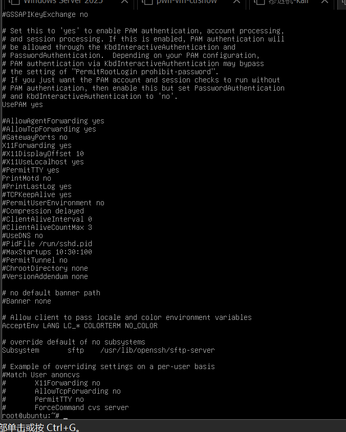

去除配置文件的\#号

```Plain Text
PasswordAuthentication yes
PermitRootLogin yes
```

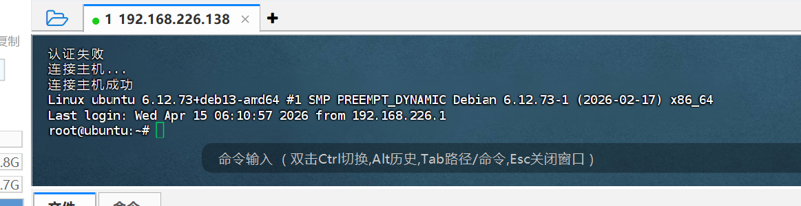

连接成功。

# 1\.该服务器主机操作系统版本为 【不区分大小写】【不区分空格】【不区分换行符 \(不考虑末尾\)】【不区分全半角】 【参考格式：0\.9】

Debian GNU/Linux 13 \(trixie\)

```Plain Text
root@ubuntu:~# cat /etc/os-release
PRETTY_NAME="Debian GNU/Linux 13 (trixie)"
NAME="Debian GNU/Linux"
VERSION_ID="13"
VERSION="13 (trixie)"
VERSION_CODENAME=trixie
DEBIAN_VERSION_FULL=13.0
ID=debian
HOME_URL="https://www.debian.org/"
SUPPORT_URL="https://www.debian.org/support"
BUG_REPORT_URL="https://bugs.debian.org/"

```

# 2\.该服务器根分区硬盘的uuid号为 【不区分大小写】【不区分空格】【不区分换行符 \(不考虑末尾\)】【不区分全半角】 【参考格式：a1b2\-c3】

3231e52f\-5e15\-44c4\-b224\-e29cb4201c0e

```Plain Text
cat /etc/fstab
```

```Plain Text
# /etc/fstab: static file system information.
#
# Use 'blkid' to print the universally unique identifier for a
# device; this may be used with UUID= as a more robust way to name devices
# that works even if disks are added and removed. See fstab(5).
#
# systemd generates mount units based on this file, see systemd.mount(5).
# Please run 'systemctl daemon-reload' after making changes here.
#
# <file system> <mount point>   <type>  <options>       <dump>  <pass>
# / was on /dev/md0 during installation
UUID=3231e52f-5e15-44c4-b224-e29cb4201c0e /               btrfs   defaults,subvol=@rootfs 0       0
# /boot/efi was on /dev/sdb5 during installation
UUID=9693-7941  /boot/efi       vfat    umask=0077      0       1
# swap was on /dev/sdb6 during installation
UUID=7c439ba0-6ff2-4ddc-b338-e293953b81fe none            swap    sw              0       0
/dev/sr0        /media/cdrom0   udf,iso9660 user,noauto     0       0
```

# 3\.该服务器中最新的docker镜像创建时间为 【不区分大小写】【不区分空格】【不区分换行符 \(不考虑末尾\)】【不区分全半角】 【参考格式：2020\-01\-01T00:00:00\.012345678Z】

2026\-04\-16T07:15:50\.535713491Z

```Plain Text
docker images
```

```Plain Text
root@ubuntu:~# docker images
REPOSITORY   TAG       IMAGE ID       CREATED        SIZE
u22          latest    1c89854511ca   3 months ago   4.03GB
<none>       <none>    71dc896ce19e   3 months ago   3.83GB
ubuntu       22.04     f00133e44249   4 months ago   78.1MB
```

```Plain Text
docker inspect u22
```

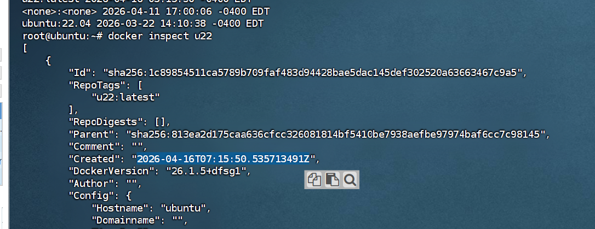

# 4\.该服务器根分区快照路径为

/root/history

之前的服务器文件`/etc/fstab`配置中文件系统类型是btrfs

```Plain Text
UUID=3231e52f-5e15-44c4-b224-e29cb4201c0e /               btrfs   defaults,subvol=@rootfs 0       0
```

直接列出所有的btrfs子卷

```Plain Text
btrfs subvolume list /
```

```Plain Text
root@ubuntu:~# btrfs subvolume list /
ID 256 gen 4659 top level 5 path @rootfs
ID 257 gen 4377 top level 256 path root/history
```

查看子卷信息

```Plain Text
btrfs subvolume show /root/history
```

```Plain Text
root@ubuntu:~# btrfs subvolume show /root/history
@rootfs/root/history
        Name:                   history
        UUID:                   6df17851-50de-ea41-9d6f-8fa945f91ad1
        Parent UUID:            74753942-2bb8-bf41-ab54-0b3b187eda1b
        Received UUID:          -
        Creation time:          2026-04-16 03:20:48 -0400
        Subvolume ID:           257
        Generation:             4377
        Gen at creation:        4362
        Parent ID:              256
        Top level ID:           256
        Flags:                  -
        Send transid:           0
        Send time:              2026-04-16 03:20:48 -0400
        Receive transid:        0
        Receive time:           -
        Snapshot(s):
        Quota group:            n/a
```

# 5\.该网站后台管理入口对应的文件名为 【不区分大小写】【不区分空格】【不区分换行符 \(不考虑末尾\)】【不区分全半角】 【参考格式：123\.txt】

user\.php

```Bash
root@ubuntu:~# netstat -nlpt
Active Internet connections (only servers)
Proto Recv-Q Send-Q Local Address           Foreign Address         State       PID/Program name    
tcp        0      0 10.0.3.1:53             0.0.0.0:*               LISTEN      1379/dnsmasq        
tcp        0      0 0.0.0.0:80              0.0.0.0:*               LISTEN      1353/nginx: master  
tcp        0      0 0.0.0.0:22              0.0.0.0:*               LISTEN      5805/sshd: /usr/sbi 
tcp        0      0 127.0.0.1:42155         0.0.0.0:*               LISTEN      1323/containerd     
tcp        0      0 127.0.0.1:5432          0.0.0.0:*               LISTEN      1641/postgres       
tcp6       0      0 fc42:5009:ba4b:5ab0::53 :::*                    LISTEN      1379/dnsmasq        
tcp6       0      0 :::80                   :::*                    LISTEN      1353/nginx: master  
tcp6       0      0 ::1:5432                :::*                    LISTEN      1641/postgres       
tcp6       0      0 :::22                   :::*                    LISTEN      5805/sshd: /usr/sbi 

```

发现开着80端口的web服务

nginx配置

```Plain Text
cat /etc/nginx/sites-enabled/default
```

里面有

```Plain Text
root /var/www/html/maccms10;
```

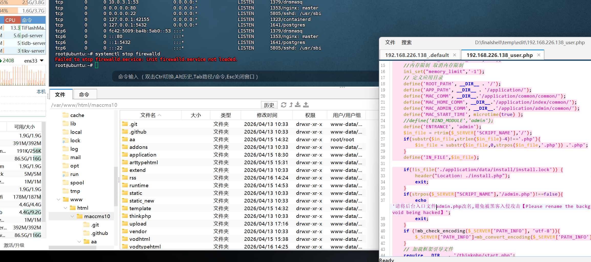

# 6\.该网站设置的icp备案号为 【不区分大小写】【不区分空格】【不区分换行符 \(不考虑末尾\)】【不区分全半角】 【参考格式：icp123】

icp1919810

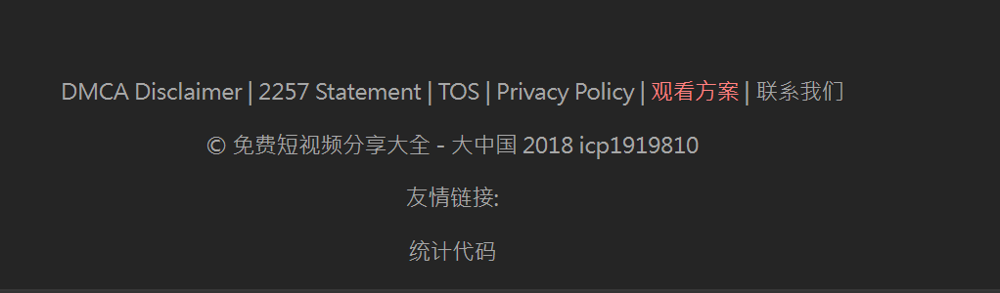

# 7\.该网站设置的主域名为 【不区分大小写】【不区分空格】【不区分换行符 \(不考虑末尾\)】【不区分全半角】 【参考格式：abc\.com】

www\.2026fic\.forensix

暴搜 www

```Plain Text
grep -r "www\." /var/www/html/maccms10
```

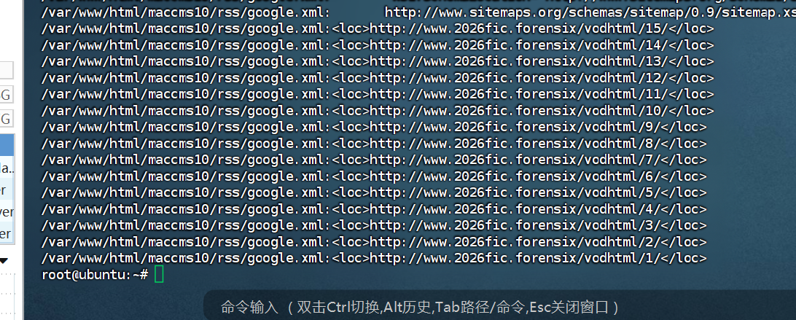

# 8\.该网站分类3中，视频的拼音为 【不区分大小写】【不区分空格】【不区分换行符 \(不考虑末尾\)】【不区分全半角】 【参考格式：abc】

sipaanshe

/vodtypehtml/3 没有确切信息查看数据库

数据库在/var/www/html/maccms10/application/database\.php 

```PHP
<?php
*// +----------------------------------------------------------------------*
*// | ThinkPHP [ WE CAN DO IT JUST THINK ]*
*// +----------------------------------------------------------------------*
*// | Copyright (c) 2006~2016 http://thinkphp.cn All rights reserved.*
*// +----------------------------------------------------------------------*
*// | Licensed ( http://www.apache.org/licenses/LICENSE-2.0 )*
*// +----------------------------------------------------------------------*
*// | Author: liu21st <liu21st@gmail.com>*
*// +----------------------------------------------------------------------*
**return** [
    *// 数据库类型*
    'type'            => 'mysql',
    *// 服务器地址*
    'hostname'        => 'mytidb',
    *// 数据库名*
    'database'        => 'mac2',
    *// 用户名*
    'username'        => 'aa',
    *// 密码*
    'password'        => '123456',
    *// 端口*
    'hostport'        => '3306',
    *// 连接dsn*
    'dsn'             => '',
    *// 数据库连接参数*
    'params'          => [],
    *// 数据库编码默认采用utf8*
    'charset'         => 'utf8',
    *// 数据库表前缀*
    'prefix'          => 'mac_',
    *// 数据库调试模式*
    'debug'           => false,
    *// 数据库部署方式:0 集中式(单一服务器),1 分布式(主从服务器)*
    'deploy'          => 0,
    *// 数据库读写是否分离 主从式有效*
    'rw_separate'     => false,
    *// 读写分离后 主服务器数量*
    'master_num'      => 1,
    *// 指定从服务器序号*
    'slave_no'        => '',
    *// 是否严格检查字段是否存在*
    'fields_strict'   => false,
    *// 数据集返回类型*
    'resultset_type'  => 'array',
    *// 自动写入时间戳字段*
    'auto_timestamp'  => false,
    *// 时间字段取出后的默认时间格式*
    'datetime_format' => 'Y-m-d H:i:s',
    *// 是否需要进行SQL性能分析*
    'sql_explain'     => false,
    *// Builder类*
    'builder'         => '',
    *// Query类*
    'query'           => '\think\db\Query',
];
```


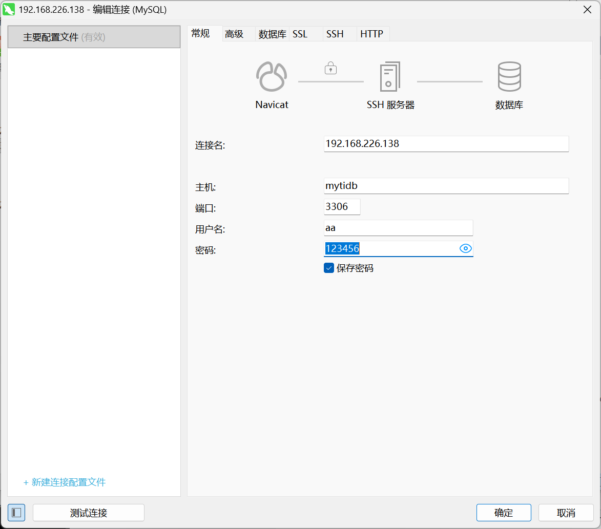


# 9\.该站点设置页面中，被使用的前端模板来自于哪个源文件？ 【不区分大小写】【不区分空格】【不区分换行符 \(不考虑末尾\)】【不区分全半角】 【参考格式：abc\.def】

info\.ini

/var/www/html/maccms10/application/extra/maccms\.php

```PHP
'template_dir' => '001tep',
```

/var/www/html/maccms10/template/001tep/info\.ini

```PHP
name = YM源码#YS001黑色极简主义
author = YM源码
website = https://www.ymyuanma.com
version = 1.0.0
lastdate = 2019-03-11
adsdir = ads
```

# 10\.该网站的伪静态规则配置文件sm3值为 【不区分大小写】【不区分空格】【不区分换行符 \(不考虑末尾\)】【不区分全半角】 【参考格式：ABC123】

e73407468e6f52af54c7b14632eeeb9be25b05106d06c4c3085fc843c223793f

nginx网站，伪静态规则配置文件在nginx的站点配置文件中

```PHP
cat /etc/nginx/sites-enabled/default
```

```Plain Text
root@ubuntu:~# openssl dgst -sm3 /etc/nginx/sites-enabled/default
SM3(/etc/nginx/sites-enabled/default)= e73407468e6f52af54c7b14632eeeb9be25b05106d06c4c3085fc843c223793f
```

# 11\.该网站关联的数据库的ip地址为 【不区分大小写】【不区分空格】【不区分换行符 \(不考虑末尾\)】【不区分全半角】 【参考格式：1\.1\.1\.1】

10\.0\.3\.100

```Plain Text
127.0.0.1       localhost
127.0.1.1       ubuntu.ubuntu   ubuntu

10.0.3.100 mytidb
# The following lines are desirable for IPv6 capable hosts
::1     localhost ip6-localhost ip6-loopback
ff02::1 ip6-allnodes
ff02::2 ip6-allrouters
```

# 12\.该网站数据库使用了哪一类容器技术 【不区分大小写】【不区分空格】【不区分换行符 \(不考虑末尾\)】【不区分全半角】 【参考格式：abc】

LXC

盲猜docker，但是实际上不是docker，结合之前的分析docker里面没有数据库，docker  ps \-a 只有一个容器

但是数据库连接逻辑意义上是远程连接，肯定在容器里面。

但是ifconfig里面发现了这个

```Plain Text
lxcbr0: flags=4163<UP,BROADCAST,RUNNING,MULTICAST>  mtu 1500
        inet 10.0.3.1  netmask 255.255.255.0  broadcast 10.0.3.255
        inet6 fe80::1266:6aff:fe00:0  prefixlen 64  scopeid 0x20<link>
        inet6 fc42:5009:ba4b:5ab0::1  prefixlen 64  scopeid 0x0<global>
        ether 10:66:6a:00:00:00  txqueuelen 1000  (Ethernet)
        RX packets 1261  bytes 242200 (236.5 KiB)
        RX errors 0  dropped 0  overruns 0  frame 0
        TX packets 1247  bytes 362880 (354.3 KiB)
        TX errors 0  dropped 4 overruns 0  carrier 0  collisions 0

```

lxcbr0网络接口，是 LXC \(Linux Containers\) 服务创建并使用的默认网络桥接设备。

# 13\.运行在4000端口的备份数据库版本号为 【不区分大小写】【不区分空格】【不区分换行符 \(不考虑末尾\)】【不区分全半角】 【参考格式：v1\.1\.1】

v7\.5\.0

```Plain Text
lxc-attach -n mytidb -- ss -tlnp | grep 4000
```

```Plain Text
root@ubuntu:~# lxc-attach -n mytidb -- ss -tlnp | grep 4000
LISTEN 0      4096       *:4000     *:*    users:(("tidb-server",pid=289,fd=18))   
```

```Plain Text
cat /db/tidb/etc/systemd/system/tidb.service
```

```Plain Text
root@ubuntu:~# cat /db/tidb/etc/systemd/system/tidb.service
[Unit]
Description=TiDB Playground Service
After=network.target
[Service]
Type=simple
# Ensure you use the absolute path to tiup and specify --host
ExecStart=/root/.tiup/bin/tiup playground v7.5.0 --tag aamac --db 1 --pd 1 --kv 1 --host 0.0.0.0
Restart=always
User=root
WorkingDirectory=/root
[Install]
WantedBy=multi-user.target
```


```Plain Text
SELECT VERSION()
```

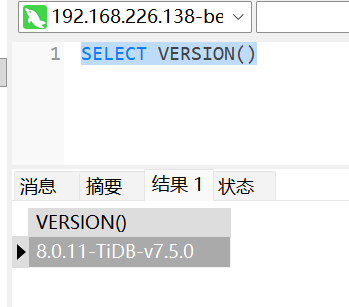

# 14\.新注册用户数量最多的日期为 【不区分大小写】【不区分空格】【不区分换行符 \(不考虑末尾\)】【不区分全半角】 【参考格式：2000/1/1】

2026/4/15

```SQL
SELECT DATE(FROM_UNIXTIME(user_reg_time)) AS reg_date, COUNT(*) FROM mac_user GROUP BY reg_date ORDER BY register_count DESC
```

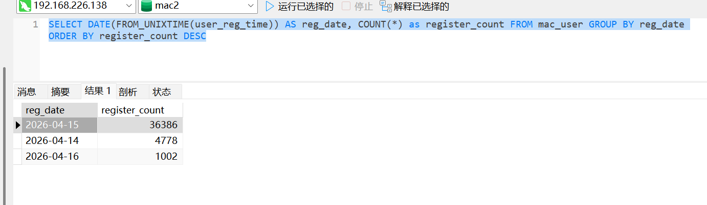

# 15\.马慧美最后一次登录该网站的ip为 【不区分大小写】【不区分空格】【不区分换行符 \(不考虑末尾\)】【不区分全半角】 【参考格式：1\.1\.1\.1】

51\.43\.21\.163

```Plain Text
SELECT * FROM `mac_user` where user_name like "%Ma Hui%"
```

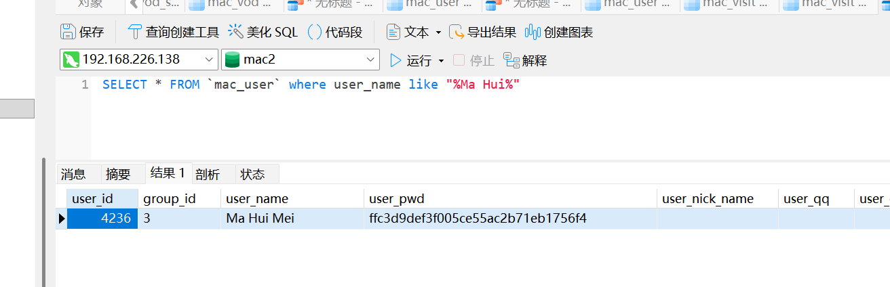

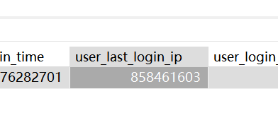

```Plain Text
SELECT INET_NTOA(user_last_login_ip) FROM `mac_user` where user_name like "%Ma Hui%"
```

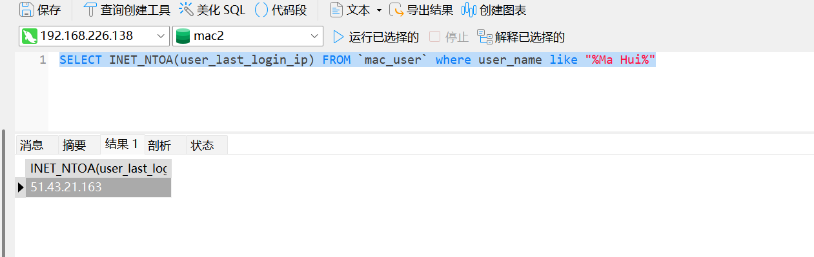

# 16\.以下哪个文件系统未被使用

A\.ntfs

B\.btrfs

C\.xfs

D\.Lvm

AC

```Plain Text
lsblk -f 
```

```Plain Text
root@ubuntu:~# lsblk -f
NAME           FSTYPE            FSVER    LABEL UUID                                   FSAVAIL FSUSE% MOUNTPOINTS
sda                                                                                                   
├─sda1         LVM2_member       LVM2 001       uBbKbG-MxC5-I7pL-cG9j-6Y0S-QTRJ-HeyQdt                
│ └─volum-root linux_raid_member 1.2      mac:0 880f2057-30e6-4da6-5bfd-b06f700131bb                  
│   └─md0      btrfs                            3231e52f-5e15-44c4-b224-e29cb4201c0e     86.1G    23% /
└─sda2         LVM2_member       LVM2 001       GauOGE-c1ZQ-pERE-cdM1-9Oz4-cY3W-klzvyB                
  └─root-data  linux_raid_member 1.2      mac:0 880f2057-30e6-4da6-5bfd-b06f700131bb                  
    └─md0      btrfs                            3231e52f-5e15-44c4-b224-e29cb4201c0e     86.1G    23% /
sdb                                                                                                   
├─sdb1                                                                                                
├─sdb2         LVM2_member       LVM2 001       HwIOOP-kPve-aJ3C-3TFJ-Kcno-CaQU-cBg7oz                
│ └─volum-root linux_raid_member 1.2      mac:0 880f2057-30e6-4da6-5bfd-b06f700131bb                  
│   └─md0      btrfs                            3231e52f-5e15-44c4-b224-e29cb4201c0e     86.1G    23% /
├─sdb3         LVM2_member       LVM2 001       hLwbSv-f4cL-B3x8-YoUn-en4r-oz0i-5ExJcA                
│ └─root-data  linux_raid_member 1.2      mac:0 880f2057-30e6-4da6-5bfd-b06f700131bb                  
│   └─md0      btrfs                            3231e52f-5e15-44c4-b224-e29cb4201c0e     86.1G    23% /
├─sdb5         vfat              FAT32          9693-7941                               178.3M     5% /boot/efi
└─sdb6         swap              1              7c439ba0-6ff2-4ddc-b338-e293953b81fe                  [SWAP]
sr0     
```

LVM、btrfs都有了其他没有

# 17\.该服务器安装了以下那些数据库服务

A\.mysql

B\.GuessDB

C\.tidb

D\.postgresql

E\.Mariadb


mysql有的 tidb有的 

```Plain Text
dpkg -l | grep -iE 'mariadb'
dpkg -l | grep -iE 'postgres'
dpkg -l | grep -iE 'guessdb'
dpkg -l | grep mariadb-server
systemctl status mariadb
```

发现mariadb服务是没有的只有客户端 guessdb 服务器上面没有痕迹

postgres：

```Plain Text
ii  libpq5:amd64                       17.9-0+deb13u1                       amd64        PostgreSQL C client library
ii  php-pgsql                          2:8.4+96                             all          PostgreSQL module for PHP [default]
ii  php8.4-pgsql                       8.4.11-1                             amd64        PostgreSQL module for PHP
ii  postgresql                         17+278                               all          object-relational SQL database (supported version)
ii  postgresql-17                      17.9-0+deb13u1                       amd64        The World's Most Advanced Open Source Relational Database
ii  postgresql-client-17               17.9-0+deb13u1                       amd64        front-end programs for PostgreSQL 17
ii  postgresql-client-common           278                                  all          manager for multiple PostgreSQL client versions
ii  postgresql-common                  278                                  all          PostgreSQL database-cluster manager
ii  postgresql-common-dev              278                                  all          extension build tool for multiple PostgreSQL versions
```

有的，所以答案ACD


