# VNCTF2026复盘\-Reverse

# Reverse

## ezre

### 题目分析

https://singlehorn\.github\.io/2026/02/04/VNCTF2026%E5%87%BA%E9%A2%98%E7%AC%94%E8%AE%B0/

#### 第一步，手动脱壳

这是一个基于mfc框架的GUI程序，使用C\+\+开发，尝试反编译，发现程序被加壳了，使用查壳工具查壳：

```Plain Text
PE64
    Operation system: Windows (Vista) [AMD64, 64 位, GUI]
    Linker: Microsoft Linker
    Compiler: Microsoft Visual C/C++
    Language: C/C++
    Library: Microsoft C/C++ Runtime [dynamic]
    Library: MFC (14.0) [Unicode]
    (Heur) Protection: Generic [Missing DOS + Unreadable resources + Nop EP padding + Section 0 (".text") has RWX + IAT directory empty]
    (Heur) Packer: UPX (3.91+) [Suspicion only]
    (Heur) Packer: Generic [Last section EP + Strange jmp at EP + Imports like UPX (v3.91+) + Section 1 (".rdata") compressed]
```

发现是UPX加壳，但是脱壳失败了，需要手动脱壳。

##### 寻找OEP

打开带壳程序，我们找到了加壳程序的加壳代码和代码脱壳后的跳转地址。

```C
// positive sp value has been detected, the output may be wrong!
void __fastcall sub_14001EA40(__int64 a1, __int64 a2)
{
  unsigned __int64 v2; // rbx
  unsigned __int64 v3; // rbp
  _BYTE *v4; // rdi
  _BYTE *v5; // rsi
  __int64 (__fastcall *v6)(__int64, __int64); // r11
  bool v7; // cf
  int v8; // ebx
  int v9; // ett
  int v10; // eax
  unsigned int v11; // eax
  bool v12; // cf
  int v13; // ebx
  int v14; // ett
  unsigned int v15; // eax
  int v16; // eax
  int v17; // ecx
  __int64 (__fastcall *v18)(_QWORD); // r11
  unsigned int v19; // eax
  __int64 (__fastcall *v20)(__int64); // r11
  __int64 v21; // rcx
  int v22; // ecx
  bool v23; // cf
  int v24; // ebx
  int v25; // ett
  unsigned __int64 v26; // rcx
  _BYTE *v27; // rsi
  int v28; // ebx
  unsigned __int8 v29; // al
  unsigned int *v30; // rsi
  unsigned int v31; // eax
  __int64 v32; // rsi
  char *v33; // rdi
  __int64 v34; // rax
  FARPROC *v35; // rbx
  HMODULE LibraryA; // rbp
  char v37; // al
  const CHAR *v38; // rdx
  char *v39; // rcx
  char v40; // al
  bool v41; // zf
  FARPROC ProcAddress; // rax
  UINT v43; // ecx
  _WORD *v44; // rdi
  unsigned __int64 *i; // rbx
  __int64 v46; // rax
  __int64 v47; // rdi
  unsigned int *v48; // [rsp-60h] [rbp-B0h]
  __int64 (__fastcall *v49)(__int64, __int64); // [rsp-58h] [rbp-A8h]
  _QWORD v50[4]; // [rsp-50h] [rbp-A0h] BYREF
  __int64 v51; // [rsp-30h] [rbp-80h] BYREF
  __int64 v52; // [rsp-28h] [rbp-78h] BYREF

  v6 = v49;
  while ( 1 )
  {
    while ( 1 )
    {
      LOBYTE(a2) = *v5;
      v7 = __CFADD__((_DWORD)v2, (_DWORD)v2);
      LODWORD(v2) = 2 * v2;
      if ( !(_DWORD)v2 )
      {
        v8 = *(_DWORD *)v5;
        v7 = (unsigned __int64)v5 < 0xFFFFFFFFFFFFFFFCuLL;
        v5 += 4;
        v9 = v7 + v8;
        v7 = __CFADD__(v7, v8) | __CFADD__(v8, v9);
        LODWORD(v2) = v8 + v9;
        LOBYTE(a2) = *v5;
      }
      if ( !v7 )
        break;
      ++v5;
      *v4++ = a2;
    }
    do
    {
      v10 = v6(a1, a2);
      v11 = v10 + v7 + v10;
      v12 = __CFADD__((_DWORD)v2, (_DWORD)v2);
      v2 = (unsigned int)(2 * v2);
      if ( !(_DWORD)v2 )
      {
        v13 = *(_DWORD *)v5;
        v7 = (unsigned __int64)v5 < 0xFFFFFFFFFFFFFFFCuLL;
        v5 += 4;
        v14 = v7 + v13;
        v12 = __CFADD__(v7, v13) | __CFADD__(v13, v14);
        v2 = (unsigned int)(v13 + v14);
        LOBYTE(a2) = *v5;
      }
    }
    while ( !v12 );
    v7 = v11 < 3;
    v15 = v11 - 3;
    if ( !v7 )
      break;
LABEL_12:
    v6(a1, a2);
    v19 = v18(v17 + (unsigned int)v7 + v17);
    LODWORD(v21) = v21 + v7 + (_DWORD)v21;
    if ( !(_DWORD)v21 )
    {
      v21 = v19;
      do
      {
        v19 = v20(v21);
        v21 = v22 + (unsigned int)v7 + v22;
        v23 = __CFADD__((_DWORD)v2, (_DWORD)v2);
        LODWORD(v2) = 2 * v2;
        if ( !(_DWORD)v2 )
        {
          v24 = *(_DWORD *)v5;
          v7 = (unsigned __int64)v5 < 0xFFFFFFFFFFFFFFFCuLL;
          v5 += 4;
          v25 = v7 + v24;
          v23 = __CFADD__(v7, v24) | __CFADD__(v24, v25);
          LODWORD(v2) = v24 + v25;
        }
      }
      while ( !v23 );
    }
    ((void (__fastcall *)(_QWORD))sub_14001EA02)(v19 + (v3 < 0xFFFFFFFFFFFFF300uLL) + (_DWORD)v21);
  }
  a2 = (unsigned __int8)a2;
  ++v5;
  v16 = ~((unsigned __int8)a2 | (v15 << 8));
  if ( v16 )
  {
    v3 = v16;
    goto LABEL_12;
  }
  v49 = (__int64 (__fastcall *)(__int64, __int64))v2;
  v26 = v50[0] + 9725LL;
  v27 = (_BYTE *)v50[0];
  v28 = v50[0];
LABEL_28:
  if ( (unsigned __int64)v27 >= v26 )
    goto LABEL_30;
  v29 = *v27;
  v30 = (unsigned int *)(v27 + 1);
  while ( v29 == 0xE8 || v29 == 0xE9 )
  {
    do
    {
      if ( (unsigned __int64)v30 >= v26 )
      {
LABEL_30:
        v32 = v50[0];
        v33 = (char *)(v50[0] + 114688LL);
        while ( 1 )
        {
          v34 = *(unsigned int *)v33;
          if ( !*(_DWORD *)v33 )
            break;
          v35 = (FARPROC *)(v32 + *((unsigned int *)v33 + 1));
          v33 += 8;
          LibraryA = LoadLibraryA((LPCSTR)(v34 + v32 + 193424));
          while ( 1 )
          {
            v37 = *v33++;
            if ( !v37 )
              break;
            if ( v37 >= 0 )
            {
              v39 = v33;
              v38 = v33;
              v40 = v37 - 1;
              do
              {
                if ( !v39 )
                  break;
                v41 = *v33++ == v40;
                --v39;
              }
              while ( !v41 );
            }
            else
            {
              v38 = (const CHAR *)*(unsigned __int16 *)v33;
              v33 += 2;
            }
            ProcAddress = GetProcAddress(LibraryA, v38);
            if ( !ProcAddress )
              ExitProcess(v43);
            *v35++ = ProcAddress;
          }
        }
        v44 = v33 + 4;
        for ( i = (unsigned __int64 *)(v32 - 4); ; *i = v32 + _byteswap_uint64(*i) )
        {
          LODWORD(v46) = *(unsigned __int8 *)v44;
          v44 = (_WORD *)((char *)v44 + 1);
          v46 = (unsigned int)v46;
          if ( !(_DWORD)v46 )
            break;
          if ( (unsigned __int8)v46 > 0xEFu )
          {
            LOBYTE(v46) = v46 & 0xF;
            v46 = (unsigned int)((_DWORD)v46 << 16);
            LOWORD(v46) = *v44++;
          }
          i = (unsigned __int64 *)((char *)i + v46);
        }
        v47 = v32 - 4096;
        v50[0] = 0;
        VirtualProtect((LPVOID)(v32 - 4096), 0x1000u, 4u, (PDWORD)v50);
        *(_BYTE *)(v47 + 559) &= ~0x80u;
        *(_BYTE *)(v47 + 599) &= ~0x80u;
        VirtualProtect((LPVOID)(v32 - 4096), 0x1000u, v50[0], (PDWORD)v50);
        do
          v51 = 0;
        while ( &v51 != &v52 - 16 );
        JUMPOUT(0x140002490LL);//注意这个！！
      }
      v48 = v30;
      v31 = *v30;
      v27 = v30 + 1;
      LOBYTE(v31) = v31 - 2;
      if ( !(_BYTE)v31 )
      {
        *v48 = v28 + _byteswap_ulong(v31) - (_DWORD)v48;
        goto LABEL_28;
      }
LABEL_21:
      v29 = *(_BYTE *)v48;
      v30 = (unsigned int *)((char *)v48 + 1);
    }
    while ( *(_BYTE *)v48 >= 0x80u && v29 <= 0x8Fu && *((_BYTE *)v48 - 1) == 15 );
  }
  if ( (unsigned __int64)v30 >= v26 )
    goto LABEL_30;
  v48 = v30;
  goto LABEL_21;
}
```

找到JUMPOUT语句，打开汇编查看

```Assembly language
.rdata:000000014001EC11 loc_14001EC11:                          ; CODE XREF: sub_14001EA40+1D6↓j
.rdata:000000014001EC11                 push    0
.rdata:000000014001EC13                 cmp     rsp, rax
.rdata:000000014001EC16                 jnz     short loc_14001EC11
.rdata:000000014001EC18                 sub     rsp, 0FFFFFFFFFFFFFF80h ;弹栈
.rdata:000000014001EC1C                 jmp     near ptr qword_140002490 ;大跳转 JUMPOUT(0x140002490LL);
.rdata:000000014001EC1C sub_14001EA40   endp ; sp-analysis failed
```

随后我们打开x64dbg调试，按三次运行，两次步进，我们来到了加壳代码部分:

```Assembly language
00007FF6ACB0E9D0 | 90                       | nop                                     |
00007FF6ACB0E9D1 | 90                       | nop                                     |
00007FF6ACB0E9D2 | 90                       | nop                                     |
00007FF6ACB0E9D3 | 90                       | nop                                     |
00007FF6ACB0E9D4 | 48:8D35 25D6FFFF         | lea rsi,qword ptr ds:[7FF6ACB0C000]     |
00007FF6ACB0E9DB | 48:8DBE 0050FEFF         | lea rdi,qword ptr ds:[rsi-1B000]        |
00007FF6ACB0E9E2 | 57                       | push rdi                                |
00007FF6ACB0E9E3 | 31DB                     | xor ebx,ebx                             |
00007FF6ACB0E9E5 | 31C9                     | xor ecx,ecx                             |
00007FF6ACB0E9E7 | 48:83CD FF               | or rbp,FFFFFFFFFFFFFFFF                 |
00007FF6ACB0E9EB | E8 50000000              | call 153259_ezre.7FF6ACB0EA40           |
00007FF6ACB0E9F0 | 01DB                     | add ebx,ebx                             |
00007FF6ACB0E9F2 | 74 02                    | je 153259_ezre.7FF6ACB0E9F6             |
00007FF6ACB0E9F4 | F3:C3                    | ret                                     |
```

与静态反汇编的对比：

```Assembly language
.rdata:000000014001E9D0 ; START OF FUNCTION CHUNK FOR start
.rdata:000000014001E9D0
.rdata:000000014001E9D0 loc_14001E9D0:                          ; CODE XREF: start:loc_14003102A↓j
.rdata:000000014001E9D0                 nop
.rdata:000000014001E9D1                 nop
.rdata:000000014001E9D2                 nop
.rdata:000000014001E9D3                 nop
.rdata:000000014001E9D4                 lea     rsi, qword_14001C000
.rdata:000000014001E9DB                 lea     rdi, [rsi-1B000h]
.rdata:000000014001E9E2                 push    rdi
.rdata:000000014001E9E3                 xor     ebx, ebx
.rdata:000000014001E9E5                 xor     ecx, ecx
.rdata:000000014001E9E7                 or      rbp, 0FFFFFFFFFFFFFFFFh
.rdata:000000014001E9EB                 call    sub_14001EA40
.rdata:000000014001E9F0                 add     ebx, ebx
.rdata:000000014001E9F2                 jz      short loc_14001E9F6
.rdata:000000014001E9F4                 rep retn
```

随后单步进入`call 153259_ezre.7FF6ACB0EA40`。

```Assembly language
00007FF6ACB0EC11 | 6A 00                    | push 0                                  |
00007FF6ACB0EC13 | 48:39C4                  | cmp rsp,rax                             |
00007FF6ACB0EC16 | 75 F9                    | jne 153259_ezre.7FF6ACB0EC11            |
00007FF6ACB0EC18 | 48:83EC 80               | sub rsp,FFFFFFFFFFFFFF80                |
00007FF6ACB0EC1C | E9 6F38FEFF              | jmp 153259_ezre.7FF6ACAF2490            |
```

然后在代码末尾处，按下F4，单步进入JUMPOUT的入口：

```Assembly language
00007FF6ACAF2490 | 48:83EC 28               | sub rsp,28                              |; OEP
00007FF6ACAF2494 | E8 BB020000              | call 153259_ezre.7FF6ACAF2754           |
00007FF6ACAF2499 | 48:83C4 28               | add rsp,28                              |
00007FF6ACAF249D | E9 7AFEFFFF              | jmp 153259_ezre.7FF6ACAF231C            |
```

我们知道程序的入口点\(OEP\)是`00007FF6ACAF2490`\(以实际情况为准\)。

##### dump文件\+修复

打开Scylla插件，挂载进程，输入OEP，先后点击IAT Autosearch、dump,导出文件。

选择导出文件，点击Get Imports、Fix Dump修复IAT表，就能正常反编译了。


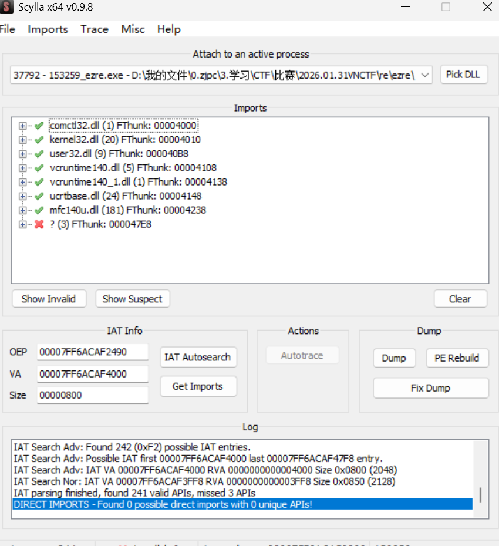

由于缺少dll，跑不起来很正常，但是静态分析就够了。

#### 第二步，寻找迷宫函数

在一大堆sub里面找，找到一个函数结构如下，我将其命名为Verify。

```C++
__int64 __fastcall Verify(CWnd *a1)
{
  int x; // ebx
  char v3; // si
  _QWORD *v4; // rax
  bool v5; // di
  _QWORD *v6; // r13
  int y; // r15d
  unsigned int index; // r12d
  __int64 v9; // rbp
  __int64 v10; // r14
  unsigned __int64 v11; // rdi
  unsigned __int64 v12; // rsi
  __int16 v13; // ax
  _BYTE v16[8]; // [rsp+28h] [rbp-50h] BYREF
  _QWORD *v17; // [rsp+30h] [rbp-48h]
  __int64 v18; // [rsp+38h] [rbp-40h] BYREF
  const wchar_t *v19; // [rsp+40h] [rbp-38h] BYREF

  x = 0;
  v3 = 0;
  LODWORD(v18) = 0;
  ATL::CStringT<wchar_t,StrTraitMFC_DLL<wchar_t,ATL::ChTraitsCRT<wchar_t>>>::CStringT<wchar_t,StrTraitMFC_DLL<wchar_t,ATL::ChTraitsCRT<wchar_t>>>(&v18);
  CWnd::GetWindowTextW((char *)a1 + 376, &v18);
  v5 = 1;
  if ( *(_DWORD *)(v18 - 16) )
  {
    v4 = (_QWORD *)ATL::CStringT<wchar_t,StrTraitMFC_DLL<wchar_t,ATL::ChTraitsCRT<wchar_t>>>::SpanIncluding(
                     &v18,
                     &v19,
                     aWasd);
    v3 = 1;
    if ( *(_DWORD *)(*v4 - 16LL) == *(_DWORD *)(v18 - 16) )
      v5 = 0;
  }
  if ( (v3 & 1) != 0 )
    ATL::CSimpleStringT<wchar_t,1>::~CSimpleStringT<wchar_t,1>(&v19);
  if ( v5 )
  {
    CWnd::MessageBoxW(a1, (const wchar_t *)aWASD, aError, 0x10u);//Error:输入必须由wasd构成
  }
  else
  {
    CreateMaze(a1);
    v6 = (_QWORD *)ATL::CSimpleStringT<wchar_t,1>::CSimpleStringT<wchar_t,1>(v16, &v18);
    v17 = v6;
    y = 0;
    index = 0;
    if ( *(int *)(*v6 - 16LL) > 0 )
    {
      v9 = 0;
      v10 = 0;
      v11 = 0;
      v12 = 0;
      while ( 1 )
      {
        v13 = ATL::CSimpleStringT<wchar_t,1>::operator[](v6, index);
        switch ( v13 )
        {
          case 'a'://移动逻辑
            ++x;
            ++v9;
            ++v12;
            break;
          case 'd':
            --x;
            --v9;
            --v12;
            break;
          case 's':
            --y;
            --v11;
            v10 -= 20;
            break;
          case 'w':
            ++y;
            ++v11;
            v10 += 20;
            break;
        }
        if ( v12 > 0x13 || v11 > 0x13 || *((_DWORD *)a1 + v10 + v9 + 152) == 1 )//撞墙或者超出范围，就跳出循环
          break;
        if ( (signed int)++index >= *(_DWORD *)(*v6 - 16LL) )
        {
          if ( x == 19 && y == 19 )//到达终点(19,19)？
          {
            ATL::CStringT<wchar_t,StrTraitMFC_DLL<wchar_t,ATL::ChTraitsCRT<wchar_t>>>::CStringT<wchar_t,StrTraitMFC_DLL<wchar_t,ATL::ChTraitsCRT<wchar_t>>>(&v19);
            ATL::CStringT<wchar_t,StrTraitMFC_DLL<wchar_t,ATL::ChTraitsCRT<wchar_t>>>::Format(
              &v19,
              aCorrectYourFla,
              *v6);
            CWnd::MessageBoxW(a1, v19, aCongratulation, 0x40u);//Congratulations:correct! your flag is VNCTF{%s} 
            ATL::CSimpleStringT<wchar_t,1>::~CSimpleStringT<wchar_t,1>(&v19);
            goto LABEL_27;
          }
          break;
        }
      }
    }
    CWnd::MessageBoxW(a1, aWrongTryAgain, aError, 0x10u);//Error:wrong, try again.
LABEL_27:
    ATL::CSimpleStringT<wchar_t,1>::~CSimpleStringT<wchar_t,1>(v6);
  }
  return ATL::CSimpleStringT<wchar_t,1>::~CSimpleStringT<wchar_t,1>(&v18);
}
```

else语句下有一个函数是基于栈的迷宫生成算法：

```C++
__int64 __fastcall CreateMaze(_DWORD *a1)
{
  _DWORD *m_map; // rax
  __int64 j; // rcx
  __m128i si128; // xmm0
  int *TopstackY_ptr; // r15
  __m128i v6; // xmm1
  int *TopstackX_ptr; // r12
  __int64 v8; // r14
  __int64 TopstackX_value; // rsi
  int vnCount; // ebx
  __int64 TopstackY_value; // rdi
  __int64 v12; // rdx
  __int64 result; // rax
  __int64 choice; // rcx
  int dx; // r9d
  int ny; // r10d
  int dy; // kr00_4
  bool v18; // zf
  _DWORD validNeighbors[4]; // [rsp+20h] [rbp-CD8h]
  _OWORD dirs[2]; // [rsp+30h] [rbp-CC8h]
  _DWORD stackX[400]; // [rsp+50h] [rbp-CA8h] BYREF
  _DWORD stackY[400]; // [rsp+690h] [rbp-668h] BYREF

  srand(0x64u);
  m_map = a1 + 153;
  j = 20;
  do
  {
    *(m_map - 1) = 1;
    *m_map = 1;
    m_map[1] = 1;
    m_map[2] = 1;
    m_map[3] = 1;
    m_map[4] = 1;
    m_map[5] = 1;
    m_map[6] = 1;
    m_map[7] = 1;
    m_map[8] = 1;
    m_map[9] = 1;
    m_map[10] = 1;
    m_map[11] = 1;
    m_map[12] = 1;
    m_map[13] = 1;
    m_map[14] = 1;
    m_map[15] = 1;
    m_map[16] = 1;
    m_map[17] = 1;
    m_map[18] = 1;
    m_map += 20;
    --j;
  }                                             // 初始化全为墙，20*20迷宫
  while ( j );
  si128 = _mm_load_si128((const __m128i *)&unk_7FF7676758C0);// 2,0 -2,0
  TopstackY_ptr = stackY;
  v6 = _mm_load_si128((const __m128i *)&unk_7FF7676758D0);// 0,2 0,-2
  TopstackX_ptr = stackX;
  v8 = 1;
  a1[152] = 0;                                  // m_map首地址
  stackX[0] = 0;                                // 起点入栈
  stackY[0] = 0;
  dirs[0] = si128;
  dirs[1] = v6;
  do
  {
    TopstackX_value = *TopstackX_ptr;
    vnCount = 0;
    TopstackY_value = *TopstackY_ptr;
    v12 = 0;
    if ( (unsigned int)(TopstackX_value + 2) <= 0x13
      && (unsigned int)TopstackY_value <= 0x13
      && a1[20 * TopstackY_value + 154 + TopstackX_value] == 1 )
    {
      vnCount = 1;
      validNeighbors[0] = 0;
      v12 = 1;
    }
    if ( (unsigned int)(TopstackX_value - 2) <= 0x13
      && (unsigned int)TopstackY_value <= 0x13
      && a1[20 * TopstackY_value + 150 + TopstackX_value] == 1 )
    {
      ++vnCount;
      validNeighbors[v12++] = 1;
    }
    if ( (unsigned int)TopstackX_value <= 0x13
      && (unsigned int)(TopstackY_value + 2) <= 0x13
      && a1[20 * TopstackY_value + 192 + TopstackX_value] == 1 )
    {
      ++vnCount;
      validNeighbors[v12++] = 2;
      result = (unsigned int)(TopstackY_value - 2);
    }
    else
    {
      result = (unsigned int)(TopstackY_value - 2);
      if ( (unsigned int)TopstackX_value >= 0x14 )
        goto LABEL_20;
    }
    if ( (unsigned int)result <= 0x13 && a1[20 * TopstackY_value + 112 + TopstackX_value] == 1 )
    {
      validNeighbors[v12] = 3;
      ++vnCount;
    }
LABEL_20:
    if ( vnCount )
    {
      ++TopstackX_ptr;
      choice = (int)validNeighbors[rand() % vnCount];
      dx = *((_DWORD *)dirs + 2 * choice);
      ny = *((_DWORD *)dirs + 2 * choice + 1) + TopstackY_value;
      dy = *((_DWORD *)dirs + 2 * choice + 1);
      stackY[v8] = ny;
      stackX[v8++] = dx + TopstackX_value;
      ++TopstackY_ptr;
      a1[20 * (int)TopstackY_value + 152 + 20 * (dy / 2) + (int)TopstackX_value + dx / 2] = 0;// 打通中间
      result = dx + (int)TopstackX_value;
      a1[20 * ny + 152 + result] = 0;           // 打通目标
    }
    else
    {
      --v8;
      --TopstackX_ptr;
      --TopstackY_ptr;
    }
  }
  while ( v8 > 0 );
  v18 = a1[531] == 1;                           // a1[531] == m_map[18][19]
  a1[551] = 0;                                  // m_map[19][19] = 0
  if ( v18 )
    a1[550] = 0;                                // m_map[19][18] = 0
  else
    a1[531] = 0;                                // m_map[18][19] = 0
  return result;
}
```

#### 第三步，分析迷宫结构

出题人的生成算法的源代码：

```Java
void CMFCApplication2Dlg::create_map()
{
        srand(100);//srand(0x64u);

        for (int y = 0; y < 20; y++) {
                for (int x = 0; x < 20; x++) {
                        m_map[y][x] = 1;//初始化全为墙，20*20迷宫
                }
        }
        

        int stackX[400];//栈x
        int stackY[400];//栈y
        int top = 0;//栈顶

        int cx = 0;//当前x
        int cy = 0;//当前y
        m_map[cy][cx] = 0; //挖通起点


        stackX[top] = cx;//当前点x入栈
        stackY[top] = cy;//当前点y入栈
        top++;//栈顶+1


        int dirs[4][2] = { {2, 0}, {-2, 0}, {0, 2}, {0, -2} };//方向数组，代表每一次走的步数
        //上2，下2，右2，左2
        while (top > 0) {//栈内有数据
        
                cx = stackX[top - 1];//取栈顶x数据
                cy = stackY[top - 1];//取栈顶y数据

                
                int validNeighbors[4];//合法邻居
                int vnCount = 0;//合法邻居数量

                for (int i = 0; i < 4; i++) {
                        int nx = cx + dirs[i][0];//走过的x坐标
                        int ny = cy + dirs[i][1];//走过的y坐标

                        if (nx >= 0 && nx < 20 && ny >= 0 && ny < 20) {//如果未出界
                                if (m_map[ny][nx] == 1) {//如果未挖通
                                        validNeighbors[vnCount++] = i;//标记某个方向上的合法邻居索引
                                }
                        }
                }

                if (vnCount > 0) {

                        int choice = rand() % vnCount;//从[0,合法邻居数)取一个数值
                        int dirIndex = validNeighbors[choice];//获取目标索引，打到随机挖通一个的效果

                        int nx = cx + dirs[dirIndex][0];//第二步的x
                        int ny = cy + dirs[dirIndex][1];//第二步的y
                        int wx = cx + dirs[dirIndex][0] / 2;//第一步的x
                        int wy = cy + dirs[dirIndex][1] / 2;//第一步的y
                        m_map[wy][wx] = 0;

                        m_map[ny][nx] = 0;//挖通

                        stackX[top] = nx;//第二步的x入栈
                        stackY[top] = ny;//第二步的y入栈
                        top++;
                }
                else {
                        top--;//弹栈
                }
        }

        m_map[19][19] = 0;//挖通(19,19)

        if (m_map[18][19] == 1) {//如果(19,18)是墙
                m_map[19][18] = 0;//挖通(18,19)
        }
        else {
                m_map[18][19] = 0;//挖通(19,18)
        }
}
/*
  0 1 2 3 4 5 6 7 8 9 0 1 2 3 4 5 6 7 8 9
0 S # . . . . . . . . . # . . . . . . . # 
1 * # # # # # # # # # . # . # # # . # . # 
2 * * * * * * * * * # . . . # . . . # . # 
3 # # # # # # # # * # . # # # . # # # . # 
4 . . . . . . . # * # . # . # . . . # . # 
5 # # . # . # # # * # . # . # # # . # # # 
6 . . . # . # * * * # . . . . . # . . . # 
7 . # . # # # * # # # # # . # # # # # . # 
8 . # . # * * * # . . . # . # * * * # . # 
9 . # . # * # # # # # . # . # * # * # . # 
0 . # . # * * * * * # . . . # * # * # . # 
1 . # # # # # # # * # # # # # * # * # . # 
2 . . . . . . . # * * * * * * * # * * * # 
3 . # # # # # . # # # # # # # # # # # * # 
4 . . . # . . . # . . . . . . . . . # * # 
5 # # . # . # # # . # # # # # # # . # * # 
6 . # . # . # . . . # . . . . . # . # * # 
7 . # . # . # . # # # . # # # . # . # * # 
8 . . . # . . . . . . . # . . . # . . * # 
9 # # # # # # # # # # # # # # # # # # * E
*/
```

### 题目求解

使用BFS算法。

https://www\.cnblogs\.com/vLiion/p/17921652\.html

https://www\.cnblogs\.com/msjs/p/18784738

https://blog\.csdn\.net/the\_ZED/article/details/100806581

https://www\.bilibili\.com/video/BV1DL411x76e/?spm\_id\_from=333\.337\.search\-card\.all\.click\&vd\_source=8909f7c997b3bcc821604c7621b0dfdc

编写以下脚本：

```C
#include <stdio.h>
#include <stdlib.h>
#include <time.h>
#include <string.h>

#define WIDTH 20
#define HEIGHT 20

*//* *方向数组：右(2,0),* *下(0,2),* *左(-2,0),* *上(0,-2)*
const int dirs[4][2] = {
    {2, 0},   *//* *右*
    {0, 2},   *//* *下*  
    {-2,0},  *//* *左*
    {0,-2}   *//* *上*
};

void generate_maze(int maze[HEIGHT][WIDTH]) {
    *//* *初始化随机种子*
    *//srand(0x64);*
    srand(0x64);
    
     *//* *1.* *初始化所有格子为墙壁* *(1)*
    for (int y = 0; y < HEIGHT; y++) {
        for (int x = 0; x < WIDTH; x++) {
            maze[y][x] = 1;
        }
    }
    
     *//* *2.* *设置起点为通路* *(0,0)*
    maze[0][0] = 0;
    
     *//* *3.* *使用栈实现递归回溯算法*
    int stack_x[400];  *//* *存储x坐标*
    int stack_y[400];  *//* *存储y坐标*
    int stack_top = 0;
    
     *//* *起点入栈*
    stack_x[stack_top] = 0;
    stack_y[stack_top] = 0;
    stack_top++;
    
     while (stack_top > 0) {
        *//* *获取栈顶元素作为当前位置*
        int x = stack_x[stack_top - 1];
        int y = stack_y[stack_top - 1];
        
         *//* *检查四个方向是否有可挖的墙壁*
        int available_dirs[4];
        int dir_count = 0;
        
         *//* *检查右方向* *(dx=2,* *dy=0)*
        if (x + 2 < WIDTH && maze[y][x + 2] == 1) {
            available_dirs[dir_count++] = 0;
        }
        
         *//* *检查左方向* *(dx=-2,* *dy=0)*
        if (x - 2 >= 0 && maze[y][x - 2] == 1) {
            available_dirs[dir_count++] = 2;
        }
        
         *//* *检查下方向* *(dx=0,* *dy=2)*
        if (y + 2 < HEIGHT && maze[y + 2][x] == 1) {
            available_dirs[dir_count++] = 1;
        }
        
         *//* *检查上方向* *(dx=0,* *dy=-2)*
        if (y - 2 >= 0 && maze[y - 2][x] == 1) {
            available_dirs[dir_count++] = 3;
        }
        
         if (dir_count > 0) {
            *//* *随机选择一个可挖的方向*
            int dir_idx = available_dirs[rand() % dir_count];
            int dx = dirs[dir_idx][0];
            int dy = dirs[dir_idx][1];
            
             *//* *挖通两格：中间格和目标格*
            *//* *中间格*
            maze[y + dy/2][x + dx/2] = 0;
            *//* *目标格*
            maze[y + dy][x + dx] = 0;
            
             *//* *将新位置压栈*
            stack_x[stack_top] = x + dx;
            stack_y[stack_top] = y + dy;
            stack_top++;
        } else {
            *//* *没有可挖的方向，回溯（出栈）*
            stack_top--;
        }
    }
    
     *//* *4.* *确保终点* *(19,19)* *是通路*
    maze[19][19] = 0;
    
     *//* *5.* *检查并确保到达终点的路径*
    *//* *如果* *(19,18)* *是墙壁，挖通(18,19)*
    if (maze[18][19] == 1) {
        maze[19][18] = 0;
    } else {
        *//* *否则挖通* *(19,18)* 
         maze[18][19] = 0;
    }
 }

*//* *打印迷宫*
void print_maze(int maze[HEIGHT][WIDTH]) {
    printf("迷宫布局 (0=通路, 1=墙壁):\n");
    printf("  ");
    for (int x = 0; x < WIDTH; x++) {
        printf("%2d", x % 10);
    }
    printf("\n");
    
    for (int y = 0; y < HEIGHT; y++) {
        printf("%2d ", y % 10);
        for (int x = 0; x < WIDTH; x++) {
            if (x == 0 && y == 0) {
                printf("S ");  *//* *起点*
            } else if (x == WIDTH-1 && y == HEIGHT-1) {
                printf("E ");  *//* *终点*
            } else {
                printf("%c ", maze[y][x] ? '#' : '.');
            }
        }
        printf("\n");
    }
 }
*//* *BFS找最短路径*
int find_path(int maze[HEIGHT][WIDTH], char* path) {
    const char dir_chars[4] = {'a', 'd', 'w', 's'};  *//* *右,左,下,上*
    const int moves[4][2] = {{1,0}, {-1,0}, {0,1}, {0,-1}};*//* *右,左,下,上*
    
    struct Node {
        int x, y;// 坐标
        int steps;// 到达该点的步数
        int prev_dir;// 到达该点的方向
        int parent_idx;// 父节点在队列中的索引
    } queue[400];
    
    int front = 0, rear = 0;
    int visited[HEIGHT][WIDTH];
    memset(visited, -1, sizeof(visited));//初始化为-1
    
     *//* *起点入队*
    queue[rear].x = 0;
    queue[rear].y = 0;
    queue[rear].steps = 0;
    queue[rear].prev_dir = -1;
    queue[rear].parent_idx = -1;
    visited[0][0] = rear;// 记录在队列中的位置
    rear++;// 队尾指针后移
    
     while (front < rear) {// 队列不为空
        struct Node current = queue[front];//获取队首元素
        
         *//* *到达终点*
        if (current.x == WIDTH-1 && current.y == HEIGHT-1) {
            *//* *回溯重建路径*
            int idx = front;
            int path_len = current.steps;
            path[path_len] = '\0';
            
            for (int i = path_len-1; i >= 0; i--) {
                int dir_idx = queue[idx].prev_dir;//父节点的方向索引
                path[i] = dir_chars[dir_idx];//父节点的方向
                idx = queue[idx].parent_idx;//索引设为父节点索引
            }
            return path_len;
        }
        
         *//* *尝试四个方向*
        for (int i = 0; i < 4; i++) {
            int nx = current.x + moves[i][0];
            int ny = current.y + moves[i][1];
            
            if (nx >= 0 && nx < WIDTH && ny >= 0 && ny < HEIGHT &&
                maze[ny][nx] == 0 && visited[ny][nx] == -1) {//在界内且未访问
                //新节点入队（队尾）
                queue[rear].x = nx;//新节点x
                queue[rear].y = ny;//新节点y
                queue[rear].steps = current.steps + 1;//当前距离起点步数
                queue[rear].prev_dir = i;// 到达该点的方向
                queue[rear].parent_idx = front;// 父节点在队列中的索引
                visited[ny][nx] = rear;// 记录父节点索引
                rear++;// 队尾指针后移
            }
        }
        front++;//队首出队
    }
    
    return -1;
 }

int main() {
    int maze[HEIGHT][WIDTH];
    char path[1000];
    
    printf("生成固定迷宫 (种子=100)...\n");
    generate_maze(maze);
    print_maze(maze);
    
    printf("\n寻找最短路径...\n");
    int path_len = find_path(maze, path);
    
    if (path_len > 0) {
        printf("找到路径! 长度: %d\n", path_len);
        printf("wasd序列: %s\n", path);
        printf("flag: VNCTF{%s}\n", path);
    } else {
        printf("没有找到路径!\n");
    }
    return 0;
 }
```

VNCTF\{wwaaaaaaaawwwwddwwddwwaaaawwaaaaaassssaawwwwaawwwwwwwa\}

## login

### 题目分析

题目附件有一个流量包和app。

#### 流量包

浏览大量数据条目，在过滤框中输入http，发现一些流量数据。

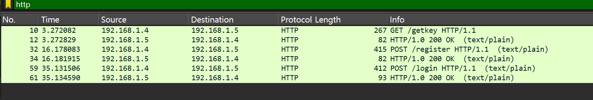

```Plain Text
GET /getkey HTTP/1.1
Accept: text/plain
User-Agent: Dalvik/2.1.0 (Linux; U; Android 15; 2312DRAABC Build/AP3A.240905.015.A2)
Host: 192.168.1.5:8080
Connection: Keep-Alive
Accept-Encoding: gzip


HTTP/1.0 200 OK
Server: BaseHTTP/0.6 Python/3.11.0
Date: Fri, 23 Jan 2026 11:58:42 GMT
Content-Type: text/plain; charset=utf-8
Content-Length: 16

MnpiiylSrRk_mZ-H


POST /register HTTP/1.1
Content-Type: text/plain; charset=utf-8
sign: ff42fc4b17a74e63052d9b02886b4f3e
Content-Length: 64
User-Agent: Dalvik/2.1.0 (Linux; U; Android 15; 2312DRAABC Build/AP3A.240905.015.A2)
Host: 192.168.1.5:8080
Connection: Keep-Alive
Accept-Encoding: gzip

Y7nFpNWxMh0rzWixEN1+1dzQPzjE/PxfCVWEvGww3eK+fIstVlwllNUaHFujEveg
HTTP/1.0 200 OK
Server: BaseHTTP/0.6 Python/3.11.0
Date: Fri, 23 Jan 2026 11:58:55 GMT
Content-Type: text/plain; charset=utf-8
Content-Length: 16

register success


POST /login HTTP/1.1
Content-Type: text/plain; charset=utf-8
sign: ff42fc4b17a74e63052d9b02886b4f3e
Content-Length: 64
User-Agent: Dalvik/2.1.0 (Linux; U; Android 15; 2312DRAABC Build/AP3A.240905.015.A2)
Host: 192.168.1.5:8080
Connection: Keep-Alive
Accept-Encoding: gzip

Y7nFpNWxMh0rzWixEN1+1dzQPzjE/PxfCVWEvGww3eK+fIstVlwllNUaHFujEveg
HTTP/1.0 200 OK
Server: BaseHTTP/0.6 Python/3.11.0
Date: Fri, 23 Jan 2026 11:59:14 GMT
Content-Type: text/plain; charset=utf-8
Content-Length: 27

VNCTF{test!!test!!!test!!!}
```

数据中，我们发现base64字符，密钥。

密钥：

MnpiiylSrRk\_mZ\-H

base64:

Y7nFpNWxMh0rzWixEN1\+1dzQPzjE/PxfCVWEvGww3eK\+fIstVlwllNUaHFujEveg

提取加密数据和密钥，备用。

#### app

用jadx反编译，发现在类`com.britney.login.p001ui.auth.LoginActivity`里面找到登录数据包的构建函数。

```Java
private void attemptLogin() {
    String username;
    if (this.binding.inputUsername.getText() == null) {
        username = "";
    } else {
        username = this.binding.inputUsername.getText().toString().trim();
    }
    String password = this.binding.inputPassword.getText() != null ? this.binding.inputPassword.getText().toString().trim() : "";
    if (username.isEmpty()) {
        this.binding.layoutUsername.setError(getString(C0540R.string.error_username_required));
        return;
    }
    if (password.isEmpty()) {
        this.binding.layoutPassword.setError(getString(C0540R.string.error_password_required));
        return;
    }
    this.binding.layoutUsername.setError(null);
    this.binding.layoutPassword.setError(null);
    this.binding.resultText.setVisibility(8);
    String payload = username + ":" + password;
    final String encrypted = NativeBridge.encrypt(payload, this);//加密用户名密码键值对
    final String sign = NativeBridge.sign(payload, encrypted, this);//生成签名
    setLoading(true);
    new Thread(new Runnable() { // from class: com.britney.login.ui.auth.LoginActivity$$ExternalSyntheticLambda3
        @Override // java.lang.Runnable
        public final void run() {
            this.f$0.m302lambda$attemptLogin$5$combritneyloginuiauthLoginActivity(encrypted, sign);
        }
    }).start();
}

/* renamed from: lambda$attemptLogin$5$com-britney-login-ui-auth-LoginActivity, reason: not valid java name */
/* synthetic */ 
void m302lambda$attemptLogin$5$combritneyloginuiauthLoginActivity(String encrypted, String sign) {
    String result;
    HttpURLConnection connection = null;
    try {
        try {
            connection = ApiClient.post(this, "/login", encrypted, "sign", sign);//发送请求
            result = ApiClient.readResponse(connection);
        } catch (Exception e) {
            result = getString(C0540R.string.error_network, new Object[]{e.getMessage()});
            if (connection != null) {
            }
        }
        final String finalResult = result;
        runOnUiThread(new Runnable() { // from class: com.britney.login.ui.auth.LoginActivity$$ExternalSyntheticLambda5
            @Override // java.lang.Runnable
            public final void run() {
                this.f$0.m301lambda$attemptLogin$4$combritneyloginuiauthLoginActivity(finalResult);
            }
        });
    } finally {
        if (connection != null) {
            connection.disconnect();
        }
    }
}
```

`com.britney.login.util.NativeBridge`类，这是JNI函数：

```Java
**package** com.britney.login.util;
**import** android.content.Context;
*/* loaded from: classes7.dex */*
**public** **class** NativeBridge {
    **public** **static** **native** String encrypt(String str, Context context);
    **public** **static** **native** **void** setKey(String str);
    **public** **static** **native** String sign(String str, String str2, Context context);
}
```

`com.britney.login.p001ui.splash.SplashActivity`中的获取密钥的函数：

```Java
void m309lambda$onCreate$0$combritneyloginuisplashSplashActivity() {
    HttpURLConnection connection = null;
    boolean initOk = false;
    try {
        connection = ApiClient.get(this, "/getkey");
        int status = connection.getResponseCode();
        if (status == 200) {
            String key = ApiClient.readBody(connection);
            if (!key.isEmpty()) {
                NativeBridge.setKey(key);
                initOk = true;
            }
        }
    } catch (Exception e) {
        initOk = false;
        if (connection != null) {
        }
    } catch (Throwable th) {
        if (connection != null) {
            connection.disconnect();
        }
        AppState.setKeyInitialized(this, false);
        throw th;
    }
    if (connection != null) {
        connection.disconnect();
    }
    AppState.setKeyInitialized(this, initOk);
}
```

`com.britney.login.p001ui.auth.RegisterActivity`类,实现了注册：

```TypeScript
private void attemptRegister() {
    String username;
    String password;
    if (this.binding.inputUsername.getText() == null) {
        username = "";
    } else {
        username = this.binding.inputUsername.getText().toString().trim();
    }
    if (this.binding.inputPassword.getText() == null) {
        password = "";
    } else {
        password = this.binding.inputPassword.getText().toString().trim();
    }
    String confirm = this.binding.inputConfirm.getText() != null ? this.binding.inputConfirm.getText().toString().trim() : "";
    if (username.isEmpty()) {
        this.binding.layoutUsername.setError(getString(C0540R.string.error_username_required));
        return;
    }
    if (password.isEmpty()) {
        this.binding.layoutPassword.setError(getString(C0540R.string.error_password_required));
        return;
    }
    if (!password.equals(confirm)) {
        this.binding.layoutConfirm.setError(getString(C0540R.string.error_password_mismatch));
        return;
    }
    this.binding.layoutUsername.setError(null);
    this.binding.layoutPassword.setError(null);
    this.binding.layoutConfirm.setError(null);
    String payload = username + ":" + password;
    final String encryped = NativeBridge.encrypt(payload, this);
    final String sign = NativeBridge.sign(payload, encryped, this);
    setLoading(true);
    new Thread(new Runnable() { // from class: com.britney.login.ui.auth.RegisterActivity$$ExternalSyntheticLambda5
        @Override // java.lang.Runnable
        public final void run() {
            this.f$0.m60x6aa26114(encryped, sign);
        }
    }).start();
}

/* renamed from: lambda$attemptRegister$5$com-britney-login-ui-auth-RegisterActivity */
/* synthetic */ 
void m60x6aa26114(String encryped, String sign) {
    String result;
    HttpURLConnection connection = null;
    try {
        try {
            connection = ApiClient.post(this, "/register", encryped, "sign", sign);
            result = ApiClient.readResponse(connection);
        } catch (Exception e) {
            result = getString(C0540R.string.error_network, new Object[]{e.getMessage()});
            if (connection != null) {
            }
        }
        final String finalResult = result;
        runOnUiThread(new Runnable() { // from class: com.britney.login.ui.auth.RegisterActivity$$ExternalSyntheticLambda4
            @Override // java.lang.Runnable
            public final void run() {
                this.f$0.m59xa7b5f7b5(finalResult);
            }
        });
    } finally {
        if (connection != null) {
            connection.disconnect();
        }
    }
}
```

我们发现，加密的逻辑在native层，于是逆向\.so文件,为了理解代码，我们对函数标识符进行恢复。

setKey函数只将服务器端的数据进行接收，放到key数组。

```C++
__int64 __fastcall Java_com_britney_login_util_NativeBridge_setKey(__int64 a1, __int64 a2, __int64 a3)
{
  __int64 result; // rax
  int i; // [rsp+Ch] [rbp-24h]
  __int64 v5; // [rsp+10h] [rbp-20h]

  result = GetStringUTFChars_w(a1, a3, 0);
  v5 = result;
  for ( i = 0; i < 16; ++i )
  {
    keystr[i] = *(_BYTE *)(v5 + i);
    result = (unsigned int)(i + 1);
  }
  return result;
}
```

encrypt函数：

```C++
__int64 __fastcall Java_com_britney_login_util_NativeBridge_encrypt(
        __int64 JNIEnv_ptr,
        __int64 a2,
        __int64 a3,
        __int64 a4)
{
  unsigned int plaintext_len; // [rsp+48h] [rbp-3B8h]
  const char *StringUTFChars_w; // [rsp+58h] [rbp-3A8h]
  _BYTE b64result[352]; // [rsp+80h] [rbp-380h] BYREF
  _OWORD cipertext[16]; // [rsp+1E0h] [rbp-220h] BYREF
  _BYTE plaintext[256]; // [rsp+2E0h] [rbp-120h] BYREF
  __int128 android_id; // [rsp+3E0h] [rbp-20h] BYREF
  int v13; // [rsp+3F0h] [rbp-10h]
  unsigned __int64 v14; // [rsp+3F8h] [rbp-8h]

  v14 = __readfsqword(0x28u);
  StringUTFChars_w = (const char *)GetStringUTFChars_w(JNIEnv_ptr, a3, 0);
  android_id = 0;
  v13 = 0;
  GetAndroidId(JNIEnv_ptr, a4, (__int64)&android_id);
  snprintf((__int64)plaintext, 256, 256, (__int64)"%s:%s", StringUTFChars_w, (const char *)&android_id);
  ReleaseStringUTFChars_w(JNIEnv_ptr, a3, (__int64)StringUTFChars_w);
  plaintext_len = Padding((__int64)plaintext, 0x100u);
  memset(cipertext, 0, sizeof(cipertext));
  Encrypt((__int64)keystr, 0x10u, (__int64)plaintext, (__int64)cipertext, plaintext_len);
  memset(b64result, 0, 0x15Eu);
  SpecialBase64Encode((char *)cipertext, plaintext_len, b64result);
  return NewStringUTF_w(JNIEnv_ptr, (__int64)b64result);
}
```

填充函数：

```C++
unsigned __int64 __fastcall Padding(__int64 startaddr, unsigned __int64 length)
{
  bool v3; // [rsp+1h] [rbp-31h]
  unsigned __int64 j; // [rsp+2h] [rbp-30h]
  unsigned __int64 padding_len; // [rsp+Ah] [rbp-28h]
  unsigned __int64 plaintext_len; // [rsp+12h] [rbp-20h]

  for ( plaintext_len = 0; ; ++plaintext_len )
  {
    v3 = 0;
    if ( plaintext_len < length )
      v3 = *(_BYTE *)(startaddr + plaintext_len) != 0;
    if ( !v3 )
      break;
  }                                             // 计算字符串长度，从开始到\0的距离
  if ( plaintext_len == length || !plaintext_len )// 字符串长为0，或者字符串长度与缓冲区一致（填满了），不用填充，返回0
    return 0;
  padding_len = (16 - (plaintext_len & 0xF)) & 0xF;// (16-(plaintext_len % 16)) % 16 计算填充字节数
  if ( padding_len + plaintext_len + 1 > length )// 如果要填充的字节数长度与明文相加再加\0大于数组长度，就不填充
    return 0;
  for ( j = 0; j < padding_len; ++j )
    *(_BYTE *)(startaddr + j + plaintext_len) = 1;// 填充1
  *(_BYTE *)(startaddr + padding_len + plaintext_len) = 0;// 末尾加上\0
  return padding_len + plaintext_len;           // 返回填充长度
}
```

加密函数：

```C++
__int64 __fastcall Encrypt(
        __int64 keystr_addr,
        unsigned int key_len,
        __int64 plaintext_addr,
        __int64 cipertext_addr,
        unsigned int plaintext_len)
{
  int j; // [rsp+8h] [rbp-208h]
  unsigned int i; // [rsp+Ch] [rbp-204h]
  _BYTE *current_expand_key_ptr; // [rsp+10h] [rbp-200h]
  __int64 current_cipertext_ptr; // [rsp+18h] [rbp-1F8h]
  _BYTE state_array[16]; // [rsp+70h] [rbp-1A0h] BYREF
  _BYTE key_addr[16]; // [rsp+80h] [rbp-190h] BYREF
  _BYTE s[20]; // [rsp+90h] [rbp-180h] BYREF
  _BYTE expand_key_addr[356]; // [rsp+A4h] [rbp-16Ch] BYREF
  unsigned __int64 v18; // [rsp+208h] [rbp-8h]

  v18 = __readfsqword(0x28u);
  current_cipertext_ptr = cipertext_addr;
  current_expand_key_ptr = expand_key_addr;
  memset(s, 0, 0x10u);
  memset(key_addr, 0, sizeof(key_addr));
  memset(state_array, 0, sizeof(state_array));
  if ( keystr_addr && plaintext_addr && cipertext_addr )
  {
    if ( key_len <= 0x10 )                      // key长度小于等于16
    {
      if ( (plaintext_len & 0xF) != 0 )         // 填充明文长度不是16倍数就退出
      {
        return (unsigned int)-1;
      }
      else
      {
        __memcpy_chk(key_addr, keystr_addr, key_len, 16);
        KeyExpansion(key_addr, 16, expand_key_addr);// 密钥拓展
        for ( i = 0; i < plaintext_len; i += 16 )// 16字节为一组
        {
          LoadStateArray(state_array, plaintext_addr);
          AddRoundKey(state_array, expand_key_addr);
          for ( j = 1; j < 10; ++j )            // 10轮迭代
          {
            current_expand_key_ptr += 16;
            ShiftRows(state_array);//魔改点：调换了shiftRows和subBytes的顺序
            SubBytes(state_array);
            MixColumns(state_array);
            AddRoundKey(state_array, current_expand_key_ptr);
          }
          ShiftRows(state_array);
          SubBytes(state_array);
          AddRoundKey(state_array, current_expand_key_ptr + 16);
          StoreStateArray(state_array, current_cipertext_ptr);
          current_cipertext_ptr += 16;
          plaintext_addr += 16;
          current_expand_key_ptr = expand_key_addr;
        }
        return 0;
      }
    }
    else
    {
      return (unsigned int)-1;
    }
  }
  else
  {
    return (unsigned int)-1;
  }
}
```

密钥拓展函数：

```C++
__int64 __fastcall KeyExpansion(__int64 key_addr, int key_len, _DWORD *expand_key_addr)
{
  int m; // [rsp+0h] [rbp-40h]
  int k; // [rsp+4h] [rbp-3Ch]
  int j; // [rsp+8h] [rbp-38h]
  int i; // [rsp+Ch] [rbp-34h]
  _DWORD *after_Sbox_shift; // [rsp+10h] [rbp-30h]
  _DWORD *current_key_group8; // [rsp+18h] [rbp-28h]
  _DWORD *Sbox_shift_end; // [rsp+18h] [rbp-28h]

  if ( key_addr && expand_key_addr )
  {
    if ( key_len == 16 )
    {
      current_key_group8 = expand_key_addr;
      after_Sbox_shift = expand_key_addr + 44;
      for ( i = 0; i < 4; ++i )
        expand_key_addr[i] = _byteswap_ulong(*(_DWORD *)(key_addr + 4 * i));
      for ( j = 0; j < 10; ++j )
      {
        current_key_group8[4] = Rcon[j]
            ^ Sbox[HIBYTE(current_key_group8[3])]
            ^ (unsigned __int16)(Sbox[(unsigned __int8)current_key_group8[3]] << 8)
            ^ (Sbox[BYTE1(current_key_group8[3])] << 16)
            & 0xFF0000
            ^ (Sbox[(unsigned __int8)BYTE2(current_key_group8[3])] << 24)
            ^ *current_key_group8;
        current_key_group8[5] = current_key_group8[4] ^ current_key_group8[1];// 后续字直接异或
        current_key_group8[6] = current_key_group8[5] ^ current_key_group8[2];
        current_key_group8[7] = current_key_group8[6] ^ current_key_group8[3];
        current_key_group8 += 4;                // 前进4个字节
      }
      Sbox_shift_end = expand_key_addr + 40;
      for ( k = 0; k < 11; ++k )
      {
        for ( m = 0; m < 4; ++m )
          after_Sbox_shift[m] = Sbox_shift_end[m];// 反向拷贝轮密钥44个字节
        Sbox_shift_end -= 4;
        after_Sbox_shift += 4;
      }
      return 0;
    }
    else
    {
      return (unsigned int)-1;
    }
  }
  else
  {
    return (unsigned int)-1;
  }
}
```

状态矩阵加载函数：

```Java
__int64 __fastcall LoadStateArray(__int64 state_array, _BYTE *current_plaintext_ptr)
{
  _BYTE *v2; // rax
  int j; // [rsp+0h] [rbp-18h]
  int i; // [rsp+4h] [rbp-14h]

  for ( i = 0; i < 4; ++i )
  {
    for ( j = 0; j < 4; ++j )
    {
      v2 = current_plaintext_ptr++;
      *(_BYTE *)(4LL * j + state_array + i) = *v2;// 按列优先顺序加载到4×4的状态矩阵
    }// 00 01 02 03 04 05 06 07 08 09 0a 0b 0c 0d 0e 0f
  }  // 0 4 8 c
     // 1 5 9 d
     // 2 6 a e
     // 3 7 b f
  return 0;
}
```

AddRoundKey函数：

```C++
__int64 __fastcall AddRoundKey(__int64 state_array, __int64 expand_key_addr)
{
  int j; // [rsp+8h] [rbp-38h]
  int i; // [rsp+Ch] [rbp-34h]
  _DWORD v5[6]; // [rsp+20h] [rbp-20h] BYREF
  unsigned __int64 v6; // [rsp+38h] [rbp-8h]

  v6 = __readfsqword(0x28u);
  for ( i = 0; i < 4; ++i )//行
  {
    for ( j = 0; j < 4; ++j )//列
    { // 从轮密钥中按列提取一个字节
      // 第j个32位轮密钥字，取该字的第i个字节（大端序），异或0x91,再异或状态数组更新
      *((_BYTE *)&v5[i] + j) = *(_DWORD *)(expand_key_addr + 4LL * j) >> (8 * (3 - i));
      *(_BYTE *)(4LL * i + state_array + j) ^= *((_BYTE *)&v5[i] + j) ^ 0x91;
      //魔改点，多异或0x91
      // 本质上拆成大端序四个字节，先异或0x91，再按行与状态矩阵异或
    }
  }
  return 0;
}
```

ShiftRows函数：

```C++
__int64 __fastcall ShiftRows(__int64 state_array)
{
  int i; // [rsp+4h] [rbp-2Ch]
  _DWORD s[6]; // [rsp+10h] [rbp-20h] BYREF
  unsigned __int64 v4; // [rsp+28h] [rbp-8h]

  v4 = __readfsqword(0x28u);
  memset(s, 0, 0x10u);
  for ( i = 0; i < 4; ++i )
  {
    s[i] = _byteswap_ulong(*(_DWORD *)(state_array + 4LL * i));
    // 读取状态矩阵的一行（4个字节），并做字节序转换
    s[i] = __ROL4__(s[i], 8 * i);               // 循环左移，移位量为 8*i 位（即 i 个字节）
    *(_BYTE *)(state_array + 4LL * i) = HIBYTE(s[i]);// byte3
    *(_BYTE *)(state_array + 4LL * i + 1) = BYTE2(s[i]);// byte2
    *(_BYTE *)(state_array + 4LL * i + 2) = BYTE1(s[i]);// byte1
    *(_BYTE *)(state_array + 4LL * i + 3) = s[i];// byte0
  }                                             // 写回状态矩阵（大端序格式）
  return 0;
}
// 0 4 8 c    c 8 4 0    c 8 4 0    0 4 8 c 
// 1 5 9 d -> d 9 5 1 -> 9 5 1 d -> d 1 5 9 右移1
// 2 6 a e -> e a 6 2 -> 6 2 e a -> a e 2 6 右移2
// 3 7 b f    f b 7 3    3 f b 7    7 b f 3 右移3
```

SubBytes函数：

```C++
__int64 __fastcall SubBytes(__int64 state_array)
{
  int j; // [rsp+0h] [rbp-10h]
  int i; // [rsp+4h] [rbp-Ch]

  for ( i = 0; i < 4; ++i )//行
  {
    for ( j = 0; j < 4; ++j )//列
      *(_BYTE *)(4LL * i + state_array + j) = Sbox[*(unsigned __int8 *)(4LL * i + state_array + j)];
  }//字节代换
  return 0;
}
```

MixColumns函数：

```C++
__int64 __fastcall MixColumns(__int64 state_array)
{
  char v2; // [rsp+Ch] [rbp-54h]
  char v3; // [rsp+10h] [rbp-50h]
  char v4; // [rsp+14h] [rbp-4Ch]
  int m; // [rsp+18h] [rbp-48h]
  int k; // [rsp+1Ch] [rbp-44h]
  int j; // [rsp+20h] [rbp-40h]
  int i; // [rsp+24h] [rbp-3Ch]
  _QWORD coef_matrix[6]; // [rsp+30h] [rbp-30h] BYREF

  coef_matrix[5] = __readfsqword(0x28u);
  coef_matrix[0] = 0x103020101010302LL;
  coef_matrix[1] = 0x201010303020101LL;         // [02, 03, 01, 01]
                                                // [01, 02, 03, 01]
                                                // [01, 01, 02, 03]
                                                // [03, 01, 01, 02]
  for ( i = 0; i < 4; ++i )                     // 行
  {
    for ( j = 0; j < 4; ++j )                   // 列
      *((_BYTE *)&coef_matrix[2] + 4 * i + j) = *(_BYTE *)(4LL * i + state_array + j);
  }                                             // 整行放入缓冲区
  for ( k = 0; k < 4; ++k )// 行
  {
    for ( m = 0; m < 4; ++m )// 列
    {
      v2 = bmul(
          *((unsigned __int8 *)coef_matrix + 4 * k),
          *((unsigned __int8 *)&coef_matrix[2] + m)
      );//coef_matrix逐行与逐列&coef_matrix[2]相乘，得到的结果与上一轮得到的结果异或
      v3 = bmul(
          *((unsigned __int8 *)coef_matrix + 4 * k + 1), 
          *((unsigned __int8 *)&coef_matrix[2] + m + 4)
      ) ^ v2;
      v4 = bmul(
          *((unsigned __int8 *)coef_matrix + 4 * k + 2), 
          *((unsigned __int8 *)&coef_matrix[3] + m)
      ) ^ v3;
      *(_BYTE *)(4LL * k + state_array + m) = bmul(
          *((unsigned __int8 *)coef_matrix + 4 * k + 3),
          *((unsigned __int8 *)&coef_matrix[3] + m + 4)
      )^ v4;
    }
  }
  return 0;
}
```

bmul函数：

```C++
// 基于移位加法的二进制乘法
__int64 __fastcall bmul(unsigned __int8 a1, char a2)
{
  int v3; // [rsp+0h] [rbp-Ch]
  int i; // [rsp+4h] [rbp-8h]
  unsigned __int8 result; // [rsp+9h] [rbp-3h]

  result = 0;
  for ( i = 0; i < 8; ++i )                     // 8位逐位处理
  {
    if ( (a1 & 1) != 0 )                        // a1最低位为1
      result ^= a2;
    v3 = a2 & 0x80;                             // 保存 a2 的最高位
    a2 *= 2;// a2左移一位
    if ( v3 )// 如果左移前最高位为 1，则已超出 8 位范围，需异或0x1Bu
      a2 ^= 0x1Bu;
    a1 = (int)a1 >> 1;// a1 = a1/2  舍弃最低位，准备处理下一位
  }
  return result;
}
```

StoreStateArray函数：

```Java
__int64 __fastcall StoreStateArray(__int64 state_array, _BYTE *current_cipertext_ptr)
{
  _BYTE *v2; // rax
  int j; // [rsp+0h] [rbp-18h]
  int i; // [rsp+4h] [rbp-14h]

  for ( i = 0; i < 4; ++i )//列
  {
    for ( j = 0; j < 4; ++j )//行
    {
      v2 = current_cipertext_ptr++;
      *v2 = *(_BYTE *)(4LL * j + state_array + i);//将变换后的矩阵逐列写入密文数组
    }
  }
  return 0;
}
```

标准的base64编码函数：

```C++
unsigned __int64 __fastcall SpecialBase64Encode(char *a1, int a2, _BYTE *a3)
{
  char *v4; // rax
  char v5; // cl
  _BYTE *v6; // rax
  _BYTE *v7; // rax
  int v8; // eax
  _BYTE *v9; // rax
  int j; // [rsp+0h] [rbp-30h]
  int k; // [rsp+0h] [rbp-30h]
  int v13; // [rsp+4h] [rbp-2Ch]
  int i; // [rsp+4h] [rbp-2Ch]
  char v18; // [rsp+21h] [rbp-Fh] BYREF
  char v19; // [rsp+22h] [rbp-Eh]
  char v20; // [rsp+23h] [rbp-Dh]
  char v21; // [rsp+24h] [rbp-Ch]
  char s; // [rsp+25h] [rbp-Bh] BYREF
  char v23; // [rsp+26h] [rbp-Ah]
  char v24; // [rsp+27h] [rbp-9h]
  unsigned __int64 v25; // [rsp+28h] [rbp-8h]

  v25 = __readfsqword(0x28u);
  v13 = 0;
  memset(&s, 0, 3u);
  memset(&v18, 0, 4u);
  while ( a2-- )
  {
    v4 = a1++;
    v5 = *v4;
    LODWORD(v4) = v13++;
    *(&s + (int)v4) = v5;
    if ( v13 == 3 )
    {
      v18 = (s & 0xFC) >> 2;
      v19 = ((v23 & 0xF0) >> 4) + 16 * (s & 3);
      v20 = ((v24 & 0xC0) >> 6) + 4 * (v23 & 0xF);
      v21 = v24 & 0x3F;
      for ( i = 0; i < 4; ++i )
      {
        v6 = a3++;
        *v6 = aRstuvwlbcdefgh[(unsigned __int8)*(&v18 + i)];
      }
      v13 = 0;
    }
  }
  if ( v13 )
  {
    for ( j = v13; j < 3; ++j )
      *(&s + j) = 0;
    v18 = (s & 0xFC) >> 2;
    v19 = ((v23 & 0xF0) >> 4) + 16 * (s & 3);
    v20 = ((v24 & 0xC0) >> 6) + 4 * (v23 & 0xF);
    v21 = v24 & 0x3F;
    for ( k = 0; k < v13 + 1; ++k )
    {
      v7 = a3++;
      *v7 = aRstuvwlbcdefgh[(unsigned __int8)*(&v18 + k)];
    }
    while ( 1 )
    {
      v8 = v13++;
      if ( v8 >= 3 )
        break;
      v9 = a3++;
      *v9 = 61;
    }
  }
  *a3 = 0;
  return __readfsqword(0x28u);
}
/*特殊字母表
.rodata:00000000000161B0 aRstuvwlbcdefgh db 'RSTUVWLbcdefghiMNOPrstuvQXYZajCklmnEFGHIJKwxyz01ABD234opq56789+/',0
.rodata:00000000000161B0                                         ; DATA XREF: SpecialBase64Encode+FB↓o
.rodata:00000000000161B0                                         ; SpecialBase64Encode+1D5↓o
*/
```

特殊字母表：

RSTUVWLbcdefghiMNOPrstuvQXYZajCklmnEFGHIJKwxyz01ABD234opq56789\+/

从IDA中提取出来的S盒（魔改点）：

```C++
unsigned char Sbox[] =
{
  0x20, 0x7B, 0x18, 0xA7, 0x42, 0x44, 0xD7, 0x4A, 0xCD, 0x32, 
  0xD1, 0xEC, 0xF3, 0x81, 0xA5, 0x89, 0x0E, 0x91, 0x4B, 0xF0, 
  0xE9, 0x5D, 0x8D, 0xF5, 0x46, 0xFC, 0x31, 0x36, 0xB6, 0xAC, 
  0x9B, 0xB9, 0x26, 0x09, 0xE6, 0x40, 0xD4, 0xB0, 0x51, 0x4F, 
  0x9C, 0x3E, 0xE7, 0x79, 0x30, 0x88, 0xB1, 0x3C, 0x7A, 0x5C, 
  0xD3, 0x14, 0x5A, 0xAB, 0x56, 0xC0, 0x04, 0x29, 0xD0, 0x3B, 
  0x1F, 0xF9, 0xA3, 0x57, 0x00, 0x8A, 0x84, 0x16, 0xF4, 0x1A, 
  0xEA, 0x64, 0xA6, 0xD6, 0x2E, 0xBE, 0x2F, 0x17, 0xC4, 0xE0, 
  0x1E, 0x02, 0x3A, 0x22, 0x8F, 0x9F, 0xCB, 0xA8, 0x2C, 0x67, 
  0x34, 0x25, 0xD5, 0xFF, 0xEF, 0xF6, 0xE2, 0xAA, 0xD9, 0x72, 
  0xFE, 0xCE, 0xA1, 0x78, 0x85, 0x96, 0x2A, 0x77, 0xCA, 0xC1, 
  0x37, 0x74, 0xA2, 0x5E, 0x6C, 0xFD, 0xB8, 0x4D, 0x7D, 0x70, 
  0xB3, 0xDD, 0xCF, 0x71, 0x73, 0x61, 0xF8, 0x19, 0x48, 0xE3, 
  0x63, 0x33, 0x3D, 0x15, 0xAE, 0x98, 0xE5, 0x80, 0xBD, 0xBC, 
  0x82, 0xC6, 0x94, 0x01, 0xE4, 0xDE, 0x06, 0x50, 0x95, 0xDF, 
  0x47, 0xF7, 0x90, 0x8B, 0x45, 0x9A, 0x6E, 0x07, 0xAD, 0x1C, 
  0x35, 0x83, 0x68, 0x03, 0x6F, 0x5B, 0xB7, 0xFB, 0x1D, 0xC5, 
  0x10, 0x7C, 0xD8, 0x6A, 0xCC, 0x69, 0x8E, 0x24, 0x4C, 0x39, 
  0xB4, 0xA0, 0x0B, 0x52, 0xE8, 0xA9, 0xB2, 0x8C, 0x0A, 0xBF, 
  0x28, 0x86, 0x6D, 0xAF, 0xDA, 0x41, 0xFA, 0x75, 0xB5, 0x43, 
  0xC3, 0x60, 0x62, 0x2B, 0x55, 0xF2, 0x9E, 0x2D, 0x12, 0x23, 
  0x0D, 0xDB, 0x6B, 0xC7, 0x38, 0x7F, 0x5F, 0x97, 0x08, 0xED, 
  0xE1, 0xBB, 0xEE, 0x9D, 0xD2, 0x92, 0x49, 0x3F, 0xDC, 0x58, 
  0x87, 0xC2, 0xBA, 0x99, 0xC9, 0x4E, 0xF1, 0x21, 0xEB, 0x13, 
  0x65, 0x59, 0x76, 0x0C, 0xC8, 0x05, 0xA4, 0x54, 0x93, 0x1B, 
  0x66, 0x11, 0x27, 0x53, 0x7E, 0x0F
};
```

Rcon数组：

```C++
int Rcon[]={
    0x01,0x02,0x04,0x08,
    0x10,0x20,0x40,0x80,
    0x1B,0x36
};
```

### 数据解密

https://blog\.csdn\.net/shaosunrise/article/details/80219950

我们将base64字符串解码得到：

`\x6b\xb8\xa4\xdd\x01\x6b\x3c\xdb\x93\xb4\x53\xab\x8d\x0b\xfe\xbc\x9b\x58\x4a\xd7\x63\xfd\x2a\xcb\x78\x41\x63\x5e\x5a\xaa\xd0\xaa\x7e\x2e\x75\x15\x12\x0a\xa0\x81\x00\xdc\x9a\x45\x9d\x8d\x72\x8c`

参考标准算法编写解密脚本。

```C
#include **<**stdint**.**h**>**
#include **<**stdio**.**h**>**
#include **<**string**.**h**>**

**typedef** **struct{**
    uint32_t eK**[**44**],** dK**[**44**];**    *//* *encKey,* *decKey*
    **int** Nr**;** *//* *10* *rounds*
**}**AesKey**;**

#define BLOCKSIZE 16  *//AES-128分组长度为16字节*

* //* *uint8_t* *y[4]* *->* *uint32_t* *x*
#define LOAD32H(x, y) \
 do { (x) = ((uint32_t)((y)[0] & 0xff)<<24) | ((uint32_t)((y)[1] & 0xff)<<16) | \
 ((uint32_t)((y)[2] & 0xff)<<8)  | ((uint32_t)((y)[3] & 0xff));} while(0)

*//* *uint32_t* *x* *->* *uint8_t* *y[4]*
#define STORE32H(x, y) \
 do { (y)[0] = (uint8_t)(((x)>>24) & 0xff); (y)[1] = (uint8_t)(((x)>>16) & 0xff);   \
 (y)[2] = (uint8_t)(((x)>>8) & 0xff); (y)[3] = (uint8_t)((x) & 0xff); } while(0)

*//* *从uint32_t* *x中提取从低位开始的第n个字节*
#define BYTE(x, n) (((x) >> (8 * (n))) & 0xff)

*/** *used* *for* *keyExpansion* **/*
* //* *字节替换然后循环左移1位*
#define MIX(x) (((S[BYTE(x, 2)] << 24) & 0xff000000) ^ ((S[BYTE(x, 1)] << 16) & 0xff0000) ^ \
 ((S[BYTE(x, 0)] << 8) & 0xff00) ^ (S[BYTE(x, 3)] & 0xff))

*//* *uint32_t* *x循环左移n位*
#define ROF32(x, n)  (((x) << (n)) | ((x) >> (32-(n))))
*//* *uint32_t* *x循环右移n位*
#define ROR32(x, n)  (((x) >> (n)) | ((x) << (32-(n))))

*/** *for* *128-bit* *blocks,* *Rijndael* *never* *uses* *more* *than* *10* *rcon* *values* **/*
* //* *AES-128轮常量*
**static** **const** uint32_t rcon**[**10**]** **=** **{**
    0x01000000UL**,** 0x02000000UL**,** 0x04000000UL**,** 0x08000000UL**,** 0x10000000UL**,**
    0x20000000UL**,** 0x40000000UL**,** 0x80000000UL**,** 0x1B000000UL**,** 0x36000000UL
**};**
*//* *S盒魔改的*
**unsigned** **char** S**[**256**]** **=** **{**
     0x20**,** 0x7B**,** 0x18**,** 0xA7**,** 0x42**,** 0x44**,** 0xD7**,** 0x4A**,** 0xCD**,** 0x32**,** 
     0xD1**,** 0xEC**,** 0xF3**,** 0x81**,** 0xA5**,** 0x89**,** 0x0E**,** 0x91**,** 0x4B**,** 0xF0**,** 
     0xE9**,** 0x5D**,** 0x8D**,** 0xF5**,** 0x46**,** 0xFC**,** 0x31**,** 0x36**,** 0xB6**,** 0xAC**,** 
     0x9B**,** 0xB9**,** 0x26**,** 0x09**,** 0xE6**,** 0x40**,** 0xD4**,** 0xB0**,** 0x51**,** 0x4F**,** 
     0x9C**,** 0x3E**,** 0xE7**,** 0x79**,** 0x30**,** 0x88**,** 0xB1**,** 0x3C**,** 0x7A**,** 0x5C**,** 
     0xD3**,** 0x14**,** 0x5A**,** 0xAB**,** 0x56**,** 0xC0**,** 0x04**,** 0x29**,** 0xD0**,** 0x3B**,** 
     0x1F**,** 0xF9**,** 0xA3**,** 0x57**,** 0x00**,** 0x8A**,** 0x84**,** 0x16**,** 0xF4**,** 0x1A**,** 
     0xEA**,** 0x64**,** 0xA6**,** 0xD6**,** 0x2E**,** 0xBE**,** 0x2F**,** 0x17**,** 0xC4**,** 0xE0**,** 
     0x1E**,** 0x02**,** 0x3A**,** 0x22**,** 0x8F**,** 0x9F**,** 0xCB**,** 0xA8**,** 0x2C**,** 0x67**,** 
     0x34**,** 0x25**,** 0xD5**,** 0xFF**,** 0xEF**,** 0xF6**,** 0xE2**,** 0xAA**,** 0xD9**,** 0x72**,** 
     0xFE**,** 0xCE**,** 0xA1**,** 0x78**,** 0x85**,** 0x96**,** 0x2A**,** 0x77**,** 0xCA**,** 0xC1**,** 
     0x37**,** 0x74**,** 0xA2**,** 0x5E**,** 0x6C**,** 0xFD**,** 0xB8**,** 0x4D**,** 0x7D**,** 0x70**,** 
     0xB3**,** 0xDD**,** 0xCF**,** 0x71**,** 0x73**,** 0x61**,** 0xF8**,** 0x19**,** 0x48**,** 0xE3**,** 
     0x63**,** 0x33**,** 0x3D**,** 0x15**,** 0xAE**,** 0x98**,** 0xE5**,** 0x80**,** 0xBD**,** 0xBC**,** 
     0x82**,** 0xC6**,** 0x94**,** 0x01**,** 0xE4**,** 0xDE**,** 0x06**,** 0x50**,** 0x95**,** 0xDF**,** 
     0x47**,** 0xF7**,** 0x90**,** 0x8B**,** 0x45**,** 0x9A**,** 0x6E**,** 0x07**,** 0xAD**,** 0x1C**,** 
     0x35**,** 0x83**,** 0x68**,** 0x03**,** 0x6F**,** 0x5B**,** 0xB7**,** 0xFB**,** 0x1D**,** 0xC5**,** 
     0x10**,** 0x7C**,** 0xD8**,** 0x6A**,** 0xCC**,** 0x69**,** 0x8E**,** 0x24**,** 0x4C**,** 0x39**,** 
     0xB4**,** 0xA0**,** 0x0B**,** 0x52**,** 0xE8**,** 0xA9**,** 0xB2**,** 0x8C**,** 0x0A**,** 0xBF**,** 
     0x28**,** 0x86**,** 0x6D**,** 0xAF**,** 0xDA**,** 0x41**,** 0xFA**,** 0x75**,** 0xB5**,** 0x43**,** 
     0xC3**,** 0x60**,** 0x62**,** 0x2B**,** 0x55**,** 0xF2**,** 0x9E**,** 0x2D**,** 0x12**,** 0x23**,** 
     0x0D**,** 0xDB**,** 0x6B**,** 0xC7**,** 0x38**,** 0x7F**,** 0x5F**,** 0x97**,** 0x08**,** 0xED**,** 
     0xE1**,** 0xBB**,** 0xEE**,** 0x9D**,** 0xD2**,** 0x92**,** 0x49**,** 0x3F**,** 0xDC**,** 0x58**,** 
     0x87**,** 0xC2**,** 0xBA**,** 0x99**,** 0xC9**,** 0x4E**,** 0xF1**,** 0x21**,** 0xEB**,** 0x13**,** 
     0x65**,** 0x59**,** 0x76**,** 0x0C**,** 0xC8**,** 0x05**,** 0xA4**,** 0x54**,** 0x93**,** 0x1B**,** 
     0x66**,** 0x11**,** 0x27**,** 0x53**,** 0x7E**,** 0x0F
**};**

*//逆S盒*
**unsigned** **char** inv_S**[**256**]** **=** **{**0**};**

*/** *copy* *in[16]* *to* *state[4][4]* **/*
**int** loadStateArray**(**uint8_t **(***state**)[**4**],** **const** uint8_t *****in**)** **{**
    **for** **(int** i **=** 0**;** i **<** 4**;** **++**i**)** **{**
        **for** **(int** j **=** 0**;** j **<** 4**;** **++**j**)** **{**
            state**[**j**][**i**]** **=** *****in**++;**
        **}**
    **}**
    **return** 0**;**
** }**

*/** *copy* *state[4][4]* *to* *out[16]* **/*
**int** storeStateArray**(**uint8_t **(***state**)[**4**],** uint8_t *****out**)** **{**
    **for** **(int** i **=** 0**;** i **<** 4**;** **++**i**)** **{**
        **for** **(int** j **=** 0**;** j **<** 4**;** **++**j**)** **{**
            *****out**++** **=** state**[**j**][**i**];**
        **}**
    **}**
    **return** 0**;**
** }**
*//秘钥扩展*
**int** keyExpansion**(const** uint8_t *****key**,** uint32_t keyLen**,** AesKey *****aesKey**)** **{**
    
     **if** **(**NULL **==** key **||** NULL **==** aesKey**){**
        printf**("keyExpansion** **param** **is** **NULL**\n**");**
        **return** **-**1**;**
    **}**
    
     **if** **(**keyLen **!=** 16**){**
        printf**("keyExpansion** **keyLen** **=** **%d,** **Not** **support.**\n**",** keyLen**);**
        **return** **-**1**;**
    **}**
    
     uint32_t *****w **=** aesKey**->**eK**;**  *//加密秘钥*
    uint32_t *****v **=** aesKey**->**dK**;**  *//解密秘钥*
    
     */** *keyLen* *is* *16* *Bytes,* *generate* *uint32_t* *W[44].* **/*
    
     */** *W[0-3]* **/*
    **for** **(int** i **=** 0**;** i **<** 4**;** **++**i**)** **{**
        LOAD32H**(**w**[**i**],** key **+** 4*****i**);**
    **}**
    
     */** *W[4-43]* **/*
    **for** **(int** i **=** 0**;** i **<** 10**;** **++**i**)** **{**
        w**[**4**]** **=** w**[**0**]** **^** MIX**(**w**[**3**])** **^** rcon**[**i**];**
        w**[**5**]** **=** w**[**1**]** **^** w**[**4**];**
        w**[**6**]** **=** w**[**2**]** **^** w**[**5**];**
        w**[**7**]** **=** w**[**3**]** **^** w**[**6**];**
        w **+=** 4**;**
    **}**
    
     w **=** aesKey**->**eK**+**44 **-** 4**;**
    *//解密秘钥矩阵为加密秘钥矩阵的倒序，方便使用，把ek的11个矩阵倒序排列分配给dk作为解密秘钥*
    *//即dk[0-3]=ek[41-44],* *dk[4-7]=ek[37-40]...* *dk[41-44]=ek[0-3]*
    **for** **(int** j **=** 0**;** j **<** 11**;** **++**j**)** **{**
        
         **for** **(int** i **=** 0**;** i **<** 4**;** **++**i**)** **{**
            v**[**i**]** **=** w**[**i**];**
        **}**
        w **-=** 4**;**
        v **+=** 4**;**
    **}**
    
     **return** 0**;**
** }**

*//* *轮秘钥加*
**int** addRoundKey**(**uint8_t **(***state**)[**4**],** **const** uint32_t *****key**)** **{**
    uint8_t k**[**4**][**4**];**
    
     */** *i:* *row,* *j:* *col* **/*
    **for** **(int** i **=** 0**;** i **<** 4**;** **++**i**)** **{**
        **for** **(int** j **=** 0**;** j **<** 4**;** **++**j**)** **{**
            k**[**i**][**j**]** **=** **(**uint8_t**)** BYTE**(**key**[**j**],** 3 **-** i**);**  */** *把* *uint32* *key[4]* *先转换为矩阵* *uint8* *k[4][4]* **/*
            state**[**i**][**j**]** **^=** **(**k**[**i**][**j**])^**0x91**;**
        **}**
    **}**
    
     **return** 0**;**
** }**

*//字节替换*
**int** subBytes**(**uint8_t **(***state**)[**4**])** **{**
    */** *i:* *row,* *j:* *col* **/*
    **for** **(int** i **=** 0**;** i **<** 4**;** **++**i**)** **{**
        **for** **(int** j **=** 0**;** j **<** 4**;** **++**j**)** **{**
            state**[**i**][**j**]** **=** S**[**state**[**i**][**j**]];** *//直接使用原始字节作为S盒数据下标*
        **}**
    **}**
    
     **return** 0**;**
** }**

*//逆字节替换*
**int** invSubBytes**(**uint8_t **(***state**)[**4**])** **{**
    */** *i:* *row,* *j:* *col* **/*
    **for** **(int** i **=** 0**;** i **<** 4**;** **++**i**)** **{**
        **for** **(int** j **=** 0**;** j **<** 4**;** **++**j**)** **{**
            state**[**i**][**j**]** **=** inv_S**[**state**[**i**][**j**]];**
        **}**
    **}**
    **return** 0**;**
** }**

*//行移位*
**int** shiftRows**(**uint8_t **(***state**)[**4**])** **{**
    uint32_t block**[**4**]** **=** **{**0**};**
    
     */** *i:* *row* **/*
    **for** **(int** i **=** 0**;** i **<** 4**;** **++**i**)** **{**
        *//便于行循环移位，先把一行4字节拼成uint_32结构，移位后再转成独立的4个字节uint8_t*
        LOAD32H**(**block**[**i**],** state**[**i**]);**
        block**[**i**]** **=** ROF32**(**block**[**i**],** 8*****i**);**
        STORE32H**(**block**[**i**],** state**[**i**]);**
    **}**
    
     **return** 0**;**
** }**

*//逆行移位*
**int** invShiftRows**(**uint8_t **(***state**)[**4**])** **{**
    uint32_t block**[**4**]** **=** **{**0**};**
    
     */** *i:* *row* **/*
    **for** **(int** i **=** 0**;** i **<** 4**;** **++**i**)** **{**
        LOAD32H**(**block**[**i**],** state**[**i**]);**
        block**[**i**]** **=** ROR32**(**block**[**i**],** 8*****i**);**
        STORE32H**(**block**[**i**],** state**[**i**]);**
    **}**
    
     **return** 0**;**
** }**

*/** *Galois* *Field* *(256)* *Multiplication* *of* *two* *Bytes* **/*
* //* *两字节的伽罗华域乘法运算*
uint8_t GMul**(**uint8_t u**,** uint8_t v**)** **{**
    uint8_t p **=** 0**;**
    
     **for** **(int** i **=** 0**;** i **<** 8**;** **++**i**)** **{**
        **if** **(**u **&** 0x01**)** **{**    *//*
            p **^=** v**;**
        **}**
        
         **int** flag **=** **(**v **&** 0x80**);**
        v **<<=** 1**;**
        **if** **(**flag**)** **{**
            v **^=** 0x1B**;** */** *x^8* *+* *x^4* *+* *x^3* *+* *x* *+* *1* **/*
        **}**
        
         u **>>=** 1**;**
    **}**
    
     **return** p**;**
** }**

*//* *列混合*
**int** mixColumns**(**uint8_t **(***state**)[**4**])** **{**
    uint8_t tmp**[**4**][**4**];**
    uint8_t M**[**4**][**4**]** **=** **{{**0x02**,** 0x03**,** 0x01**,** 0x01**},**
        **{**0x01**,** 0x02**,** 0x03**,** 0x01**},**
        **{**0x01**,** 0x01**,** 0x02**,** 0x03**},**
        **{**0x03**,** 0x01**,** 0x01**,** 0x02**}};**
    
     */** *copy* *state[4][4]* *to* *tmp[4][4]* **/*
    **for** **(int** i **=** 0**;** i **<** 4**;** **++**i**)** **{**
        **for** **(int** j **=** 0**;** j **<** 4**;** **++**j**){**
            tmp**[**i**][**j**]** **=** state**[**i**][**j**];**
        **}**
    **}**
    
     **for** **(int** i **=** 0**;** i **<** 4**;** **++**i**)** **{**
        **for** **(int** j **=** 0**;** j **<** 4**;** **++**j**)** **{**  *//伽罗华域加法和乘法*
            state**[**i**][**j**]** **=** GMul**(**M**[**i**][**0**],** tmp**[**0**][**j**])** **^** GMul**(**M**[**i**][**1**],** tmp**[**1**][**j**])**
            **^** GMul**(**M**[**i**][**2**],** tmp**[**2**][**j**])** **^** GMul**(**M**[**i**][**3**],** tmp**[**3**][**j**]);**
        **}**
    **}**
    
     **return** 0**;**
** }**

*//* *逆列混合*
**int** invMixColumns**(**uint8_t **(***state**)[**4**])** **{**
    uint8_t tmp**[**4**][**4**];**
    uint8_t M**[**4**][**4**]** **=** **{{**0x0E**,** 0x0B**,** 0x0D**,** 0x09**},**
        **{**0x09**,** 0x0E**,** 0x0B**,** 0x0D**},**
        **{**0x0D**,** 0x09**,** 0x0E**,** 0x0B**},**
        **{**0x0B**,** 0x0D**,** 0x09**,** 0x0E**}};**  *//使用列混合矩阵的逆矩阵*
    
     */** *copy* *state[4][4]* *to* *tmp[4][4]* **/*
    **for** **(int** i **=** 0**;** i **<** 4**;** **++**i**)** **{**
        **for** **(int** j **=** 0**;** j **<** 4**;** **++**j**){**
            tmp**[**i**][**j**]** **=** state**[**i**][**j**];**
        **}**
    **}**
    
     **for** **(int** i **=** 0**;** i **<** 4**;** **++**i**)** **{**
        **for** **(int** j **=** 0**;** j **<** 4**;** **++**j**)** **{**
            state**[**i**][**j**]** **=** GMul**(**M**[**i**][**0**],** tmp**[**0**][**j**])** **^** GMul**(**M**[**i**][**1**],** tmp**[**1**][**j**])**
            **^** GMul**(**M**[**i**][**2**],** tmp**[**2**][**j**])** **^** GMul**(**M**[**i**][**3**],** tmp**[**3**][**j**]);**
        **}**
    **}**
    
     **return** 0**;**
** }**

*//* *AES-128加密接口，输入key应为16字节长度，输入长度应该是16字节整倍数，*
* //* *这样输出长度与输入长度相同，函数调用外部为输出数据分配内存*
**int** aesEncrypt**(const** uint8_t *****key**,** uint32_t keyLen**,** **const** uint8_t *****pt**,** uint8_t *****ct**,** uint32_t len**)** **{**
    
     AesKey aesKey**;**
    uint8_t *****pos **=** ct**;**
    **const** uint32_t *****rk **=** aesKey**.**eK**;**  *//解密秘钥指针*
    uint8_t out**[**BLOCKSIZE**]** **=** **{**0**};**
    uint8_t actualKey**[**16**]** **=** **{**0**};**
    uint8_t state**[**4**][**4**]** **=** **{**0**};**
    
     **if** **(**NULL **==** key **||** NULL **==** pt **||** NULL **==** ct**){**
        printf**("param** **err.**\n**");**
        **return** **-**1**;**
    **}**
    
     **if** **(**keyLen **>** 16**){**
        printf**("keyLen** **must** **be** **16.**\n**");**
        **return** **-**1**;**
    **}**
    
     **if** **(**len **%** BLOCKSIZE**){**
        printf**("inLen** **is** **invalid.**\n**");**
        **return** **-**1**;**
    **}**
    
     memcpy**(**actualKey**,** key**,** keyLen**);**
    keyExpansion**(**actualKey**,** 16**,** **&**aesKey**);**  *//* *秘钥扩展*
    
     *//* *使用ECB模式循环加密多个分组长度的数据*
    **for** **(int** i **=** 0**;** i **<** len**;** i **+=** BLOCKSIZE**)** **{**
        *//* *把16字节的明文转换为4x4状态矩阵来进行处理*
        loadStateArray**(**state**,** pt**);**
        *//* *轮秘钥加*
        addRoundKey**(**state**,** rk**);**
        
         **for** **(int** j **=** 1**;** j **<** 10**;** **++**j**)** **{**
            rk **+=** 4**;**
            shiftRows**(**state**);**  *//* *行移位*
            subBytes**(**state**);**   *//* *字节替换*
            mixColumns**(**state**);** *//* *列混合*
            addRoundKey**(**state**,** rk**);** *//* *轮秘钥加*
        **}**
        shiftRows**(**state**);**  *//* *行移位*
        subBytes**(**state**);**    *//* *字节替换*
        *//* *此处不进行列混合*
        addRoundKey**(**state**,** rk**+**4**);** *//* *轮秘钥加*
        
         *//* *把4x4状态矩阵转换为uint8_t一维数组输出保存*
        storeStateArray**(**state**,** pos**);**
        
         pos **+=** BLOCKSIZE**;**  *//* *加密数据内存指针移动到下一个分组*
        pt **+=** BLOCKSIZE**;**   *//* *明文数据指针移动到下一个分组*
        rk **=** aesKey**.**eK**;**    *//* *恢复rk指针到秘钥初始位置*
    **}**
    **return** 0**;**
** }**

*//* *AES128解密，* *参数要求同加密*
**int** aesDecrypt**(const** uint8_t *****key**,** uint32_t keyLen**,** **const** uint8_t *****ct**,** uint8_t *****pt**,** uint32_t len**)** **{**
    AesKey aesKey**;**
    uint8_t *****pos **=** pt**;**
    **const** uint32_t *****rk **=** aesKey**.**dK**;**  *//解密秘钥指针*
    uint8_t out**[**BLOCKSIZE**]** **=** **{**0**};**
    uint8_t actualKey**[**16**]** **=** **{**0**};**
    uint8_t state**[**4**][**4**]** **=** **{**0**};**
    
     **if** **(**NULL **==** key **||** NULL **==** ct **||** NULL **==** pt**){**
        printf**("param** **err.**\n**");**
        **return** **-**1**;**
    **}**
    
     **if** **(**keyLen **>** 16**){**
        printf**("keyLen** **must** **be** **16.**\n**");**
        **return** **-**1**;**
    **}**
    
     **if** **(**len **%** BLOCKSIZE**){**
        printf**("inLen** **is** **invalid.**\n**");**
        **return** **-**1**;**
    **}**
    
     memcpy**(**actualKey**,** key**,** keyLen**);**
    keyExpansion**(**actualKey**,** 16**,** **&**aesKey**);**  *//秘钥扩展，同加密*
    
     **for** **(int** i **=** 0**;** i **<** len**;** i **+=** BLOCKSIZE**)** **{**
        *//* *把16字节的密文转换为4x4状态矩阵来进行处理*
        loadStateArray**(**state**,** ct**);**
        *//* *轮秘钥加，同加密*
        addRoundKey**(**state**,** rk**);**
        
         **for** **(int** j **=** 1**;** j **<** 10**;** **++**j**)** **{**
            rk **+=** 4**;**
            invSubBytes**(**state**);**     *//* *逆字节替换，这两步顺序可以颠倒*
            invShiftRows**(**state**);**    *//* *逆行移位*
            addRoundKey**(**state**,** rk**);** *//* *轮秘钥加，同加密*
            invMixColumns**(**state**);**   *//* *逆列混合*
        **}**
        
         invSubBytes**(**state**);**   *//* *逆字节替换*
        invShiftRows**(**state**);**  *//* *逆行移位*
        *//* *此处没有逆列混合*
        addRoundKey**(**state**,** rk**+**4**);**  *//* *轮秘钥加，同加密*
        
         storeStateArray**(**state**,** pos**);**  *//* *保存明文数据*
        pos **+=** BLOCKSIZE**;**  *//* *输出数据内存指针移位分组长度*
        ct **+=** BLOCKSIZE**;**   *//* *输入数据内存指针移位分组长度*
        rk **=** aesKey**.**dK**;**    *//* *恢复rk指针到秘钥初始位置*
    **}**
    **return** 0**;**
** }**

**int** main**(){**
    **for** **(int** i **=** 0**;** i **<** 256**;** i**++)** inv_S**[**S**[**i**]]** **=** **(unsigned** **char)**i**;**
    **char** key**[]** **=** **"MnpiiylSrRk_mZ-H";**
    **unsigned** **char** enc**[]={**
        0x6b**,**0xb8**,**0xa4**,**0xdd**,**0x01**,**0x6b**,**0x3c**,**0xdb**,**
        0x93**,**0xb4**,**0x53**,**0xab**,**0x8d**,**0x0b**,**0xfe**,**0xbc**,**
        0x9b**,**0x58**,**0x4a**,**0xd7**,**0x63**,**0xfd**,**0x2a**,**0xcb**,**
        0x78**,**0x41**,**0x63**,**0x5e**,**0x5a**,**0xaa**,**0xd0**,**0xaa**,**
        0x7e**,**0x2e**,**0x75**,**0x15**,**0x12**,**0x0a**,**0xa0**,**0x81**,**
        0x00**,**0xdc**,**0x9a**,**0x45**,**0x9d**,**0x8d**,**0x72**,**0x8c
    **};**
    **unsigned** **char** decrypted**[**100**]** **=** **{**0**};**
    aesDecrypt**(**key**,** 16**,** enc**,** decrypted**,** 48**);**
    printf**("%s",** decrypted**);**
    **return** 0**;**
** }**
```

解密得到：

`VNCTF2026:Vv&nN_W3lC0me!!:b2e90a5f379ea4db`

所以用户名为`VNCTF2026`，密码为`Vv&nN_W3lC0me!!`，androidid校验值为`b2e90a5f379ea4db`。

### 登录实现

我们尝试登录，发现输入正确的账号密码后，程序返回：

`Please log in on the same phone you used to register.`

说明需要使用注册账号的设备，即使用androidid为`b2e90a5f379ea4db`的设备登录，但是我们没有这个设备，所以，我们可以通过伪造androidid实现登录。

#### 反调试去除

尝试hook androidid前，留意到签名函数：

```C++
__int64 __fastcall Java_com_britney_login_util_NativeBridge_sign(
        __int64 a1,
        __int64 a2,
        __int64 a3,
        __int64 a4,
        __int64 a5)
{
  int i; // [rsp+30h] [rbp-1B0h]
  int v7; // [rsp+34h] [rbp-1ACh]
  const char *null; // [rsp+38h] [rbp-1A8h]
  const char *username_password; // [rsp+40h] [rbp-1A0h]
  _BYTE v12[48]; // [rsp+70h] [rbp-170h] BYREF
  _BYTE v13[16]; // [rsp+A0h] [rbp-140h] BYREF
  _BYTE v14[256]; // [rsp+B0h] [rbp-130h] BYREF
  char android_id[32]; // [rsp+1B0h] [rbp-30h] BYREF
  unsigned __int64 v16; // [rsp+1D0h] [rbp-10h]

  v16 = __readfsqword(0x28u);
  username_password = (const char *)GetStringUTFChars_w(a1, a3, 0);
  null = (const char *)GetStringUTFChars_w(a1, a4, 0);
  memset(android_id, 0, 0x14u);
  GetAndroidId(a1, a5, (__int64)android_id);
  v7 = _snprintf(
         (__int64)v14,
         256,
         256,
         (__int64)"VNCTF:%s:%s:%s:%d:%d:%d",
         username_password,
         android_id,
         null,
         byte_5D610 & 1,                        // 有三个奇怪的参数，为什么要与运算？肯定有鬼
         byte_5D611 & 1,
         byte_5D612 & 1);
  StdMD5(v14, v7, v13);
  memset(v12, 0, 0x21u);
  for ( i = 0; i < 16; ++i )                    // tohex
  {
    v12[2 * i] = a0123456789abcd[(int)(unsigned __int8)v13[i] >> 4];
    v12[2 * i + 1] = a0123456789abcd[v13[i] & 0xF];
  }
  return NewStringUTF_w(a1, (__int64)v12);
}
```

三个变量，静态下未初始化（隐式初始化为0），于是对三个byte变量，按下x进行交叉引用，随后发现三个线程启动函数。

```C++
unsigned __int64 sub_258D0()
{
  pthread_t newthread[2]; // [rsp+0h] [rbp-10h] BYREF

  newthread[1] = __readfsqword(0x28u);
  if ( pthread_create(newthread, 0, start_routine_FindDbgSrv0, &byte_5D610)
    || pthread_create(newthread, 0, FindDbgSrv1, &byte_5D611)
    || pthread_create(newthread, 0, FindFrida, &byte_5D612) )
  {
    perror("Failed to create thread");
    exit(1);
  }
  return __readfsqword(0x28u);
}

void __fastcall __noreturn start_routine_FindDbgSrv0(void *a1)
{
  int fd; // [rsp+8h] [rbp-28h]
  struct sockaddr s; // [rsp+10h] [rbp-20h] BYREF
  _BYTE *v3; // [rsp+20h] [rbp-10h]
  void *v4; // [rsp+28h] [rbp-8h]

  v4 = a1;
  v3 = a1;
  while ( 1 )
  {
    memset(&s, 0, sizeof(s));
    s.sa_family = 2;
    *(_WORD *)s.sa_data = -30115;
    inet_aton("127.0.0.1", (struct in_addr *)&s.sa_data[2]);
    fd = socket(2, 1, 0);
    if ( !connect(fd, &s, 0x10u) )
    {
      close(fd);
      *v3 = 1;//要改为0
    }
    sleep(1u);
  }
}

void __fastcall __noreturn FindDbgSrv1(void *byte_5D611)
{
  int fd; // [rsp+8h] [rbp-28h]
  struct sockaddr s; // [rsp+10h] [rbp-20h] BYREF
  _BYTE *v3; // [rsp+20h] [rbp-10h]
  void *v4; // [rsp+28h] [rbp-8h]

  v4 = byte_5D611;
  v3 = byte_5D611;
  while ( 1 )
  {
    memset(&s, 0, sizeof(s));
    s.sa_family = 2;
    *(_WORD *)s.sa_data = -23959;
    inet_aton("127.0.0.1", (struct in_addr *)&s.sa_data[2]);
    fd = socket(2, 1, 0);
    if ( !connect(fd, &s, 0x10u) )
    {
      close(fd);
      *v3 = 1;//要改为0
    }
    sleep(1u);
  }
}

void __fastcall __noreturn FindFrida(void *a1)
{
  FILE *v1; // [rsp+8h] [rbp-248h]
  _BYTE v2[512]; // [rsp+10h] [rbp-240h] BYREF
  _BYTE *byte_5D612; // [rsp+210h] [rbp-40h]
  void *v4; // [rsp+218h] [rbp-38h]
  __int64 v5; // [rsp+220h] [rbp-30h]
  FILE *stream; // [rsp+228h] [rbp-28h]
  int n; // [rsp+234h] [rbp-1Ch]
  __int64 v8; // [rsp+238h] [rbp-18h]
  char *s; // [rsp+240h] [rbp-10h]

  v4 = a1;
  byte_5D612 = a1;
  while ( 1 )
  {
    v1 = fopen("/proc/self/maps", "r");
    if ( v1 )
    {
      do
      {
        s = v2;
        v8 = 512;
        n = 512;
        stream = v1;
        v5 = 512;
        if ( !__fgets_chk(v2, 512, v1, 512) )
          goto LABEL_10;
      }
      while ( !sub_26F70(v2, "frida")
           && !sub_26F70(v2, "gadget")
           && !sub_26F70(v2, "/data/local/tmp")
           && !sub_26F70(v2, "frida-agent") );
      *byte_5D612 = 1;//要改为0
LABEL_10:
      fclose(v1);
    }
    sleep(1u);
  }
}
```

这个时候，我们需要patch动态链接库达到去除反调试的效果。

具体过程：

app解包 \-\> patch \-\> 打包对齐 \-\> 签名 \-\> 重新安装

过程略。

#### frida脚本编写

使用adb查看进程：

```Shell
adb shell ps
```

返回示例：

```Bash
u0_a150       9101   335 13820684 140864 do_epoll_wait      0 S com.britney.login
```

使用frida挂载进程，前提要开启fridaserver：

```Shell
frida -U 9101
```

我们再回来看encrypt函数，发现只有snprintf函数有修改点，在传参之前，我们可以修改androidid。

```C++
__int64 __fastcall Java_com_britney_login_util_NativeBridge_encrypt(
        __int64 JNIEnv_ptr,
        __int64 a2,
        __int64 a3,
        __int64 a4)
{
  unsigned int plaintext_len; // [rsp+48h] [rbp-3B8h]
  const char *StringUTFChars_w; // [rsp+58h] [rbp-3A8h]
  _BYTE b64result[352]; // [rsp+80h] [rbp-380h] BYREF
  _OWORD cipertext[16]; // [rsp+1E0h] [rbp-220h] BYREF
  _BYTE plaintext[256]; // [rsp+2E0h] [rbp-120h] BYREF
  __int128 android_id; // [rsp+3E0h] [rbp-20h] BYREF
  int v13; // [rsp+3F0h] [rbp-10h]
  unsigned __int64 v14; // [rsp+3F8h] [rbp-8h]

  v14 = __readfsqword(0x28u);
  StringUTFChars_w = (const char *)GetStringUTFChars_w(JNIEnv_ptr, a3, 0);
  //StringUTFChars_w=username:password
  android_id = 0;
  v13 = 0;
  GetAndroidId(JNIEnv_ptr, a4, (__int64)&android_id);
  snprintf(
      (__int64)plaintext, 256, 256, (__int64)"%s:%s", 
      StringUTFChars_w, (const char *)&android_id // <- 修改点
  );//plaintext=username:password:android_id
  ReleaseStringUTFChars_w(JNIEnv_ptr, a3, (__int64)StringUTFChars_w);
  plaintext_len = Padding((__int64)plaintext, 0x100u);
  memset(cipertext, 0, sizeof(cipertext));
  Encrypt((__int64)keystr, 0x10u, (__int64)plaintext, (__int64)cipertext, plaintext_len);
  memset(b64result, 0, 0x15Eu);
  SpecialBase64Encode((char *)cipertext, plaintext_len, b64result);
  return NewStringUTF_w(JNIEnv_ptr, (__int64)b64result);
}
```

同时sign函数也要hook，否则无法通过签名校验。

为了传参方便，也可以hook snprintf函数参数一次插桩，无需函数调用时hook参数。

我们分析参数结构：

```Assembly language
.text:0000000000025290 ; Attributes: bp-based frame
.text:0000000000025290
.text:0000000000025290 ; __int64 _snprintf(__int64, __int64, __int64, __int64, ...)
.text:0000000000025290 __snprintf      proc near               ; CODE XREF: Java_com_britney_login_util_NativeBridge_encrypt+C3↑p
.text:0000000000025290                                         ; Java_com_britney_login_util_NativeBridge_sign+FE↓p
.text:0000000000025290
.text:0000000000025290 var_104         = dword ptr -104h
.text:0000000000025290 var_100         = byte ptr -100h
.text:0000000000025290 var_E0          = qword ptr -0E0h
.text:0000000000025290 var_D8          = qword ptr -0D8h
.text:0000000000025290 var_D0          = xmmword ptr -0D0h
.text:0000000000025290 var_C0          = xmmword ptr -0C0h
.text:0000000000025290 var_B0          = xmmword ptr -0B0h
.text:0000000000025290 var_A0          = xmmword ptr -0A0h
.text:0000000000025290 var_90          = xmmword ptr -90h
.text:0000000000025290 var_80          = xmmword ptr -80h
.text:0000000000025290 var_70          = xmmword ptr -70h
.text:0000000000025290 var_60          = xmmword ptr -60h
.text:0000000000025290 var_44          = dword ptr -44h
.text:0000000000025290 var_40          = qword ptr -40h
.text:0000000000025290 var_38          = qword ptr -38h
.text:0000000000025290 var_30          = qword ptr -30h
.text:0000000000025290 var_28          = qword ptr -28h
.text:0000000000025290 var_20          = __va_list_tag ptr -20h
.text:0000000000025290 var_8           = qword ptr -8
.text:0000000000025290 arg_0           = byte ptr  10h
.text:0000000000025290
.text:0000000000025290 ; __unwind {
.text:0000000000025290                 push    rbp
.text:0000000000025291                 mov     rbp, rsp
.text:0000000000025294                 sub     rsp, 110h
.text:000000000002529B                 test    al, al
.text:000000000002529D                 jz      loc_252D2
.text:00000000000252A3                 movaps  [rbp+var_D0], xmm0
.text:00000000000252AA                 movaps  [rbp+var_C0], xmm1
.text:00000000000252B1                 movaps  [rbp+var_B0], xmm2
.text:00000000000252B8                 movaps  [rbp+var_A0], xmm3
.text:00000000000252BF                 movaps  [rbp+var_90], xmm4
.text:00000000000252C6                 movaps  [rbp+var_80], xmm5
.text:00000000000252CA                 movaps  [rbp+var_70], xmm6
.text:00000000000252CE                 movaps  [rbp+var_60], xmm7
.text:00000000000252D2
.text:00000000000252D2 loc_252D2:                              ; CODE XREF: __snprintf+D↑j
.text:00000000000252D2                 mov     [rbp+var_D8], r9 ; arg5 : android_id
.text:00000000000252D9                 mov     [rbp+var_E0], r8 ; arg4
.text:00000000000252E0                 mov     rax, fs:28h
.text:00000000000252E9                 mov     [rbp+var_8], rax
.text:00000000000252ED                 mov     [rbp+var_28], rdi ; arg0
.text:00000000000252F1                 mov     [rbp+var_30], rsi ; arg1
.text:00000000000252F5                 mov     [rbp+var_38], rdx ; arg2
.text:00000000000252F9                 mov     [rbp+var_40], rcx ; arg3
.text:00000000000252FD                 lea     rax, [rbp+var_100]
.text:0000000000025304                 mov     [rbp+var_20.reg_save_area], rax
.text:0000000000025308                 lea     rax, [rbp+arg_0];栈参数起始地址 (arg_0 = 10h) arg6 ...
.text:000000000002530C                 mov     [rbp+var_20.overflow_arg_area], rax
.text:0000000000025310                 mov     [rbp+var_20.fp_offset], 30h ; '0'
.text:0000000000025317                 mov     [rbp+var_20.gp_offset], 20h ; ' '
.text:000000000002531E                 mov     rdi, [rbp+var_28]
.text:0000000000025322                 mov     rsi, [rbp+var_38]
.text:0000000000025326                 mov     rcx, [rbp+var_30]
.text:000000000002532A                 mov     r8, [rbp+var_40]
.text:000000000002532E                 xor     edx, edx
.text:0000000000025330                 lea     r9, [rbp+var_20]
.text:0000000000025334                 call    ___vsnprintf_chk
...
```

我们发现，前6个参数是寄存器传参，我们看得到，多出来的参数在汇编中看不到，这是因为这个函数是一个包装器，没有取出来处理，当然也可以通过多次测试得到参数格式。

[【Frida Android】基础篇10:Native层Hook基础——调用普通方法\_frida hook native 层调用 java 的行为\-CSDN博客](https://blog.csdn.net/qq_40037555/article/details/153730125#:~:text=%E5%8E%9F%E7%94%9F%E5%87%BD%E6%95%B0Hook%E7%9A%84%E6%A0%B8%E5%BF%83%E6%98%AF%E6%8B%A6%E6%88%AA%E5%87%BD%E6%95%B0%E8%B0%83%E7%94%A8%E5%B9%B6%E4%BF%AE%E6%94%B9%E5%85%B6%E8%A1%8C%E4%B8%BA%EF%BC%8C%E6%97%A0%E9%9C%80%E4%BA%86%E8%A7%A3%E5%87%BD%E6%95%B0%E5%86%85%E9%83%A8%E5%AE%9E%E7%8E%B0%E7%BB%86%E8%8A%82%EF%BC%9B%E5%AF%B9%E4%BA%8EJava%E5%B1%82%E5%A3%B0%E6%98%8E%E7%9A%84%E5%8E%9F%E7%94%9F%E5%87%BD%E6%95%B0%EF%BC%8C%E5%8F%AF%E9%80%9A%E8%BF%87Frida%E7%9A%84Java.use%E5%92%8C%E5%B1%9E%E6%80%A7%E5%BF%AB%E9%80%9FHook%EF%BC%9B%E5%85%B3%E9%94%AE%E6%AD%A5%E9%AA%A4%EF%BC%9A%E5%AE%9A%E4%BD%8D%E7%9B%AE%E6%A0%87%E5%87%BD%E6%95%B0%E2%86%92%E7%BC%96%E5%86%99Hook%E9%80%BB%E8%BE%91%EF%BC%88%E5%8F%82%E6%95%B0%E6%89%93%E5%8D%B0%E3%80%81%E8%BF%94%E5%9B%9E%E5%80%BC%E4%BF%AE%E6%94%B9%E7%AD%89%EF%BC%89%E2%86%92%E6%B3%A8%E5%85%A5%E8%BF%9B%E7%A8%8B%E6%89%A7%E8%A1%8C%E3%80%82%20_frida,hook%20android)

[Frida Native层Hook学习笔记](https://gal2xy.github.io/2024/07/29/Frida%20Hook/Frida%20Native%E5%B1%82Hook%E5%AD%A6%E4%B9%A0%E7%AC%94%E8%AE%B0/)

https://blog\.csdn\.net/freeking101/article/details/136944696

frida官方文档：https://frida\.re/news/2025/05/17/frida\-17\-0\-0\-released/


主包复现用的frida17\+，api调用有区别,在x86\_64架构下hook，官方wp是在ARM架构下复现的。

```JavaScript
const libname="liblogin.so";
var lib = Process.findModuleByName(libname);
if(lib){
    console.log(lib.name,"found!");
}
var base =  Process.getModuleByName(libname).base;
if(base!=null){
    console.log("base addr:",base);
}
Interceptor.attach(//0x25290
    base.add(0x25290),{
        onEnter:function(args){
            var format = args[3].readCString();
            if(format.indexOf("VNCTF") != -1) {
                console.log();
                console.log(args[0]);
                console.log(args[1]);
                console.log(args[2]);
                console.log(args[3],args[3].readCString());
                console.log(args[4],args[4].readCString());
                console.log(args[5],args[5].readCString());
                console.log(args[6],args[6].readCString());
                console.log(args[7]);
                console.log(args[8]);
                console.log(args[9]);
                args[5].writeUtf8String("b2e90a5f379ea4db");
                //args[7] = ptr(0);
                //args[8] = ptr(0); //patch掉了，不用覆盖也可以
                //args[9] = ptr(0);
                console.log("afterhook2:",args[5],args[5].readCString());
            } else {
                console.log();
                console.log(args[0]);
                console.log(args[1]);
                console.log(args[2]);
                console.log(args[3],args[3].readCString());
                console.log(args[4],args[4].readCString());
                console.log(args[5],args[5].readCString());
                args[5].writeUtf8String("b2e90a5f379ea4db");
                console.log("afterhook1:",args[5],args[5].readCString());
            }
        }
    }
);

```

把脚本放进去，然后输入正确用户名密码，点击登录。

此时的调试信息：

```Plain Text
liblogin.so found!
base addr: 0x7b5251d1a000
{}
0x7ffe66f89ef0
0x100
0x100
0x7b5251d2faa8 %s:%s
0x7b52d8c285c0 VNCTF2026:Vv&nN_W3lC0me!!
0x7ffe66f89ff0 9c0b0d2e183fd82f
afterhook1: 0x7ffe66f89ff0 b2e90a5f379ea4db

0x7ffe66f89ec0
0x100
0x100
0x7b5251d2ed7c VNCTF:%s:%s:%s:%d:%d:%d
0x7b52d8c285c0 VNCTF2026:Vv&nN_W3lC0me!!
0x7ffe66f89fc0 9c0b0d2e183fd82f
0x7b5308bdc090 Y7nFpNWxMh0rzWixEN1+1dzQPzjE/PxfCVWEvGww3eK+fIstVlwllNUaHFujEveg
0x7b5300000000
0x7b5400000000
0x7b5500000000
afterhook2: 0x7ffe66f89fc0 b2e90a5f379ea4db
```


此题有容器，为动态flag。

## **delicious obf**

### 题目分析

查看主函数，进行标识符修复：

```C
int __fastcall main(int argc, const char **argv, const char **envp)
{
  _QWORD input[12]; // [rsp+20h] [rbp-70h] BYREF
  int v5; // [rsp+80h] [rbp-10h]

  _main();
  printf("Ciallo~\n");
  memset(input, 0, sizeof(input));
  v5 = 0;
  printf("Plz input your flag:\n");
  scanf("%s", (const char *)input);
  if ( (unsigned int)check(input, aWelcomeToVnctf) )
    printf("Great\n");
  else
    printf("Wrong\n");
  return 0;
}
```

查看check函数，发现代码被混淆了，无法反汇编。

```Assembly language
.text:0000000140005DE1                         ; =============== S U B R O U T I N E =======================================
.text:0000000140005DE1
.text:0000000140005DE1
.text:0000000140005DE1                         ; __int64 check()
.text:0000000140005DE1                         check           proc near               ; CODE XREF: main+CF↓p
.text:0000000140005DE1 4C 8D 15 74 07 00 00                    lea     r10, loc_14000655C
.text:0000000140005DE8 41 BB F3 DA 70 43                       mov     r11d, 4370DAF3h
.text:0000000140005DEE 41 81 F3 F7 DA 70 43                    xor     r11d, 4370DAF7h
.text:0000000140005DF5 4D 01 DA                                add     r10, r11 ; r10+=4
.text:0000000140005DF8 74 02                                   jz      short loc_140005DFC ; 垃圾跳转
.text:0000000140005DFA 75 00                                   jnz     short $+2 ; 垃圾跳转
.text:0000000140005DFC
.text:0000000140005DFC                         loc_140005DFC:                          ; CODE XREF: check+17↑j
.text:0000000140005DFC                                                                 ; check+19↑j
.text:0000000140005DFC 41 FF E2                                jmp     r10 ;loc_14000655C+4
.text:0000000140005DFC                         check           endp
.text:0000000140005DFC
.text:0000000140005DFC                         ; ---------------------------------------------------------------------------
...
.text:000000014000655C                         ; ---------------------------------------------------------------------------
.text:000000014000655C
.text:000000014000655C                         loc_14000655C:                          ; DATA XREF: check↑o
.text:000000014000655C FC                                      cld
.text:000000014000655D
.text:000000014000655D                         loc_14000655D:
.text:000000014000655D BE 00 22 55 4C                          mov     esi, 4C552200h
.text:0000000140006562 8D 15 52 FB FF FF                       lea     edx, qword_140005E00+2BAh
.text:0000000140006568 41 BB 37 58 DF A6                       mov     r11d, 0A6DF5837h ; <- 第一次跳转
.text:000000014000656E 41 81 F3 33 58 DF A6                    xor     r11d, 0A6DF5833h
.text:0000000140006575 4D 01 DA                                add     r10, r11 ; r10+=4
.text:0000000140006578 74 02                                   jz      short loc_14000657C  ; 垃圾跳转
.text:000000014000657A 75 00                                   jnz     short $+2  ; 垃圾跳转
.text:000000014000657C
.text:000000014000657C                         loc_14000657C:                          ; CODE XREF: .text:0000000140006578↑j
.text:000000014000657C                                                                 ; .text:000000014000657A↑j
.text:000000014000657C 41 FF E2                                jmp     r10
.text:000000014000657C                         ; ---------------------------------------------------------------------------
...
.text:0000000140006610                         ; ---------------------------------------------------------------------------
.text:0000000140006610 75 00                                   jnz     short $+2
.text:0000000140006612
.text:0000000140006612                         loc_140006612:                          ; CODE XREF: .text:0000000140006610↑j
.text:0000000140006612 41 FF E2                                jmp     r10
```

### check\-代码恢复

尝试动态调试恢复部分代码：

```Assembly language
.text:00007FF66BE15E72                         ; ---------------------------------------------------------------------------
.text:00007FF66BE15E72 48 8D 84 24 D0 01 00 00                 lea     rax, [rsp+1D0h]
.text:00007FF66BE15E7A 4C 8D 15 65 00 00 00                    lea     r10, unk_7FF66BE15EE6
.text:00007FF66BE15E81 41 BB CD C0 89 56                       mov     r11d, 5689C0CDh
.text:00007FF66BE15E87 41 81 F3 C9 C0 89 56                    xor     r11d, 5689C0C9h
.text:00007FF66BE15E8E 4D 01 DA                                add     r10, r11
.text:00007FF66BE15E91 74 02                                   jz      short loc_7FF66BE15E95
.text:00007FF66BE15E93 75 00                                   jnz     short $+2
.text:00007FF66BE15E95
.text:00007FF66BE15E95                         loc_7FF66BE15E95:                       ; CODE XREF: .text:00007FF66BE15E91↑j
.text:00007FF66BE15E95                                                                 ; .text:00007FF66BE15E93↑j
.text:00007FF66BE15E95 41 FF E2                                jmp     r10
.text:00007FF66BE15E95                         ; ---------------------------------------------------------------------------
.text:00007FF66BE15E98 7C                      unk_7FF66BE15E98 db  7Ch ; |            ; DATA XREF: .text:00007FF66BE15E06↑o
.text:00007FF66BE15E99 66                                      db  66h ; f
.text:00007FF66BE15E9A F3                                      db 0F3h
.text:00007FF66BE15E9B 24                                      db  24h ; $
.text:00007FF66BE15E9C                         ; ---------------------------------------------------------------------------
.text:00007FF66BE15E9C E8 0F E0 00 00                          call    strlen
.text:00007FF66BE15EA1 4C 8D 15 B0 02 00 00                    lea     r10, unk_7FF66BE16158
.text:00007FF66BE15EA8 41 BB 94 7D 97 54                       mov     r11d, 54977D94h
.text:00007FF66BE15EAE 41 81 F3 90 7D 97 54                    xor     r11d, 54977D90h
.text:00007FF66BE15EB5 4D 01 DA                                add     r10, r11
.text:00007FF66BE15EB8 74 02                                   jz      short loc_7FF66BE15EBC
.text:00007FF66BE15EBA 75 00                                   jnz     short $+2
.text:00007FF66BE15EBC
.text:00007FF66BE15EBC                         loc_7FF66BE15EBC:                       ; CODE XREF: .text:00007FF66BE15EB8↑j
.text:00007FF66BE15EBC                                                                 ; .text:00007FF66BE15EBA↑j
.text:00007FF66BE15EBC 41 FF E2                                jmp     r10
.text:00007FF66BE15EBC                         ; ---------------------------------------------------------------------------
```

我们发现，代码块以四个字节为间隔，末尾是`jmp r10`。

我们分析第一个块：

```Assembly language
.text:00007FF66BE15DE1 4C 8D 15 74 07 00 00  lea     r10, loc_7FF66BE1655C ;r10=0x00007FF66BE1655C
.text:00007FF66BE15DE8 41 BB F3 DA 70 43     mov     r11d, 4370DAF3h
.text:00007FF66BE15DEE 41 81 F3 F7 DA 70 43  xor     r11d, 4370DAF7h ;0x4370DAF7^0x4370DAF3=4
.text:00007FF66BE15DF5 4D 01 DA              add     r10, r11 ; r10+=4
.text:00007FF66BE15DF8 74 02                 jz      short loc_7FF66BE15DFC
.text:00007FF66BE15DFA 75 00                 jnz     short $+2
.text:00007FF66BE15E47 41 FF E2              jmp     r10 ; 0x00007FF66BE16560
```

而对应的地址区域：

```Assembly language
.text:00007FF66BE16559                         ; ---------------------------------------------------------------------------
.text:00007FF66BE1655C FC                      unk_7FF66BE1655C db 0FCh                ; DATA XREF: check↑o
.text:00007FF66BE1655D BE                                      db 0BEh
.text:00007FF66BE1655E 00                                      db    0
.text:00007FF66BE1655F 22                                      db  22h ; "
.text:00007FF66BE16560                         ; ---------------------------------------------------------------------------
.text:00007FF66BE16560
.text:00007FF66BE16560                         loc_7FF66BE16560:
.text:00007FF66BE16560 55                                      push    rbp ; 有用的
.text:00007FF66BE16561 4C 8D 15 52 FB FF FF                    lea     r10, loc_7FF66BE160BA
.text:00007FF66BE16568 41 BB 37 58 DF A6                       mov     r11d, 0A6DF5837h
.text:00007FF66BE1656E 41 81 F3 33 58 DF A6                    xor     r11d, 0A6DF5833h
.text:00007FF66BE16575 4D 01 DA                                add     r10, r11
.text:00007FF66BE16578 74 02                                   jz      short loc_7FF66BE1657C
.text:00007FF66BE1657A 75 00                                   jnz     short $+2
.text:00007FF66BE1657C 41 FF E2                                jmp     r10
.text:00007FF66BE1657C                         ; ---------------------------------------------------------------------------
```

一直跳转，我们就发现块的前四个字节是永远不会执行的垃圾字节。

而且每一块都有类似结构：

```Assembly language
lea     r10, loc_xxxxxxxxx
mov     r11d, 0A6DF5837h
xor     r11d, 0A6DF5833h ;r11d总为4
add     r10, r11
jz      short loc_xxxxxxxxx
jnz     short $+2
jmp     r10
```

这段指令等效于：

```Assembly language
jmp loc_xxxxxxxxx+4
```

使用idapython批量整理，通过模拟执行，整理汇编。

注意，下面这个脚本的思路仅限于内部只有顺序执行的函数，循环与分支不适用。

```Python
import idc
import idaapi
import ida_bytes
import ida_funcs
import idautils
import ida_ida

startaddr = 0x0000000140005DE1
endaddr = 0x0000000140006615

real_asms={}
addr=startaddr
while startaddr<=addr<endaddr:
    cmd=idc.GetDisasm(addr)
    real_asms[addr]=cmd
    addr+=idc.get_item_size(addr)

addr=startaddr
j=0
cmd=idc.GetDisasm(addr)
jmp_addr=4+int(cmd[-9:],16)
print(real_asms[jmp_addr])
addr=jmp_addr+idc.get_item_size(jmp_addr)
while True:
    cmd=idc.GetDisasm(addr)
    jmp_addr=4+int(cmd[-9:],16)
    j+=1
    print(real_asms[jmp_addr])
    if real_asms[jmp_addr]=="retn":
        break
    addr=jmp_addr+idc.get_item_size(jmp_addr)
    
    
```

```Assembly language
push    rbp
mov     rbp, rsp
and     rsp, 0FFFFFFFFFFFFFFF0h
sub     rsp, 240h
mov     [rbp+10h], rcx
mov     [rbp+18h], rdx
mov     rax, [rbp+10h]
mov     rcx, rax; Str
call    strlen
mov     rcx, rax; Str
mov     rdx, [rbp+10h]
lea     rax, [rsp+arg_1C8]
mov     r8, rcx
mov     rcx, rax
call    memcpy
mov     rdx, [rbp+18h]
lea     rax, [rsp+arg_1C8]
mov     rcx, rax
call    near ptr qword_1400043A8+0B6h
lea     rax, [rsp+arg_1C8]
mov     rcx, rax
call    strlen
mov     rdx, rax
lea     rax, [rsp+arg_1C8]
mov     r8, rdx
lea     rdx, unk_140015000
mov     rcx, rax
call    memcmp
test    eax, eax
setz    al
movzx   eax, al
mov     [rsp+arg_234], eax
lea     r8, [rsp+arg_18]
lea     rcx, [rsp+arg_38]
mov     rdx, [rbp+10h]
mov     rax, [rbp+18h]
mov     r9, r8
mov     r8, rcx
mov     rcx, rax; Str
call    near ptr qword_1400053A8+113h
mov     rax, [rbp+10h]
mov     rcx, rax
call    strlen
shr     rax, 2
mov     ecx, eax
lea     rdx, [rsp+arg_18]
lea     rax, [rsp+arg_38]
mov     r8, rdx
mov     edx, ecx
mov     rcx, rax
call    near ptr qword_1400018F8+7Fh
mov     [rsp+arg_230], eax
mov     eax, [rsp+arg_230]
leave
retn
```

然后，我们发现了三个函数地址：

`qword_1400043A8+0B6h`

`qword_1400053A8+113h`

`qword_1400018F8+7Fh`

我们先patch，尝试恢复check函数:

```Python
import idc
import idaapi
import ida_bytes
import ida_funcs
import idautils
import ida_ida

startaddr = 0x0000000140005DE1
endaddr = 0x0000000140006615

addr=startaddr

while startaddr<=addr<endaddr:
    cmd=idc.GetDisasm(addr)
    if cmd[0:2]=="db":
        ida_bytes.patch_byte(addr, 0x90)
    addr+=idc.get_item_size(addr)

addr=startaddr
while startaddr<=addr<endaddr:
    cmd=idc.GetDisasm(addr)
    if cmd[0:12]=="lea     r10,":
        patch_start=addr
        jmp_addr=4+int(cmd[-9:],16)
        offset=(jmp_addr-patch_start-5)&0xFFFFFFFF
    if cmd=="jmp     r10":
        patch_end=addr+2
        i=patch_start
        while patch_start<=i<=patch_end:
            ida_bytes.patch_byte(i, 0x90)
            i+=1
        ida_bytes.patch_byte(patch_start, 0xE9)
        ida_bytes.patch_dword(patch_start+1, offset)
    addr+=idc.get_item_size(addr)

 
```

恢复后的check函数：

```C
__int64 __fastcall check(
        const char *a1,
        __int64 a2,
        __int64 a3,
        __int64 a4,
        int a5,
        ...,
        int a57,//参数有问题
        char Str)
{
  __int64 v58; // rbp
  size_t v59; // r8
  size_t v61; // rcx
  _BYTE v62[400]; // [rsp+20h] [rbp-208h] BYREF
  char v63[104]; // [rsp+1B0h] [rbp-78h] BYREF
  BOOL v64; // [rsp+21Ch] [rbp-Ch]
  __int64 v65; // [rsp+220h] [rbp-8h]

  v65 = v58;
  v61 = strlen(a1);
  memcpy(v63, a1, v61);
  sub_14000445E(v63);
  v59 = strlen(v63);
  v64 = memcmp(v63, &unk_140015000, v59) == 0;
  sub_1400054BB(a2);
  strlen(a1);
  return ((unsigned int (__fastcall *)(_BYTE *))((char *)&qword_1400018F8[15] + 7))(v62);
}
```

### `qword_1400043A8+0B6h`函数恢复

先用idapython批量反编译混淆代码：

```Python
import idc

startaddr = 0x000000014000445E
endaddr = 0x00000001400054BB

addr=startaddr

while startaddr<=addr<endaddr:
    idc.create_insn(addr)
    while idc.GetDisasm(addr)[0:2]!="db":
        addr+=idc.get_item_size(addr)
    addr+=4  # 前进四个字节

```

然后进行代码块分析，发现同样存在计算地址跳转情况，提取真实汇编代码。

```Python
import idc
import idaapi
import ida_bytes
import ida_funcs
import idautils
import ida_ida
import copy

class asmblock:
    def __init__(self,asm_addrs:list):
        self.asm_addrs=copy.deepcopy(asm_addrs)
        self.asm_addrs_start=min(self.asm_addrs)
        self.asm_addrs_end=max(self.asm_addrs)
        self.true_asm_addr=self.asm_addrs[0]
        self.having_true_asms=True if idc.GetDisasm(self.asm_addrs[0])[0:12]!="lea     r10," else False
        self.true_asm_addrs=[]
        for addr in self.asm_addrs:
            cmd=idc.GetDisasm(addr)
            if cmd[0:12]=="lea     r10,":
                break
            self.true_asm_addrs.append(addr)
        
        self.jump_addr=0
        self.jump_offset=0
        for addr in self.asm_addrs:
            cmd=idc.GetDisasm(addr)
            if cmd[0:12]=="lea     r10,":
                self.jump_addr=4+int(cmd[-9:],16)
                self.jump_offset=(self.jump_addr-addr-5)&0xFFFFFFFF      

startaddr = 0x000000014000445E
endaddr = 0x00000001400054BB

addr=startaddr
Nodes=[]
asm_addrs=[]
dbs=0

while startaddr<=addr<endaddr:
    cmd=idc.GetDisasm(addr)
    if cmd[0:2]=="db":
        if dbs%4==0:
            Nodes.append(asmblock(asm_addrs))
            #print(list(map(hex,asm_addrs)))
        dbs=(dbs+1)%4
        asm_addrs.clear()
    else:
        asm_addrs.append(addr)
    addr+=idc.get_item_size(addr)

Nodes.append(asmblock(asm_addrs))
#print(list(map(hex,asm_addrs)))

real_asms={}#真实汇编，打乱
for block in Nodes:
    real_asms[block.true_asm_addr]=block
addr=startaddr
while startaddr<=addr<endaddr:
    block=real_asms[addr]
    if block.having_true_asms:
        for i in block.true_asm_addrs:
            print(idc.GetDisasm(i))
    addr=block.jump_addr
    
```

得到函数汇编代码。

```Assembly language
push    rbp
mov     rbp, rsp
push    rbx
sub     rsp, 48h
mov     [rbp+10h], rcx
mov     [rbp+18h], rdx
mov     dword ptr [rbp-14h], 0
jmp     loc_140004489
mov     eax, [rbp-14h]
cdqe
mov     rdx, [rbp+10h]
add     rax, rdx
movzx   eax, byte ptr [rax]
movzx   eax, al
mov     [rbp-18h], eax
mov     eax, [rbp-14h]
cdqe
lea     rdx, [rax+1]
mov     rax, [rbp+10h]
add     rax, rdx
movzx   eax, byte ptr [rax]
movzx   eax, al
mov     [rbp-1Ch], eax
mov     dword ptr [rbp-20h], 0
mov     dword ptr [rbp-28h], 9E3779B9h
mov     dword ptr [rbp-24h], 0
jmp     loc_140004AA8
mov     eax, [rbp-28h]
add     [rbp-20h], eax
mov     eax, [rbp-1Ch]
shl     eax, 4
mov     edx, eax
mov     rax, [rbp+18h]
movzx   eax, byte ptr [rax]
movzx   eax, al
add     edx, eax
mov     ecx, [rbp-1Ch]
mov     eax, [rbp-20h]
add     eax, ecx
xor     edx, eax
mov     eax, [rbp-1Ch]
shr     eax, 5
mov     ecx, eax
mov     rax, [rbp+18h]
add     rax, 1
movzx   eax, byte ptr [rax]
movzx   eax, al
add     eax, ecx
xor     eax, edx
add     [rbp-18h], eax
mov     eax, [rbp-18h]
shl     eax, 4
mov     edx, eax
mov     rax, [rbp+18h]
add     rax, 2
movzx   eax, byte ptr [rax]
movzx   eax, al
add     edx, eax
mov     ecx, [rbp-18h]
mov     eax, [rbp-20h]
add     eax, ecx
xor     edx, eax
mov     eax, [rbp-18h]
shr     eax, 5
mov     ecx, eax
mov     rax, [rbp+18h]
add     rax, 3
movzx   eax, byte ptr [rax]
movzx   eax, al
add     eax, ecx
xor     eax, edx
add     [rbp-1Ch], eax
add     dword ptr [rbp-24h], 1
cmp     dword ptr [rbp-24h], 1Fh
pushfq
popfq
jle     loc_140005175
mov     eax, [rbp-14h]
cdqe
mov     rdx, [rbp+10h]
add     rax, rdx
mov     edx, [rbp-18h]
mov     [rax], dl
mov     eax, [rbp-14h]
cdqe
lea     rdx, [rax+1]
mov     rax, [rbp+10h]
add     rax, rdx
mov     edx, [rbp-1Ch]
mov     [rax], dl
add     dword ptr [rbp-14h], 2
mov     eax, [rbp-14h]
movsxd  rbx, eax
mov     rax, [rbp+10h]
mov     rcx, rax
call    strlen
cmp     rbx, rax
pushfq
popfq
jb      loc_140004E06
mov     eax, 0
mov     rbx, [rbp-8]
leave
int     3; Trap to Debugger
retn
```

然后我们对代码块进行patch。

```Python
import idc
import idaapi
import ida_bytes
import ida_funcs
import idautils
import ida_ida
import copy

class asmblock:
    def __init__(self,asm_addrs:list):
        self.asm_addrs=copy.deepcopy(asm_addrs)
        self.asm_addrs_start=min(self.asm_addrs)
        self.asm_addrs_end=max(self.asm_addrs)
        self.true_asm_addr=self.asm_addrs[0]
        self.having_true_asms=True if idc.GetDisasm(self.asm_addrs[0])[0:12]!="lea     r10," else False
        self.true_asm_addrs=[]
        for addr in self.asm_addrs:
            cmd=idc.GetDisasm(addr)
            if cmd[0:12]=="lea     r10,":
                break
            self.true_asm_addrs.append(addr)
        
        self.jump_addr=0
        self.jump_offset=0
        for addr in self.asm_addrs:
            cmd=idc.GetDisasm(addr)
            if cmd[0:12]=="lea     r10,":
                self.jump_addr=4+int(cmd[-9:],16)
                self.jump_offset=(self.jump_addr-addr-5)&0xFFFFFFFF
        self.patch_start_addr=0
        self.patch_end_addr=0
        for addr in self.asm_addrs:
            cmd=idc.GetDisasm(addr)
            if cmd[0:12]=="lea     r10,":
                self.patch_start_addr=addr
                self.patch_end_addr=self.asm_addrs[-1]
                
    def patch(self):
        for i in range(self.patch_start_addr,self.patch_end_addr+1,1):
            ida_bytes.patch_byte(i, 0x90)
        ida_bytes.patch_byte(self.patch_start_addr, 0xE9)
        ida_bytes.patch_dword(self.patch_start_addr+1,self.jump_offset)

startaddr = 0x000000014000445E
endaddr = 0x00000001400054BB
    
addr=startaddr
while startaddr<=addr<endaddr:
    cmd=idc.GetDisasm(addr)
    if cmd[0:2]=="db":
        ida_bytes.patch_byte(addr, 0x90)
        pass
    addr+=idc.get_item_size(addr)


addr=startaddr
Nodes=[]
asm_addrs=[]
dbs=0

while startaddr<=addr<endaddr:
    cmd=idc.GetDisasm(addr)
    if cmd[0:2]=="db":
        if dbs%4==0:
            block=asmblock(asm_addrs)
            Nodes.append(block)
            print(list(map(hex,block.asm_addrs)),end=" ")
            print(hex(block.jump_addr),hex(block.jump_offset))
            block.patch()
        dbs=(dbs+1)%4
        asm_addrs.clear()
    else:
        asm_addrs.append(addr)
    addr+=idc.get_item_size(addr)

block=asmblock(asm_addrs)
Nodes.append(block)
print(list(map(hex,block.asm_addrs)),hex(block.jump_addr),hex(block.jump_offset))
block.patch()

```

恢复的大致代码：

```C
__int64 __fastcall sub_14000445E(const char *a1)
{
  unsigned __int8 *v1; // rdx
  unsigned __int64 v2; // kr00_8
  char v3; // zf
  char v4; // sf
  char v5; // of
  unsigned __int64 v6; // kr08_8
  char v7; // cf
  __int64 result; // rax
  int j; // [rsp-2Ch] [rbp-2Ch]
  int v10; // [rsp-28h] [rbp-28h]
  unsigned int v11; // [rsp-24h] [rbp-24h]
  unsigned int v12; // [rsp-20h] [rbp-20h]
  int i; // [rsp-1Ch] [rbp-1Ch]
  unsigned __int8 *v15; // [rsp+10h] [rbp+10h]

  v15 = v1;
  for ( i = 0; ; i += 2 )
  {
    strlen(a1);
    v2 = __readeflags();
    __writeeflags(v2);
    if ( !v7 )
      break;
    v12 = (unsigned __int8)a1[i];
    v11 = (unsigned __int8)a1[i + 1];
    v10 = 0;
    for ( j = 0; ; ++j )
    {
      v6 = __readeflags();
      __writeeflags(v6);
      if ( !(v4 ^ v5 | v3) )
        break;
      v10 -= 1640531527;
      v12 += (v11 + v10) ^ (*v15 + 16 * v11) ^ ((v11 >> 5) + v15[1]);
      v11 += (v12 + v10) ^ (v15[2] + 16 * v12) ^ ((v12 >> 5) + v15[3]);
    }
    a1[i] = v12;
    a1[i + 1] = v11;
  }
  result = 0;
  __debugbreak();
  return result;
}
```

### `qword_1400053A8+113h`函数恢复

一样的套路，批量反编译，**注意遇到jmp要整理，否则会出现问题**。

```Python
import idc

startaddr = 0x00000001400054BB
endaddr = 0x0000000140005DE1

addr=startaddr

while startaddr<=addr<endaddr:
    idc.create_insn(addr)
    while idc.GetDisasm(addr)[0:2]!="db":
        addr+=idc.get_item_size(addr)
    addr+=4
```

提取汇编：

```Assembly language
push    rbp
mov     rbp, rsp
push    rbx
sub     rsp, 38h
mov     [rbp+10h], rcx
mov     [rbp+18h], rdx
mov     [rbp+20h], r8
mov     [rbp+28h], r9
mov     dword ptr [rbp-14h], 0
mov     dword ptr [rbp-18h], 0
jmp     loc_140005510
mov     eax, [rbp-18h]
cdqe
mov     rdx, [rbp+10h]
add     rax, rdx
mov     ecx, [rax]
mov     r8, [rbp+28h]
mov     eax, [rbp-14h]
lea     edx, [rax+1]
mov     [rbp-14h], edx
cdqe
shl     rax, 2
add     rax, r8
mov     [rax], ecx
add     dword ptr [rbp-18h], 4
cmp     dword ptr [rbp-18h], 0Fh
pushfq
popfq
jle     loc_1400055EB
mov     dword ptr [rbp-14h], 0
mov     dword ptr [rbp-1Ch], 0
jmp     loc_140005668
mov     eax, [rbp-1Ch]
cdqe
mov     rdx, [rbp+18h]
add     rax, rdx
mov     ecx, [rax]
mov     r8, [rbp+20h]
mov     eax, [rbp-14h]
lea     edx, [rax+1]
mov     [rbp-14h], edx
cdqe
shl     rax, 2
add     rax, r8
mov     [rax], ecx
add     dword ptr [rbp-1Ch], 4
mov     eax, [rbp-1Ch]
movsxd  rbx, eax
mov     rax, [rbp+18h]
mov     rcx, rax; Str
call    strlen
cmp     rbx, rax
pushfq
popfq
jb      loc_140005BB5
nop
nop
mov     rbx, [rbp-8]
leave
int     3; Trap to Debugger
retn
```

批量patch。

```C
void sub_1400054BB()
{
  const char *v0; // rdx
  __int64 v1; // rcx
  __int64 v2; // r8
  __int64 v3; // r9
  unsigned __int64 v4; // kr00_8
  int v5; // eax
  int v6; // eax
  char v7; // cf
  char v8; // zf
  char v9; // sf
  char v10; // of
  unsigned __int64 v11; // kr08_8
  int j; // [rsp-24h] [rbp-24h]
  int i; // [rsp-20h] [rbp-20h]
  int v14; // [rsp-1Ch] [rbp-1Ch]
  int v15; // [rsp-1Ch] [rbp-1Ch]
  const char *v16; // [rsp+10h] [rbp+10h]
  __int64 v17; // [rsp+18h] [rbp+18h]

  v16 = v0;
  v17 = v2;
  v15 = 0;
  for ( i = 0; ; i += 4 )
  {
    v4 = __readeflags();
    __writeeflags(v4);
    if ( !(v9 ^ v10 | v8) )
      break;
    v5 = v15++;
    *(_DWORD *)(v3 + 4LL * v5) = *(_DWORD *)(v1 + i);
  }
  v14 = 0;
  for ( j = 0; ; j += 4 )
  {
    strlen(v16);
    v11 = __readeflags();
    __writeeflags(v11);
    if ( !v7 )
      break;
    v6 = v14++;
    *(_DWORD *)(v17 + 4LL * v6) = *(_DWORD *)&v16[j];
  }
  __debugbreak();
}
```

### `qword_1400018F8+7Fh`的SMC发现

nop掉 \_\_readeflags\(\)，\_\_writeeflags\(\)，将其应用到文件，重新反编译。

得到：

```C
int __fastcall main(int argc, const char **argv, const char **envp)
{
  _QWORD v4[12]; // [rsp+20h] [rbp-70h] BYREF
  int v5; // [rsp+80h] [rbp-10h]

  _main(argc, argv, envp);
  printf("Ciallo~\n");
  memset(v4, 0, sizeof(v4));
  v5 = 0;
  printf("Plz input your flag:\n");
  scanf("%s", (const char *)v4);
  if ( (unsigned int)check((__int64)v4, (__int64)aWelcomeToVnctf) )
    printf("Great\n");
  else
    printf("Wrong\n");
  return 0;
}

__int64 __fastcall check(const char *input, unsigned __int8 *key)
{
  size_t v2; // r8
  size_t v4; // rcx
  _BYTE v5[32]; // [rsp+0h] [rbp-228h] BYREF
  _BYTE v6[400]; // [rsp+20h] [rbp-208h] BYREF
  char Buf1[104]; // [rsp+1B0h] [rbp-78h] BYREF
  BOOL v8; // [rsp+21Ch] [rbp-Ch]

  v4 = strlen(input);
  memcpy(Buf1, input, v4);
  Tea(Buf1, key);
  v2 = strlen(Buf1);
  v8 = memcmp(Buf1, &encflag, v2) == 0;
  type_change((__int64)key, input, (__int64)v6, (__int64)v5);
  strlen(input);
  return (unsigned int)((__int64 (__fastcall *)(_BYTE *))loc_140001977)(v6);
}

__int64 __fastcall Tea(const char *a1, unsigned __int8 *a2)
{
  __int64 result; // rax
  int j; // [rsp-24h] [rbp-2Ch]
  int v4; // [rsp-20h] [rbp-28h]
  unsigned int v5; // [rsp-1Ch] [rbp-24h]
  unsigned int v6; // [rsp-18h] [rbp-20h]
  int i; // [rsp-14h] [rbp-1Ch]

  for ( i = 0; i < strlen(a1); i += 2 )
  {
    v6 = (unsigned __int8)a1[i];
    v5 = (unsigned __int8)a1[i + 1];
    v4 = 0;
    for ( j = 0; j <= 31; ++j )
    {
      v4 -= 1640531527;
      v6 += (v5 + v4) ^ (*a2 + 16 * v5) ^ ((v5 >> 5) + a2[1]);
      v5 += (v6 + v4) ^ (a2[2] + 16 * v6) ^ ((v6 >> 5) + a2[3]);
    }
    a1[i] = v6;
    a1[i + 1] = v5;
  }
  result = 0;
  __debugbreak();
  return result;
}

size_t __fastcall type_change(__int64 a1, const char *a2, __int64 a3, __int64 a4)
{
  int v4; // eax
  int v5; // eax
  size_t result; // rax
  int j; // [rsp-1Ch] [rbp-24h]
  int i; // [rsp-18h] [rbp-20h]
  int v9; // [rsp-14h] [rbp-1Ch]
  int v10; // [rsp-14h] [rbp-1Ch]

  v10 = 0;
  for ( i = 0; i <= 15; i += 4 )
  {
    v4 = v10++;
    *(_DWORD *)(a4 + 4LL * v4) = *(_DWORD *)(a1 + i);
  }
  v9 = 0;
  for ( j = 0; ; j += 4 )
  {
    result = strlen(a2);
    if ( j >= result )
      break;
    v5 = v9++;
    *(_DWORD *)(a3 + 4LL * v5) = *(_DWORD *)&a2[j];
  }
  __debugbreak();
  return result;
}
```

我们观察loc\_140001977，汇编代码非常混乱，像被篡改过一样，我们怀疑是代码自修改。

代码自修改涉及函数VirtualProtect。

https://learn\.microsoft\.com/zh\-cn/windows/win32/api/memoryapi/nf\-memoryapi\-virtualprotect

***VirtualProtect**** 是 Windows API 中用于****更改当前进程虚拟地址空间中已提交页面区域访问保护属性****的函数，常用于内存管理、代码注入、反调试等场景。它只能作用于当前进程，若需修改其他进程内存保护，应使用 ****VirtualProtectEx***。

说简单点，这个函数就是修改程序内存空间中页面的权限，从而实现smc。常常运用于游戏修改器、调试器。

我们在函数列表里面搜，**果然有这个函数**。

需要寻找自修改函数。

### 反调试修改函数sub\_140001495

继续查看程序，我们发现仍然还有混淆函数sub\_140001495，于是我们继续对混淆函数进行分析。

批量反编译，地址范围：0x0000000140001495\~0x0000000140001977

sub\_140001495的汇编：

```Assembly language
push    rbp
mov     rbp, rsp
sub     rsp, 10h
mov     dword ptr [rbp-8], 0
mov     rax, gs:60h
nop
movzx   eax, byte ptr [rax+2]
mov     edx, eax
mov     [rbp-8], edx
cmp     dword ptr [rbp-8], 0
pushfq
popfq
jnz     loc_1400015E5
mov     dword ptr [rbp-4], 50h ; 'P'
jmp     loc_14000177E
mov     eax, [rbp-4]
cdqe
lea     rdx, aGccX8664Win32S; "GCC: (x86_64-win32-seh-rev0, Built by M"...
add     rax, rdx
movzx   eax, byte ptr [rax]
xor     eax, 10h
mov     ecx, eax
mov     eax, [rbp-4]
cdqe
lea     rdx, aGccX8664Win32S; "GCC: (x86_64-win32-seh-rev0, Built by M"...
add     rax, rdx
mov     edx, ecx
mov     [rax], dl
add     dword ptr [rbp-4], 1
cmp     dword ptr [rbp-4], 5Fh ; '_'
pushfq
popfq
jle     short loc_140001568
mov     eax, 0
leave
retn
```

反编译后，发现是反调试函数：

```C
__int64 Do_sth_dbgd()
{
  int i; // [rsp-Ch] [rbp-Ch]

  if ( !NtCurrentPeb()->BeingDebugged )//改为if (NtCurrentPeb()->BeingDebugged )
  {
    for ( i = 80; i <= 95; ++i )
      aGccX8664Win32S[i] ^= 0x10u;
  }
  return 0;
}
```

注意此处隐藏了交叉调用，实际上修改的是密钥。因为两个字符串很近。

Patch if判断使其调试的时候仍然修改。

jnz loc\_1400015E5 nop掉。

### sub\_1400029CA函数恢复

批量反汇编：

```Python
import idc
import idaapi
import ida_bytes
import ida_funcs
import idautils
import ida_ida

startaddr=0x00000001400029CA
endaddr=0x0000000140003696

addr=startaddr
print("-----------------------------------------------------------")
while startaddr<=addr<endaddr:
    cmd=idc.GetDisasm(addr)
    if cmd[0:2]=="db":
        idc.create_insn(addr)
        if idc.GetDisasm(addr)=="ret" or idc.GetDisasm(addr)=="retn":
            print(hex(addr),idc.GetDisasm(addr))
            break
    while idc.GetDisasm(addr)[0:2]!="db":
        if idc.GetDisasm(addr)[0:12]=="lea     r10,":
            jump_addr=4+int(idc.GetDisasm(addr)[-9:],16)
            addr=jump_addr
            break
        print(hex(addr),idc.GetDisasm(addr))
        addr+=idc.get_item_size(addr)
    else:
        break

```

patch:

```Python
import idc
import idaapi
import ida_bytes
import ida_funcs
import idautils
import ida_ida
import copy

class asmblock:
    def __init__(self,asm_addrs:list):
        self.asm_addrs=copy.deepcopy(asm_addrs)
        self.asm_addrs_start=min(self.asm_addrs)
        self.asm_addrs_end=max(self.asm_addrs)
        self.true_asm_addr=self.asm_addrs[0]
        self.having_true_asms=True if idc.GetDisasm(self.asm_addrs[0])[0:12]!="lea     r10," else False
        self.true_asm_addrs=[]
        for addr in self.asm_addrs:
            cmd=idc.GetDisasm(addr)
            if cmd[0:12]=="lea     r10,":
                break
            self.true_asm_addrs.append(addr)
        
        self.jump_addr=0
        self.jump_offset=0
        for addr in self.asm_addrs:
            cmd=idc.GetDisasm(addr)
            if cmd[0:12]=="lea     r10,":
                self.jump_addr=4+int(cmd[-9:],16)
                self.jump_offset=(self.jump_addr-addr-5)&0xFFFFFFFF
        self.patch_start_addr=0
        self.patch_end_addr=0
        for addr in self.asm_addrs:
            cmd=idc.GetDisasm(addr)
            if cmd[0:12]=="lea     r10,":
                self.patch_start_addr=addr
                self.patch_end_addr=self.asm_addrs[-1]
                
    def patch(self):
        for i in range(self.patch_start_addr,self.patch_end_addr+idc.get_item_size(self.patch_end_addr),1):
            ida_bytes.patch_byte(i, 0x90)
        ida_bytes.patch_byte(self.patch_start_addr, 0xE9)
        ida_bytes.patch_dword(self.patch_start_addr+1,self.jump_offset)
    


addr=startaddr
while startaddr<=addr<endaddr:
    cmd=idc.GetDisasm(addr)
    if cmd[0:2]=="db":
        ida_bytes.patch_byte(addr, 0x90)
        pass
    addr+=idc.get_item_size(addr)


addr=startaddr
Nodes=[]
asm_addrs=[]
dbs=0

while startaddr<=addr<endaddr:
    cmd=idc.GetDisasm(addr)
    print(cmd)
    if cmd[0:2]=="db":
        if dbs%4==0:
            block=asmblock(asm_addrs)
            Nodes.append(block)
            print(list(map(hex,block.asm_addrs)),end=" ")
            print(hex(block.jump_addr),hex(block.jump_offset))
            block.patch()
        dbs=(dbs+1)%4
        asm_addrs.clear()
    else:
        asm_addrs.append(addr)
    addr+=idc.get_item_size(addr)

block=asmblock(asm_addrs)
Nodes.append(block)
print(list(map(hex,block.asm_addrs)),hex(block.jump_addr),hex(block.jump_offset))
block.patch()
```


```C
__int64 __fastcall sub_1400029CA(
        __int64 a1,
        __int64 a2,
        __int64 a3,
        int a4,
        ...,
        int a37,
        __int64 a38,
        __int64 a39)
{
  __int64 v39; // rbp
  __int64 result; // rax
  _BYTE v41[271]; // [rsp+0h] [rbp-128h] BYREF
  __int64 v42; // [rsp+120h] [rbp-8h]

  v42 = v39;
  sub_140001AD3(v41);
  result = 0;
  __readeflags();
  return result;
}
```


### sub\_140001AD3函数修复

```C
__int64 __fastcall recovered_140001AD3(__int64 a1) //RC4
{
  __int64 v1; // rdx
  __int64 v2; // rbp
  unsigned int v3; // r8d
  __int64 result; // rax
  _BYTE v5[263]; // [rsp+164h] [rbp-120h] BYREF
  unsigned __int8 v6; // [rsp+26Bh] [rbp-19h]
  int v7; // [rsp+26Ch] [rbp-18h]
  int i; // [rsp+270h] [rbp-14h]
  __int64 v9; // [rsp+27Ch] [rbp-8h]

  v9 = v2;
  v7 = 0;
  result = 0;
  memset(v5, 0, 0x100u);
  v6 = 0;
  for ( i = 0; i <= 255; ++i )
  {
    *(_BYTE *)(a1 + i) = i;
    result = *(unsigned __int8 *)(i % v3 + v1);
    v5[i] = result;
  }
  for ( i = 0; i <= 255; ++i )
  {
    v7 = ((unsigned __int8)v5[i] + *(unsigned __int8 *)(a1 + i) + v7) % 256;
    v6 = *(_BYTE *)(a1 + i);
    *(_BYTE *)(a1 + i) = *(_BYTE *)(a1 + v7);
    result = v6;
    *(_BYTE *)(v7 + a1) = v6;
  }
  return result;
}
```

### sub\_140003696与sub\_140004364的恢复

这两个函数比较特殊，且十分重要。

我们提取汇编。

```Assembly language
; sub_140004364
push    rbp
mov     rbp, rsp
push    rbx
sub     rsp, 38h
mov     [rbp+10h], rcx
mov     rax, [rbp+10h]
mov     rax, [rax]
mov     eax, [rax]
cmp     eax, 80000003h
pushfq
lea     rax, [rbp-20h]
mov     r9, rax
mov     r8d, 40h ; '@'
mov     edx, 158h
lea     rax, loc_140001977
mov     rcx, rax
mov     rax, cs:__imp_VirtualProtect
call    rax
mov     rax, [rbp+10h]
mov     rax, [rax+8]
mov     rdx, [rax+0F8h]
mov     rax, [rbp+10h]
mov     rax, [rax+8]
add     rdx, 1
mov     [rax+0F8h], rdx
mov     dword ptr [rbp-14h], 0
mov     dword ptr [rbp-18h], 0
jmp     loc_140004188
add     dword ptr [rbp-14h], 1
add     dword ptr [rbp-18h], 1
cmp     dword ptr [rbp-18h], 4Fh ; 'O'
pushfq
mov     eax, [rbp-14h]
cdqe
lea     rdx, aGccX8664Win32S; "GCC: (x86_64-win32-seh-rev0, Built by M"...
add     rax, rdx
mov     r8, rax
mov     edx, 158h
lea     rax, loc_140001977
mov     rcx, rax
call    sub_140003696
mov     dword ptr [rbp-1Ch], 50h ; 'P'
jmp     loc_1400042EB
mov     eax, [rbp-1Ch]
cdqe
lea     rdx, aGccX8664Win32S; "GCC: (x86_64-win32-seh-rev0, Built by M"...
add     rax, rdx
movzx   eax, byte ptr [rax]
movzx   ebx, al
call    rand
lea     edx, [rbx+rax]
movsxd  rax, edx
imul    rax, 0FFFFFFFF80808081h
shr     rax, 20h
add     eax, edx
sar     eax, 7
mov     ecx, edx
sar     ecx, 1Fh
sub     eax, ecx
mov     ecx, eax
shl     ecx, 8
sub     ecx, eax
mov     eax, edx
sub     eax, ecx
mov     edx, [rbp-1Ch]
movsxd  rdx, edx
lea     rcx, aGccX8664Win32S; "GCC: (x86_64-win32-seh-rev0, Built by M"...
add     rdx, rcx
mov     [rdx], al
add     dword ptr [rbp-1Ch], 1
cmp     dword ptr [rbp-1Ch], 5Fh ; '_'
pushfq
mov     eax, 0FFFFFFFFh
jmp     near ptr unk_140004205
mov     eax, 0
mov     rbx, [rbp-8]
leave
retn

;sub_140003696
push    rbp
mov     rbp, rsp
sub     rsp, 20h
mov     [rbp+10h], rcx
mov     [rbp+18h], edx
mov     [rbp+20h], r8
mov     edx, [rbp+18h]
mov     rcx, [rbp+20h]
mov     rax, [rbp+10h]
mov     r9d, 10h
mov     r8, rcx
mov     rcx, rax
call    sub_1400029CA
nop
leave
retn
```

恢复出来的大致代码：

```C
__int64 __fastcall sub_1400036B8(__int64 a1)//sub_140004364
{
  __int64 v1; // rbp
  __int64 v3; // r9

  *(_QWORD *)(v1 + 16) = a1;
  __readeflags();
  VirtualProtect(&loc_140001977, 0x158u, 0x40u, (PDWORD)(v1 - 32));
  ++*(_QWORD *)(*(_QWORD *)(*(_QWORD *)(v1 + 16) + 8LL) + 248LL);
  *(_DWORD *)(v1 - 20) = 0;
  *(_DWORD *)(v1 - 24) = 0;
  __readeflags();
  sub_140003696(&loc_140001977, 344, (char *)aGccX8664Win32S + *(int *)(v1 - 20), v3);
  *(_DWORD *)(v1 - 28) = 80;
  __readeflags();
  return 0xFFFFFFFFLL;
}
```

SMC逻辑可能没有恢复出来，不过动态调试就可以了。

然后寻找交叉引用，发现这个函数

```C
__int64 sub_140001450()
{
  srand(0x7EAu);
  AddVectoredExceptionHandler(1u, (PVECTORED_EXCEPTION_HANDLER)loc_140004364);
  return 0;
}
```

也就意味着，发现如果有 int 3 中断，就对 `loc_140001977` 进行 smc，这里其实可以起一个反调试的作用，因为软件断点的原理就是把断点处汇编的第一个字节改为 0xCC。

smc的逻辑为sub\_140003696，跟踪汇编代码可以知道，最终调用的函数为sub\_140001AD3，解密逻辑为RC4。

所以我们只要修改之前密钥修改的if判断即可。

### sub\_140001977函数恢复\(真正的加密函数\)

准备程序备份，反编译，在0x0000000140001977处打下硬件断点。

然后在0x00007FF66BDE1747处反编译，jnz     loc\_1400015E5 nop掉，应用到程序。

```Assembly language
.text:00007FF71AEE1977 push    rbp
.text:00007FF71AEE1978 mov     rbp, rsp
.text:00007FF71AEE197B sub     rsp, 40h
.text:00007FF71AEE197F mov     [rbp+10h], rcx
.text:00007FF71AEE1983 mov     [rbp+18h], edx
.text:00007FF71AEE1986 mov     [rbp+20h], r8
.text:00007FF71AEE198A mov     dword ptr [rbp-4], 0
.text:00007FF71AEE1991 mov     dword ptr [rbp-8], 0
.text:00007FF71AEE1998 jmp     loc_7FF71AEE1A9E
.text:00007FF71AEE199D ; ---------------------------------------------------------------------------
.text:00007FF71AEE199D
.text:00007FF71AEE199D loc_7FF71AEE199D:                       ; CODE XREF: .text:00007FF71AEE1AA4↓j
.text:00007FF71AEE199D mov     eax, [rbp-8]
.text:00007FF71AEE19A0 cdqe
.text:00007FF71AEE19A2 lea     rdx, ds:0[rax*4]
.text:00007FF71AEE19AA mov     rax, [rbp+10h]
.text:00007FF71AEE19AE add     rax, rdx
.text:00007FF71AEE19B1 mov     eax, [rax]
.text:00007FF71AEE19B3 mov     [rbp-0Ch], eax
.text:00007FF71AEE19B6 mov     eax, [rbp-8]
.text:00007FF71AEE19B9 cdqe
.text:00007FF71AEE19BB add     rax, 1
.text:00007FF71AEE19BF lea     rdx, ds:0[rax*4]
.text:00007FF71AEE19C7 mov     rax, [rbp+10h]
.text:00007FF71AEE19CB add     rax, rdx
.text:00007FF71AEE19CE mov     eax, [rax]
.text:00007FF71AEE19D0 mov     [rbp-10h], eax
.text:00007FF71AEE19D3 mov     dword ptr [rbp-14h], 0
.text:00007FF71AEE19DA jmp     short loc_7FF71AEE1A5A
.text:00007FF71AEE19DC ; ---------------------------------------------------------------------------
.text:00007FF71AEE19DC
.text:00007FF71AEE19DC loc_7FF71AEE19DC:                       ; CODE XREF: .text:00007FF71AEE1A5E↓j
.text:00007FF71AEE19DC mov     eax, [rbp-0Ch]
.text:00007FF71AEE19DF shr     eax, 5
.text:00007FF71AEE19E2 mov     edx, eax
.text:00007FF71AEE19E4 mov     eax, [rbp-0Ch]
.text:00007FF71AEE19E7 shl     eax, 4
.text:00007FF71AEE19EA xor     edx, eax
.text:00007FF71AEE19EC mov     eax, [rbp-0Ch]
.text:00007FF71AEE19EF add     edx, eax
.text:00007FF71AEE19F1 mov     eax, [rbp-4]
.text:00007FF71AEE19F4 sar     eax, 0Bh
.text:00007FF71AEE19F7 cdqe
.text:00007FF71AEE19F9 and     eax, 3
.text:00007FF71AEE19FC lea     rcx, ds:0[rax*4]
.text:00007FF71AEE1A04 mov     rax, [rbp+20h]
.text:00007FF71AEE1A08 add     rax, rcx
.text:00007FF71AEE1A0B mov     ecx, [rax]
.text:00007FF71AEE1A0D mov     eax, [rbp-4]
.text:00007FF71AEE1A10 add     eax, ecx
.text:00007FF71AEE1A12 xor     eax, edx
.text:00007FF71AEE1A14 sub     [rbp-10h], eax
.text:00007FF71AEE1A17 add     dword ptr [rbp-4], 61C88647h
.text:00007FF71AEE1A1E mov     eax, [rbp-10h]
.text:00007FF71AEE1A21 shr     eax, 5
.text:00007FF71AEE1A24 mov     edx, eax
.text:00007FF71AEE1A26 mov     eax, [rbp-10h]
.text:00007FF71AEE1A29 shl     eax, 4
.text:00007FF71AEE1A2C xor     edx, eax
.text:00007FF71AEE1A2E mov     eax, [rbp-10h]
.text:00007FF71AEE1A31 add     edx, eax
.text:00007FF71AEE1A33 mov     eax, [rbp-4]
.text:00007FF71AEE1A36 cdqe
.text:00007FF71AEE1A38 and     eax, 3
.text:00007FF71AEE1A3B lea     rcx, ds:0[rax*4]
.text:00007FF71AEE1A43 mov     rax, [rbp+20h]
.text:00007FF71AEE1A47 add     rax, rcx
.text:00007FF71AEE1A4A mov     ecx, [rax]
.text:00007FF71AEE1A4C mov     eax, [rbp-4]
.text:00007FF71AEE1A4F add     eax, ecx
.text:00007FF71AEE1A51 xor     eax, edx
.text:00007FF71AEE1A53 sub     [rbp-0Ch], eax
.text:00007FF71AEE1A56 add     dword ptr [rbp-14h], 1
.text:00007FF71AEE1A5A
.text:00007FF71AEE1A5A loc_7FF71AEE1A5A:                       ; CODE XREF: .text:00007FF71AEE19DA↑j
.text:00007FF71AEE1A5A cmp     dword ptr [rbp-14h], 1Fh
.text:00007FF71AEE1A5E jle     loc_7FF71AEE19DC
.text:00007FF71AEE1A64 mov     eax, [rbp-8]
.text:00007FF71AEE1A67 cdqe
.text:00007FF71AEE1A69 lea     rdx, ds:0[rax*4]
.text:00007FF71AEE1A71 mov     rax, [rbp+10h]
.text:00007FF71AEE1A75 add     rax, rdx
.text:00007FF71AEE1A78 mov     edx, [rbp-0Ch]
.text:00007FF71AEE1A7B mov     [rax], edx
.text:00007FF71AEE1A7D mov     eax, [rbp-8]
.text:00007FF71AEE1A80 cdqe
.text:00007FF71AEE1A82 add     rax, 1
.text:00007FF71AEE1A86 lea     rdx, ds:0[rax*4]
.text:00007FF71AEE1A8E mov     rax, [rbp+10h]
.text:00007FF71AEE1A92 add     rax, rdx
.text:00007FF71AEE1A95 mov     edx, [rbp-10h]
.text:00007FF71AEE1A98 mov     [rax], edx
.text:00007FF71AEE1A9A add     dword ptr [rbp-8], 2
.text:00007FF71AEE1A9E
.text:00007FF71AEE1A9E loc_7FF71AEE1A9E:                       ; CODE XREF: .text:00007FF71AEE1998↑j
.text:00007FF71AEE1A9E mov     eax, [rbp-8]
.text:00007FF71AEE1AA1 cmp     eax, [rbp+18h]
.text:00007FF71AEE1AA4 jl      loc_7FF71AEE199D
.text:00007FF71AEE1AAA mov     eax, [rbp+18h]
.text:00007FF71AEE1AAD shl     eax, 2
.text:00007FF71AEE1AB0 movsxd  rdx, eax
.text:00007FF71AEE1AB3 mov     rax, [rbp+10h]
.text:00007FF71AEE1AB7 mov     r8, rdx
.text:00007FF71AEE1ABA lea     rdx, unk_7FF71AEF5000
.text:00007FF71AEE1AC1 mov     rcx, rax
.text:00007FF71AEE1AC4 call    memcmp
.text:00007FF71AEE1AC9 test    eax, eax
.text:00007FF71AEE1ACB setz    al
.text:00007FF71AEE1ACE movzx   eax, al
.text:00007FF71AEE1AD1 leave
.text:00007FF71AEE1AD2 retn
```

右键创建函数，得到验证函数。该函数为魔改XTea，我们阅读check代码发现这才是真正的解密，其他的都是假的。

```C
_BOOL8 __fastcall sub_7FF71AEE1977(_DWORD *v, int num_rounds, __int64 key)
{
  int j; // [rsp+2Ch] [rbp-14h]
  unsigned int v5; // [rsp+30h] [rbp-10h]
  unsigned int v6; // [rsp+34h] [rbp-Ch]
  int i; // [rsp+38h] [rbp-8h]
  int sum; // [rsp+3Ch] [rbp-4h]

  sum = 0;
  for ( i = 0; i < num_rounds; i += 2 )//num_rounds:8
  {
    v6 = v[i];
    v5 = v[i + 1];
    for ( j = 0; j <= 31; ++j )
    {
      v5 -= (v6 + ((16 * v6) ^ (v6 >> 5))) ^ (*(_DWORD *)(4LL * ((sum >> 11) & 3) + key) + sum);
      sum += 1640531527;
      v6 -= (v5 + ((16 * v5) ^ (v5 >> 5))) ^ (*(_DWORD *)(4LL * (sum & 3) + key) + sum);
    }
    v[i] = v6;
    v[i + 1] = v5;
  }
  return memcmp(v, &unk_7FF71AEF5000, 4 * num_rounds) == 0;
}
```

\&unk\_7FF71AEF5000为加密数据，静态反编译中提取。

在栈上获取密钥key。

num\_rounds为8

### 解密脚本编写、IDAPython脚本最终版

```C
#include **<**stdio**.**h**>**
#include **<**stdint**.**h**>**
uint32_t key**[]** **=**
**{**
     0xF9B2917F**,** *//0x7F,* *0x91,* *0xB2,* *0xF9,* 
     0x2A9D0847**,** *//0x47,* *0x08,* *0x9D,* *0x2A,* 
     0x0C874A13**,** *//0x13,* *0x4A,* *0x87,* *0x0C,* 
     0xA0253AD3**,** *//0xD3,* *0x3A,* *0x25,* *0xA0*
**};**


uint32_t encflag**[]** **=**
** {**
    0x738EA1B9**,** *//0xB9,* *0xA1,* *0x8E,* *0x73,* 
     0xF5B06584**,** *//0x84,* *0x65,* *0xB0,* *0xF5,* 
     0xDCF952D5**,** *//0xD5,* *0x52,* *0xF9,* *0xDC,* 
     0x6FC28041**,** *//0x41,* *0x80,* *0xC2,* *0x6F,* 
     0x1DA40CF1**,** *//0xF1,* *0x0C,* *0xA4,* *0x1D,* 
     0x07572A62**,** *//0x62,* *0x2A,* *0x57,* *0x07,* 
     0xB4C49903**,** *//0x03,* *0x99,* *0xC4,* *0xB4,* 
     0x9BA536D8  *//0xD8,* *0x36,* *0xA5,* *0x9B*
**};**
**void** decrypt**(**uint32_t *****v**,** **unsigned** **int** num_rounds**,**uint32_t key**[**4**])** **{**
    uint32_t delta **=** 0x61C88647**;**
    **int** sum **=** **(**num_rounds**/**2**)***32*****delta**;**
    **for(int** i **=** num_rounds**-**2**;** i **>=** 0**;** i **-=** 2**){**
        uint32_t v0 **=** v**[**i**];**
        uint32_t v1 **=** v**[**i**+**1**];**
        **for** **(int** j **=** 0**;** j **<** 32**;** j**++)** **{**
            v0 **+=** **(((**v1 ***** 16**)** **^** **(**v1 **>>** 5**))** **+** v1**)** **^** **(**sum **+** key**[**sum **&** 3**]);**
            sum **-=** delta**;**
            v1 **+=** **(((**v0 ***** 16**)** **^** **(**v0 **>>** 5**))** **+** v0**)** **^** **(**sum **+** key**[(**sum **>>** 11**)** **&** 3**]);**
        **}**
        v**[**i**]** **=** v0**;**
        v**[**i**+**1**]** **=** v1**;**
    **}**
** }**

**int** main**(){**
    **unsigned** **int** num_rounds**=**8**;**
    decrypt**(**encflag**,**num_rounds**,**key**);**
    **for(int** i **=** 0**;** i **<** 8**;** i**++)**
    **{**
        **for(int** j **=** 0**;** j **<** 4**;** j**++)**
        **{**
            printf**("%c",(**encflag**[**i**]** **>>** **(**j ***** 8**))** **&** 0xFF**);**
        **}**
    **}**
    **return** 0**;**
** }**
```

VNCTF\{N0w\_Y0u\_Kn0w\_SMC\_4nd\_@bf\!\}


反汇编脚本（需要结合手动反汇编）：

```Python
import idc
import idaapi
import ida_bytes
import ida_funcs
import idautils
import ida_ida

startaddr=0x0000000140003696 # e.g.
endaddr=0x000000014000445E # e.g.

addr=0x0000000140004364 #0x0000000140003696 开始反汇编的地址
print("-----------------------------------------------------------")
while startaddr<=addr<endaddr:
    cmd=idc.GetDisasm(addr)
    if cmd[0:2]=="db":
        idc.create_insn(addr)
        if idc.GetDisasm(addr)=="ret" or idc.GetDisasm(addr)=="retn":
            print(hex(addr),idc.GetDisasm(addr))
            break
    while idc.GetDisasm(addr)[0:2]!="db":
        if idc.GetDisasm(addr)[0:12]=="lea     r10,":
            jump_addr=4+int(idc.GetDisasm(addr)[-9:],16)
            addr=jump_addr
            break
        print(hex(addr),idc.GetDisasm(addr))
        addr+=idc.get_item_size(addr)
    else:
        break
```

批量patch最终版。

```Python
import idc
import idaapi
import ida_bytes
import ida_funcs
import idautils
import ida_ida
import copy

startaddr=0x0000000140003696 # e.g.
endaddr=0x000000014000445E # e.g.

class asmblock:
    def __init__(self,asm_addrs:list):
        self.asm_addrs=copy.deepcopy(asm_addrs)
        self.asm_addrs_start=min(self.asm_addrs)
        self.asm_addrs_end=max(self.asm_addrs)
        self.true_asm_addr=self.asm_addrs[0]
        self.having_true_asms=True if idc.GetDisasm(self.asm_addrs[0])[0:12]!="lea     r10," else False
        self.true_asm_addrs=[]
        for addr in self.asm_addrs:
            cmd=idc.GetDisasm(addr)
            if cmd[0:12]=="lea     r10,":
                break
            self.true_asm_addrs.append(addr)
        
        self.jump_addr=0
        self.jump_offset=0
        for addr in self.asm_addrs:
            cmd=idc.GetDisasm(addr)
            if cmd[0:12]=="lea     r10,":
                self.jump_addr=4+int(cmd[-9:],16)
                self.jump_offset=(self.jump_addr-addr-5)&0xFFFFFFFF
        self.patch_start_addr=0
        self.patch_end_addr=0
        for addr in self.asm_addrs:
            cmd=idc.GetDisasm(addr)
            if cmd[0:12]=="lea     r10,":
                self.patch_start_addr=addr
                self.patch_end_addr=self.asm_addrs[-1]
                
    def patch(self):
        for i in range(self.patch_start_addr,self.patch_end_addr+idc.get_item_size(self.patch_end_addr),1):
            ida_bytes.patch_byte(i, 0x90)
        ida_bytes.patch_byte(self.patch_start_addr, 0xE9)
        ida_bytes.patch_dword(self.patch_start_addr+1,self.jump_offset)
    
addr=startaddr
while startaddr<=addr<endaddr:
    cmd=idc.GetDisasm(addr)
    if cmd[0:2]=="db":
        ida_bytes.patch_byte(addr, 0x90)
        pass
    addr+=idc.get_item_size(addr)

addr=startaddr
Nodes=[]
asm_addrs=[]
dbs=0

while startaddr<=addr<endaddr:
    cmd=idc.GetDisasm(addr)
    print(cmd)
    if cmd[0:2]=="db":
        if dbs%4==0:
            block=asmblock(asm_addrs)
            Nodes.append(block)
            print(list(map(hex,block.asm_addrs)),end=" ")
            print(hex(block.jump_addr),hex(block.jump_offset))
            block.patch()
        dbs=(dbs+1)%4
        asm_addrs.clear()
    else:
        asm_addrs.append(addr)
    addr+=idc.get_item_size(addr)

block=asmblock(asm_addrs)
Nodes.append(block)
print(list(map(hex,block.asm_addrs)),hex(block.jump_addr),hex(block.jump_offset))
block.patch()
```

## Shadow

[VNCTF2026\-Shadow\-WP](https://tkazer.github.io/2026/02/02/VNCTF2026-Shadow-WP/#VNCTF2026-%E9%80%86%E5%90%91%E9%A2%98-Shadow-WP)

### 题目分析

拿到附件，里面一个maze\.exe和一个shadow\.sys，我们先进行初步分析。

#### maze\.exe

一个迷宫游戏，走到终点就会弹出”You reached the end\!”消息框，里面没有加密算法和加密数据，什么也没有。

#### shadow\.sys

一个驱动文件，打开ida反编译。

驱动主函数，名字叫DriverEntry：

```C
NTSTATUS __stdcall DriverEntry_0(_DRIVER_OBJECT *DriverObject, PUNICODE_STRING RegistryPath)
{
  int i; // [rsp+30h] [rbp-88h]
  int j; // [rsp+34h] [rbp-84h]
  char *P; // [rsp+38h] [rbp-80h]
  char *Dst; // [rsp+48h] [rbp-70h]
  char *v7; // [rsp+50h] [rbp-68h]
  __int64 v8; // [rsp+58h] [rbp-60h]
  char *v9; // [rsp+60h] [rbp-58h]
  __int64 v10; // [rsp+68h] [rbp-50h]
  SIZE_T NumberOfBytes; // [rsp+70h] [rbp-48h]

  Dst = (char *)ExAllocatePool(PagedPool, 0x5E00u);
  memmove(Dst, &data, 0x5E00u);
  AES(key, 0x10u, (__int64)&data, (__int64)Dst, 0x5E00u);
  v7 = &Dst[*((int *)Dst + 15)];
  v8 = (__int64)&v7[*((unsigned __int16 *)v7 + 10) + 24];
  NumberOfBytes = *((unsigned int *)v7 + 20);
  P = (char *)ExAllocatePool(NonPagedPool, NumberOfBytes);
  sub_140002900(P, 0, NumberOfBytes);
  memmove(P, Dst, *((unsigned int *)v7 + 21));
  for ( i = 0; i < *((unsigned __int16 *)v7 + 3); ++i )
  {
    if ( *(_DWORD *)(v8 + 40LL * i + 16) )
    {
      _mm_lfence();
      memmove(
        &P[*(unsigned int *)(v8 + 40LL * i + 12)],
        &Dst[*(unsigned int *)(v8 + 40LL * i + 20)],
        *(unsigned int *)(v8 + 40LL * i + 16));
    }
  }
  sub_140002044(P);
  if ( (int)sub_140001C78(P) < 0
    || (sub_140002250(P),
        v9 = &P[*((int *)P + 15)],
        ((int (__fastcall *)(_DRIVER_OBJECT *, _QWORD))&P[*((unsigned int *)v9 + 10)])(DriverObject, 0) < 0) )
  {
    _mm_lfence();
    ExFreePoolWithTag(P, 0);
  }
  else
  {
    _mm_lfence();
    v10 = (__int64)&v9[*((unsigned __int16 *)v9 + 10) + 24];
    for ( j = 0; j < *((unsigned __int16 *)v9 + 3); ++j )
    {
      _mm_lfence();
      if ( !stricmp((const char *)(40LL * j + v10), "INIT") )
      {
        _mm_lfence();
        sub_140002900(&P[*(unsigned int *)(v10 + 40LL * j + 12)], 0, *(unsigned int *)(v10 + 40LL * j + 8));
        break;
      }
    }
    sub_140002900(P, 0, 4096);
  }
  ExFreePoolWithTag(Dst, 0);
  DriverObject->DriverUnload = (PDRIVER_UNLOAD)sub_140001C70;
  return -1073741823;
}
```


### 内核调试环境搭建

#### 工具下载

VKD：https://github\.com/4d61726b/VirtualKD\-Redux/releases/tag/2024\.3

Windbg:https://learn\.microsoft\.com/zh\-cn/windows\-hardware/drivers/debugger/

KmdManager（驱动运行）：https://github\.com/xinyugit/KmdManager

#### 配置

安装工具后，配置Windbg\.exe调试器路径。

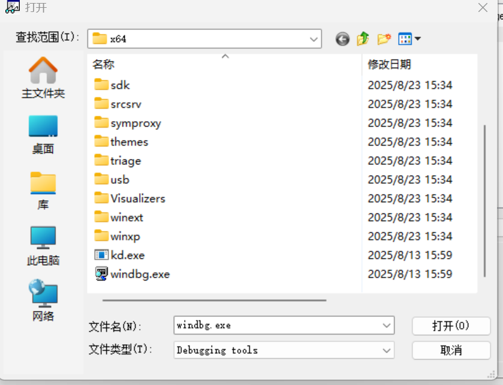

添加虚拟机管道参数，设置中先添加串口。

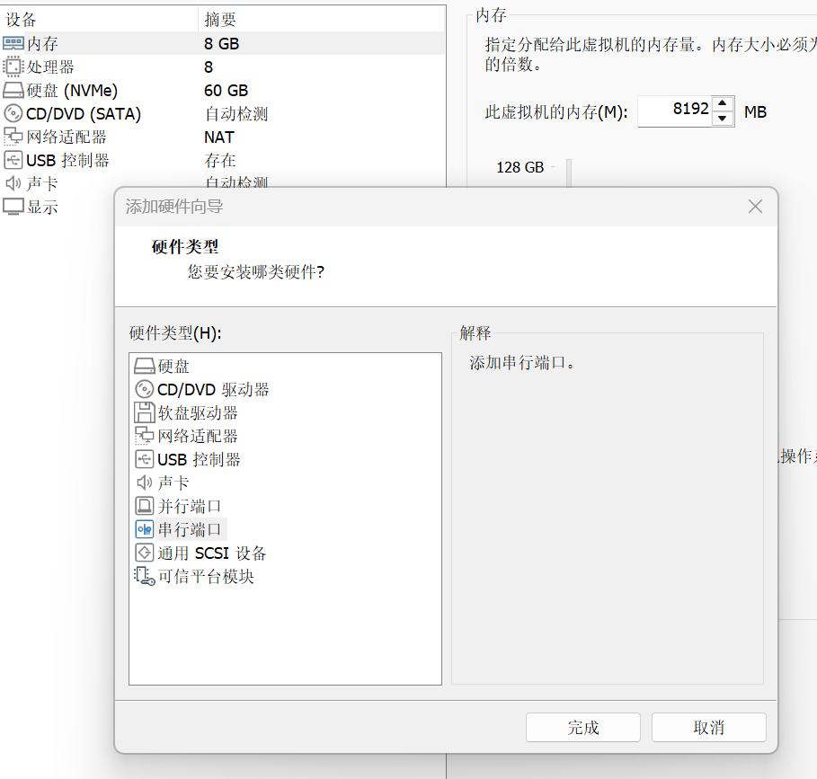

虚拟机开机后，开启vmmon64\.exe，将VKD的target移入虚拟机。

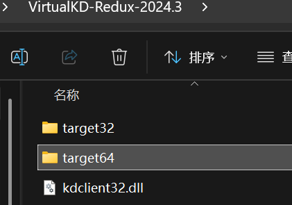

点击里面的vminstall\.exe,安装后重启，选择下面那个自己安装的驱动。

重启时候会启动Windbg，然后会自动写入int 3，开机前，虚拟机卡死，进入调试状态。

按下break，就可以暂停，启动就可继续运行。

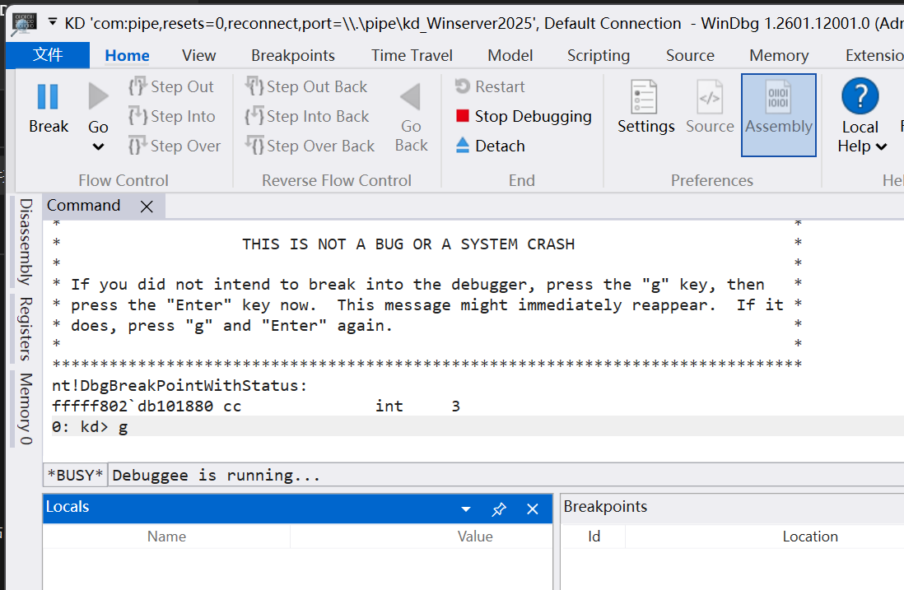

至此，环境搭建完毕。

#### 挂载驱动调试

设置驱动启动断点。

```Shell
sxe ld Shadow
```

然后，将KmdManager放到虚拟机里面，注册、运行驱动。

接下来即可开始调试。

断点触发，加载符号：

```Shell
.reload
```

筛选模块：

```Shell
lm vm Shadow
```

这个时候回显驱动信息。

```Plain Text
Browse full module list
start             end                 module name
fffff806`7cc10000 fffff806`7cc1e000   Shadow     (deferred)             
    Image path: \??\C:\Users\Administrator\Desktop\shadow\Shadow.sys
    Image name: Shadow.sys
    Browse all global symbols  functions  data  Symbol Reload
    Timestamp:        Tue Jan  6 18:30:59 2026 (695CE463)
    CheckSum:         000133CB
    ImageSize:        0000E000
    Mapping Form:     Loaded
    Translations:     0000.04b0 0000.04e4 0409.04b0 0409.04e4
    Information from resource tables:
```

然后我们可以查看驱动的反汇编，比如：

```Plain Text
u fffff806`7cc10000+C079
```

返回：

```Plain Text
Unable to load image \??\C:\Users\Administrator\Desktop\shadow\Shadow.sys, Win32 error 0n2
Shadow+0xc079:
fffff806`7cc1c079 e8ea50ffff      call    Shadow+0x1168 (fffff806`7cc11168)
fffff806`7cc1c07e 488b442448      mov     rax,qword ptr [rsp+48h]
fffff806`7cc1c083 4889442478      mov     qword ptr [rsp+78h],rax
fffff806`7cc1c088 488b442478      mov     rax,qword ptr [rsp+78h]
fffff806`7cc1c08d 4863403c        movsxd  rax,dword ptr [rax+3Ch]
fffff806`7cc1c091 488b4c2448      mov     rcx,qword ptr [rsp+48h]
fffff806`7cc1c096 4803c8          add     rcx,rax
fffff806`7cc1c099 488bc1          mov     rax,rcx
```

与静态反汇编的结果几乎没有差别。

```Assembly language
INIT:000000014000C079                 call    AES
INIT:000000014000C07E                 mov     rax, [rsp+0B8h+Dst]
INIT:000000014000C083                 mov     [rsp+0B8h+var_40], rax
INIT:000000014000C088                 mov     rax, [rsp+0B8h+var_40]
INIT:000000014000C08D                 movsxd  rax, dword ptr [rax+3Ch]
INIT:000000014000C091                 mov     rcx, [rsp+0B8h+Dst]
INIT:000000014000C096                 add     rcx, rax
INIT:000000014000C099                 mov     rax, rcx
```

在call AES处打断点,运行到此，尝试dump。

```Plain Text
bp fffff806`7cc1c079
g
```

### AES 加密驱动内部数据提取

我们发现程序存在AES执行加密函数，解密一大段数据的情况，里面存在有价值的信息。

注意注意，是使用AES**加密**函数进行数据**解密**。

我们观察程序的开始部分。

```C
Dst = (char *)ExAllocatePool(PagedPool, 0x5E00u);//创建分页内存池
 memmove(Dst, &data, 0x5E00u);//将数据复制到内存池
 AES(key, 0x10u, (__int64)&data, (__int64)Dst, 0x5E00u);//AES加密函数，解密数据
```

观察汇编：

```Assembly language
INIT:000000014000C059                 mov     [rsp+0B8h+var_98], 5E00h ; 0x5E00u
INIT:000000014000C061                 mov     r9, [rsp+0B8h+Dst]       ; Dst
INIT:000000014000C066                 lea     r8, data                 ; &data
INIT:000000014000C06D                 mov     edx, 10h                 ; 0x10u
INIT:000000014000C072                 lea     rcx, key                 ; key
INIT:000000014000C079                 call    AES
INIT:000000014000C07E                 mov     rax, [rsp+0B8h+Dst]      ; Dst
```

我们可以单步步过执行到此`mov     rax, [rsp+0B8h+Dst]`，在此查看解密内存数据。

```Plain Text
1: kd> p
Shadow+0xc07e:
fffff806`7cc1c07e 488b442448      mov     rax,qword ptr [rsp+48h]
1: kd> db [rsp+48h]
ffffba04`1ac7f698  00 50 ae 23 8d 89 ff ff-00 7d 94 e1 8f d2 ff ff  .P.#.....}......
ffffba04`1ac7f6a8  00 c5 a1 e6 06 f8 ff ff-00 00 00 00 00 00 00 00  ................
ffffba04`1ac7f6b8  f0 20 14 e3 8f d2 ff ff-60 28 00 80 ff ff ff ff  . ......`(......
ffffba04`1ac7f6c8  00 a0 ac e2 8f d2 ff ff-60 f7 c7 1a 04 ba ff ff  ........`.......
ffffba04`1ac7f6d8  95 f2 e2 e6 06 f8 ff ff-b0 c4 d1 e6 06 f8 ff ff  ................
ffffba04`1ac7f6e8  3d 88 e2 e4 8f d2 ff ff-90 56 0d e2 8f d2 ff ff  =........V......
ffffba04`1ac7f6f8  00 00 00 00 00 00 00 00-60 f7 c7 1a 04 ba ff ff  ........`.......
ffffba04`1ac7f708  90 c3 c1 7c 06 f8 ff ff-a0 7b 94 e1 8f d2 ff ff  ...|.....{......
1: kd> dq [rsp+48h]
ffffba04`1ac7f698  ffff898d`23ae5000 ffffd28f`e1947d00
ffffba04`1ac7f6a8  fffff806`e6a1c500 00000000`00000000
ffffba04`1ac7f6b8  ffffd28f`e31420f0 ffffffff`80002860
ffffba04`1ac7f6c8  ffffd28f`e2aca000 ffffba04`1ac7f760
ffffba04`1ac7f6d8  fffff806`e6e2f295 fffff806`e6d1c4b0
ffffba04`1ac7f6e8  ffffd28f`e4e2883d ffffd28f`e20d5690
ffffba04`1ac7f6f8  00000000`00000000 ffffba04`1ac7f760
ffffba04`1ac7f708  fffff806`7cc1c390 ffffd28f`e1947ba0
```

所以Dst地址为0xffff898d23ae5000。

继续查看内存数据,**有趣的事情出现了**。

```Plain Text
1: kd> db ffff898d`23ae5000
ffff898d`23ae5000  4d 5a 90 00 03 00 00 00-04 00 00 00 ff ff 00 00  MZ..............
ffff898d`23ae5010  b8 00 00 00 00 00 00 00-40 00 00 00 00 00 00 00  ........@.......
ffff898d`23ae5020  00 00 00 00 00 00 00 00-00 00 00 00 00 00 00 00  ................
ffff898d`23ae5030  00 00 00 00 00 00 00 00-00 00 00 00 e0 00 00 00  ................
ffff898d`23ae5040  0e 1f ba 0e 00 b4 09 cd-21 b8 01 4c cd 21 54 68  ........!..L.!Th
ffff898d`23ae5050  69 73 20 70 72 6f 67 72-61 6d 20 63 61 6e 6e 6f  is program canno
ffff898d`23ae5060  74 20 62 65 20 72 75 6e-20 69 6e 20 44 4f 53 20  t be run in DOS 
ffff898d`23ae5070  6d 6f 64 65 2e 0d 0d 0a-24 00 00 00 00 00 00 00  mode....$.......
```

观察数据开头的魔数，我们发现是一个可执行文件。我们尝试dump它。

根据参数我们可知数据大小为0x5E00。

```Plain Text
1: kd> .writemem C:\Users\xxx\Desktop\dump.sys ffff898d`23ae5000 L5E00
Writing 5e00 bytes............
```

### 外层Shadow\.sys驱动逆向

逆向该文件，我们发现这个程序的主函数叫`DriverEntry`，说明这是一个驱动。那么外层的驱动是什么作用呢？

#### 代码恢复

方便逆向，在数据库中添加类型：

IMAGE\_DOS\_HEADER、IMAGE\_NT\_HEADERS、IMAGE\_SECTION\_HEADER。

把Dst类型改为IMAGE\_DOS\_HEADER\*，

Shadow\.sys主函数AES加密的后面一句就变成了：

```C
v7 = (char *)Dst + Dst->e_lfanew;
```

把v7类型改为IMAGE\_NT\_HEADERS\*，v8改为IMAGE\_SECTION\_HEADER\*，进行类型修复，主函数就变成了：

```C
NTSTATUS __stdcall DriverEntry_0(_DRIVER_OBJECT *DriverObject, PUNICODE_STRING RegistryPath)
{
  int i; // [rsp+30h] [rbp-88h]
  int j; // [rsp+34h] [rbp-84h]
  __m128 *P; // [rsp+38h] [rbp-80h]
  IMAGE_DOS_HEADER *Dst; // [rsp+48h] [rbp-70h]
  IMAGE_NT_HEADERS *v7; // [rsp+50h] [rbp-68h]
  IMAGE_SECTION_HEADER *v8; // [rsp+58h] [rbp-60h]
  IMAGE_NT_HEADERS *v9; // [rsp+60h] [rbp-58h]
  __int64 v10; // [rsp+68h] [rbp-50h]
  SIZE_T NumberOfBytes; // [rsp+70h] [rbp-48h]

  Dst = (IMAGE_DOS_HEADER *)ExAllocatePool(PagedPool, 0x5E00u);// 申请分页内存池
  memmove(Dst, &data, 0x5E00u);
  AES(key, 0x10u, (__int64)&data, (__int64)Dst, 0x5E00u);// 解密PE
  v7 = (IMAGE_NT_HEADERS *)((char *)Dst + Dst->e_lfanew);
  v8 = (IMAGE_SECTION_HEADER *)((char *)&v7->OptionalHeader + v7->FileHeader.SizeOfOptionalHeader);
  NumberOfBytes = v7->OptionalHeader.SizeOfImage;
  P = (__m128 *)ExAllocatePool(NonPagedPool, NumberOfBytes);// 申请内存空间
  sub_140002900(P, 0, NumberOfBytes);
  memmove(P, Dst, v7->OptionalHeader.SizeOfHeaders);
  for ( i = 0; i < v7->FileHeader.NumberOfSections; ++i )// PE拉伸映射到内存中
  {
    if ( v8[i].SizeOfRawData )
    {
      _mm_lfence();
      memmove((char *)P + v8[i].VirtualAddress, (char *)Dst + v8[i].PointerToRawData, v8[i].SizeOfRawData);
    }
  }
  reloc((IMAGE_DOS_HEADER *)P);                 // 重定位修复
  if ( (int)IATfix((__int64)P) < 0              // 修复IAT
    || (sub_140002250(P),
        v9 = (IMAGE_NT_HEADERS *)((char *)P + P[3].m128_i32[3]),
        ((int (__fastcall *)(_DRIVER_OBJECT *, _QWORD))((char *)P + v9->OptionalHeader.AddressOfEntryPoint))(
          DriverObject,                         // 调用程序入口点函数
          0) < 0) )
  {
    _mm_lfence();
    ExFreePoolWithTag(P, 0);
  }
  else
  {
    _mm_lfence();
    v10 = (__int64)&v9->OptionalHeader + v9->FileHeader.SizeOfOptionalHeader;// 遍历每一个段
    for ( j = 0; j < v9->FileHeader.NumberOfSections; ++j )
    {
      _mm_lfence();
      if ( !stricmp((const char *)(40LL * j + v10), "INIT") )// 如果到达INIT段，内存清零（清空INIT段）
      {
        _mm_lfence();
        sub_140002900(
          (__m128 *)((char *)P + *(unsigned int *)(v10 + 40LL * j + 12)),
          0,
          *(unsigned int *)(v10 + 40LL * j + 8));
        break;
      }
    }
    sub_140002900(P, 0, 0x1000u);
  }
  ExFreePoolWithTag(Dst, 0);
  DriverObject->DriverUnload = (PDRIVER_UNLOAD)sub_140001C70;
  return -1073741823;
}
```

还有重定位函数：

```C++
char *__fastcall reloc(IMAGE_DOS_HEADER *a1)
{
  char *result; // rax
  int j; // [rsp+0h] [rbp-68h]
  unsigned int *i; // [rsp+8h] [rbp-60h]
  unsigned int *v4; // [rsp+10h] [rbp-58h]
  char *v5; // [rsp+18h] [rbp-50h]
  int v6; // [rsp+20h] [rbp-48h]
  _QWORD *v7; // [rsp+30h] [rbp-38h]
  _DWORD *v8; // [rsp+38h] [rbp-30h]

  v5 = (char *)a1 + a1->e_lfanew;
  result = v5 + 176;
  if ( *((_DWORD *)v5 + 45) )
  {
    for ( i = (unsigned int *)((char *)&a1->e_magic + *((unsigned int *)v5 + 44));
          i[1];
          i = (unsigned int *)((char *)i + i[1]) )
    {
      v4 = i + 2;
      v6 = ((unsigned __int64)i[1] - 8) / 2;
      for ( j = 0; j < v6; ++j )
      {
        if ( (unsigned __int8)HIBYTE(*((_WORD *)v4 + j)) >> 4 == 10 )
        {
          _mm_lfence();
          v7 = (_QWORD *)((char *)&a1->e_magic + *i + (*((_WORD *)v4 + j) & 0xFFF));
          *v7 = (char *)a1 + *v7 - *((_QWORD *)v5 + 6);
        }
        if ( (unsigned __int8)HIBYTE(*((_WORD *)v4 + j)) >> 4 == 3 )
        {
          _mm_lfence();
          v8 = (_DWORD *)((char *)&a1->e_magic + *i + (*((_WORD *)v4 + j) & 0xFFF));
          *v8 = *v8 - *((_DWORD *)v5 + 12) + (_DWORD)a1;
        }
      }
    }
    result = v5;
    *((_QWORD *)v5 + 6) = a1;
  }
  return result;
}
```

IAT修复：

```C
__int64 __fastcall IATfix(__int64 a1)
{
  unsigned int v2; // [rsp+20h] [rbp-88h]
  unsigned int *i; // [rsp+28h] [rbp-80h]
  _QWORD *v4; // [rsp+30h] [rbp-78h]
  char *Str1; // [rsp+38h] [rbp-70h]
  PVOID SystemRoutineAddress; // [rsp+40h] [rbp-68h]
  int v7; // [rsp+48h] [rbp-60h] BYREF
  _QWORD *v8; // [rsp+50h] [rbp-58h]
  __int64 v9; // [rsp+58h] [rbp-50h]
  __int64 v10; // [rsp+60h] [rbp-48h]
  __int64 v11; // [rsp+68h] [rbp-40h]
  __int64 v12; // [rsp+70h] [rbp-38h]
  _UNICODE_STRING SystemRoutineName; // [rsp+78h] [rbp-30h] BYREF
  _STRING DestinationString; // [rsp+88h] [rbp-20h] BYREF

  v2 = 0;
  v11 = a1;
  v12 = *(int *)(a1 + 60) + a1;
  for ( i = (unsigned int *)(*(unsigned int *)(v12 + 144) + a1); i[3]; i += 5 )
  {
    Str1 = (char *)(i[3] + a1);
    v7 = 0;
    v10 = sub_1400022C0(Str1, &v7);
    if ( !v10 )
      return (unsigned int)-1073741204;
    v4 = (_QWORD *)(*i + a1);
    v8 = (_QWORD *)(i[4] + a1);
    while ( *v4 )
    {
      v9 = *v4 + a1;
      if ( !stricmp(Str1, "hal.dll") || !stricmp(Str1, "ntoskrnl.exe") || !stricmp(Str1, "ntkrnlpa.exe") )
      {
        memset(&DestinationString, 0, sizeof(DestinationString));
        memset(&SystemRoutineName, 0, sizeof(SystemRoutineName));
        RtlInitAnsiString(&DestinationString, (PCSZ)(v9 + 2));
        RtlAnsiStringToUnicodeString(&SystemRoutineName, &DestinationString, 1u);
        SystemRoutineAddress = MmGetSystemRoutineAddress(&SystemRoutineName);// 获取函数地址
        RtlFreeUnicodeString(&SystemRoutineName);
      }
      else
      {
        SystemRoutineAddress = (PVOID)sub_140001ED4(v10, v9 + 2);
      }
      if ( SystemRoutineAddress )
        *v8 = SystemRoutineAddress;
      else
        v2 = -1073741275;
      ++v4;
      ++v8;
    }
  }
  return v2;
}
```


#### **PE反射注入sys**

观察恢复出来的主函数，该驱动解密PE文件后，进行PE拉伸、重定位修复、IAT修复、调用DriverEntry，一系列操作进行手动加载该PE文件到内存中运行。

https://www\.freebuf\.com/articles/web/325873\.html

我们可以总结出PE反射注入的全流程。

##### PE反射加载

1\.PE拉伸映射：按SizeOflmage申请一块连续虚拟地址空间，将PEHeader与各节按VirtualAddress拷贝到目标位置。

2\.重定位：按Reloc表修正需要修的地址偏移

3\.IAT修复：遍历ImportDescriptor，解析DLL/函数名或序号，填充IAT。

4\.TLS回调调用：若存在TLSDirectory，按回调列表依次调用。 

5\.执行EntryPoint，然后解密的PE就执行了。

### 内层dump\.sys分析

查看驱动内部函数：

```C++
NTSTATUS __stdcall DriverEntry_0(_DRIVER_OBJECT *DriverObject, PUNICODE_STRING RegistryPath)
{
  int Device; // [rsp+40h] [rbp-D8h]
  int v4; // [rsp+40h] [rbp-D8h]
  int i; // [rsp+44h] [rbp-D4h]
  unsigned int j; // [rsp+4Ch] [rbp-CCh]
  PEPROCESS Process; // [rsp+50h] [rbp-C8h] BYREF
  wchar_t *v8; // [rsp+58h] [rbp-C0h]
  PUNICODE_STRING pImageFileName; // [rsp+60h] [rbp-B8h] BYREF
  PEPROCESS v10; // [rsp+68h] [rbp-B0h]
  HANDLE ProcessId; // [rsp+70h] [rbp-A8h]
  PIO_REMOVE_LOCK Lock; // [rsp+78h] [rbp-A0h]
  PVOID SystemRoutineAddress; // [rsp+80h] [rbp-98h]
  struct _UNICODE_STRING DestinationString; // [rsp+88h] [rbp-90h] BYREF
  struct _UNICODE_STRING TargetDevice; // [rsp+98h] [rbp-80h] BYREF
  char SourceString[46]; // [rsp+A8h] [rbp-70h] BYREF
  char v17[46]; // [rsp+D8h] [rbp-40h] BYREF

  sub_140003610(&unk_140006B20);
  SourceString[0] = -15;
  SourceString[1] = -69;
  SourceString[2] = -39;
  SourceString[3] = -67;
  SourceString[4] = -6;
  SourceString[5] = -65;
  SourceString[6] = -91;
  SourceString[7] = -63;
  SourceString[8] = -82;
  SourceString[9] = -61;
  SourceString[10] = -91;
  SourceString[11] = -59;
  SourceString[12] = -65;
  SourceString[13] = -70;
  SourceString[14] = -2;
  SourceString[15] = -68;
  SourceString[16] = -59;
  SourceString[17] = -66;
  SourceString[18] = -38;
  SourceString[19] = -64;
  SourceString[20] = -94;
  SourceString[21] = -62;
  SourceString[22] = -74;
  SourceString[23] = -60;
  SourceString[24] = -79;
  SourceString[25] = -58;
  SourceString[26] = -45;
  SourceString[27] = -69;
  SourceString[28] = -45;
  SourceString[29] = -67;
  SourceString[30] = -48;
  SourceString[31] = -65;
  SourceString[32] = -108;
  SourceString[33] = -63;
  SourceString[34] = -86;
  SourceString[35] = -61;
  SourceString[36] = -74;
  SourceString[37] = -59;
  SourceString[38] = -93;
  SourceString[39] = -70;
  SourceString[40] = -38;
  SourceString[41] = -68;
  SourceString[42] = -39;
  SourceString[43] = -66;
  SourceString[44] = -65;
  SourceString[45] = -64;
  SimpleDecryptString((__int64)SourceString, 0x2Eu, 186);// 解密字符串"KeDelayExecutionThread"
  RtlInitUnicodeString(&DestinationString, (PCWSTR)SourceString);
  SystemRoutineAddress = MmGetSystemRoutineAddress(&DestinationString);// 获取解密出来的函数名的函数地址
  v10 = 0;
  for ( i = 12; i < 0x100000; ++i )
  {
    _mm_lfence();
    Process = 0;
    if ( PsLookupProcessByProcessId((HANDLE)i, &Process) >= 0 && PsGetProcessExitStatus(Process) == 259 )
    {
      pImageFileName = 0;
      if ( SeLocateProcessImageName(Process, &pImageFileName) >= 0 )
      {
        v8 = wcsrchr(pImageFileName->Buffer, 0x5Cu);
        if ( v8 )
        {
          if ( *(_DWORD *)++v8 == 'a\0M' && *((_DWORD *)v8 + 1) == 'e\0z' )// 找到名字叫Maze的程序，获取PID
          {
            ExFreePoolWithTag(pImageFileName, 0);
            v10 = Process;
            break;
          }
          ExFreePoolWithTag(pImageFileName, 0);
        }
        else
        {
          ExFreePoolWithTag(pImageFileName, 0);
          ObfDereferenceObject(Process);
        }
      }
      else
      {
        ObfDereferenceObject(Process);
      }
    }
  }
  ProcessId = 0;
  if ( v10 )
    ProcessId = PsGetProcessId(v10);
  if ( !ProcessId )
    return 0xC0000001;                          // 未找到，返回错误
  PTEHook((__int64)&unk_140006B20, ProcessId, (__int64)SystemRoutineAddress, (__int64)hook_func, &qword_140006BB0);
  DriverObject->DriverUnload = (PDRIVER_UNLOAD)sub_140001230;// PTE hook 目标函数
  for ( j = 0; j <= 0x1B; ++j )
    DriverObject->MajorFunction[j] = (PDRIVER_DISPATCH)sub_1400010A0;
  DriverObject->MajorFunction[3] = (PDRIVER_DISPATCH)sub_140001100;
  Device = IoCreateDevice(DriverObject, 0x78u, 0, 0xBu, 0, 0, &DeviceObject);
  if ( Device >= 0 )
  {
    Lock = (PIO_REMOVE_LOCK)DeviceObject->DeviceExtension;
    IoInitializeRemoveLockEx(Lock, 0x4662644Bu, 0, 0, 0x78u);
    IoAcquireRemoveLockEx(Lock, DriverObject, File, 0x25Eu, 0x78u);
    DeviceObject->Flags |= 4u;
    v17[0] = -52;
    v17[1] = -111;
    v17[2] = -42;
    v17[3] = -109;
    v17[4] = -15;
    v17[5] = -107;
    v17[6] = -32;
    v17[7] = -105;
    v17[8] = -15;
    v17[9] = -103;
    v17[10] = -7;
    v17[11] = -101;
    v17[12] = -7;
    v17[13] = -112;
    v17[14] = -51;
    v17[15] = -110;
    v17[16] = -40;
    v17[17] = -108;
    v17[18] = -16;
    v17[19] = -106;
    v17[20] = -18;
    v17[21] = -104;
    v17[22] = -5;
    v17[23] = -102;
    v17[24] = -12;
    v17[25] = -100;
    v17[26] = -15;
    v17[27] = -111;
    v17[28] = -32;
    v17[29] = -109;
    v17[30] = -16;
    v17[31] = -107;
    v17[32] = -43;
    v17[33] = -105;
    v17[34] = -12;
    v17[35] = -103;
    v17[36] = -5;
    v17[37] = -101;
    v17[38] = -17;
    v17[39] = -112;
    v17[40] = -30;
    v17[41] = -110;
    v17[42] = -93;
    v17[43] = -108;
    v17[44] = -107;
    v17[45] = -106;
    SimpleDecryptString((__int64)v17, 0x2Eu, 144);// "\Device\KeyboardClass0"
    RtlInitUnicodeString(&TargetDevice, (PCWSTR)v17);
    v4 = IoAttachDevice(DeviceObject, &TargetDevice, &AttachedDevice);// 附加设备到目标字符串设备上（键盘）
    if ( v4 >= 0 )
    {
      DeviceObject->Flags &= ~0x80u;
      return 0;
    }
    else
    {
      _mm_lfence();
      IoReleaseRemoveLockAndWaitEx(Lock, DriverObject, 0x78u);
      IoDeleteDevice(DeviceObject);
      DeviceObject = 0;
      return v4;
    }
  }
  else
  {
    _mm_lfence();
    return Device;
  }
}
```

#### PTEHook

x64 Windows上，代码执行时CPU取指使用的是虚拟地址。虚拟地址会通过多级页表（PML4→PDPT→PD→PT）翻译成物理页，

最后由PTE（PageTableEntry）里记录的PFN（PageFrameNumber）指向真正的物理页。

核心思路：

1\.找到目标图数所在的代码页

2\.复制出一份"拷贝物理页”。

3\.在拷贝页里修改指令/做Hook。

4\.改写目标虚拟地址对应的PTE：让它的PFN指向拷贝页

#### 提取两个解密字符串

我们先停掉调试。

```C
g
```

然后虚拟机恢复了，在KmdManager中点击stop与unregister就解绑了加壳驱动。

运行迷宫程序，然后把dump出来的驱动放进去。

对dump驱动设置起始断点。

```C
sxe ld dump
```

再对dump注册、运行。

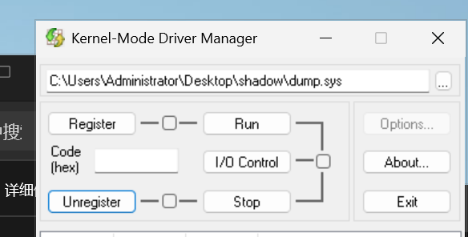

设置断点成功。

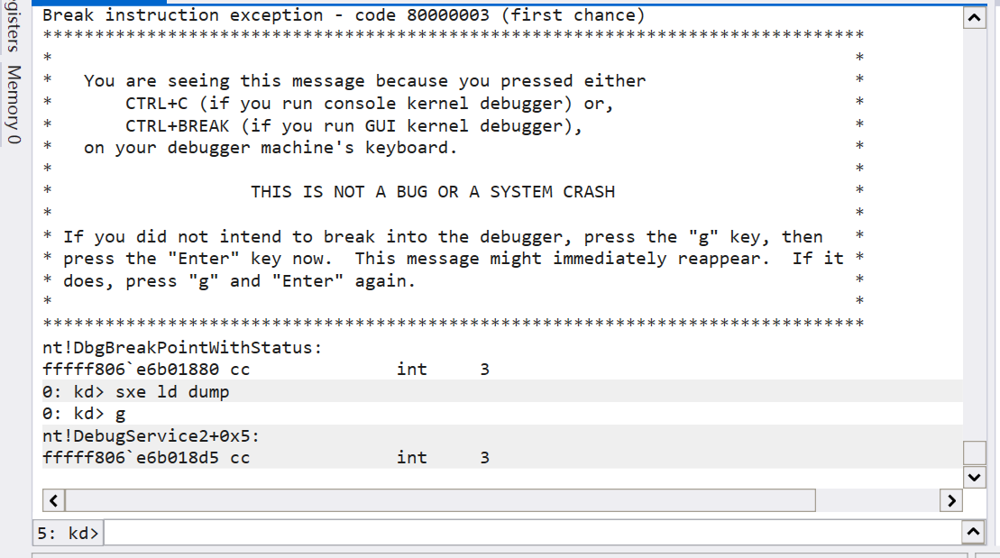

查看驱动基址。

```Plain Text
5: kd> .reload
Connected to Windows 10 26100 x64 target at (Wed Feb 18 22:04:29.643 2026 (UTC + 8:00)), ptr64 TRUE
Loading Kernel Symbols...
Loading User Symbols...
Loading unloaded module list...

************* Symbol Loading Error Summary **************
Module name            Error
SharedUserData         No error - symbol load deferred

You can troubleshoot most symbol related issues by turning on symbol loading diagnostics (!sym noisy) and repeating the command that caused symbols to be loaded.
You should also verify that your symbol search path (.sympath) is correct.
5: kd> lm vm dump
Browse full module list
start             end                 module name
fffff806`7cc90000 fffff806`7cc9a000   dump       (deferred)             
    Image path: \??\C:\Users\Administrator\Desktop\shadow\dump.sys
    Image name: dump.sys
    Browse all global symbols  functions  data  Symbol Reload
    Timestamp:        Tue Jan  6 18:26:16 2026 (695CE348)
    CheckSum:         0000EA2F
    ImageSize:        0000A000
    Mapping Form:     Loaded
    Translations:     0000.04b0 0000.04e4 0409.04b0 0409.04e4
    Information from resource tables:
```

查看静态反汇编，计算偏移，设置断点。

```Assembly language
.text:0000000140001C3F                 mov     [rsp+118h+SourceString], 0F1h
...
.text:0000000140001DA7                 mov     [rsp+118h+SourceString+2Dh], 0C0h
.text:0000000140001DAF                 mov     r8b, 0BAh
.text:0000000140001DB2                 mov     edx, 2Eh ; '.'
.text:0000000140001DB7                 lea     rcx, [rsp+118h+SourceString]
.text:0000000140001DBF                 call    SimpleDecryptString ; 在此下断点
```

下断点调试,就看到了解密数据。

```Plain Text
5: kd> bp fffff806`7cc90000+1DBF
5: kd> g
Breakpoint 1 hit
dump+0x1dbf:
fffff806`7cc91dbf e83cf2ffff      call    dump+0x1000 (fffff806`7cc91000)
5: kd> p
dump+0x1dc4:
fffff806`7cc91dc4 488d9424a8000000 lea     rdx,[rsp+0A8h]
5: kd> db [rsp+0A8h]
ffffba04`1cadf698  4b 00 65 00 44 00 65 00-6c 00 61 00 79 00 45 00  K.e.D.e.l.a.y.E.
ffffba04`1cadf6a8  78 00 65 00 63 00 75 00-74 00 69 00 6f 00 6e 00  x.e.c.u.t.i.o.n.
ffffba04`1cadf6b8  54 00 68 00 72 00 65 00-61 00 64 00 00 00 ff ff  T.h.r.e.a.d.....
ffffba04`1cadf6c8  00 40 7c e2 8f d2 ff ff-60 f7 ad 1c 04 ba ff ff  .@|.....`.......
ffffba04`1cadf6d8  95 f2 e2 e6 06 f8 ff ff-b0 c4 d1 e6 06 f8 ff ff  ................
ffffba04`1cadf6e8  5d f8 f7 e4 8f d2 ff ff-60 89 ba e6 06 f8 ff ff  ].......`.......
ffffba04`1cadf6f8  7a 76 dd 7d 0f 94 ff ff-60 f7 ad 1c 04 ba ff ff  zv.}....`.......
ffffba04`1cadf708  20 80 c9 7c 06 f8 ff ff-40 f3 66 e3 8f d2 ff ff   ..|....@.f.....
5: kd> du [rsp+0A8h]
ffffba04`1cadf698  "KeDelayExecutionThread"
```

第一个解密返回的解密数据对应的函数语句：

```C
SourceString[0] = -15;
...
SourceString[45] = -64;
SimpleDecryptString((__int64)SourceString, 0x2Eu, 186);// "KeDelayExecutionThread"
```

KeDelayExecutionThread是函数名称根据以下语句可知它是被hook的函数。

```C
PTEHook(
    (__int64)&unk_140006B20, 
    ProcessId, 
    (__int64)SystemRoutineAddress, //被hook函数
    (__int64)hook_func, //hook函数
    &qword_140006BB0
);
```


同理在第二个解密函数调用处设置断点。

查看汇编,计算地址，打断点，看数据。

```Assembly language
.text:00000001400020A9                 mov     byte ptr [rsp+118h+var_40], 0CCh
...
.text:0000000140002211                 mov     byte ptr [rsp+118h+var_40+2Dh], 96h
.text:0000000140002219                 mov     r8b, 90h
.text:000000014000221C                 mov     edx, 2Eh ; '.'
.text:0000000140002221                 lea     rcx, [rsp+118h+var_40]
.text:0000000140002229                 call    SimpleDecryptString
```

输入命令，返回以下信息。

```Plain Text
5: kd> bp fffff806`7cc90000+2229
5: kd> g
Breakpoint 2 hit
dump+0x2229:
fffff806`7cc92229 e8d2edffff      call    dump+0x1000 (fffff806`7cc91000)
5: kd> p
dump+0x222e:
fffff806`7cc9222e 488d9424d8000000 lea     rdx,[rsp+0D8h]
5: kd> db [rsp+0D8h]
ffffba04`1cadf6c8  5c 00 44 00 65 00 76 00-69 00 63 00 65 00 5c 00  \.D.e.v.i.c.e.\.
ffffba04`1cadf6d8  4b 00 65 00 79 00 62 00-6f 00 61 00 72 00 64 00  K.e.y.b.o.a.r.d.
ffffba04`1cadf6e8  43 00 6c 00 61 00 73 00-73 00 30 00 00 00 ff ff  C.l.a.s.s.0.....
ffffba04`1cadf6f8  7a 76 dd 7d 0f 94 ff ff-60 f7 ad 1c 04 ba ff ff  zv.}....`.......
ffffba04`1cadf708  20 80 c9 7c 06 f8 ff ff-40 f3 66 e3 8f d2 ff ff   ..|....@.f.....
ffffba04`1cadf718  00 40 7c e2 8f d2 ff ff-00 00 00 00 00 00 00 00  .@|.............
ffffba04`1cadf728  c0 c9 d2 2d 8d 89 ff ff-40 f3 66 e3 8f d2 ff ff  ...-....@.f.....
ffffba04`1cadf738  dc 83 fb e6 06 f8 ff ff-00 40 7c e2 8f d2 ff ff  .........@|.....
5: kd> du [rsp+0D8h]
ffffba04`1cadf6c8  "\Device\KeyboardClass0"
```

第二个解密返回的解密数据对应的函数语句：

```C
v17[0] = -52;
    ...
    v17[45] = -106;
    SimpleDecryptString((__int64)v17, 0x2Eu, 144);//"\Device\KeyboardClass0"
```

这个字符串说明，接下来的附加函数会附加到键盘驱动设备上面。


#### KeDelayExecutionThread函数机制详解、与Sleep函数的关系

##### Sleep函数的底层：RtlDelayExecutionThread函数

**KeDelayExecutionThread** 函数将当前线程置于指定间隔内可发出警报或不可更改的等待状态。

https://learn\.microsoft\.com/zh\-cn/windows\-hardware/drivers/ddi/wdm/nf\-wdm\-kedelayexecutionthread

驱动要hook的是这个函数，那么为什么要hook它呢？

我们再回来看Maze\.exe的主函数。

```C++
// Hidden C++ exception states: #wind=1
int __fastcall main(int argc, const char **argv, const char **envp)
{
  __int64 v3; // rax
  unsigned int v4; // eax
  char v6; // [rsp+30h] [rbp-1468h]
  __int64 v7; // [rsp+34h] [rbp-1464h]
  __int64 v8; // [rsp+40h] [rbp-1458h]
  __int128 v9; // [rsp+48h] [rbp-1450h]
  DWORD nNumberOfCharsToWrite; // [rsp+58h] [rbp-1440h]
  __int64 v11; // [rsp+70h] [rbp-1428h]
  void *lpBuffer; // [rsp+78h] [rbp-1420h]
  __int64 v13; // [rsp+88h] [rbp-1410h]
  _BYTE v14[8]; // [rsp+90h] [rbp-1408h] BYREF
  _BYTE v15[8]; // [rsp+98h] [rbp-1400h] BYREF
  DWORD NumberOfCharsWritten; // [rsp+A0h] [rbp-13F8h] BYREF
  _BYTE v17[8]; // [rsp+A8h] [rbp-13F0h] BYREF
  _BYTE v18[24]; // [rsp+B0h] [rbp-13E8h] BYREF
  _BYTE v19[40]; // [rsp+C8h] [rbp-13D0h] BYREF
  _BYTE v20[5008]; // [rsp+F0h] [rbp-13A8h] BYREF

  std::ios_base::sync_with_stdio(0);
  std::ios::tie((char *)&std::cin + *(int *)(std::cin + 4LL), 0);
  sub_1400016E0();
  v11 = sub_1400014C0(v14);
  v3 = sub_140002DD0(v11, v15);
  v4 = unknown_libname_22(v3);
  sub_140002960(v20, v4);
  HIDWORD(v9) = 0;
  sub_140002930(v17, 8, 15);
  LODWORD(v9) = sub_1400046A0(v17, v20);
  *(_QWORD *)((char *)&v9 + 4) = (unsigned int)sub_1400046A0(v17, v20);
  sub_140001F60(v18, 24);
  sub_140001FA0(v18, v20, DWORD2(v9), v9);
  v8 = DWORD2(v9);
  while ( 1 )
  {
    do
    {
      sub_140001930(v18, v8, *((_QWORD *)&v9 + 1), v9);
      if ( v8 == (_QWORD)v9 )
      {
        sub_1400018F0();
        system("cls");
        Sleep(0x32u);//注意！！！
        MessageBoxA(0, "You reached the end!", "Congratulation!", 0);
        goto LABEL_24;
      }
      v6 = sub_140002570();
    }
    while ( !v6 );
    if ( v6 == 113 || v6 == 81 )
      break;
    v7 = v8;
    switch ( v6 )
    {
      case 'w':
      case 'W':
        LODWORD(v7) = v8 - 1;
        break;
      case 's':
      case 'S':
        LODWORD(v7) = v8 + 1;
        break;
      case 'a':
      case 'A':
        HIDWORD(v7) = HIDWORD(v8) - 1;
        break;
      case 'd':
      case 'D':
        HIDWORD(v7) = HIDWORD(v8) + 1;
        break;
    }
    if ( (unsigned __int8)sub_140001690((unsigned int)v7, HIDWORD(v7)) )
    {
      v13 = sub_140002C50(v18, (int)v7);
      if ( *(_BYTE *)sub_1400030A0(v13, SHIDWORD(v7)) != 35 )
        v8 = v7;
    }
  }
  sub_140003240(v19, "\r\nQuit game.\r\n");
  NumberOfCharsWritten = 0;
  nNumberOfCharsToWrite = unknown_libname_26(v19);
  lpBuffer = (void *)sub_140002F30(v19);
  WriteConsoleA(hConsoleOutput, lpBuffer, nNumberOfCharsToWrite, &NumberOfCharsWritten, 0);
  sub_1400031C0(v19);
LABEL_24:
  system("pause");
  sub_140002C80(v18);
  return 0;
}
```

我们发现里面有一个调用的函数，望文生义可知这个函数的效果应该是和hook的函数的效果是类似的：

```C
Sleep(0x32u);
```

这个函数的内部机制是怎么实现的呢？IDA中没有给出来。

查找export，发现在kernel32\.dll里面。

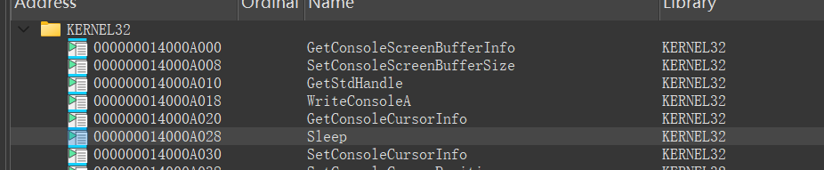

但是我们在kernel32\.dll里面没有找到函数具体实现，查阅资料后发现：

*在 Windows Vista 及更高版本中，许多原本由 kernel32\.dll 提供的功能被重定向到 kernelbase\.dll。*

https://ask\.csdn\.net/questions/8885795

我们在KernelBase\.dll中发现了有关实现。

```C++
void __stdcall Sleep(DWORD dwMilliseconds)
{
  SleepEx(dwMilliseconds, 0);
}
DWORD __stdcall SleepEx(DWORD dwMilliseconds, BOOL bAlertable)
{
  __int64 v3; // rdi
  int v4; // eax
  int v5; // esi
  DWORD result; // eax
  struct _RTL_CALLER_ALLOCATED_ACTIVATION_CONTEXT_STACK_FRAME_EXTENDED Frame; // [rsp+20h] [rbp-68h] BYREF
  __int64 v8; // [rsp+A0h] [rbp+18h] BYREF

  v3 = dwMilliseconds;
  v8 = 0;
  Frame.Size = 72;
  *(_QWORD *)&Frame.Format = 1;
  memset(&Frame.Frame, 0, 56);
  if ( bAlertable )
    RtlActivateActivationContextUnsafeFast(&Frame, 0);
  if ( (_DWORD)v3 == -1 )
    v8 = 0x8000000000000000uLL;//特殊值：无限等待
  else
    v8 = -10000 * v3;//转换为-100ns单位，纳米数量级的负数：
    //用户态传入的是毫秒(ms)，内核需要的是100纳秒(100ns)为单位
  do
  {
    v4 = RtlDelayExecution(bAlertable, &v8);//就是这个程序要hook的函数，延迟执行循环
    v5 = v4;
  }
  while ( bAlertable && v4 == 257 );
  if ( bAlertable )
    RtlDeactivateActivationContextUnsafeFast(&Frame);
  result = 192;
  if ( v5 != 192 )
    return 0;
  return result;
}
```

##### RtlDelayExecutionThread函数的底层实现：ZwDelayExecution函数

在这个函数里面，我们发现了要hook的函数RtlDelayExecution。

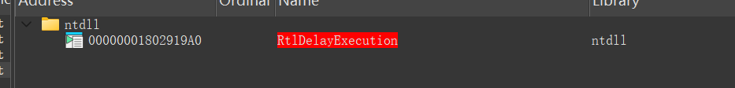

RtlDelayExecution在ntdll\.dll里面

反编译，在dll里面我们找到对应函数逻辑。

```C++
__int64 __fastcall RtlDelayExecution(__int64 a1, _QWORD *a2)
{
  struct _TEB *v2; // rsi
  unsigned __int8 v4; // di
  unsigned int v5; // ebx
  __int64 result; // rax
  unsigned int SpinCallCount; // ecx
  int v8; // ecx
  unsigned int v9; // ecx
  __int64 v10; // rax
  unsigned __int64 v11; // [rsp+38h] [rbp+10h] BYREF

  v2 = NtCurrentTeb();
  v4 = a1;
  v11 = 0;
  if ( !*a2 && (dword_1801D3F4C || dword_1801D3F48) )
  {
    ++v2->SpinCallCount;
    RtlQueryPerformanceCounter(&v11);
    if ( v11 - v2->LastSleepCounter < (unsigned int)SmtDelayedConfiguration )
    {
      SpinCallCount = v2->SpinCallCount;
      if ( SpinCallCount >= dword_1801D3F44 )
      {
        if ( dword_1801D3F4C )
          v8 = dword_1801D3F4C * (SpinCallCount - dword_1801D3F44);
        else
          v8 = 0;
        v9 = dword_1801D3F48 + v8;
        if ( v9 > dword_1801D3F50 )
          v9 = dword_1801D3F50;
        v10 = 10 * v9 / MEMORY[0x7FFE02D6];
        if ( (_DWORD)v10 )
        {
          do
          {
            _mm_pause();
            --v10;
          }
          while ( v10 );
        }
      }
    }
    v5 = ZwDelayExecution(v4, a2);//核心延迟函数
    RtlQueryPerformanceCounter(&v11);
    v2->LastSleepCounter = v11;
  }
  else
  {
    v5 = ZwDelayExecution(a1, a2);
  }
  result = v5;
  if ( v5 != 1073741860 )
    v2->SpinCallCount = 0;
  return result;
}
```

ZwDelayExecution为核心延迟函数。

##### ZwDelayExecution函数的底层实现：系统调用内核函数，借助KiSystemServiceStart唤起NtDelayExecution

```C
__int64 ZwDelayExecution()
{
  __int64 result; // rax

  result = 52;
  if ( (MEMORY[0x7FFE0308] & 1) != 0 )
    __asm { int     2Eh; DOS 2+ internal - EXECUTE COMMAND }//DOS中断调用
  else
    __asm { syscall; Low latency system call }//现代系统调用
  return result;
}
```

这个系统调用在任何一个链接库看不出来的，需要研究ntoskrnl\.exe（就是任务管理器中的System进程）中的系统调用机制才能了解。

我们反编译ntoskrnl\.exe。

输入函数ZwDelayExecution，得到的逻辑是在内核态下执行的。

```C++
void ZwDelayExecution()
{
  _disable();
  __readeflags();
  KiServiceInternal();
}
void KiServiceInternal()
{
  struct _KTHREAD *CurrentThread; // rbx

  _enable();
  CurrentThread = KeGetCurrentThread();
  _m_prefetchw(&CurrentThread->TrapFrame);
  CurrentThread->PreviousMode = 0;
  KiSystemServiceStart();//有系统服务分发器执行
}

```

这个实现似乎不是真正实现的函数，只是一个传递“消息”的“中间人”。

##### NtDelayExecution函数的底层实现：KeDelayExecutionThread函数

在IDA函数表中查找DelayExecution，找到这个函数，这是真正执行delay的内核函数的外层包装：

同时我们也发现了被hook的函数。

```C++
NTSTATUS __fastcall NtDelayExecution(BOOLEAN a1, LARGE_INTEGER *a2)
{
  KPROCESSOR_MODE PreviousMode; // cl
  LARGE_INTEGER Interval; // [rsp+40h] [rbp+18h] BYREF

  PreviousMode = KeGetCurrentThread()->PreviousMode;
  if ( PreviousMode )
  {
    if ( ((unsigned __int8)a2 & 3) != 0 )
      ExRaiseDatatypeMisalignment();
    Interval = *a2;
  }
  else
  {
    Interval = *a2;
  }
  return KeDelayExecutionThread(PreviousMode, a1, &Interval);//hook的最底层
  //PreviousMode:模式
  //Interval就是a2所在地址的值，表示纳米级别延迟毫秒数
}
```

KeDelayExecutionThread是被hook的最底层。

https://learn\.microsoft\.com/zh\-cn/windows\-hardware/drivers/ddi/wdm/nf\-wdm\-kedelayexecutionthread

这个函数有三个参数：

`[in] WaitMode`

指定调用方等待的处理器模式，可以是 KernelMode 或 UserMode。 较低级别的驱动程序应指定 KernelMode。

`[in] Alertable`

如果等待可发出警报，则指定 TRUE 。 较低级别的驱动程序应指定 FALSE。

`[in] Interval`

指定要等待的绝对时间或相对时间（以 100 纳秒为单位）。 负值表示相对时间。 绝对过期时间跟踪系统时间的任何更改;相对过期时间不受系统时间更改的影响。

##### Sleep函数机制总括

`Sleep`函数与`KeDelayExecutionThread`是同一功能在不同层面的实现，它们之间的关系是层层封装的调用关系。

###### 用户层

- `Sleep`/`SleepEx`：Windows API，提供给应用程序使用

- `RtlDelayExecution`：ntdll\.dll中的实现，处理自旋优化和系统调用

###### 内核层

- `ZwDelayExecution`：内核模式入口

- `NtDelayExecution`：系统服务入口，负责参数验证和安全检查

- `KeDelayExecutionThread`：真正执行延迟的核心函数

#### hook函数初步分析

##### 函数概述

但是呢，这个函数在maze运行的时候，被hook了，变成了驱动里面的这个函数：

在驱动中的地址为：0x00000001400012C0

```C++
NTSTATUS __stdcall hook_func(KPROCESSOR_MODE WaitMode, BOOLEAN Alertable, PLARGE_INTEGER Interval)
{
  char *v4; // [rsp+20h] [rbp-B8h]
  char *v5; // [rsp+20h] [rbp-B8h]
  char *v6; // [rsp+20h] [rbp-B8h]
  char *v7; // [rsp+20h] [rbp-B8h]
  void *v8; // [rsp+20h] [rbp-B8h]
  int j; // [rsp+28h] [rbp-B0h]
  int k; // [rsp+2Ch] [rbp-ACh]
  int m; // [rsp+30h] [rbp-A8h]
  int n; // [rsp+34h] [rbp-A4h]
  int ii; // [rsp+38h] [rbp-A0h]
  int jj; // [rsp+3Ch] [rbp-9Ch]
  int v15; // [rsp+40h] [rbp-98h]
  int i; // [rsp+44h] [rbp-94h]
  int v17; // [rsp+48h] [rbp-90h]
  LONGLONG key; // [rsp+70h] [rbp-68h] BYREF
  unsigned __int64 v19; // [rsp+78h] [rbp-60h]
  __int64 v20; // [rsp+80h] [rbp-58h]
  PVOID P; // [rsp+88h] [rbp-50h]
  SIZE_T NumberOfBytes; // [rsp+90h] [rbp-48h]
  _BYTE *v23; // [rsp+98h] [rbp-40h]
  char *v24; // [rsp+A0h] [rbp-38h]
  char *v25; // [rsp+A8h] [rbp-30h]
  __int64 v26; // [rsp+B0h] [rbp-28h]

  key = 0x17658990C729C992LL;
  for ( i = 0; i < 57; ++i )
    key = Interval->QuadPart ^ (0x10003 * key); // 通过传入的延迟数，进行单向计算
                                                // Interval->QuadPart=0x32u*(-10000)
                                                // 密文为输入时间和种子数生成的哈希
  v19 = 430;
  NumberOfBytes = 2146;
  P = ExAllocatePoolWithTag(NonPagedPool, 0x862u, 0x454E434Du);
  v4 = (char *)P;
  qmemcpy(P, &unk_140006000, 0x1ADu);           // 4轮，对shellcode进行异或解密，每轮异或不同的值
  reverse_data((__int64)P, 429);
  for ( j = 0; (unsigned __int64)j < 0x1AD; ++j )
    v4[j] ^= unk_140006870;                     // 0x11
  v5 = v4 + 429;
  qmemcpy(v5, &unk_1400061B0, 0x1ADu);
  reverse_data((__int64)v5, 429);
  for ( k = 0; (unsigned __int64)k < 0x1AD; ++k )
    v5[k] ^= unk_140006871;                     // 0x22
  v6 = v5 + 429;
  qmemcpy(v6, &unk_140006360, 0x1ADu);
  reverse_data((__int64)v6, 429);
  for ( m = 0; (unsigned __int64)m < 0x1AD; ++m )
    v6[m] ^= unk_140006872;                     // 0x33
  v7 = v6 + 429;
  qmemcpy(v7, &unk_140006510, 0x1ADu);
  reverse_data((__int64)v7, 429);
  for ( n = 0; (unsigned __int64)n < 0x1AD; ++n )
    v7[n] ^= unk_140006873;                     // 0x44
  v8 = v7 + 429;
  qmemcpy(v8, &unk_1400066C0, v19);
  reverse_data((__int64)v8, v19);
  for ( ii = 0; ii < v19; ++ii )                // 一轮大异或
    *((_BYTE *)v8 + ii) ^= unk_140006874;       // 0x55
  v24 = (char *)P + 0x775;
  v23 = input;
  v20 = -1;
  do
    ++v20;
  while ( v23[v20] );
  v15 = v20;
  if ( (_DWORD)v20 )
  {
    v17 = (int)v20 % 8;
    for ( jj = v20; jj < v17; ++jj )
      input[jj] = 1;                            // padding为8的倍数
    v25 = v24;
    ((void (__fastcall *)(_BYTE *, _QWORD, LONGLONG *))v24)(input, v17 + v15, &key);// 执行shellcode 可能是校验之前的某种运算+一些其他功能
    if ( RtlCompareMemory(&encflag, input, 0x28u) == 40 )
      KeBugCheck(0x11111111u);//触发蓝屏，错误码0x11111111
  }
  ExFreePoolWithTag(P, 0x454E434Du);
  v26 = qword_140006BB0;
  return ((__int64 (__fastcall *)(_QWORD, _QWORD, PLARGE_INTEGER))qword_140006BB0)(
           (unsigned __int8)WaitMode,
           Alertable,
           Interval);
}
```

这个函数会解密shellcode，对处理好的键盘输入进行加密，然后与encflag对比，如果正确，就触发蓝屏，错误码0x11111111。

我们发现shellcode函数执行部分：

```C
((void (__fastcall *)(_BYTE *, _QWORD, LONGLONG *))v24)(byte_140006B40, v17 + v15, &v18);
```

byte\_140006B40是什么呢？交叉引用可知它在CompletionRoutine里面。

在函数sub\_140001100中，CompletionRoutine出现在函数语句中，而DriverEntry中有sub\_140001100。

即DriverEntry\-\>sub\_140001100\-\>CompletionRoutine\-\>byte\_140006B40。

我们继续分析sub\_140001100。

#### sub\_140001100函数分析

```C++
NTSTATUS __fastcall sub_140001100(struct _DEVICE_OBJECT *a1, IRP *a2)
{
  NTSTATUS v3; // [rsp+40h] [rbp-18h]
  struct _IO_REMOVE_LOCK *RemoveLock; // [rsp+48h] [rbp-10h]

  if ( AttachedDevice )//检查是否有附加的设备
  {
    RemoveLock = (struct _IO_REMOVE_LOCK *)a1->DeviceExtension;
    v3 = IoAcquireRemoveLockEx(RemoveLock, a2, File, 0xAAu, 0x78u);
    if ( v3 >= 0 )
    {
      sub_1400022E0(a2);
      if ( IoSetCompletionRoutineEx(//这是键盘记录的关键：在完成例程中读取键盘数据
          a1, 
          a2, 
          (PIO_COMPLETION_ROUTINE)CompletionRoutine, //设置CompletionRoutine完成函数
          0, 1u, 1u, 1u
          ) < 0 
      )
      {
        _mm_lfence();
        IoReleaseRemoveLockEx(RemoveLock, a2, 0x78u);
        sub_140002400(a2);
      }
      return IofCallDriver(AttachedDevice, a2);
    }
    else
    {
      _mm_lfence();
      a2->IoStatus.Status = v3;
      IofCompleteRequest(a2, 0);
      return v3;
    }
  }
  else//如果没有附加设备，直接返回错误（0xC00000A3）
  {
    a2->IoStatus.Status = 0xC00000A3;
    IofCompleteRequest(a2, 0);
    return 0xC00000A3;
  }
}
```

#### CompletionRoutine函数：键盘处理函数

```C++
__int64 __fastcall CompletionRoutine(PDEVICE_OBJECT DeviceObject, PIRP Irp, PVOID Context)
{
  char v4; // [rsp+20h] [rbp-78h]
  unsigned __int16 keyboard_code; // [rsp+24h] [rbp-74h]
  unsigned int i; // [rsp+2Ch] [rbp-6Ch]
  unsigned int v7; // [rsp+38h] [rbp-60h]
  struct _IRP *MasterIrp; // [rsp+40h] [rbp-58h]
  struct _IO_REMOVE_LOCK *RemoveLock; // [rsp+48h] [rbp-50h]
  CHAR Format[11]; // [rsp+50h] [rbp-48h] BYREF
  CHAR v11[10]; // [rsp+5Bh] [rbp-3Dh] BYREF
  CHAR v12[24]; // [rsp+68h] [rbp-30h] BYREF

  RemoveLock = (struct _IO_REMOVE_LOCK *)DeviceObject->DeviceExtension;
  if ( Irp->IoStatus.Status >= 0 )
  {
    MasterIrp = Irp->AssociatedIrp.MasterIrp;
    v7 = Irp->IoStatus.Information / 0xC;
    for ( i = 0; i < v7; ++i )
    {
      keyboard_code = *(&MasterIrp->Size + 6 * i);//提取键盘扫描码
      if ( keyboard_code == 0x2A || keyboard_code == 0x36 )
      {
        byte_140006BA5 = (*(&MasterIrp->Size + 6 * i + 1) & 1) == 0;
      }
      else if ( (*(&MasterIrp->Size + 6 * i + 1) & 1) == 0 )
      {
        v4 = 0;
        if ( keyboard_code < 0x54u )
        {
          if ( byte_140006BA5 )
            v4 = charmap_upper[keyboard_code];  // 键盘扫描码映射为字符
          else
            v4 = charmap_lower[keyboard_code];
        }
        if ( v4 && byte_140006BA4 )
          input[count++] = v4;                  // byte_140006B40为用户输入的最终数据，实现键盘监控
        if ( keyboard_code == 0x58 )            // F12按下
        {
          byte_140006BA4 = byte_140006BA4 == 0; // 状态值取反，byte_140006BA4默认为0，奇数次按下为1，偶数次为0
          if ( byte_140006BA4 )
          {
            count = 0;
            memset(input, 0, sizeof(input));
            Format[0] = 2;
            Format[1] = 22;
            Format[2] = 31;
            Format[3] = 46;
            Format[4] = 52;
            Format[5] = 40;
            Format[6] = 58;
            Format[7] = 18;
            Format[8] = 60;
            Format[9] = 66;
            Format[10] = 12;
            qmemcpy(v11, "\nE04+))pU`", sizeof(v11));
            SimpleDecryptString((__int64)Format, 0x15u, 89);//[LDriver] on input.
            DbgPrintEx(0, 0x4Du, Format);
          }
          else
          {
            v12[0] = -79;
            v12[1] = -89;
            v12[2] = -88;
            v12[3] = -97;
            v12[4] = -121;
            v12[5] = -103;
            v12[6] = -107;
            v12[7] = -125;
            v12[8] = -81;
            v12[9] = -45;
            v12[10] = -99;
            v12[11] = -101;
            v12[12] = -122;
            v12[13] = -97;
            v12[14] = -97;
            v12[15] = -52;
            v12[16] = -120;
            v12[17] = 0x80;
            v12[18] = -117;
            v12[19] = -34;
            v12[20] = -5;
            v12[21] = -14;
            SimpleDecryptString((__int64)v12, 0x16u, 234);//[LDriver] input end.
            DbgPrintEx(0, 0x4Du, v12);
          }
        }
      }
    }
  }
  if ( Irp->PendingReturned )
    sub_1400023C0(Irp);
  IoReleaseRemoveLockEx(RemoveLock, Irp, 0x78u);
  return 0;
}
```

键盘扫描码

https://blog\.csdn\.net/deniece1/article/details/103588428

最终我们发现经过键盘扫描码的转换逻辑，byte\_140006B40存放的，就是用户从键盘输入的数据。

我们可以动态调试,查看解密的两个字符串，这个时候不用打断点了，因为按下F12，DbgPrintEx函数会打印字符串在调试控制台。

让内核继续运行，按下F12开始监控输入，第一次按下F12输出`[LDriver] on input.`第二次按下输出`[LDriver] input end.`

```Plain Text
[LDriver] on input.
[LDriver] input end.
```

#### hook函数的进一步分析

我们知道，迷宫结束后，会调用sleep函数，里面会执行hook的函数，我们可以在hook函数开始的时候打下断点调试hook函数。

断点处：

```Assembly language
.text:00000001400012C0                 mov     [rsp+arg_10], r8 ; 断点
.text:00000001400012C5                 mov     [rsp+arg_8], dl
```

```Plain Text
0: kd> bp fffff806`7cc90000+12C0
0: kd> g
Breakpoint 3 hit
dump+0x12c0:
fffff806`7cc912c0 4c89442418      mov     qword ptr [rsp+18h],r8
```

然后走到迷宫终点，断点触发。

再把断点打在shellcode解密完成的那一刻，查看内存数据。

shellcode解密完毕后v24 = \(char \*\)P \+ 1909附近的汇编。

```Assembly language
.text:0000000140001654                 jmp     short loc_14000160D ; 循环
.text:0000000140001656 ; ---------------------------------------------------------------------------
.text:0000000140001656 loc_140001656:                          ; CODE XREF: hook_func+361↑j
.text:0000000140001656                 mov     rax, [rsp+0D8h+P]
.text:000000014000165E                 mov     [rsp+0D8h+var_B8], rax
.text:0000000140001663                 mov     rax, [rsp+0D8h+var_B8]
.text:0000000140001668                 add     rax, 775h
.text:000000014000166E                 mov     [rsp+0D8h+var_38], rax
```

我们尝试将断点打在0xfffff8067cc90000\+0x1656位置

```Plain Text
7: kd> bp  fffff806`7cc90000+166E
7: kd> g
Breakpoint 4 hit
dump+0x166e:
fffff806`7cc9166e 48898424a0000000 mov     qword ptr [rsp+0A0h],rax
7: kd> p
dump+0x1676:
fffff806`7cc91676 488d05c3540000  lea     rax,[dump+0x6b40 (fffff806`7cc96b40)]
7: kd> db [rsp+0A0h]
ffffba04`1ceffa30  c5 cb 00 e5 8f d2 ff ff-c5 12 c9 7c 06 f8 ff ff  ...........|....
ffffba04`1ceffa40  10 00 00 00 00 00 00 00-85 02 04 00 00 00 00 00  ................
ffffba04`1ceffa50  68 fa ef 1c 04 ba ff ff-00 00 00 00 00 00 00 00  h...............
ffffba04`1ceffa60  00 00 d6 75 a7 00 00 00-9e 64 e5 e6 06 f8 ff ff  ...u.....d......
ffffba04`1ceffa70  01 00 00 00 00 00 00 00-00 00 00 00 00 00 00 00  ................
ffffba04`1ceffa80  b0 fa ef 1c 04 ba ff ff-00 00 00 00 00 00 00 00  ................
ffffba04`1ceffa90  00 00 00 00 00 00 00 00-55 7c cb e6 06 f8 ff ff  ........U|......
ffffba04`1ceffaa0  00 00 00 00 00 00 00 00-20 01 00 00 00 00 00 00  ........ .......
7: kd> dq [rsp+0A0h]
ffffba04`1ceffa30  ffffd28f`e500cbc5 fffff806`7cc912c5
ffffba04`1ceffa40  00000000`00000010 00000000`00040285
ffffba04`1ceffa50  ffffba04`1ceffa68 00000000`00000000
ffffba04`1ceffa60  000000a7`75d60000 fffff806`e6e5649e
ffffba04`1ceffa70  00000000`00000001 00000000`00000000
ffffba04`1ceffa80  ffffba04`1ceffab0 00000000`00000000
ffffba04`1ceffa90  00000000`00000000 fffff806`e6cb7c55
ffffba04`1ceffaa0  00000000`00000000 00000000`00000120
```

shellcode的地址在0xffffd28fe500cbc5。

我们在shellcode入口下断点。

```Assembly language
.text:0000000140001709 loc_140001709:                          ; CODE XREF: hook_func+435↑j
.text:0000000140001709                 mov     eax, [rsp+0D8h+var_90]
.text:000000014000170D                 mov     ecx, [rsp+0D8h+var_98]
.text:0000000140001711                 add     ecx, eax
.text:0000000140001713                 mov     eax, ecx
.text:0000000140001715                 cdqe
.text:0000000140001717                 mov     rcx, [rsp+0D8h+var_38]
.text:000000014000171F                 mov     [rsp+0D8h+var_30], rcx
.text:0000000140001727                 lea     r8, [rsp+0D8h+var_68]
.text:000000014000172C                 mov     rdx, rax
.text:000000014000172F                 lea     rcx, input
.text:0000000140001736                 mov     rax, [rsp+0D8h+var_30]
.text:000000014000173E                 call    cs:__guard_dispatch_icall_fptr ;断点
```

```Plain Text
3: kd> sxe ld dump
3: kd> .reload
Connected to Windows 10 26100 x64 target at (Thu Feb 19 15:54:46.042 2026 (UTC + 8:00)), ptr64 TRUE
Loading Kernel Symbols
...............................................................
................................................................
..................................................
Loading User Symbols

Loading unloaded module list
......

************* Symbol Loading Error Summary **************
Module name            Error
SharedUserData         No error - symbol load deferred

You can troubleshoot most symbol related issues by turning on symbol loading diagnostics (!sym noisy) and repeating the command that caused symbols to be loaded.
You should also verify that your symbol search path (.sympath) is correct.
3: kd> lm vm dump
Browse full module list
start             end                 module name
fffff806`51410000 fffff806`5141a000   dump       (deferred)             
    Image path: \??\C:\Users\Administrator\Desktop\shadow\dump.sys
    Image name: dump.sys
    Browse all global symbols  functions  data  Symbol Reload
    Timestamp:        Tue Jan  6 18:26:16 2026 (695CE348)
    CheckSum:         0000EA2F
    ImageSize:        0000A000
    Mapping Form:     Loaded
    Translations:     0000.04b0 0000.04e4 0409.04b0 0409.04e4
    Information from resource tables:
3: kd> bp fffff806`51410000+0173E
3: kd> g
[LDriver] on input.
[LDriver] input end.
Breakpoint 6 hit
dump+0x173e:
fffff806`5141173e ff15fc390000    call    qword ptr [dump+0x5140 (fffff806`51415140)]
```

下断点之后，输入数据，走到终点，调用shellcode断点触发。

我们查看地址，将shellcode地址中的内存数据反汇编,我们发现第一个部分是乱码，查看qword之后是一个地址，在查看该地址的反汇编。

```Plain Text
4: kd> u fffff806`51415140
dump+0x5140:
fffff806`51415140 204b41          and     byte ptr [rbx+41h],cl
fffff806`51415143 51              push    rcx
fffff806`51415144 06              ???
fffff806`51415145 f8              clc
fffff806`51415146 ff              ???
fffff806`51415147 ffa010000000    jmp     qword ptr [rax+10h]
fffff806`5141514d 1100            adc     dword ptr [rax],eax
fffff806`5141514f 0030            add     byte ptr [rax],dh
4: kd> dq fffff806`51415140
fffff806`51415140  fffff806`51414b20 00001100`000010a0
fffff806`51415150  000012c0`00001230 00004a50`000017d0
fffff806`51415160  00008000`00004a60 00000000`00000000
fffff806`51415170  36353433`32310000 00003d2d`30393837
fffff806`51415180  69757974`72657771 73610000`5d5b706f
fffff806`51415190  3b6c6b6a`68676664 7663787a`5c006027
fffff806`514151a0  2a002f2e`2c6d6e62 00000000`00002000
fffff806`514151b0  37000000`00000000 312b3635`342d3938
4: kd> u fffff806`51414b20
dump+0x4b20:
fffff806`51414b20 ffe0            jmp     rax
fffff806`51414b22 cc              int     3
fffff806`51414b23 cc              int     3
fffff806`51414b24 cc              int     3
fffff806`51414b25 cc              int     3
fffff806`51414b26 cc              int     3
fffff806`51414b27 cc              int     3
fffff806`51414b28 cc              int     3
```

所以rax就是目标shellcode函数地址，查看此时rax的值，然后反汇编。

```Plain Text
4: kd> u FFFFB782326029C5
ffffb782`326029c5 4c89442418      mov     qword ptr [rsp+18h],r8
ffffb782`326029ca 4889542410      mov     qword ptr [rsp+10h],rdx
ffffb782`326029cf 48894c2408      mov     qword ptr [rsp+8],rcx
ffffb782`326029d4 4881ece8020000  sub     rsp,2E8h
ffffb782`326029db 4c8d8424d0010000 lea     r8,[rsp+1D0h]
ffffb782`326029e3 488d9424d0000000 lea     rdx,[rsp+0D0h]
ffffb782`326029eb 488b8c2400030000 mov     rcx,qword ptr [rsp+300h]
ffffb782`326029f3 e8adf8ffff      call    ffffb782`326022a5
```

发现反汇编成功了，我们dump shellcode分析。

那么shellcode长度为多少呢？我们看代码：

```C++
v19 = 430;//第五轮430
  NumberOfBytes = 2146;
  P = ExAllocatePoolWithTag(NonPagedPool, 0x862u, 0x454E434Du);
  v4 = (char *)P;
  qmemcpy(P, &unk_140006000, 0x1ADu);           // 5轮，对shellcode进行异或解密，每轮异或不同的值
  reverse_data((__int64)P, 429);
  for ( j = 0; (unsigned __int64)j < 0x1AD; ++j )//每一轮0x1AD
    v4[j] ^= unk_140006870;                     // 0x11
  v5 = v4 + 429;
  qmemcpy(v5, &unk_1400061B0, 0x1ADu);
  reverse_data((__int64)v5, 429);
  for ( k = 0; (unsigned __int64)k < 0x1AD; ++k )
    v5[k] ^= unk_140006871;                     // 0x22
  v6 = v5 + 429;
  qmemcpy(v6, &unk_140006360, 0x1ADu);
  reverse_data((__int64)v6, 429);
  for ( m = 0; (unsigned __int64)m < 0x1AD; ++m )
    v6[m] ^= unk_140006872;                     // 0x33
  v7 = v6 + 429;
  qmemcpy(v7, &unk_140006510, 0x1ADu);
  reverse_data((__int64)v7, 429);
  for ( n = 0; (unsigned __int64)n < 0x1AD; ++n )
    v7[n] ^= unk_140006873;                     // 0x44
  v8 = v7 + 429;
  qmemcpy(v8, &unk_1400066C0, v19);
  reverse_data((__int64)v8, v19);
  for ( ii = 0; ii < v19; ++ii )                
    *((_BYTE *)v8 + ii) ^= unk_140006874;       // 0x55
```

shellcode长度为4\*0x1AD\+430=2146bytes=0x862bytes。

代码中发现，shellcode入口地址为：

```C++
v24 = (char *)P + 0x775;
```

计算入口地址为 0xFFFFB782326029C5\-0x775=0xFFFFb78232602250


保险起见，dump 0x900字节。

```Plain Text
4: kd> u FFFFB782326029C5
ffffb782`326029c5 4c89442418      mov     qword ptr [rsp+18h],r8
ffffb782`326029ca 4889542410      mov     qword ptr [rsp+10h],rdx
ffffb782`326029cf 48894c2408      mov     qword ptr [rsp+8],rcx
ffffb782`326029d4 4881ece8020000  sub     rsp,2E8h
ffffb782`326029db 4c8d8424d0010000 lea     r8,[rsp+1D0h]
ffffb782`326029e3 488d9424d0000000 lea     rdx,[rsp+0D0h]
ffffb782`326029eb 488b8c2400030000 mov     rcx,qword ptr [rsp+300h]
ffffb782`326029f3 e8adf8ffff      call    ffffb782`326022a5
4: kd> u ffffb78232602250
ffffb782`32602250 48894c2408      mov     qword ptr [rsp+8],rcx
ffffb782`32602255 4883ec18        sub     rsp,18h
ffffb782`32602259 488b442420      mov     rax,qword ptr [rsp+20h]
ffffb782`3260225e 8b00            mov     eax,dword ptr [rax]
ffffb782`32602260 890424          mov     dword ptr [rsp],eax
ffffb782`32602263 8b0424          mov     eax,dword ptr [rsp]
ffffb782`32602266 c1e00d          shl     eax,0Dh
ffffb782`32602269 8b0c24          mov     ecx,dword ptr [rsp]
4: kd> .writemem C:\Users\Lenovo\Desktop\shellcode.o ffffb782`32602250 L900
Writing 900 bytes..
```

dump完成。

### 密文提取、自修改原理

在密文比较函数处下断点。

```Plain Text
.text:0000000140001744                 mov     r8d, 28h ; '('  ; Length
.text:000000014000174A                 lea     rdx, input      ; Source2
.text:0000000140001751                 lea     rcx, encflag    ; Source1
.text:0000000140001758                 call    cs:RtlCompareMemory
```

```Plain Text
4: kd> bp fffff806`51410000+1758
4: kd> g
Breakpoint 7 hit
dump+0x1758:
fffff806`51411758 ff15c2380000    call    qword ptr [dump+0x5020 (fffff806`51415020)]
```

然后我们查看rcx，rcx为0xFFFFF80651416AC0，这是encflag的地址，查看内存数据。

```Plain Text
4: kd> db rcx
fffff806`51416ac0  51 da b8 52 73 b9 17 00-e0 02 f4 b2 2c 5f 22 62  Q..Rs.......,_"b
fffff806`51416ad0  33 0c 01 44 bb 70 9d 92-8a 06 f9 2c 1d 8f 0a a9  3..D.p.....,....
fffff806`51416ae0  22 7b 84 30 71 13 d0 f9-bc 5f 58 36 d6 7d 8a 66  "{.0q...._X6.}.f
fffff806`51416af0  4f 6e 03 3b 5d 2e 01 eb-5b 3a fb 9d 74 93 24 ca  On.;]...[:..t.$.
fffff806`51416b00  82 04 12 e5 9d 07 03 c7-a6 82 57 d5 10 ee 42 13  ..........W...B.
```

我们发现静态反编译的密文与动态调试得到的密文有区别，与动态调试为准。

我们没有找到该密文的交叉调用，那么这个密钥修改是怎么实现的呢？我们先打开maze\.exe,重新运行驱动，尝试在这个地址下硬件断点。

```Plain Text
4: kd> lm vm dump
Browse full module list
start             end                 module name
fffff806`51470000 fffff806`5147a000   dump       (deferred)             
    Image path: dump.sys
    Image name: dump.sys
    Browse all global symbols  functions  data  Symbol Reload
    Timestamp:        Tue Jan  6 18:26:16 2026 (695CE348)
    CheckSum:         0000EA2F
    ImageSize:        0000A000
    Mapping Form:     Loaded
    Translations:     0000.04b0 0000.04e4 0409.04b0 0409.04e4
    Information from resource tables:
4: kd> ba r1 fffff806`51470000 + 6AC0
4: kd> g
Breakpoint 1 hit
dump+0x3c6e:
fffff806`51473c6e 83f01c          xor     eax,1Ch
```

我们发现0xfffff80651473c6e的汇编执行时断点被触发，我们发现异或了0x1C。

到IDA中查找代码，找到了修改逻辑。

```Assembly language
.text:0000000140003C6E                 xor     eax, 1Ch
```

反编译得到对应C源代码，在函数sub\_140003B50里面，PTEHook函数执行时候会执行该函数。

```C++
for ( i = 40; i < 80; ++i )
    byte_140006A98[i] ^= 0x1Cu;
```

这个时候我们发现通过数组越界修改隐藏交叉引用。

### shellcode分析\+解密脚本编写

##### 函数调用处

我们反编译shellcode。

观察shellcode函数入口：

```C++
((void (__fastcall *)(_BYTE *, _QWORD, LONGLONG *))v24)(input, v17 + v15, &key);
```

观察参数，我们知道，第一个参数为input数组，第二个参数为字符串长度，第三个为密钥。

密钥的计算逻辑：

```C++
key = 0x17658990C729C992LL;
for ( i = 0; i < 57; ++i )
    key = Interval->QuadPart ^ (0x10003 * key); 
    // 通过传入的延迟数，进行单向计算
    // Interval->QuadPart=0x32u*(-10000) <- Sleep(0x32u);
    // 密文为输入时间和种子数生成的哈希
```

经过分析，我们恢复了一些变量的数据类型和参数个数。

##### 加密入口点

加密函数内部：

```C++
__int64 __fastcall ShellcodeEntry_775(
        __int64 invalid_arg0,
        __int64 invalid_arg1,
        unsigned __int64 length,
        char *input,
        unsigned int *key)
{
  __int64 result; // rax
  int v6; // [rsp+30h] [rbp-2B8h]
  __int64 i; // [rsp+38h] [rbp-2B0h]
  unsigned int *bytesgroup_4_ptr; // [rsp+40h] [rbp-2A8h] BYREF
  unsigned int rk[32]; // [rsp+50h] [rbp-298h] BYREF
  unsigned __int8 Sbox[256]; // [rsp+D0h] [rbp-218h] BYREF
  unsigned __int8 invSbox[256]; // [rsp+1D0h] [rbp-118h] BYREF

  GenerateSBox_55(invalid_arg0, invalid_arg1, Sbox, key, invSbox);
  KeyExpansion_225(invalid_arg0, invalid_arg1, rk, key);
  v6 = 0;
  for ( i = 0; ; i += 8 )
  {
    result = i + 8;
    if ( i + 8 > length )
      break;
    bytesgroup_4_ptr = *(unsigned int **)&input[i];
    EncryptBlock_476(invalid_arg0, invalid_arg1, key, (unsigned int *)&bytesgroup_4_ptr, (__int64)rk, (__int64)Sbox);
    *(_QWORD *)&input[i] = bytesgroup_4_ptr;
    ++v6;
  }
  return result;
}
```

##### S盒生成

```C++
__int64 __fastcall GenerateSBox_55(
        __int64 invalid_arg0,
        __int64 invalid_arg1,
        unsigned __int8 *Sbox,
        unsigned int *key,
        unsigned __int8 *invSbox)
{
  unsigned int v5; // ecx
  __int64 invalid_arg2; // rdx
  __int64 result; // rax
  unsigned __int8 tmp; // [rsp+20h] [rbp-38h]
  int j; // [rsp+24h] [rbp-34h]
  unsigned int i; // [rsp+28h] [rbp-30h]
  int k; // [rsp+2Ch] [rbp-2Ch]
  unsigned int r; // [rsp+30h] [rbp-28h]
  unsigned int *seed; // [rsp+3Ch] [rbp-1Ch] BYREF

  for ( i = 0; (int)i < 256; ++i )
    Sbox[i] = i;
  v5 = (key[1] >> 21) | (key[1] << 11); //ROL32(11)
  invalid_arg2 = (__int64)key;
  result = v5 ^ *key ^ 0x1244F4C6;
  *seed = v5 ^ *key ^ 0x1244F4C6;
  for ( j = 255; j > 0; --j )
  {
    r = (unsigned int)XorShift32_0((unsigned int *)&seed) % (j + 1);
    tmp = Sbox[j];
    Sbox[j] = Sbox[r];
    invalid_arg2 = tmp;
    Sbox[r] = tmp;
    result = (unsigned int)(j - 1);
  }
  for ( k = 0; k < 256; ++k )
  {
    invSbox[Sbox[k]] = k;
    result = (unsigned int)(k + 1);
  }
  return result;
}

__int64 __fastcall XorShift32_0(unsigned int *a4)
{
  unsigned int v5; // [rsp+0h] [rbp-18h]
  unsigned int v6; // [rsp+0h] [rbp-18h]

  v5 = (((*a4 << 13) ^ *a4) >> 17) ^ (*a4 << 13) ^ *a4;
  v6 = (32 * v5) ^ v5;
  *a4 = v6;
  return v6;
}
```

##### 密钥拓展

```C++
__int64 __fastcall KeyExpansion_225(int invalid_arg0, int invalid_arg1, unsigned int *round_key, unsigned int *key)
{
  __int64 result; // rax
  unsigned int i; // [rsp+0h] [rbp-28h]
  unsigned int b; // [rsp+4h] [rbp-24h]
  unsigned int a; // [rsp+8h] [rbp-20h]
  unsigned int v8; // [rsp+Ch] [rbp-1Ch]

  a = *key ^ 0xB7E15163;
  result = key[1] - 0x61C88647;
  b = key[1] - 0x61C88647;//key[1] + 0x9E3779B9
  for ( i = 0; i < 0x20; ++i )
  {
    v8 = ((0x9E3779B9 * i) ^ 0xB7E15163) + (__ROL4__(b, a & 0x1F) ^ a);
    round_key[i] = __ROR4__(b + a, b & 0x1F) ^ v8;
    a = round_key[i] ^ b;
    b = __ROL4__(round_key[i], v8 & 0x1F) + v8;
    result = i + 1;
  }
  return result;
}
```

##### 加密块函数

```C++
__int64 __fastcall Tweak32_392(int invalid_arg0, int invalid_arg1, unsigned int *key, unsigned int index)
{
  unsigned int v5; // [rsp+0h] [rbp-18h]
  unsigned int v6; // [rsp+0h] [rbp-18h]

  v5 = (key[1] ^ 0xDEADBEEF) + (__ROL4__(*key, index & 0x1F) ^ (0x45D9F3B * (index + 1)));
  v6 = 0x846CA68B * (((0x7FEB352D * (HIWORD(v5) ^ v5)) >> 15) ^ (0x7FEB352D * (HIWORD(v5) ^ v5)));
  return HIWORD(v6) ^ v6;
}

__int64 __fastcall InverseSubbytes_1AD(__int64 invalid_arg0, __int64 invalid_arg1, unsigned __int8 *Sbox, int inv)
{
  return (Sbox[HIBYTE(inv)] << 24)
       | (Sbox[BYTE2(inv)] << 16)
       | (Sbox[BYTE1(inv)] << 8)
       | (unsigned int)Sbox[(unsigned __int8)inv];
}

void __fastcall EncryptBlock_476(
        __int64 invalid_arg0,
        __int64 invalid_arg1,
        unsigned int *key,
        unsigned int *v,
        unsigned int *rk,
        unsigned __int8 *Sbox)
{
  int y_0; // eax
  unsigned int v_0; // [rsp+20h] [rbp-38h]
  unsigned int x; // [rsp+20h] [rbp-38h]
  int x_0; // [rsp+20h] [rbp-38h]
  int v11; // [rsp+20h] [rbp-38h]
  unsigned int v_1; // [rsp+24h] [rbp-34h]
  int y; // [rsp+24h] [rbp-34h]
  unsigned int v14; // [rsp+24h] [rbp-34h]
  unsigned int i; // [rsp+28h] [rbp-30h]
  unsigned int sum; // [rsp+2Ch] [rbp-2Ch]
  unsigned int tw; // [rsp+30h] [rbp-28h]
  unsigned int tmp; // [rsp+40h] [rbp-18h]
  unsigned int index; // [rsp+80h] [rbp+28h]

  v_0 = *v;
  v_1 = v[1];
  sum = 0;
  tw = Tweak32_392(invalid_arg0, invalid_arg1, key, index);
  x = (tw + *key) ^ v_0;
  y = ((tw << 25) | ((unsigned __int64)tw >> 7)) ^ key[1] ^ v_1;
  for ( i = 0; i < 0x20; ++i )
  {
    sum += rk[i] ^ 0xB7E15163;
    x_0 = InverseSubbytes_1AD(invalid_arg0, invalid_arg1, Sbox, x);
    y_0 = InverseSubbytes_1AD(invalid_arg0, invalid_arg1, Sbox, y);
    v11 = __ROL4__(rk[i], y_0 & 0x1F) ^ (((sum << 29) | ((unsigned __int64)sum >> 3)) + y_0) ^ ((rk[i] ^ sum) + x_0);
    y = (rk[i] ^ v11) + __ROR4__(y_0, Sbox[(unsigned __int8)v11] & 0x1F);
    x = __ROL4__(v11, ((rk[i] >> 1) + (sum ^ y)) & 0x1F);
    if ( (sum & 1) != 0 )
    {
      tmp = x;
      x = y;
      y = tmp;
    }
  }
  v14 = tw ^ *key ^ y;
  *v = (((tw >> 21) | (tw << 11)) + key[1]) ^ x;
  v[1] = v14;
}
```

##### 解密脚本

```C++
#include <stdio.h>
#include <stdint.h>
#include <string.h>


#define ROR32(x, n) (((x) >> (n)) | ((x) << (32u - (n))))
#define ROL32(x, n) (((x) << (n)) | ((x) >> (32u - (n))))

uint32_t XorShift32(uint32_t* seed){
    uint32_t v5=(((*seed << 13) ^ *seed) >> 17) ^ ((*seed << 13) ^ *seed);
    uint32_t v6=(v5*32) ^ v5;
    *seed=v6;
    return v6;
 }

void GenerateSbox(const uint32_t key[2], uint8_t Sbox[256], uint8_t invSbox[256]){
    for(int i=0;i<256;i++){
        Sbox[i]=(uint8_t)i;
    }
    uint32_t seed = key[0] ^ ROL32(key[1], 11) ^ 0x1244F4C6u;
    for(int i=255;i>0;i--){
        uint32_t r = XorShift32(&seed);
        int j = (int)(r % (uint32_t)(i + 1));
        uint8_t tmp=Sbox[i];
        Sbox[i]=Sbox[j];
        Sbox[j]=tmp;    
     }
    for (int i = 0; i < 256; i++){
        invSbox[Sbox[i]] = (uint8_t)i;
    }
 }

void KeyExpansion(uint32_t key[2], uint32_t round_key[32]){
    uint32_t a = key[0] ^ 0xB7E15163u;
    uint32_t b = key[1] + 0x9E3779B9u;
    for (uint32_t i = 0; i < 32; i++){
        uint32_t v8 = ((0x9E3779B9u * i) ^ 0xB7E15163u) + (ROL32(b, a & 0x1Fu) ^ a);
        round_key[i] = ROR32(b + a, b & 0x1Fu) ^ v8;
        a = round_key[i] ^ b;
        b = ROL32(round_key[i], v8 & 0x1Fu) + v8;
    }
 }

uint32_t InverseSubbytes(uint32_t x,uint8_t invSbox[256]){
    return 
    (uint32_t)invSbox[(x >> 0) & 0xFFu] << 0 |
    (uint32_t)invSbox[(x >> 8) & 0xFFu] << 8 |
    (uint32_t)invSbox[(x >> 16) & 0xFFu] << 16 |
    (uint32_t)invSbox[(x >> 24) & 0xFFu] << 24;
 }

uint32_t Tweak32(uint32_t index,uint32_t* key){
    unsigned int v5; 
    unsigned int v6; 
     
    v5 = (key[1] ^ 0xDEADBEEFu) + (ROL32(*key, index & 0x1Fu) ^ (0x45D9F3Bu * (index + 1)));
    v6 = 0x846CA68Bu * (((0x7FEB352Du * ((v5>>16) ^ v5)) >> 15) ^ (0x7FEB352Du * ((v5>>16) ^ v5)));
    return (v6>>16) ^ v6;
 }


void DecryptBlock(uint32_t v[2],uint32_t k[2],uint32_t rk[32],uint8_t sbox[256],uint8_t inv[256],uint32_t block_index)
 {
    uint32_t x = v[0], y = v[1];
    uint32_t tw = Tweak32(block_index, k);
    x ^= (k[1] + ROL32(tw, 11));
    y ^= (k[0] ^ tw);
    uint32_t sum = 0;
    
     *//逆过程*
    for (uint32_t i = 0; i < 32; i++){
        sum += (0xB7E15163u ^ rk[i]);*//还原最终的sum*
    }
    for (uint32_t r = 0; r < 32; r++){
        uint32_t i = 32 - 1u - r;*//逆向的索引*
        if (sum & 1u){
            uint32_t tmp = x;
            x = y;
            y = tmp;
        }
        uint32_t rotX = ((y ^ sum) + (rk[i] >> 1)) & 31u;
        x = ROR32(x, rotX);
        y -= (x ^ rk[i]);
        uint32_t rotY = (uint32_t)sbox[x & 0xFFu] & 31u;
        y = ROL32(y, rotY);
        x ^= (y + ROR32(sum, 3)) ^ ROL32(rk[i], (y & 31u));
        x -= (sum ^ rk[i]);
        x = InverseSubbytes(x, inv);
        y = InverseSubbytes(y, inv);
        sum -= (0xB7E15163u ^ rk[i]);
    }
    x ^= (k[0] + tw);
    y ^= (k[1] ^ ROR32(tw, 7));
    v[0] = x;
    v[1] = y;
    return;
 }

void Decrypt(uint8_t* encflag,size_t len,uint32_t key[2]){
    uint8_t Sbox[256], invSbox[256];
    uint32_t round_key[32];
    GenerateSbox(key,Sbox,invSbox);
    KeyExpansion(key,round_key);
    uint32_t idx = 0;
    for (size_t off = 0; off + 8 <= len; off += 8, idx++)
    {
        uint32_t v[2];
        memcpy(v, encflag + off, 8);
        DecryptBlock(v, key, round_key, Sbox, invSbox, idx);
        memcpy(encflag + off, v, 8);
    }
 }

int main(){
    long long key = 0x17658990C729C992LL;
    unsigned long long time= ((unsigned long long)0x32u*(-10000));*//0x32u*(-10000)*
    *//0xFFFFFFFFFFF85EE0*
    for (int i = 0; i < 57; ++i )
        key = time ^ (0x10003 * key);
    unsigned char encflag[]={
        0x51, 0xDA, 0xB8, 0x52, 0x73, 0xB9, 0x17, 0x00, 
        0xE0, 0x02, 0xF4, 0xB2, 0x2C, 0x5F, 0x22, 0x62,
        0x33, 0x0C, 0x01, 0x44, 0xBB, 0x70, 0x9D, 0x92, 
        0x8A, 0x06, 0xF9, 0x2C, 0x1D, 0x8F, 0x0A, 0xA9,
        0x22, 0x7B, 0x84, 0x30, 0x71, 0x13, 0xD0, 0xF9
    };
    Decrypt(encflag, 40, (uint32_t *)&key);
    printf("%.40s\n", encflag);
    printf("Flag:VNCTF{%.40s}", encflag);
    return 0;
 }
```

VNCTF\{ebbc8827\-c040\-4a7d\-8bc7\-0aeccb1ce094\}

输入正确的解密字符串`ebbc8827-c040-4a7d-8bc7-0aeccb1ce094`，虚拟机直接蓝屏，错误码0x11111111,说明复现成功了。

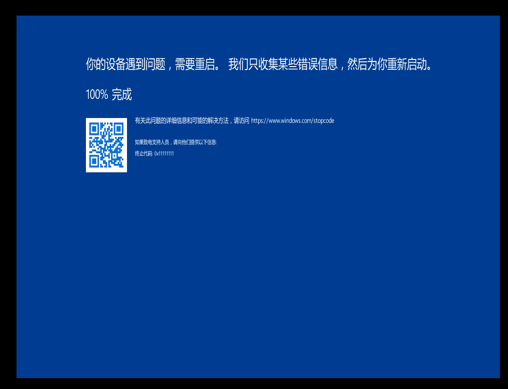


### 出题人的出题思路

#### 外层驱动加载

外层exe包装壳加载加密驱动，手动映射加载。\(AES加密）

#### 驱动操作

驱动监听键盘消息，输入key

驱动Hook进程的一个call（ptehook）

进程调用该call，驱动拦截数据，作为flag输入。

从exe的内存中获取到加密的shellcode，通过系统进程某个信息，来解密该shellcode，并写入到某个系统进程中，挂钩在某个函数调用该shellcode。 

#### shellcode

通过key和flag进行合法性校验。

shellcode通过异常接管，打乱每一行汇编位置，通过异常来处理调用顺序，用来校验。


