---
title: "ZJPCTF2026 Reverse Writeup"
published: 2026-07-18
description: "ZJPCTF2026逆向题解，包含Sign-in、OLLVM等题目的详细分析。"
tags: [CTF, Reverse, ZJPCTF]
category: "CTF"
---# ZJPCTF2026\-Reverse\-wp\-by\-yhypzc

# Sign\-in

## 题目概述

程序输出信息：

```Plain Text
Welcome to zjpctf!
I'll give you some gifts:
754f91cc6554c9e7
1a9267b7a1188556
c0f1b6a831c399e2
436671b6e533d8dc
c3088560732a5ac1
a2f3e71d9181a67b
9d4c2f636f067f89
e6ae2fec3ad71c77
95d565ef66e7dff9
2e2d7fbdea1afc51
ceea167a5a36dedd
a2f3e71d9181a67b
c52e15f763380b45
5436534e61d16e63
4b5ce2fe28308fd9
bbce2345d7772b06
2e2d7fbdea1afc51
9d4c2f636f067f89
5436534e61d16e63
a2f3e71d9181a67b
754f91cc6554c9e7
a2f3e71d9181a67b
c52e15f763380b45
5436534e61d16e63
fb98ab9159f51fd0
2e2d7fbdea1afc51
c0f1b6a831c399e2
ceea167a5a36dedd
5436534e61d16e63
4b5ce2fe28308fd9
5a880faf6fb5e608
754f91cc6554c9e7
c52e15f763380b45
2e2d7fbdea1afc51
9d4c2f636f067f89
a0b923820dcc509a
a0b923820dcc509a
9d4c2f636f067f89
2e2d7fbdea1afc51
ceea167a5a36dedd
c0f1b6a831c399e2
8e05c9709e5dcaed
0123456789abcdeflg{}-
```

程序主函数：

```C++
// main.main
void __golang main_main()
{
  error_0 v0; // r9
  __int128 v1; // xmm15
  void *v2; // rcx
  __int64 i; // rax
  __int64 v4; // rax
  int v5; // r8
  __int64 j; // rax
  __int64 v7; // rax
  int v8; // r8
  __int64 v9; // [rsp+38h] [rbp-598h]
  __int64 v10; // [rsp+40h] [rbp-590h]
  string_0 v11[4]; // [rsp+48h] [rbp-588h] BYREF
  string_0 val[42]; // [rsp+2E8h] [rbp-2E8h] BYREF
  _OWORD a[2]; // [rsp+588h] [rbp-48h] BYREF
  _QWORD v14[2]; // [rsp+5A8h] [rbp-28h] BYREF
  _QWORD v15[3]; // [rsp+5B8h] [rbp-18h] BYREF
  error_0 v16; // 0:r9.16
  error_0 v17; // 0:r9.16
  error_0 v18; // 0:r9.16
  io_Writer_0 v19; // 0:rax.8,8:rbx.8
  string_0 v20; // 0:rax.8,8:rbx.8
  string_0 v21; // 0:rax.8,8:rbx.8
  _slice_interface__0 v22; // 0:rcx.8,8:rdi.16
  _slice_interface__0 v23; // 0:rcx.8,8:rdi.16
  _slice_interface__0 v24; // 0:rcx.8,8:rdi.16

  v15[0] = &RTYPE_string;
  v15[1] = &n;
  v19.data = os_Stdout;
  v19.tab = (runtime_itab_0 *)&go_itab__ptr_os_File_comma_io_Writer;
  v22.array = (interface__0 *)v15;
  v22.len = 1;
  v22.cap = 1;
  fmt_Fprintln(v19, v22, (int)&n, v0);
  v14[0] = &RTYPE_string;
  v14[1] = &off_4BC3E8;
  v19.data = os_Stdout;
  v19.tab = (runtime_itab_0 *)&go_itab__ptr_os_File_comma_io_Writer;
  v22.array = (interface__0 *)v14;
  v22.len = 1;
  v22.cap = 1;
  fmt_Fprintln(v19, v22, (int)&off_4BC3E8, v16);
  v19.tab = (runtime_itab_0 *)((__int64 (__fastcall *)(string_0 *, char **))loc_462B34)(val, off_4BDBA0);
  ((void (__golang *)(runtime_itab_0 *, void *, interface__0 *, string_0 *, void *))loc_462B34)(
    v19.tab,
    v19.data,
    v22.array,
    v11,
    &off_4BDE40);
  for ( i = 0; i < 42; i = v10 + 1 )//步长1
  {
    v10 = i;
    a[1] = v1;
    v4 = i;
    v20.len = val[v4].len;
    v20.str = val[v4].str;
    runtime_convTstring(v20, v2);
    *(_QWORD *)&a[1] = &RTYPE_string;
    *((_QWORD *)&a[1] + 1) = v20.str;
    v20.len = (int)os_Stdout;
    v20.str = (uint8 *)&go_itab__ptr_os_File_comma_io_Writer;
    v23.len = 1;
    v23.cap = 1;
    v23.array = (interface__0 *)&a[1];
    fmt_Fprintln((io_Writer_0)v20, v23, v5, v17);
  }
  for ( j = 0; j < 42; j = v9 + 2 )//步长2
  {
    v9 = j;
    a[0] = v1;
    v7 = j;
    v21.len = v11[v7].len;
    v21.str = v11[v7].str;
    runtime_convTstring(v21, v2);
    *(_QWORD *)&a[0] = &RTYPE_string;
    *((_QWORD *)&a[0] + 1) = v21.str;
    v21.len = (int)os_Stdout;
    v21.str = (uint8 *)&go_itab__ptr_os_File_comma_io_Writer;
    v24.len = 1;
    v24.cap = 1;
    v24.array = (interface__0 *)a;
    fmt_Fprint((io_Writer_0)v21, v24, v8, v18);
  }
}
```

off\_4BDBA0为flag各个字符哈希的指针列表数组，结构为：

字符串地址\(8字节\)\+长度\(1字节\)，字符串地址\(8字节\)\+长度\(1字节\)，字符串地址\(8字节\)\+长度\(1字节\)\.\.\.

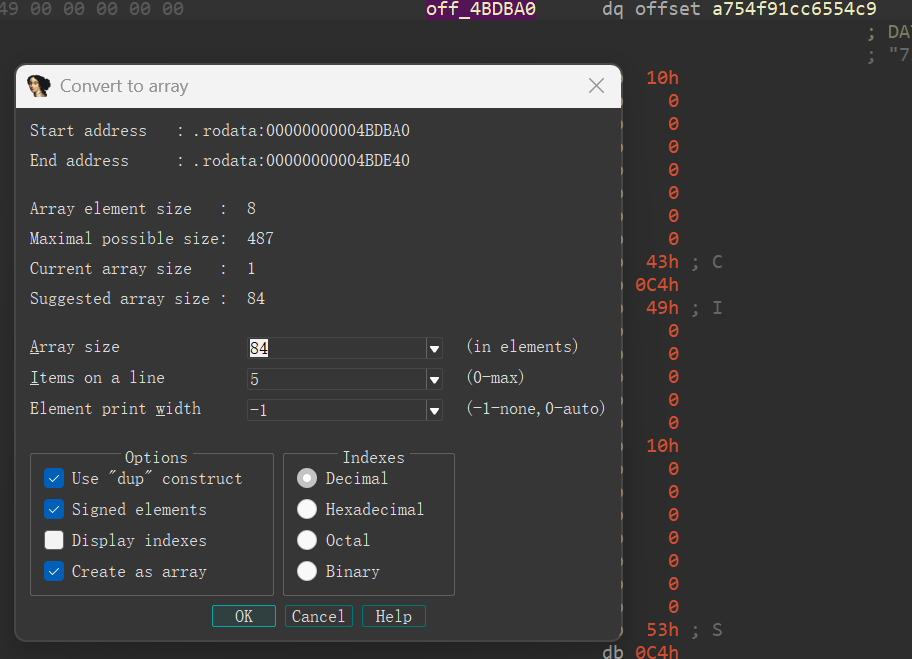

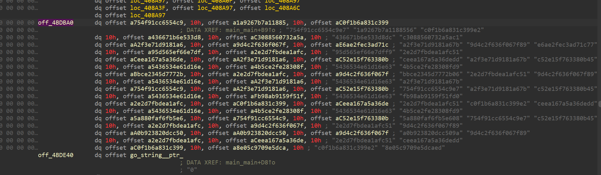

off\_4BDE40为每个字符的哈希与字符的映射。

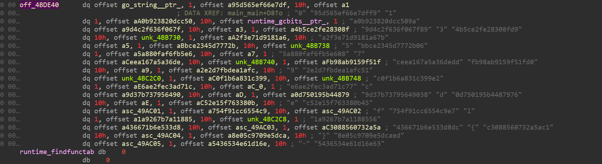

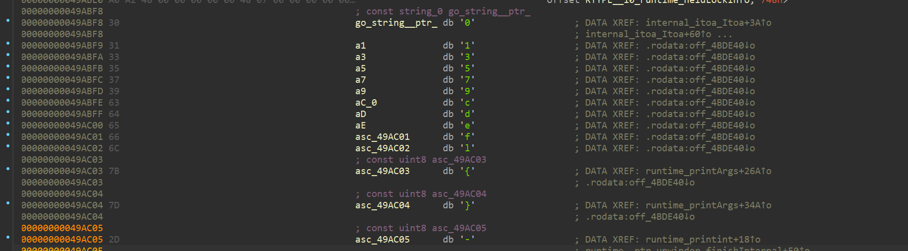

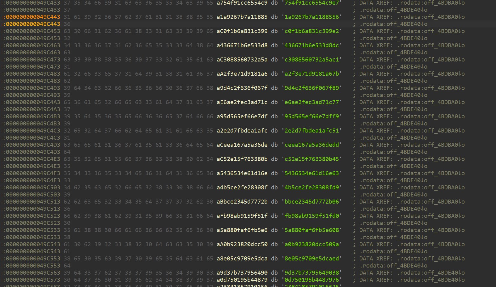

## 求解脚本

把flag哈希对应的字符一个个找出来，编写脚本。

```Python
flagc={
    "95d565ef66e7dff9":"0",
    "a0b923820dcc509a":"1",
    "9d4c2f636f067f89":"2",
    "4b5ce2fe28308fd9":"3",
    "a2f3e71d9181a67b":"4",
    "bbce2345d7772b06":"5",
    "5a880faf6fb5e608":"6",
    "ceea167a5a36dedd":"7",
    "fb98ab9159f51fd0":"8",
    "2e2d7fbdea1afc51":"9",
    "c0f1b6a831c399e2":"a",
    "e6ae2fec3ad71c77":"b",
    "9d37b73795649038":"c",
    "0d750195b4487976":"d",
    "c52e15f763380b45":"e",
    "754f91cc6554c9e7":"f",
    "1a9267b7a1188556":"l",
    "436671b6e533d8dc":"g",
    "c3088560732a5ac1":"{",
    "8e05c9709e5dcaed":"}",
    "5436534e61d16e63":"-",
}

flaghash=[
    "754f91cc6554c9e7",
    "1a9267b7a1188556",
    "c0f1b6a831c399e2",
    "436671b6e533d8dc",
    "c3088560732a5ac1",
    "a2f3e71d9181a67b",
    "9d4c2f636f067f89",
    "e6ae2fec3ad71c77",
    "95d565ef66e7dff9",
    "2e2d7fbdea1afc51",
    "ceea167a5a36dedd",
    "a2f3e71d9181a67b",
    "c52e15f763380b45",
    "5436534e61d16e63",
    "4b5ce2fe28308fd9",
    "bbce2345d7772b06",
    "2e2d7fbdea1afc51",
    "9d4c2f636f067f89",
    "5436534e61d16e63",
    "a2f3e71d9181a67b",
    "754f91cc6554c9e7",
    "a2f3e71d9181a67b",
    "c52e15f763380b45",
    "5436534e61d16e63",
    "fb98ab9159f51fd0",
    "2e2d7fbdea1afc51",
    "c0f1b6a831c399e2",
    "ceea167a5a36dedd",
    "5436534e61d16e63",
    "4b5ce2fe28308fd9",
    "5a880faf6fb5e608",
    "754f91cc6554c9e7",
    "c52e15f763380b45",
    "2e2d7fbdea1afc51",
    "9d4c2f636f067f89",
    "a0b923820dcc509a",
    "a0b923820dcc509a",
    "9d4c2f636f067f89",
    "2e2d7fbdea1afc51",
    "ceea167a5a36dedd",
    "c0f1b6a831c399e2",
    "8e05c9709e5dcaed",
]

for i in flaghash:
    print(flagc[i],end="")
```

flag\{42b0974e\-3592\-4f4e\-89a7\-36fe9211297a\}

## 程序源码

```Go
package main

import "fmt"
/*
flag{42b0974e-3592-4f4e-89a7-36fe9211297a}
*/

func main() {

    fmt.Println("Welcome to zjpctf!")
    fmt.Println("I'll give you some gifts:")
    arr := [...]string{
        "754f91cc6554c9e7",
        "1a9267b7a1188556",
        "c0f1b6a831c399e2",
        "436671b6e533d8dc",
        "c3088560732a5ac1",
        "a2f3e71d9181a67b",
        "9d4c2f636f067f89",
        "e6ae2fec3ad71c77",
        "95d565ef66e7dff9",
        "2e2d7fbdea1afc51",
        "ceea167a5a36dedd",
        "a2f3e71d9181a67b",
        "c52e15f763380b45",
        "5436534e61d16e63",
        "4b5ce2fe28308fd9",
        "bbce2345d7772b06",
        "2e2d7fbdea1afc51",
        "9d4c2f636f067f89",
        "5436534e61d16e63",
        "a2f3e71d9181a67b",
        "754f91cc6554c9e7",
        "a2f3e71d9181a67b",
        "c52e15f763380b45",
        "5436534e61d16e63",
        "fb98ab9159f51fd0",
        "2e2d7fbdea1afc51",
        "c0f1b6a831c399e2",
        "ceea167a5a36dedd",
        "5436534e61d16e63",
        "4b5ce2fe28308fd9",
        "5a880faf6fb5e608",
        "754f91cc6554c9e7",
        "c52e15f763380b45",
        "2e2d7fbdea1afc51",
        "9d4c2f636f067f89",
        "a0b923820dcc509a",
        "a0b923820dcc509a",
        "9d4c2f636f067f89",
        "2e2d7fbdea1afc51",
        "ceea167a5a36dedd",
        "c0f1b6a831c399e2",
        "8e05c9709e5dcaed",
    }
    arr2:=[...]string{
        "0","95d565ef66e7dff9",
        "1","a0b923820dcc509a",
        "2","9d4c2f636f067f89",
        "3","4b5ce2fe28308fd9",
        "4","a2f3e71d9181a67b",
        "5","bbce2345d7772b06",
        "6","5a880faf6fb5e608",
        "7","ceea167a5a36dedd",
        "8","fb98ab9159f51fd0",
        "9","2e2d7fbdea1afc51",
        "a","c0f1b6a831c399e2",
        "b","e6ae2fec3ad71c77",
        "c","9d37b73795649038",
        "d","0d750195b4487976",
        "e","c52e15f763380b45",
        "f","754f91cc6554c9e7",
        "l","1a9267b7a1188556",
        "g","436671b6e533d8dc",
        "{","c3088560732a5ac1",
        "}","8e05c9709e5dcaed",
        "-","5436534e61d16e63",
    }
    for i := 0; i < len(arr); i++ {
        fmt.Println(arr[i])
    }
    for i := 0; i < len(arr); i+=2 {
        fmt.Print(arr2[i])
    }
}
```

# File\-Encryptor

附件：一个文件加密程序、被加密的文件。

## 解包

使用pyinstxtractor解包。

```Plain Text
> python pyinstxtractor.py .\File_Encryptor.exe
[+] Processing .\File_Encryptor.exe
[+] Pyinstaller version: 2.1+
[+] Python version: 3.9
[+] Length of package: 7504559 bytes
[+] Found 984 files in CArchive
[+] Beginning extraction...please standby
[+] Possible entry point: pyiboot01_bootstrap.pyc
[+] Possible entry point: pyi_rth__tkinter.pyc
[+] Possible entry point: File_Encryptor.pyc
[+] Found 87 files in PYZ archive
[+] Successfully extracted pyinstaller archive: .\File_Encryptor.exe

```

## 反编译

用pycdc找到main\.pyc反编译

```Plain Text
pycdc .\File_Encryptor.pyc  > .\File_Encryptor.py
```

在程序主界面代码找到加密函数：

```Python
def encrypt(self, data):
    return zjpctf.innerEncrypt(list(data), self.key_bytes, len(self.key_bytes), 256)
    
def encrypt_file(self):
    *'''\xe5\x8a\xa0\xe5\xaf\x86\xe6\x96\x87\xe4\xbb\xb6'''*
*    *file_path = self.file_path_var.get()
    if not file_path:
        messagebox.showwarning('\xe8\xad\xa6\xe5\x91\x8a', '\xe8\xaf\xb7\xe5\x85\x88\xe9\x80\x89\xe6\x8b\xa9\xe8\xa6\x81\xe5\x8a\xa0\xe5\xaf\x86\xe7\x9a\x84\xe6\x96\x87\xe4\xbb\xb6\xef\xbc\x81')
        return None
    if not None.path.exists(file_path):
        messagebox.showerror('\xe9\x94\x99\xe8\xaf\xaf', '\xe6\x96\x87\xe4\xbb\xb6\xe4\xb8\x8d\xe5\xad\x98\xe5\x9c\xa8\xef\xbc\x81')
        return None
    if not None.askyesno('\xe7\xa1\xae\xe8\xae\xa4\xe5\x8a\xa0\xe5\xaf\x86', f'''\xe7\xa1\xae\xe5\xae\x9a\xe8\xa6\x81\xe5\x8a\xa0\xe5\xaf\x86\xe6\x96\x87\xe4\xbb\xb6\xe5\x90\x97\xef\xbc\x9f\n\n{os.path.basename(file_path)}\n\n\xe5\x8a\xa0\xe5\xaf\x86\xe5\x90\x8e\xe9\x9c\x80\xe8\xa6\x81\xe6\xad\xa3\xe7\xa1\xae\xe7\x9a\x84\xe5\xaf\x86\xe9\x92\xa5\xe6\x89\x8d\xe8\x83\xbd\xe8\xa7\xa3\xe5\xaf\x86\xe3\x80\x82'''):
        return None
    output_path = None + '.encrypted'
    if not os.path.exists(output_path) and messagebox.askyesno('\xe6\x96\x87\xe4\xbb\xb6\xe5\xb7\xb2\xe5\xad\x98\xe5\x9c\xa8', '\xe5\x8a\xa0\xe5\xaf\x86\xe6\x96\x87\xe4\xbb\xb6\xe5\xb7\xb2\xe5\xad\x98\xe5\x9c\xa8\xef\xbc\x8c\xe6\x98\xaf\xe5\x90\xa6\xe8\xa6\x86\xe7\x9b\x96\xef\xbc\x9f'):
        return None
# WARNING: Decompyle incomplete
```

查看反编译字节码：

```Plain Text
pycdas .\File_Encryptor.pyc > .\disasm.txt
```

反汇编字节码，查看未反编译的字节码：

```Plain Text
126     SETUP_FINALLY                 438 (to 568)
                        130     SETUP_FINALLY                 302 (to 436)
                        134     LOAD_FAST                     0: self
                        136     LOAD_ATTR                     10: status_var
                        138     LOAD_METHOD                   11: set
                        140     LOAD_CONST                    12: '\xe6\xad\xa3\xe5\x9c\xa8\xe5\x8a\xa0\xe5\xaf\x86\xe4\xb8\xad...'
                        142     CALL_METHOD                   1
                        144     POP_TOP                       
                        146     LOAD_FAST                     0: self
                        148     LOAD_ATTR                     12: encrypt_btn
                        150     LOAD_ATTR                     13: config
                        152     LOAD_CONST                    13: 'disabled'
                        154     LOAD_CONST                    14: ('state',)
                        156     CALL_FUNCTION_KW              1
                        158     POP_TOP                       
                        160     LOAD_FAST                     0: self
                        162     LOAD_ATTR                     14: root
                        164     LOAD_METHOD                   15: update
                        166     CALL_METHOD                   0
                        168     POP_TOP                       
                        170     LOAD_GLOBAL                   4: messagebox
                        172     LOAD_ATTR                     5: path
                        174     LOAD_METHOD                   16: getsize
                        176     LOAD_FAST                     1: file_path
                        178     CALL_METHOD                   1
                        180     STORE_FAST                    3: file_size
                        182     LOAD_CONST                    15: 1048576
                        184     STORE_FAST                    4: chunk_size
                        186     LOAD_CONST                    16: 0
                        188     STORE_FAST                    5: processed_size
                        190     LOAD_GLOBAL                   17: NULL + askyesno
                        192     LOAD_FAST                     1: file_path
                        194     LOAD_CONST                    17: 'rb'
                        196     CALL_FUNCTION                 2
                        198     SETUP_WITH                    156
                        200     STORE_FAST                    6: f_in
                        202     LOAD_GLOBAL                   17: NULL + askyesno
                        204     LOAD_FAST                     2: output_path
                        206     LOAD_CONST                    18: 'wb'
                        208     CALL_FUNCTION                 2
                        210     SETUP_WITH                    112
                        212     STORE_FAST                    7: f_out
                        214     LOAD_FAST                     6: f_in
                        216     LOAD_METHOD                   18: read
                        218     LOAD_FAST                     4: chunk_size
                        220     CALL_METHOD                   1
                        222     STORE_FAST                    8: chunk
                        224     LOAD_FAST                     8: chunk
                        226     POP_JUMP_IF_TRUE              232
                        228     JUMP_ABSOLUTE                 310
                        232     LOAD_FAST                     0: self
                        234     LOAD_METHOD                   19: encrypt
                        236     LOAD_FAST                     8: chunk
                        238     CALL_METHOD                   1
                        240     STORE_FAST                    9: encrypted_chunk
                        242     LOAD_FAST                     7: f_out
                        244     LOAD_METHOD                   20: write
                        246     LOAD_FAST                     9: encrypted_chunk
                        248     CALL_METHOD                   1
                        250     POP_TOP                       
                        252     LOAD_FAST                     5: processed_size
                        254     LOAD_GLOBAL                   21: NULL + status_var
                        256     LOAD_FAST                     8: chunk
                        258     CALL_FUNCTION                 1
                        260     INPLACE_ADD                   
                        262     STORE_FAST                    5: processed_size
                        264     LOAD_FAST                     5: processed_size
                        266     LOAD_FAST                     3: file_size
                        268     BINARY_TRUE_DIVIDE            
                        270     LOAD_CONST                    19: 100
                        272     BINARY_MULTIPLY               
                        274     STORE_FAST                    10: progress
                        276     LOAD_FAST                     0: self
                        278     LOAD_ATTR                     10: status_var
                        280     LOAD_METHOD                   11: set
                        282     LOAD_CONST                    20: '\xe5\x8a\xa0\xe5\xaf\x86\xe4\xb8\xad: '
                        284     LOAD_FAST                     10: progress
                        286     LOAD_CONST                    21: '.1f'
                        288     FORMAT_VALUE                  4
                        290     LOAD_CONST                    22: '%'
                        292     BUILD_STRING                  3
                        294     CALL_METHOD                   1
                        296     POP_TOP                       
                        298     LOAD_FAST                     0: self
                        300     LOAD_ATTR                     14: root
                        302     LOAD_METHOD                   15: update
                        304     CALL_METHOD                   0
                        306     POP_TOP                       
                        308     JUMP_ABSOLUTE                 214
                        310     POP_BLOCK                     
                        312     LOAD_CONST                    3: None
                        314     DUP_TOP                       
                        316     DUP_TOP                       
                        318     CALL_FUNCTION                 3
                        320     POP_TOP                       
                        322     JUMP_FORWARD                  18 (to 342)
                        324     WITH_EXCEPT_START             
                        326     POP_JUMP_IF_TRUE              332
                        330     RERAISE                       
                        332     POP_TOP                       
                        334     POP_TOP                       
                        336     POP_TOP                       
                        338     POP_EXCEPT                    
                        340     POP_TOP                       
                        342     POP_BLOCK                     
                        344     LOAD_CONST                    3: None
                        346     DUP_TOP                       
                        348     DUP_TOP                       
                        350     CALL_FUNCTION                 3
                        352     POP_TOP                       
                        354     JUMP_FORWARD                  18 (to 374)
                        356     WITH_EXCEPT_START             
                        358     POP_JUMP_IF_TRUE              364
                        362     RERAISE                       
                        364     POP_TOP                       
                        366     POP_TOP                       
                        368     POP_TOP                       
                        370     POP_EXCEPT                    
                        372     POP_TOP                       
                        374     LOAD_FAST                     0: self
                        376     LOAD_ATTR                     10: status_var
                        378     LOAD_METHOD                   11: set
                        380     LOAD_CONST                    23: '\xe5\x8a\xa0\xe5\xaf\x86\xe5\xae\x8c\xe6\x88\x90\xef\xbc\x81'
                        382     CALL_METHOD                   1
                        384     POP_TOP                       
                        386     LOAD_FAST                     0: self
                        388     LOAD_ATTR                     22: info_var
                        390     LOAD_METHOD                   11: set
                        392     LOAD_CONST                    24: '\xe5\x8a\xa0\xe5\xaf\x86\xe6\x96\x87\xe4\xbb\xb6\xe5\xb7\xb2\xe4\xbf\x9d\xe5\xad\x98\xe4\xb8\xba: '
                        394     LOAD_GLOBAL                   4: messagebox
                        396     LOAD_ATTR                     5: path
                        398     LOAD_METHOD                   9: basename
                        400     LOAD_FAST                     2: output_path
                        402     CALL_METHOD                   1
                        404     FORMAT_VALUE                  0
                        406     BUILD_STRING                  2
                        408     CALL_METHOD                   1
                        410     POP_TOP                       
                        412     LOAD_GLOBAL                   2: get
                        414     LOAD_METHOD                   23: showinfo
                        416     LOAD_CONST                    25: '\xe5\x8a\xa0\xe5\xaf\x86\xe6\x88\x90\xe5\x8a\x9f'
                        418     LOAD_CONST                    26: '\xe6\x96\x87\xe4\xbb\xb6\xe5\x8a\xa0\xe5\xaf\x86\xe6\x88\x90\xe5\x8a\x9f\xef\xbc\x81\n\n\xe5\x8a\xa0\xe5\xaf\x86\xe6\x96\x87\xe4\xbb\xb6\xe4\xbf\x9d\xe5\xad\x98\xe4\xb8\xba:\n'
                        420     LOAD_FAST                     2: output_path
                        422     FORMAT_VALUE                  0
                        424     LOAD_CONST                    27: '\n\n\xe8\xaf\xb7\xe5\xa6\xa5\xe5\x96\x84\xe4\xbf\x9d\xe7\xae\xa1\xe5\x8a\xa0\xe5\xaf\x86\xe6\x96\x87\xe4\xbb\xb6\xe3\x80\x82'
                        426     BUILD_STRING                  3
                        428     CALL_METHOD                   2
                        430     POP_TOP                       
                        432     POP_BLOCK                     
                        434     JUMP_FORWARD                  114 (to 550)
                        436     DUP_TOP                       
                        438     LOAD_GLOBAL                   24: encrypt_btn
                        440     JUMP_IF_NOT_EXC_MATCH         548
                        444     POP_TOP                       
                        446     STORE_FAST                    11: e
                        448     POP_TOP                       
                        450     SETUP_FINALLY                 88 (to 540)
                        452     LOAD_FAST                     0: self
                        454     LOAD_ATTR                     10: status_var
                        456     LOAD_METHOD                   11: set
                        458     LOAD_CONST                    28: '\xe5\x8a\xa0\xe5\xaf\x86\xe5\xa4\xb1\xe8\xb4\xa5'
                        460     CALL_METHOD                   1
                        462     POP_TOP                       
                        464     LOAD_GLOBAL                   2: get
                        466     LOAD_METHOD                   7: showerror
                        468     LOAD_CONST                    28: '\xe5\x8a\xa0\xe5\xaf\x86\xe5\xa4\xb1\xe8\xb4\xa5'
                        470     LOAD_CONST                    29: '\xe5\x8a\xa0\xe5\xaf\x86\xe8\xbf\x87\xe7\xa8\x8b\xe4\xb8\xad\xe5\x87\xba\xe7\x8e\xb0\xe9\x94\x99\xe8\xaf\xaf:\n'
                        472     LOAD_GLOBAL                   25: NULL + encrypt_btn
                        474     LOAD_FAST                     11: e
                        476     CALL_FUNCTION                 1
                        478     FORMAT_VALUE                  0
                        480     BUILD_STRING                  2
                        482     CALL_METHOD                   2
                        484     POP_TOP                       
                        486     LOAD_GLOBAL                   4: messagebox
                        488     LOAD_ATTR                     5: path
                        490     LOAD_METHOD                   6: exists
                        492     LOAD_FAST                     2: output_path
                        494     CALL_METHOD                   1
                        496     POP_JUMP_IF_FALSE             528
                        500     SETUP_FINALLY                 14 (to 516)
                        502     LOAD_GLOBAL                   4: messagebox
                        504     LOAD_METHOD                   26: remove
                        506     LOAD_FAST                     2: output_path
                        508     CALL_METHOD                   1
                        510     POP_TOP                       
                        512     POP_BLOCK                     
                        514     JUMP_FORWARD                  12 (to 528)
                        516     POP_TOP                       
                        518     POP_TOP                       
                        520     POP_TOP                       
                        522     POP_EXCEPT                    
                        524     JUMP_FORWARD                  2 (to 528)
                        526     RERAISE                       
                        528     POP_BLOCK                     
                        530     POP_EXCEPT                    
                        532     LOAD_CONST                    3: None
                        534     STORE_FAST                    11: e
                        536     DELETE_FAST                   11: e
                        538     JUMP_FORWARD                  10 (to 550)
                        540     LOAD_CONST                    3: None
                        542     STORE_FAST                    11: e
                        544     DELETE_FAST                   11: e
                        546     RERAISE                       
                        548     RERAISE                       
                        550     POP_BLOCK                     
                        552     LOAD_FAST                     0: self
                        554     LOAD_ATTR                     12: encrypt_btn
                        556     LOAD_ATTR                     13: config
                        558     LOAD_CONST                    30: 'normal'
                        560     LOAD_CONST                    14: ('state',)
                        562     CALL_FUNCTION_KW              1
                        564     POP_TOP                       
                        566     JUMP_FORWARD                  16 (to 584)
                        568     LOAD_FAST                     0: self
                        570     LOAD_ATTR                     12: encrypt_btn
                        572     LOAD_ATTR                     13: config
                        574     LOAD_CONST                    30: 'normal'
                        576     LOAD_CONST                    14: ('state',)
                        578     CALL_FUNCTION_KW              1
                        580     POP_TOP                       
                        582     RERAISE                       
                        584     LOAD_CONST                    3: None
                        586     RETURN_VALUE            
```

阅读字节码，写出python代码

```Python
def encrypt_file(self, file_path, output_path):
    ...
    try:
        try:
            self.status_var.set('\xe5\x8a\xa0\xe5\xaf\x86\xe5\xae\x8c\xe6\x88\x90\xef\xbc\x81')
            self.encrypt_btn.config(state='disabled')
            self.root.update()
            
            file_size = messagebox.path.getsize(file_path)
            chunk_size = 1048576  
            processed_size = 0
            
            with open(file_path, 'rb') as f_in:
                with open(output_path, 'wb') as f_out:
                    while True:
                        
                        chunk = f_in.read(chunk_size)
                        if not chunk:
                            break
                        
                        
                        encrypted_chunk = self.encrypt(chunk)
                        f_out.write(encrypted_chunk)
                        
                        
                        processed_size += len(chunk)
                        progress = (processed_size / file_size) * 100
                        self.status_var.set(f"加密中: {progress:.1f}%")
                        self.root.update()
            
            
            self.status_var.set("加密完成！")
            self.info_var.set(f"加密文件已保存为: {messagebox.path.basename(output_path)}")
            messagebox.showinfo(
                "加密成功",
                f"文件加密成功！\n\n加密文件保存为:\n{output_path}\n\n请妥善保管加密文件。"
            )
            
        except Exception as e:
            
            self.status_var.set("加密失败")
            messagebox.showerror(
                "加密失败",
                f"加密过程中出现错误:\n{str(e)}"
            )
            
            
            if messagebox.path.exists(output_path):
                try:
                    messagebox.remove(output_path)
                except:
                    pass
                    
    finally:
        # 恢复按钮状态
        self.encrypt_btn.config(state='normal')
```

## 加密函数分析

寻找zjpctf模块。

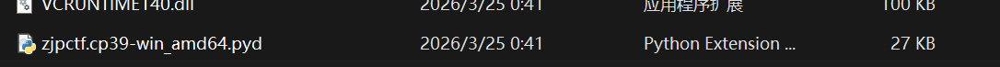

查看二进制数据，发现是动态链接库格式。

```Plain Text
Info: 
    File name: D:/我的文件/0.zjpc/3.学习/CTF/比赛/2026.03.28 ZJPCTF/re/File_Encryptor/new-release/flag/File_Encryptor.exe_extracted/zjpctf.cp39-win_amd64.pyd
    Size: 27648(27.00 KiB)
    File type: PE64
    String: PE64
    Extension: dll
    MIME: application/x-msdos-program
    Operation system: Windows(Vista)
    Architecture: AMD64
    Mode: 64 位
    Type: DLL
    Endianness: LE
```

尝试脱壳机脱壳，无法脱壳。

修改UPX标志

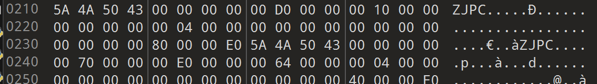

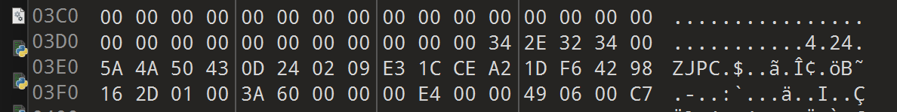

将其改为

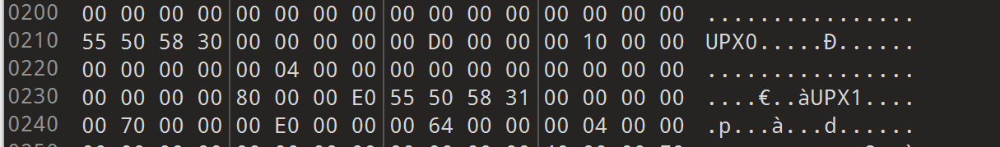

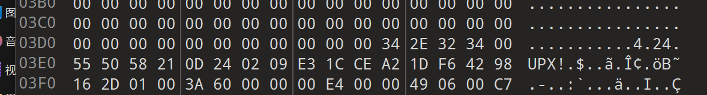

就能正常脱壳，脱壳之后打开。

在字符串列表中找到调用的模块加密函数名称。

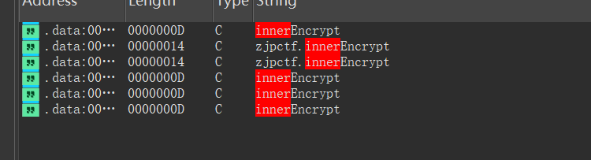

选择第一个字符串，按下X交叉引用。

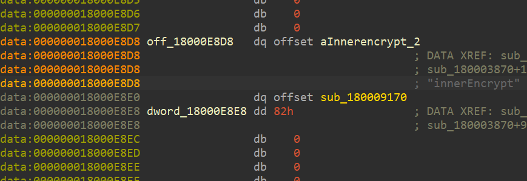

找到加密函数：

```C++
__int64 __fastcall innerEncrypt(__int64 a1, __int64 **__pyx_v_data, __int64 __pyx_v_key, __int64 __pyx_v_n)
{
  __int64 v5; // rsi
  __int64 v6; // r12
  __int64 *v7; // rax
  __int64 *v8; // rax
  __int64 *v9; // rax
  __int64 *v10; // rax
  __int64 **v11; // r14
  __int64 **v12; // r13
  __int64 v13; // rbx
  __int64 *v14; // rax
  __int64 **v15; // rcx
  __int64 v16; // rdi
  int v17; // eax
  __int64 *v18; // rcx
  _QWORD *v19; // rax
  int v20; // eax
  __int64 *v21; // rax
  __int64 v22; // rdi
  __int64 **v23; // rbx
  _QWORD *ItemWithError; // rax
  __int64 *v25; // rax
  __int64 **v26; // rcx
  int v27; // eax
  const char *v28; // r8
  __int64 *v29; // rax
  __int64 *v30; // rax
  __int64 *v31; // rax
  __int64 *v32; // rax
  _QWORD *v33; // rbx
  _QWORD *v34; // rdi
  _QWORD *v35; // r13
  __int64 v36; // rax
  bool v37; // zf
  __int64 v38; // rsi
  __int64 v39; // rax
  __int64 v40; // rbx
  __int64 v41; // rdi
  __int64 i; // rbx
  _QWORD *v43; // rcx
  __int64 k; // rbx
  _QWORD *v45; // rcx
  _QWORD *v47; // rbx
  _QWORD *v48; // r14
  __int64 v49; // rdx
  _QWORD *v50; // r12
  unsigned int v51; // edi
  __int64 v52; // rcx
  _QWORD *__pyx_v_i; // r15
  _QWORD *v54; // rsi
  _QWORD *v55; // rcx
  _QWORD *v56; // rcx
  __int64 v57; // rax
  __int64 v58; // rax
  int v59; // ecx
  __int64 v60; // rax
  unsigned __int64 v61; // rcx
  _QWORD *v62; // rcx
  __int64 v63; // rax
  __int64 v64; // rcx
  __int64 (__fastcall *v65)(_QWORD *, _QWORD *); // r8
  _QWORD *v66; // rbx
  __int64 v67; // rcx
  __int64 v68; // rbx
  __int64 v69; // rax
  __int64 v70; // rbx
  __int64 v71; // rax
  unsigned __int64 v72; // rcx
  unsigned __int64 v73; // rax
  __int64 v74; // r14
  __int64 v75; // rax
  _QWORD *v76; // rdi
  __int64 Item; // rax
  _QWORD *v78; // rdi
  __int64 v79; // rax
  __int64 v80; // rax
  __int64 v81; // rax
  __int64 v82; // rax
  __int64 v83; // rax
  _QWORD *v84; // rdi
  _QWORD *v85; // rdi
  __int64 v86; // rax
  _QWORD *v87; // rdi
  _QWORD *v88; // rcx
  _QWORD *v89; // r14
  __int64 v90; // rdx
  int v91; // eax
  unsigned int v92; // edi
  __int64 v93; // rax
  unsigned __int64 v94; // rax
  __int64 v95; // r14
  __int64 v96; // rax
  _QWORD *v97; // r14
  __int64 v98; // rax
  _QWORD *v99; // rdi
  char *v100; // rdx
  _QWORD *v101; // rcx
  _QWORD *v102; // rcx
  _QWORD *v103; // rcx
  _QWORD *v104; // rcx
  _QWORD *v105; // rcx
  __int64 j; // rbx
  _QWORD *v107; // rcx
  _QWORD *v108; // [rsp+48h] [rbp-B8h] BYREF
  _QWORD *v109; // [rsp+50h] [rbp-B0h] BYREF
  __int64 v110; // [rsp+58h] [rbp-A8h]
  _QWORD *v111; // [rsp+60h] [rbp-A0h]
  _QWORD *v112; // [rsp+68h] [rbp-98h]
  _QWORD *v113; // [rsp+70h] [rbp-90h] BYREF
  __int64 v114; // [rsp+78h] [rbp-88h]
  _QWORD *v115; // [rsp+80h] [rbp-80h] BYREF
  _QWORD *v116; // [rsp+88h] [rbp-78h] BYREF
  __int64 v117; // [rsp+90h] [rbp-70h]
  __int64 v118; // [rsp+98h] [rbp-68h]
  _QWORD *v119; // [rsp+A0h] [rbp-60h] BYREF
  __int128 v120; // [rsp+A8h] [rbp-58h] BYREF
  __int128 v121; // [rsp+B8h] [rbp-48h]
  __int128 key_len; // [rsp+C8h] [rbp-38h]
  __int64 *v123[5]; // [rsp+D8h] [rbp-28h] BYREF

  v123[0] = &qword_18000F738;
  v123[1] = &qword_18000F780;
  v123[2] = &qword_18000F790;
  v123[3] = &qword_18000F7B0;
  v123[4] = 0;
  v5 = __pyx_v_key;
  v121 = 0;
  key_len = 0;
  if ( !__pyx_v_n )
    goto LABEL_55;
  v6 = *(_QWORD *)(__pyx_v_n + 16);
  if ( v6 < 0 )
    goto LABEL_88;
  if ( v6 <= 0 )
  {
LABEL_55:
    if ( __pyx_v_key == 4 )
    {
      v29 = *__pyx_v_data;
      ++*v29;
      *(_QWORD *)&v121 = v29;
      v30 = __pyx_v_data[1];
      ++*v30;
      *((_QWORD *)&v121 + 1) = v30;
      v31 = __pyx_v_data[2];
      ++*v31;
      *(_QWORD *)&key_len = v31;
      v32 = __pyx_v_data[3];
      ++*v32;
      *((_QWORD *)&key_len + 1) = v32;
      goto LABEL_58;
    }
    goto LABEL_56;
  }
  if ( __pyx_v_key )
  {
    switch ( __pyx_v_key )
    {
      case 1LL:
LABEL_12:
        v10 = *__pyx_v_data;
        ++*v10;
        *(_QWORD *)&v121 = v10;
        goto LABEL_13;
      case 2LL:
LABEL_11:
        v9 = __pyx_v_data[1];
        ++*v9;
        *((_QWORD *)&v121 + 1) = v9;
        goto LABEL_12;
      case 3LL:
LABEL_10:
        v8 = __pyx_v_data[2];
        ++*v8;
        *(_QWORD *)&key_len = v8;
        goto LABEL_11;
      case 4LL:
        v7 = __pyx_v_data[3];
        ++*v7;
        *((_QWORD *)&key_len + 1) = v7;
        goto LABEL_10;
    }
LABEL_56:
    v28 = aInnerencrypt_1;
    goto LABEL_54;
  }
LABEL_13:
  v11 = &v123[__pyx_v_key];
  if ( (*(_DWORD *)(*(_QWORD *)(__pyx_v_n + 8) + 168LL) & 0x4000000) != 0 )
  {
    v12 = &__pyx_v_data[__pyx_v_key];
    v13 = 0;
    while ( 1 )
    {
      v14 = *v11;
      v15 = v11;
      v16 = *(_QWORD *)(__pyx_v_n + 8 * v13 + 24);
      if ( !*v11 )
        goto LABEL_18;
      while ( *v14 != v16 )
      {
        v14 = v15[1];
        ++v15;
        if ( !v14 )
          goto LABEL_18;
      }
      if ( *v15 )
      {
        v21 = v12[v13];
        __pyx_v_data = v123;
        ++*v21;
        *((_QWORD *)&v121 + v15 - v123) = v21;
      }
      else
      {
LABEL_18:
        v108 = 0;
        v17 = sub_180005E70(v16, v123, v11, (__int64 *)&v108);
        if ( v17 != 1 )
        {
          if ( v17 != -1 )
            PyErr_Format(PyExc_TypeError, aSGotAnUnexpect, aInnerencrypt, v16);
          goto LABEL_47;
        }
        v18 = v12[v13];
        v19 = v108;
        ++*v18;
        *((_QWORD *)&v121 + (_QWORD)v19) = v18;
      }
      if ( ++v13 >= v6 )
      {
        v20 = 0;
        goto LABEL_48;
      }
    }
  }
  if ( !(unsigned int)PyArg_ValidateKeywordArguments(__pyx_v_n) )
    goto LABEL_47;
  v22 = 0;
  v23 = v11;
  if ( *v11 )
  {
    do
    {
      if ( v6 <= v22 )
        goto LABEL_34;
      ItemWithError = (_QWORD *)PyDict_GetItemWithError(__pyx_v_n, **v23);
      if ( ItemWithError )
      {
        ++*ItemWithError;
        __pyx_v_data = v123;
        ++v22;
        *((_QWORD *)&v121 + v23 - v123) = ItemWithError;
      }
      else if ( PyErr_Occurred() )
      {
        goto LABEL_47;
      }
      ++v23;
    }
    while ( *v23 );
    if ( v6 <= v22 )
    {
LABEL_34:
      v20 = 0;
      goto LABEL_48;
    }
  }
  v108 = 0;
  v109 = 0;
  if ( !(unsigned int)PyDict_Next(__pyx_v_n, &v108, &v109, 0) )
    goto LABEL_47;
  while ( 1 )
  {
    v25 = *v11;
    if ( !*v11 )
      break;
    v26 = v11;
    while ( (_QWORD *)*v25 != v109 )
    {
      v25 = v26[1];
      ++v26;
      if ( !v25 )
        goto LABEL_42;
    }
    if ( !*v26 )
      break;
LABEL_43:
    if ( !(unsigned int)PyDict_Next(__pyx_v_n, &v108, &v109, 0) )
      goto LABEL_47;
  }
LABEL_42:
  v113 = 0;
  v27 = sub_180005E70((__int64)v109, v123, v11, (__int64 *)&v113);
  if ( v27 == 1 )
    goto LABEL_43;
  if ( !v27 )
    PyErr_Format(PyExc_TypeError, aSGotAnUnexpect_0, aInnerencrypt, v109);
LABEL_47:
  v20 = -1;
LABEL_48:
  if ( v20 < 0 )
    goto LABEL_88;
  if ( v5 >= 4 )
  {
LABEL_58:
    v33 = (_QWORD *)key_len;
    v35 = (_QWORD *)*((_QWORD *)&v121 + 1);
    v34 = (_QWORD *)v121;
    v113 = (_QWORD *)v121;
    if ( *(_QWORD *)(key_len + 8) != PyLong_Type )
    {
      if ( (unsigned int)PyNumber_Check(key_len) )
      {
        v36 = PyNumber_Long(v33);
        if ( v36 )
        {
          *(_QWORD *)&key_len = v36;
          v37 = (*v33)-- == 1;
          if ( v37 )
            Py_Dealloc(v33);
          goto LABEL_63;
        }
      }
      else
      {
        PyErr_Format(
          PyExc_TypeError,
          "Argument '%.200s' has incorrect type (expected %.200s, got %.200s)",
          aKeyLen_0,
          aInt,
          *(const char **)(v33[1] + 24LL));
      }
      *(_QWORD *)&key_len = 0;
      goto LABEL_86;
    }
LABEL_63:
    v33 = (_QWORD *)*((_QWORD *)&key_len + 1);
    v38 = key_len;
    v114 = key_len;
    if ( *(_QWORD *)(*((_QWORD *)&key_len + 1) + 8LL) == PyLong_Type )
    {
LABEL_68:
      v40 = *((_QWORD *)&key_len + 1);
      v117 = *((_QWORD *)&key_len + 1);
      if ( v34[1] != PyList_Type && !(unsigned int)sub_180005540(v34, PyList_Type, aData)
        || v35[1] != PyBytes_Type && !(unsigned int)sub_180005540(v35, PyBytes_Type, aKey)
        || *(_QWORD *)(v38 + 8) != PyLong_Type && !(unsigned int)sub_180005540(v38, PyLong_Type, aKeyLen)
        || *(_QWORD *)(v40 + 8) != PyLong_Type && !(unsigned int)sub_180005540(v40, PyLong_Type, aN) )
      {
        v41 = 0;
        for ( i = 0; i < 4; ++i )
        {
          v43 = (_QWORD *)*((_QWORD *)&v121 + i);
          if ( v43 )
          {
            v37 = (*v43)-- == 1;
            if ( v37 )
              Py_Dealloc(v43);
          }
        }
        return v41;
      }
      v111 = 0;
      v112 = 0;
      v47 = 0;
      v48 = 0;
      v109 = 0;
      v108 = 0;
      v120 = 0;
      v50 = (_QWORD *)sub_180006760(PyByteArray_Type, (char *)&v120 + 8, 0x8000000000000000uLL, 0);// result=bytearray()
      if ( !v50 )
      {
        v51 = 2;
        goto LABEL_240;
      }
      v52 = 0;
      v110 = 0;
      ++*(_QWORD *)qword_18000F810;
      __pyx_v_i = (_QWORD *)qword_18000F810;    // i=0
      ++*v34;
      if ( (__int64)v34[2] <= 0 )
      {
LABEL_234:
        v37 = (*v34)-- == 1;
        if ( v37 )
          Py_Dealloc(v34);
        v37 = (*__pyx_v_i)-- == 1;
        if ( v37 )
          Py_Dealloc(__pyx_v_i);
        v115 = 0;
        v116 = v50;
        v41 = sub_180006760(PyBytes_Type, &v116, 0x8000000000000001uLL, 0);
        if ( !v41 )
        {
          v51 = 7;
          goto LABEL_240;
        }
LABEL_241:
        v37 = (*v50)-- == 1;
        if ( v37 )
          Py_Dealloc(v50);
LABEL_243:
        v102 = v109;
        if ( v109 )
        {
          v37 = (*v109)-- == 1;
          if ( v37 )
            Py_Dealloc(v102);
        }
        v103 = v111;
        if ( v111 )
        {
          v37 = (*v111)-- == 1;
          if ( v37 )
            Py_Dealloc(v103);
        }
        v104 = v112;
        if ( v112 )
        {
          v37 = (*v112)-- == 1;
          if ( v37 )
            Py_Dealloc(v104);
        }
        v105 = v108;
        if ( v108 )
        {
          v37 = (*v108)-- == 1;
          if ( v37 )
            Py_Dealloc(v105);
        }
        for ( j = 0; j < 4; ++j )
        {
          v107 = (_QWORD *)*((_QWORD *)&v121 + j);
          if ( v107 )
          {
            v37 = (*v107)-- == 1;
            if ( v37 )
              Py_Dealloc(v107);
          }
        }
        return v41;
      }
      while ( 1 )                               // for i, byte in enumerate(data):
      {
        v54 = *(_QWORD **)(v34[3] + 8 * v52);
        ++*v54;
        if ( !v54 )
        {
LABEL_223:
          v66 = 0;
          v51 = 3;
          if ( !__pyx_v_i )
            goto LABEL_226;
          goto LABEL_224;
        }
        v55 = v111;
        v111 = v54;
        if ( v55 )
        {
          v37 = (*v55)-- == 1;
          if ( v37 )
            Py_Dealloc(v55);
        }
        v56 = v109;
        ++*__pyx_v_i;
        v109 = __pyx_v_i;
        if ( v56 )
        {
          v37 = (*v47)-- == 1;
          if ( v37 )
            Py_Dealloc(v56);
        }
        v57 = __pyx_v_i[1];
        v54 = (_QWORD *)qword_18000F818;
        if ( v57 == PyLong_Type )
        {
          v49 = __pyx_v_i[2];
          if ( !v49 )
          {
            ++*(_QWORD *)qword_18000F818;
            goto LABEL_122;
          }
          v58 = -v49;
          if ( v49 > 0 )
            v58 = __pyx_v_i[2];
          if ( v58 == 1 )
          {
            v59 = -*((_DWORD *)__pyx_v_i + 6);
            if ( v49 > 0 )
              v59 = *((_DWORD *)__pyx_v_i + 6);
            v60 = PyLong_FromLong((unsigned int)(v59 + 1));
          }
          else if ( v58 == 2 )
          {
            v61 = *((unsigned int *)__pyx_v_i + 6) | ((unsigned __int64)*((unsigned int *)__pyx_v_i + 7) << 30);
            if ( v49 <= 0 )
              v61 = -(__int64)v61;
            v60 = PyLong_FromLongLong(v61 + 1);
          }
          else
          {
            v60 = (**((__int64 (__fastcall ***)(_QWORD *, __int64))&PyLong_Type + 12))(__pyx_v_i, qword_18000F818);
          }
        }
        else if ( v57 == PyFloat_Type )
        {
          v60 = PyFloat_FromDouble();
        }
        else
        {
          v60 = PyNumber_Add(__pyx_v_i, qword_18000F818);// i+=1
        }
        v54 = (_QWORD *)v60;
LABEL_122:
        if ( !v54 )
          goto LABEL_223;
        v37 = (*__pyx_v_i)-- == 1;
        if ( v37 )
          Py_Dealloc(__pyx_v_i);
        v62 = __pyx_v_i;                        // i
        __pyx_v_i = v54;
        v54 = (_QWORD *)PyNumber_Remainder(v62, v114);// i % key_len
        if ( !v54 )
        {
          v51 = 4;
          v66 = 0;
LABEL_224:
          v37 = (*__pyx_v_i)-- == 1;
          if ( v37 )
            Py_Dealloc(__pyx_v_i);
LABEL_226:
          v101 = v113;
          v37 = (*v113)-- == 1;
          if ( v37 )
            Py_Dealloc(v101);
          if ( v54 )
          {
            v37 = (*v54)-- == 1;
            if ( v37 )
              Py_Dealloc(v54);
          }
          if ( v66 )
          {
            v37 = (*v66)-- == 1;
            if ( v37 )
              Py_Dealloc(v66);
          }
LABEL_240:
          sub_1800024C0(aZjpctfInnerenc, v49, v51, aZjpctfPyx);
          v41 = 0;
          if ( v50 )
            goto LABEL_241;
          goto LABEL_243;
        }
        v63 = v35[1];                           // key
        v64 = *(_QWORD *)(v63 + 112);
        if ( v64 )
        {
          v65 = *(__int64 (__fastcall **)(_QWORD *, _QWORD *))(v64 + 8);
          if ( v65 )
          {
            v66 = (_QWORD *)v65(v35, v54);      // key_byte = key[i % key_len]
            goto LABEL_173;
          }
        }
        v67 = *(_QWORD *)(v63 + 104);
        if ( !v67 || !*(_QWORD *)(v67 + 24) )
        {
          if ( *(int *)(v63 + 168) < 0 )
          {
            v83 = sub_180006AE0(v35, qword_18000F728);
            v84 = (_QWORD *)v83;
            if ( v83 )
            {
              v118 = 0;
              v119 = v54;
              v93 = sub_180006760(v83, &v119, 0x8000000000000001uLL, 0);
              v37 = (*v84)-- == 1;
              v66 = (_QWORD *)v93;
              if ( v37 )
                Py_Dealloc(v84);
              goto LABEL_173;
            }
            PyErr_Clear();
          }
          PyErr_Format(PyExc_TypeError, "'%.200s' object is not subscriptable", *(_QWORD *)(v35[1] + 24LL));
          goto LABEL_172;
        }
        v68 = sub_180001B80(v54);
        if ( v68 == -1 )
        {
          v69 = PyErr_Occurred();
          if ( v69 )
          {
            if ( (unsigned int)PyErr_GivenExceptionMatches(v69, PyExc_OverflowError) )
            {
              v70 = *(_QWORD *)(v54[1] + 24LL);
              PyErr_Clear();
              PyErr_Format(PyExc_IndexError, "cannot fit '%.200s' into an index-sized integer", v70);
            }
LABEL_172:
            v66 = 0;
            goto LABEL_173;
          }
        }
        v71 = v35[1];
        if ( v71 == PyList_Type )
        {
          if ( v68 < 0 )
            v72 = v68 + v35[2];
          else
            v72 = v68;
          if ( v72 < v35[2] )
          {
            v48 = v108;
            v66 = *(_QWORD **)(v35[3] + 8 * v72);
            ++*v66;
            goto LABEL_173;
          }
          goto LABEL_162;
        }
        if ( v71 == PyTuple_Type )
        {
          if ( v68 < 0 )
            v73 = v68 + v35[2];
          else
            v73 = v68;
          if ( v73 < v35[2] )
          {
            v66 = (_QWORD *)v35[v73 + 3];
            v48 = v108;
            ++*v66;
            goto LABEL_173;
          }
LABEL_162:
          v82 = PyLong_FromSsize_t(v68);
          v76 = (_QWORD *)v82;
          if ( v82 )
          {
            Item = PyObject_GetItem(v35, v82);
            goto LABEL_165;
          }
          v48 = v108;
          v66 = 0;
          goto LABEL_173;
        }
        v74 = *(_QWORD *)(v71 + 112);
        if ( v74 && *(_QWORD *)(v74 + 8) )
        {
          v75 = PyLong_FromSsize_t(v68);
          v76 = (_QWORD *)v75;
          if ( v75 )
          {
            Item = (*(__int64 (__fastcall **)(_QWORD *, __int64))(v74 + 8))(v35, v75);
LABEL_165:
            v37 = (*v76)-- == 1;
            v66 = (_QWORD *)Item;
            if ( v37 )
              Py_Dealloc(v76);
            v48 = v108;
            goto LABEL_173;
          }
          v48 = v108;
          v66 = 0;
        }
        else
        {
          v78 = *(_QWORD **)(v71 + 104);
          if ( !v78 || !v78[3] )
            goto LABEL_162;
          if ( v68 >= 0 || !*v78 )
            goto LABEL_161;
          v79 = ((__int64 (__fastcall *)(_QWORD *))*v78)(v35);
          if ( v79 < 0 )
          {
            if ( (unsigned int)PyErr_ExceptionMatches(PyExc_OverflowError) )
            {
              PyErr_Clear();
LABEL_161:
              v81 = ((__int64 (__fastcall *)(_QWORD *, __int64))v78[3])(v35, v68);
              v48 = v108;
              v66 = (_QWORD *)v81;
              goto LABEL_173;
            }
            v48 = v108;
            v66 = 0;
          }
          else
          {
            v80 = ((__int64 (__fastcall *)(_QWORD *, __int64))v78[3])(v35, v79 + v68);
            v48 = v108;
            v66 = (_QWORD *)v80;
          }
        }
LABEL_173:
        if ( !v66 )
        {
          v51 = 4;
          goto LABEL_224;
        }
        v37 = (*v54)-- == 1;
        v85 = v112;
        if ( v37 )
          Py_Dealloc(v54);
        v54 = 0;
        v112 = v66;
        if ( v85 )
        {
          v37 = (*v85)-- == 1;
          if ( v37 )
            Py_Dealloc(v85);
        }
        v86 = PyNumber_Xor(v111, v66);          // byte ^ key_byte
        v66 = (_QWORD *)v86;
        if ( !v86 )
          goto LABEL_220;
        v54 = (_QWORD *)PyNumber_Add(v86, v114);// enc = ((byte ^ key_byte) + key_len)
        if ( !v54 )
          goto LABEL_220;
        v37 = (*v66)-- == 1;
        if ( v37 )
          Py_Dealloc(v66);
        v66 = (_QWORD *)PyNumber_Remainder(v54, v117);// enc = ((byte ^ key_byte) + key_len)%n # [key_len,255+key_len]
        if ( !v66 )
        {
LABEL_220:
          v51 = 5;
          goto LABEL_224;
        }
        v37 = (*v54)-- == 1;
        v87 = v48;
        if ( v37 )
          Py_Dealloc(v54);
        v88 = v48;
        v108 = v66;
        v54 = 0;
        v89 = v66;
        if ( v88 )
        {
          v37 = (*v87)-- == 1;
          if ( v37 )
            Py_Dealloc(v88);
        }
        v66 = 0;
        if ( v89[1] != PyLong_Type )
          goto LABEL_199;
        v90 = v89[2];
        if ( !v90 )
        {
          v92 = 0;
          goto LABEL_200;
        }
        if ( ((v90 + 1) & 0xFFFFFFFFFFFFFFFDuLL) != 0 )
        {
LABEL_199:
          v94 = sub_180001B80(v89);
          v92 = v94;
          if ( v94 >= 0x100 )
          {
            if ( v94 != -1 || !PyErr_Occurred() )
            {
LABEL_217:
              v100 = aByteMustBeInRa;
LABEL_218:
              PyErr_SetString(PyExc_ValueError, v100);
            }
LABEL_219:
            v51 = 6;
            goto LABEL_224;
          }
        }
        else
        {
          v91 = -*((_DWORD *)v89 + 6);
          if ( v90 >= 0 )
            v91 = *((_DWORD *)v89 + 6);
          v92 = v91;
          if ( (unsigned __int64)v91 >= 0x100 )
            goto LABEL_217;
        }
LABEL_200:
        if ( v92 >= 0x100 )
        {
          v100 = aByteMustBeInRa_0;
          goto LABEL_218;
        }
        v95 = v50[2];
        if ( v95 == 0x7FFFFFFFFFFFFFFFLL )
        {
          v96 = PyLong_FromLong(v92);
          v97 = (_QWORD *)v96;
          if ( !v96 )
            goto LABEL_219;
          v115 = v50;
          v116 = (_QWORD *)v96;
          v98 = PyObject_VectorcallMethod(qword_18000F708, &v115, 0x8000000000000002uLL, 0);// append
          v37 = (*v97)-- == 1;
          v99 = (_QWORD *)v98;
          if ( v37 )
            Py_Dealloc(v97);
          if ( !v99 )
            goto LABEL_219;
          v37 = (*v99)-- == 1;
          if ( v37 )
            Py_Dealloc(v99);
        }
        else
        {
          if ( (int)PyByteArray_Resize(v50, v95 + 1) < 0 )
            goto LABEL_219;
          if ( v50[2] )
            *(_BYTE *)(v95 + v50[5]) = v92;
          else
            *(_BYTE *)(v95 + PyByteArray_empty_string) = v92;
        }
        v34 = v113;
        v52 = v110 + 1;
        v110 = v52;
        if ( v52 >= v113[2] )
          goto LABEL_234;
        v48 = v108;
        v47 = v109;
      }
    }
    if ( (unsigned int)PyNumber_Check(*((_QWORD *)&key_len + 1)) )
    {
      v39 = PyNumber_Long(v33);
      if ( v39 )
      {
        *((_QWORD *)&key_len + 1) = v39;
        v37 = (*v33)-- == 1;
        if ( v37 )
          Py_Dealloc(v33);
        goto LABEL_68;
      }
    }
    else
    {
      PyErr_Format(
        PyExc_TypeError,
        "Argument '%.200s' has incorrect type (expected %.200s, got %.200s)",
        aN_0,
        aInt,
        *(const char **)(v33[1] + 24LL));
    }
    *((_QWORD *)&key_len + 1) = 0;
LABEL_86:
    v37 = (*v33)-- == 1;
    if ( v37 )
      Py_Dealloc(v33);
    goto LABEL_88;
  }
  while ( *((_QWORD *)&v121 + v5) )
  {
    if ( ++v5 >= 4 )
      goto LABEL_58;
  }
  v28 = aInnerencrypt_0;
LABEL_54:
  PyErr_Format(
    PyExc_TypeError,
    "%.200s() takes %.8s %zd positional argument%.1s (%zd given)",
    v28,
    aExactly,
    4u,
    "s",
    v5);
LABEL_88:
  for ( k = 0; k < 4; ++k )
  {
    v45 = (_QWORD *)*((_QWORD *)&v121 + k);
    if ( v45 )
    {
      v37 = (*v45)-- == 1;
      if ( v37 )
        Py_Dealloc(v45);
    }
  }
  sub_1800024C0(aZjpctfInnerenc_0, __pyx_v_data, 1, aZjpctfPyx);
  return 0;
}
```

解密脚本：

```Python
def decrypt(key,data):
    result = bytearray()
    key_len=len(key)
    for i, enc_byte in enumerate(data):
        key_byte = key[i % key_len]
        if enc_byte >= key_len:
            xor_plus_len = enc_byte
        else:
            xor_plus_len = enc_byte + 256
        plain_byte = (xor_plus_len - key_len) ^ key_byte
        result.append(plain_byte)
    return bytes(result)


key = b"zjpctf2026!!!!!!"
file1=open("./flag.pyc.encrypted","rb")
enc=file1.read()
file1.close()
file2=open("./out.pyc","wb")
file2.write(decrypt(key,enc))
file2.close()
```

pyc文件解密了，反编译直接拿flag。

```Python
# Source Generated with Decompyle++
# File: out.pyc (Python 3.9)

flag = [
    'f',
    'l',
    'a',
    'g',
    '{',
    '0',
    'f',
    '3',
    '5',
    '0',
    '1',
    'c',
    'c',
    '-',
    '9',
    '0',
    'c',
    '8',
    '-',
    '4',
    '2',
    'e',
    'b',
    '-',
    'a',
    '7',
    '9',
    '5',
    '-',
    '0',
    'e',
    'f',
    'd',
    '2',
    'b',
    '2',
    'b',
    '5',
    'e',
    '1',
    '6',
    '}']
s = input('Please input flag:')
for i in range(len(s)):
    if s[i] != flag[i]:
        pass
    
    print('right')
    exit(0)
    print('wrong')

```

flag\{0f3501cc\-90c8\-42eb\-a795\-0efd2b2b5e16\}

## 题目源码

File\_Encryptor\.py

```Python
import tkinter as tk
from tkinter import filedialog, messagebox, ttk
import os
import hashlib
import zjpctf

class FileEncryptor:
    def __init__(self, root):
        self.root = root
        self.root.title("File-Encryptor")
        self.root.geometry("450x280")
        self.root.resizable(False, False)

        # 固定密钥（硬编码在程序中，不显示）
        self.key = "zjpctf2026!!!!!!"
        self.key_bytes = self.key.encode('utf-8')

        self.setup_ui()

    def setup_ui(self):
        # 创建主框架
        main_frame = ttk.Frame(self.root, padding="20")
        main_frame.pack(fill=tk.BOTH, expand=True)

        # 标题标签
        title_label = ttk.Label(main_frame, text="File-Encryptor",
                                font=('微软雅黑', 16, 'bold'))
        title_label.pack(pady=(0, 20))

        # 文件选择框架
        file_frame = ttk.LabelFrame(main_frame, text="选择要加密的文件", padding="10")
        file_frame.pack(fill=tk.X, pady=10)

        # 文件路径显示
        self.file_path_var = tk.StringVar()
        path_entry = ttk.Entry(file_frame, textvariable=self.file_path_var,
                               state='readonly', width=40)
        path_entry.pack(side=tk.LEFT, padx=(0, 10))

        # 浏览按钮
        ttk.Button(file_frame, text="浏览",
                   command=self.select_file).pack(side=tk.RIGHT)

        # 加密按钮
        self.encrypt_btn = ttk.Button(main_frame, text="加密文件",
                                      command=self.encrypt_file,
                                      state='disabled')
        self.encrypt_btn.pack(pady=20)

        # 状态显示
        self.status_var = tk.StringVar()
        self.status_var.set("请选择要加密的文件")
        status_label = ttk.Label(main_frame, textvariable=self.status_var,
                                 foreground="gray")
        status_label.pack()

        # 文件信息显示
        self.info_var = tk.StringVar()
        info_label = ttk.Label(main_frame, textvariable=self.info_var,
                               foreground="blue", font=('微软雅黑', 9))
        info_label.pack(pady=10)


    def select_file(self):
        """选择文件"""
        filename = filedialog.askopenfilename(
            title="选择要加密的文件",
            filetypes=[
                ("所有文件", "*.*"),
                ("文本文件", "*.txt"),
                ("图片文件", "*.jpg;*.png;*.bmp"),
                ("文档文件", "*.doc;*.docx;*.pdf")
            ]
        )

        if filename:
            self.file_path_var.set(filename)
            self.encrypt_btn.config(state='normal')

            # 显示文件信息
            file_size = os.path.getsize(filename)
            size_str = self.format_size(file_size)
            file_name = os.path.basename(filename)
            self.info_var.set(f"已选择: {file_name} ({size_str})")
            self.status_var.set("准备就绪，点击加密按钮开始加密")

    def format_size(self, size):
        """格式化文件大小"""
        for unit in ['B', 'KB', 'MB', 'GB']:
            if size < 1024.0:
                return f"{size:.2f} {unit}"
            size /= 1024.0
        return f"{size:.2f} TB"

    def encrypt(self, data):
        return zjpctf.innerEncrypt(list(data),self.key_bytes,len(self.key_bytes),256)

    def encrypt_file(self):
        """加密文件"""
        file_path = self.file_path_var.get()

        if not file_path:
            messagebox.showwarning("警告", "请先选择要加密的文件！")
            return

        if not os.path.exists(file_path):
            messagebox.showerror("错误", "文件不存在！")
            return

        # 询问用户是否确认加密
        if not messagebox.askyesno("确认加密",
                                   f"确定要加密文件吗？\n\n{os.path.basename(file_path)}\n\n加密后需要正确的密钥才能解密。"):
            return

        # 生成输出文件路径
        output_path = file_path + '.encrypted'

        # 检查输出文件是否已存在
        if os.path.exists(output_path):
            if not messagebox.askyesno("文件已存在",
                                       "加密文件已存在，是否覆盖？"):
                return

        try:
            # 更新状态
            self.status_var.set("正在加密中...")
            self.encrypt_btn.config(state='disabled')
            self.root.update()

            # 获取文件大小
            file_size = os.path.getsize(file_path)

            # 分块处理大文件（每次1MB）
            chunk_size = 1024 * 1024
            processed_size = 0

            with open(file_path, 'rb') as f_in, open(output_path, 'wb') as f_out:
                while True:
                    chunk = f_in.read(chunk_size)
                    if not chunk:
                        break

                    # 加密数据块
                    encrypted_chunk = self.encrypt(chunk)
                    f_out.write(encrypted_chunk)

                    # 更新进度
                    processed_size += len(chunk)
                    progress = (processed_size / file_size) * 100
                    self.status_var.set(f"加密中: {progress:.1f}%")
                    self.root.update()

            # 加密完成
            self.status_var.set("加密完成！")
            self.info_var.set(f"加密文件已保存为: {os.path.basename(output_path)}")

            # 显示成功消息
            messagebox.showinfo("加密成功",
                                f"文件加密成功！\n\n加密文件保存为:\n{output_path}\n\n请妥善保管加密文件。")

        except Exception as e:
            self.status_var.set("加密失败")
            messagebox.showerror("加密失败", f"加密过程中出现错误:\n{str(e)}")

            # 如果输出文件已创建但加密失败，删除它
            if os.path.exists(output_path):
                try:
                    os.remove(output_path)
                except:
                    pass

        finally:
            self.encrypt_btn.config(state='normal')

    def on_closing(self):
        """窗口关闭时的处理"""
        if messagebox.askokcancel("退出", "确定要退出加密工具吗？"):
            self.root.destroy()


def main():
    root = tk.Tk()
    app = FileEncryptor(root)

    # 设置窗口关闭事件
    root.protocol("WM_DELETE_WINDOW", app.on_closing)

    # 运行主循环
    root.mainloop()


if __name__ == "__main__":
    main()
```

zjpctf\.py

```Python
def innerEncrypt(data:list,key:bytes,key_len:int,n:int)->bytes:
    result=bytearray()
    for i, byte in enumerate(data):
        key_byte = key[i % key_len]
        enc = ((byte ^ key_byte) + key_len)%n # [key_len,255+key_len]
        # 0+key_len,1+key_len,...,254,255,256,257,...,255+key_len
        # 0+key_len,1+key_len,...,254,255, 0 , 1 ,...,key_len-1
        result.append(enc)
    return bytes(result)
```

flag\.py

```Python
flag=['f', 'l', 'a', 'g', '{', '0', 'f', '3', '5', '0', '1', 'c', 'c', '-', '9', '0', 'c', '8', '-', '4', '2', 'e', 'b', '-', 'a', '7', '9', '5', '-', '0', 'e', 'f', 'd', '2', 'b', '2', 'b', '5', 'e', '1', '6', '}']

s=input("Please input flag:")

for i in range(len(s)):
    if s[i]!=flag[i]:
        break
else:
    print("right")
    exit(0)

print("wrong")
```

# Abnormal\-Calls

## 手动脱壳

OEP：

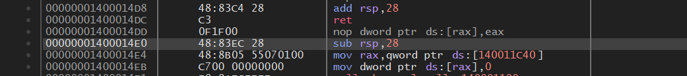

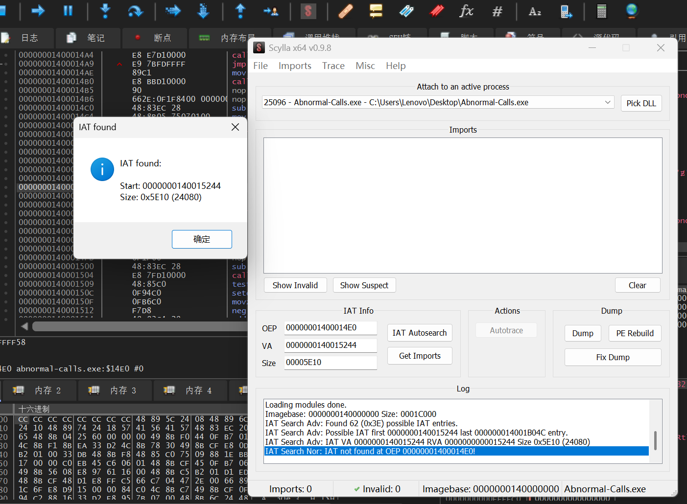

获取导入表，dump，再fixdump

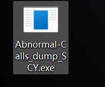

## 花指令去除

程序主函数：

```C++
int __fastcall main(int argc, const char **argv, const char **envp)
{
  const char *encrypted; // rax
  _QWORD input[7]; // [rsp+20h] [rbp-38h] BYREF

  _main(argc, argv, envp);
  printf(aPleaseInputFla);
  memset(input, 0, 48);
  scanf(aS, input);
  encrypted = (const char *)enc(input);
  if ( !j_strncmp(encrypted, &encflag, 0x30u) )
    printf(aRight);
  else
    printf(aWrong);
  return 0;
}
```

加密函数，假的

```C++
_BYTE *__fastcall enc(_BYTE *a1)
{
  _BYTE *result; // rax

  result = a1;
  do
    *result++ ^= 0x25u;
  while ( result != a1 + 48 );
  return result;
}
```

发现插入了花指令。

```C++
seg000:0000000140001EEC                 call    $+5
seg000:0000000140001EF1                 db      36h
seg000:0000000140001EF1                 add     [rsp+40h+var_40], 6
seg000:0000000140001EF6                 retn
```

nop掉。

得到一轮异或。

```C++
const char *__fastcall enc(_BYTE *input)
{
  _BYTE *v1; // rax

  v1 = input;
  do
    *v1++ ^= 0x25u;
  while ( v1 != input + 48 );
  aesEncrypt((unsigned int)key, 16, (_DWORD)input, (unsigned int)decrypted, 48);
  return (const char *)decrypted;
}
```

进入加密函数，发现什么也没有。

```C++
int __noreturn aesEncrypt(const uint8_t *key, uint32_t keyLen, uint8_t *pt, uint8_t *ct, uint32_t len)
{
  int result;
  return result;
}
```


去除花指令脚本：

```Python
import idc

startaddr=0x000000014000EDE0
endaddr=0x000000014000EF80

addr=startaddr

while startaddr<=addr<=endaddr:
    if idc.get_bytes(addr,14)==b"\xE8\x01\x00\x00\x00\xE9\x48\x83\x04\x24\x09\xC3\xE9\xF3":
        print(hex(addr),idc.get_bytes(addr,14))
        for i in range(14):
            idc.patch_byte(addr+i,0x90)
    elif idc.get_bytes(addr,11)==b"\xE8\x00\x00\x00\x00\x36\x83\x04\x24\x06\xC3":
        print(hex(addr),idc.get_bytes(addr,11))
        for i in range(11):
            idc.patch_byte(addr+i,0x90)
    addr+=1

startaddr=0x00000001400015D0
endaddr=0x0000000140001F23

addr=startaddr

while startaddr<=addr<=endaddr:
    if idc.get_bytes(addr,14)==b"\xE8\x01\x00\x00\x00\xE9\x48\x83\x04\x24\x09\xC3\xE9\xF3":
        print(hex(addr),idc.get_bytes(addr,14))
        for i in range(14):
            idc.patch_byte(addr+i,0x90)
    elif idc.get_bytes(addr,11)==b"\xE8\x00\x00\x00\x00\x36\x83\x04\x24\x06\xC3":
        print(hex(addr),idc.get_bytes(addr,11))
        for i in range(11):
            idc.patch_byte(addr+i,0x90)
    addr+=1


```

## 算法分析（魔改AES）

```C++
int aesEncrypt(const uint8_t *key, uint32_t keyLen, uint8_t *pt, uint8_t *ct, uint32_t len)
{
  uint8_t *v6; // rbp
  uint8_t *v8; // r12
  uint8_t *v9; // rax
  const uint8_t *v10; // rax
  _DWORD *v11; // r8
  __int64 v12; // rdx
  uint8_t *v13; // r13
  char *v14; // rsi
  __int64 v16; // rax
  __int64 v17; // rdx
  _QWORD v18[2]; // [rsp+20h] [rbp-1D8h] BYREF
  _QWORD v19[2]; // [rsp+30h] [rbp-1C8h] BYREF
  _BYTE v20[144]; // [rsp+40h] [rbp-1B8h] BYREF
  char v21; // [rsp+D0h] [rbp-128h] BYREF
  char v22[280]; // [rsp+E0h] [rbp-118h] BYREF

  v6 = pt;
  v8 = ct;
  if ( len )
  {
    v9 = pt;
    do
      *v9++ ^= 0x25u;
    while ( v9 != &pt[len] );//异或回来了
  }
  v18[0] = 0;
  v18[1] = 0;
  v19[0] = 0;
  v19[1] = 0;
  if ( pt == 0 || key == 0 || !ct || keyLen > 0x10 || (len & 0xF) != 0 )
    return -1;
  v10 = key;
  v11 = v18;
  if ( keyLen >= 8 )
  {
    LODWORD(v16) = 0;
    do
    {
      v17 = (unsigned int)v16;
      v16 = (unsigned int)(v16 + 8);
      *(_QWORD *)((char *)v18 + v17) = *(_QWORD *)&key[v17];
    }
    while ( (unsigned int)v16 < (keyLen & 0xFFFFFFF8) );
    v11 = (_DWORD *)((char *)v18 + v16);
    v10 = &key[v16];
  }
  v12 = 0;
  if ( (keyLen & 4) == 0 )
  {
    if ( (keyLen & 2) == 0 )
      goto LABEL_11;
LABEL_19:
    *(_WORD *)((char *)v11 + v12) = *(_WORD *)&v10[v12];
    v12 += 2;
    if ( (keyLen & 1) == 0 )
      goto LABEL_12;
    goto LABEL_18;
  }
  *v11 = *(_DWORD *)v10;
  v12 = 4;
  if ( (keyLen & 2) != 0 )
    goto LABEL_19;
LABEL_11:
  if ( (keyLen & 1) != 0 )
LABEL_18:
    *((_BYTE *)v11 + v12) = v10[v12];
LABEL_12:
  keyExpansion(v18, 16, v20);
  if ( len )
  {
    v13 = &v6[16 * ((len - 1) >> 4) + 16];
    do
    {
      loadStateArray(v19, v6);
      addRoundKey(v19, v20);
      v14 = v20;
      do
      {
        v14 += 16;
        shiftRows(v19);
        subBytes(v19);
        subBytes(v19);
        shiftRows(v19);
        mixColumns(v19);
        addRoundKey(v19, v14);
      }
      while ( v14 != &v21 );
      shiftRows(v19);
      subBytes(v19);
      subBytes(v19);
      shiftRows(v19);
      addRoundKey(v19, v22);
      storeStateArray(v19, v8);
      v8 += 16;
      v6 += 16;
    }
    while ( v13 != v6 );
  }
  return 0;
}
```

## 反调试去除

```C++
int sub_14000EDE0()
{
  uint8_t *i; // rax

  LODWORD(i) = IsDebuggerPresent();//把跳转nop掉
  if ( (_DWORD)i )
  {
    for ( i = &key - 47; i != &key; ++i )
    {
      if ( (int)(33 - (unsigned int)(&key - 47) + (_DWORD)i) > 63 )
        *i ^= 0x15u;
    }
  }
  return (int)i;
}


__int64 sub_14000EE30()
{
  __int64 (*v0)(void); // rbx
  __int64 *v1; // rax
  __int64 result; // rax
  __int64 i; // rax
  __int64 *v4; // rbx
  int v5; // edx

  v0 = (__int64 (*)(void))IsDebuggerPresent;
  if ( IsDebuggerPresent() )//改为jmp
  {
    v1 = qword_140010120;
    do
    {
      *(_DWORD *)v1 >>= 4;
      v1 = (__int64 *)((char *)v1 + 4);
    }
    while ( v1 != &qword_140010120[5] );
  }
  result = v0();
  if ( !(_DWORD)result )//改为总是执行，把跳转nop掉
  {
    for ( i = 0; i != 256; ++i )
      *((_BYTE *)qword_140010020 + i) = i;
    j_srand(0x40u);
    v4 = (__int64 *)&byte_14001011F;
    do
    {
      v5 = j_rand() % (int)(256 - (unsigned int)&byte_14001011F + (_DWORD)v4);
      result = *(unsigned __int8 *)v4;
      *(_BYTE *)v4 = *((_BYTE *)qword_140010020 + v5);
      *((_BYTE *)qword_140010020 + v5) = result;
      v4 = (__int64 *)((char *)v4 - 1);
    }
    while ( v4 != qword_140010020 );
  }
  return result;
}
```

去除反调试后，动态调试调出S盒。

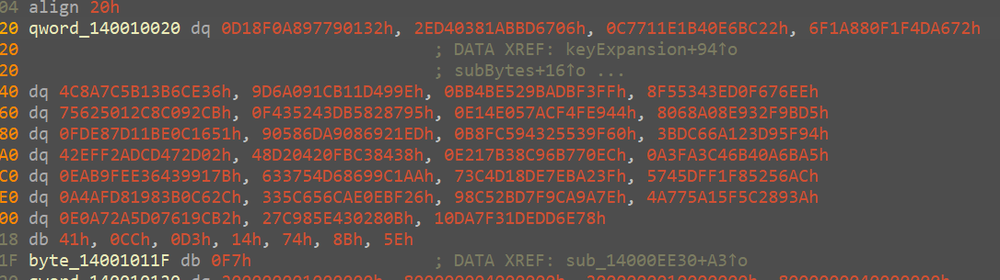

## 解密脚本

```C++
#include <stdint.h>
#include <stdio.h>
#include <string.h>
#include <stdlib.h>

typedef struct{
    uint32_t eK[44], dK[44];    *//* *encKey,* *decKey*
    int Nr; *//* *10* *rounds*
}AesKey;

#define BLOCKSIZE 16  *//AES-128分组长度为16字节*

* //* *uint8_t* *y[4]* *->* *uint32_t* *x*
#define LOAD32H(x, y) \
 do { (x) = ((uint32_t)((y)[0] & 0xff)<<24) | ((uint32_t)((y)[1] & 0xff)<<16) | \
 ((uint32_t)((y)[2] & 0xff)<<8)  | ((uint32_t)((y)[3] & 0xff));} while(0)

*//* *uint32_t* *x* *->* *uint8_t* *y[4]*
#define STORE32H(x, y) \
 do { (y)[0] = (uint8_t)(((x)>>24) & 0xff); (y)[1] = (uint8_t)(((x)>>16) & 0xff);   \
 (y)[2] = (uint8_t)(((x)>>8) & 0xff); (y)[3] = (uint8_t)((x) & 0xff); } while(0)

*//* *从uint32_t* *x中提取从低位开始的第n个字节*
#define BYTE(x, n) (((x) >> (8 * (n))) & 0xff)

*/** *used* *for* *keyExpansion* **/*
* //* *字节替换然后循环左移1位*
#define MIX(x) (((S[BYTE(x, 2)] << 24) & 0xff000000) ^ ((S[BYTE(x, 1)] << 16) & 0xff0000) ^ \
 ((S[BYTE(x, 0)] << 8) & 0xff00) ^ (S[BYTE(x, 3)] & 0xff))

*//* *uint32_t* *x循环左移n位*
#define ROF32(x, n)  (((x) << (n)) | ((x) >> (32-(n))))
*//* *uint32_t* *x循环右移n位*
#define ROR32(x, n)  (((x) >> (n)) | ((x) << (32-(n))))

*/** *for* *128-bit* *blocks,* *Rijndael* *never* *uses* *more* *than* *10* *rcon* *values* **/*
* //* *AES-128轮常量*
static const uint32_t rcon[10] = {
    0x01000000UL, 0x02000000UL, 0x04000000UL, 0x08000000UL, 0x10000000UL,
    0x20000000UL, 0x40000000UL, 0x80000000UL, 0x1B000000UL, 0x36000000UL
};
*//* *S盒*
unsigned char S[256] = {
0x32, 0x01, 0x79, 0x97, 0xA8, 0xF0, 0x18, 0x0D, 0x06, 0x67, 0xBD, 0xAB, 0x81, 0x03, 0xD4, 0x2E, 0x22, 0xBC, 0xE6, 0x40, 0x1B, 0x1E, 0x71, 0xC7, 0x72, 0xA6, 0x4D, 0x1F, 0x0F, 0x88, 0x1A, 0x6F, 0x36, 0xCE, 0xB6, 0x13, 0x5B, 0x7C, 0x8A, 0x4C, 0x9E, 0x49, 0x1D, 0xB1, 0x1C, 0x09, 0x6A, 0x9D, 0xFF, 0xF3, 0xDB, 0xBA, 0x29, 0xE5, 0x4B, 0xBB, 0xEE, 0x76, 0xF6, 0xD0, 0x3E, 0x34, 0x55, 0x8F, 0xCB, 0x92, 0xC0, 0xC8, 0x12, 0x50, 0x62, 0x75, 0x95, 0x87, 0x82, 0xB5, 0x3D, 0x24, 0x35, 0xF4, 0x44, 0xE9, 0x4F, 0xCF, 0x7A, 0x05, 0x4E, 0xE1, 0xD5, 0x9B, 0x2F, 0x93, 0x8E, 0xA0, 0x68, 0x80, 0x51, 0x16, 0x0C, 0xBE, 0x11, 0x7D, 0xE8, 0xFD, 0xED, 0x21, 0x69, 0x08, 0xA9, 0x6D, 0x58, 0x90, 0x60, 0x9F, 0x53, 0x25, 0x43, 0x59, 0xFC, 0xB8, 0x94, 0x5F, 0xD9, 0x23, 0xA1, 0x66, 0xDC, 0x3B, 0x02, 0x2D, 0x47, 0xCD, 0xAD, 0xF2, 0xEF, 0x42, 0x38, 0x84, 0xC3, 0xFB, 0x20, 0x04, 0xD2, 0x48, 0xEC, 0x70, 0xB7, 0x96, 0x8C, 0xB3, 0x17, 0xE2, 0xA5, 0x6B, 0x0A, 0xB4, 0x46, 0x3C, 0xFA, 0xA3, 0x7B, 0x91, 0x39, 0x64, 0xE3, 0xFE, 0xB9, 0xEA, 0xAA, 0xC1, 0x99, 0x86, 0xD6, 0x54, 0x37, 0x63, 0x3F, 0xA2, 0xEB, 0xE7, 0x8D, 0xD1, 0xC4, 0x73, 0xAC, 0x56, 0x52, 0xF8, 0xF1, 0xDF, 0x45, 0x57, 0x2C, 0xC6, 0xB0, 0x83, 0x19, 0xD8, 0xAF, 0xA4, 0x26, 0xBF, 0x0E, 0xAE, 0x6C, 0x65, 0x5C, 0x33, 0x7E, 0x9A, 0xCA, 0xF9, 0xD7, 0x2B, 0xC5, 0x98, 0x3A, 0x89, 0xC2, 0xF5, 0x15, 0x5A, 0x77, 0x4A, 0xB2, 0x9C, 0x61, 0x07, 0x5D, 0x2A, 0xA7, 0xE0, 0x0B, 0x28, 0x30, 0xE4, 0x85, 0xC9, 0x27, 0x00, 0x78, 0x6E, 0xDD, 0xDE, 0x31, 0x7F, 0xDA, 0x10, 0x41, 0xCC, 0xD3, 0x14, 0x74, 0x8B, 0x5E, 0xF7
};

*//逆S盒*
unsigned char inv_S[256] = {};


void initinvSbox(){
    for(int i=0;i<256;i++){
        inv_S[S[i]]=i;
    }
 }


*/** *copy* *in[16]* *to* *state[4][4]* **/*
int loadStateArray(uint8_t (*state)[4], const uint8_t *in) {
    for (int i = 0; i < 4; ++i) {
        for (int j = 0; j < 4; ++j) {
            state[j][i] = *in++;
        }
    }
    return 0;
 }

*/** *copy* *state[4][4]* *to* *out[16]* **/*
int storeStateArray(uint8_t (*state)[4], uint8_t *out) {
    for (int i = 0; i < 4; ++i) {
        for (int j = 0; j < 4; ++j) {
            *out++ = state[j][i];
        }
    }
    return 0;
 }
*//秘钥扩展*
int keyExpansion(const uint8_t *key, uint32_t keyLen, AesKey *aesKey) {
    
     if (NULL == key || NULL == aesKey){
        *//printf("keyExpansion* *param* *is* *NULL\n");*
        return -1;
    }
    
     if (keyLen != 16){
        *//printf("keyExpansion* *keyLen* *=* *%d,* *Not* *support.\n",* *keyLen);*
        return -1;
    }
    
     uint32_t *w = aesKey->eK;  *//加密秘钥*
    uint32_t *v = aesKey->dK;  *//解密秘钥*
    
     */** *keyLen* *is* *16* *Bytes,* *generate* *uint32_t* *W[44].* **/*
    
     */** *W[0-3]* **/*
    for (int i = 0; i < 4; ++i) {
        LOAD32H(w[i], key + 4*i);
    }
    
     */** *W[4-43]* **/*
    for (int i = 0; i < 10; ++i) {
        w[4] = w[0] ^ MIX(w[3]) ^ rcon[i];
        w[5] = w[1] ^ w[4];
        w[6] = w[2] ^ w[5];
        w[7] = w[3] ^ w[6];
        w += 4;
    }
    
     w = aesKey->eK+44 - 4;
    *//解密秘钥矩阵为加密秘钥矩阵的倒序，方便使用，把ek的11个矩阵倒序排列分配给dk作为解密秘钥*
    *//即dk[0-3]=ek[41-44],* *dk[4-7]=ek[37-40]...* *dk[41-44]=ek[0-3]*
    for (int j = 0; j < 11; ++j) {
        
         for (int i = 0; i < 4; ++i) {
            v[i] = w[i];
        }
        w -= 4;
        v += 4;
    }
    
     return 0;
 }

*//* *轮秘钥加*
int addRoundKey(uint8_t (*state)[4], const uint32_t *key) {
    uint8_t k[4][4];
    
     */** *i:* *row,* *j:* *col* **/*
    for (int i = 0; i < 4; ++i) {
        for (int j = 0; j < 4; ++j) {
            k[i][j] = (uint8_t) BYTE(key[j], 3 - i);  */** *把* *uint32* *key[4]* *先转换为矩阵* *uint8* *k[4][4]* **/*
            state[i][j] ^= k[i][j];
        }
    }
    
     return 0;
 }


*//逆字节替换*
int invSubBytes(uint8_t (*state)[4]) {
    */** *i:* *row,* *j:* *col* **/*
    for (int i = 0; i < 4; ++i) {
        for (int j = 0; j < 4; ++j) {
            state[i][j] = inv_S[state[i][j]];
        }
    }
    return 0;
 }


*//逆行移位*
int invShiftRows(uint8_t (*state)[4]) {
    uint32_t block[4] = {0};
    
     */** *i:* *row* **/*
    for (int i = 0; i < 4; ++i) {
        LOAD32H(block[i], state[i]);
        block[i] = ROR32(block[i], 8*i);
        STORE32H(block[i], state[i]);
    }
    
     return 0;
 }

*/** *Galois* *Field* *(256)* *Multiplication* *of* *two* *Bytes* **/*
* //* *两字节的伽罗华域乘法运算*
uint8_t GMul(uint8_t u, uint8_t v) {
    uint8_t p = 0;
    
     for (int i = 0; i < 8; ++i) {
        if (u & 0x01) {    *//*
            p ^= v;
        }
        
         int flag = (v & 0x80);
        v <<= 1;
        if (flag) {
            v ^= 0x1B; */** *x^8* *+* *x^4* *+* *x^3* *+* *x* *+* *1* **/*
        }
        
         u >>= 1;
    }
    
     return p;
 }


*//* *逆列混合*
int invMixColumns(uint8_t (*state)[4]) {
    uint8_t tmp[4][4];
    uint8_t M[4][4] = {{0x0E, 0x0B, 0x0D, 0x09},
        {0x09, 0x0E, 0x0B, 0x0D},
        {0x0D, 0x09, 0x0E, 0x0B},
        {0x0B, 0x0D, 0x09, 0x0E}};  *//使用列混合矩阵的逆矩阵*
    
     */** *copy* *state[4][4]* *to* *tmp[4][4]* **/*
    for (int i = 0; i < 4; ++i) {
        for (int j = 0; j < 4; ++j){
            tmp[i][j] = state[i][j];
        }
    }
    
     for (int i = 0; i < 4; ++i) {
        for (int j = 0; j < 4; ++j) {
            state[i][j] = GMul(M[i][0], tmp[0][j]) ^ GMul(M[i][1], tmp[1][j])
            ^ GMul(M[i][2], tmp[2][j]) ^ GMul(M[i][3], tmp[3][j]);
        }
    }
    
     return 0;
 }


*//* *AES128解密，* *参数要求同加密*
int aesDecrypt(const uint8_t *key, uint32_t keyLen, const uint8_t *ct, uint8_t *pt, uint32_t len) {
    AesKey aesKey;
    uint8_t *pos = pt;
    const uint32_t *rk = aesKey.dK;  *//解密秘钥指针*
    uint8_t out[BLOCKSIZE] = {0};
    uint8_t actualKey[16] = {0};
    uint8_t state[4][4] = {0};
    
     if (NULL == key || NULL == ct || NULL == pt){
        *//printf("param* *err.\n");*
        return -1;
    }
    
     if (keyLen > 16){
        *//printf("keyLen* *must* *be* *16.\n");*
        return -1;
    }
    
     if (len % BLOCKSIZE){
        *//printf("inLen* *is* *invalid.\n");*
        return -1;
    }
    
     memcpy(actualKey, key, keyLen);
    keyExpansion(actualKey, 16, &aesKey);  *//秘钥扩展，同加密*
    
     for (int i = 0; i < len; i += BLOCKSIZE) {
        *//* *把16字节的密文转换为4x4状态矩阵来进行处理*
        loadStateArray(state, ct);
        *//* *轮秘钥加，同加密*
        addRoundKey(state, rk);
        
         for (int j = 1; j < 10; ++j) {
            rk += 4;
            invShiftRows(state);    *//* *逆行移位*
            invSubBytes(state);     *//* *逆字节替换，这两步顺序可以颠倒*
            invSubBytes(state);   *//* *逆字节替换*
            invShiftRows(state);  *//* *逆行移位*
            addRoundKey(state, rk); *//* *轮秘钥加，同加密*
            invMixColumns(state);   *//* *逆列混合*
            
         }
        
         invSubBytes(state);   *//* *逆字节替换*
        invSubBytes(state);   *//* *逆字节替换*
        invShiftRows(state);  *//* *逆行移位*
        invShiftRows(state);  *//* *逆行移位*
        *//* *此处没有逆列混合*
        addRoundKey(state, rk+4);  *//* *轮秘钥加，同加密*
        storeStateArray(state, pos);  *//* *保存明文数据*
        pos += BLOCKSIZE;  *//* *输出数据内存指针移位分组长度*
        ct += BLOCKSIZE;   *//* *输入数据内存指针移位分组长度*
        rk = aesKey.dK;    *//* *恢复rk指针到秘钥初始位置*
    }
    return 0;
 }

void printHex(uint8_t *ptr, int len, char *tag) {
    printf("%s\ndata[%d]: ", tag, len);
    for (int i = 0; i < len; ++i) {
        printf("0x%.2X, ", *ptr++);
    }
    printf("\n");
 }

int main() {
    initinvSbox();
    *//* *case* *1*
    uint8_t key[16] = {0x2b, 0x7e, 0x15, 0x16, 0x28, 0xae, 0xd2, 0xa6, 0xab, 0xf7, 0x15, 0x88, 0x09, 0xcf, 0x4f, 0x3c};

    uint8_t plain[48] = {0};  *//* *外部申请输出数据内存，用于解密后的数据*
    uint8_t cipher[48]={
        0xCF, 0xAC, 0xC1, 0x13, 0x9B, 0x95, 0xE6, 0x76, 0x33, 0x1F, 0xA6, 0x04, 0xEC, 0xF4, 0xFE, 0x0B, 0x15, 0xA2, 0x3A, 0x25, 0x4D, 0x24, 0x29, 0xB0, 0x89, 0xFD, 0x24, 0x0F, 0xFF, 0xC9, 0xA3, 0x23, 0x2C, 0x55, 0xD8, 0x23, 0xA3, 0xDA, 0xB4, 0xCC, 0x27, 0xFC, 0xA0, 0x35, 0xBD, 0x34, 0x3E, 0x54
    };

    aesDecrypt(key, 16, cipher, plain, 48);       *//* *解密*
    printHex(plain, 48, "after decryption:"); *//* *打印解密后的明文数据*
    printf("output plain text\n");
    
     for (int i = 0; i < 48; ++i) {
        printf("%c", plain[i]);
    }
    
     return 0;
 }
```

flag\{aca099ce\-b21a\-4ad1\-86a8\-0ffef34c88e0\}

## 题目源码

```C++
#include <stdint.h>
#include <stdio.h>
#include <string.h>
#include <debugapi.h>
#include <stdlib.h>

typedef struct{
    uint32_t eK[44], dK[44];    *//* *encKey,* *decKey*
    int Nr; *//* *10* *rounds*
}AesKey;

#define BLOCKSIZE 16  *//AES-128分组长度为16字节*

* //* *uint8_t* *y[4]* *->* *uint32_t* *x*
#define LOAD32H(x, y) \
 do { (x) = ((uint32_t)((y)[0] & 0xff)<<24) | ((uint32_t)((y)[1] & 0xff)<<16) | \
 ((uint32_t)((y)[2] & 0xff)<<8)  | ((uint32_t)((y)[3] & 0xff));} while(0)

*//* *uint32_t* *x* *->* *uint8_t* *y[4]*
#define STORE32H(x, y) \
 do { (y)[0] = (uint8_t)(((x)>>24) & 0xff); (y)[1] = (uint8_t)(((x)>>16) & 0xff);   \
 (y)[2] = (uint8_t)(((x)>>8) & 0xff); (y)[3] = (uint8_t)((x) & 0xff); } while(0)

*//* *从uint32_t* *x中提取从低位开始的第n个字节*
#define BYTE(x, n) (((x) >> (8 * (n))) & 0xff)

*/** *used* *for* *keyExpansion* **/*
* //* *字节替换然后循环左移1位*
#define MIX(x) (((S[BYTE(x, 2)] << 24) & 0xff000000) ^ ((S[BYTE(x, 1)] << 16) & 0xff0000) ^ \
 ((S[BYTE(x, 0)] << 8) & 0xff00) ^ (S[BYTE(x, 3)] & 0xff))

*//* *uint32_t* *x循环左移n位*
#define ROF32(x, n)  (((x) << (n)) | ((x) >> (32-(n))))
*//* *uint32_t* *x循环右移n位*
#define ROR32(x, n)  (((x) >> (n)) | ((x) << (32-(n))))


uint8_t key[16] = {0x2b, 0x7e, 0x15, 0x16, 0x28, 0xae, 0xd2, 0xa6, 0xab, 0xf7, 0x15, 0x88, 0x09, 0xcf, 0x4f, 0x3c};
uint8_t cipher[48]={0xCF, 0xAC, 0xC1, 0x13, 0x9B, 0x95, 0xE6, 0x76, 0x33, 0x1F, 0xA6, 0x04, 0xEC, 0xF4, 0xFE, 0x0B, 0x15, 0xA2, 0x3A, 0x25, 0x4D, 0x24, 0x29, 0xB0, 0x89, 0xFD, 0x24, 0x0F, 0xFF, 0xC9, 0xA3, 0x23, 0x2C, 0x55, 0xD8, 0x23, 0xA3, 0xDA, 0xB4, 0xCC, 0x27, 0xFC, 0xA0, 0x35, 0xBD, 0x34, 0x3E, 0x54};
uint8_t rubbish[32]={
    0x48, 0xb2, 0xf8 ,0xc8 ,0x41 ,0x65 ,0xa7 ,0x3e ,0x8a ,0xc1 ,0xa3 ,0xcb ,0x95 ,0x6d ,0x1d, 0xb3, 0xf0, 0xc9, 0x2c, 0xeb, 0x6f, 0x7e, 0xee, 0xad, 0x7d, 0x60, 0xd6, 0xb1, 0x51, 0x34, 0xaa, 0xa0,
 };

*/** *for* *128-bit* *blocks,* *Rijndael* *never* *uses* *more* *than* *10* *rcon* *values* **/*
* //* *AES-128轮常量*
uint32_t rcon[10] = {
    0x01000000UL, 0x02000000UL, 0x04000000UL, 0x08000000UL, 0x10000000UL,
    0x20000000UL, 0x40000000UL, 0x80000000UL, 0x1B000000UL, 0x36000000UL
};

unsigned char S[256] = {
    0x63, 0x7C, 0x77, 0x7B, 0xF2, 0x6B, 0x6F, 0xC5, 0x30, 0x01, 0x67, 0x2B, 0xFE, 0xD7, 0xAB, 0x76,
    0xCA, 0x82, 0xC9, 0x7D, 0xFA, 0x59, 0x47, 0xF0, 0xAD, 0xD4, 0xA2, 0xAF, 0x9C, 0xA4, 0x72, 0xC0,
    0xB7, 0xFD, 0x93, 0x26, 0x36, 0x3F, 0xF7, 0xCC, 0x34, 0xA5, 0xE5, 0xF1, 0x71, 0xD8, 0x31, 0x15,
    0x04, 0xC7, 0x23, 0xC3, 0x18, 0x96, 0x05, 0x9A, 0x07, 0x12, 0x80, 0xE2, 0xEB, 0x27, 0xB2, 0x75,
    0x09, 0x83, 0x2C, 0x1A, 0x1B, 0x6E, 0x5A, 0xA0, 0x52, 0x3B, 0xD6, 0xB3, 0x29, 0xE3, 0x2F, 0x84,
    0x53, 0xD1, 0x00, 0xED, 0x20, 0xFC, 0xB1, 0x5B, 0x6A, 0xCB, 0xBE, 0x39, 0x4A, 0x4C, 0x58, 0xCF,
    0xD0, 0xEF, 0xAA, 0xFB, 0x43, 0x4D, 0x33, 0x85, 0x45, 0xF9, 0x02, 0x7F, 0x50, 0x3C, 0x9F, 0xA8,
    0x51, 0xA3, 0x40, 0x8F, 0x92, 0x9D, 0x38, 0xF5, 0xBC, 0xB6, 0xDA, 0x21, 0x10, 0xFF, 0xF3, 0xD2,
    0xCD, 0x0C, 0x13, 0xEC, 0x5F, 0x97, 0x44, 0x17, 0xC4, 0xA7, 0x7E, 0x3D, 0x64, 0x5D, 0x19, 0x73,
    0x60, 0x81, 0x4F, 0xDC, 0x22, 0x2A, 0x90, 0x88, 0x46, 0xEE, 0xB8, 0x14, 0xDE, 0x5E, 0x0B, 0xDB,
    0xE0, 0x32, 0x3A, 0x0A, 0x49, 0x06, 0x24, 0x5C, 0xC2, 0xD3, 0xAC, 0x62, 0x91, 0x95, 0xE4, 0x79,
    0xE7, 0xC8, 0x37, 0x6D, 0x8D, 0xD5, 0x4E, 0xA9, 0x6C, 0x56, 0xF4, 0xEA, 0x65, 0x7A, 0xAE, 0x08,
    0xBA, 0x78, 0x25, 0x2E, 0x1C, 0xA6, 0xB4, 0xC6, 0xE8, 0xDD, 0x74, 0x1F, 0x4B, 0xBD, 0x8B, 0x8A,
    0x70, 0x3E, 0xB5, 0x66, 0x48, 0x03, 0xF6, 0x0E, 0x61, 0x35, 0x57, 0xB9, 0x86, 0xC1, 0x1D, 0x9E,
    0xE1, 0xF8, 0x98, 0x11, 0x69, 0xD9, 0x8E, 0x94, 0x9B, 0x1E, 0x87, 0xE9, 0xCE, 0x55, 0x28, 0xDF,
    0x8C, 0xA1, 0x89, 0x0D, 0xBF, 0xE6, 0x42, 0x68, 0x41, 0x99, 0x2D, 0x0F, 0xB0, 0x54, 0xBB, 0x16
};


__attribute__((constructor(102))) void init_2(){
    
     asm (
         "call .+5\n"
         ".byte 0x36\n"
         ".byte 0x83\n"
         ".byte 0x04\n"
         ".byte 0x24\n"
         ".byte 0x06\n"
         "ret\n"
         );
    if(IsDebuggerPresent()){
        for(int i=32;i<80;i++){
            if(i>=64){
                rubbish[i]^=0x15u;
            }
        }
    }
 }

__attribute__((constructor(101))) void init_1(){
    

     if(IsDebuggerPresent()){
        for(int i=0;i<10;i++){
            rcon[i]=rcon[i]>>4;
        }
    }
    asm (
         "call .+5\n"
         ".byte 0x36\n"
         ".byte 0x83\n"
         ".byte 0x04\n"
         ".byte 0x24\n"
         ".byte 0x06\n"
         "ret\n"
         );
    if(!IsDebuggerPresent()){
        asm (
             ".byte 0xE8\n"
             ".byte 0x01\n"
             ".byte 0x00\n"
             ".byte 0x00\n"
             ".byte 0x00\n"
             
              ".byte 0xE9\n"
             
              ".byte 0x48\n"
             ".byte 0x83\n"
             ".byte 0x04\n"
             ".byte 0x24\n"
             ".byte 0x09\n"
             
              ".byte 0xC3\n"
             ".byte 0xE9\n"
             ".byte 0xF3\n"
             );
        for(int i=0;i<256;i++){
            asm (
                 ".byte 0xE8\n"
                 ".byte 0x01\n"
                 ".byte 0x00\n"
                 ".byte 0x00\n"
                 ".byte 0x00\n"
                 
                  ".byte 0xE9\n"
                 
                  ".byte 0x48\n"
                 ".byte 0x83\n"
                 ".byte 0x04\n"
                 ".byte 0x24\n"
                 ".byte 0x09\n"
                 
                  ".byte 0xC3\n"
                 ".byte 0xE9\n"
                 ".byte 0xF3\n"
                 );
            S[i]=i;
        }
        asm (
             ".byte 0xE8\n"
             ".byte 0x01\n"
             ".byte 0x00\n"
             ".byte 0x00\n"
             ".byte 0x00\n"
             
              ".byte 0xE9\n"
             
              ".byte 0x48\n"
             ".byte 0x83\n"
             ".byte 0x04\n"
             ".byte 0x24\n"
             ".byte 0x09\n"
             
              ".byte 0xC3\n"
             ".byte 0xE9\n"
             ".byte 0xF3\n"
             );
        srand(0x40u);
        asm (
             ".byte 0xE8\n"
             ".byte 0x01\n"
             ".byte 0x00\n"
             ".byte 0x00\n"
             ".byte 0x00\n"
             
              ".byte 0xE9\n"
             
              ".byte 0x48\n"
             ".byte 0x83\n"
             ".byte 0x04\n"
             ".byte 0x24\n"
             ".byte 0x09\n"
             
              ".byte 0xC3\n"
             ".byte 0xE9\n"
             ".byte 0xF3\n"
             );
        for (int i = 255; i > 0; i--) {
            asm (
                 ".byte 0xE8\n"
                 ".byte 0x01\n"
                 ".byte 0x00\n"
                 ".byte 0x00\n"
                 ".byte 0x00\n"
                 
                  ".byte 0xE9\n"
                 
                  ".byte 0x48\n"
                 ".byte 0x83\n"
                 ".byte 0x04\n"
                 ".byte 0x24\n"
                 ".byte 0x09\n"
                 
                  ".byte 0xC3\n"
                 ".byte 0xE9\n"
                 ".byte 0xF3\n"
                 );
            int j = rand() % (i + 1);
            asm (
                 ".byte 0xE8\n"
                 ".byte 0x01\n"
                 ".byte 0x00\n"
                 ".byte 0x00\n"
                 ".byte 0x00\n"
                 
                  ".byte 0xE9\n"
                 
                  ".byte 0x48\n"
                 ".byte 0x83\n"
                 ".byte 0x04\n"
                 ".byte 0x24\n"
                 ".byte 0x09\n"
                 
                  ".byte 0xC3\n"
                 ".byte 0xE9\n"
                 ".byte 0xF3\n"
                 );
            uint8_t temp = S[i];
            asm (
                 ".byte 0xE8\n"
                 ".byte 0x01\n"
                 ".byte 0x00\n"
                 ".byte 0x00\n"
                 ".byte 0x00\n"
                 
                  ".byte 0xE9\n"
                 
                  ".byte 0x48\n"
                 ".byte 0x83\n"
                 ".byte 0x04\n"
                 ".byte 0x24\n"
                 ".byte 0x09\n"
                 
                  ".byte 0xC3\n"
                 ".byte 0xE9\n"
                 ".byte 0xF3\n"
                 );
            S[i] = S[j];
            asm (
                 ".byte 0xE8\n"
                 ".byte 0x01\n"
                 ".byte 0x00\n"
                 ".byte 0x00\n"
                 ".byte 0x00\n"
                 
                  ".byte 0xE9\n"
                 
                  ".byte 0x48\n"
                 ".byte 0x83\n"
                 ".byte 0x04\n"
                 ".byte 0x24\n"
                 ".byte 0x09\n"
                 
                  ".byte 0xC3\n"
                 ".byte 0xE9\n"
                 ".byte 0xF3\n"
                 );
            S[j] = temp;
            asm (
                 ".byte 0xE8\n"
                 ".byte 0x01\n"
                 ".byte 0x00\n"
                 ".byte 0x00\n"
                 ".byte 0x00\n"
                 
                  ".byte 0xE9\n"
                 
                  ".byte 0x48\n"
                 ".byte 0x83\n"
                 ".byte 0x04\n"
                 ".byte 0x24\n"
                 ".byte 0x09\n"
                 
                  ".byte 0xC3\n"
                 ".byte 0xE9\n"
                 ".byte 0xF3\n"
                 );
        }
        asm (
             ".byte 0xE8\n"
             ".byte 0x01\n"
             ".byte 0x00\n"
             ".byte 0x00\n"
             ".byte 0x00\n"
             
              ".byte 0xE9\n"
             
              ".byte 0x48\n"
             ".byte 0x83\n"
             ".byte 0x04\n"
             ".byte 0x24\n"
             ".byte 0x09\n"
             
              ".byte 0xC3\n"
             ".byte 0xE9\n"
             ".byte 0xF3\n"
             );
    }
    asm (
         ".byte 0xE8\n"
         ".byte 0x01\n"
         ".byte 0x00\n"
         ".byte 0x00\n"
         ".byte 0x00\n"
         
          ".byte 0xE9\n"
         
          ".byte 0x48\n"
         ".byte 0x83\n"
         ".byte 0x04\n"
         ".byte 0x24\n"
         ".byte 0x09\n"
         
          ".byte 0xC3\n"
         ".byte 0xE9\n"
         ".byte 0xF3\n"
         );
 }


*/** *copy* *in[16]* *to* *state[4][4]* **/*
int loadStateArray(uint8_t (*state)[4], const uint8_t *in) {
    asm (
         ".byte 0xE8\n"
         ".byte 0x01\n"
         ".byte 0x00\n"
         ".byte 0x00\n"
         ".byte 0x00\n"
         
          ".byte 0xE9\n"
         
          ".byte 0x48\n"
         ".byte 0x83\n"
         ".byte 0x04\n"
         ".byte 0x24\n"
         ".byte 0x09\n"
         
          ".byte 0xC3\n"
         ".byte 0xE9\n"
         ".byte 0xF3\n"
         );
    for (int i = 0; i < 4; ++i) {
        asm (
             ".byte 0xE8\n"
             ".byte 0x01\n"
             ".byte 0x00\n"
             ".byte 0x00\n"
             ".byte 0x00\n"
             
              ".byte 0xE9\n"
             
              ".byte 0x48\n"
             ".byte 0x83\n"
             ".byte 0x04\n"
             ".byte 0x24\n"
             ".byte 0x09\n"
             
              ".byte 0xC3\n"
             ".byte 0xE9\n"
             ".byte 0xF3\n"
             );
        for (int j = 0; j < 4; ++j) {
            state[j][i] = *in++;
        }
    }
    return 0;
 }

*/** *copy* *state[4][4]* *to* *out[16]* **/*
int storeStateArray(uint8_t (*state)[4], uint8_t *out) {
    for (int i = 0; i < 4; ++i) {
        asm (
             ".byte 0xE8\n"
             ".byte 0x01\n"
             ".byte 0x00\n"
             ".byte 0x00\n"
             ".byte 0x00\n"
             
              ".byte 0xE9\n"
             
              ".byte 0x48\n"
             ".byte 0x83\n"
             ".byte 0x04\n"
             ".byte 0x24\n"
             ".byte 0x09\n"
             
              ".byte 0xC3\n"
             ".byte 0xE9\n"
             ".byte 0xF3\n"
             );
        for (int j = 0; j < 4; ++j) {
            asm (
                 ".byte 0xE8\n"
                 ".byte 0x01\n"
                 ".byte 0x00\n"
                 ".byte 0x00\n"
                 ".byte 0x00\n"
                 
                  ".byte 0xE9\n"
                 
                  ".byte 0x48\n"
                 ".byte 0x83\n"
                 ".byte 0x04\n"
                 ".byte 0x24\n"
                 ".byte 0x09\n"
                 
                  ".byte 0xC3\n"
                 ".byte 0xE9\n"
                 ".byte 0xF3\n"
                 );
            *out++ = state[j][i];
        }
    }
    return 0;
 }
*//秘钥扩展*
int keyExpansion(const uint8_t *key, uint32_t keyLen, AesKey *aesKey) {
    
     if (NULL == key || NULL == aesKey){
        *//printf("keyExpansion* *param* *is* *NULL\n");*
        return -1;
    }
    asm (
         ".byte 0xE8\n"
         ".byte 0x01\n"
         ".byte 0x00\n"
         ".byte 0x00\n"
         ".byte 0x00\n"
         
          ".byte 0xE9\n"
         
          ".byte 0x48\n"
         ".byte 0x83\n"
         ".byte 0x04\n"
         ".byte 0x24\n"
         ".byte 0x09\n"
         
          ".byte 0xC3\n"
         ".byte 0xE9\n"
         ".byte 0xF3\n"
         );
    if (keyLen != 16){
        *//printf("keyExpansion* *keyLen* *=* *%d,* *Not* *support.\n",* *keyLen);*
        return -1;
    }
    
     uint32_t *w = aesKey->eK;  *//加密秘钥*
    asm (
         ".byte 0xE8\n"
         ".byte 0x01\n"
         ".byte 0x00\n"
         ".byte 0x00\n"
         ".byte 0x00\n"
         
          ".byte 0xE9\n"
         
          ".byte 0x48\n"
         ".byte 0x83\n"
         ".byte 0x04\n"
         ".byte 0x24\n"
         ".byte 0x09\n"
         
          ".byte 0xC3\n"
         ".byte 0xE9\n"
         ".byte 0xF3\n"
         );
    uint32_t *v = aesKey->dK;  *//解密秘钥*
    asm (
         ".byte 0xE8\n"
         ".byte 0x01\n"
         ".byte 0x00\n"
         ".byte 0x00\n"
         ".byte 0x00\n"
         
          ".byte 0xE9\n"
         
          ".byte 0x48\n"
         ".byte 0x83\n"
         ".byte 0x04\n"
         ".byte 0x24\n"
         ".byte 0x09\n"
         
          ".byte 0xC3\n"
         ".byte 0xE9\n"
         ".byte 0xF3\n"
         );
    */** *keyLen* *is* *16* *Bytes,* *generate* *uint32_t* *W[44].* **/*
    
     */** *W[0-3]* **/*
    for (int i = 0; i < 4; ++i) {
        LOAD32H(w[i], key + 4*i);
    }
    
     */** *W[4-43]* **/*
    for (int i = 0; i < 10; ++i) {
        w[4] = w[0] ^ MIX(w[3]) ^ rcon[i];
        asm (
             ".byte 0xE8\n"
             ".byte 0x01\n"
             ".byte 0x00\n"
             ".byte 0x00\n"
             ".byte 0x00\n"
             
              ".byte 0xE9\n"
             
              ".byte 0x48\n"
             ".byte 0x83\n"
             ".byte 0x04\n"
             ".byte 0x24\n"
             ".byte 0x09\n"
             
              ".byte 0xC3\n"
             ".byte 0xE9\n"
             ".byte 0xF3\n"
             );
        w[5] = w[1] ^ w[4];
        asm (
             ".byte 0xE8\n"
             ".byte 0x01\n"
             ".byte 0x00\n"
             ".byte 0x00\n"
             ".byte 0x00\n"
             
              ".byte 0xE9\n"
             
              ".byte 0x48\n"
             ".byte 0x83\n"
             ".byte 0x04\n"
             ".byte 0x24\n"
             ".byte 0x09\n"
             
              ".byte 0xC3\n"
             ".byte 0xE9\n"
             ".byte 0xF3\n"
             );
        w[6] = w[2] ^ w[5];
        asm (
             ".byte 0xE8\n"
             ".byte 0x01\n"
             ".byte 0x00\n"
             ".byte 0x00\n"
             ".byte 0x00\n"
             
              ".byte 0xE9\n"
             
              ".byte 0x48\n"
             ".byte 0x83\n"
             ".byte 0x04\n"
             ".byte 0x24\n"
             ".byte 0x09\n"
             
              ".byte 0xC3\n"
             ".byte 0xE9\n"
             ".byte 0xF3\n"
             );
        w[7] = w[3] ^ w[6];
        w += 4;
    }
    asm (
         ".byte 0xE8\n"
         ".byte 0x01\n"
         ".byte 0x00\n"
         ".byte 0x00\n"
         ".byte 0x00\n"
         
          ".byte 0xE9\n"
         
          ".byte 0x48\n"
         ".byte 0x83\n"
         ".byte 0x04\n"
         ".byte 0x24\n"
         ".byte 0x09\n"
         
          ".byte 0xC3\n"
         ".byte 0xE9\n"
         ".byte 0xF3\n"
         );
    w = aesKey->eK+44 - 4;
    *//解密秘钥矩阵为加密秘钥矩阵的倒序，方便使用，把ek的11个矩阵倒序排列分配给dk作为解密秘钥*
    *//即dk[0-3]=ek[41-44],* *dk[4-7]=ek[37-40]...* *dk[41-44]=ek[0-3]*
    for (int j = 0; j < 11; ++j) {
        asm (
             ".byte 0xE8\n"
             ".byte 0x01\n"
             ".byte 0x00\n"
             ".byte 0x00\n"
             ".byte 0x00\n"
             
              ".byte 0xE9\n"
             
              ".byte 0x48\n"
             ".byte 0x83\n"
             ".byte 0x04\n"
             ".byte 0x24\n"
             ".byte 0x09\n"
             
              ".byte 0xC3\n"
             ".byte 0xE9\n"
             ".byte 0xF3\n"
             );
        for (int i = 0; i < 4; ++i) {
            v[i] = w[i];
        }
        w -= 4;
        v += 4;
    }
    asm (
         ".byte 0xE8\n"
         ".byte 0x01\n"
         ".byte 0x00\n"
         ".byte 0x00\n"
         ".byte 0x00\n"
         
          ".byte 0xE9\n"
         
          ".byte 0x48\n"
         ".byte 0x83\n"
         ".byte 0x04\n"
         ".byte 0x24\n"
         ".byte 0x09\n"
         
          ".byte 0xC3\n"
         ".byte 0xE9\n"
         ".byte 0xF3\n"
         );
    return 0;
 }

*//* *轮秘钥加*
int addRoundKey(uint8_t (*state)[4], const uint32_t *key) {
    uint8_t k[4][4];
    asm (
         ".byte 0xE8\n"
         ".byte 0x01\n"
         ".byte 0x00\n"
         ".byte 0x00\n"
         ".byte 0x00\n"
         
          ".byte 0xE9\n"
         
          ".byte 0x48\n"
         ".byte 0x83\n"
         ".byte 0x04\n"
         ".byte 0x24\n"
         ".byte 0x09\n"
         
          ".byte 0xC3\n"
         ".byte 0xE9\n"
         ".byte 0xF3\n"
         );
    */** *i:* *row,* *j:* *col* **/*
    for (int i = 0; i < 4; ++i) {
        asm (
             ".byte 0xE8\n"
             ".byte 0x01\n"
             ".byte 0x00\n"
             ".byte 0x00\n"
             ".byte 0x00\n"
             
              ".byte 0xE9\n"
             
              ".byte 0x48\n"
             ".byte 0x83\n"
             ".byte 0x04\n"
             ".byte 0x24\n"
             ".byte 0x09\n"
             
              ".byte 0xC3\n"
             ".byte 0xE9\n"
             ".byte 0xF3\n"
             );
        for (int j = 0; j < 4; ++j) {
            k[i][j] = (uint8_t) BYTE(key[j], 3 - i);  */** *把* *uint32* *key[4]* *先转换为矩阵* *uint8* *k[4][4]* **/*
            state[i][j] ^= k[i][j];
        }
    }
    
     return 0;
 }

*//字节替换*
int subBytes(uint8_t (*state)[4]) {
    asm (
         ".byte 0xE8\n"
         ".byte 0x01\n"
         ".byte 0x00\n"
         ".byte 0x00\n"
         ".byte 0x00\n"
         
          ".byte 0xE9\n"
         
          ".byte 0x48\n"
         ".byte 0x83\n"
         ".byte 0x04\n"
         ".byte 0x24\n"
         ".byte 0x09\n"
         
          ".byte 0xC3\n"
         ".byte 0xE9\n"
         ".byte 0xF3\n"
         );
    */** *i:* *row,* *j:* *col* **/*
    for (int i = 0; i < 4; ++i) {
        asm (
             ".byte 0xE8\n"
             ".byte 0x01\n"
             ".byte 0x00\n"
             ".byte 0x00\n"
             ".byte 0x00\n"
             
              ".byte 0xE9\n"
             
              ".byte 0x48\n"
             ".byte 0x83\n"
             ".byte 0x04\n"
             ".byte 0x24\n"
             ".byte 0x09\n"
             
              ".byte 0xC3\n"
             ".byte 0xE9\n"
             ".byte 0xF3\n"
             );
        for (int j = 0; j < 4; ++j) {
            asm (
                 ".byte 0xE8\n"
                 ".byte 0x01\n"
                 ".byte 0x00\n"
                 ".byte 0x00\n"
                 ".byte 0x00\n"
                 
                  ".byte 0xE9\n"
                 
                  ".byte 0x48\n"
                 ".byte 0x83\n"
                 ".byte 0x04\n"
                 ".byte 0x24\n"
                 ".byte 0x09\n"
                 
                  ".byte 0xC3\n"
                 ".byte 0xE9\n"
                 ".byte 0xF3\n"
                 );
            state[i][j] = S[state[i][j]]; *//直接使用原始字节作为S盒数据下标*
        }
    }
    
     return 0;
 }

*//行移位*
int shiftRows(uint8_t (*state)[4]) {
    asm (
         ".byte 0xE8\n"
         ".byte 0x01\n"
         ".byte 0x00\n"
         ".byte 0x00\n"
         ".byte 0x00\n"
         
          ".byte 0xE9\n"
         
          ".byte 0x48\n"
         ".byte 0x83\n"
         ".byte 0x04\n"
         ".byte 0x24\n"
         ".byte 0x09\n"
         
          ".byte 0xC3\n"
         ".byte 0xE9\n"
         ".byte 0xF3\n"
         );
    uint32_t block[4] = {0};
    
     */** *i:* *row* **/*
    for (int i = 0; i < 4; ++i) {
        *//便于行循环移位，先把一行4字节拼成uint_32结构，移位后再转成独立的4个字节uint8_t*
        LOAD32H(block[i], state[i]);
        block[i] = ROF32(block[i], 8*i);
        asm (
             ".byte 0xE8\n"
             ".byte 0x01\n"
             ".byte 0x00\n"
             ".byte 0x00\n"
             ".byte 0x00\n"
             
              ".byte 0xE9\n"
             
              ".byte 0x48\n"
             ".byte 0x83\n"
             ".byte 0x04\n"
             ".byte 0x24\n"
             ".byte 0x09\n"
             
              ".byte 0xC3\n"
             ".byte 0xE9\n"
             ".byte 0xF3\n"
             );
        STORE32H(block[i], state[i]);
    }
    
     return 0;
 }


*/** *Galois* *Field* *(256)* *Multiplication* *of* *two* *Bytes* **/*
* //* *两字节的伽罗华域乘法运算*
uint8_t GMul(uint8_t u, uint8_t v) {
    uint8_t p = 0;
    asm (
         ".byte 0xE8\n"
         ".byte 0x01\n"
         ".byte 0x00\n"
         ".byte 0x00\n"
         ".byte 0x00\n"
         
          ".byte 0xE9\n"
         
          ".byte 0x48\n"
         ".byte 0x83\n"
         ".byte 0x04\n"
         ".byte 0x24\n"
         ".byte 0x09\n"
         
          ".byte 0xC3\n"
         ".byte 0xE9\n"
         ".byte 0xF3\n"
         );
    for (int i = 0; i < 8; ++i) {
        if (u & 0x01) {    *//*
            asm (
                 ".byte 0xE8\n"
                 ".byte 0x01\n"
                 ".byte 0x00\n"
                 ".byte 0x00\n"
                 ".byte 0x00\n"
                 
                  ".byte 0xE9\n"
                 
                  ".byte 0x48\n"
                 ".byte 0x83\n"
                 ".byte 0x04\n"
                 ".byte 0x24\n"
                 ".byte 0x09\n"
                 
                  ".byte 0xC3\n"
                 ".byte 0xE9\n"
                 ".byte 0xF3\n"
                 );
            p ^= v;
        }
        asm (
             ".byte 0xE8\n"
             ".byte 0x01\n"
             ".byte 0x00\n"
             ".byte 0x00\n"
             ".byte 0x00\n"
             
              ".byte 0xE9\n"
             
              ".byte 0x48\n"
             ".byte 0x83\n"
             ".byte 0x04\n"
             ".byte 0x24\n"
             ".byte 0x09\n"
             
              ".byte 0xC3\n"
             ".byte 0xE9\n"
             ".byte 0xF3\n"
             );
        int flag = (v & 0x80);
        v <<= 1;
        if (flag) {
            asm (
                 ".byte 0xE8\n"
                 ".byte 0x01\n"
                 ".byte 0x00\n"
                 ".byte 0x00\n"
                 ".byte 0x00\n"
                 
                  ".byte 0xE9\n"
                 
                  ".byte 0x48\n"
                 ".byte 0x83\n"
                 ".byte 0x04\n"
                 ".byte 0x24\n"
                 ".byte 0x09\n"
                 
                  ".byte 0xC3\n"
                 ".byte 0xE9\n"
                 ".byte 0xF3\n"
                 );
            v ^= 0x1B; */** *x^8* *+* *x^4* *+* *x^3* *+* *x* *+* *1* **/*
        }
        asm (
             ".byte 0xE8\n"
             ".byte 0x01\n"
             ".byte 0x00\n"
             ".byte 0x00\n"
             ".byte 0x00\n"
             
              ".byte 0xE9\n"
             
              ".byte 0x48\n"
             ".byte 0x83\n"
             ".byte 0x04\n"
             ".byte 0x24\n"
             ".byte 0x09\n"
             
              ".byte 0xC3\n"
             ".byte 0xE9\n"
             ".byte 0xF3\n"
             );
        u >>= 1;
    }
    
     return p;
 }

*//* *列混合*
int mixColumns(uint8_t (*state)[4]) {
    uint8_t tmp[4][4];
    uint8_t M[4][4] = {{0x02, 0x03, 0x01, 0x01},
        {0x01, 0x02, 0x03, 0x01},
        {0x01, 0x01, 0x02, 0x03},
        {0x03, 0x01, 0x01, 0x02}};
    
     */** *copy* *state[4][4]* *to* *tmp[4][4]* **/*
    for (int i = 0; i < 4; ++i) {
        for (int j = 0; j < 4; ++j){
            tmp[i][j] = state[i][j];
        }
    }
    asm (
         ".byte 0xE8\n"
         ".byte 0x01\n"
         ".byte 0x00\n"
         ".byte 0x00\n"
         ".byte 0x00\n"
         
          ".byte 0xE9\n"
         
          ".byte 0x48\n"
         ".byte 0x83\n"
         ".byte 0x04\n"
         ".byte 0x24\n"
         ".byte 0x09\n"
         
          ".byte 0xC3\n"
         ".byte 0xE9\n"
         ".byte 0xF3\n"
         );
    for (int i = 0; i < 4; ++i) {
        asm (
             ".byte 0xE8\n"
             ".byte 0x01\n"
             ".byte 0x00\n"
             ".byte 0x00\n"
             ".byte 0x00\n"
             
              ".byte 0xE9\n"
             
              ".byte 0x48\n"
             ".byte 0x83\n"
             ".byte 0x04\n"
             ".byte 0x24\n"
             ".byte 0x09\n"
             
              ".byte 0xC3\n"
             ".byte 0xE9\n"
             ".byte 0xF3\n"
             );
        for (int j = 0; j < 4; ++j) {  *//伽罗华域加法和乘法*
            asm (
                 ".byte 0xE8\n"
                 ".byte 0x01\n"
                 ".byte 0x00\n"
                 ".byte 0x00\n"
                 ".byte 0x00\n"
                 
                  ".byte 0xE9\n"
                 
                  ".byte 0x48\n"
                 ".byte 0x83\n"
                 ".byte 0x04\n"
                 ".byte 0x24\n"
                 ".byte 0x09\n"
                 
                  ".byte 0xC3\n"
                 ".byte 0xE9\n"
                 ".byte 0xF3\n"
                 );
            state[i][j] = GMul(M[i][0], tmp[0][j]) ^ GMul(M[i][1], tmp[1][j])
            ^ GMul(M[i][2], tmp[2][j]) ^ GMul(M[i][3], tmp[3][j]);
        }
    }
    
     return 0;
 }

*//* *AES-128加密接口，输入key应为16字节长度，输入长度应该是16字节整倍数，*
* //* *这样输出长度与输入长度相同，函数调用外部为输出数据分配内存*
int aesEncrypt(const uint8_t *key, uint32_t keyLen, uint8_t *pt, uint8_t *ct, uint32_t len) {
    asm (
         ".byte 0xE8\n"
         ".byte 0x01\n"
         ".byte 0x00\n"
         ".byte 0x00\n"
         ".byte 0x00\n"
         
          ".byte 0xE9\n"
         
          ".byte 0x48\n"
         ".byte 0x83\n"
         ".byte 0x04\n"
         ".byte 0x24\n"
         ".byte 0x09\n"
         
          ".byte 0xC3\n"
         ".byte 0xE9\n"
         ".byte 0xF3\n"
         );
    for(int i=0;i<len;i++){
        pt[i]^=0x25;
    }
    asm (
         ".byte 0xE8\n"
         ".byte 0x01\n"
         ".byte 0x00\n"
         ".byte 0x00\n"
         ".byte 0x00\n"
         
          ".byte 0xE9\n"
         
          ".byte 0x48\n"
         ".byte 0x83\n"
         ".byte 0x04\n"
         ".byte 0x24\n"
         ".byte 0x09\n"
         
          ".byte 0xC3\n"
         ".byte 0xE9\n"
         ".byte 0xF3\n"
         );
    AesKey aesKey;
    asm (
         ".byte 0xE8\n"
         ".byte 0x01\n"
         ".byte 0x00\n"
         ".byte 0x00\n"
         ".byte 0x00\n"
         
          ".byte 0xE9\n"
         
          ".byte 0x48\n"
         ".byte 0x83\n"
         ".byte 0x04\n"
         ".byte 0x24\n"
         ".byte 0x09\n"
         
          ".byte 0xC3\n"
         ".byte 0xE9\n"
         ".byte 0xF3\n"
         );
    uint8_t *pos = ct;
    asm (
         ".byte 0xE8\n"
         ".byte 0x01\n"
         ".byte 0x00\n"
         ".byte 0x00\n"
         ".byte 0x00\n"
         
          ".byte 0xE9\n"
         
          ".byte 0x48\n"
         ".byte 0x83\n"
         ".byte 0x04\n"
         ".byte 0x24\n"
         ".byte 0x09\n"
         
          ".byte 0xC3\n"
         ".byte 0xE9\n"
         ".byte 0xF3\n"
         );
    const uint32_t *rk = aesKey.eK;  *//解密秘钥指针*
    asm (
         ".byte 0xE8\n"
         ".byte 0x01\n"
         ".byte 0x00\n"
         ".byte 0x00\n"
         ".byte 0x00\n"
         
          ".byte 0xE9\n"
         
          ".byte 0x48\n"
         ".byte 0x83\n"
         ".byte 0x04\n"
         ".byte 0x24\n"
         ".byte 0x09\n"
         
          ".byte 0xC3\n"
         ".byte 0xE9\n"
         ".byte 0xF3\n"
         );
    uint8_t out[BLOCKSIZE] = {0};
    asm (
         ".byte 0xE8\n"
         ".byte 0x01\n"
         ".byte 0x00\n"
         ".byte 0x00\n"
         ".byte 0x00\n"
         
          ".byte 0xE9\n"
         
          ".byte 0x48\n"
         ".byte 0x83\n"
         ".byte 0x04\n"
         ".byte 0x24\n"
         ".byte 0x09\n"
         
          ".byte 0xC3\n"
         ".byte 0xE9\n"
         ".byte 0xF3\n"
         );
    uint8_t actualKey[16] = {0};
    asm (
         ".byte 0xE8\n"
         ".byte 0x01\n"
         ".byte 0x00\n"
         ".byte 0x00\n"
         ".byte 0x00\n"
         
          ".byte 0xE9\n"
         
          ".byte 0x48\n"
         ".byte 0x83\n"
         ".byte 0x04\n"
         ".byte 0x24\n"
         ".byte 0x09\n"
         
          ".byte 0xC3\n"
         ".byte 0xE9\n"
         ".byte 0xF3\n"
         );
    uint8_t state[4][4] = {0};
    asm (
         ".byte 0xE8\n"
         ".byte 0x01\n"
         ".byte 0x00\n"
         ".byte 0x00\n"
         ".byte 0x00\n"
         
          ".byte 0xE9\n"
         
          ".byte 0x48\n"
         ".byte 0x83\n"
         ".byte 0x04\n"
         ".byte 0x24\n"
         ".byte 0x09\n"
         
          ".byte 0xC3\n"
         ".byte 0xE9\n"
         ".byte 0xF3\n"
         );
    if (NULL == key || NULL == pt || NULL == ct){
        *//printf("param* *err.\n");*
        return -1;
    }
    asm (
         ".byte 0xE8\n"
         ".byte 0x01\n"
         ".byte 0x00\n"
         ".byte 0x00\n"
         ".byte 0x00\n"
         
          ".byte 0xE9\n"
         
          ".byte 0x48\n"
         ".byte 0x83\n"
         ".byte 0x04\n"
         ".byte 0x24\n"
         ".byte 0x09\n"
         
          ".byte 0xC3\n"
         ".byte 0xE9\n"
         ".byte 0xF3\n"
         );
    if (keyLen > 16){
        *//printf("keyLen* *must* *be* *16.\n");*
        return -1;
    }
    asm (
         ".byte 0xE8\n"
         ".byte 0x01\n"
         ".byte 0x00\n"
         ".byte 0x00\n"
         ".byte 0x00\n"
         
          ".byte 0xE9\n"
         
          ".byte 0x48\n"
         ".byte 0x83\n"
         ".byte 0x04\n"
         ".byte 0x24\n"
         ".byte 0x09\n"
         
          ".byte 0xC3\n"
         ".byte 0xE9\n"
         ".byte 0xF3\n"
         );
    if (len % BLOCKSIZE){
        *//printf("inLen* *is* *invalid.\n");*
        return -1;
    }
    asm (
         ".byte 0xE8\n"
         ".byte 0x01\n"
         ".byte 0x00\n"
         ".byte 0x00\n"
         ".byte 0x00\n"
         
          ".byte 0xE9\n"
         
          ".byte 0x48\n"
         ".byte 0x83\n"
         ".byte 0x04\n"
         ".byte 0x24\n"
         ".byte 0x09\n"
         
          ".byte 0xC3\n"
         ".byte 0xE9\n"
         ".byte 0xF3\n"
         );
    memcpy(actualKey, key, keyLen);
    asm (
         ".byte 0xE8\n"
         ".byte 0x01\n"
         ".byte 0x00\n"
         ".byte 0x00\n"
         ".byte 0x00\n"
         
          ".byte 0xE9\n"
         
          ".byte 0x48\n"
         ".byte 0x83\n"
         ".byte 0x04\n"
         ".byte 0x24\n"
         ".byte 0x09\n"
         
          ".byte 0xC3\n"
         ".byte 0xE9\n"
         ".byte 0xF3\n"
         );
    keyExpansion(actualKey, 16, &aesKey);  *//* *秘钥扩展*
    asm (
         ".byte 0xE8\n"
         ".byte 0x01\n"
         ".byte 0x00\n"
         ".byte 0x00\n"
         ".byte 0x00\n"
         
          ".byte 0xE9\n"
         
          ".byte 0x48\n"
         ".byte 0x83\n"
         ".byte 0x04\n"
         ".byte 0x24\n"
         ".byte 0x09\n"
         
          ".byte 0xC3\n"
         ".byte 0xE9\n"
         ".byte 0xF3\n"
         );
    *//* *使用ECB模式循环加密多个分组长度的数据*
    for (int i = 0; i < len; i += BLOCKSIZE) {
        asm (
             ".byte 0xE8\n"
             ".byte 0x01\n"
             ".byte 0x00\n"
             ".byte 0x00\n"
             ".byte 0x00\n"
             
              ".byte 0xE9\n"
             
              ".byte 0x48\n"
             ".byte 0x83\n"
             ".byte 0x04\n"
             ".byte 0x24\n"
             ".byte 0x09\n"
             
              ".byte 0xC3\n"
             ".byte 0xE9\n"
             ".byte 0xF3\n"
             );
        *//* *把16字节的明文转换为4x4状态矩阵来进行处理*
        loadStateArray(state, pt);
        asm (
             ".byte 0xE8\n"
             ".byte 0x01\n"
             ".byte 0x00\n"
             ".byte 0x00\n"
             ".byte 0x00\n"
             
              ".byte 0xE9\n"
             
              ".byte 0x48\n"
             ".byte 0x83\n"
             ".byte 0x04\n"
             ".byte 0x24\n"
             ".byte 0x09\n"
             
              ".byte 0xC3\n"
             ".byte 0xE9\n"
             ".byte 0xF3\n"
             );
        *//* *轮秘钥加*
        addRoundKey(state, rk);
        asm (
             ".byte 0xE8\n"
             ".byte 0x01\n"
             ".byte 0x00\n"
             ".byte 0x00\n"
             ".byte 0x00\n"
             
              ".byte 0xE9\n"
             
              ".byte 0x48\n"
             ".byte 0x83\n"
             ".byte 0x04\n"
             ".byte 0x24\n"
             ".byte 0x09\n"
             
              ".byte 0xC3\n"
             ".byte 0xE9\n"
             ".byte 0xF3\n"
             );
        for (int j = 1; j < 10; ++j) {
            rk += 4;
            shiftRows(state);  *//* *行移位*
            asm (
                 ".byte 0xE8\n"
                 ".byte 0x01\n"
                 ".byte 0x00\n"
                 ".byte 0x00\n"
                 ".byte 0x00\n"
                 
                  ".byte 0xE9\n"
                 
                  ".byte 0x48\n"
                 ".byte 0x83\n"
                 ".byte 0x04\n"
                 ".byte 0x24\n"
                 ".byte 0x09\n"
                 
                  ".byte 0xC3\n"
                 ".byte 0xE9\n"
                 ".byte 0xF3\n"
                 );
            subBytes(state);   *//* *字节替换*
            asm (
                 ".byte 0xE8\n"
                 ".byte 0x01\n"
                 ".byte 0x00\n"
                 ".byte 0x00\n"
                 ".byte 0x00\n"
                 
                  ".byte 0xE9\n"
                 
                  ".byte 0x48\n"
                 ".byte 0x83\n"
                 ".byte 0x04\n"
                 ".byte 0x24\n"
                 ".byte 0x09\n"
                 
                  ".byte 0xC3\n"
                 ".byte 0xE9\n"
                 ".byte 0xF3\n"
                 );
            subBytes(state);
            asm (
                 ".byte 0xE8\n"
                 ".byte 0x01\n"
                 ".byte 0x00\n"
                 ".byte 0x00\n"
                 ".byte 0x00\n"
                 
                  ".byte 0xE9\n"
                 
                  ".byte 0x48\n"
                 ".byte 0x83\n"
                 ".byte 0x04\n"
                 ".byte 0x24\n"
                 ".byte 0x09\n"
                 
                  ".byte 0xC3\n"
                 ".byte 0xE9\n"
                 ".byte 0xF3\n"
                 );
            shiftRows(state);  *//* *行移位*
            asm (
                 ".byte 0xE8\n"
                 ".byte 0x01\n"
                 ".byte 0x00\n"
                 ".byte 0x00\n"
                 ".byte 0x00\n"
                 
                  ".byte 0xE9\n"
                 
                  ".byte 0x48\n"
                 ".byte 0x83\n"
                 ".byte 0x04\n"
                 ".byte 0x24\n"
                 ".byte 0x09\n"
                 
                  ".byte 0xC3\n"
                 ".byte 0xE9\n"
                 ".byte 0xF3\n"
                 );
            mixColumns(state); *//* *列混合*
            asm (
                 ".byte 0xE8\n"
                 ".byte 0x01\n"
                 ".byte 0x00\n"
                 ".byte 0x00\n"
                 ".byte 0x00\n"
                 
                  ".byte 0xE9\n"
                 
                  ".byte 0x48\n"
                 ".byte 0x83\n"
                 ".byte 0x04\n"
                 ".byte 0x24\n"
                 ".byte 0x09\n"
                 
                  ".byte 0xC3\n"
                 ".byte 0xE9\n"
                 ".byte 0xF3\n"
                 );
            addRoundKey(state, rk); *//* *轮秘钥加*
        }
        asm (
             ".byte 0xE8\n"
             ".byte 0x01\n"
             ".byte 0x00\n"
             ".byte 0x00\n"
             ".byte 0x00\n"
             
              ".byte 0xE9\n"
             
              ".byte 0x48\n"
             ".byte 0x83\n"
             ".byte 0x04\n"
             ".byte 0x24\n"
             ".byte 0x09\n"
             
              ".byte 0xC3\n"
             ".byte 0xE9\n"
             ".byte 0xF3\n"
             );
        shiftRows(state);  *//* *行移位*
        asm (
             ".byte 0xE8\n"
             ".byte 0x01\n"
             ".byte 0x00\n"
             ".byte 0x00\n"
             ".byte 0x00\n"
             
              ".byte 0xE9\n"
             
              ".byte 0x48\n"
             ".byte 0x83\n"
             ".byte 0x04\n"
             ".byte 0x24\n"
             ".byte 0x09\n"
             
              ".byte 0xC3\n"
             ".byte 0xE9\n"
             ".byte 0xF3\n"
             );
        subBytes(state);    *//* *字节替换*
        asm (
             ".byte 0xE8\n"
             ".byte 0x01\n"
             ".byte 0x00\n"
             ".byte 0x00\n"
             ".byte 0x00\n"
             
              ".byte 0xE9\n"
             
              ".byte 0x48\n"
             ".byte 0x83\n"
             ".byte 0x04\n"
             ".byte 0x24\n"
             ".byte 0x09\n"
             
              ".byte 0xC3\n"
             ".byte 0xE9\n"
             ".byte 0xF3\n"
             );
        subBytes(state);
        asm (
             ".byte 0xE8\n"
             ".byte 0x01\n"
             ".byte 0x00\n"
             ".byte 0x00\n"
             ".byte 0x00\n"
             
              ".byte 0xE9\n"
             
              ".byte 0x48\n"
             ".byte 0x83\n"
             ".byte 0x04\n"
             ".byte 0x24\n"
             ".byte 0x09\n"
             
              ".byte 0xC3\n"
             ".byte 0xE9\n"
             ".byte 0xF3\n"
             );
        shiftRows(state);  *//* *行移位*
        asm (
             ".byte 0xE8\n"
             ".byte 0x01\n"
             ".byte 0x00\n"
             ".byte 0x00\n"
             ".byte 0x00\n"
             
              ".byte 0xE9\n"
             
              ".byte 0x48\n"
             ".byte 0x83\n"
             ".byte 0x04\n"
             ".byte 0x24\n"
             ".byte 0x09\n"
             
              ".byte 0xC3\n"
             ".byte 0xE9\n"
             ".byte 0xF3\n"
             );
        *//* *此处不进行列混合*
        addRoundKey(state, rk+4); *//* *轮秘钥加*
        asm (
             ".byte 0xE8\n"
             ".byte 0x01\n"
             ".byte 0x00\n"
             ".byte 0x00\n"
             ".byte 0x00\n"
             
              ".byte 0xE9\n"
             
              ".byte 0x48\n"
             ".byte 0x83\n"
             ".byte 0x04\n"
             ".byte 0x24\n"
             ".byte 0x09\n"
             
              ".byte 0xC3\n"
             ".byte 0xE9\n"
             ".byte 0xF3\n"
             );
        *//* *把4x4状态矩阵转换为uint8_t一维数组输出保存*
        storeStateArray(state, pos);
        asm (
             ".byte 0xE8\n"
             ".byte 0x01\n"
             ".byte 0x00\n"
             ".byte 0x00\n"
             ".byte 0x00\n"
             
              ".byte 0xE9\n"
             
              ".byte 0x48\n"
             ".byte 0x83\n"
             ".byte 0x04\n"
             ".byte 0x24\n"
             ".byte 0x09\n"
             
              ".byte 0xC3\n"
             ".byte 0xE9\n"
             ".byte 0xF3\n"
             );
        
         pos += BLOCKSIZE;  *//* *加密数据内存指针移动到下一个分组*
        asm (
             ".byte 0xE8\n"
             ".byte 0x01\n"
             ".byte 0x00\n"
             ".byte 0x00\n"
             ".byte 0x00\n"
             
              ".byte 0xE9\n"
             
              ".byte 0x48\n"
             ".byte 0x83\n"
             ".byte 0x04\n"
             ".byte 0x24\n"
             ".byte 0x09\n"
             
              ".byte 0xC3\n"
             ".byte 0xE9\n"
             ".byte 0xF3\n"
             );
        pt += BLOCKSIZE;   *//* *明文数据指针移动到下一个分组*
        asm (
             ".byte 0xE8\n"
             ".byte 0x01\n"
             ".byte 0x00\n"
             ".byte 0x00\n"
             ".byte 0x00\n"
             
              ".byte 0xE9\n"
             
              ".byte 0x48\n"
             ".byte 0x83\n"
             ".byte 0x04\n"
             ".byte 0x24\n"
             ".byte 0x09\n"
             
              ".byte 0xC3\n"
             ".byte 0xE9\n"
             ".byte 0xF3\n"
             );
        rk = aesKey.eK;    *//* *恢复rk指针到秘钥初始位置*
        asm (
             ".byte 0xE8\n"
             ".byte 0x01\n"
             ".byte 0x00\n"
             ".byte 0x00\n"
             ".byte 0x00\n"
             
              ".byte 0xE9\n"
             
              ".byte 0x48\n"
             ".byte 0x83\n"
             ".byte 0x04\n"
             ".byte 0x24\n"
             ".byte 0x09\n"
             
              ".byte 0xC3\n"
             ".byte 0xE9\n"
             ".byte 0xF3\n"
             );
    }
    asm (
         ".byte 0xE8\n"
         ".byte 0x01\n"
         ".byte 0x00\n"
         ".byte 0x00\n"
         ".byte 0x00\n"
         
          ".byte 0xE9\n"
         
          ".byte 0x48\n"
         ".byte 0x83\n"
         ".byte 0x04\n"
         ".byte 0x24\n"
         ".byte 0x09\n"
         
          ".byte 0xC3\n"
         ".byte 0xE9\n"
         ".byte 0xF3\n"
         );
    return 0;
 }
uint8_t ct[48]={};
uint8_t* check(unsigned char * input){
    for(int i=0;i<48;i++){
        input[i]^=0x25;
    }
    asm (
         "call .+5\n"
         ".byte 0x36\n"
         ".byte 0x83\n"
         ".byte 0x04\n"
         ".byte 0x24\n"
         ".byte 0x06\n"
         "ret\n"
         );
    aesEncrypt(key, 16, input, ct, 48); *//* *加密*
    return ct;
 }

int main(){
    printf("Please input flag:");
    unsigned char input[48]={};
    scanf("%s",input);
    if(!strncmp(check(input),cipher,48)){
        printf("right");
    }else{
        printf("wrong");
    }
    return 0;
 }
```

# Slot\-Machine

## 题目概况

运行程序，会输出一个解密的flag字符。

程序主函数：

```C++
int __fastcall main(int argc, const char **argv, const char **envp)
{
  __int64 v5; // rsi

  if ( !(unsigned __int8)sub_14004DA30(0, argv, envp) )
    return -1;
  v5 = sub_140052640(sub_14003E1E0);
  if ( !(unsigned __int8)sub_1400521C0(v5, sub_140001000, (unsigned int)sub_140047570 - (unsigned int)sub_140001000) )
    return -1;
  sub_14002D3E0(v5, &unk_1400925A8, (&unk_1400925B8 - &unk_1400925A8) >> 3, off_1400B6B30, 12);
  return sub_14003E1E0((unsigned int)argc, argv);
}
```

继续找

```C++
__int64 __fastcall sub_14003E1E0(unsigned int a1, __int64 a2)
{
  __int64 v4; // rax
  __int64 v5; // rax
  _QWORD *ThreadLocalStoragePointer; // rcx
  __int64 v7; // rbx
  __int64 v8; // rcx
  __int64 v9; // rax
  unsigned int v10; // ebx
  _QWORD v12[4]; // [rsp+28h] [rbp-20h] BYREF

  v12[0] = 0;
  v12[1] = 0;
  sub_1400495F0(v12);
  v4 = sub_14004A240(&unk_1400ACD08);
  *(_DWORD *)(v4 + 72) = -2146233088;
  *(_QWORD *)(v4 + 8) = &off_1400D29C0;
  *(_DWORD *)(v4 + 72) = -2147024882;
  sub_14004A4A0(qword_1400DAA88 + 8, v4);
  sub_140027D10();
  sub_140032A80();
  v5 = sub_14004A240(&unk_1400B17F0);
  sub_14004A4A0(qword_1400DAB68 + 16, v5);
  sub_140031380();
  sub_14002DC60(a1, a2);
  qword_1400DBAC0 = sub_14002DD70(&unk_1400B5E10);
  ThreadLocalStoragePointer = NtCurrentTeb()->ThreadLocalStoragePointer;
  v7 = *(_QWORD *)(ThreadLocalStoragePointer[TlsIndex] + 16LL);
  if ( !v7 )
    v7 = sub_14002CAD0(ThreadLocalStoragePointer[TlsIndex] + 16LL);
  v8 = *(_QWORD *)(v7 + 56);
  if ( !v8 )
    v8 = sub_140014720();
  sub_140014E40(v8, 1, 1);
  sub_14002D860();
  v9 = sub_14002DCE0();
  sub_14003E1C0(v9);
  v10 = sub_14002DD40();
  sub_140049750(v12);
  return v10;
}

__int64 __fastcall sub_14003E1C0(__int64 a1)
{
  return sub_140001440(a1);
}
```

找到真正执行主要逻辑的函数。

```C++
__int64 sub_140001440()
{
  __int64 v0; // rbx
  int v1; // esi
  __int64 v2; // rax
  __int64 v3; // rcx
  __int64 v4; // rax

  v0 = sub_14004A240(&unk_1400AB530);
  sub_140001620(v0);  //初始化成员变量
  v1 = sub_14004A240(&unk_1400AB568);
  sub_1400023C0(&hint);                         // 输出提示信息
  v2 = sub_1400014E0(v0);                       // 获取解密字符
  sub_140001BE0(v1, *(_QWORD *)(v0 + 24), v2, *(_DWORD *)(v2 + 8), *(_QWORD *)(v0 + 16), *(_QWORD *)(v0 + 40), 1);// 解密算法
  v3 = *(_QWORD *)(v0 + 24);
  v4 = *(unsigned int *)(v0 + 48);
  if ( (unsigned int)v4 >= *(_DWORD *)(v3 + 8) )
  {
    sub_14002E150();
    __debugbreak();                             // 异常处理
  }
  return sub_140002360(*(unsigned __int8 *)(v3 + v4 + 16));// 输出字符
}
```

找到输出的提示信息。

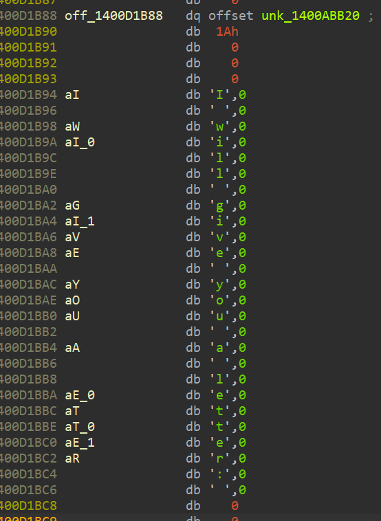

## 加密flag寻找

找到加密flag

```C++
__int64 __fastcall sub_140001620(__int64 a1)
{
  _OWORD *v2; // rax
  __int64 v3; // rax
  __int64 v4; // rax
  __int64 v5; // rax
  __int64 v6; // rax

  v2 = (_OWORD *)sub_14004A360(&unk_1400B3DC8, 64);
  v2[1] = unk_1400A5080; //encflag
  v2[2] = unk_1400A5090;
  v2[3] = unk_1400A50A0;
  v2[4] = unk_1400A50B0;
  sub_14004A4A0(a1 + 8, v2);
  v3 = sub_14004A360(&unk_1400B3EC8, 8);
  sub_14004A4A0(a1 + 16, v3);
  v4 = sub_14004A360(&unk_1400B3DC8, 64);
  sub_14004A4A0(a1 + 24, v4);
  v5 = sub_14004A360(&unk_1400B3DC8, 64);
  sub_14004A4A0(a1 + 32, v5);
  v6 = sub_14004A360(&unk_1400B3EC8, 3);
  return sub_14004A4A0(a1 + 40, v6);
}
```

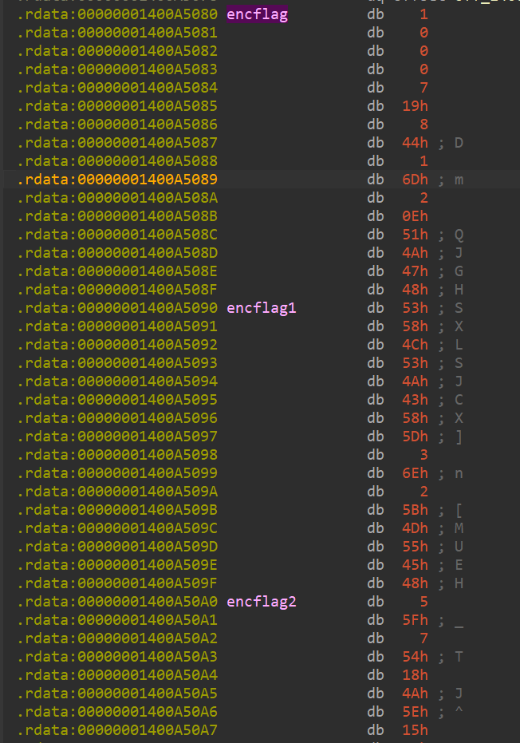

```Plain Text
01 00 00 00 07 19 08 44 01 6D 02 0E 51 4A 47 48 53 58 4C 53 4A 43 58 5D 03 6E 02 5B 4D 55 45 48 05 5F 07 54 18 4A 5E 15 51 22 66 6C 60 67 21 7D 65 6C 61 67 7A 7A 6A 70 62 5F 66 6C 60 67 21 7D
```

找到随机抽取加密flag字符的函数，这个函数提取随机字符到全0数组，放在byte数组特定位置。

```C++
__int64 __fastcall sub_1400014E0(__int64 a1)
{
  __int64 v2; // rsi
  __int64 v3; // rcx
  __int64 v4; // rdx
  __int64 v5; // r8
  __int64 v6; // rax
  __int64 v7; // r10
  unsigned __int64 v8; // r11
  unsigned __int64 v9; // rax
  __int64 v10; // rax
  __int64 v11; // rdx
  __int64 v12; // r8
  __int64 v13; // r10
  unsigned __int64 v14; // r11
  unsigned __int64 v15; // rax
  __int64 result; // rax
  __int64 v17; // rdx
  __int64 v18; // r8
  __int64 v19; // r10

  v2 = sub_14004A240(&unk_1400ACE28);
  sub_14000D170(v2);
  v3 = *(_QWORD *)(v2 + 8);
  if ( *(_UNKNOWN **)v3 == &unk_1400B0440 )
  {
    LODWORD(v15) = sub_14002F080(v3, 0, 42);    // randomrange
  }
  else//随机数算法
  {
    v4 = *(_QWORD *)(v3 + 8);
    v5 = *(_QWORD *)(v3 + 16);
    v6 = v4 ^ *(_QWORD *)(v3 + 24);
    v7 = v5 ^ *(_QWORD *)(v3 + 32);
    *(_QWORD *)(v3 + 8) = v7 ^ v4;
    *(_QWORD *)(v3 + 16) = v6 ^ v5;
    *(_QWORD *)(v3 + 24) = (v5 << 17) ^ v6;
    *(_QWORD *)(v3 + 32) = __ROL8__(v7, 45);
    v8 = (unsigned __int64)(9LL * __ROL8__(5 * v5, 7)) >> 32;
    v9 = 42LL * (unsigned int)v8;
    if ( (unsigned int)(42 * v8) < 4 )
    {
      do//随机数算法
      {
        v10 = *(_QWORD *)(v3 + 8);
        v11 = *(_QWORD *)(v3 + 16);
        v12 = v10 ^ *(_QWORD *)(v3 + 24);
        v13 = v11 ^ *(_QWORD *)(v3 + 32);
        *(_QWORD *)(v3 + 8) = v13 ^ v10;
        *(_QWORD *)(v3 + 16) = v12 ^ v11;
        *(_QWORD *)(v3 + 24) = (v11 << 17) ^ v12;
        *(_QWORD *)(v3 + 32) = __ROL8__(v13, 45);
        v14 = (unsigned __int64)(9LL * __ROL8__(5 * v11, 7)) >> 32;
        v9 = 42LL * (unsigned int)v14;
      }
      while ( (unsigned int)(42 * v14) < 4 );
    }
    v15 = HIDWORD(v9);
  }
  *(_DWORD *)(a1 + 48) = v15;
  result = *(_QWORD *)(a1 + 32);
  v17 = *(unsigned int *)(a1 + 48);
  v18 = (unsigned int)v17;
  v19 = *(_QWORD *)(a1 + 8);
  if ( (unsigned int)v17 >= *(_DWORD *)(v19 + 8)
    || (v17 = *(unsigned __int8 *)(v19 + v17 + 16), (unsigned int)v18 >= *(_DWORD *)(result + 8)) )
  {
    sub_14002E150(result, v17, v18);
    __debugbreak();
  }
  *(_BYTE *)(result + v18 + 16) = v17;//提取随机字符到全0数组，放在特定位置
  return result;
}
```

我们可以通过动调验证。

在call sub\_140001BE0处下断点，查看v2的内存数据，往下划发现了一个全0数组塞入了一个字节。

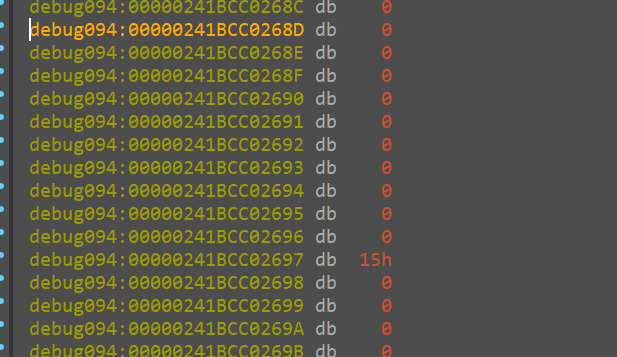

找一下就发现是加密flag数组里面的。

待解密字节数组对象的内存数据分布：

```Plain Text
debug094:00000241BCC02660 db 0C8h
debug094:00000241BCC02661 db  3Dh ; =
debug094:00000241BCC02662 db  6Eh ; n
debug094:00000241BCC02663 db  6Bh ; k
debug094:00000241BCC02664 db 0F7h
debug094:00000241BCC02665 db  7Fh ; 
debug094:00000241BCC02666 db    0
debug094:00000241BCC02667 db    0
debug094:00000241BCC02668 db  40h ; @
debug094:00000241BCC02669 db    0
debug094:00000241BCC0266A db    0
debug094:00000241BCC0266B db    0
debug094:00000241BCC0266C db    0
debug094:00000241BCC0266D db    0
debug094:00000241BCC0266E db    0
debug094:00000241BCC0266F db    0
debug094:00000241BCC02670 db    0 ; 此处开始，就是待解密的数组，长度64位
```

## 调试过程中修改输入参数

我们适用idapatch插件写入加密flag。

从输入字节对象偏移16个字节处开始写入。

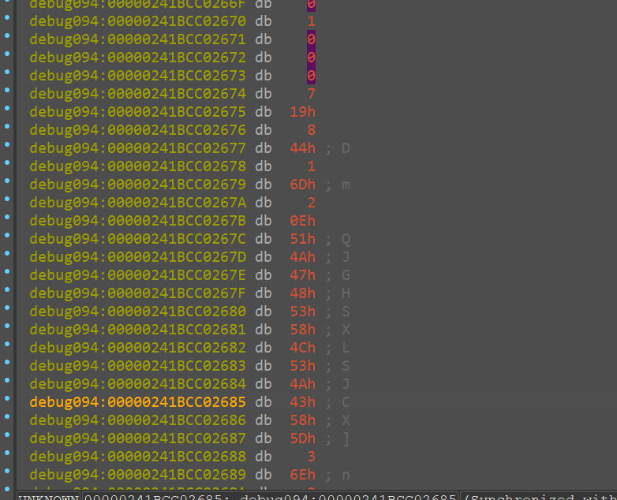

在函数调用指令下一个指令下断点，再看内存。

直接出flag。

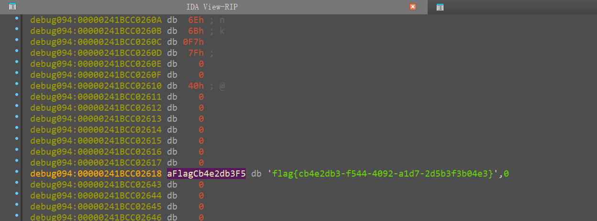

flag\{cb4e2db3\-f544\-4092\-a1d7\-2d5b3f3b04e3\}

## 解密脚本

当然，也可以通过分析加密算法解密，只给出脚本，分析过程略。

```C++
#include <stdio.h>
#include <stdint.h>  *//* *包含标准整数类型*  
#include <string.h>  *//* *包含内存操作函数，如* *memcpy#include* *<cstdio>*    *//* *包含标准输入输出函数，如* *putchar*  
*//* *宏定义：循环左移（左移操作后，右边溢出的部分重新回到左边）*  
#define ROTL(a, b) (((a) << (b)) | ((a) >> (32 - (b))))  

*//* *宏定义：Chacha20的四分之一轮（Quarter* *Round）操作*  
#define QR(a, b, c, d) (   a += b, d ^= a, d = ROTL(d, 16),   c += d, b ^= c, b = ROTL(b, 12), a += b, d ^= a, d = ROTL(d, 8), c += d, b ^= c, b = ROTL(b, 7))  

*//* *ChaCha20加密算法中的块函数*  
void chacha20_block(uint32_t output[16], const uint32_t input[16]) {  
     int i;  
     uint32_t x[16];  *//* *创建一个32位的数组用于存储状态*  
     memcpy(x, input, sizeof(x));  *//* *将输入状态复制到数组x*  
     
   
     for (i = 0; i < 10; i++) { 
         *//* *奇数轮*  
         QR(x[0], x[4], x[8], x[12]);  
         QR(x[1], x[5], x[9], x[13]);  
         QR(x[2], x[6], x[10], x[14]);  
         QR(x[3], x[7], x[11], x[15]);  
         
         *//* *偶数轮*  
         QR(x[0], x[5], x[10], x[15]);  
         QR(x[1], x[6], x[11], x[12]);  
         QR(x[2], x[7], x[8], x[13]);  
         QR(x[3], x[4], x[9], x[14]);  
         
         
         *//* *奇数轮*  
         QR(x[3], x[7], x[11], x[15]);
        QR(x[0], x[4], x[8], x[12]);  
         QR(x[1], x[5], x[9], x[13]);  
         QR(x[2], x[6], x[10], x[14]);  
         
         *//* *偶数轮*  
         QR(x[0], x[5], x[10], x[15]);  
         QR(x[2], x[7], x[8], x[13]);
        QR(x[1], x[6], x[11], x[12]);  
         QR(x[3], x[4], x[9], x[14]);  
         
         QR(x[2], x[6], x[10], x[14]); 
         QR(x[3], x[7], x[11], x[15]);
        QR(x[0], x[4], x[8], x[12]);  
         QR(x[1], x[5], x[9], x[13]);  
          
         *//* *偶数轮*  
         QR(x[1], x[6], x[11], x[12]);
        QR(x[0], x[5], x[10], x[15]);  
         QR(x[2], x[7], x[8], x[13]);
        QR(x[3], x[4], x[9], x[14]); 
     }  
     
     *//* *将加密结果与原始输入状态相加，输出最终结果*  
     for (i = 0; i < 16; ++i) {  
         output[i] = x[i] + input[i];  
         output[i]^=input[i];
        output[i]^=input[i]+x[i];
        output[i]^=input[i%4];
        output[i]^=input[i]+1;
    }  
}  

*//* *ChaCha20加密函数*  
void chacha20_encrypt(uint8_t *out, const uint8_t *in, size_t in_len, const uint32_t key[8], const uint32_t nonce[3], uint32_t counter) {  
     uint32_t state[16] = {  
         0x67616c66,0x706a7a7b,0x6c665f63,0x7d216761,  *//* *固定常量（ASCII编码：expand* *32-byte* *k）*  
         key[0], key[1], key[2], key[3],  *//* *256位密钥（8个32位字）*  
         key[4], key[5], key[6], key[7],  
         counter, nonce[0], nonce[1], nonce[2]  *//* *计数器和nonce*  
     };  
     *//0x67616c66,0x706a7a7b,0x6c665f63,0x7d216761*
    *//expand* *32-byte* *k*
    *//flag{zjpc_flag!}*
    uint8_t block[64];  *//* *存储每次生成的64字节的加密块*  
     size_t i, j;  
     while (in_len > 0) {  
         *//* *生成一个加密块*  
         chacha20_block((uint32_t *)block, state);  
         state[12]++;  *//* *每次加密后递增计数器*  
         
         size_t block_size = (in_len < 64) ? in_len : 64;  *//* *计算当前块的大小*  
         for (i = 0; i < block_size; i++) {  
             out[i] = in[i] ^ block[i];  *//* *将输入数据与加密块异或得到密文*  
         }  
         
         *//* *更新剩余输入数据的长度和指针*  
         in_len -= block_size;  
         in += block_size;  
         out += block_size;  
     }  
}  

int main() {  
     *//* *示例：初始化密钥、nonce、明文等*  
     uint8_t key[32] = {0};  *//* *32字节的密钥*  
     uint8_t nonce[12] = {0};  *//* *12字节的nonce*  
     *//uint8_t* *plaintext[64]* *=* *{"flag{cb4e2db3-f544-4092-a1d7-2d5b3f3b04e3}"};*  *//* *明文*  
     uint8_t ciphertext[64];  *//* *用于存储加密后的密文*  
     uint8_t decrypted[64];  *//* *用于存储解密后的数据*  
     uint8_t ciphertext1[64]={0x01, 0x00, 0x00, 0x00, 0x07, 0x19, 0x08, 0x44, 0x01, 0x6d, 0x02, 0x0e, 0x51, 0x4a, 0x47, 0x48, 0x53, 0x58, 0x4c, 0x53, 0x4a, 0x43, 0x58, 0x5d, 0x03, 0x6e, 0x02, 0x5b, 0x4d, 0x55, 0x45, 0x48, 0x05, 0x5f, 0x07, 0x54, 0x18, 0x4a, 0x5e, 0x15, 0x51, 0x22, 0x66, 0x6c, 0x60, 0x67, 0x21, 0x7d, 0x65, 0x6c, 0x61, 0x67, 0x7a, 0x7a, 0x6a, 0x70, 0x62, 0x5f, 0x66, 0x6c, 0x60, 0x67, 0x21, 0x7d};

    
     for (int i = 0; i < sizeof(ciphertext1); i++) {  
         printf("0x%02x, ",ciphertext1[i]);   
     }
    printf("\n");
    *//* *执行解密操作（加密是对称的，解密过程与加密相同）*  
     chacha20_encrypt(decrypted, ciphertext1, sizeof(ciphertext1), (uint32_t *)key, (uint32_t *)nonce, 1);  
     
     *//* *解密后的数据应当与原始明文相同*  
     for (int i = 0; i < sizeof(decrypted); i++) {  
         putchar(decrypted[i]);  *//* *输出解密后的字符*  
     }  

     return 0;  
}
```

## 题目源码

```C#
using System;
using System.Runtime.CompilerServices;

namespace Slot_Machine
{
    internal class Program
    {

        static void Main(string[] args)
        {
            BytesPool pool= new BytesPool();
            ChaCha chacha= new ChaCha();
            Console.Write("I will give you a letter: ");
            byte[] randbytearray = pool.getRandsequence();
            chacha.chacha20_encrypt(pool.plaintext, randbytearray, randbytearray.Length, pool.key, pool.nonce, 1);
            Console.WriteLine((char)pool.plaintext[pool.index]);
        }

    }

    public class BytesPool
    {
        private byte[] encflag = { 0x01, 0x00, 0x00, 0x00, 0x07, 0x19, 0x08, 0x44, 0x01, 0x6d, 0x02, 0x0e, 0x51, 0x4a, 0x47, 0x48, 0x53, 0x58, 0x4c, 0x53, 0x4a, 0x43, 0x58, 0x5d, 0x03, 0x6e, 0x02, 0x5b, 0x4d, 0x55, 0x45, 0x48, 0x05, 0x5f, 0x07, 0x54, 0x18, 0x4a, 0x5e, 0x15, 0x51, 0x22, 0x66, 0x6c, 0x60, 0x67, 0x21, 0x7d, 0x65, 0x6c, 0x61, 0x67, 0x7a, 0x7a, 0x6a, 0x70, 0x62, 0x5f, 0x66, 0x6c, 0x60, 0x67, 0x21, 0x7d };
        public uint[] key = new uint[8];
        public byte[] plaintext = new byte[64];  // 用于存储加密后的密文   
        private byte[] flag_for_dec = new byte[64];
        public uint[] nonce = new uint[3];
        public int index=0;
        public byte[] getRandsequence() {
            Random rand = new Random();
            this.index = rand.Next(0, 42);
            this.flag_for_dec[this.index] = this.encflag[this.index];
            return this.flag_for_dec;//返回的是数组，是漏洞的利用点
        }
    }

    public class ChaCha
    {
        private static uint ROTL(uint a, int b)
        {
            return (a << b) | (a >> (32 - b));
        }

        private void QR(ref uint a, ref uint b, ref uint c, ref uint d)
        {
            a += b; d ^= a; d = ROTL(d, 16);
            c += d; b ^= c; b = ROTL(b, 12);
            a += b; d ^= a; d = ROTL(d, 8);
            c += d; b ^= c; b = ROTL(b, 7);
        }

        public void chacha20_block(uint[] output, uint[] input)
        {
            uint[] x = new uint[16];
            Array.Copy(input, x, 16);

            for (int i = 0; i < 10; i++)
            {
                // 奇数轮  
                QR(ref x[0], ref x[4], ref x[8], ref x[12]);
                QR(ref x[1], ref x[5], ref x[9], ref x[13]);
                QR(ref x[2], ref x[6], ref x[10], ref x[14]);
                QR(ref x[3], ref x[7], ref x[11], ref x[15]);

                // 偶数轮  
                QR(ref x[0], ref x[5], ref x[10], ref x[15]);
                QR(ref x[1], ref x[6], ref x[11], ref x[12]);
                QR(ref x[2], ref x[7], ref x[8], ref x[13]);
                QR(ref x[3], ref x[4], ref x[9], ref x[14]);


                // 奇数轮  
                QR(ref x[3], ref x[7], ref x[11], ref x[15]);
                QR(ref x[0], ref x[4], ref x[8], ref x[12]);
                QR(ref x[1], ref x[5], ref x[9], ref x[13]);
                QR(ref x[2], ref x[6], ref x[10], ref x[14]);

                // 偶数轮  
                QR(ref x[0], ref x[5], ref x[10], ref x[15]);
                QR(ref x[2], ref x[7], ref x[8], ref x[13]);
                QR(ref x[1], ref x[6], ref x[11], ref x[12]);
                QR(ref x[3], ref x[4], ref x[9], ref x[14]);

                QR(ref x[2], ref x[6], ref x[10], ref x[14]);
                QR(ref x[3], ref x[7], ref x[11], ref x[15]);
                QR(ref x[0], ref x[4], ref x[8], ref x[12]);
                QR(ref x[1], ref x[5], ref x[9], ref x[13]);

                // 偶数轮  
                QR(ref x[1], ref x[6], ref x[11], ref x[12]);
                QR(ref x[0], ref x[5], ref x[10], ref x[15]);
                QR(ref x[2], ref x[7], ref x[8], ref x[13]);
                QR(ref x[3], ref x[4], ref x[9], ref x[14]);
            }

            // 将加密结果与原始输入状态相加，输出最终结果  
            for (int i = 0; i < 16; ++i)
            {
                output[i] = x[i] + input[i];
                output[i] ^= input[i];
                output[i] ^= input[i] + x[i];
                output[i] ^= input[i % 4];
                output[i] ^= input[i] + 1;
            }
        }

        public byte[] chacha20_encrypt(byte[] outBuf, byte[] inBuf, int inLen, uint[] key, uint[] nonce, uint counter)
        {
            uint[] state = new uint[16] {
                0x67616c66,0x706a7a7b,0x6c665f63,0x7d216761,
                key[0], key[1], key[2], key[3],
                key[4], key[5], key[6], key[7],
                counter, nonce[0], nonce[1], nonce[2]
            };

            byte[] block = new byte[64];
            int offset = 0;
            while (inLen > 0)
            {
                uint[] blockState = new uint[16];
                chacha20_block(blockState, state);

                for (int i = 0; i < 16; i++)
                {
                    byte[] bytes = BitConverter.GetBytes(blockState[i]);
                    Array.Copy(bytes, 0, block, i * 4, 4);
                }

                state[12]++;

                int blockSize = (inLen < 64) ? inLen : 64;
                for (int i = 0; i < blockSize; i++)
                {
                    outBuf[offset + i] = (byte)(inBuf[offset + i] ^ block[i]);
                }

                inLen -= blockSize;
                offset += blockSize;
            }
            return outBuf;
        }
    }


}
```

# Maze\_Lock

安卓原生层控制台程序。

一道迷宫题，不过是三维的迷宫。

## 题目分析

主函数

```C++
int __fastcall main(int argc, const char **argv, const char **envp)
{
  __int64 v3; // r14
  unsigned int x; // ecx
  unsigned int y; // edx
  unsigned int z; // esi
  const char *str; // rdi
  char path[2000]; // [rsp+0h] [rbp-2728h] BYREF
  int maze[2000]; // [rsp+7D0h] [rbp-1F58h] BYREF
  unsigned __int64 v11; // [rsp+2710h] [rbp-18h]

  v11 = __readfsqword(0x28u);
  puts("+-------------------------------+");
  puts("|          ShellLocker          |");
  puts("+-------------------------------+");
  puts("Oops! The shell has been locked. Please imput the right directions to unlock!");
  puts("w:forward s:backward a:left d:right q:up e:down");
  i = 0;
  printf("Please input path:");
  memset(path, 0, sizeof(path));
  fgets(path, 2000, stdin);
  generate_maze(maze);
  x = 0;
  y = 0;
  z = 0;
  while ( 2 )
  {
    switch ( path[i] )
    {
      case 'a'://左
        --x;
        goto LABEL_12;
      case 'b':
      case 'c':
      case 'f':
      case 'g':
      case 'h':
      case 'i':
      case 'j':
      case 'k':
      case 'l':
      case 'm':
      case 'n':
      case 'o':
      case 'p':
      case 'r':
      case 't':
      case 'u':
      case 'v':
        goto LABEL_20;
      case 'd'://右
        ++x;
        goto LABEL_12;
      case 'e'://下
        --z;
        goto LABEL_12;
      case 'q'://上
        ++z;
        goto LABEL_12;
      case 's'://后
        --y;
        goto LABEL_12;
      case 'w'://前
        ++y;
        goto LABEL_12;
      default:
        if ( path[i] )
          goto LABEL_20;
LABEL_12:
        if ( x > 0x13 || y >= 0x14 || z > 4 || maze[100 * x + 5 * y + z] )
        {//超出范围、碰到墙
LABEL_20:
          str = "wrong!";
          goto LABEL_22;
        }
        if ( x != 19 || y != 19 || z != 4 )//20*20*5
        {
          if ( ++i == 2000 )
          {
            str = "unknown error!";
LABEL_22:
            puts(str);
            puts("System is shutting down...");
            sleep(1u);
            system("poweroff");
            exit(1);
          }
          continue;
        }
        printf("You reach the end! Path is:%s\n", path);
        sleep(1u);
        system("/system/bin/sh");
        return 0;
    }
  }
}
```

基于栈的迷宫生成函数。

```C++
void __fastcall generate_maze(int *maze)
{
  __int64 i; // rax
  int v3; // r13d
  __int64 v4; // rax
  unsigned int dir_count; // r14d
  int randidx; // eax
  __int64 dir_idx; // rcx
  int dx; // esi
  __int64 dy; // rax
  __int64 v10; // rcx
  int v11; // edi
  int v12; // r8d
  int v13; // ebp
  __int64 v14; // r12
  __int64 stack_top; // rax
  __int64 x_top; // rbp
  __int64 x_top_1; // rdi
  __int64 y_top; // r15
  __int64 z_top; // r12
  __int64 v20; // rcx
  __int64 v21; // rcx
  __int64 v22; // rcx
  int v23; // ecx
  int v24; // [rsp+8h] [rbp-5E20h]
  int available_dirs[6]; // [rsp+10h] [rbp-5E18h]
  int stack_z[2000]; // [rsp+30h] [rbp-5DF8h]
  int stack_y[2000]; // [rsp+1F70h] [rbp-3EB8h]
  int stack_x[2000]; // [rsp+3EB0h] [rbp-1F78h]
  unsigned __int64 v29; // [rsp+5DF0h] [rbp-38h]

  v29 = __readfsqword(0x28u);
  srand(0x32u);
  for ( i = 99; i != 2099; i += 100 )
  {
    *(_OWORD *)&maze[i - 99] = xmmword_770;
    maze[i - 95] = 1;
    *(_OWORD *)&maze[i - 94] = xmmword_770;
    maze[i - 90] = 1;
    *(_OWORD *)&maze[i - 89] = xmmword_770;
    maze[i - 85] = 1;
    *(_OWORD *)&maze[i - 84] = xmmword_770;
    maze[i - 80] = 1;
    *(_OWORD *)&maze[i - 79] = xmmword_770;
    maze[i - 75] = 1;
    *(_OWORD *)&maze[i - 74] = xmmword_770;
    maze[i - 70] = 1;
    *(_OWORD *)&maze[i - 69] = xmmword_770;
    maze[i - 65] = 1;
    *(_OWORD *)&maze[i - 64] = xmmword_770;
    maze[i - 60] = 1;
    *(_OWORD *)&maze[i - 59] = xmmword_770;
    maze[i - 55] = 1;
    *(_OWORD *)&maze[i - 54] = xmmword_770;
    maze[i - 50] = 1;
    *(_OWORD *)&maze[i - 49] = xmmword_770;
    maze[i - 45] = 1;
    *(_OWORD *)&maze[i - 44] = xmmword_770;
    maze[i - 40] = 1;
    *(_OWORD *)&maze[i - 39] = xmmword_770;
    maze[i - 35] = 1;
    *(_OWORD *)&maze[i - 34] = xmmword_770;
    maze[i - 30] = 1;
    *(_OWORD *)&maze[i - 29] = xmmword_770;
    maze[i - 25] = 1;
    *(_OWORD *)&maze[i - 24] = xmmword_770;
    maze[i - 20] = 1;
    *(_OWORD *)&maze[i - 19] = xmmword_770;
    maze[i - 15] = 1;
    *(_OWORD *)&maze[i - 14] = xmmword_770;
    maze[i - 10] = 1;
    *(_OWORD *)&maze[i - 9] = xmmword_770;
    maze[i - 5] = 1;
    *(_OWORD *)&maze[i - 4] = xmmword_770;
    maze[i] = 1;
  }
  *maze = 0;
  stack_x[0] = 0;
  stack_y[0] = 0;
  stack_z[0] = 0;
  v3 = 1;
  do
  {
    stack_top = (unsigned int)(v3 - 1);
    x_top = stack_x[stack_top];
    x_top_1 = (unsigned int)stack_x[stack_top];
    y_top = stack_y[stack_top];
    z_top = stack_z[stack_top];
    if ( x_top >= 18 )
    {
      dir_count = 0;
LABEL_13:
      if ( maze[100 * x_top_1 - 200 + 5 * y_top + z_top] == 1 )
      {
        v20 = dir_count++;
        available_dirs[v20] = 1;
      }
      goto LABEL_15;
    }
    dir_count = 0;
    if ( maze[100 * x_top + 200 + 5 * y_top + z_top] == 1 )
    {
      available_dirs[0] = 0;
      dir_count = 1;
    }
    if ( (int)x_top_1 >= 2 )
      goto LABEL_13;
LABEL_15:
    if ( (int)y_top >= 18 )
      goto LABEL_19;
    if ( maze[100 * x_top + 10 + 5 * y_top + z_top] == 1 )
    {
      v21 = dir_count++;
      available_dirs[v21] = 2;
    }
    if ( (int)y_top >= 2 )
    {
LABEL_19:
      if ( maze[100 * x_top + 5 * (unsigned int)(y_top - 2) + z_top] == 1 )
      {
        v22 = dir_count++;
        available_dirs[v22] = 3;
      }
    }
    if ( (int)z_top > 2 )
    {
      v23 = 5;
      if ( maze[100 * x_top + 5 * y_top + (unsigned int)(z_top - 2)] == 1 )
      {
LABEL_4:
        v4 = dir_count++;
        available_dirs[v4] = v23;
LABEL_5:
        v24 = x_top_1;
        randidx = rand();
        dir_idx = available_dirs[randidx % (int)dir_count];
        dx = dirs[available_dirs[randidx % (int)dir_count]][0];
        dy = dirs[available_dirs[randidx % (int)dir_count]][1];
        v10 = dirs[dir_idx][2];
        v11 = y_top + (int)dy / 2;
        v12 = z_top + (int)v10 / 2;
        v13 = dx + x_top;
        stack_top = y_top + dy;
        v14 = v10 + z_top;
        maze[100 * v24 + 100 * (dx / 2) + 5 * v11 + v12] = 0;
        maze[100 * v13 + 5 * stack_top + v14] = 0;
        stack_x[v3] = v13;
        stack_y[v3] = stack_top;
        stack_z[v3] = v14;
        LODWORD(stack_top) = v3 + 1;
        goto LABEL_6;
      }
    }
    else
    {
      v23 = 4;
      if ( maze[100 * x_top + 2 + 5 * y_top + z_top] == 1 )
        goto LABEL_4;
    }
    if ( dir_count )
      goto LABEL_5;
LABEL_6:
    v3 = stack_top;
  }
  while ( (int)stack_top > 0 );
  maze[1999] = 0;                               // maze[X_SIZE-1][Y_SIZE-1][Z_SIZE-1] = 0;
  if ( maze[1994] == 1 )                        // maze[X_SIZE-1][Y_SIZE-2][Z_SIZE-1] == 1;
    maze[1994] = 0;
}
```

## 动态调试

我们可以动调出maze的值，或者静态分析，因为跨平台性的问题，建议动态调试。

可以在手机模拟器中调试，调试得知maze\[2000\]的结构。

我们5个一组查看。

```Plain Text
-----> z
[stack]:00007FFFFFFFC9E0 dd | 0, 1, 0, 0, 0
[stack]:00007FFFFFFFC9F4 dd | 0, 1, 0, 1, 0
[stack]:00007FFFFFFFCA08 dd | 0, 1, 0, 1, 0
[stack]:00007FFFFFFFCA1C dd | 1, 1, 1, 1, 0
[stack]:00007FFFFFFFCA30 dd x 0, 1, 0, 1, 0
[stack]:00007FFFFFFFCA44 dd y 0, 1, 0, 1, 1
[stack]:00007FFFFFFFCA58 dd   0, 1, 0, 0, 0
[stack]:00007FFFFFFFCA6C dd   0, 1, 1, 1, 0
...
```

这些数据从左到右表示某一点z方向上面是空的还是墙。

## 编写解题程序

```C++
#include <stdio.h>
#include <stdlib.h>
#include <string.h>

#define X_SIZE 20
 #define Y_SIZE 20
 #define Z_SIZE 5

typedef struct {
    int x;
    int y;
    int z;
 } Position;

typedef struct {
    Position path[10000];  *//* *存储路径点*
    int length;            *//* *路径长度*
} MazePath;

const int dirs[6][3] = {
    {2, 0, 0},   *//* *右* *d*
    {-2, 0, 0},  *//* *左* *a*
    {0, 2, 0},   *//* *前* *w*
    {0, -2, 0},  *//* *后* *s*
    {0, 0, 2},   *//* *上* *q*
    {0, 0, -2}   *//* *下* *e*
};

*//* *方向对应的移动步长*
const int moves[6][3] = {
    {1, 0, 0},   *//* *右* *d*
    {-1, 0, 0},  *//* *左* *a*
    {0, 1, 0},   *//* *前* *w*
    {0, -1, 0},  *//* *后* *s*
    {0, 0, 1},   *//* *上* *q*
    {0, 0, -1}   *//* *下* *e*
};

*//* *方向字符*
const char dir_chars[6] = {'d', 'a', 'w', 's', 'q', 'e'};

*//* *打印路径*
void print_path(MazePath *mp) {
    for (int i = 0; i < mp->length - 1; i++) {
        int dx = mp->path[i+1].x - mp->path[i].x;
        int dy = mp->path[i+1].y - mp->path[i].y;
        int dz = mp->path[i+1].z - mp->path[i].z;
        
         for (int j = 0; j < 6; j++) {
            if (dx == moves[j][0] && dy == moves[j][1] && dz == moves[j][2]) {
                printf("%c", dir_chars[j]);
                break;
            }
        }
    }
    printf("\n");
 }

*//* *DFS查找所有路径*
void find_all_paths_dfs(int maze[X_SIZE][Y_SIZE][Z_SIZE], 
                         int visited[X_SIZE][Y_SIZE][Z_SIZE],
                        Position current, 
                         Position end,
                        MazePath *current_path,
                        MazePath *all_paths[],
                        int *path_count,
                        int max_paths) {
    
     *//* *到达终点*
    if (current.x == end.x && current.y == end.y && current.z == end.z) {
        if (*path_count < max_paths) {
            *//* *保存当前路径*
            all_paths[*path_count] = (MazePath*)malloc(sizeof(MazePath));
            all_paths[*path_count]->length = current_path->length;
            memcpy(all_paths[*path_count]->path, current_path->path, 
                    current_path->length * sizeof(Position));
            (*path_count)++;
        }
        return;
    }
    
     *//* *尝试所有方向*
    for (int i = 0; i < 6; i++) {
        Position next;
        next.x = current.x + moves[i][0];
        next.y = current.y + moves[i][1];
        next.z = current.z + moves[i][2];
        
         *//* *检查边界和墙壁*
        if (next.x >= 0 && next.x < X_SIZE &&
            next.y >= 0 && next.y < Y_SIZE &&
            next.z >= 0 && next.z < Z_SIZE &&
            maze[next.x][next.y][next.z] == 0 &&
            !visited[next.x][next.y][next.z]) {
            
             *//* *标记已访问*
            visited[next.x][next.y][next.z] = 1;
            
             *//* *添加到路径*
            current_path->path[current_path->length] = next;
            current_path->length++;
            
             *//* *递归搜索*
            find_all_paths_dfs(maze, visited, next, end, 
                                current_path, all_paths, 
                                path_count, max_paths);
            
             *//* *回溯*
            current_path->length--;
            visited[next.x][next.y][next.z] = 0;
        }
    }
 }

*//* *查找所有路径的主函数*
MazePath** find_all_paths(int maze[X_SIZE][Y_SIZE][Z_SIZE], 
                           int *path_count, 
                           int max_paths) {
    
     *//* *访问标记数组*
    static int visited[X_SIZE][Y_SIZE][Z_SIZE] = {0};
    
     *//* *起点和终点*
    Position start = {0, 0, 0};
    Position end = {X_SIZE-1, Y_SIZE-1, Z_SIZE-1};
    
     *//* *存储所有路径*
    MazePath **all_paths = (MazePath**)malloc(max_paths * sizeof(MazePath*));
    *path_count = 0;
    
     *//* *当前路径*
    MazePath current_path;
    current_path.length = 0;
    current_path.path[current_path.length] = start;
    current_path.length++;
    
     *//* *标记起点已访问*
    visited[start.x][start.y][start.z] = 1;
    
     *//* *DFS查找*
    find_all_paths_dfs(maze, visited, start, end, 
                        &current_path, all_paths, 
                        path_count, max_paths);
    
     return all_paths;
 }

*//* *查找最短路径*
MazePath* find_shortest_path(int maze[X_SIZE][Y_SIZE][Z_SIZE]) {
    int path_count;
    MazePath **all_paths = find_all_paths(maze, &path_count, 10000);
    
     if (path_count == 0) {
        return NULL;
    }
    
     MazePath *shortest = all_paths[0];
    for (int i = 1; i < path_count; i++) {
        if (all_paths[i]->length < shortest->length) {
            shortest = all_paths[i];
        }
    }
    
     *//* *清理其他路径*
    for (int i = 0; i < path_count; i++) {
        if (all_paths[i] != shortest) {
            free(all_paths[i]);
        }
    }
    free(all_paths);
    
     return shortest;
 }

*//* *使用BFS查找最短路径（更高效）*
MazePath* find_shortest_path_bfs(int maze[X_SIZE][Y_SIZE][Z_SIZE]) {
    int visited[X_SIZE][Y_SIZE][Z_SIZE] = {0};
    Position prev[X_SIZE][Y_SIZE][Z_SIZE];  *//* *记录前驱节点*
    
     Position queue[10000];
    int front = 0, rear = 0;
    
     Position start = {0, 0, 0};
    Position end = {X_SIZE-1, Y_SIZE-1, Z_SIZE-1};
    
     queue[rear++] = start;
    visited[start.x][start.y][start.z] = 1;
    
     while (front < rear) {
        Position current = queue[front++];
        
         if (current.x == end.x && current.y == end.y && current.z == end.z) {
            *//* *重建路径*
            MazePath *path = (MazePath*)malloc(sizeof(MazePath));
            path->length = 0;
            
             Position pos = end;
            while (pos.x != start.x || pos.y != start.y || pos.z != start.z) {
                path->path[path->length++] = pos;
                pos = prev[pos.x][pos.y][pos.z];
            }
            path->path[path->length++] = start;
            
             *//* *反转路径*
            for (int i = 0; i < path->length / 2; i++) {
                Position temp = path->path[i];
                path->path[i] = path->path[path->length - 1 - i];
                path->path[path->length - 1 - i] = temp;
            }
            
             return path;
        }
        
         *//* *尝试所有方向*
        for (int i = 0; i < 6; i++) {
            Position next;
            next.x = current.x + moves[i][0];
            next.y = current.y + moves[i][1];
            next.z = current.z + moves[i][2];
            
             if (next.x >= 0 && next.x < X_SIZE &&
                next.y >= 0 && next.y < Y_SIZE &&
                next.z >= 0 && next.z < Z_SIZE &&
                maze[next.x][next.y][next.z] == 0 &&
                !visited[next.x][next.y][next.z]) {
                
                 visited[next.x][next.y][next.z] = 1;
                prev[next.x][next.y][next.z] = current;
                queue[rear++] = next;
            }
        }
    }
    
     return NULL;
 }

void generate_maze(int maze[X_SIZE][Y_SIZE][Z_SIZE]) {
    srand(0x32);
    for(int i=0;i<X_SIZE;i++){
        for(int j=0;j<Y_SIZE;j++){
            for(int k=0;k<Z_SIZE;k++){
                maze[i][j][k]=1;
            }
        }
    }
    maze[0][0][0] = 0;
    int stack_x[X_SIZE*Y_SIZE*Z_SIZE];  *//* *存储x坐标*
    int stack_y[X_SIZE*Y_SIZE*Z_SIZE];  *//* *存储y坐标*
    int stack_z[X_SIZE*Y_SIZE*Z_SIZE];  *//* *存储z坐标*
    int stack_top = 0;
    
     stack_x[stack_top] = 0;
    stack_y[stack_top] = 0;
    stack_z[stack_top] = 0;
    stack_top++;
    
     while (stack_top > 0) {
        int x = stack_x[stack_top - 1];
        int y = stack_y[stack_top - 1];
        int z = stack_z[stack_top - 1];
        
         int available_dirs[6];
        int dir_count = 0;
        
         *//* *检查右方向* *(dx=2,* *dy=0,* *dz=0)*
        if (x + 2 < X_SIZE && maze[x+2][y][z] == 1) {
            available_dirs[dir_count++] = 0;*//d*
        }
        
         *//* *检查左方向* *(dx=-2,* *dy=0,* *dz=0)*
        if (x - 2 >= 0 && maze[x-2][y][z] == 1) {
            available_dirs[dir_count++] = 1;*//a*
        }
        
         *//* *检查前方向* *(dx=0,* *dy=2,* *dz=0)*
        if (y + 2 < X_SIZE && maze[x][y+2][z] == 1) {
            available_dirs[dir_count++] = 2;*//w*
        }
        
         *//* *检查后方向* *(dx=0,* *dy=-2,* *dz=0)*
        if (y - 2 >= 0 && maze[x][y-2][z] == 1) {
            available_dirs[dir_count++] = 3;*//s*
        }
        
         *//* *检查上方向* *(dx=0,* *dy=0,* *dz=2)*
        if (z + 2 < Z_SIZE && maze[x][y][z+2] == 1) {
            available_dirs[dir_count++] = 4;*//q*
        }
        
         *//* *检查上方向* *(dx=0,* *dy=0,* *dz=-2)*
        if (z - 2 > 0 && maze[x][y][z-2] == 1) {
            available_dirs[dir_count++] = 5;*//e*
        }
        
         if(dir_count > 0){
            int dir_idx=available_dirs[rand()%dir_count];
            int dx=dirs[dir_idx][0];
            int dy=dirs[dir_idx][1];
            int dz=dirs[dir_idx][2];
            
             *//* *挖通中间格和目标格*
            int mx = x + dx/2;
            int my = y + dy/2;
            int mz = z + dz/2;
            int nx = x + dx;
            int ny = y + dy;
            int nz = z + dz;
            
             *//* *中间格*
            maze[mx][my][mz] = 0;
            *//* *目标格*
            maze[nx][ny][nz] = 0;
            
             *//* *将新位置压栈*
            stack_x[stack_top] = nx;
            stack_y[stack_top] = ny;
            stack_z[stack_top] = nz;
            stack_top++;
        }else{
            stack_top--;
        }
    }
    maze[X_SIZE-1][Y_SIZE-1][Z_SIZE-1] = 0;
    
     if(maze[X_SIZE-1][Y_SIZE-2][Z_SIZE-1]==1){
        maze[X_SIZE-1][Y_SIZE-2][Z_SIZE-1]=0;
    }
    return;
 }


void print_maze_3d(int maze[X_SIZE][Y_SIZE][Z_SIZE]) {
    for (int z = 0; z < Z_SIZE; z++) {
        printf("\n========== 层 %d (Z=%d) ==========\n", z, z);
        printf("  ");
        for (int x = 0; x < X_SIZE; x++) {
            printf("%2d", x%10);
        }
        printf("\n");
        
         for (int y = 0; y < Y_SIZE; y++) {
            printf("%2d ", y%10);
            for (int x = 0; x < X_SIZE; x++) {
                if (x == 0 && y == 0 && z == 0) {
                    printf("S ");  *//* *起点*
                } else if (x == X_SIZE-1 && y == Y_SIZE-1 && z == Z_SIZE-1) {
                    printf("E ");  *//* *终点*
                } else {
                    printf("%c ", maze[x][y][z] ? '#' : '.');
                }
            }
            printf("\n");
        }
    }
 }

unsigned char ida_chars[] = {
    //...dump 出来的数据
}

int main() {
    int (*maze)[Y_SIZE][Z_SIZE] = (int (*)[Y_SIZE][Z_SIZE])ida_chars;

    print_maze_3d(maze);
    
    MazePath *shortest = find_shortest_path_bfs(maze);
    
     if (shortest) {
        printf("找到路径！路径长度：%d\n", shortest->length);
        printf("路径序列：");
        print_path(shortest);
        free(shortest);
    } else {
        printf("未找到路径！\n");
    }
    
     return 0;
 }
```

结果

```Plain Text
========== 层 0 (Z=0) ==========
   0 1 2 3 4 5 6 7 8 9 0 1 2 3 4 5 6 7 8 9
 0 S # . . . # . . . . . # . . . . . . . #
 1 . # . # . # . # # # . # . # # # # # # #
 2 . . . # . # . . . # . . . # . . . . . #
 3 # # # # . # . # . # # # # # . # # # . #
 4 . . . # . # . # . . . . . . . . . # . #
 5 . # . # . # # # # # . # # # # # # # . #
 6 . # . # . . . . . # . # . . . . . # . #
 7 . # # # # # # # . # # # . # # # . # . #
 8 . # . . . . . # . # . . . # . . . . . #
 9 . # . # . # # # . # . # # # # # # # . #
 0 . . . # . . . # . # . . . . . # . # . #
 1 . # # # # # . # . # . # # # . # . # . #
 2 . # . # . . . # . # . # . . . # . . . #
 3 . # . # . # # # . # . # . # # # . # # #
 4 . . . # . . . # . # . # . # . # . . . #
 5 # # . # # # . # . # # # . # . # # # . #
 6 . # . . . # . # . # . . . # . . . # . #
 7 . # # # . # . # . # . # # # . # . # . #
 8 . . . . . # . . . . . # . . . # . . . #
 9 # # # # # # # # # # # # # # # # # # # #

========== 层 1 (Z=1) ==========
   0 1 2 3 4 5 6 7 8 9 0 1 2 3 4 5 6 7 8 9
 0 # # . # # # # # # # # # # # # # # # # #
 1 # # # # # # # # # # # # # # # # # # # #
 2 # # # # # # # # # # # # # # # # # # # #
 3 # # # # # # # # # # # # # # # # # # # #
 4 # # # # # # # # # # # # # # # # # # # #
 5 # # # # # # # # # # # # # # # # # # # #
 6 # # # # # # # # # # # # # # # # # # # #
 7 # # # # # # # # # # # # # # # # # # # #
 8 # # # # # # # # # # # # # # # # # # # #
 9 # # # # # # # # # # # # # # # # # # # #
 0 # # # # # # # # # # # # # # # # # # # #
 1 # # # # # # # # # # # # # # # # # # # #
 2 # # # # # # # # # # # # # # # # # # # #
 3 # # # # # # # # # # # # # # # # # # # #
 4 # # # # # # # # # # # # # # # # # # # #
 5 # # # # # # # # # # # # # # # # # # # #
 6 # # # # # # # # # # # # # # # # # # # #
 7 # # # # # # # # # # # # # # # # # # # #
 8 # # # # # # # # # # # # # # # # # # # #
 9 # # # # # # # # # # # # # # # # # # # #

========== 层 2 (Z=2) ==========
   0 1 2 3 4 5 6 7 8 9 0 1 2 3 4 5 6 7 8 9
 0 . # . # . . . . . # . # . . . . . # . #
 1 . # # # . # # # # # . # . # # # # # . #
 2 . # . # . . . . . . . # . # . . . . . #
 3 # # . # # # # # # # . # . # . # # # # #
 4 . . . # . . . # . # . . . # . . . . . #
 5 . # # # # # # # . # # # # # # # # # . #
 6 . # . . . . . # . # . # . # . . . # . #
 7 # # # # # # # # # # . # . # . # # # . #
 8 . # . . . # . . . # . # . # . # . . . #
 9 . # . # . # . # # # # # # # . # # # # #
 0 . . . # . # . . . # . . . # . # . . . #
 1 # # # # # # # # . # . # # # . # . # # #
 2 . # . . . . . . . # . # . # . . . # . #
 3 . # . # # # # # # # # # . # . # # # . #
 4 . . . # . . . # . # . . . . . # . . . #
 5 # # # # . # # # . # # # . # # # . # # #
 6 . # . . . # . # . . . # . # . . . # . #
 7 . # . # # # . # # # # # # # . # # # . #
 8 . . . . . # . . . . . . . . . # . . . #
 9 # # # # # # # # # # # # # # # # # # # #

========== 层 3 (Z=3) ==========
   0 1 2 3 4 5 6 7 8 9 0 1 2 3 4 5 6 7 8 9
 0 . # . # # # # # . # . # # # # # . # # #
 1 # # # # # # # # # # # # # # # # # # # #
 2 # # . # # # # # # # # # # # . # # # # #
 3 # # # # # # # # # # # # # # # # # # # #
 4 # # # # . # # # . # # # # # # # # # # #
 5 # # # # # # # # # # # # # # # # # # # #
 6 . # . # # # . # . # . # . # . # # # # #
 7 # # # # # # # # # # # # # # # # # # # #
 8 . # # # # # # # . # . # . # # # . # # #
 9 # # # # # # # # # # # # # # # # # # # #
 0 # # # # . # # # # # # # . # # # # # . #
 1 # # # # # # # # # # # # # # # # # # # #
 2 . # # # # # # # # # . # # # # # # # . #
 3 # # # # # # # # # # # # # # # # # # # #
 4 # # # # # # # # . # # # # # # # # # # #
 5 # # # # # # # # # # # # # # # # # # # #
 6 # # # # . # . # # # . # . # # # # # . #
 7 # # # # # # # # # # # # # # # # # # # #
 8 . # # # # # # # # # # # # # # # . # # #
 9 # # # # # # # # # # # # # # # # # # # #

========== 层 4 (Z=4) ==========
   0 1 2 3 4 5 6 7 8 9 0 1 2 3 4 5 6 7 8 9
 0 . # . # . . . . . # . . . # . # . . . #
 1 . # . # . # # # # # # # . # . # # # . #
 2 . # . # . . . . . . . # . # . # . . . #
 3 . # # # . # # # # # # # . # . # . # # #
 4 . . . . . # . . . # . . . # . # . . . #
 5 # # # # # # . # # # . # # # . # # # . #
 6 . # . . . # . # . # . # . # . # . . . #
 7 . # # # . # # # . # # # # # # # . # # #
 8 . # . . . # . # . # . # . . . # . # . #
 9 # # . # # # . # # # . # # # . # # # . #
 0 . # . . . # . . . . . # . # . . . . . #
 1 . # # # # # . # . # # # . # # # # # # #
 2 . . . # . # . # . # . # . . . . . . . #
 3 # # . # . # . # . # . # # # # # # # # #
 4 . . . # . . . # . # . # . . . . . . . #
 5 . # # # . # # # # # . # # # . # # # # #
 6 . . . # . # . # . # . # . # . . . . . #
 7 # # . # # # . # . # # # . # # # # # . #
 8 . # . . . . . # . . . . . . . . . # . .
 9 # # # # # # # # # # # # # # # # # # # E
找到路径！路径长度：275
路径序列：wwddssqqqqwweewwaawwqqwweewwddssddwwqqaassddssaaeeddddqqssddeewwqqwweeaawwddwwaaaaaawwaassqqddwwaawwddwwddddsseewwddddddddssddssddssqqaaaaaasseeaawwqqwwwweeaassqqssssddsseessqqssddssssaaeewwwwddssssddddqqddwwaawwddwwaawweeddssssaaaassqqwwwweewwwwwwwwaawwqqwwddddeeddssqqwwdw
```

脚本2,这种情况需要在linux系统上面编译才能得到正确的flag：

```C++
#include <stdio.h>
#include <stdlib.h>
#include <string.h>

#define X_SIZE 20
 #define Y_SIZE 20
 #define Z_SIZE 5

typedef struct {
    int x;
    int y;
    int z;
 } Position;

typedef struct {
    Position path[10000];  *//* *存储路径点*
    int length;            *//* *路径长度*
} MazePath;

const int dirs[6][3] = {
    {2, 0, 0},   *//* *右* *d*
    {-2, 0, 0},  *//* *左* *a*
    {0, 2, 0},   *//* *前* *w*
    {0, -2, 0},  *//* *后* *s*
    {0, 0, 2},   *//* *上* *q*
    {0, 0, -2}   *//* *下* *e*
};

*//* *方向对应的移动步长*
const int moves[6][3] = {
    {1, 0, 0},   *//* *右* *d*
    {-1, 0, 0},  *//* *左* *a*
    {0, 1, 0},   *//* *前* *w*
    {0, -1, 0},  *//* *后* *s*
    {0, 0, 1},   *//* *上* *q*
    {0, 0, -1}   *//* *下* *e*
};

*//* *方向字符*
const char dir_chars[6] = {'d', 'a', 'w', 's', 'q', 'e'};

*//* *打印路径*
void print_path(MazePath *mp) {
    for (int i = 0; i < mp->length - 1; i++) {
        int dx = mp->path[i+1].x - mp->path[i].x;
        int dy = mp->path[i+1].y - mp->path[i].y;
        int dz = mp->path[i+1].z - mp->path[i].z;
        
         for (int j = 0; j < 6; j++) {
            if (dx == moves[j][0] && dy == moves[j][1] && dz == moves[j][2]) {
                printf("%c", dir_chars[j]);
                break;
            }
        }
    }
    printf("\n");
 }

*//* *DFS查找所有路径*
void find_all_paths_dfs(int maze[X_SIZE][Y_SIZE][Z_SIZE], 
                         int visited[X_SIZE][Y_SIZE][Z_SIZE],
                        Position current, 
                         Position end,
                        MazePath *current_path,
                        MazePath *all_paths[],
                        int *path_count,
                        int max_paths) {
    
     *//* *到达终点*
    if (current.x == end.x && current.y == end.y && current.z == end.z) {
        if (*path_count < max_paths) {
            *//* *保存当前路径*
            all_paths[*path_count] = (MazePath*)malloc(sizeof(MazePath));
            all_paths[*path_count]->length = current_path->length;
            memcpy(all_paths[*path_count]->path, current_path->path, 
                    current_path->length * sizeof(Position));
            (*path_count)++;
        }
        return;
    }
    
     *//* *尝试所有方向*
    for (int i = 0; i < 6; i++) {
        Position next;
        next.x = current.x + moves[i][0];
        next.y = current.y + moves[i][1];
        next.z = current.z + moves[i][2];
        
         *//* *检查边界和墙壁*
        if (next.x >= 0 && next.x < X_SIZE &&
            next.y >= 0 && next.y < Y_SIZE &&
            next.z >= 0 && next.z < Z_SIZE &&
            maze[next.x][next.y][next.z] == 0 &&
            !visited[next.x][next.y][next.z]) {
            
             *//* *标记已访问*
            visited[next.x][next.y][next.z] = 1;
            
             *//* *添加到路径*
            current_path->path[current_path->length] = next;
            current_path->length++;
            
             *//* *递归搜索*
            find_all_paths_dfs(maze, visited, next, end, 
                                current_path, all_paths, 
                                path_count, max_paths);
            
             *//* *回溯*
            current_path->length--;
            visited[next.x][next.y][next.z] = 0;
        }
    }
 }

*//* *查找所有路径的主函数*
MazePath** find_all_paths(int maze[X_SIZE][Y_SIZE][Z_SIZE], 
                           int *path_count, 
                           int max_paths) {
    
     *//* *访问标记数组*
    static int visited[X_SIZE][Y_SIZE][Z_SIZE] = {0};
    
     *//* *起点和终点*
    Position start = {0, 0, 0};
    Position end = {X_SIZE-1, Y_SIZE-1, Z_SIZE-1};
    
     *//* *存储所有路径*
    MazePath **all_paths = (MazePath**)malloc(max_paths * sizeof(MazePath*));
    *path_count = 0;
    
     *//* *当前路径*
    MazePath current_path;
    current_path.length = 0;
    current_path.path[current_path.length] = start;
    current_path.length++;
    
     *//* *标记起点已访问*
    visited[start.x][start.y][start.z] = 1;
    
     *//* *DFS查找*
    find_all_paths_dfs(maze, visited, start, end, 
                        &current_path, all_paths, 
                        path_count, max_paths);
    
     return all_paths;
 }

*//* *查找最短路径*
MazePath* find_shortest_path(int maze[X_SIZE][Y_SIZE][Z_SIZE]) {
    int path_count;
    MazePath **all_paths = find_all_paths(maze, &path_count, 10000);
    
     if (path_count == 0) {
        return NULL;
    }
    
     MazePath *shortest = all_paths[0];
    for (int i = 1; i < path_count; i++) {
        if (all_paths[i]->length < shortest->length) {
            shortest = all_paths[i];
        }
    }
    
     *//* *清理其他路径*
    for (int i = 0; i < path_count; i++) {
        if (all_paths[i] != shortest) {
            free(all_paths[i]);
        }
    }
    free(all_paths);
    
     return shortest;
 }

*//* *使用BFS查找最短路径（更高效）*
MazePath* find_shortest_path_bfs(int maze[X_SIZE][Y_SIZE][Z_SIZE]) {
    int visited[X_SIZE][Y_SIZE][Z_SIZE] = {0};
    Position prev[X_SIZE][Y_SIZE][Z_SIZE];  *//* *记录前驱节点*
    
     Position queue[10000];
    int front = 0, rear = 0;
    
     Position start = {0, 0, 0};
    Position end = {X_SIZE-1, Y_SIZE-1, Z_SIZE-1};
    
     queue[rear++] = start;
    visited[start.x][start.y][start.z] = 1;
    
     while (front < rear) {
        Position current = queue[front++];
        
         if (current.x == end.x && current.y == end.y && current.z == end.z) {
            *//* *重建路径*
            MazePath *path = (MazePath*)malloc(sizeof(MazePath));
            path->length = 0;
            
             Position pos = end;
            while (pos.x != start.x || pos.y != start.y || pos.z != start.z) {
                path->path[path->length++] = pos;
                pos = prev[pos.x][pos.y][pos.z];
            }
            path->path[path->length++] = start;
            
             *//* *反转路径*
            for (int i = 0; i < path->length / 2; i++) {
                Position temp = path->path[i];
                path->path[i] = path->path[path->length - 1 - i];
                path->path[path->length - 1 - i] = temp;
            }
            
             return path;
        }
        
         *//* *尝试所有方向*
        for (int i = 0; i < 6; i++) {
            Position next;
            next.x = current.x + moves[i][0];
            next.y = current.y + moves[i][1];
            next.z = current.z + moves[i][2];
            
             if (next.x >= 0 && next.x < X_SIZE &&
                next.y >= 0 && next.y < Y_SIZE &&
                next.z >= 0 && next.z < Z_SIZE &&
                maze[next.x][next.y][next.z] == 0 &&
                !visited[next.x][next.y][next.z]) {
                
                 visited[next.x][next.y][next.z] = 1;
                prev[next.x][next.y][next.z] = current;
                queue[rear++] = next;
            }
        }
    }
    
     return NULL;
 }

void generate_maze(int maze[X_SIZE][Y_SIZE][Z_SIZE]) {
    srand(0x32);
    for(int i=0;i<X_SIZE;i++){
        for(int j=0;j<Y_SIZE;j++){
            for(int k=0;k<Z_SIZE;k++){
                maze[i][j][k]=1;
            }
        }
    }
    maze[0][0][0] = 0;
    int stack_x[X_SIZE*Y_SIZE*Z_SIZE];  *//* *存储x坐标*
    int stack_y[X_SIZE*Y_SIZE*Z_SIZE];  *//* *存储y坐标*
    int stack_z[X_SIZE*Y_SIZE*Z_SIZE];  *//* *存储z坐标*
    int stack_top = 0;
    
     stack_x[stack_top] = 0;
    stack_y[stack_top] = 0;
    stack_z[stack_top] = 0;
    stack_top++;
    
     while (stack_top > 0) {
        int x = stack_x[stack_top - 1];
        int y = stack_y[stack_top - 1];
        int z = stack_z[stack_top - 1];
        
         int available_dirs[6];
        int dir_count = 0;
        
         *//* *检查右方向* *(dx=2,* *dy=0,* *dz=0)*
        if (x + 2 < X_SIZE && maze[x+2][y][z] == 1) {
            available_dirs[dir_count++] = 0;*//d*
        }
        
         *//* *检查左方向* *(dx=-2,* *dy=0,* *dz=0)*
        if (x - 2 >= 0 && maze[x-2][y][z] == 1) {
            available_dirs[dir_count++] = 1;*//a*
        }
        
         *//* *检查前方向* *(dx=0,* *dy=2,* *dz=0)*
        if (y + 2 < X_SIZE && maze[x][y+2][z] == 1) {
            available_dirs[dir_count++] = 2;*//w*
        }
        
         *//* *检查后方向* *(dx=0,* *dy=-2,* *dz=0)*
        if (y - 2 >= 0 && maze[x][y-2][z] == 1) {
            available_dirs[dir_count++] = 3;*//s*
        }
        
         *//* *检查上方向* *(dx=0,* *dy=0,* *dz=2)*
        if (z + 2 < Z_SIZE && maze[x][y][z+2] == 1) {
            available_dirs[dir_count++] = 4;*//q*
        }
        
         *//* *检查上方向* *(dx=0,* *dy=0,* *dz=-2)*
        if (z - 2 > 0 && maze[x][y][z-2] == 1) {
            available_dirs[dir_count++] = 5;*//e*
        }
        
         if(dir_count > 0){
            int dir_idx=available_dirs[rand()%dir_count];
            int dx=dirs[dir_idx][0];
            int dy=dirs[dir_idx][1];
            int dz=dirs[dir_idx][2];
            
             *//* *挖通中间格和目标格*
            int mx = x + dx/2;
            int my = y + dy/2;
            int mz = z + dz/2;
            int nx = x + dx;
            int ny = y + dy;
            int nz = z + dz;
            
             *//* *中间格*
            maze[mx][my][mz] = 0;
            *//* *目标格*
            maze[nx][ny][nz] = 0;
            
             *//* *将新位置压栈*
            stack_x[stack_top] = nx;
            stack_y[stack_top] = ny;
            stack_z[stack_top] = nz;
            stack_top++;
        }else{
            stack_top--;
        }
    }
    maze[X_SIZE-1][Y_SIZE-1][Z_SIZE-1] = 0;
    
     if(maze[X_SIZE-1][Y_SIZE-2][Z_SIZE-1]==1){
        maze[X_SIZE-1][Y_SIZE-2][Z_SIZE-1]=0;
    }
    return;
 }


void print_maze_3d(int maze[X_SIZE][Y_SIZE][Z_SIZE]) {
    for (int z = 0; z < Z_SIZE; z++) {
        printf("\n========== 层 %d (Z=%d) ==========\n", z, z);
        printf("  ");
        for (int x = 0; x < X_SIZE; x++) {
            printf("%2d", x%10);
        }
        printf("\n");
        
         for (int y = 0; y < Y_SIZE; y++) {
            printf("%2d ", y%10);
            for (int x = 0; x < X_SIZE; x++) {
                if (x == 0 && y == 0 && z == 0) {
                    printf("S ");  *//* *起点*
                } else if (x == X_SIZE-1 && y == Y_SIZE-1 && z == Z_SIZE-1) {
                    printf("E ");  *//* *终点*
                } else {
                    printf("%c ", maze[x][y][z] ? '#' : '.');
                }
            }
            printf("\n");
        }
    }
 }

*//* *示例用法*
int main() {
    int maze[X_SIZE][Y_SIZE][Z_SIZE];
    
      *先生成迷宫*
    *generate_maze(maze);*

    *//* *打印迷宫（可选）*
    print_maze_3d(maze);
    
     *//* *使用BFS找最短路径*
    MazePath *shortest = find_shortest_path_bfs(maze);
    
     if (shortest) {
        printf("找到路径！路径长度：%d\n", shortest->length);
        printf("路径序列：");
        print_path(shortest);
        free(shortest);
    } else {
        printf("未找到路径！\n");
    }
    
     return 0;
 }
```

wwddssqqqqwweewwaawwqqwweewwddssddwwqqaassddssaaeeddddqqssddeewwqqwweeaawwddwwaaaaaawwaassqqddwwaawwddwwddddsseewwddddddddssddssddssqqaaaaaasseeaawwqqwwwweeaassqqssssddsseessqqssddssssaaeewwwwddssssddddqqddwwaawwddwwaawweeddssssaaaassqqwwwweewwwwwwwwaawwqqwwddddeeddssqqwwdw

flag为最短路径的MD5值。

flag\{68aa95213114c1675c2f5f90266adc60\}

## 题目源码

```C++
#include <stdio.h>
#include <stdlib.h>
#include <string.h>
#include <unistd.h>

#define X_SIZE 20
 #define Y_SIZE 20
 #define Z_SIZE 5

*//* *三维方向数组*
* //* *坐标顺序:* *(x,* *y,* *z)*
* //* *方向:* *右(d),* *左(a),* *前(w),* *后(s),* *上(q),* *下(e)*
const int dirs[6][3] = {
    {2, 0, 0},   *//* *右* *d*
    {-2, 0, 0},  *//* *左* *a*
    {0, 2, 0},   *//* *前* *w*
    {0, -2, 0},  *//* *后* *s*
    {0, 0, 2},   *//* *上* *q*
    {0, 0, -2}   *//* *下* *e*
};

*//* *方向对应的字符*
const char dir_chars[6] = {'d', 'a', 'w', 's', 'q', 'e'};

void generate_maze(int maze[X_SIZE][Y_SIZE][Z_SIZE]) {
    srand(0x32);
    for(int i=0;i<X_SIZE;i++){
        for(int j=0;j<Y_SIZE;j++){
            for(int k=0;k<Z_SIZE;k++){
                maze[i][j][k]=1;
            }
        }
    }
    maze[0][0][0] = 0;
    int stack_x[X_SIZE*Y_SIZE*Z_SIZE];  *//* *存储x坐标*
    int stack_y[X_SIZE*Y_SIZE*Z_SIZE];  *//* *存储y坐标*
    int stack_z[X_SIZE*Y_SIZE*Z_SIZE];  *//* *存储z坐标*
    int stack_top = 0;
    
     stack_x[stack_top] = 0;
    stack_y[stack_top] = 0;
    stack_z[stack_top] = 0;
    stack_top++;
    
     while (stack_top > 0) {
        int x = stack_x[stack_top - 1];
        int y = stack_y[stack_top - 1];
        int z = stack_z[stack_top - 1];
        
         int available_dirs[6];
        int dir_count = 0;
        
         *//* *检查右方向* *(dx=2,* *dy=0,* *dz=0)*
        if (x + 2 < X_SIZE && maze[x+2][y][z] == 1) {
            available_dirs[dir_count++] = 0;*//d*
        }
        
         *//* *检查左方向* *(dx=-2,* *dy=0,* *dz=0)*
        if (x - 2 >= 0 && maze[x-2][y][z] == 1) {
            available_dirs[dir_count++] = 1;*//a*
        }
        
         *//* *检查前方向* *(dx=0,* *dy=2,* *dz=0)*
        if (y + 2 < X_SIZE && maze[x][y+2][z] == 1) {
            available_dirs[dir_count++] = 2;*//w*
        }
        
         *//* *检查后方向* *(dx=0,* *dy=-2,* *dz=0)*
        if (y - 2 >= 0 && maze[x][y-2][z] == 1) {
            available_dirs[dir_count++] = 3;*//s*
        }
        
         *//* *检查上方向* *(dx=0,* *dy=0,* *dz=2)*
        if (z + 2 < Z_SIZE && maze[x][y][z+2] == 1) {
            available_dirs[dir_count++] = 4;*//q*
        }
        
         *//* *检查上方向* *(dx=0,* *dy=0,* *dz=-2)*
        if (z - 2 > 0 && maze[x][y][z-2] == 1) {
            available_dirs[dir_count++] = 5;*//e*
        }
        
         if(dir_count > 0){
            int dir_idx=available_dirs[rand()%dir_count];
            int dx=dirs[dir_idx][0];
            int dy=dirs[dir_idx][1];
            int dz=dirs[dir_idx][2];
            
             *//* *挖通中间格和目标格*
            int mx = x + dx/2;
            int my = y + dy/2;
            int mz = z + dz/2;
            int nx = x + dx;
            int ny = y + dy;
            int nz = z + dz;
            
             *//* *中间格*
            maze[mx][my][mz] = 0;
            *//* *目标格*
            maze[nx][ny][nz] = 0;
            
             *//* *将新位置压栈*
            stack_x[stack_top] = nx;
            stack_y[stack_top] = ny;
            stack_z[stack_top] = nz;
            stack_top++;
        }else{
            stack_top--;
        }
    }
    maze[X_SIZE-1][Y_SIZE-1][Z_SIZE-1] = 0;
    
     if(maze[X_SIZE-1][Y_SIZE-2][Z_SIZE-1]==1){
        maze[X_SIZE-1][Y_SIZE-2][Z_SIZE-1]=0;
    }
    return;
 }


typedef struct{
    int x;
    int y;
    int z;
 }Position;

int walk(int maze[X_SIZE][Y_SIZE][Z_SIZE],char *path,int length){
    Position pos;
    pos.x=0;
    pos.y=0;
    pos.z=0;
    for(int i=0;i<length;i++){
        *//'d',* *'a',* *'w',* *'s',* *'q',* *'e'*
        switch (path[i]) {
            case 'd':
                pos.x++;
                break;
            case 'a':
                pos.x--;
                break;
            case 'w':
                pos.y++;
                break;
            case 's':
                pos.y--;
                break;
            case 'q':
                pos.z++;
                break;
            case 'e':
                pos.z--;
                break;
            case 0:
                break;
            default:
                return 0;
        }
        if(!((pos.x<X_SIZE && pos.x>=0)&&(pos.y<Y_SIZE && pos.y>=0)&&(pos.z<Z_SIZE && pos.z>=0)&&maze[pos.x][pos.y][pos.z]==0)){
            return 0;
        }
        if((pos.x==X_SIZE-1)&&(pos.y==Y_SIZE-1)&&(pos.z==Z_SIZE-1)){
            return 1;
        }
    }
    return -1;
 }


int main(){
    puts("+-------------------------------+");
    puts("|          ShellLocker          |");
    puts("+-------------------------------+");
    puts("Oops! The shell has been locked. Please imput the right directions to unlock!");
    puts("w:forward s:backward a:left d:right q:up e:down");
    printf("Please input path:");
    int maze[X_SIZE][Y_SIZE][Z_SIZE];
    char path[X_SIZE*Y_SIZE*Z_SIZE]={};
    fgets(path,X_SIZE*Y_SIZE*Z_SIZE,stdin);
    generate_maze(maze);
    int status=walk(maze,path,X_SIZE*Y_SIZE*Z_SIZE);
    if(status==0){
        puts("wrong!");
        puts("System is shutting down...");
        sleep(1);
        system("poweroff");
        exit(1);
    }else if(status==-1){
        puts("unknown error!");
        puts("System is shutting down...");
        sleep(1);
        system("poweroff");
        exit(1);
    }
    printf("You reach the end! Path is:%s\n",path);
    sleep(1);
    system("/system/bin/sh");
    return 0;
 }
```


