---
title: "ZJPCTF2026决赛 Reverse Writeup"
published: 2026-07-19
description: "ZJPCTF2026决赛逆向题解。"
tags: [CTF, Reverse, ZJPCTF]
category: "CTF"
---# ZJPCTF2026决赛\-Reverse\-wp\-by\-yhypzc

# re\_signin

## 题目概述

我以为你会耍我，结果你没耍我，你这不是耍我吗？

## 解题思路

这题签到题，无需逆向被vmp保护的函数。

题目界面：

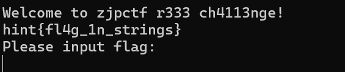

注意终端上面的提示，可以两种方式理解。

### 第一种：打开IDA，shift\+F12 或者 Views\-\>Open Subviews\-\>Strings

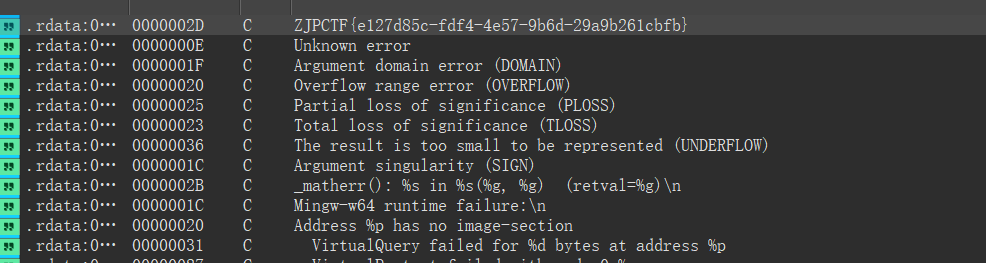

### 第二种：使用strings工具\+grep

```Plain Text
> strings .\signin_chal.exe | grep ZJPCTF
ZJPCTF{e127d85c-fdf4-4e57-9b6d-29a9b261cbfb}
```

输入flag,验证通过。

```Plain Text
Welcome to zjpctf r333 ch4113nge!
hint{fl4g_1n_strings}
Please input flag:
ZJPCTF{e127d85c-fdf4-4e57-9b6d-29a9b261cbfb}
ok!
```

`ZJPCTF{e127d85c-fdf4-4e57-9b6d-29a9b261cbfb}`

# ez\_smc

## 题目概述

咦？我的IDA怎么又坏了？！

提示：

1\.使用IDA调试前，需要将加密代码undefine掉，调试的时候解密代码出现错误分析的话，也需要undefine重新分析，调试完毕后若要再次调试，记得也要将错误代码undefine掉。在被解密的代码上打断点，rip跳转到该地址的时候，需要及时清除断点，以免再次调试时发生异常。

2\.目标平台: Linux kali 6\.8\.11\-amd64 \#1 SMP PREEMPT\_DYNAMIC Kali 6\.8\.11\-1kali2 \(2024\-05\-30\) x86\_64 GNU/Linux，srand未设置那么默认种子是1，解密rand序列复刻需要在目标平台类型下才能实现。

## 解题思路

### 获得函数代码

使用ida远程动态调试。

需要动态调试，才能分析出代码。

```C++
int __fastcall main(int argc, const char **argv, const char **envp)
{
  decrypt_range((__int64)&g_main_range);
  return ((__int64 (__fastcall *)(_UNKNOWN **, const char **))_start_enc_main_sec)(&g_main_range, argv);
}
```

断点先打这里。

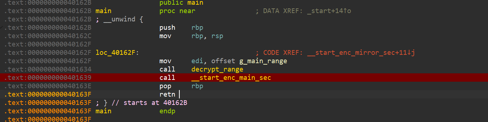

启动调试，之前错误结果全部undefine掉。

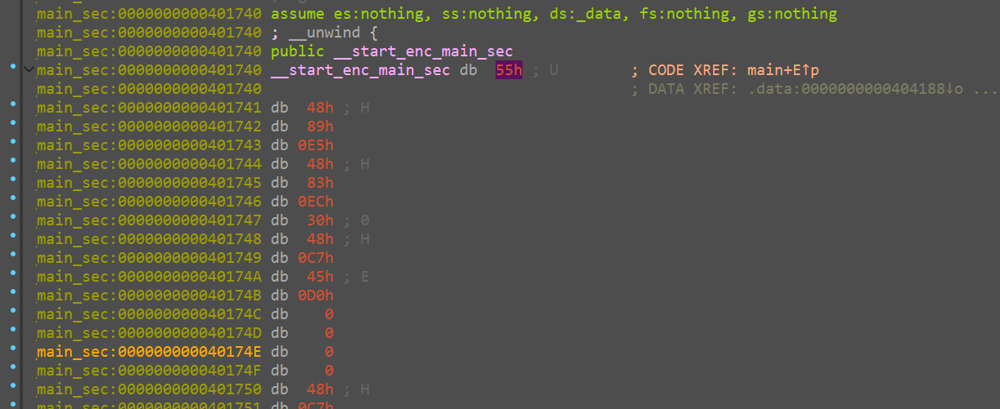

按下C反汇编。

务必去除所有的断点，按照执行顺序打断点，打错了，需要手动清理重新调试。

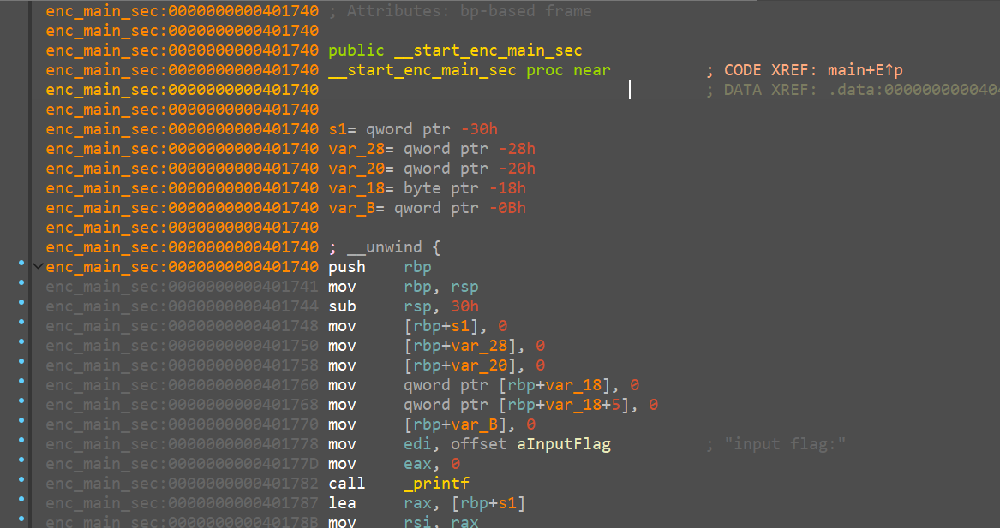

按下c键反汇编，tab/F5反编译。

```C++
__int64 _start_enc_main_sec()
{
  _QWORD s1[6]; // [rsp+0h] [rbp-30h] BYREF

  memset(s1, 0, 45);
  printf("input flag:");
  if ( (unsigned int)__isoc23_scanf("%44s", s1) != 1 )
    return 1;
  decrypt_range((__int64)&g_change_range);
  _stop_enc_shift_sec((__int64)s1);
  encrypt_range(&g_change_range);
  encrypt_range(&g_shift_range);
  encrypt_range(&g_mirror_range);
  if ( !memcmp(s1, &cipher, 0x2Cu) )
    printf("right!");
  else
    printf("wrong!");
  return 0;
}
```

发现里面还有解密函数，继续调试。

继续下断点，跳到这里后去掉断点。

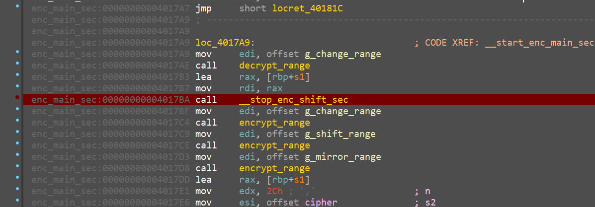

得到代码

```Plain Text
void __fastcall _stop_enc_shift_sec(unsigned __int8 *a1)
{
  decrypt_range((__int64)&g_mirror_range);
  _start_enc_mirror_sec(a1);
  decrypt_range((__int64)&g_shift_range);
  _start_enc_shift_sec();
  _start_enc_mirror_sec(a1);
  _start_enc_shift_sec();
  _start_enc_mirror_sec(a1);
}
```

在此打断点。

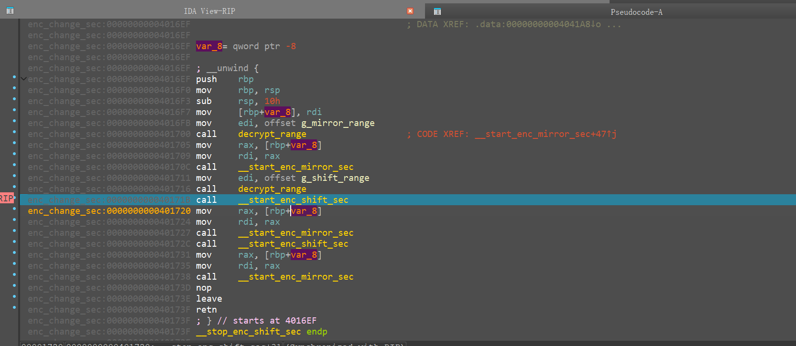

得到两个操作的解密代码。

```Java
void _start_enc_shift_sec()
{
  char v0; // [rsp+7h] [rbp-9h]
  int v1; // [rsp+8h] [rbp-8h]
  int i; // [rsp+Ch] [rbp-4h]

  for ( i = 255; i > 0; --i )
  {
    v1 = rand() % (i + 1);
    v0 = Sbox[i];
    Sbox[i] = Sbox[v1];
    Sbox[v1] = v0;
  }
}

__int64 __fastcall _start_enc_mirror_sec(unsigned __int8 *a1)
{
  __int64 result; // rax
  int i; // [rsp+14h] [rbp-4h]

  for ( i = 0; i <= 43; ++i )
  {
    result = (unsigned __int8)Sbox[a1[i]];
    a1[i] = result;
  }
  return result;
}
```

再静态分析找到密钥。

```Plain Text
.rodata:0000000000402020 cipher          db 0C1h
.rodata:0000000000402021                 db    0
.rodata:0000000000402022                 db  6Ah ; j
.rodata:0000000000402023                 db 0BAh
.rodata:0000000000402024                 db  4Ah ; J
.rodata:0000000000402025                 db 0E6h
.rodata:0000000000402026                 db  35h ; 5
.rodata:0000000000402027                 db 0C6h
.rodata:0000000000402028                 db  8Dh
.rodata:0000000000402029                 db  7Eh ; ~
.rodata:000000000040202A                 db 0F6h
.rodata:000000000040202B                 db  97h
.rodata:000000000040202C                 db  26h ; &
.rodata:000000000040202D                 db  7Eh ; ~
.rodata:000000000040202E                 db  8Dh
.rodata:000000000040202F                 db  56h ; V
.rodata:0000000000402030                 db  43h ; C
.rodata:0000000000402031                 db  8Dh
.rodata:0000000000402032                 db 0C6h
.rodata:0000000000402033                 db  2Ah ; *
.rodata:0000000000402034                 db  56h ; V
.rodata:0000000000402035                 db 0F6h
.rodata:0000000000402036                 db 0F6h
.rodata:0000000000402037                 db  14h
.rodata:0000000000402038                 db  8Dh
.rodata:0000000000402039                 db  56h ; V
.rodata:000000000040203A                 db  4Dh ; M
.rodata:000000000040203B                 db  8Dh
.rodata:000000000040203C                 db 0C6h
.rodata:000000000040203D                 db  14h
.rodata:000000000040203E                 db  56h ; V
.rodata:000000000040203F                 db  2Ah ; *
.rodata:0000000000402040                 db  2Ah ; *
.rodata:0000000000402041                 db  48h ; H
.rodata:0000000000402042                 db  97h
.rodata:0000000000402043                 db  13h
.rodata:0000000000402044                 db  26h ; &
.rodata:0000000000402045                 db  48h ; H
.rodata:0000000000402046                 db  2Ah ; *
.rodata:0000000000402047                 db  8Dh
.rodata:0000000000402048                 db  5Bh ; [
.rodata:0000000000402049                 db  8Dh
.rodata:000000000040204A                 db  26h ; &
.rodata:000000000040204B                 db    8
.rodata:000000000040204C                 db    0
.rodata:000000000040204D                 db    0
.rodata:000000000040204E                 db    0
.rodata:000000000040204F                 db    0
```

S盒。

```Plain Text
.data:0000000000404080 ; char Sbox[256]
.data:0000000000404080 Sbox            db 63h
.data:0000000000404081                 db  7Ch ; |
.data:0000000000404082                 db  77h ; w
.data:0000000000404083                 db  7Bh ; {
.data:0000000000404084                 db 0F2h
.data:0000000000404085                 db  6Bh ; k
.data:0000000000404086                 db  6Fh ; o
.data:0000000000404087                 db 0C5h
.data:0000000000404088                 db  30h ; 0
.data:0000000000404089                 db    1
.data:000000000040408A                 db  67h ; g
.data:000000000040408B                 db  2Bh ; +
.data:000000000040408C                 db 0FEh
.data:000000000040408D                 db 0D7h
.data:000000000040408E                 db 0ABh
.data:000000000040408F                 db  76h ; v
.data:0000000000404090                 db 0CAh
.data:0000000000404091                 db  82h
.data:0000000000404092                 db 0C9h
.data:0000000000404093                 db  7Dh ; }
.data:0000000000404094                 db 0FAh
.data:0000000000404095                 db  59h ; Y
.data:0000000000404096                 db  47h ; G
.data:0000000000404097                 db 0F0h
.data:0000000000404098                 db 0ADh
.data:0000000000404099                 db 0D4h
.data:000000000040409A                 db 0A2h
.data:000000000040409B                 db 0AFh
.data:000000000040409C                 db  9Ch
.data:000000000040409D                 db 0A4h
.data:000000000040409E                 db  72h ; r
.data:000000000040409F                 db 0C0h
.data:00000000004040A0                 db 0B7h
.data:00000000004040A1                 db 0FDh
.data:00000000004040A2                 db  93h
.data:00000000004040A3                 db  26h ; &
.data:00000000004040A4                 db  36h ; 6
.data:00000000004040A5                 db  3Fh ; ?
.data:00000000004040A6                 db 0F7h
.data:00000000004040A7                 db 0CCh
.data:00000000004040A8                 db  34h ; 4
.data:00000000004040A9                 db 0A5h
.data:00000000004040AA                 db 0E5h
.data:00000000004040AB                 db 0F1h
.data:00000000004040AC                 db  71h ; q
.data:00000000004040AD                 db 0D8h
.data:00000000004040AE                 db  31h ; 1
.data:00000000004040AF                 db  15h
.data:00000000004040B0                 db    4
.data:00000000004040B1                 db 0C7h
.data:00000000004040B2                 db  23h ; #
.data:00000000004040B3                 db 0C3h
.data:00000000004040B4                 db  18h
.data:00000000004040B5                 db  96h
.data:00000000004040B6                 db    5
.data:00000000004040B7                 db  9Ah
.data:00000000004040B8                 db    7
.data:00000000004040B9                 db  12h
.data:00000000004040BA                 db  80h
.data:00000000004040BB                 db 0E2h
.data:00000000004040BC                 db 0EBh
.data:00000000004040BD                 db  27h ; '
.data:00000000004040BE                 db 0B2h
.data:00000000004040BF                 db  75h ; u
.data:00000000004040C0                 db    9
.data:00000000004040C1                 db  83h
.data:00000000004040C2                 db  2Ch ; ,
.data:00000000004040C3                 db  1Ah
.data:00000000004040C4                 db  1Bh
.data:00000000004040C5                 db  6Eh ; n
.data:00000000004040C6                 db  5Ah ; Z
.data:00000000004040C7                 db 0A0h
.data:00000000004040C8                 db  52h ; R
.data:00000000004040C9                 db  3Bh ; ;
.data:00000000004040CA                 db 0D6h
.data:00000000004040CB                 db 0B3h
.data:00000000004040CC                 db  29h ; )
.data:00000000004040CD                 db 0E3h
.data:00000000004040CE                 db  2Fh ; /
.data:00000000004040CF                 db  84h
.data:00000000004040D0                 db  53h ; S
.data:00000000004040D1                 db 0D1h
.data:00000000004040D2                 db    0
.data:00000000004040D3                 db 0EDh
.data:00000000004040D4                 db  20h
.data:00000000004040D5                 db 0FCh
.data:00000000004040D6                 db 0B1h
.data:00000000004040D7                 db  5Bh ; [
.data:00000000004040D8                 db  6Ah ; j
.data:00000000004040D9                 db 0CBh
.data:00000000004040DA                 db 0BEh
.data:00000000004040DB                 db  39h ; 9
.data:00000000004040DC                 db  4Ah ; J
.data:00000000004040DD                 db  4Ch ; L
.data:00000000004040DE                 db  58h ; X
.data:00000000004040DF                 db 0CFh
.data:00000000004040E0                 db 0D0h
.data:00000000004040E1                 db 0EFh
.data:00000000004040E2                 db 0AAh
.data:00000000004040E3                 db 0FBh
.data:00000000004040E4                 db  43h ; C
.data:00000000004040E5                 db  4Dh ; M
.data:00000000004040E6                 db  33h ; 3
.data:00000000004040E7                 db  85h
.data:00000000004040E8                 db  45h ; E
.data:00000000004040E9                 db 0F9h
.data:00000000004040EA                 db    2
.data:00000000004040EB                 db  7Fh ; 
.data:00000000004040EC                 db  50h ; P
.data:00000000004040ED                 db  3Ch ; <
.data:00000000004040EE                 db  9Fh
.data:00000000004040EF                 db 0A8h
.data:00000000004040F0                 db  51h ; Q
.data:00000000004040F1                 db 0A3h
.data:00000000004040F2                 db  40h ; @
.data:00000000004040F3                 db  8Fh
.data:00000000004040F4                 db  92h
.data:00000000004040F5                 db  9Dh
.data:00000000004040F6                 db  38h ; 8
.data:00000000004040F7                 db 0F5h
.data:00000000004040F8                 db 0BCh
.data:00000000004040F9                 db 0B6h
.data:00000000004040FA                 db 0DAh
.data:00000000004040FB                 db  21h ; !
.data:00000000004040FC                 db  10h
.data:00000000004040FD                 db 0FFh
.data:00000000004040FE                 db 0F3h
.data:00000000004040FF                 db 0D2h
.data:0000000000404100                 db 0CDh
.data:0000000000404101                 db  0Ch
.data:0000000000404102                 db  13h
.data:0000000000404103                 db 0ECh
.data:0000000000404104                 db  5Fh ; _
.data:0000000000404105                 db  97h
.data:0000000000404106                 db  44h ; D
.data:0000000000404107                 db  17h
.data:0000000000404108                 db 0C4h
.data:0000000000404109                 db 0A7h
.data:000000000040410A                 db  7Eh ; ~
.data:000000000040410B                 db  3Dh ; =
.data:000000000040410C                 db  64h ; d
.data:000000000040410D                 db  5Dh ; ]
.data:000000000040410E                 db  19h
.data:000000000040410F                 db  73h ; s
.data:0000000000404110                 db  60h ; `
.data:0000000000404111                 db  81h
.data:0000000000404112                 db  4Fh ; O
.data:0000000000404113                 db 0DCh
.data:0000000000404114                 db  22h ; "
.data:0000000000404115                 db  2Ah ; *
.data:0000000000404116                 db  90h
.data:0000000000404117                 db  88h
.data:0000000000404118                 db  46h ; F
.data:0000000000404119                 db 0EEh
.data:000000000040411A                 db 0B8h
.data:000000000040411B                 db  14h
.data:000000000040411C                 db 0DEh
.data:000000000040411D                 db  5Eh ; ^
.data:000000000040411E                 db  0Bh
.data:000000000040411F                 db 0DBh
.data:0000000000404120                 db 0E0h
.data:0000000000404121                 db  32h ; 2
.data:0000000000404122                 db  3Ah ; :
.data:0000000000404123                 db  0Ah
.data:0000000000404124                 db  49h ; I
.data:0000000000404125                 db    6
.data:0000000000404126                 db  24h ; $
.data:0000000000404127                 db  5Ch ; \
.data:0000000000404128                 db 0C2h
.data:0000000000404129                 db 0D3h
.data:000000000040412A                 db 0ACh
.data:000000000040412B                 db  62h ; b
.data:000000000040412C                 db  91h
.data:000000000040412D                 db  95h
.data:000000000040412E                 db 0E4h
.data:000000000040412F                 db  79h ; y
.data:0000000000404130                 db 0E7h
.data:0000000000404131                 db 0C8h
.data:0000000000404132                 db  37h ; 7
.data:0000000000404133                 db  6Dh ; m
.data:0000000000404134                 db  8Dh
.data:0000000000404135                 db 0D5h
.data:0000000000404136                 db  4Eh ; N
.data:0000000000404137                 db 0A9h
.data:0000000000404138                 db  6Ch ; l
.data:0000000000404139                 db  56h ; V
.data:000000000040413A                 db 0F4h
.data:000000000040413B                 db 0EAh
.data:000000000040413C                 db  65h ; e
.data:000000000040413D                 db  7Ah ; z
.data:000000000040413E                 db 0AEh
.data:000000000040413F                 db    8
.data:0000000000404140                 db 0BAh
.data:0000000000404141                 db  78h ; x
.data:0000000000404142                 db  25h ; %
.data:0000000000404143                 db  2Eh ; .
.data:0000000000404144                 db  1Ch
.data:0000000000404145                 db 0A6h
.data:0000000000404146                 db 0B4h
.data:0000000000404147                 db 0C6h
.data:0000000000404148                 db 0E8h
.data:0000000000404149                 db 0DDh
.data:000000000040414A                 db  74h ; t
.data:000000000040414B                 db  1Fh
.data:000000000040414C                 db  4Bh ; K
.data:000000000040414D                 db 0BDh
.data:000000000040414E                 db  8Bh
.data:000000000040414F                 db  8Ah
.data:0000000000404150                 db  70h ; p
.data:0000000000404151                 db  3Eh ; >
.data:0000000000404152                 db 0B5h
.data:0000000000404153                 db  66h ; f
.data:0000000000404154                 db  48h ; H
.data:0000000000404155                 db    3
.data:0000000000404156                 db 0F6h
.data:0000000000404157                 db  0Eh
.data:0000000000404158                 db  61h ; a
.data:0000000000404159                 db  35h ; 5
.data:000000000040415A                 db  57h ; W
.data:000000000040415B                 db 0B9h
.data:000000000040415C                 db  86h
.data:000000000040415D                 db 0C1h
.data:000000000040415E                 db  1Dh
.data:000000000040415F                 db  9Eh
.data:0000000000404160                 db 0E1h
.data:0000000000404161                 db 0F8h
.data:0000000000404162                 db  98h
.data:0000000000404163                 db  11h
.data:0000000000404164                 db  69h ; i
.data:0000000000404165                 db 0D9h
.data:0000000000404166                 db  8Eh
.data:0000000000404167                 db  94h
.data:0000000000404168                 db  9Bh
.data:0000000000404169                 db  1Eh
.data:000000000040416A                 db  87h
.data:000000000040416B                 db 0E9h
.data:000000000040416C                 db 0CEh
.data:000000000040416D                 db  55h ; U
.data:000000000040416E                 db  28h ; (
.data:000000000040416F                 db 0DFh
.data:0000000000404170                 db  8Ch
.data:0000000000404171                 db 0A1h
.data:0000000000404172                 db  89h
.data:0000000000404173                 db  0Dh
.data:0000000000404174                 db 0BFh
.data:0000000000404175                 db 0E6h
.data:0000000000404176                 db  42h ; B
.data:0000000000404177                 db  68h ; h
.data:0000000000404178                 db  41h ; A
.data:0000000000404179                 db  99h
.data:000000000040417A                 db  2Dh ; -
.data:000000000040417B                 db  0Fh
.data:000000000040417C                 db 0B0h
.data:000000000040417D                 db  54h ; T
.data:000000000040417E                 db 0BBh
.data:000000000040417F                 db  16h
```

分析算法我们可以知道，用户输入会经过以下变换：

```Plain Text
S盒映射 -> 洗牌 -> S盒映射 -> 洗牌 -> S盒映射
```

我们需要取S盒两轮洗牌的值，或者复现洗牌算法，在linux上编写C语言脚本解密。

### 获得S盒

第二轮：

```C++
unsigned char Sbox2[] =
{
  0xC3, 0xAA, 0x5A, 0xD1, 0xB8, 0x3D, 0x30, 0x07, 0xE8, 0xE5, 
  0x7C, 0xEA, 0x00, 0x57, 0x74, 0xF0, 0x8D, 0xCE, 0xE3, 0x80, 
  0x4C, 0x53, 0x40, 0xC7, 0x42, 0x1F, 0x4D, 0x64, 0x69, 0x13, 
  0x25, 0xFE, 0x39, 0x92, 0xE4, 0x99, 0x7D, 0xF5, 0x71, 0x43, 
  0x6C, 0x75, 0x0B, 0xEC, 0x56, 0x46, 0x2A, 0xDD, 0x51, 0x6F, 
  0xAB, 0xFD, 0x8F, 0xEF, 0xA4, 0x8C, 0x17, 0x66, 0xB7, 0x7B, 
  0x48, 0xB0, 0xCA, 0x98, 0xC1, 0x0C, 0xD0, 0xF6, 0xB1, 0x78, 
  0x4B, 0xBB, 0xF2, 0xCB, 0xA2, 0xA7, 0x16, 0xDE, 0x6A, 0x1A, 
  0x35, 0x14, 0x06, 0x79, 0x61, 0xDF, 0x1D, 0x60, 0x7F, 0x8E, 
  0x5B, 0xBA, 0x2D, 0x1C, 0x5F, 0x90, 0xB3, 0xD4, 0xB6, 0xB4, 
  0x12, 0xCD, 0xFF, 0x91, 0x2E, 0x5C, 0xA6, 0xEE, 0x93, 0xFA, 
  0x87, 0xC0, 0x4E, 0x9F, 0x3A, 0x09, 0x9E, 0xD8, 0x0F, 0x10, 
  0x24, 0x2F, 0xA8, 0xDC, 0x02, 0x3E, 0x45, 0x6B, 0x55, 0x2B, 
  0xE0, 0xBD, 0x96, 0xA5, 0x6E, 0xAD, 0xC8, 0x5E, 0x44, 0x4F, 
  0xA1, 0x54, 0xC6, 0x86, 0x7A, 0x1E, 0xF9, 0x3F, 0x5D, 0xBF, 
  0xE2, 0xED, 0x3C, 0x18, 0x26, 0x28, 0x7E, 0x29, 0xF8, 0x2C, 
  0xD2, 0x81, 0xD9, 0x41, 0xAE, 0xB5, 0x27, 0x23, 0x9D, 0x21, 
  0x62, 0x95, 0x9C, 0x20, 0x50, 0xCF, 0x32, 0xD3, 0x83, 0xD6, 
  0x4A, 0x58, 0xBC, 0x47, 0x63, 0xC9, 0x97, 0xFC, 0x9B, 0x08, 
  0x8B, 0xE7, 0xC2, 0x05, 0x76, 0x70, 0xBE, 0x22, 0x31, 0xB2, 
  0x0D, 0x34, 0xA0, 0x8A, 0x94, 0x59, 0x72, 0x11, 0x01, 0x65, 
  0xD5, 0x52, 0xAC, 0xB9, 0xE6, 0x03, 0x84, 0x0A, 0xD7, 0x3B, 
  0xF4, 0x68, 0x67, 0xF7, 0xAF, 0xFB, 0x38, 0xF1, 0x49, 0xDA, 
  0x0E, 0xF3, 0xE9, 0xDB, 0x37, 0xCC, 0x9A, 0x89, 0xE1, 0xEB, 
  0x04, 0xA9, 0x19, 0x33, 0x15, 0x1B, 0xC5, 0x82, 0x36, 0xC4, 
  0x73, 0xA3, 0x77, 0x6D, 0x88, 0x85
};
```

第三轮：

```C++
unsigned char Sbox3[] =
{
  0xBB, 0x9A, 0x85, 0x64, 0x10, 0xF4, 0x33, 0x2A, 0x41, 0x58, 
  0xEE, 0x06, 0xE8, 0xD1, 0x7F, 0x32, 0x44, 0x67, 0x57, 0x47, 
  0x93, 0xD3, 0x2D, 0xA9, 0x11, 0x6F, 0xCA, 0x1C, 0x17, 0xCB, 
  0x53, 0x9E, 0xBC, 0x89, 0x23, 0x28, 0xF2, 0xEF, 0x97, 0x4B, 
  0x65, 0x39, 0xB7, 0xB1, 0x01, 0x66, 0x63, 0xD2, 0x94, 0xFE, 
  0x04, 0xFB, 0x81, 0x3B, 0x9C, 0x2C, 0x8C, 0x4A, 0x87, 0x49, 
  0x5C, 0x7E, 0xF9, 0x34, 0x51, 0x3A, 0xF6, 0xC0, 0xBF, 0x19, 
  0x07, 0xDB, 0xDD, 0xB6, 0xDC, 0xC3, 0x8F, 0xBA, 0x83, 0x12, 
  0x75, 0xB5, 0x91, 0x77, 0x79, 0x30, 0xA0, 0x78, 0xB0, 0xA6, 
  0x80, 0xE6, 0x8E, 0x22, 0x59, 0x0B, 0x50, 0x4E, 0x3F, 0x92, 
  0xB2, 0x5D, 0x7A, 0x95, 0xB9, 0xA4, 0x2E, 0xAE, 0xEC, 0xFA, 
  0xE3, 0xD7, 0x26, 0xD4, 0x96, 0x18, 0x09, 0x8B, 0xE2, 0x45, 
  0x82, 0x6A, 0x05, 0x1F, 0xB8, 0x2F, 0xB4, 0xCD, 0x9B, 0xF8, 
  0x7B, 0x40, 0x56, 0x08, 0x72, 0x42, 0x90, 0x5E, 0x16, 0xC1, 
  0x38, 0xD8, 0xD9, 0xE1, 0x52, 0x27, 0x35, 0x7C, 0x37, 0x84, 
  0x98, 0xE5, 0x0C, 0x36, 0x6D, 0x1A, 0xDF, 0x60, 0xC9, 0x9D, 
  0x5F, 0xDA, 0xAB, 0x8D, 0xAD, 0xA7, 0xF5, 0xDE, 0xCC, 0xE4, 
  0x8A, 0x0D, 0x3C, 0xAC, 0x6B, 0xC2, 0x99, 0xE7, 0x43, 0xC4, 
  0xCE, 0x55, 0x46, 0xA3, 0x2B, 0x4F, 0x1B, 0xE9, 0x0F, 0xF3, 
  0x4C, 0x76, 0x61, 0x0A, 0xBD, 0x1E, 0xC8, 0x69, 0xF1, 0x0E, 
  0xA8, 0xE0, 0x88, 0xEB, 0x25, 0x86, 0xF0, 0x31, 0x3D, 0xA2, 
  0xC7, 0xAF, 0x5A, 0xD0, 0xC5, 0xED, 0xFC, 0x6C, 0xCF, 0x9F, 
  0x29, 0xBE, 0x13, 0x20, 0x02, 0xA5, 0xC6, 0x4D, 0xF7, 0x62, 
  0x00, 0xEA, 0xA1, 0xD6, 0x71, 0x5B, 0xFD, 0xAA, 0x68, 0x7D, 
  0x15, 0xFF, 0x54, 0x3E, 0x74, 0x6E, 0x14, 0xB3, 0x1D, 0x03, 
  0x70, 0xD5, 0x73, 0x48, 0x24, 0x21
};
```

S盒两轮洗牌的值可以调试获取，在\_start\_enc\_shift\_sec调用后读取。

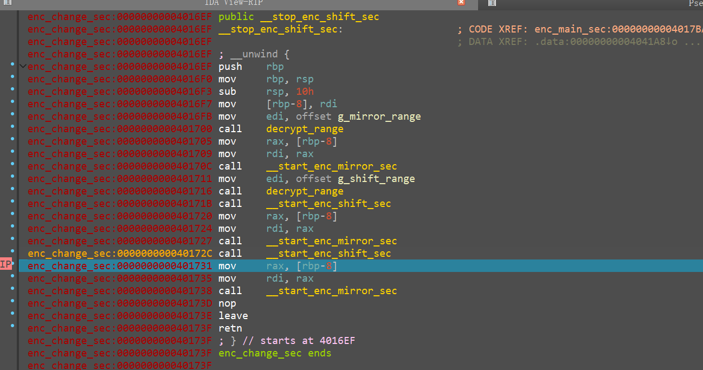

## 解密脚本

```C++
#include <stdio.h>
#include <stdint.h>

uint8_t cipher[44]={
    0xc1, 0x00, 0x6a, 0xba, 0x4a, 0xe6, 0x35, 0xc6, 0x8d, 0x7e, 0xf6, 
     0x97, 0x26, 0x7e, 0x8d, 0x56, 0x43, 0x8d, 0xc6, 0x2a, 0x56, 0xf6, 
     0xf6, 0x14, 0x8d, 0x56, 0x4d, 0x8d, 0xc6, 0x14, 0x56, 0x2a, 0x2a, 
     0x48, 0x97, 0x13, 0x26, 0x48, 0x2a, 0x8d, 0x5b, 0x8d, 0x26, 0x08
};

uint8_t Sbox3[] =
 {
    0xBB, 0x9A, 0x85, 0x64, 0x10, 0xF4, 0x33, 0x2A, 0x41, 0x58, 
     0xEE, 0x06, 0xE8, 0xD1, 0x7F, 0x32, 0x44, 0x67, 0x57, 0x47, 
     0x93, 0xD3, 0x2D, 0xA9, 0x11, 0x6F, 0xCA, 0x1C, 0x17, 0xCB, 
     0x53, 0x9E, 0xBC, 0x89, 0x23, 0x28, 0xF2, 0xEF, 0x97, 0x4B, 
     0x65, 0x39, 0xB7, 0xB1, 0x01, 0x66, 0x63, 0xD2, 0x94, 0xFE, 
     0x04, 0xFB, 0x81, 0x3B, 0x9C, 0x2C, 0x8C, 0x4A, 0x87, 0x49, 
     0x5C, 0x7E, 0xF9, 0x34, 0x51, 0x3A, 0xF6, 0xC0, 0xBF, 0x19, 
     0x07, 0xDB, 0xDD, 0xB6, 0xDC, 0xC3, 0x8F, 0xBA, 0x83, 0x12, 
     0x75, 0xB5, 0x91, 0x77, 0x79, 0x30, 0xA0, 0x78, 0xB0, 0xA6, 
     0x80, 0xE6, 0x8E, 0x22, 0x59, 0x0B, 0x50, 0x4E, 0x3F, 0x92, 
     0xB2, 0x5D, 0x7A, 0x95, 0xB9, 0xA4, 0x2E, 0xAE, 0xEC, 0xFA, 
     0xE3, 0xD7, 0x26, 0xD4, 0x96, 0x18, 0x09, 0x8B, 0xE2, 0x45, 
     0x82, 0x6A, 0x05, 0x1F, 0xB8, 0x2F, 0xB4, 0xCD, 0x9B, 0xF8, 
     0x7B, 0x40, 0x56, 0x08, 0x72, 0x42, 0x90, 0x5E, 0x16, 0xC1, 
     0x38, 0xD8, 0xD9, 0xE1, 0x52, 0x27, 0x35, 0x7C, 0x37, 0x84, 
     0x98, 0xE5, 0x0C, 0x36, 0x6D, 0x1A, 0xDF, 0x60, 0xC9, 0x9D, 
     0x5F, 0xDA, 0xAB, 0x8D, 0xAD, 0xA7, 0xF5, 0xDE, 0xCC, 0xE4, 
     0x8A, 0x0D, 0x3C, 0xAC, 0x6B, 0xC2, 0x99, 0xE7, 0x43, 0xC4, 
     0xCE, 0x55, 0x46, 0xA3, 0x2B, 0x4F, 0x1B, 0xE9, 0x0F, 0xF3, 
     0x4C, 0x76, 0x61, 0x0A, 0xBD, 0x1E, 0xC8, 0x69, 0xF1, 0x0E, 
     0xA8, 0xE0, 0x88, 0xEB, 0x25, 0x86, 0xF0, 0x31, 0x3D, 0xA2, 
     0xC7, 0xAF, 0x5A, 0xD0, 0xC5, 0xED, 0xFC, 0x6C, 0xCF, 0x9F, 
     0x29, 0xBE, 0x13, 0x20, 0x02, 0xA5, 0xC6, 0x4D, 0xF7, 0x62, 
     0x00, 0xEA, 0xA1, 0xD6, 0x71, 0x5B, 0xFD, 0xAA, 0x68, 0x7D, 
     0x15, 0xFF, 0x54, 0x3E, 0x74, 0x6E, 0x14, 0xB3, 0x1D, 0x03, 
     0x70, 0xD5, 0x73, 0x48, 0x24, 0x21
};

uint8_t Sbox2[] =
 {
    0xC3, 0xAA, 0x5A, 0xD1, 0xB8, 0x3D, 0x30, 0x07, 0xE8, 0xE5, 
     0x7C, 0xEA, 0x00, 0x57, 0x74, 0xF0, 0x8D, 0xCE, 0xE3, 0x80, 
     0x4C, 0x53, 0x40, 0xC7, 0x42, 0x1F, 0x4D, 0x64, 0x69, 0x13, 
     0x25, 0xFE, 0x39, 0x92, 0xE4, 0x99, 0x7D, 0xF5, 0x71, 0x43, 
     0x6C, 0x75, 0x0B, 0xEC, 0x56, 0x46, 0x2A, 0xDD, 0x51, 0x6F, 
     0xAB, 0xFD, 0x8F, 0xEF, 0xA4, 0x8C, 0x17, 0x66, 0xB7, 0x7B, 
     0x48, 0xB0, 0xCA, 0x98, 0xC1, 0x0C, 0xD0, 0xF6, 0xB1, 0x78, 
     0x4B, 0xBB, 0xF2, 0xCB, 0xA2, 0xA7, 0x16, 0xDE, 0x6A, 0x1A, 
     0x35, 0x14, 0x06, 0x79, 0x61, 0xDF, 0x1D, 0x60, 0x7F, 0x8E, 
     0x5B, 0xBA, 0x2D, 0x1C, 0x5F, 0x90, 0xB3, 0xD4, 0xB6, 0xB4, 
     0x12, 0xCD, 0xFF, 0x91, 0x2E, 0x5C, 0xA6, 0xEE, 0x93, 0xFA, 
     0x87, 0xC0, 0x4E, 0x9F, 0x3A, 0x09, 0x9E, 0xD8, 0x0F, 0x10, 
     0x24, 0x2F, 0xA8, 0xDC, 0x02, 0x3E, 0x45, 0x6B, 0x55, 0x2B, 
     0xE0, 0xBD, 0x96, 0xA5, 0x6E, 0xAD, 0xC8, 0x5E, 0x44, 0x4F, 
     0xA1, 0x54, 0xC6, 0x86, 0x7A, 0x1E, 0xF9, 0x3F, 0x5D, 0xBF, 
     0xE2, 0xED, 0x3C, 0x18, 0x26, 0x28, 0x7E, 0x29, 0xF8, 0x2C, 
     0xD2, 0x81, 0xD9, 0x41, 0xAE, 0xB5, 0x27, 0x23, 0x9D, 0x21, 
     0x62, 0x95, 0x9C, 0x20, 0x50, 0xCF, 0x32, 0xD3, 0x83, 0xD6, 
     0x4A, 0x58, 0xBC, 0x47, 0x63, 0xC9, 0x97, 0xFC, 0x9B, 0x08, 
     0x8B, 0xE7, 0xC2, 0x05, 0x76, 0x70, 0xBE, 0x22, 0x31, 0xB2, 
     0x0D, 0x34, 0xA0, 0x8A, 0x94, 0x59, 0x72, 0x11, 0x01, 0x65, 
     0xD5, 0x52, 0xAC, 0xB9, 0xE6, 0x03, 0x84, 0x0A, 0xD7, 0x3B, 
     0xF4, 0x68, 0x67, 0xF7, 0xAF, 0xFB, 0x38, 0xF1, 0x49, 0xDA, 
     0x0E, 0xF3, 0xE9, 0xDB, 0x37, 0xCC, 0x9A, 0x89, 0xE1, 0xEB, 
     0x04, 0xA9, 0x19, 0x33, 0x15, 0x1B, 0xC5, 0x82, 0x36, 0xC4, 
     0x73, 0xA3, 0x77, 0x6D, 0x88, 0x85
};

uint8_t Sbox1[256] = {
    0x63, 0x7C, 0x77, 0x7B, 0xF2, 0x6B, 0x6F, 0xC5, 0x30, 0x01, 0x67, 0x2B,
    0xFE, 0xD7, 0xAB, 0x76, 0xCA, 0x82, 0xC9, 0x7D, 0xFA, 0x59, 0x47, 0xF0,
    0xAD, 0xD4, 0xA2, 0xAF, 0x9C, 0xA4, 0x72, 0xC0, 0xB7, 0xFD, 0x93, 0x26,
    0x36, 0x3F, 0xF7, 0xCC, 0x34, 0xA5, 0xE5, 0xF1, 0x71, 0xD8, 0x31, 0x15,
    0x04, 0xC7, 0x23, 0xC3, 0x18, 0x96, 0x05, 0x9A, 0x07, 0x12, 0x80, 0xE2,
    0xEB, 0x27, 0xB2, 0x75, 0x09, 0x83, 0x2C, 0x1A, 0x1B, 0x6E, 0x5A, 0xA0,
    0x52, 0x3B, 0xD6, 0xB3, 0x29, 0xE3, 0x2F, 0x84, 0x53, 0xD1, 0x00, 0xED,
    0x20, 0xFC, 0xB1, 0x5B, 0x6A, 0xCB, 0xBE, 0x39, 0x4A, 0x4C, 0x58, 0xCF,
    0xD0, 0xEF, 0xAA, 0xFB, 0x43, 0x4D, 0x33, 0x85, 0x45, 0xF9, 0x02, 0x7F,
    0x50, 0x3C, 0x9F, 0xA8, 0x51, 0xA3, 0x40, 0x8F, 0x92, 0x9D, 0x38, 0xF5,
    0xBC, 0xB6, 0xDA, 0x21, 0x10, 0xFF, 0xF3, 0xD2, 0xCD, 0x0C, 0x13, 0xEC,
    0x5F, 0x97, 0x44, 0x17, 0xC4, 0xA7, 0x7E, 0x3D, 0x64, 0x5D, 0x19, 0x73,
    0x60, 0x81, 0x4F, 0xDC, 0x22, 0x2A, 0x90, 0x88, 0x46, 0xEE, 0xB8, 0x14,
    0xDE, 0x5E, 0x0B, 0xDB, 0xE0, 0x32, 0x3A, 0x0A, 0x49, 0x06, 0x24, 0x5C,
    0xC2, 0xD3, 0xAC, 0x62, 0x91, 0x95, 0xE4, 0x79, 0xE7, 0xC8, 0x37, 0x6D,
    0x8D, 0xD5, 0x4E, 0xA9, 0x6C, 0x56, 0xF4, 0xEA, 0x65, 0x7A, 0xAE, 0x08,
    0xBA, 0x78, 0x25, 0x2E, 0x1C, 0xA6, 0xB4, 0xC6, 0xE8, 0xDD, 0x74, 0x1F,
    0x4B, 0xBD, 0x8B, 0x8A, 0x70, 0x3E, 0xB5, 0x66, 0x48, 0x03, 0xF6, 0x0E,
    0x61, 0x35, 0x57, 0xB9, 0x86, 0xC1, 0x1D, 0x9E, 0xE1, 0xF8, 0x98, 0x11,
    0x69, 0xD9, 0x8E, 0x94, 0x9B, 0x1E, 0x87, 0xE9, 0xCE, 0x55, 0x28, 0xDF,
    0x8C, 0xA1, 0x89, 0x0D, 0xBF, 0xE6, 0x42, 0x68, 0x41, 0x99, 0x2D, 0x0F,
    0xB0, 0x54, 0xBB, 0x16
};

uint8_t invS3[256]={};
uint8_t invS2[256]={};
uint8_t invS1[256]={};

uint8_t out[44]={};

int main(){
    for(int i=0;i<256;i++){
        invS3[Sbox3[i]]=i;
        invS2[Sbox2[i]]=i;
        invS1[Sbox1[i]]=i;
    }
    for(int i=0;i<44;i++){
        out[i]=invS1[invS2[invS3[cipher[i]]]];
        printf("%c",out[i]);
    }
 }
```

`ZJPCTF{5c64736c-1c58-44dc-9c5d-88f7e3f8cac3}`

## 题目源码

```C++
#define _GNU_SOURCE
#include <stdint.h>
#include <stdio.h>
#include <stdlib.h>
#include <string.h>
#include <sys/mman.h>
#include <unistd.h>

#define FLAG_LEN 44
#define ARRAY_LEN(x) (sizeof(x) / sizeof((x)[0]))

static uint8_t Sbox[256] = {
    0x63, 0x7C, 0x77, 0x7B, 0xF2, 0x6B, 0x6F, 0xC5, 0x30, 0x01, 0x67, 0x2B,
    0xFE, 0xD7, 0xAB, 0x76, 0xCA, 0x82, 0xC9, 0x7D, 0xFA, 0x59, 0x47, 0xF0,
    0xAD, 0xD4, 0xA2, 0xAF, 0x9C, 0xA4, 0x72, 0xC0, 0xB7, 0xFD, 0x93, 0x26,
    0x36, 0x3F, 0xF7, 0xCC, 0x34, 0xA5, 0xE5, 0xF1, 0x71, 0xD8, 0x31, 0x15,
    0x04, 0xC7, 0x23, 0xC3, 0x18, 0x96, 0x05, 0x9A, 0x07, 0x12, 0x80, 0xE2,
    0xEB, 0x27, 0xB2, 0x75, 0x09, 0x83, 0x2C, 0x1A, 0x1B, 0x6E, 0x5A, 0xA0,
    0x52, 0x3B, 0xD6, 0xB3, 0x29, 0xE3, 0x2F, 0x84, 0x53, 0xD1, 0x00, 0xED,
    0x20, 0xFC, 0xB1, 0x5B, 0x6A, 0xCB, 0xBE, 0x39, 0x4A, 0x4C, 0x58, 0xCF,
    0xD0, 0xEF, 0xAA, 0xFB, 0x43, 0x4D, 0x33, 0x85, 0x45, 0xF9, 0x02, 0x7F,
    0x50, 0x3C, 0x9F, 0xA8, 0x51, 0xA3, 0x40, 0x8F, 0x92, 0x9D, 0x38, 0xF5,
    0xBC, 0xB6, 0xDA, 0x21, 0x10, 0xFF, 0xF3, 0xD2, 0xCD, 0x0C, 0x13, 0xEC,
    0x5F, 0x97, 0x44, 0x17, 0xC4, 0xA7, 0x7E, 0x3D, 0x64, 0x5D, 0x19, 0x73,
    0x60, 0x81, 0x4F, 0xDC, 0x22, 0x2A, 0x90, 0x88, 0x46, 0xEE, 0xB8, 0x14,
    0xDE, 0x5E, 0x0B, 0xDB, 0xE0, 0x32, 0x3A, 0x0A, 0x49, 0x06, 0x24, 0x5C,
    0xC2, 0xD3, 0xAC, 0x62, 0x91, 0x95, 0xE4, 0x79, 0xE7, 0xC8, 0x37, 0x6D,
    0x8D, 0xD5, 0x4E, 0xA9, 0x6C, 0x56, 0xF4, 0xEA, 0x65, 0x7A, 0xAE, 0x08,
    0xBA, 0x78, 0x25, 0x2E, 0x1C, 0xA6, 0xB4, 0xC6, 0xE8, 0xDD, 0x74, 0x1F,
    0x4B, 0xBD, 0x8B, 0x8A, 0x70, 0x3E, 0xB5, 0x66, 0x48, 0x03, 0xF6, 0x0E,
    0x61, 0x35, 0x57, 0xB9, 0x86, 0xC1, 0x1D, 0x9E, 0xE1, 0xF8, 0x98, 0x11,
    0x69, 0xD9, 0x8E, 0x94, 0x9B, 0x1E, 0x87, 0xE9, 0xCE, 0x55, 0x28, 0xDF,
    0x8C, 0xA1, 0x89, 0x0D, 0xBF, 0xE6, 0x42, 0x68, 0x41, 0x99, 0x2D, 0x0F,
    0xB0, 0x54, 0xBB, 0x16
};
//ZJPCTF{5c64736c-1c58-44dc-9c5d-88f7e3f8cac3}
static const uint8_t cipher[FLAG_LEN] = {
    0xc1, 0x00, 0x6a, 0xba, 0x4a, 0xe6, 0x35, 0xc6, 0x8d, 0x7e, 0xf6, 
    0x97, 0x26, 0x7e, 0x8d, 0x56, 0x43, 0x8d, 0xc6, 0x2a, 0x56, 0xf6, 
    0xf6, 0x14, 0x8d, 0x56, 0x4d, 0x8d, 0xc6, 0x14, 0x56, 0x2a, 0x2a, 
    0x48, 0x97, 0x13, 0x26, 0x48, 0x2a, 0x8d, 0x5b, 0x8d, 0x26, 0x08
};

static const uint8_t kRc4Key[] = {
    0x65, 0x7a, 0x5f, 0x73, 0x6d, 0x63, 0x5f, 0x72,
    0x63, 0x34, 0x5f, 0x6b, 0x65, 0x79, 0x21
};

extern uint8_t __start_enc_main_sec[];
extern uint8_t __stop_enc_main_sec[];
extern uint8_t __start_enc_change_sec[];
extern uint8_t __stop_enc_change_sec[];
extern uint8_t __start_enc_shift_sec[];
extern uint8_t __stop_enc_shift_sec[];
extern uint8_t __start_enc_mirror_sec[];
extern uint8_t __stop_enc_mirror_sec[];

typedef struct ProtectedRange {
    const char *name;
    uint8_t *start;
    uint8_t *end;
    int is_decrypted;
} ProtectedRange;

static ProtectedRange g_main_range = {
    "main_payload", __start_enc_main_sec, __stop_enc_main_sec, 0
};
static ProtectedRange g_change_range = {
    "change", __start_enc_change_sec, __stop_enc_change_sec, 0
};
static ProtectedRange g_shift_range = {
    "shift", __start_enc_shift_sec, __stop_enc_shift_sec, 0
};
static ProtectedRange g_mirror_range = {
    "mirror", __start_enc_mirror_sec, __stop_enc_mirror_sec, 0
};

static void rc4_apply(uint8_t *buf, size_t len) {
    uint8_t s[256];
    uint8_t j = 0;
    size_t i;

    for (i = 0; i < ARRAY_LEN(s); ++i) {
        s[i] = (uint8_t)i;
    }

    for (i = 0; i < ARRAY_LEN(s); ++i) {
        j = (uint8_t)(j + s[i] + kRc4Key[i % ARRAY_LEN(kRc4Key)]);
        uint8_t tmp = s[i];
        s[i] = s[j];
        s[j] = tmp;
    }

    i = 0;
    j = 0;
    for (size_t idx = 0; idx < len; ++idx) {
        i = (i + 1U) & 0xffU;
        j = (uint8_t)(j + s[i]);
        uint8_t tmp = s[i];
        s[i] = s[j];
        s[j] = tmp;
        buf[idx] ^= s[(uint8_t)(s[i] + s[j])];
    }
}

static void fatal_perror(const char *what) {
    perror(what);
    _exit(1);
}

static void set_rxw(void *addr, size_t len) {
    const long page_size = sysconf(_SC_PAGESIZE);
    if (page_size <= 0) {
        fputs("sysconf(_SC_PAGESIZE) failed\n", stderr);
        _exit(1);
    }

    uintptr_t start = (uintptr_t)addr & ~((uintptr_t)page_size - 1U);
    uintptr_t end = ((uintptr_t)addr + len + (uintptr_t)page_size - 1U) &
                    ~((uintptr_t)page_size - 1U);

    if (mprotect((void *)start, end - start, PROT_READ | PROT_WRITE | PROT_EXEC) != 0) {
        fatal_perror("mprotect RWX");
    }
}

static void set_rx(void *addr, size_t len) {
    const long page_size = sysconf(_SC_PAGESIZE);
    if (page_size <= 0) {
        fputs("sysconf(_SC_PAGESIZE) failed\n", stderr);
        _exit(1);
    }

    uintptr_t start = (uintptr_t)addr & ~((uintptr_t)page_size - 1U);
    uintptr_t end = ((uintptr_t)addr + len + (uintptr_t)page_size - 1U) &
                    ~((uintptr_t)page_size - 1U);

    if (mprotect((void *)start, end - start, PROT_READ | PROT_EXEC) != 0) {
        fatal_perror("mprotect RX");
    }
}

static void crypt_range(ProtectedRange *range, int want_decrypted) {
    size_t len;

    if (range->is_decrypted == want_decrypted) {
        return;
    }

    len = (size_t)(range->end - range->start);
    if (len == 0) {
        fprintf(stderr, "empty protected range: %s\n", range->name);
        _exit(1);
    }

    set_rxw(range->start, len);
    rc4_apply(range->start, len);
    __builtin___clear_cache((char *)range->start, (char *)range->end);
    set_rx(range->start, len);
    range->is_decrypted = want_decrypted;
}

static void decrypt_range(ProtectedRange *range) {
    crypt_range(range, 1);
}

static void encrypt_range(ProtectedRange *range) {
    crypt_range(range, 0);
}

static __attribute__((noinline, noclone, used, section("enc_mirror_sec")))
void protected_mirror(uint8_t *input) {
    for (int i = 0; i < FLAG_LEN; ++i) {
        input[i] = Sbox[input[i]];
    }
}

static __attribute__((noinline, noclone, used, section("enc_shift_sec")))
void protected_shift(void) {
    for (int i = 255; i > 0; --i) {
        int j = rand() % (i + 1);
        uint8_t temp = Sbox[i];
        Sbox[i] = Sbox[j];
        Sbox[j] = temp;
    }
}

static __attribute__((noinline, noclone, used, section("enc_change_sec")))
void protected_change(uint8_t *input) {
    decrypt_range(&g_mirror_range);
    protected_mirror(input);
    decrypt_range(&g_shift_range);
    protected_shift();
    protected_mirror(input);
    protected_shift();
    protected_mirror(input);
}

static __attribute__((noinline, noclone, used, section("enc_main_sec")))
int protected_main(void) {
    uint8_t input[FLAG_LEN + 1] = {0};

    printf("input flag:");
    if (scanf("%44s", input) != 1) {
        return 1;
    }

    decrypt_range(&g_change_range);
    protected_change(input);
    encrypt_range(&g_change_range);
    encrypt_range(&g_shift_range);
    encrypt_range(&g_mirror_range);
    /*
    for(int i=0;i<FLAG_LEN;i++){
        printf("0x%02x, ",(unsigned char)input[i]);
    }
    printf("\n");
    */
    if (memcmp(input, cipher, FLAG_LEN) == 0) {
        printf("right!");
    } else {
        printf("wrong!");
    }
    return 0;
}

int main(void) {
    decrypt_range(&g_main_range);
    return protected_main();
}

```

编译脚本：

```Python
#!/usr/bin/env python3
import argparse
import struct
import sys

RC4_KEY = bytes([
    0x65, 0x7A, 0x5F, 0x73, 0x6D, 0x63, 0x5F, 0x72,
    0x63, 0x34, 0x5F, 0x6B, 0x65, 0x79, 0x21,
])
TARGET_SECTIONS = {
    "enc_main_sec",
    "enc_change_sec",
    "enc_shift_sec",
    "enc_mirror_sec",
}

def rc4_apply(data: bytes) -> bytes:
    s = list(range(256))
    j = 0
    for i in range(256):
        j = (j + s[i] + RC4_KEY[i % len(RC4_KEY)]) & 0xFF
        s[i], s[j] = s[j], s[i]

    i = 0
    j = 0
    out = bytearray(data)
    for idx, value in enumerate(out):
        i = (i + 1) & 0xFF
        j = (j + s[i]) & 0xFF
        s[i], s[j] = s[j], s[i]
        out[idx] = value ^ s[(s[i] + s[j]) & 0xFF]
    return bytes(out)

def parse_elf_sections(blob: bytes):
    if blob[:4] != b"\x7fELF":
        raise ValueError("not an ELF file")
    if blob[4] != 2:
        raise ValueError("only ELF64 is supported")
    if blob[5] != 1:
        raise ValueError("only little-endian ELF is supported")

    ehdr = struct.unpack_from("<16sHHIQQQIHHHHHH", blob, 0)
    e_shoff = ehdr[6]
    e_shentsize = ehdr[11]
    e_shnum = ehdr[12]
    e_shstrndx = ehdr[13]

    sections = []
    for idx in range(e_shnum):
        off = e_shoff + idx * e_shentsize
        sh = struct.unpack_from("<IIQQQQIIQQ", blob, off)
        sections.append({
            "name_off": sh[0],
            "type": sh[1],
            "flags": sh[2],
            "addr": sh[3],
            "offset": sh[4],
            "size": sh[5],
            "link": sh[6],
            "info": sh[7],
            "addralign": sh[8],
            "entsize": sh[9],
        })

    shstr = sections[e_shstrndx]
    shstrtab = blob[shstr["offset"]:shstr["offset"] + shstr["size"]]
    for sec in sections:
        name_end = shstrtab.find(b"\x00", sec["name_off"])
        sec["name"] = shstrtab[sec["name_off"]:name_end].decode("ascii")
    return sections

def seal(path: str):
    blob = bytearray(open(path, "rb").read())
    sections = parse_elf_sections(blob)
    found = set()

    for sec in sections:
        if sec["name"] not in TARGET_SECTIONS:
            continue
        start = sec["offset"]
        end = start + sec["size"]
        blob[start:end] = rc4_apply(blob[start:end])
        found.add(sec["name"])

    missing = TARGET_SECTIONS - found
    if missing:
        raise ValueError(f"missing target sections: {', '.join(sorted(missing))}")

    with open(path, "wb") as f:
        f.write(blob)

def main():
    parser = argparse.ArgumentParser(description="RC4-encrypt protected ELF sections in place.")
    parser.add_argument("elf", help="path to the compiled ELF file")
    args = parser.parse_args()

    try:
        seal(args.elf)
    except Exception as exc:
        print(f"seal failed: {exc}", file=sys.stderr)
        return 1
    return 0

if __name__ == "__main__":
    sys.exit(main())

```

编译shell脚本。

```Plain Text
gcc -O0 -fno-pie -no-pie smc.c -o smc
python3 seal_sections.py ./smc
```

# random

## 题目概述

开发者尝试以固定种子的伪随机控制流来保护flag。低调的黑客一眼就就看到了这个程序的破绽，他说：“硬解嘛……也可以。不过最好的办法是输入特定的字符，看看特定位置上输出的是什么。”

提示：该程序的加密算法看似通过伪随机隐藏了关键运算数据和控制流，但存在非常严重的安全隐患。输出的密文字节仅仅与输入的明文字节和输入的明文字节的位置有关，而与输入的明文字节周边的字节无关，尝试获取明文字节\+位置与输出密文的映射表，进行密码学攻击。

## 解题思路

程序主函数：

```C++
__int64 __fastcall main()
{
  unsigned __int8 input[48]; // [rsp+20h] [rbp-30h] BYREF

  _main();
  printf("ZJPCTF r333 challenge. Use frida to get the flag!\n");
  printf("Please input flag:");
  memset(input, 0, sizeof(input));
  scanf("%44s", input);
  check(input, 48);
  if ( !memcmp(input, cipher, 0x30u) )
    printf("right!");
  else
    printf("wrong!");
  return 0;
}
```

提示要用Frida。

反编译得到的check函数：

```C++
uint8_t *__cdecl check(uint8_t *input, int len)
{
  uint8_t *result; // rax
  TransformFunc *v3; // rbx
  int v4; // eax
  int i_0; // [rsp+30h] [rbp-8h]
  int i; // [rsp+34h] [rbp-4h]

  for ( i = 0; ; ++i )
  {
    result = (uint8_t *)(unsigned int)i;
    if ( i >= len )
      break;
    input[i] ^= rand() % 256;
  }
  for ( i_0 = 0; i_0 <= 99; ++i_0 )
  {
    v3 = func_ptr;
    v4 = rand();
    result = (uint8_t *)((__int64 (__fastcall *)(uint8_t *, _QWORD, uint8_t *))v3[v4 % 3])(
                          input,
                          (unsigned int)len,
                          key);
  }
  return result;
}
```

在汇编末尾发现花指令。

```Assembly language
text:00000001400018D1 loc_1400018D1:                          ; CODE XREF: check(uchar *,int)+63↑j
.text:00000001400018D1                 cmp     [rbp+10h+i_0], 63h ; 'c'
.text:00000001400018D5                 jle     short loc_140001881
.text:00000001400018D7                 call    $+5
.text:00000001400018DC                 db      36h
.text:00000001400018DC                 add     [rsp+48h+var_48], 13h
.text:00000001400018E1                 retn
.text:00000001400018E1 ; ---------------------------------------------------------------------------
.text:00000001400018E2                 dw 8EE9h, 0FFFFh, 0E9FFh
.text:00000001400018E8                 dq 485A47E97FFFFFFFh, 0D0FF000129BA058Bh, 74C084C0950FC085h
.text:0000000140001900                 dq 0D7E800000000B911h, 0C886E8C189FFFFFCh, 0F445C70000h
.text:0000000140001918                 dq 170E1D8B4850EB00h, 890000C889E80001h, 56C06948C16348C1h
.text:0000000140001930                 dq 8920E8C148555555h, 0C289D0291FFAC1CAh, 0D029C889C201D201h
.text:0000000140001948                 dq 14803E0C1489848h, 4C28458B088B4CD8h, 0C2890000D6E2058Dh
.text:0000000140001960                 dq 83D1FF41204D8B48h, 18FF47D8101F445h, 20458B48A77E0000h
.text:0000000140001978 ; ---------------------------------------------------------------------------
.text:0000000140001978                 add     rsp, 38h
.text:000000014000197C                 pop     rbx
.text:000000014000197D                 pop     rbp
.text:000000014000197E                 retn
.text:000000014000197E _Z5checkPhi     endp ; sp-analysis failed
```

花指令call后将当前call指令下一个地址压栈，rip加5个字节跳到00000001400018DC，然后将栈顶返回地址增加13，所以retn返回后得到的指令的地址是00000001400018EF。

按下C键反汇编，被隐藏的代码就出来了。

这一段全部nop掉，为什么nop到1400018EE，可以在这些地方全打下断点，看rip跳到哪里即可。

```Assembly language
.text:00000001400018D7                 call    $+5
.text:00000001400018DC                 db      36h
.text:00000001400018DC                 add     [rsp+48h+var_48], 13h
.text:00000001400018E1                 retn
.text:00000001400018E1 ; ---------------------------------------------------------------------------
.text:00000001400018E2                 db 0E9h
.text:00000001400018E3                 db  8Eh
.text:00000001400018E4                 db 0FFh
.text:00000001400018E5                 db 0FFh
.text:00000001400018E6                 db 0FFh
.text:00000001400018E7                 db 0E9h
.text:00000001400018E8                 db 0FFh
.text:00000001400018E9                 db 0FFh
.text:00000001400018EA                 db 0FFh
.text:00000001400018EB                 db  7Fh ; 
.text:00000001400018EC                 db 0E9h
.text:00000001400018ED                 db  47h ; G
.text:00000001400018EE                 db  5Ah ; Z
```

最后得到了真正的check代码，还多了400轮变换。

```C++
uint8_t *__cdecl check(uint8_t *input, int len)
{
  TransformFunc *v2; // rbx
  int v3; // eax
  unsigned int v4; // eax
  TransformFunc *v5; // rbx
  int v6; // eax
  int i_1; // [rsp+2Ch] [rbp-Ch]
  int i_0; // [rsp+30h] [rbp-8h]
  int i; // [rsp+34h] [rbp-4h]

  for ( i = 0; i < len; ++i )
    input[i] ^= rand() % 256;
  for ( i_0 = 0; i_0 <= 99; ++i_0 )
  {
    v2 = func_ptr;
    v3 = rand();
    v2[v3 % 3](input, len, key);
  }
  if ( IsDebuggerPresent() )
  {
    v4 = time(0);
    srand(v4);
  }
  for ( i_1 = 0; i_1 <= 399; ++i_1 )
  {
    v5 = func_ptr;
    v6 = rand();
    v5[v6 % 3](input, len, key);
  }
  return input;
}
```

点击key之后发现了密文，密钥，随机数种子等数据，还发现一个函数指针数组。

```C++
.data:000000014000F020                 public seed
.data:000000014000F020 ; unsigned int seed
.data:000000014000F020 seed            dd 0EFFFEFh             ; DATA XREF: init_2(void)+8↑r
.data:000000014000F024                 align 20h
.data:000000014000F040                 public key
.data:000000014000F040 ; uint8_t key[32]
.data:000000014000F040 key             db 'ZJPCTF{fake_flag_not_the_real!}',0
.data:000000014000F040                                         ; DATA XREF: init_3(void)+28↑o
.data:000000014000F040                                         ; check(uchar *,int)+A1↑o ...
.data:000000014000F060                 public cipher
.data:000000014000F060 ; uint8_t cipher[48]
.data:000000014000F060 cipher          db 0F4h, 0E8h, 0F7h, 63h, 75h, 0D4h, 0BCh, 6Ah, 26h, 0FBh
.data:000000014000F060                                         ; DATA XREF: main+8C↑o
.data:000000014000F06A                 db 6Fh, 8, 0DEh, 3Bh, 6Bh, 4Bh, 0DBh, 6Bh, 0F7h, 0BFh
.data:000000014000F074                 db 0F0h, 0Dh, 52h, 56h, 0A0h, 0B5h, 0A2h, 0D9h, 8Ch, 1Dh
.data:000000014000F07E                 db 5Dh, 50h, 0E7h, 43h, 0E7h, 1Fh, 0E7h, 0D1h, 0C7h, 2
.data:000000014000F088                 db 36h, 0FEh, 8Dh, 7Fh, 3Ch, 9Eh, 41h, 0FAh
.data:000000014000F090                 public functiontable1
.data:000000014000F090 ; TransformFunc functiontable1[3]
.data:000000014000F090 functiontable1  dq offset _Z8xorshiftPhiS_, offset _Z6xorkeyPhiS_, offset _Z8bitshiftPhiS_
.data:000000014000F090                                         ; DATA XREF: init_4(void)+4↑o ; xorshift(uchar *,int,uchar *) xorkey(uchar *,int,uchar *) bitshift(uchar *,int,uchar *)
.data:000000014000F0A8 
```

对变量逐一交叉引用，发现main函数执行前的函数。

```C++
void __cdecl init_2()
{
  srand(seed);
}

void __cdecl init_3()
{
  int i; // [rsp+2Ch] [rbp-4h]

  for ( i = 0; i <= 31; ++i )
    key[i] = rand() % 256;
}
```

分析函数指针表。发现三个基本操作：

```C++
void __cdecl xorshift(uint8_t *str, int len, uint8_t *key)
{
  int i; // [rsp+2Ch] [rbp-4h]

  for ( i = 0; i < len; ++i )
  {
    str[i] ^= rand() % 256;
    str[i] += rand() % 256;
  }
}

void __cdecl xorkey(uint8_t *str, int len, uint8_t *key)
{
  int i; // [rsp+2Ch] [rbp-4h]

  for ( i = 0; i < len; ++i )
    str[i] ^= key[rand() % 32];
}

void __cdecl bitshift(uint8_t *str, int len, uint8_t *key)
{
  uint8_t shift; // [rsp+2Ah] [rbp-6h]
  uint8_t temp; // [rsp+2Bh] [rbp-5h]
  int i; // [rsp+2Ch] [rbp-4h]

  for ( i = 0; i < len; ++i )
  {
    temp = str[i];
    shift = rand() % 8;
    str[i] = i + ((temp << shift) | ((int)temp >> (8 - shift)));
  }
}
```

### 方法一：选择明文攻击

分析算法，我们发现：这三个函数，都是逐字节操作。

1\.xorshift异或随机数，然后256位范围内随机偏移凯撒。

2\.xorkey进行密钥随机取值异或。

3\.bitshift进行随机位数移位，加索引值。

无调试情况下，每次加密时 `rand()` 产生的序列完全相同，key 也会被固定地重新生成。

三种操作仅包含异或、模 256 加法、循环移位，都是线性或仿射变换（在合适的代数结构下）。

整个加密等同于对每个字节施加一个仿射变换，再与密钥相关的常数异或。

**所以每一个字符的密文仅仅与输入字节和字符在字符串的线性位置有关。**

因此，我们可以构建明文字节和密文的映射表，输入aaa\.\.\.aaa一直到zzz\.\.\.zzz,在可以编写frida暴力尝试。

这里不用担心反调试，**IsDebuggerPresent\(\)无法检测frida的存在**。

```Python
import frida
import time
import sys
import subprocess

local = frida.get_local_device()
print(local)
pid = local.spawn([".\\release\\random.exe"])  # 挂载去除反调试的程序
session = local.attach(pid)


def on_message(message, data):
    print(message)


script = session.create_script("""
    console.log("start");
    const exename="random.exe";
    var exe = Process.findModuleByName(exename);
    if(exe){
        console.log(exe.name,"found!");
    }
    var base =  Process.getModuleByName(exename).base;
    if(base!=null){
        console.log("base addr:",base);
    }
    Memory.protect(base.add(0x00401000), 86528, 'rwx');

    
    const targetFuncAddr = base.add(0x1540);
    const replaceFunc = new NativeCallback(function (format, buf) {
        console.log(`[scanf] 拦截读取，格式: ${format.readCString()}`);
        const inputData = "00000000000000000000000000000000000000000000"; // 44 个 0
        buf.writeUtf8String(inputData);
        console.log(`[scanf] 返回输入: ${inputData}`);
        return 1;
    }, 'int', ['pointer', 'pointer']);
    Interceptor.replace(targetFuncAddr, replaceFunc);

    
    const targetFuncAddr2 = base.add(0x1591);
    const replaceFunc2 = new NativeCallback(function (buf) {
        console.log(`[printf] 拦截读取: ${buf.readCString()}`);
        return 1;
    }, 'int', ['pointer']);
    Interceptor.replace(targetFuncAddr2, replaceFunc2);
    
    Interceptor.attach(base.add(0x197F), {
        onEnter: function(args) {
            console.log("function main called:", base.add(0x197F));
        }
    });

    Interceptor.attach(base.add(0xE1C8), {
        onEnter: function(args) {
            console.log("function memcmp called:", base.add(0xE1C8));
            console.log("inputaddr args[0]:", ptr(args[0]));
            console.log("cipher    args[1]:", ptr(args[1]));
            console.log("len       args[2]:", ptr(args[2]));
            console.log("Encrypted input (hex):");
            console.log(hexdump(ptr(args[0]), {
                offset: 0,
                length: 48,
                header: true,
                ansi: false
            }));
            var bytes1 = ptr(args[1]).readByteArray(args[2].toInt32());
            var arr1 = new Uint8Array(bytes1);
            console.log(Array.from(arr1).map(b => b.toString(16).padStart(2, '0')).join(' '));
        }
    });
  
""")
script.on('message', on_message)
script.load()
local.resume(pid)
sys.stdin.read()
```

一个一个把映射表搞出来。

```Plain Text
Device(id="local", name="Local System", type='local')
start
random.exe found!
base addr: 0x7ff68fa40000
function main called: 0x7ff68fa4197f
[printf] 拦截读取: ZJPCTF r333 challenge. Use frida to get the flag!

[printf] 拦截读取: Please input flag:
[scanf] 拦截读取，格式: %44s
[scanf] 返回输入: 00000000000000000000000000000000000000000000
function memcmp called: 0x7ff68fa4e1c8
inputaddr args[0]: 0xa6a0bffdc0
cipher    args[1]: 0x7ff68fa4f060
len       args[2]: 0x30
Encrypted input (hex):
             0  1  2  3  4  5  6  7  8  9  A  B  C  D  E  F  0123456789ABCDEF
a6a0bffdc0  90 54 5a 81 74 49 c9 49 31 da bd 69 c9 03 cd c6  .TZ.tI.I1..i....
a6a0bffdd0  08 1d 46 27 13 d5 2f db 1c a1 7f 51 5b 7e 40 52  ..F'../....Q[~@R
a6a0bffde0  4c bb e7 5e b7 e8 90 65 60 79 8d 7d 3c 9e 41 fa  L..^...e`y.}<.A.
[printf] 拦截读取: wrong!
f4 e8 f7 63 75 d4 bc 6a 26 fb 6f 08 de 3b 6b 4b db 6b f7 bf f0 0d 52 56 a0 b5 a2 d9 8c 1d 5d 50 e7 43 e7 1f e7 d1 c7 02 36 fe 8d 7f 3c 9e 41 fa
```

然后批量构建，恢复flag。

```Python
from __future__ import annotations

from pathlib import Path

import frida

TARGET = Path(__file__).resolve().parent / "release" / "random.exe"
MODULE_NAME = "random.exe"

INIT_2_OFFSET = 0x1601
INIT_3_OFFSET = 0x161D
INIT_4_OFFSET = 0x1807
CHECK_OFFSET = 0x181C
CIPHER_OFFSET = 0xF060

LENGTH = 48

FRIDA_SOURCE = f"""
const base = Process.getModuleByName('{MODULE_NAME}').base;
const init2 = new NativeFunction(base.add({INIT_2_OFFSET}), 'void', []);
const init3 = new NativeFunction(base.add({INIT_3_OFFSET}), 'void', []);
const init4 = new NativeFunction(base.add({INIT_4_OFFSET}), 'void', []);
const check = new NativeFunction(base.add({CHECK_OFFSET}), 'pointer', ['pointer', 'int']);

function readBytes(p, size) {{
  const out = [];
  for (let i = 0; i < size; i++) out.push(p.add(i).readU8());
  return out;
}}

rpc.exports = {{
  getcipher() {{
    return readBytes(base.add({CIPHER_OFFSET}), {LENGTH});
  }},
  transform(arr) {{
    init2();
    init3();
    init4();
    const buf = Memory.alloc({LENGTH});
    for (let i = 0; i < {LENGTH}; i++) buf.add(i).writeU8(arr[i]);
    check(buf, {LENGTH});
    return readBytes(buf, {LENGTH});
  }}
}};
"""

def recover_flag() -> bytes:
    pid = frida.spawn([str(TARGET)])
    session = frida.attach(pid)
    script = session.create_script(FRIDA_SOURCE)
    script.load()

    try:
        cipher = script.exports_sync.getcipher()
        inverse_maps = [dict() for _ in range(LENGTH)]
        # The transform is byte-independent. Using a uniform input byte x gives
        # one sample for every position, so 256 queries recover all 48 inverse maps.
        for x in range(256):
            transformed = script.exports_sync.transform([x] * LENGTH)
            for i, y in enumerate(transformed):
                inverse_maps[i][y] = x

        plain = bytes(inverse_maps[i][cipher[i]] for i in range(LENGTH))
        return plain
    finally:
        session.detach()
        frida.kill(pid)

def main() -> None:
    plain = recover_flag()
    flag = plain.split(b"\x00", 1)[0].decode("ascii")
    print(flag)

if __name__ == "__main__":
    main()

```

### 方法二：把随机数序列算出来，逆向求解

过程解析略。

```Python
from __future__ import annotations

from pathlib import Path

import frida

TARGET = Path(__file__).resolve().parent / "rand" / "find_the_way_out.exe"
MODULE_NAME = "find_the_way_out.exe"

INIT_2_OFFSET = 0x1601
INIT_3_OFFSET = 0x161D
INIT_4_OFFSET = 0x1807
CHECK_OFFSET = 0x181C
CIPHER_OFFSET = 0xF060

LENGTH = 48
ROUND_COUNT = 500

FRIDA_SOURCE = f"""
const base = Process.getModuleByName('{MODULE_NAME}').base;
const init2 = new NativeFunction(base.add({INIT_2_OFFSET}), 'void', []);
const init3 = new NativeFunction(base.add({INIT_3_OFFSET}), 'void', []);
const init4 = new NativeFunction(base.add({INIT_4_OFFSET}), 'void', []);
const check = new NativeFunction(base.add({CHECK_OFFSET}), 'pointer', ['pointer', 'int']);
const randPtr = Process.getModuleByName('msvcrt.dll').getExportByName('rand');
const isDebuggerPresentPtr = Process.getModuleByName('kernel32.dll').getExportByName('IsDebuggerPresent');

let capturing = false;
let randLog = [];

Interceptor.attach(randPtr, {{
  onLeave(retval) {{
    if (capturing) {{
      randLog.push(retval.toInt32());
    }}
  }}
}});

Interceptor.replace(
  isDebuggerPresentPtr,
  new NativeCallback(function () {{
    return 0;
  }}, 'int', [])
);

function readBytes(p, size) {{
  const out = [];
  for (let i = 0; i < size; i++) {{
    out.push(p.add(i).readU8());
  }}
  return out;
}}

rpc.exports = {{
  capture() {{
    randLog = [];
    capturing = true;

    init2();
    init3();
    init4();

    const buf = Memory.alloc({LENGTH});
    for (let i = 0; i < {LENGTH}; i++) {{
      buf.add(i).writeU8(0);
    }}

    check(buf, {LENGTH});
    capturing = false;

    return {{
      cipher: readBytes(base.add({CIPHER_OFFSET}), {LENGTH}),
      rand_log: randLog,
    }};
  }}
}};
"""

def format_c_array(type_name: str, name: str, values: list[int], columns: int = 12) -> str:
    lines: list[str] = [f"static const {type_name} {name}[{len(values)}] = {{"]
    for i in range(0, len(values), columns):
        chunk = ", ".join(f"0x{value:02x}" if value <= 0xFF else str(value) for value in values[i : i + columns])
        lines.append(f"    {chunk},")
    lines.append("};")
    return "\n".join(lines)

def capture_trace() -> tuple[list[int], list[int]]:
    pid = frida.spawn([str(TARGET)])
    session = frida.attach(pid)
    script = session.create_script(FRIDA_SOURCE)
    script.load()

    try:
        result = script.exports_sync.capture()
        return result["cipher"], result["rand_log"]
    finally:
        session.detach()
        frida.kill(pid)

def write_header(cipher: list[int], rand_log: list[int]) -> Path:
    header_path = Path(__file__).resolve().parent / "prng_trace.h"

    lines = [
        "#ifndef PRNG_TRACE_H",
        "#define PRNG_TRACE_H",
        "",
        "#include <stdint.h>",
        "",
        f"#define FLAG_LEN {LENGTH}",
        "#define KEY_RAND_COUNT 32",
        "#define INITIAL_XOR_COUNT 48",
        f"#define ROUND_COUNT {ROUND_COUNT}",
        f"#define RAND_TRACE_LEN {len(rand_log)}",
        "",
        format_c_array("uint8_t", "CIPHER", cipher),
        "",
        format_c_array("uint16_t", "RAND_TRACE", rand_log),
        "",
        "#endif",
        "",
    ]

    header_path.write_text("\n".join(lines), encoding="ascii")
    return header_path

def main() -> None:
    cipher, rand_log = capture_trace()
    header_path = write_header(cipher, rand_log)
    print(f"wrote {header_path}")
    print(f"cipher bytes: {len(cipher)}")
    print(f"rand() outputs: {len(rand_log)}")

if __name__ == "__main__":
    main()

```

解密脚本：

```C++
#include <stdint.h>
#include <stdio.h>
#include <string.h>

#include "prng_trace.h"

typedef struct {
    uint8_t kind;
    uint8_t first[FLAG_LEN];
    uint8_t second[FLAG_LEN];
 } Round;

static uint8_t ror8(uint8_t value, uint8_t shift) {
    shift &= 7;
    if (shift == 0) {
        return value;
    }
    return (uint8_t)((value >> shift) | (value << (8 - shift)));
 }

static void parse_trace(uint8_t key[KEY_RAND_COUNT], uint8_t initial_xor[INITIAL_XOR_COUNT], Round rounds[ROUND_COUNT]) {
    size_t idx = 0;

    for (size_t i = 0; i < KEY_RAND_COUNT; ++i) {
        key[i] = (uint8_t)(RAND_TRACE[idx++] % 256);
    }

    for (size_t i = 0; i < INITIAL_XOR_COUNT; ++i) {
        initial_xor[i] = (uint8_t)(RAND_TRACE[idx++] % 256);
    }

    for (size_t round = 0; round < ROUND_COUNT; ++round) {
        uint8_t kind = (uint8_t)(RAND_TRACE[idx++] % 3);
        rounds[round].kind = kind;

        if (kind == 0) {
            for (size_t i = 0; i < FLAG_LEN; ++i) {
                rounds[round].first[i] = (uint8_t)(RAND_TRACE[idx++] % 256);
                rounds[round].second[i] = (uint8_t)(RAND_TRACE[idx++] % 256);
            }
        } else if (kind == 1) {
            for (size_t i = 0; i < FLAG_LEN; ++i) {
                rounds[round].first[i] = (uint8_t)(RAND_TRACE[idx++] % 32);
            }
        } else {
            for (size_t i = 0; i < FLAG_LEN; ++i) {
                rounds[round].first[i] = (uint8_t)(RAND_TRACE[idx++] % 8);
            }
        }
    }

    if (idx != RAND_TRACE_LEN) {
        fprintf(stderr, "trace parse mismatch: consumed %zu / %d entries\n", idx, RAND_TRACE_LEN);
    }
 }

static void decrypt_flag(uint8_t out[FLAG_LEN]) {
    uint8_t key[KEY_RAND_COUNT];
    uint8_t initial_xor[INITIAL_XOR_COUNT];
    Round rounds[ROUND_COUNT];

    parse_trace(key, initial_xor, rounds);
    memcpy(out, CIPHER, FLAG_LEN);

    for (int round = ROUND_COUNT - 1; round >= 0; --round) {
        if (rounds[round].kind == 0) {
            for (int i = 0; i < FLAG_LEN; ++i) {
                out[i] = (uint8_t)((out[i] - rounds[round].second[i]) & 0xff);
                out[i] ^= rounds[round].first[i];
            }
        } else if (rounds[round].kind == 1) {
            for (int i = 0; i < FLAG_LEN; ++i) {
                out[i] ^= key[rounds[round].first[i]];
            }
        } else {
            for (int i = 0; i < FLAG_LEN; ++i) {
                out[i] = ror8((uint8_t)((out[i] - i) & 0xff), rounds[round].first[i]);
            }
        }
    }

    for (int i = 0; i < FLAG_LEN; ++i) {
        out[i] ^= initial_xor[i];
    }
 }

int main(void) {
    uint8_t plain[FLAG_LEN];

    decrypt_flag(plain);

    for (int i = 0; i < FLAG_LEN; ++i) {
        if (plain[i] == '\0') {
            break;
        }
        putchar(plain[i]);
    }
    putchar('\n');
    return 0;
 }
```

`ZJPCTF{5ff7c8eb-feab-4e3e-b4a9-42f03ac796c0}`

## 题目源码

```C++
#include <iostream>
#include <string.h>
#include <windows.h>
using namespace std;

int seed=0xefffef;
uint8_t key[]="ZJPCTF{fake_flag_not_the_real!}";
uint8_t cipher[]={0xf4, 0xe8, 0xf7, 0x63, 0x75, 0xd4, 0xbc, 0x6a, 0x26, 0xfb, 0x6f, 0x08, 0xde, 0x3b, 0x6b, 0x4b, 0xdb, 0x6b, 0xf7, 0xbf, 0xf0, 0x0d, 0x52, 0x56, 0xa0, 0xb5, 0xa2, 0xd9, 0x8c, 0x1d, 0x5d, 0x50, 0xe7, 0x43, 0xe7, 0x1f, 0xe7, 0xd1, 0xc7, 0x02, 0x36, 0xfe, 0x8d, 0x7f, 0x3c, 0x9e, 0x41, 0xfa};

__attribute__((constructor(102))) void init_2(){
    srand(seed);
 }
__attribute__((constructor(103))) void init_3(){

    for(int i=0;i<32;i++){
        key[i]=rand()%256;
    }
 }

void xorshift(uint8_t* str,int len,uint8_t* key){
    for(int i=0;i<len;i++){
        str[i]^=rand()%256;
        str[i]+=rand()%256;
    }
 }

void xorkey(uint8_t* str,int len,uint8_t* key){
    for(int i=0;i<len;i++){
        str[i]^=key[rand()%32];
    }
 }

void bitshift(uint8_t* str,int len,uint8_t* key){
    for(int i=0;i<len;i++){
        uint8_t temp = str[i];
        uint8_t shift = rand()%8;
        temp = (temp << (shift)) | (temp >> (8-shift));
        str[i] = temp + i;
    }
 }

typedef void (*TransformFunc)(uint8_t*, int, uint8_t*);
TransformFunc functiontable1[]={
    xorshift,
    xorkey,
    bitshift,
 };

TransformFunc* func_ptr = NULL;

__attribute__((constructor(104))) void init_4(){
    func_ptr = functiontable1;
 }

uint8_t* check(uint8_t* input,int len){
    for(int i=0;i<len;i++){
        input[i]^=rand()%256;
    }
    for(int i=0;i<100;i++){
        func_ptr[rand()%3](input,len,key);
    }
    asm (
         "call .+5\n"
         ".byte 0x36\n"
         ".byte 0x83\n"
         ".byte 0x04\n"
         ".byte 0x24\n"
         ".byte 0x13\n"
         "ret\n"
         ".byte 0xE9\n"
         ".byte 0x8E\n"
         ".byte 0xFF\n"
         ".byte 0xFF\n"
         ".byte 0xFF\n"
         ".byte 0xE9\n"
         ".byte 0xFF\n"
         ".byte 0xFF\n"
         ".byte 0xFF\n"
         ".byte 0x7F\n"
         ".byte 0xE9\n"
         ".byte 0x47\n"
         ".byte 0x5A\n"
         );
    
     if (IsDebuggerPresent()){
        srand(time(0));
    }
    
     for(int i=0;i<400;i++){
        func_ptr[rand()%3](input,len,key);
    }
    return input;
 }

int main(){
    *//unsigned* *char* *input[48]="ZJPCTF{5ff7c8eb-feab-4e3e-b4a9-42f03ac796c0}\x00\x00\x00";*
    printf("ZJPCTF r333 challenge. Use frida to get the flag!\n");
    printf("Please input flag:");
    unsigned char input[48]={};
    scanf("%44s",input);
    check(input,48);
    */*for(int* *i=0;i<48;i++){*
        *printf("0x%02x,* *",(unsigned* *char)input[i]);*
    *}*
    *printf("\n");*/*
    if(!memcmp(input,cipher,48)){
        printf("right!");
    }else{
        printf("wrong!");
    }
    return 0;
 }
```

# 网络迷踪

## 题目概述

某起涉网案件，现场勘验人员对嫌疑人手机进行取证的过程中，在一个小工具里面发现了一个神秘的网络日志文件，现将解密任务委托给你，凭借你的高超实力完成这项挑战吧！

## 解题思路

### 项目结构

阅读readme,得知项目生成结构：

```C#
cmake-build-debug-ndk/release/
├── WebDefenderClient
├── tcpdump/
│   └── tcpdump
├── config/
│   └── config.ini
├── database/
└── tools/
    ├── RestoreHosts
    ├── ClearCacheDatabase
    └── WebDefenderWatchdog
```

而拿到的项目，多了一个log，这个log极有可能是程序运行时候动态生成的。

我们进入WebDefenderClient，查看对应代码。

采用字符串定位法\+交叉引用

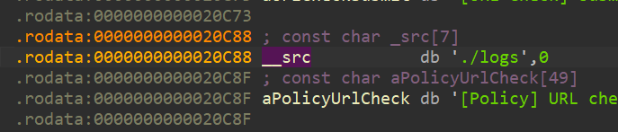

发现保存日志的代码，里面会自动创建log目录。

```C++
void __cdecl `anonymous namespace'::save_log_buffer(const std::string *content)
{
  std::string::size_type v1; // rax
  std::ostream *v2; // [rsp+8h] [rbp-2A8h]
  std::ostream *v3; // [rsp+10h] [rbp-2A0h]
  const std::string::value_type *v4; // [rsp+20h] [rbp-290h]
  std::ostream *v5; // [rsp+28h] [rbp-288h]
  std::ostream *v6; // [rsp+30h] [rbp-280h]
  std::ostream *v7; // [rsp+48h] [rbp-268h]
  std::ostream *v8; // [rsp+50h] [rbp-260h]
  std::ostream *v9; // [rsp+58h] [rbp-258h]
  std::ostream *__os; // [rsp+60h] [rbp-250h]
  std::string v11; // [rsp+90h] [rbp-220h] BYREF
  std::string v12; // [rsp+A8h] [rbp-208h] BYREF
  std::string __s; // [rsp+C0h] [rbp-1F0h] BYREF
  std::__fs::filesystem::path v14; // [rsp+D8h] [rbp-1D8h] BYREF
  std::__fs::filesystem::path log_path; // [rsp+F0h] [rbp-1C0h] BYREF
  std::string v16; // [rsp+108h] [rbp-1A8h] BYREF
  std::string __str; // [rsp+120h] [rbp-190h] BYREF
  std::__fs::filesystem::path log_dir; // [rsp+138h] [rbp-178h] BYREF
  std::error_code ec; // [rsp+150h] [rbp-160h] BYREF
  _QWORD v20[42]; // [rsp+160h] [rbp-150h] BYREF

  v20[41] = __readfsqword(0x28u);
  if ( !std::string::empty[abi:ne180000](content) )
  {
    std::error_code::error_code[abi:ne180000](&ec);
    std::__fs::filesystem::path::path[abi:ne180000]<char [7],void>(
      &log_dir,
      (const char (*)[7])"./logs",
      std::__ndk1::__fs::filesystem::path::format::auto_format);
    std::__fs::filesystem::create_directories[abi:ne180000](&log_dir, &ec);
    if ( std::error_code::operator bool[abi:ne180000](&ec) )
    {
      __os = std::operator<<[abi:ne180000]<std::char_traits<char>>(
               &std::cerr,
               "[-] [Logger] Failed to create log directory: ");
      std::__fs::filesystem::path::string[abi:ne180000](&__str, &log_dir);
      v9 = std::operator<<[abi:ne180000]<char,std::char_traits<char>,std::allocator<char>>(__os, &__str);
      v8 = std::operator<<[abi:ne180000]<std::char_traits<char>>(v9, " error: ");
      std::error_code::message((std::error_code *)&v16);
      v7 = std::operator<<[abi:ne180000]<char,std::char_traits<char>,std::allocator<char>>(v8, &v16);
      std::ostream::operator<<[abi:ne180000](
        v7,
        (std::ostream *(*)(std::ostream *))std::endl[abi:ne180000]<char,std::char_traits<char>>);
      std::string::~string(&v16);
      std::string::~string(&__str);
    }
    else
    {
      `anonymous namespace'::current_log_filename(&__s);
      std::__fs::filesystem::path::path[abi:ne180000](
        &v14,
        &__s,
        std::__ndk1::__fs::filesystem::path::format::auto_format);
      std::__fs::filesystem::operator/[abi:ne180000](&log_path, &log_dir, &v14);
      std::__fs::filesystem::path::~path[abi:ne180000](&v14);
      std::string::~string(&__s);
      std::ofstream::basic_ofstream[abi:ne180000]((std::ofstream *)v20, &log_path, 0x15u);
      if ( std::ios::operator((char *)v20 + *(_QWORD *)(v20[0] - 24LL))) )
      {
        v6 = std::operator<<[abi:ne180000]<std::char_traits<char>>(&std::cerr, "[-] [Logger] Failed to open log file: ");
        std::__fs::filesystem::path::string[abi:ne180000](&v12, &log_path);
        v5 = std::operator<<[abi:ne180000]<char,std::char_traits<char>,std::allocator<char>>(v6, &v12);
        std::ostream::operator<<[abi:ne180000](
          v5,
          (std::ostream *(*)(std::ostream *))std::endl[abi:ne180000]<char,std::char_traits<char>>);
        std::string::~string(&v12);
      }
      else
      {
        v4 = std::string::data[abi:ne180000](content);
        v1 = std::string::size[abi:ne180000](content);
        std::ostream::write(v20, v4, v1);
        if ( std::ios::operator((char *)v20 + *(_QWORD *)(v20[0] - 24LL))) )
        {
          v3 = std::operator<<[abi:ne180000]<std::char_traits<char>>(
                 &std::cerr,
                 "[-] [Logger] Failed to write log file: ");
          std::__fs::filesystem::path::string[abi:ne180000](&v11, &log_path);
          v2 = std::operator<<[abi:ne180000]<char,std::char_traits<char>,std::allocator<char>>(v3, &v11);
          std::ostream::operator<<[abi:ne180000](
            v2,
            (std::ostream *(*)(std::ostream *))std::endl[abi:ne180000]<char,std::char_traits<char>>);
          std::string::~string(&v11);
        }
      }
      std::ofstream::~ofstream((std::ofstream *)v20);
      std::__fs::filesystem::path::~path[abi:ne180000](&log_path);
    }
    std::__fs::filesystem::path::~path[abi:ne180000](&log_dir);
  }
}
```

### 寻找真密钥

阅读readme的程序运行机制，我们回来看main函数：

```C++
int __fastcall main(int argc, const char **argv, const char **envp)
{
  uint16_t port; // [rsp+Eh] [rbp-4A2h]
  int v5; // [rsp+34h] [rbp-47Ch]
  std::string message; // [rsp+38h] [rbp-478h] BYREF
  std::string p_tcpdump_path; // [rsp+50h] [rbp-460h] BYREF
  PcapCaptureAnalyzer analyzer; // [rsp+68h] [rbp-448h] BYREF
  std::string p_path; // [rsp+70h] [rbp-440h] BYREF
  std::string p_host; // [rsp+88h] [rbp-428h] BYREF
  UrlPolicyManager policy_manager; // [rsp+A0h] [rbp-410h] BYREF
  std::string v12; // [rsp+C8h] [rbp-3E8h] BYREF
  `anonymous namespace'::WatchdogGuard watchdog; // [rsp+E0h] [rbp-3D0h] BYREF
  std::string p_hosts_path; // [rsp+128h] [rbp-388h] BYREF
  std::string p_database_path; // [rsp+140h] [rbp-370h] BYREF
  std::string config_path; // [rsp+158h] [rbp-358h] BYREF
  AppConfig config; // [rsp+170h] [rbp-340h] BYREF
  `anonymous namespace'::LogCollectorGuard log_collector; // [rsp+22Fh] [rbp-281h] BYREF
  UrlCheckClient url_check_client; // [rsp+230h] [rbp-280h] BYREF
  UrlCheckResultQueue url_check_results; // [rsp+310h] [rbp-1A0h] BYREF
  HostsManager hosts_manager; // [rsp+3A0h] [rbp-110h] BYREF
  CacheDatabaseManager_0 database; // [rsp+3E0h] [rbp-D0h] BYREF
  unsigned __int64 v23; // [rsp+4A8h] [rbp-8h]

  v23 = __readfsqword(0x28u);
  `anonymous namespace'::LogCollectorGuard::LogCollectorGuard(&log_collector);
  `anonymous namespace'::show_program_info();
  `anonymous namespace'::setup_signal_handlers();
  std::string::basic_string[abi:ne180000]<0>(&config_path, "./config/config.ini");
  load_config(&config, &config_path);
  std::string::~string(&config_path);
  `anonymous namespace'::log_startup_message();
  std::string::basic_string(&p_database_path, &config.database_path);
  CacheDatabaseManager::CacheDatabaseManager(&database, &p_database_path, config.cache_retention_days);
  std::string::~string(&p_database_path);
  if ( `anonymous namespace'::start_database(&database, &config) )
  {
    std::string::basic_string(&p_hosts_path, &config.hosts_path);
    HostsManager::HostsManager(&hosts_manager, &p_hosts_path);
    std::string::~string(&p_hosts_path);
    std::string::basic_string(&v12, &config.hosts_path);
    `anonymous namespace'::WatchdogGuard::WatchdogGuard(&watchdog, &v12);
    std::string::~string(&v12);
    `anonymous namespace'::WatchdogGuard::start(&watchdog);
    `anonymous namespace'::start_hosts_defense(&database, &hosts_manager);
    CacheDatabaseManager::start(&database);
    UrlCheckResultQueue::UrlCheckResultQueue(&url_check_results);
    UrlPolicyManager::UrlPolicyManager(
      &policy_manager,
      &url_check_results,
      (CacheDatabaseManager *)&database,
      config.block_warn,
      config.cache_retention_days);
    `anonymous namespace'::start_policy_manager(&policy_manager);
    std::string::basic_string(&p_host, &config.host);
    port = config.port;
    std::string::basic_string(&p_path, &config.api_path);
    UrlCheckClient::UrlCheckClient(
      (UrlCheckClient_0 *)&url_check_client,
      &p_host,
      port,
      &p_path,
      &url_check_results,
      (CacheDatabaseManager *)&database);
    std::string::~string(&p_path);
    std::string::~string(&p_host);
    `anonymous namespace'::start_url_check_client(&url_check_client);
    std::string::basic_string(&p_tcpdump_path, &config);
    PcapCaptureAnalyzer::PcapCaptureAnalyzer(&analyzer, (UrlCheckClient_1 *)&url_check_client, &p_tcpdump_path);
    std::string::~string(&p_tcpdump_path);
    `anonymous namespace'::run_capture_analyzer(&analyzer);
    `anonymous namespace'::log_interrupted_if_needed();
    `anonymous namespace'::stop_runtime_modules(
      &url_check_client,
      &policy_manager,
      &database,
      &hosts_manager,
      &watchdog);
    std::string::basic_string[abi:ne180000]<0>(&message, "[Main] Done.");
    log_info(&message);
    std::string::~string(&message);
    v5 = 0;
    PcapCaptureAnalyzer::~PcapCaptureAnalyzer(&analyzer);
    UrlCheckClient::~UrlCheckClient((UrlCheckClient_0 *)&url_check_client);
    UrlPolicyManager::~UrlPolicyManager(&policy_manager);
    UrlCheckResultQueue::~UrlCheckResultQueue(&url_check_results);
    `anonymous namespace'::WatchdogGuard::~WatchdogGuard(&watchdog);
    HostsManager::~HostsManager(&hosts_manager);
  }
  else
  {
    v5 = 1;
  }
  CacheDatabaseManager::~CacheDatabaseManager(&database);
  AppConfig::~AppConfig(&config);
  `anonymous namespace'::LogCollectorGuard::~LogCollectorGuard(&log_collector);
  return v5;
}
```

main函数中，这三行代码描述了了加载配置的函数调用机制：

```C++
std::string::basic_string[abi:ne180000]<0>(&config_path, "./config/config.ini");
  load_config(&config, &config_path);
  std::string::~string(&config_path);
```

再看load\_config函数：

```C++
AppConfig *__cdecl load_config(AppConfig *__return_ptr retstr, const std::string *config_path)
{
  std::filebuf *v3; // [rsp+38h] [rbp-3B8h]
  std::string v4; // [rsp+78h] [rbp-378h] BYREF
  std::string v5; // [rsp+90h] [rbp-360h] BYREF
  std::string text; // [rsp+A8h] [rbp-348h] BYREF
  std::string message; // [rsp+C0h] [rbp-330h] BYREF
  AppConfig config; // [rsp+D8h] [rbp-318h] BYREF
  std::ostringstream v9; // [rsp+190h] [rbp-260h] BYREF
  unsigned __int64 v10; // [rsp+3E8h] [rbp-8h]

  v10 = __readfsqword(0x28u);
  AppConfig::AppConfig(&config);
  std::ifstream::basic_ifstream((std::ifstream *)(&v9.__sb_ + 1), config_path, 8u);
  if ( std::ios::operator((char *)&v9.__sb_
                                                          + *(_QWORD *)(*((_QWORD *)&v9.__sb_ + 13) - 24LL)
                                                          + 104)) )
  {
    std::operator+<char>(&message, "[Config] Config file not found, using defaults: ");
    log_info(&message);
    std::string::~string(&message);
    AppConfig::AppConfig(retstr, &config);
  }
  else
  {
    std::ostringstream::basic_ostringstream[abi:ne180000](&v9);
    v3 = std::ifstream::rdbuf((const std::ifstream *)(&v9.__sb_ + 1));
    std::ostream::operator<<(&v9, v3);
    std::ostringstream::str[abi:ne180000](&text, &v9);
    if ( `anonymous namespace'::parse_json_object(&text, &config) )
    {
      log_env_init(&config.log_key);
      std::operator+<char>(&v4, "[Config] Loaded config: ");
      log_info(&v4);
      std::string::~string(&v4);
      AppConfig::AppConfig(retstr, &config);
    }
    else
    {
      std::operator+<char>(&v5, "[Config] Failed to parse config file, using defaults: ");
      log_error(&v5);
      std::string::~string(&v5);
      std::string::basic_string[abi:ne180000]<0>(&retstr->tcpdump_path, "./tcpdump/tcpdump");
      std::string::basic_string[abi:ne180000]<0>(&retstr->host, "192.168.43.220");
      retstr->port = 5000;
      std::string::basic_string[abi:ne180000]<0>(&retstr->api_path, "/api/url/check");
      std::string::basic_string[abi:ne180000]<0>(&retstr->database_path, "./database/url_database.db");
      retstr->cache_retention_days = 30;
      retstr->block_warn = 0;
      std::string::basic_string[abi:ne180000]<0>(&retstr->hosts_path, "/system/etc/hosts");
      std::string::basic_string[abi:ne180000]<0>(&retstr->log_key, "ZGRlZnZzYWVjeHNh");//密钥
      std::vector<std::string>::vector[abi:ne180000](&retstr->default_block_domains);
    }
    std::string::~string(&text);
    std::ostringstream::~ostringstream(&v9);
  }
  std::ifstream::~ifstream((std::ifstream *)(&v9.__sb_ + 1));
  AppConfig::~AppConfig(&config);
  return retstr;
}
```

在里面我们好像看到了加密密钥，但是这个密钥是假的，程序运行的时候会被配置文件里面的密钥覆盖掉。

虽然密钥可以base64解码，但是加密的密钥是字符串本身。

```C++
std::string::basic_string[abi:ne180000]<0>(&retstr->log_key, "ZGRlZnZzYWVjeHNh");
```

```JSON
{
  "tcpdump_path": "./tcpdump/tcpdump",
  "host": "172.28.20.72",
  "port": 5000,
  "api_path": "/api/url/check",
  "database_path": "./database/url_database.db",
  "cache_retention_days": 30,
  "block_warn": false,
  "hosts_path": "/system/etc/hosts",
  "log_key": "c2M1Z2R3ZnMzcC1z",
  "default_block_domains": [
    "6338c318c7599a85.com","img.hxwl.host","j-raw.img8e6zy4bg.com","api2.openinstall.io","168js.bvocftd.com","gamelogo.xxdh.shop","168js.bhibfy.com",
    "tutu3333.xxdh.shop","53faa4bf74d303ae.com","downaa.hydphk.com"
  ]
}

```

为什么呢？我们来看代码：

在加载配置赋值前，程序执行load\_config的操作，分析配置文件里面的json，解析失败了才会加载默认值。

```C++
if ( `anonymous namespace'::parse_json_object(&text, &config) )
    {
      log_env_init(&config.log_key);//设置密钥
      std::operator+<char>(&v4, "[Config] Loaded config: ");
      log_info(&v4);
      std::string::~string(&v4);
      AppConfig::AppConfig(retstr, &config);
    }
    else
    {
      std::operator+<char>(&v5, "[Config] Failed to parse config file, using defaults: ");
      log_error(&v5);
      //...
      std::string::basic_string[abi:ne180000]<0>(&retstr->log_key, "ZGRlZnZzYWVjeHNh");
    }
```

### 加密日志算法寻找

我们随便找一个输出日志的调用。

```C++
std::operator+<char>(&v4, "[Config] Loaded config: ");
      log_info(&v4)；
```

```C++
void __cdecl log_info(const std::string *message)
{
  std::string v1; // [rsp+30h] [rbp-20h] BYREF
  unsigned __int64 v2; // [rsp+48h] [rbp-8h]

  v2 = __readfsqword(0x28u);
  std::string::basic_string[abi:ne180000]<0>(&v1, "[+]");
  `anonymous namespace'::write_log(&v1, &std::cout, message);
  std::string::~string(&v1);
}
```

找到加密函数turn\_log\_message\_to\_hex：

```C++
void __cdecl `anonymous namespace'::write_log(std::string *p_log_level, std::ostream *out, const std::string *message)
{
  std::ostream *v3; // [rsp+10h] [rbp-D0h]
  std::string __str; // [rsp+40h] [rbp-A0h] BYREF
  std::lock_guard<std::mutex> lock; // [rsp+58h] [rbp-88h] BYREF
  std::string log_line; // [rsp+60h] [rbp-80h] BYREF
  std::string __rhs; // [rsp+78h] [rbp-68h] BYREF
  std::string __lhs; // [rsp+90h] [rbp-50h] BYREF
  std::string v10; // [rsp+A8h] [rbp-38h] BYREF
  std::string log_prefix; // [rsp+C0h] [rbp-20h] BYREF
  unsigned __int64 v12; // [rsp+D8h] [rbp-8h]

  v12 = __readfsqword(0x28u);
  std::operator+[abi:ne180000]<char,std::char_traits<char>,std::allocator<char>>(&__lhs, p_log_level, " [");
  `anonymous namespace'::current_time_string(&__rhs);
  std::operator+[abi:ne180000]<char,std::char_traits<char>,std::allocator<char>>(&v10, &__lhs, &__rhs);
  std::operator+[abi:ne180000]<char,std::char_traits<char>,std::allocator<char>>(&log_prefix, &v10, "] ");
  std::string::~string(&v10);
  std::string::~string(&__rhs);
  std::string::~string(&__lhs);
  std::operator+[abi:ne180000]<char,std::char_traits<char>,std::allocator<char>>(&log_line, &log_prefix, message);
  std::lock_guard<std::mutex>::lock_guard[abi:ne180000](&lock, &`anonymous namespace'::g_log_mutex);
  v3 = std::operator<<[abi:ne180000]<char,std::char_traits<char>,std::allocator<char>>(out, &log_line);
  std::ostream::operator<<[abi:ne180000](
    v3,
    (std::ostream *(*)(std::ostream *))std::endl[abi:ne180000]<char,std::char_traits<char>>);
  if ( (`anonymous namespace'::g_log_collector_running & 1) != 0 )
  {
    std::string::operator+=[abi:ne180000](&`anonymous namespace'::g_log_buffer, &log_prefix);
    `anonymous namespace'::turn_log_message_to_hex(&__str, message);//加密函数
    std::string::operator+=[abi:ne180000](&`anonymous namespace'::g_log_buffer, &__str);
    std::string::~string(&__str);
    std::string::push_back(&`anonymous namespace'::g_log_buffer);
    if ( std::string::size[abi:ne180000](&`anonymous namespace'::g_log_buffer) >= 0x80000 )
      std::condition_variable::notify_one(&`anonymous namespace'::g_log_cv);
  }
  std::lock_guard<std::mutex>::~lock_guard[abi:ne180000](&lock);
  std::string::~string(&log_line);
  std::string::~string(&log_prefix);
}
```

```C++
std::string *__cdecl `anonymous namespace'::turn_log_message_to_hex(
        std::string *__return_ptr retstr,
        const std::string *message)
{
  std::vector<unsigned char>::value_type *v2; // rdi
  std::vector<unsigned char>::size_type offset; // [rsp+40h] [rbp-90h]
  size_t padding; // [rsp+60h] [rbp-70h]
  std::__wrap_iter<const char *>::iterator_type __last; // [rsp+68h] [rbp-68h]
  std::__wrap_iter<const char *>::iterator_type __first; // [rsp+70h] [rbp-60h]
  std::vector<unsigned char>::value_type __x; // [rsp+8Fh] [rbp-41h] BYREF
  std::__wrap_iter<unsigned char *> __u; // [rsp+90h] [rbp-40h] BYREF
  std::__wrap_iter<const unsigned char *> __position; // [rsp+98h] [rbp-38h] BYREF
  std::vector<unsigned char> encrypted; // [rsp+A0h] [rbp-30h] BYREF
  std::array<unsigned int,4UL> key; // [rsp+B8h] [rbp-18h] BYREF
  unsigned __int64 v15; // [rsp+C8h] [rbp-8h]

  v15 = __readfsqword(0x28u);
  __first = std::string::begin[abi:ne180000](message).__i_;
  __last = std::string::end[abi:ne180000](message).__i_;
  ZNSt6__ndk16vectorIhNS_9allocatorIhEEEC2INS_11__wrap_iterIPKcEETnNS_9enable_ifIXaasr31__has_forward_iterator_categoryIT_EE5valuesr16is_constructibleIhNS_15iterator_traitsISA_E9referenceEEE5valueEiE4typeELi0EEESA_SA_(
    &encrypted,
    (std::__wrap_iter<const char *>)__first,
    (std::__wrap_iter<const char *>)__last);
  padding = 8 - (std::vector<unsigned char>::size[abi:ne180000](&encrypted) & 7);//padding
  __u.__i_ = std::vector<unsigned char>::end[abi:ne180000](&encrypted).__i_;
  ZNSt6__ndk111__wrap_iterIPKhEC2B8ne180000IPhTnNS_9enable_ifIXsr14is_convertibleIT_S2_EE5valueEiE4typeELi0EEERKNS0_IS7_EE(
    &__position,
    &__u);
  __x = padding;
  std::vector<unsigned char>::insert(&encrypted, __position, padding, &__x);
  key = `anonymous namespace'::build_tk(&`anonymous namespace'::g_log_encryption_key);//密钥扩展
  for ( offset = 0; offset < std::vector<unsigned char>::size[abi:ne180000](&encrypted); offset += 8LL )
  {
    v2 = std::vector<unsigned char>::data[abi:ne180000](&encrypted);
    `anonymous namespace'::log_mask(&v2[offset], &key);//加密
  }
  `anonymous namespace'::to_hex(retstr, &encrypted);
  std::vector<unsigned char>::~vector[abi:ne180000](&encrypted);
  return retstr;
}
```

根据build\_tk密钥扩展机制，16个字节的密钥，每 4 字节按大端序转成一个 uint32\_t，得到 key\[0\.\.3\]。

```C++
std::array<unsigned int,4UL> __cdecl `anonymous namespace'::build_tk(const std::string *key_text)
{
  std::array<unsigned char,16UL>::value_type *v1; // rax
  std::array<unsigned char,16UL>::value_type *v2; // rax
  std::array<unsigned char,16UL>::value_type *v3; // rax
  std::array<unsigned char,16UL>::value_type *v4; // rax
  std::string::value_type v6; // [rsp+1Fh] [rbp-51h]
  bool v7; // [rsp+37h] [rbp-39h]
  size_t i; // [rsp+38h] [rbp-38h]
  std::array<unsigned char,16UL> key_bytes; // [rsp+48h] [rbp-28h] BYREF
  std::array<unsigned int,4UL> v10; // [rsp+58h] [rbp-18h]
  unsigned __int64 v11; // [rsp+68h] [rbp-8h]

  v11 = __readfsqword(0x28u);
  memset(&key_bytes, 0, sizeof(key_bytes));
  for ( i = 0; ; ++i )
  {
    v7 = 0;
    if ( i < std::array<unsigned char,16ul>::size[abi:ne180000](&key_bytes) )
      v7 = i < std::string::size[abi:ne180000](key_text);
    if ( !v7 )
      break;
    v6 = *std::string::operator[][abi:ne180000](key_text, i);
    *std::array<unsigned char,16ul>::operator[][abi:ne180000](&key_bytes, i) = v6;
  }
  v1 = std::array<unsigned char,16ul>::data[abi:ne180000](&key_bytes);
  v10.__elems_[0] = `anonymous namespace'::read_u32_be(v1);
  v2 = std::array<unsigned char,16ul>::data[abi:ne180000](&key_bytes);
  v10.__elems_[1] = `anonymous namespace'::read_u32_be(v2 + 4);
  v3 = std::array<unsigned char,16ul>::data[abi:ne180000](&key_bytes);
  v10.__elems_[2] = `anonymous namespace'::read_u32_be(v3 + 8);
  v4 = std::array<unsigned char,16ul>::data[abi:ne180000](&key_bytes);
  v10.__elems_[3] = `anonymous namespace'::read_u32_be(v4 + 12);
  return v10;
}
```

加密核心算法：

```C++
void __cdecl `anonymous namespace'::log_mask(unsigned __int8 *block, const std::array<unsigned int,4UL> *key)
{
  std::array<unsigned int,4UL>::value_type v2; // [rsp+10h] [rbp-30h]
  std::array<unsigned int,4UL>::value_type v3; // [rsp+1Ch] [rbp-24h]
  int round; // [rsp+20h] [rbp-20h]
  uint32_t sum; // [rsp+24h] [rbp-1Ch]
  uint32_t v1; // [rsp+28h] [rbp-18h]
  uint32_t v0; // [rsp+2Ch] [rbp-14h]

  v0 = `anonymous namespace'::read_u32_be(block);
  v1 = `anonymous namespace'::read_u32_be(block + 4);
  sum = 0;
  for ( round = 0; round < 32; ++round )
  {
    sum += 1518500249;
    v2 = (sum + v1) ^ (*std::array<unsigned int,4ul>::operator[][abi:ne180000](key, 0) + 16 * v1);
    v0 += (*std::array<unsigned int,4ul>::operator[][abi:ne180000](key, 1u) + (v1 >> 5)) ^ v2;
    v3 = (sum + v0) ^ (*std::array<unsigned int,4ul>::operator[][abi:ne180000](key, 2u) + 16 * v0);
    v1 += (*std::array<unsigned int,4ul>::operator[][abi:ne180000](key, 3u) + (v0 >> 5)) ^ v3;
  }
  `anonymous namespace'::write_u32_be(v0, block);
  `anonymous namespace'::write_u32_be(v1, block + 4);
}
```

魔改tea,所以对每个 8 字节 block 做反向轮函数：

加密时 sum 从 0 开始，每轮先加 0x5A827999。共 32 轮。

所以解密时 sum 初始为：

```C++
0x5A827999 * 32 mod 2^32
```

每轮先还原 v1，再还原 v0，最后 sum \-= delta。

所有整数运算都要限制在 uint32\_t，也就是每步 \& 0xffffffff。

还要去除 PKCS\#7 风格填充。

## 解密脚本

```Python
#!/usr/bin/env python3
import re
from pathlib import Path


LOG_FILE = Path("xxx.log")#输入你的日志路径
OUTPUT_FILE = Path("xxx.dec.log")#输入你的日志路径
LOG_KEY = "c2M1Z2R3ZnMzcC1z"
DELTA = 0x5A827999
ROUNDS = 32
UINT32_MASK = 0xFFFFFFFF
LOG_LINE_RE = re.compile(r"^(\[[+-]\] \[\d{4}-\d{2}-\d{2} \d{2}:\d{2}:\d{2}\] )([0-9a-fA-F]+)\s*$")


def build_key(key_text: str) -> tuple[int, int, int, int]:
    key_bytes = key_text.encode("utf-8")[:16].ljust(16, b"\x00")
    return tuple(int.from_bytes(key_bytes[i:i + 4], "big") for i in range(0, 16, 4))


def decrypt_block(block: bytes, key: tuple[int, int, int, int]) -> bytes:
    v0 = int.from_bytes(block[:4], "big")
    v1 = int.from_bytes(block[4:], "big")
    total = (DELTA * ROUNDS) & UINT32_MASK

    for _ in range(ROUNDS):
        v1 = (
            v1 - ((((v0 << 4) + key[2]) ^ (v0 + total) ^ ((v0 >> 5) + key[3])) & UINT32_MASK)
        ) & UINT32_MASK
        v0 = (
            v0 - ((((v1 << 4) + key[0]) ^ (v1 + total) ^ ((v1 >> 5) + key[1])) & UINT32_MASK)
        ) & UINT32_MASK
        total = (total - DELTA) & UINT32_MASK

    return v0.to_bytes(4, "big") + v1.to_bytes(4, "big")


def remove_pkcs7_padding(data: bytes) -> bytes:
    if not data:
        return data
    padding = data[-1]
    if padding < 1 or padding > 8 or data[-padding:] != bytes([padding]) * padding:
        raise ValueError("invalid padding")
    return data[:-padding]


def decrypt_hex_message(hex_message: str, key: tuple[int, int, int, int]) -> str:
    encrypted = bytes.fromhex(hex_message)
    if len(encrypted) == 0 or len(encrypted) % 8 != 0:
        raise ValueError("ciphertext length is not a positive multiple of 8")

    decrypted = b"".join(
        decrypt_block(encrypted[i:i + 8], key)
        for i in range(0, len(encrypted), 8)
    )
    decrypted = remove_pkcs7_padding(decrypted)
    return decrypted.decode("utf-8", errors="replace")


def decrypt_log_line(line: str, key: tuple[int, int, int, int]) -> str:
    stripped = line.rstrip("\r\n")
    match = LOG_LINE_RE.match(stripped)
    if not match:
        return stripped

    prefix, hex_message = match.groups()
    try:
        return prefix + decrypt_hex_message(hex_message, key)
    except ValueError as exc:
        return f"{prefix}<decrypt failed: {exc}>"


def decrypt_file(input_path: Path, output_path: Path, key_text: str) -> None:
    key = build_key(key_text)
    with input_path.open("r", encoding="utf-8", errors="replace") as fp:
        lines = [decrypt_log_line(line, key) for line in fp]

    output = "\n".join(lines)
    if lines:
        output += "\n"

    output_path.write_text(output, encoding="utf-8")


def main() -> int:
    if not LOG_FILE.exists():
        print(f"missing log file: {LOG_FILE}")
        return 1

    decrypt_file(LOG_FILE, OUTPUT_FILE, LOG_KEY)
    print(f"decrypted log written to: {OUTPUT_FILE}")
    return 0


if __name__ == "__main__":
    raise SystemExit(main())

```

在日志中找到flag。

```Plain Text
[+] [2026-05-29 20:53:29] [HTTP Response Body] {"content": "ZJPCTF{3b102afc-c02e-4bf5-9b65-da60026b0737}"}
```

`ZJPCTF{3b102afc-c02e-4bf5-9b65-da60026b0737}`

## 参考源码

https://github\.com/yhypzc/WebDefenderClient

# Galgame

## 题目概述

初夏，沉默敏感的少年心生懵懂情愫。在晚风里悄悄靠近她的内心，却因为不同的回答走向不同结局。那段青涩而短暂的爱恋最终败给现实与差距，或是与自我和解，将青涩心事化作青春里温柔的怅惘。请你在游戏的深处寻找线索，解开少年心中那份遗憾的回忆。

## 解题思路

本题基于Ren'Py引擎开发。

解压得到：

```Plain Text
Mode                 LastWriteTime         Length Name
----                 -------------         ------ ----
d-----         2026/5/29      3:05                game
d-----          2026/5/3     10:53                lib
d-----          2026/5/3     10:53                renpy
-a----          2026/1/4      3:08         104448 ezgal.exe
-a----          2026/1/4      3:08           8944 ezgal.py
-a----         2026/5/29     11:12             77 hint.txt
-a----         2026/5/29     15:22              0 log.txt
```

hint\.txt

```Plain Text
输入密钥范围是大小写字母、数字、下划线。
pdb有啥用？
```

游戏代码逻辑在game目录下面：

```Plain Text
Mode                 LastWriteTime         Length Name
----                 -------------         ------ ----
d-----         2026/5/28      1:54                audio
d-----         2026/5/28     18:59                cache
d-----         2026/5/21      1:31                gui
d-----         2026/5/28      3:28                images
d-----         2026/5/21      1:31                libs
d-----         2026/5/29     15:22                saves
d-----         2026/5/21      1:31                tl
-a----         2026/5/29      2:18       11972608 ezgal_flagtester.pdb
-a----         2026/5/28     19:00          11864 gui.rpyc
-a----         2026/5/28     19:00        4171912 inner_file.rpyc
-a----         2026/5/28     19:00           2956 options.rpyc
-a----         2026/5/28     19:00          47764 screens.rpyc
-a----         2026/5/28     19:00          36338 script.rpyc
-a----         2026/5/28     19:00              9 script_version.txt
-a----         2026/5/21      1:31        2901056 SourceHanSansLite.ttf
```

### 反编译rpyc

注意这几个rpyc文件，这是游戏代码编译成的字节码，使用unrpyc反编译：

```Plain Text
> unrpyc .\script.rpyc
Found 1 file to process. Performing decompilation using 1 worker.
Decompiling .\script.rpyc to script.rpy ...


-------------------------------------------------------
Unrpyc v2.0.3 results summary:
-------------------------------------------------------
Processed 1 file.
> 1 file were successfully decompiled.
```

得到游戏剧情、资源、flag的调度代码。

阅读代码发现，里面有一个加密flag。

```Plain Text
define INNER_FLAG = b"\x9a\xa2\x30\x4f\x17\x76\x83\xc1\x08\xd3\x0d\x07\xa4\x0c\x58\xec\xde\xa3\x34\x01\x76\x5d\xa0\xcf\x3d\xb9\x07\x1a\xa6\x06\x85\xc1\x2b\x01\x5d\xf5\x5a\xb1\x24\x09\xa7\x38\xc2\x0f\x98\x3c\x2f\x62"
```

加密flag需要解密密钥，密钥来源是用户输入的字符串的MD5值。

```Python
$ story_scene("white")
    $ ending_flag = decrypt_inner_flag(confession_answer.strip())
    $ save_flag_file(ending_flag)
    $ flag_text = "Flag: " + ending_flag
    centered "[flag_text!q]"
    centered "结局 2 达成：错过不是终点，成长才是归宿"
```

```Python
def decrypt_inner_flag(confession_answer):
        import hashlib
        
        key = hashlib.md5(confession_answer.encode("utf-8")).digest()
        round_keys = _aes_key_expansion(key)
        decrypted = b"".join(
            _aes_decrypt_block(INNER_FLAG[i:i + 16], round_keys)
            for i in range(0, len(INNER_FLAG), 16)
        )
        
        padding = decrypted[-1]
        if padding < 1 or padding > 16 or decrypted[-padding:] != bytes([padding]) * padding:
            return ""
        
        return decrypted[:-padding].decode("utf-8", "ignore")
```

追踪变量confession\_answer，发现confession\_answer来自用户输入。

```Python
label start:

    stop music fadeout 1.0
    window auto

    call common_route from _call_common_route
    call confession_branch from _call_confession_branch

    if check(confession_answer.strip()):
        jump ending_two
    else:
        jump ending_one
```

程序会对用户输入进行校验，通过将inner\_file里面的数据写入文件变成一个exe，然后启动exe进行验证，如果exe输出的值为1，就进入flag结局。

```Python
def check(confession_answer):
        import subprocess
        import os
        import tempfile
        
        exe_path = os.path.join(tempfile.gettempdir(), "ezgal_flagtester_inner.exe")
        
        with open(exe_path, "wb") as out_file:
            out_file.write(inner_file)
        
        try:
            completed = subprocess.run(
            [exe_path],
            input=(confession_answer + "\n").encode("utf-8"),
            stdout=subprocess.PIPE,
            stderr=subprocess.DEVNULL,
            timeout=5,
            creationflags=getattr(subprocess, "CREATE_NO_WINDOW", 0),
        )
            return completed.stdout.decode("utf-8", "ignore").strip() == "1"
        except Exception:
            return False
        finally:
            try:
                os.remove(exe_path)
            except OSError:
                pass
```

反编译inner\_file\.rpyc把里面文件提取出来，得到这个exe。

这个时候打开ida发现里面逻辑非常混乱，这个时候pdb就有用了。

在ida里面加载pdb后得到带调试信息的逆向结果。

### 寻找入口点

```C++
int __fastcall main(int argc, const char **argv, const char **envp)
{
  void *ModuleHandleFromPointer; // rsi

  if ( !RhInitialize(0) )
    return -1;
  ModuleHandleFromPointer = PalGetModuleHandleFromPointer(_managed__Main);
  if ( !RhRegisterOSModule(
          ModuleHandleFromPointer,
          __managedcode_a,
          (unsigned int)__managedcode_z - (unsigned int)__managedcode_a,
          __unbox_a,
          (unsigned int)__unbox_z - (unsigned int)__unbox_a,
          (void **)c_classlibFunctions,
          0xCu) )
    return -1;
  S_P_CoreLib_Internal_Runtime_CompilerHelpers_StartupCodeHelpers__InitializeModules(
    ModuleHandleFromPointer,
    _modules_a,
    _modules_z - _modules_a,
    c_classlibFunctions,
    12);
  return _managed__Main((unsigned int)argc, argv); //入口点
}

__int64 __fastcall _managed__Main(unsigned int a1, __int64 a2)
{
  __int64 v3; // [rsp+0h] [rbp-58h] BYREF
  __int64 v4; // [rsp+28h] [rbp-30h] BYREF
  __int128 v5; // [rsp+30h] [rbp-28h]
  __int64 MainMethodArguments; // [rsp+40h] [rbp-18h]
  __int64 RuntimeTypeHandle; // [rsp+48h] [rbp-10h]

  v4 = 0;
  v5 = 0;
  MainMethodArguments = 0;
  RhpReversePInvoke((ReversePInvokeFrame *)(&v3 + 5));
  S_P_CoreLib_Internal_Runtime_CompilerHelpers_LibraryInitializer__InitializeLibrary();
  S_P_StackTraceMetadata_Internal_Runtime_CompilerHelpers_LibraryInitializer__InitializeLibrary();
  S_P_TypeLoader_Internal_Runtime_CompilerHelpers_LibraryInitializer__InitializeLibrary();
  S_P_Reflection_Execution_Internal_Runtime_CompilerHelpers_LibraryInitializer__InitializeLibrary();
  S_P_CoreLib_Internal_Runtime_CompilerHelpers_StartupCodeHelpers__InitializeCommandLineArgsW(a1, a2);
  RuntimeTypeHandle = S_P_CoreLib_Internal_Runtime_CompilerHelpers_LdTokenHelpers__GetRuntimeTypeHandle(&ezgal_flagtester__Module_::`vftable');
  S_P_CoreLib_Internal_Runtime_CompilerHelpers_StartupCodeHelpers__InitializeEntryAssembly(RuntimeTypeHandle);
  S_P_CoreLib_Internal_Runtime_CompilerHelpers_StartupCodeHelpers__InitializeApartmentState(1);
  S_P_CoreLib_Internal_Runtime_CompilerHelpers_StartupCodeHelpers__RunModuleInitializers();
  MainMethodArguments = S_P_CoreLib_Internal_Runtime_CompilerHelpers_StartupCodeHelpers__GetMainMethodArguments();
  ezgal_flagtester__Module___MainMethodWrapper(MainMethodArguments); //入口点
  HIDWORD(v5) = S_P_CoreLib_Internal_Runtime_CompilerHelpers_StartupCodeHelpers__Shutdown();
  DWORD2(v5) = HIDWORD(v5);
  RhpReversePInvokeReturn((ReversePInvokeFrame *)&v4);
  return DWORD2(v5);
}

__int64 __fastcall ezgal_flagtester__Module___MainMethodWrapper(__int64 a1)
{
  return ezgal_flagtester_ezgal_flagtester_Program__Main(a1); //真正的C#主函数
}
```

### 分析主函数

```C++
__int64 ezgal_flagtester_ezgal_flagtester_Program__Main()
{
  __int64 v0; // rax
  __int64 v1; // rdx
  __int64 v2; // rcx
  __int64 v3; // r8
  __int64 v4; // r9
  __int64 v5; // rdx
  __int64 v6; // r8
  __int64 v7; // r9
  __int64 v9; // rdx
  __int64 v10; // rcx
  __int64 v11; // r8
  __int64 v12; // r9
  __int128 v13; // [rsp+20h] [rbp-B8h] BYREF
  __int128 v14; // [rsp+30h] [rbp-A8h] BYREF
  int v15; // [rsp+44h] [rbp-94h]
  __int128 v16; // [rsp+48h] [rbp-90h] BYREF
  __int64 v17; // [rsp+58h] [rbp-80h]
  __int128 v18; // [rsp+60h] [rbp-78h] BYREF
  __int64 v19; // [rsp+70h] [rbp-68h]
  __int64 UTF8; // [rsp+78h] [rbp-60h]
  int Length; // [rsp+80h] [rbp-58h]
  int v22; // [rsp+84h] [rbp-54h]
  _UNKNOWN **v23; // [rsp+88h] [rbp-50h]
  __int64 Line; // [rsp+90h] [rbp-48h]
  __int64 v25; // [rsp+98h] [rbp-40h]
  int v26; // [rsp+A4h] [rbp-34h]
  BOOL v27; // [rsp+A8h] [rbp-30h]
  int v28; // [rsp+ACh] [rbp-2Ch]
  __int64 v29; // [rsp+B0h] [rbp-28h]
  _UNKNOWN **v30; // [rsp+B8h] [rbp-20h]
  __int64 v31; // [rsp+C0h] [rbp-18h]
  __int64 v32; // [rsp+C8h] [rbp-10h]
  _BYTE v33[8]; // [rsp+D0h] [rbp-8h] BYREF

  v13 = 0;
  v14 = 0;
  v0 = -144;
  do
  {
    *(_OWORD *)&v33[v0] = 0;
    *(_OWORD *)&v33[v0 + 16] = 0;
    *(_OWORD *)&v33[v0 + 32] = 0;
    v0 += 48;
  }
  while ( v0 );
  v25 = RhpNewFast(&ezgal_flagtester_ezgal_flagtester_Cipher::`vftable');
  ezgal_flagtester_ezgal_flagtester_Cipher___ctor(v25);
  v32 = v25;
  v31 = *(_QWORD *)(v25 + 8);
  Line = System_Console_System_Console__ReadLine(v2, v1, v3, v4);
  v23 = (_UNKNOWN **)Line;
  if ( !Line )
    v23 = &_Str_;
  v30 = v23;
  v22 = String__Equals_2(v23, &_Str_);
  v28 = (unsigned __int8)v22;
  if ( (_BYTE)v22 )
    return System_Console_System_Console__WriteLine_12(&_Str__0_E4F60D0AA6D7F3D3B6A6494B1C861B99F649C6F9EC51ABAF201B20F297327C95);
  Length = String__get_Length(v30, v5, v6, v7);
  v27 = Length != 48;
  if ( Length != 48 )
    return System_Console_System_Console__WriteLine_12(&_Str__0_E4F60D0AA6D7F3D3B6A6494B1C861B99F649C6F9EC51ABAF201B20F297327C95);
  UTF8 = S_P_CoreLib_System_Text_Encoding__get_UTF8(v10, v9, v11, v12);
  v19 = (*(__int64 (__fastcall **)(__int64, _UNKNOWN **))(*(_QWORD *)UTF8 + 224LL))(UTF8, v30);
  v29 = v19;
  S_P_CoreLib_System_ReadOnlySpan_1_UInt8___op_Implicit(&v18, v31);
  v17 = ezgal_flagtester_ezgal_flagtester_Program__Encrypt(v29);
  S_P_CoreLib_System_ReadOnlySpan_1_UInt8___op_Implicit(&v16, v17);
  v14 = v18;
  v13 = v16;
  v15 = S_P_CoreLib_System_MemoryExtensions__SequenceEqual_0_UInt8_(&v14, &v13);
  v26 = (unsigned __int8)v15;
  if ( (_BYTE)v15 )
    return System_Console_System_Console__WriteLine_12(&_Str__1_E79E418E48623569D75E2A7B09AE88ED9B77B126A445B9FF9DC6989A08EFA079);
  else
    return System_Console_System_Console__WriteLine_12(&_Str__0_E4F60D0AA6D7F3D3B6A6494B1C861B99F649C6F9EC51ABAF201B20F297327C95);
}
```

在ida里面寻找常量发现：

```Plain Text
.data:000000014028A3D8 __Str__0_E4F60D0AA6D7F3D3B6A6494B1C861B99F649C6F9EC51ABAF201B20F297327C95 dq offset ??_7String@@6B@
.data:000000014028A3D8                                         ; DATA XREF: S_P_CoreLib_System_Globalization_NumberFormatInfo___cctor+30↑o
.data:000000014028A3D8                                         ; ezgal_flagtester_ezgal_flagtester_Program__Main+BF↑o ...
.data:000000014028A3D8                                         ; const String::`vftable'
.data:000000014028A3E0                 db    1
.data:000000014028A3E1                 db    0
.data:000000014028A3E2                 db    0
.data:000000014028A3E3                 db    0
.data:000000014028A3E4                 db  30h ; 0

.data:000000014028A5F0 __Str__1_E79E418E48623569D75E2A7B09AE88ED9B77B126A445B9FF9DC6989A08EFA079 dq offset ??_7String@@6B@
.data:000000014028A5F0                                         ; DATA XREF: S_P_CoreLib_System_Globalization_NumberFormatInfo___cctor+45↑o
.data:000000014028A5F0                                         ; ezgal_flagtester_ezgal_flagtester_Program__Main+1A0↑o
.data:000000014028A5F0                                         ; const String::`vftable'
.data:000000014028A5F8                 db    1
.data:000000014028A5F9                 db    0
.data:000000014028A5FA                 db    0
.data:000000014028A5FB                 db    0
.data:000000014028A5FC                 db  31h ; 1
```

主函数反编译逻辑大概是：

```Plain Text
Line = Console.ReadLine();

if (Line == "")
    fail;

Length = String.Length(Line);
if (Length != 48)
    fail;

bytes = Encoding.UTF8.GetBytes(Line);
enc = Program.Encrypt(bytes);

if (SequenceEqual(cipher, enc))
    success;
else
    fail;
```

所以输入必须是 48 字节 ASCII/UTF\-8，程序会把输入传给：

`ezgal_flagtester_ezgal_flagtester_Program__Encrypt`

再和内置密文比较。

### 找内置密文

Main 里先 new 了一个 Cipher 对象：

```C++
v25 = RhpNewFast(&ezgal_flagtester_ezgal_flagtester_Cipher::`vftable');
  ezgal_flagtester_ezgal_flagtester_Cipher___ctor(v25);
  v32 = v25;
  v31 = *(_QWORD *)(v25 + 8);
```

这里 v31 就是目标密文字节数组。

进入构造函数：

`ezgal_flagtester_ezgal_flagtester_Cipher___ctor`

看到它创建了长度 48 的 byte\[\]，然后从静态区拷贝 48 字节：

`v2 = new byte[48];`

`v2[1] = const_16_bytes_1;`

`v2[2] = const_16_bytes_2;`

`v2[3] = const_16_bytes_3;`

```C++
__int64 __fastcall ezgal_flagtester_ezgal_flagtester_Cipher___ctor(__int64 a1)
{
  _OWORD *v2; // [rsp+28h] [rbp-20h]

  v2 = (_OWORD *)RhpNewArrayFast(&__Array_UInt8_::`vftable', 48);
  v2[1] = ezgal_flagtester__PrivateImplementationDetails____35730DB223E46D70A64F30CD4C3379D8E95C851533CCC734CE6B583E57E9FA48;
  v2[2] = unk_140204EA0;
  v2[3] = unk_140204EB0;
  RhpAssignRefAVLocation(a1 + 8, v2);
  return Object___ctor(a1);
}
```

对应密文：

```C++
.rdata:0000000140204E90 ezgal_flagtester__PrivateImplementationDetails____35730DB223E46D70A64F30CD4C3379D8E95C851533CCC734CE6B583E57E9FA48 db  1Bh
.rdata:0000000140204E90                                         ; DATA XREF: ezgal_flagtester_ezgal_flagtester_Cipher___ctor+36↑o
.rdata:0000000140204E91                 db  0Dh
.rdata:0000000140204E92                 db  1Eh
.rdata:0000000140204E93                 db  62h ; b
.rdata:0000000140204E94                 db  24h ; $
.rdata:0000000140204E95                 db  61h ; a
.rdata:0000000140204E96                 db  0Dh
.rdata:0000000140204E97                 db  2Bh ; +
.rdata:0000000140204E98                 db  62h ; b
.rdata:0000000140204E99                 db  27h ; '
.rdata:0000000140204E9A                 db  0Dh
.rdata:0000000140204E9B                 db  13h
.rdata:0000000140204E9C                 db  20h
.rdata:0000000140204E9D                 db  61h ; a
.rdata:0000000140204E9E                 db  0Dh
.rdata:0000000140204E9F                 db  2Bh ; +
.rdata:0000000140204EA0 unk_140204EA0   db  7Ch ; |
.rdata:0000000140204EA1                 db  9Ah
.rdata:0000000140204EA2                 db 0B2h
.rdata:0000000140204EA3                 db 0CDh
.rdata:0000000140204EA4                 db 0D0h
.rdata:0000000140204EA5                 db  9Ah
.rdata:0000000140204EA6                 db  61h ; a
.rdata:0000000140204EA7                 db 0A6h
.rdata:0000000140204EA8                 db  21h ; !
.rdata:0000000140204EA9                 db 0BDh
.rdata:0000000140204EAA                 db  86h
.rdata:0000000140204EAB                 db 0B5h
.rdata:0000000140204EAC                 db  9Ch
.rdata:0000000140204EAD                 db 0FCh
.rdata:0000000140204EAE                 db 0D5h
.rdata:0000000140204EAF                 db 0BFh
.rdata:0000000140204EB0 unk_140204EB0   db  5Fh ; _
.rdata:0000000140204EB1                 db  77h ; w
.rdata:0000000140204EB2                 db  32h ; 2
.rdata:0000000140204EB3                 db  74h ; t
.rdata:0000000140204EB4                 db 0DEh
.rdata:0000000140204EB5                 db  0Dh
.rdata:0000000140204EB6                 db 0C2h
.rdata:0000000140204EB7                 db    0
.rdata:0000000140204EB8                 db  5Fh ; _
.rdata:0000000140204EB9                 db  46h ; F
.rdata:0000000140204EBA                 db  6Fh ; o
.rdata:0000000140204EBB                 db  52h ; R
.rdata:0000000140204EBC                 db    4
.rdata:0000000140204EBD                 db  94h
.rdata:0000000140204EBE                 db 0A4h
.rdata:0000000140204EBF                 db 0B4h
```

\.NET Native 的 byte\[\] 布局里：

`array + 8  = length`

`array + 16 = data`

### 分析 Encrypt

```C++
__int64 __fastcall ezgal_flagtester_ezgal_flagtester_Program__Encrypt(__int64 a1)
{
  __int64 v1; // rax
  __int128 v3; // [rsp+28h] [rbp-250h] BYREF
  __int128 v4; // [rsp+38h] [rbp-240h] BYREF
  __int128 v5; // [rsp+48h] [rbp-230h] BYREF
  int v6; // [rsp+5Ch] [rbp-21Ch]
  __int128 v7; // [rsp+60h] [rbp-218h] BYREF
  unsigned int v8; // [rsp+70h] [rbp-208h]
  int v9; // [rsp+74h] [rbp-204h]
  __int128 *v10; // [rsp+78h] [rbp-200h]
  _BYTE *v11; // [rsp+80h] [rbp-1F8h]
  __int128 v12; // [rsp+88h] [rbp-1F0h] BYREF
  int v13; // [rsp+98h] [rbp-1E0h]
  int v14; // [rsp+9Ch] [rbp-1DCh]
  __int128 v15; // [rsp+A0h] [rbp-1D8h] BYREF
  unsigned int v16; // [rsp+B0h] [rbp-1C8h]
  int v17; // [rsp+B4h] [rbp-1C4h]
  __int128 *v18; // [rsp+B8h] [rbp-1C0h]
  _BYTE *v19; // [rsp+C0h] [rbp-1B8h]
  __int128 v20; // [rsp+C8h] [rbp-1B0h] BYREF
  int v21; // [rsp+D8h] [rbp-1A0h]
  int v22; // [rsp+DCh] [rbp-19Ch]
  __int128 v23; // [rsp+E0h] [rbp-198h] BYREF
  unsigned int Length; // [rsp+F0h] [rbp-188h]
  int v25; // [rsp+F4h] [rbp-184h]
  __int128 *v26; // [rsp+F8h] [rbp-180h]
  _BYTE *v27; // [rsp+100h] [rbp-178h]
  __int128 v28; // [rsp+108h] [rbp-170h] BYREF
  __int64 v29; // [rsp+118h] [rbp-160h]
  __int64 v30; // [rsp+120h] [rbp-158h]
  __int64 v31; // [rsp+128h] [rbp-150h]
  __int64 v32; // [rsp+130h] [rbp-148h]
  __int64 v33; // [rsp+138h] [rbp-140h]
  __int64 v34; // [rsp+140h] [rbp-138h] BYREF
  unsigned int v35; // [rsp+148h] [rbp-130h]
  unsigned int v36; // [rsp+150h] [rbp-128h]
  __int64 v37; // [rsp+158h] [rbp-120h]
  __int64 v38; // [rsp+160h] [rbp-118h]
  __int64 v39; // [rsp+168h] [rbp-110h] BYREF
  unsigned int v40; // [rsp+170h] [rbp-108h]
  unsigned int v41; // [rsp+178h] [rbp-100h]
  __int64 v42; // [rsp+180h] [rbp-F8h]
  __int64 SubArray_UInt8; // [rsp+188h] [rbp-F0h]
  __int64 v44; // [rsp+190h] [rbp-E8h] BYREF
  unsigned int v45; // [rsp+198h] [rbp-E0h]
  unsigned int v46; // [rsp+1A0h] [rbp-D8h]
  __int64 v47; // [rsp+1A8h] [rbp-D0h]
  __int128 v48; // [rsp+1B8h] [rbp-C0h] BYREF
  __int128 v49; // [rsp+1C8h] [rbp-B0h] BYREF
  __int128 v50; // [rsp+1D8h] [rbp-A0h] BYREF
  _BYTE v51[16]; // [rsp+1E8h] [rbp-90h] BYREF
  _BYTE v52[16]; // [rsp+1F8h] [rbp-80h] BYREF
  _BYTE v53[16]; // [rsp+208h] [rbp-70h] BYREF
  __int64 v54; // [rsp+218h] [rbp-60h]
  int v55; // [rsp+224h] [rbp-54h]
  __int64 v56; // [rsp+228h] [rbp-50h]
  __int64 v57; // [rsp+230h] [rbp-48h]
  __int64 v58; // [rsp+238h] [rbp-40h]
  __int64 v59; // [rsp+240h] [rbp-38h]
  __int64 v60; // [rsp+248h] [rbp-30h]
  __int64 v61; // [rsp+250h] [rbp-28h]
  __int64 v62; // [rsp+258h] [rbp-20h]
  __int64 v63; // [rsp+260h] [rbp-18h]
  __int64 v64; // [rsp+268h] [rbp-10h]
  _BYTE v65[8]; // [rsp+270h] [rbp-8h] BYREF

  *(_QWORD *)&v3 = 0;
  v1 = -576;
  do
  {
    *(_OWORD *)&v65[v1] = 0;
    *(_OWORD *)&v65[v1 + 16] = 0;
    *(_OWORD *)&v65[v1 + 32] = 0;
    v1 += 48;
  }
  while ( v1 );
  v47 = a1;
  v46 = S_P_CoreLib_System_Index__op_Implicit(0);
  v45 = S_P_CoreLib_System_Index__op_Implicit(16);
  v44 = 0;
  S_P_CoreLib_System_Range___ctor(&v44, v46, v45);
  SubArray_UInt8 = S_P_CoreLib_System_Runtime_CompilerServices_RuntimeHelpers__GetSubArray_UInt8_(v47, v44);
  v64 = SubArray_UInt8;
  v42 = a1;
  v41 = S_P_CoreLib_System_Index__op_Implicit(16);
  v40 = S_P_CoreLib_System_Index__op_Implicit(32);
  v39 = 0;
  S_P_CoreLib_System_Range___ctor(&v39, v41, v40);
  v38 = S_P_CoreLib_System_Runtime_CompilerServices_RuntimeHelpers__GetSubArray_UInt8_(v42, v39);
  v63 = v38;
  v37 = a1;
  v36 = S_P_CoreLib_System_Index__op_Implicit(32);
  v35 = S_P_CoreLib_System_Index__op_Implicit(48);
  v34 = 0;
  S_P_CoreLib_System_Range___ctor(&v34, v36, v35);
  v33 = S_P_CoreLib_System_Runtime_CompilerServices_RuntimeHelpers__GetSubArray_UInt8_(v37, v34);
  v62 = v33;
  v32 = ezgal_flagtester_ezgal_flagtester_Program__chal1(v64);
  v61 = v32;
  v31 = ezgal_flagtester_ezgal_flagtester_Program__chal2(v63);
  v60 = v31;
  v30 = ezgal_flagtester_ezgal_flagtester_Program__chal3(v62);
  v59 = v30;
  v58 = v61;
  v57 = v60;
  v56 = v30;
  v55 = 0;
  v29 = RhpNewArrayFast(&__Array_UInt8_::`vftable', *(_DWORD *)(v30 + 8) + *(_DWORD *)(v60 + 8) + *(_DWORD *)(v61 + 8));
  v54 = v29;
  S_P_CoreLib_System_ReadOnlySpan_1_UInt8____ctor(v53, v58);
  S_P_CoreLib_System_Span_1_UInt8____ctor(&v28, v54);
  v50 = v28;
  v27 = v53;
  v26 = &v50;
  v25 = v55;
  Length = S_P_CoreLib_System_ReadOnlySpan_1_UInt8___get_Length(v53);
  S_P_CoreLib_System_Span_1_UInt8___Slice_0((int)v26, (int)&v23, v25, Length);
  v5 = v23;
  S_P_CoreLib_System_ReadOnlySpan_1_UInt8___CopyTo(v27, &v5);
  v22 = v55;
  v21 = S_P_CoreLib_System_ReadOnlySpan_1_UInt8___get_Length(v53);
  v55 = v21 + v22;
  S_P_CoreLib_System_ReadOnlySpan_1_UInt8____ctor(v52, v57);
  S_P_CoreLib_System_Span_1_UInt8____ctor(&v20, v54);
  v49 = v20;
  v19 = v52;
  v18 = &v49;
  v17 = v55;
  v16 = S_P_CoreLib_System_ReadOnlySpan_1_UInt8___get_Length(v52);
  S_P_CoreLib_System_Span_1_UInt8___Slice_0((int)v18, (int)&v15, v17, v16);
  v4 = v15;
  S_P_CoreLib_System_ReadOnlySpan_1_UInt8___CopyTo(v19, &v4);
  v14 = v55;
  v13 = S_P_CoreLib_System_ReadOnlySpan_1_UInt8___get_Length(v52);
  v55 = v13 + v14;
  S_P_CoreLib_System_ReadOnlySpan_1_UInt8____ctor(v51, v56);
  S_P_CoreLib_System_Span_1_UInt8____ctor(&v12, v54);
  v48 = v12;
  v11 = v51;
  v10 = &v48;
  v9 = v55;
  v8 = S_P_CoreLib_System_ReadOnlySpan_1_UInt8___get_Length(v51);
  S_P_CoreLib_System_Span_1_UInt8___Slice_0((int)v10, (int)&v7, v9, v8);
  v3 = v7;
  S_P_CoreLib_System_ReadOnlySpan_1_UInt8___CopyTo(v11, &v3);
  v6 = v55;
  S_P_CoreLib_System_ReadOnlySpan_1_UInt8___get_Length(v51);
  return v54;
}
```

Encrypt 把 48 字节拆成三个 16 字节块：

```C++
block1 = input[0:16]
block2 = input[16:32]
block3 = input[32:48]

out1 = chal1(block1)
out2 = chal2(block2)
out3 = chal3(block3)

return out1 + out2 + out3
```

所以可以分三段独立逆向。

#### 第一段 chal1

chal1 很简单：

```C++
for i in range(len(block)):    
    block[i] ^= 0x52
```

得到：

`I_L0v3_y0u_Ar3_y`

#### 第二段 chal2

chal2 使用 key：

`ZJPCTF`

对每个字节做 3 轮变换：

```C++
for round in [2, 1, 0]:
    k = key[j % len(key)]
    x = round + ((2 * k) ^ (k + x))
    x &= 0xff
```

这个变换逐字节独立，所以最简单是对每个目标字节枚举 0\.\.255，看哪个原字节能加密成目标字节。

得到第二段：

`oU_wI1liNg_tO_Be`

#### 第三段 chal3

chal3 把 16 字节拆成 4 段，每段 4 字节：

```C++
a = input[0:4]
b = input[4:8]
c = input[8:12]
d = input[12:16]
return a + FNVHash(b) + c + FNVHash(d)
```

其中 FNVHash 是标准 32\-bit FNV\-1a：

```C++
h = 0x811c9dc5
for byte in data
    h = (h ^ byte) * 0x01000193
return BitConverter.GetBytes(h) // 小端
```

目标第三段是：

`5f 77 32 74 de 0d c2 00 5f 46 6f 52 04 94 a4 b4`

所以已知：

`input[32:36] = "_w2t"`

`input[40:44] = "_FoR"`

剩下两个 4 字节只保存了哈希：

```C#
FNV(input[36:40]) = 00 c2 0d de 小端 = 0x00c20dde
FNV(input[44:48]) = b4 a4 94 04 小端 = 0xb4a49404
```

因为每段只有 4 字节，在提示范围爆破即可：

根据提示，字母数字下划线也可。

`0x00c20dde -> H_me`

`0xb4a49404 -> 3Ve7`

第三段合起来是：

`_w2tH_me_FoR3Ve7`

#### 最终拼接

`I_L0v3_y0u_Ar3_yoU_wI1liNg_tO_Be_w2tH_me_FoR3Ve7`

## 解密脚本

```Python
#!/usr/bin/env python3

TARGET = bytes.fromhex(
    "1b 0d 1e 62 24 61 0d 2b 62 27 0d 13 20 61 0d 2b "
    "7c 9a b2 cd d0 9a 61 a6 21 bd 86 b5 9c fc d5 bf "
    "5f 77 32 74 de 0d c2 00 5f 46 6f 52 04 94 a4 b4"
)

KEY = b"ZJPCTF"
FNV_OFFSET = 0x811C9DC5
FNV_PRIME = 0x01000193
MOD32 = 1 << 32
FNV_PRIME_INV = pow(FNV_PRIME, -1, MOD32)
PRINTABLE = range(0x20, 0x7F)

def fnv1a32(data: bytes) -> int:
    h = FNV_OFFSET
    for b in data:
        h = ((h ^ b) * FNV_PRIME) & 0xFFFFFFFF
    return h

def fnv_step(h: int, b: int) -> int:
    return ((h ^ b) * FNV_PRIME) & 0xFFFFFFFF

def fnv_unstep(h: int, b: int) -> int:
    return ((h * FNV_PRIME_INV) & 0xFFFFFFFF) ^ b

def recover_fnv4(target_hash: int, charset=PRINTABLE) -> bytes:
    """Recover a printable 4-byte string from its FNV-1a 32-bit hash."""
    forward = {}
    for b0 in charset:
        h1 = fnv_step(FNV_OFFSET, b0)
        for b1 in charset:
            h2 = fnv_step(h1, b1)
            forward.setdefault(h2, []).append(bytes((b0, b1)))

    hits = []
    for b3 in charset:
        h3 = fnv_unstep(target_hash, b3)
        for b2 in charset:
            h2 = fnv_unstep(h3, b2)
            for prefix in forward.get(h2, ()):
                candidate = prefix + bytes((b2, b3))
                if fnv1a32(candidate) == target_hash:
                    hits.append(candidate)

    if not hits:
        raise ValueError(f"no printable FNV preimage for 0x{target_hash:08x}")
    if len(hits) != 1:
        print("[!] multiple candidates:", [x.decode("latin1") for x in hits])
    return hits[0]

def decrypt_chal1(block: bytes) -> bytes:
    return bytes(b ^ 0x52 for b in block)

def chal2_encrypt_byte(x: int, key_byte: int) -> int:
    for round_no in (2, 1, 0):
        x = (round_no + ((2 * key_byte) ^ (key_byte + x))) & 0xFF
    return x

def decrypt_chal2(block: bytes) -> bytes:
    plain = bytearray()
    for i, target_byte in enumerate(block):
        key_byte = KEY[i % len(KEY)]
        matches = [
            x for x in range(256)
            if chal2_encrypt_byte(x, key_byte) == target_byte
        ]
        if len(matches) != 1:
            raise ValueError(f"chal2 byte {i} has {len(matches)} candidates")
        plain.append(matches[0])
    return bytes(plain)

def decrypt_chal3(block: bytes) -> bytes:
    part0 = block[0:4]
    hash1 = int.from_bytes(block[4:8], "little")
    part2 = block[8:12]
    hash2 = int.from_bytes(block[12:16], "little")

    part1 = recover_fnv4(hash1)
    part3 = recover_fnv4(hash2)
    return part0 + part1 + part2 + part3

def main() -> None:
    block1 = decrypt_chal1(TARGET[0:16])
    block2 = decrypt_chal2(TARGET[16:32])
    block3 = decrypt_chal3(TARGET[32:48])
    flag = block1 + block2 + block3

    print("block1:", block1.decode())
    print("block2:", block2.decode())
    print("block3:", block3.decode())
    print("input :", flag.decode())

if __name__ == "__main__":
    main()

```

然后输入正确输入得到flag。

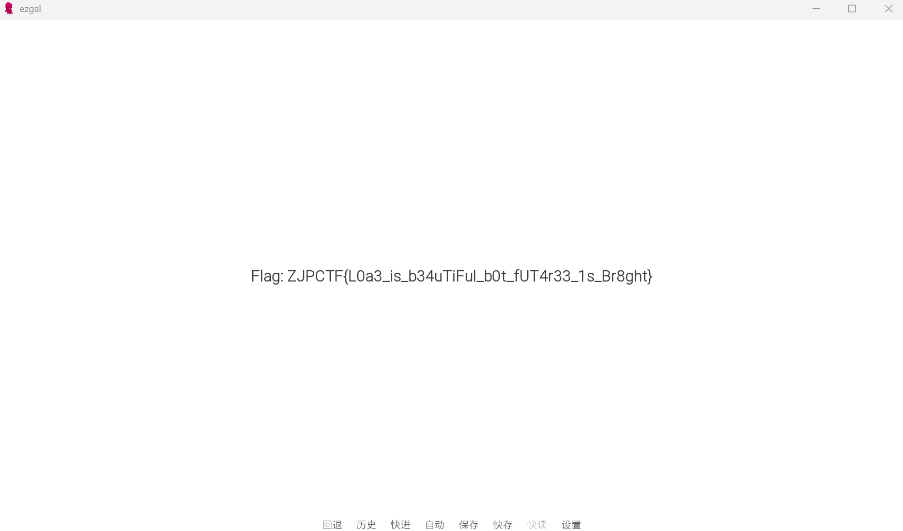

flag会保存放在游戏根目录。

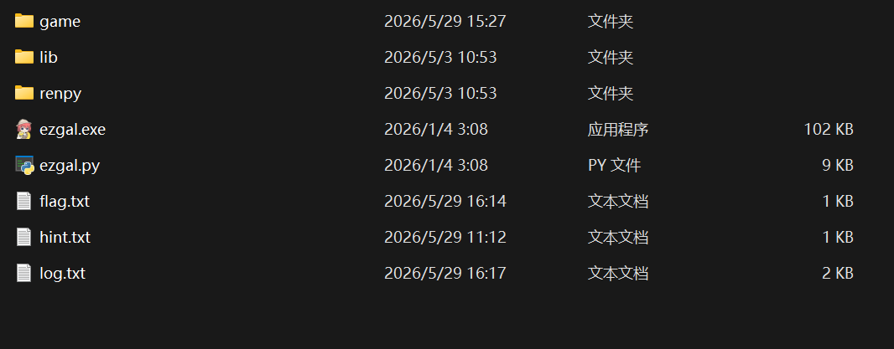

`ZJPCTF{L0a3_is_b34uTiFul_b0t_fUT4r33_1s_Br8ght}`

## 源代码

```C#
using System.Runtime.CompilerServices;

namespace ezgal_flagtester
{

    public class Cipher {
        public byte[] secretKey = new byte[] {
            0x1b,0x0d,0x1e,0x62,0x24,0x61,0x0d,0x2b,
            0x62,0x27,0x0d,0x13,0x20,0x61,0x0d,0x2b,

            0x7c,0x9a,0xb2,0xcd,0xd0,0x9a,0x61,0xa6,
            0x21,0xbd,0x86,0xb5,0x9c,0xfc,0xd5,0xbf,

            0x5f,0x77,0x32,0x74,0xde,0x0d,0xc2,0x00,
            0x5f,0x46,0x6f,0x52,0x04,0x94,0xa4,0xb4
        };
    }
    internal class Program
    {
        //public static String secretKey = "I_L0v3_y0u_Ar3_yoU_wI1liNg_tO_Be_w2tH_me_FoR3Ve7";
        /*public static byte[] plaincorrect = new byte[] {
            0x49,0x5f,0x4c,0x30,0x76,0x33,0x5f,0x79,
            0x30,0x75,0x5f,0x41,0x72,0x33,0x5f,0x79,

            0x6f,0x55,0x5f,0x77,0x49,0x31,0x6c,0x69,
            0x4e,0x67,0x5f,0x74,0x4f,0x5f,0x42,0x65,
        
            0x5f,0x77,0x32,0x74,0x48,0x5f,0x6d,0x65,
            0x5f,0x46,0x6f,0x52,0x33,0x56,0x65,0x37
        };*/
        public static byte[] chal1(byte[] part1) {
            byte[] result= new byte[part1.Length];
            Array.Copy(part1,result, part1.Length);
            for (int i = 0 ;i < part1.Length; i++) {
                result[i] ^= 0x52; 
            }
            return result;
        }

        public static byte[] chal2(byte[] part2)
        {
            byte[] result = new byte[part2.Length];
            Array.Copy(part2, result, part2.Length);
            byte[] key = System.Text.Encoding.UTF8.GetBytes("ZJPCTF");
            for(int j = 2;j >= 0; j--){
                for (int i = 0; i < result.Length; i++){
                    byte k = key[i % key.Length];
                    result[i] = (byte)( ( ( k + result[i] ) ^ (2 * k) ) + j );
                }
            }
            return result;
        }
        public static byte[] FNVHash(byte[] data)
        {
            const uint fnvPrime = 0x01000193;
            const uint fnvOffsetBasis = 0x811C9DC5;

            uint hash = fnvOffsetBasis;

            for (int i = 0; i < data.Length; i++)
            {
                hash ^= data[i];
                hash *= fnvPrime;
            }

            return BitConverter.GetBytes(hash);
        }
        public static byte[] chal3(byte[] part3)
        {
            byte[] result = new byte[part3.Length];
            Array.Copy(part3, result, part3.Length);

            byte[] spart1 = part3[0..4];
            byte[] spart2 = FNVHash(part3[4..8]);
            byte[] spart3 = part3[8..12];
            byte[] spart4 = FNVHash(part3[12..16]);

            return [..spart1, ..spart2, ..spart3, ..spart4];
        }

        public static byte[] Encrypt(byte[] inputBytes)
        {
            byte[] part1 = inputBytes[0..16];
            byte[] part2 = inputBytes[16..32];
            byte[] part3 = inputBytes[32..48];

            byte[] encpart1 = chal1(part1);
            byte[] encpart2 = chal2(part2);
            byte[] encpart3 = chal3(part3);

            return [..encpart1, ..encpart2, ..encpart3];
        }
        static void Main(string[] args)
        {
            Cipher cipher = new Cipher();
            byte[] secretKey = cipher.secretKey;
            string input = Console.ReadLine() ?? string.Empty;
            if (string.Equals(input,"")) {
                Console.WriteLine("0");
                return;
            }
            if (input.Length!=48) {
                Console.WriteLine("0");
                return;
            }
            byte[] inputBytes = System.Text.Encoding.UTF8.GetBytes(input);
            
            if (secretKey.SequenceEqual(Encrypt(inputBytes))){
                Console.WriteLine("1");
            }else{
                Console.WriteLine("0");
            }
            return;
        }
    }
}
```

# 


