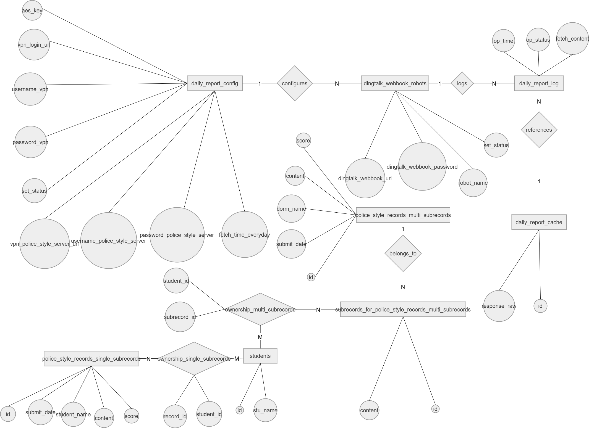

# 纪检工作台 / PoliceStyleWorkspace 技术文档

# **纪检工作台 / PoliceStyleWorkspace**

纪检工作台是一个面向警务化管理日常工作和扣分记录维护的本地化桌面 Web 应用。项目由 Go 单体服务、内嵌 Vue 前端和 EUI\-NEO Windows GUI 管理端组成，运行数据默认保存在发布目录内。

## **功能**

### 扣分记录管理

学生信息、学期、寝室、常规扣分记录、寝室整体差记录管理，具备增删改查基本功能。

### 每周扣分展示与导出

日常综合管理按周次展示每日分数，支持导出。

学期总表动态统计，支持导出。

### **申诉模板导出**

常规扣分记录、寝室整体差记录均可打开申诉窗口：填写大队/区队与复议说明、上传或删除点名扣分照片与申诉照片后，调用 Word 插入图片生成 `.doc` 申诉文档，并连同证据照片打包成 zip；单条导出与批量汇总均支持。

### 包干区自动轮值

工作台展示当前学期、轮值包干区寝室

- 当前轮值寝室根据当前日期所在学期周序计算：`weekIndex = floor((now - semesterStart) / 7天)`，`dutySeq = weekIndex % dormCount + 1`，再按寝室 `seq` 匹配。

### 未指定条目提醒

未指定条目、无子项寝室整体差等统计卡片，并可点击查看明细。

- 未指定条目包括未认定学生的常规扣分记录，以及存在未分配负责学生子项的寝室整体差记录。

- 无子项寝室整体差通过 `NOT EXISTS` 检查主记录是否没有任何子项。

### **扣分实时计算**

警务化扣分统计代码集中在 `handlers/workspace.go`。

工作台统计：

- `WorkspaceStats` 统计常规扣分条数、寝室整体差条数、无子项寝室整体差条数、总扣分、未指定条目、学期外记录和当前轮值寝室。

- 总扣分为常规扣分表 `SUM(score)` 加寝室整体差表 `SUM(score)`。

日常综合管理分数计算在 `fillDailyScores`：

- 常规扣分：一条记录如果认定了 N 名学生，每名学生承担 `record.score / N`。

- 寝室整体差：一条主记录如果有 M 个子项，某子项分配给 N 名学生，则该子项每名学生承担 `record.score / M / N`。

- 周统计按日期聚合到 `student_id + day`；学期汇总再按周累加，最终按总扣分降序展示。

- 导出明细使用同一分摊逻辑，代码见 `fillDailyExportDetails`。

### **每日播报**

警务化管理每日播报支持 VPN 和内网系统抓取、钉钉 Webhook 机器人发送、手动补播、日志保存、日志导出和删除。

寝室信息支持可选手机号，用于每日播报中钉钉机器人真实 `atMobiles` @ 寝室长。

每日播报主流程在 `handlers/daily_report_scheduler.go`：

- `StartDailyReportScheduler` 每秒检查配置时间；到达时间后使用 `daily_report_auto_run.run_key` 保证同一天同一时间只自动执行一次。

- `runDailyReport` 读取播报配置和启用的钉钉机器人，调用 `fetchDailyReport` 抓取内容，再逐个机器人发送并写入 `daily_report_log`。

- `fetchDailyReport` 依次完成 VPN 登录、内网系统登录、按日期抓取扣分记录和未指定条目，最后调用 `formatDailyReportMessage` 生成播报文本。

- `formatDailyReportMessage` 会过滤已申诉记录、去重记录 ID、补充学期周次和本周包干区寝室。

- 当播报日期位于学期内，且为周六、周日或周一，并且轮值寝室配置了手机号时，正文末尾追加包干区任务提醒，同时返回 `atMobiles`。

- `postDingTalk` 使用钉钉文本消息格式发送；有手机号时 payload 包含 `at: { atMobiles, isAtAll:false }`，不是只在文本里拼接 `@`。

- 抓取原始响应通过 `daily_report_cache` 去重保存，日志通过 `raw_id` 引用；删除日志或机器人时会检查缓存是否仍被其他日志引用。

- 若播报配置开启自动入库（`daily_report_config.auto_import`），日志入库后会把当批抓取记录自动导入常规扣分表：复用"导出制表→导入解析"逻辑；申诉成功\(`state=4`\)与已删除\(`state=7`\)的记录被过滤，`violation_ids` 为空的整区/包干区记录按未指定条目导入。

- 播报日志导出 XLSX 的"违规学号"列会按"姓名→学号"自动填充（仅留能匹配到本地学生的），文件可直接回导。

## **登录与鉴权**

会话管理基于session。

登录入口为 `POST /api/login`，实现位于 `handlers/app.go:Login`：

- 请求体包含 `username`、`password`、`timestamp`，前端同时通过 `X-Login-Timestamp` 请求头传递时间戳作为兼容补充。

- 服务端校验用户名非空、时间戳非空且在允许时钟偏差内。

- `loginGuard` 记录同一来源、用户名、时间戳组合，已使用时间戳再次提交会被视为重放。

- 密码校验调用 `models.ValidateLogin`，仅允许 `admin` 用户，密码比较使用 `HashPassword(password, salt)`。

- 登录成功后创建 session 和 CSRF token，设置 `PSW_SESSION_ID` HttpOnly Cookie，并返回 `csrf_token`。

API 鉴权：

- 除 `/api/login` 外，业务 API 在 `main.go` 中统一包裹 `middleware.RequireAuth`。

- `RequireAuth` 先检查 `PSW_SESSION_ID` 是否存在、是否未过期、是否能在内存会话表中找到。

- 对 `POST`、`PUT`、`DELETE` 等非安全方法，额外校验请求头 `X-CSRF-Token` 必须等于当前 session 绑定的 CSRF token。

- 前端 `web/src/api.ts` 会从 `PSW_CSRF_TOKEN` Cookie 中读取 token，并自动为非 GET 请求设置 `X-CSRF-Token`。

- 未认证请求返回 `401`，CSRF 校验失败返回 `403`。

## **安全性**

- 服务端默认只监听 `127.0.0.1:<port>`，避免对外网卡暴露。

- 登录接口要求请求携带时间戳，服务端基于时间窗口和已使用时间戳阻止重放。

- 登录失败计数采用固定 3 秒窗口：从第一次输错开始累计，3 秒到期清零；窗口内达到阈值后锁定 10 秒，并返回 `请求过于频繁`。

- 登录成功后发放 HttpOnly 会话 Cookie 和 CSRF Token；非 GET 认证接口要求携带 CSRF Token。

- 服务端使用系统互斥锁确保只有一个实例运行。

- 防止并发攻击和重放攻击：登录失败计数使用固定 3 秒窗口，窗口内达到阈值时锁定 10 秒并返回 `请求过于频繁`。

- 钉钉机器人接口POST采用5秒冷却机制，避免并发攻击导致信息轰炸。

敏感信息处理：

- VPN 密码、内网密码、钉钉 Webhook URL、钉钉加签密钥在数据库中保存真实值。

- 接口返回配置和机器人列表时只返回脱敏值；用户提交保存时仍写入真实值。相关处理在 `handlers/daily_report.go` 和 `models/daily_report.go`。

## **数据库**

数据库使用 SQLite，初始化入口在 `models/user.go:Init`。运行参数为 `foreign_keys=ON`、`busy_timeout=5000`、`journal_mode=WAL`、`synchronous=NORMAL`。数据库文件默认位于发布目录同级的 `databases/police_style.db`。

主要表结构：

|表|主键|字段|说明|
|---|---|---|---|
|`user`|`username`|`username`, `password`, `salt`|管理员账号。密码为双 SHA\\\-256 加盐摘要，见 `models/user.go:HashPassword`。|
|`semester`|`semester_name`|`semester_name`, `start_time`, `end_time`|学期范围。日期字段使用 `YYYY-MM-DD` 文本。|
|`students`|`id`|`id`, `stu_name`|学生基础信息。|
|`dorm`|`dorm_name`|`dorm_name`, `seq`, `phone_number`|寝室管理。`phone_number` 可为空，用于钉钉 @。|
|`police_style_records_single_subrecords`|`id`|`id`, `submit_date`, `student_name`, `content`, `score`|常规扣分记录。|
|`ownership_single_subrecords`|`(record_id, student_id)`|`record_id`, `student_id`|常规扣分记录与学生的认定关系。|
|`police_style_records_multi_subrecords`|`id`|`id`, `submit_date`, `dorm_name`, `content`, `score`|寝室整体差扣分主记录。|
|`subrecords_for_police_style_records_multi_subrecords`|`id`|`id`, `belongs_to`, `content`|寝室整体差子项。|
|`ownership_multi_subrecords`|`(subrecord_id, student_id)`|`subrecord_id`, `student_id`|寝室整体差子项与负责学生关系。|
|`daily_report_config`|`aes_key`|VPN/内网账号、密码、地址、播报时间、启用状态、自动入库|每日播报配置。密码字段加密存储；`auto_import` 开启后每次日志入库自动导入常规扣分表。|
|`dingtalk_webbook_robots`|`robot_name`|`robot_name`, `dingtalk_webbook_url`, `dingtalk_webbook_password`, `set_status`, `aes_key`|钉钉机器人配置。URL 和加签密钥加密存储。|
|`daily_report_cache`|`id`|`id`, `response_raw`|播报抓取原始响应缓存。|
|`daily_report_log`|`(robot_name, op_time)`|`op_time`, `op_status`, `fetch_content`, `robot_name`, `raw_id`|播报日志，`raw_id` 指向原始响应缓存。|
|`daily_report_auto_run`|`run_key`|`run_key`, `op_time`|自动播报防重复执行记录。|

```SQL
CREATE TABLE user (
        username TEXT PRIMARY KEY,
        password CHAR(32) NOT NULL,
        salt CHAR(16) NOT NULL
);

CREATE TABLE semester (
        semester_name VARCHAR(255) PRIMARY KEY,
        start_time TEXT,
        end_time TEXT
);

CREATE TABLE students (
        id CHAR(6) PRIMARY KEY,
        stu_name VARCHAR(10) NOT NULL
);

CREATE TABLE dorm (
    dorm_name TEXT PRIMARY KEY,
    seq INT, phone_number TEXT
);

CREATE TABLE police_style_records_single_subrecords (
        id CHAR(32) PRIMARY KEY,
        submit_date TEXT,
        student_name VARCHAR(255),
        content TEXT,
        score REAL DEFAULT 0.0
);
CREATE TABLE ownership_single_subrecords (
        record_id CHAR(32),
        student_id CHAR(6),
        PRIMARY KEY (record_id, student_id),
        FOREIGN KEY (student_id) REFERENCES students(id),
        FOREIGN KEY (record_id) REFERENCES police_style_records_single_subrecords(id)
);

CREATE TABLE police_style_records_multi_subrecords (
    id CHAR(32) PRIMARY KEY,
    submit_date TEXT,
    dorm_name VARCHAR(255),
    content TEXT,
    score REAL DEFAULT 0.0
);

CREATE TABLE subrecords_for_police_style_records_multi_subrecords (
    id CHAR(32) PRIMARY KEY, 
    belongs_to CHAR(32), 
    content TEXT, 
    FOREIGN KEY (belongs_to) REFERENCES police_style_records_multi_subrecords(id)
);

CREATE TABLE ownership_multi_subrecords (
    subrecord_id CHAR(32), 
    student_id CHAR(6), 
    PRIMARY KEY (subrecord_id, student_id), 
    FOREIGN KEY (student_id) REFERENCES students(id), 
    FOREIGN KEY (subrecord_id) REFERENCES subrecords_for_police_style_records_multi_subrecords(id)
);

CREATE TABLE daily_report_config(
    aes_key BLOB PRIMARY KEY, 
    vpn_login_url TEXT, 
    username_vpn TEXT, 
    password_vpn BLOB, 
    vpn_police_style_server_url TEXT,
    username_police_style_server TEXT,
    password_police_style_server BLOB,
    fetch_time_everyday TEXT,
    set_status INT,
    auto_import INT DEFAULT 0
);

CREATE TABLE dingtalk_webbook_robots(
    robot_name TEXT PRIMARY KEY, 
    dingtalk_webbook_url BLOB, 
    dingtalk_webbook_password BLOB, 
    set_status INT, aes_key BLOB, 
    FOREIGN KEY(aes_key) REFERENCES daily_report_config(aes_key)
);

CREATE TABLE daily_report_cache(
    id TEXT PRIMARY KEY, 
    response_raw TEXT
);

CREATE TABLE daily_report_auto_run(
    run_key TEXT PRIMARY KEY, 
    op_time TEXT
);

CREATE TABLE daily_report_log(
    op_time TEXT,
    op_status TEXT,
    fetch_content TEXT,
    robot_name TEXT,
    raw_id TEXT,
    PRIMARY KEY(robot_name,op_time),
    FOREIGN KEY(robot_name) REFERENCES dingtalk_webbook_robots(robot_name),
    FOREIGN KEY(raw_id) REFERENCES daily_report_cache(id)
);
```

E\-R图




## **构建**

Web 前端要求 Node\.js 20\.19 或更高版本。构建前端：

```PowerShell
cd web
npm install
npm run build
cd ..
```

构建 Go 服务：

```PowerShell
go mod tidy
go build -ldflags="-H windowsgui" -o PoliceStyleWorkspace/bin/police-style-workspace-server.exe .
```

GUI 使用 MinGW 构建 EUI\-NEO，目标为 Windows GUI 子系统：

```PowerShell
cmake -S gui -B gui/build-eui -G "MinGW Makefiles" -DCMAKE_C_COMPILER=gcc -DCMAKE_CXX_COMPILER=g++ -DCMAKE_BUILD_TYPE=Release
cmake --build gui/build-eui --parallel 4
Copy-Item gui/build-eui/police-style-workspace-gui.exe PoliceStyleWorkspace/bin/
```

## **运行**

```PowerShell
.\PoliceStyleWorkspace\bin\police-style-workspace-server.exe -port 3456
.\PoliceStyleWorkspace\bin\police-style-workspace-gui.exe
```

服务器首次启动会输出 `[系统] 初始密码: <明文密码>`。GUI 会自动搜索本地服务器；未运行时可使用“启动服务器”按钮。发布产物位于 `PoliceStyleWorkspace/`，运行数据位于其 `bin/` 同级目录：

- `databases/police_style.db`

- `config/`

- `log/server.log`

- `scripts/server-watchdog.vbs`

GUI 首次启动会生成 `scripts/server-watchdog.vbs` 并注册系统任务。任务每分钟确保无窗口 VBS 监控器存在；VBS 发现服务端消失后等待 1 分钟，再次确认仍未运行才启动。GUI 通过本机命名管道实时接收服务器终端流，支持滚动、框选和 `Ctrl+C` 复制。

## **上游源码**

参考第三方源码保存在 `third_party/`：

- `art-design-pro`：Web 工程导入其样式入口和登录页样式。

https://github\.com/Daymychen/art\-design\-pro

- `EUI-NEO`：GUI 通过 CMake `add_subdirectory` 静态链接。

https://github\.com/sudoevolve/EUI\-NEO

- `Watch-On-Windows`：`gui/src/WatchCapture.cpp` 基于其管道捕获实现改造。

https://github\.com/zmyme/Watch\-On\-Windows

各上游许可证保留在对应目录中。


