# 纪检工作台正式上线啦！

纪检工作台是一套用于警务化管理和日常扣分业务管理的本地化管理系统。

# 系统简介

纪检工作台是一套用于警务化管理和日常扣分业务管理的本地化管理系统，主要提供以下功能：

- 学生、学期和寝室基础信息管理。

- 常规扣分记录管理。

- 寝室整体差扣分记录及子项管理。

- 日常综合管理、周次统计和 Excel 导出。

- 工作台统计当前学期、扣分、未指定项目、无子项记录和轮值寝室。

- 警务化管理每日播报，支持内网数据抓取、钉钉机器人发送、播报日志查看、导出和删除。

# 启动

1. 双击运行 GUI 管理端。

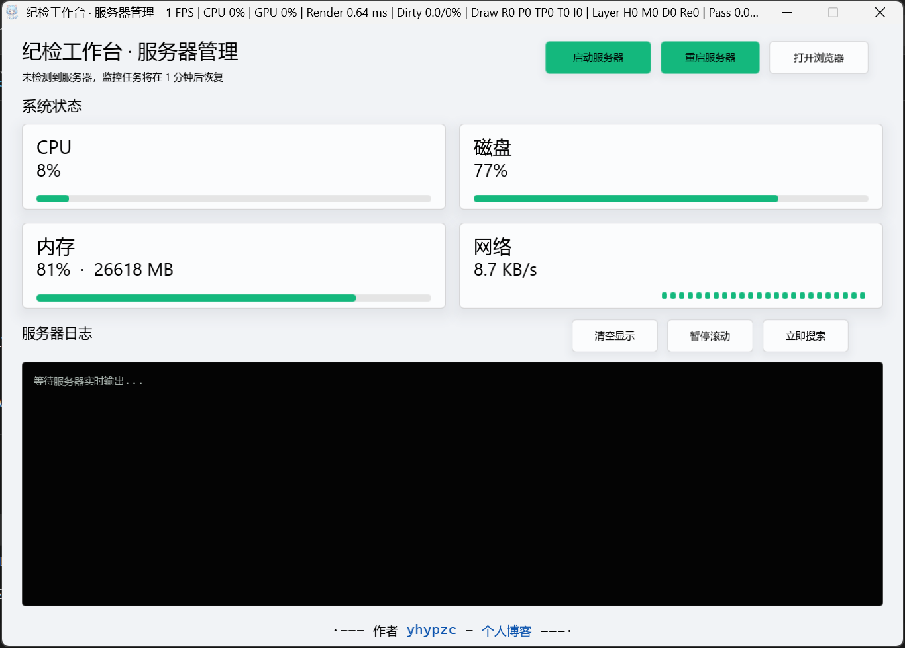

2. GUI 会自动查找本机服务端。如果服务端未运行，在 GUI 中点击“启动服务器”。

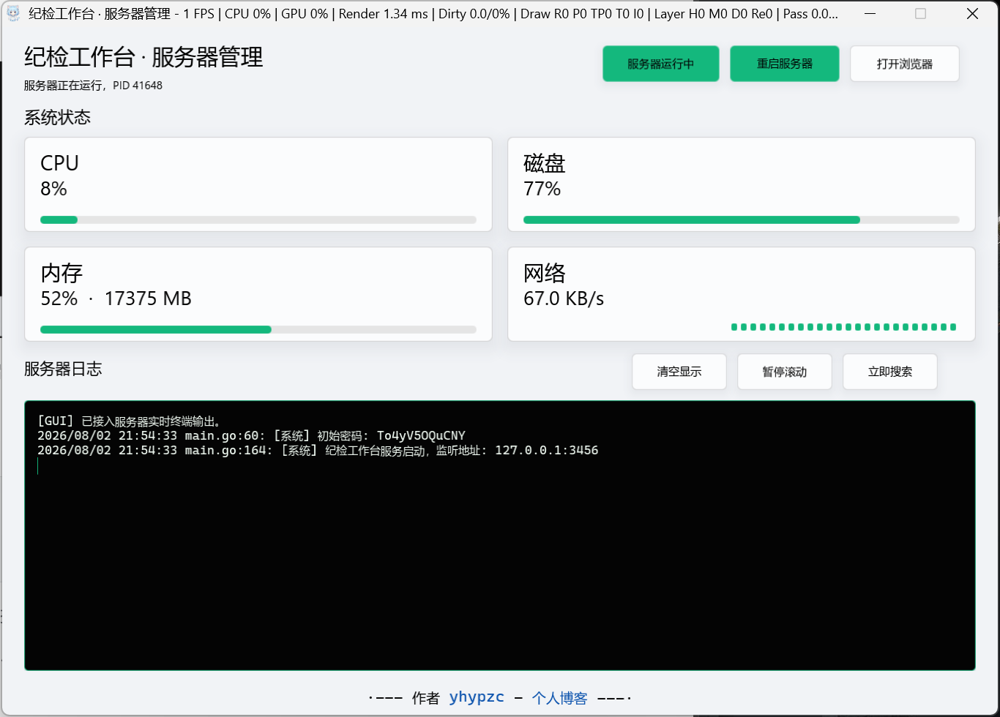

4. 浏览器访问登录页面，默认地址为：

    ```Plain Text
    http://127.0.0.1:3456/login
    ```

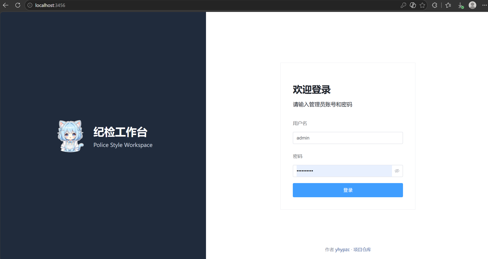

为了安全起见，服务端只监听本机 `127.0.0.1`，不能通过其他电脑直接访问。

首次启动服务端时，初始密码会输出到终端和 `log/server.log`。用户名为 `admin`。首次登录后建议立即进入“修改密码”更新密码。

复制密码输入并登录。

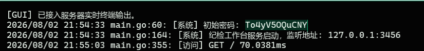

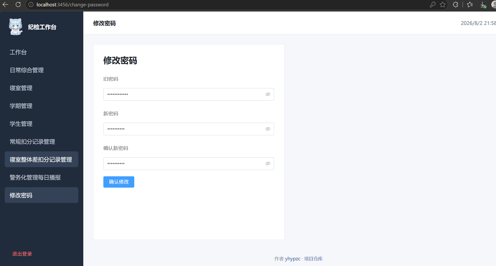

然后要重新登录

# 工作台界面

登录后进入工作台，可查看：

- 常规扣分记录数量：大队督察扣分、常规校督扣分。

- 校督寝室整体差扣分记录数量。

- 无划分子项寝室整体差记录数量。

- 当前系统累计扣分。

- 未分配负责学生的项目。

- 不在学期管理范围记录：便于管理员及时清理。

- 当前轮值包干区寝室。

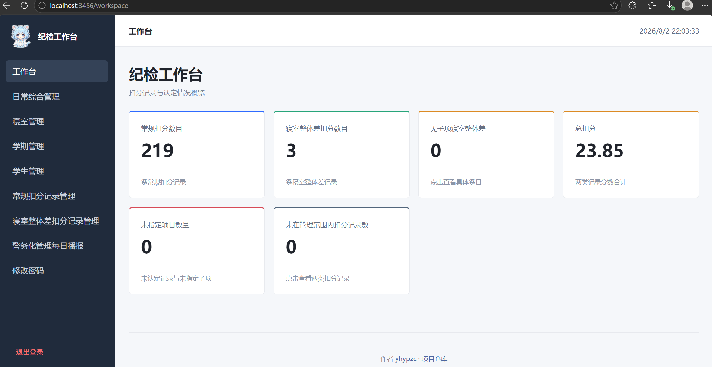

统计卡片支持点击查看未分配记录明细。

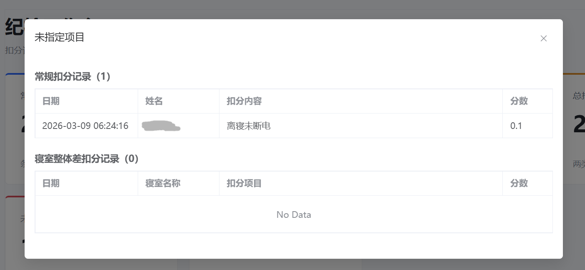

# 基础信息管理

## 学期管理

1. 进入“学期管理”。

2. 查看、新增、删除、修改学期名称、开始日期和结束日期。

3. 保存后，日常综合管理和每日播报会根据学期范围计算周次。

便于统计，学期起始日期和结束日期分别设置为仅周六、仅周五。

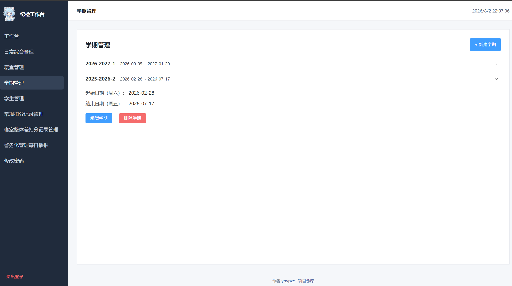

点击右上角按钮即可插入

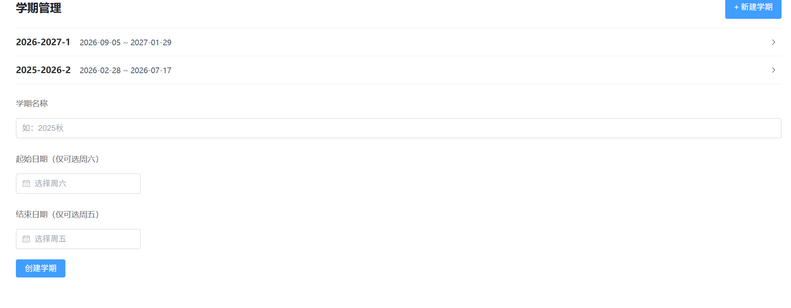

## 学生管理

1. 进入“学生管理”。

2. 可查看、新增、编辑、删除学生。

3. 也可以使用 Excel 模板批量导入。

学号必须唯一。

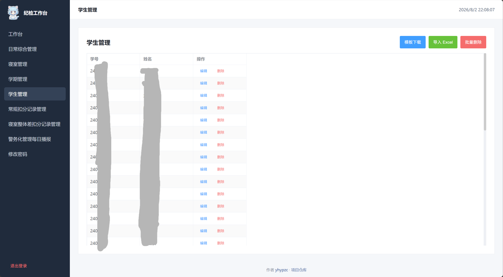

右上角可以下载模板导入，导入模板填写范例如下：

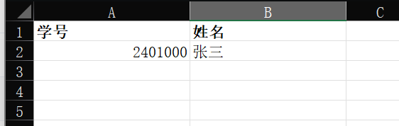

## 寝室管理

1. 进入“寝室管理”。

2. 可以查看、新增、修改、删除寝室名称。

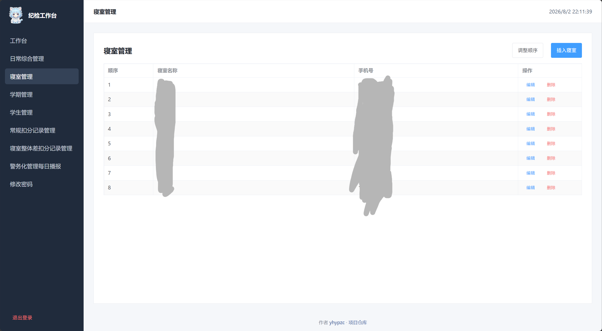

3. 可选填寝室长手机号，可以使用钉钉播报提醒功能。

4. 可编辑、删除和调整寝室顺序。

寝室顺序用于计算每周轮值包干区。手机号用于每日播报时通过钉钉机器人真实 @ 寝室长，可以为空。


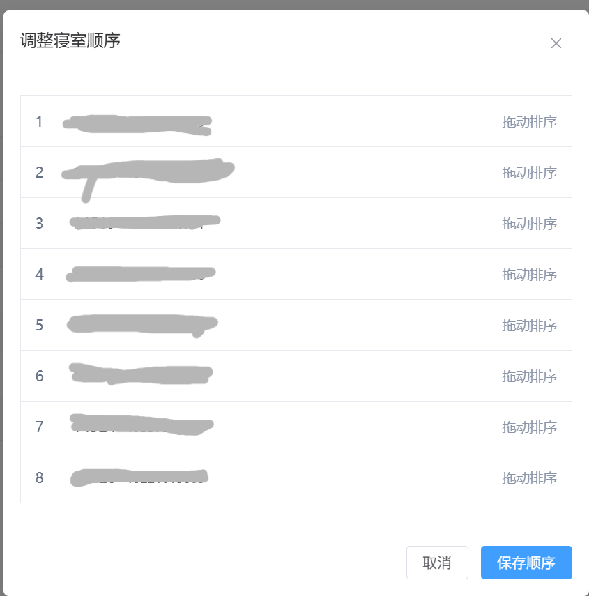

# 扣分记录管理

## 常规扣分记录

进入“常规扣分记录管理”后，可以：

- 新增、编辑和删除记录。

- 维护认定学生。

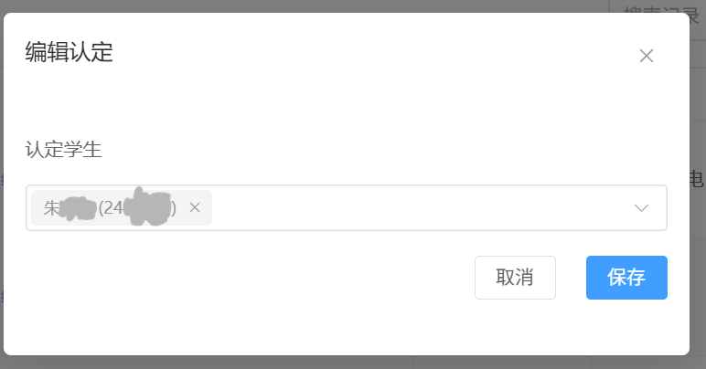

- 批量导入和批量删除。

- 下载 Excel 模板，批量导入扣分记录。

一条记录认定多名学生时，系统会将该记录分数平均分摊给认定学生。

```Plain Text
每名学生承担分数 = 主记录分数 / 当前子项负责学生数量
```

违规学号请用英文逗号隔开！！！

导入模板填写示例（大队督察）：

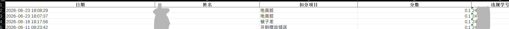

导入模板填写示例（校督）：

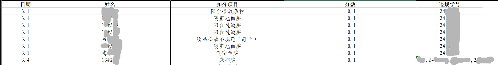

## 寝室整体差扣分记录

进入“寝室整体差扣分记录管理”后，可以：

- 新增、编辑和删除寝室整体差记录。

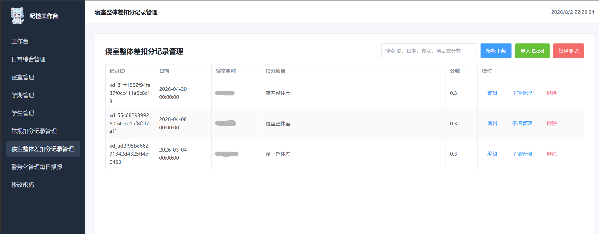

- 管理记录子项数目、为子项指定负责学生。

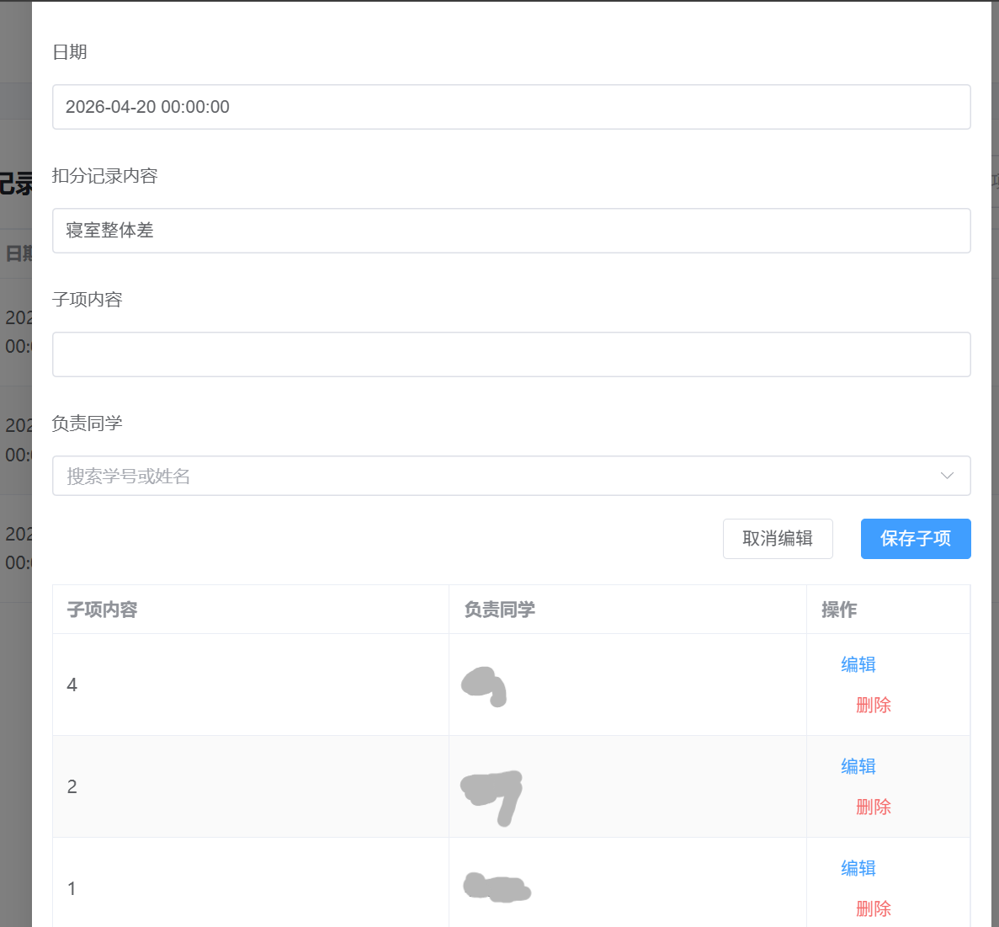

- 批量导入和批量删除扣分记录。

- 查看无子项记录。

主记录分数会按子项数量和子项负责学生数量分摊：

```Plain Text
每名学生承担分数 = 主记录分数 / (子项数量 * 当前子项负责学生数量)
```

编辑主记录时，日期不可修改。

# 日常综合管理

1. 进入“日常综合管理”，选择一个学期。

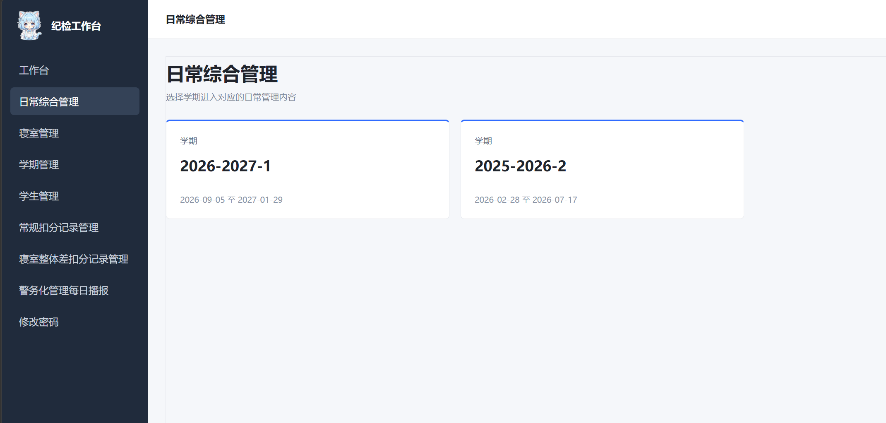

2. 选择周次查看每日分数，可查看学生每日扣分和周合计、学期合计。自动制定本周惩戒名单。

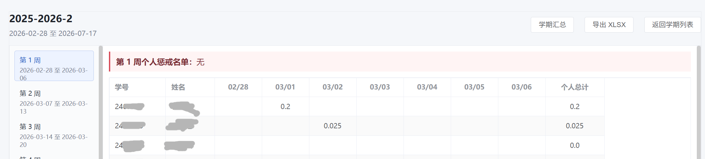

3. 使用导出功能生成 Excel 文件，可以按照自己想要的顺序导出，便于寝室归类和周报。

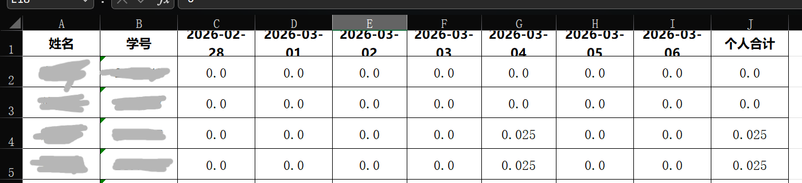

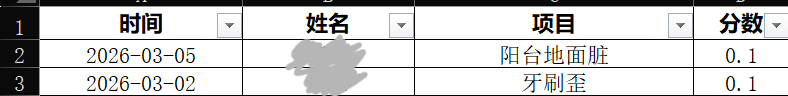

如果一个个拖太麻烦，先直接点击一次导出，然后在`config`目录下面打开json文件：

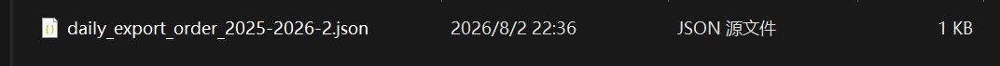

修改json文件里面的学号顺序即可，或者将想要学号顺序复制出来丢给ai，整理成json列表即可。

系统会同时统计常规扣分和寝室整体差扣分，并按照学生认定关系进行自动分摊。

# 警务化管理每日播报

## 配置播报信息

1. 进入“警务化管理每日播报”。

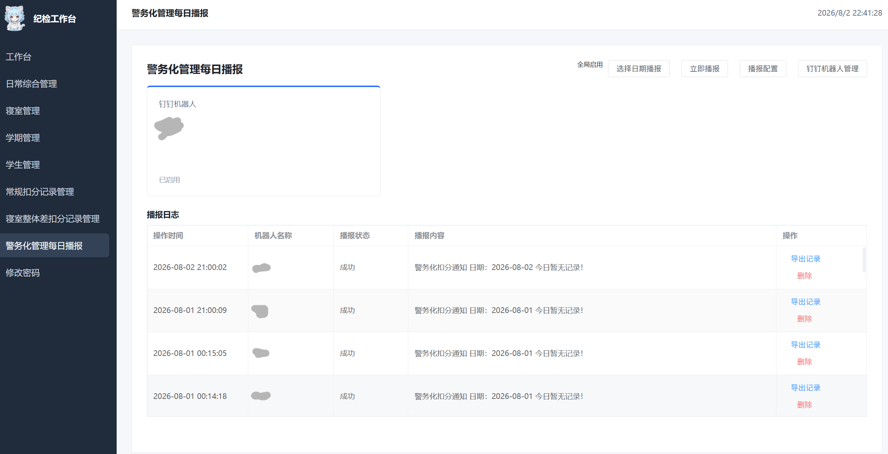

2. 打开“播报配置”，填写 VPN 登录地址、账号和密码，填写内网警务化管理服务器地址、账号和密码，设置每日播报时间，设置功能为启用。

注：请在正确的网络环境内使用，请勿在寝室网环境下使用此功能！！！

内网服务器账号一定要有纪检的权限！！！

VPN密码请务必正确，否则容易导致VPN账号被锁！！！

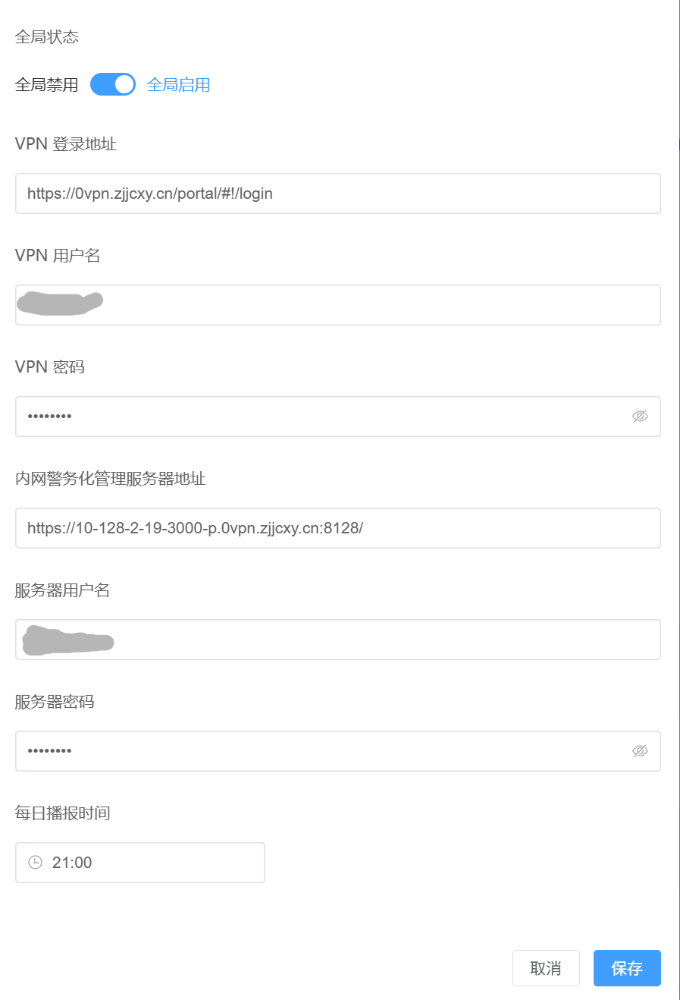

3. 保存配置并启用每日播报，配置至少一个启用的钉钉Webhook机器人就能正常播报了。

4. 打开自动入库功能，可以在播报完成之后自动进行入库操作，免去大队督察扣分每日手动导入的重复操作


## 配置钉钉Webhook机器人

1. 打开“钉钉机器人管理”。

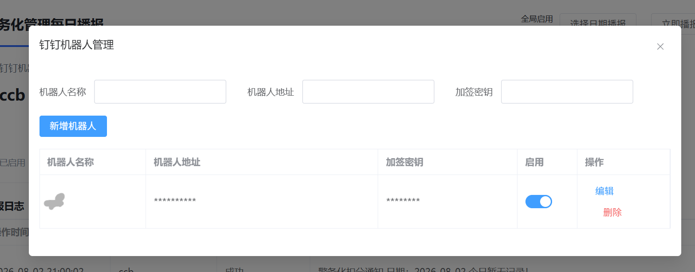

2. 在钉钉创建机器人。

右上角齿轮按钮进入群设置\-\>机器人\-\>添加机器人\-\>自定义


点击添加

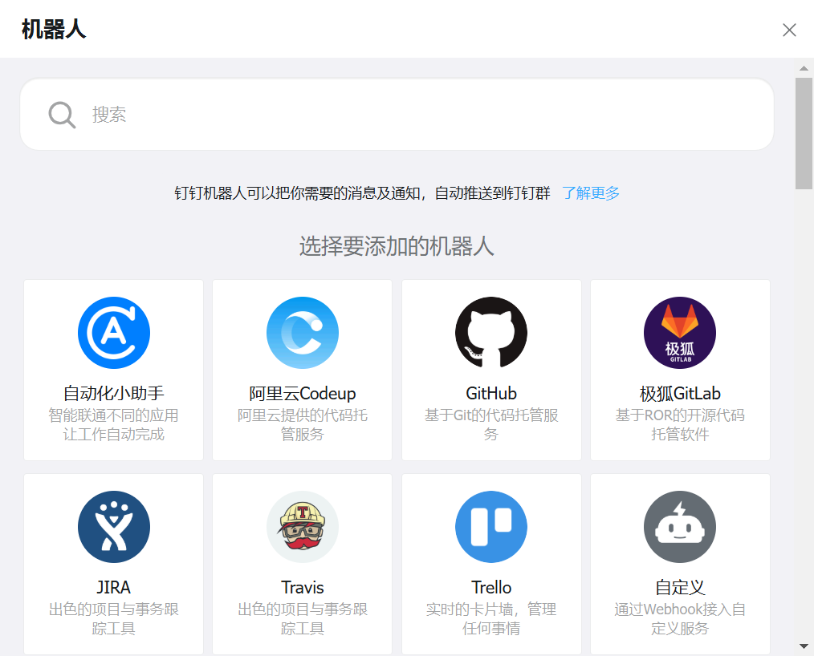


然后在网页中填写机器人名称、Webhook 地址和加签密钥。

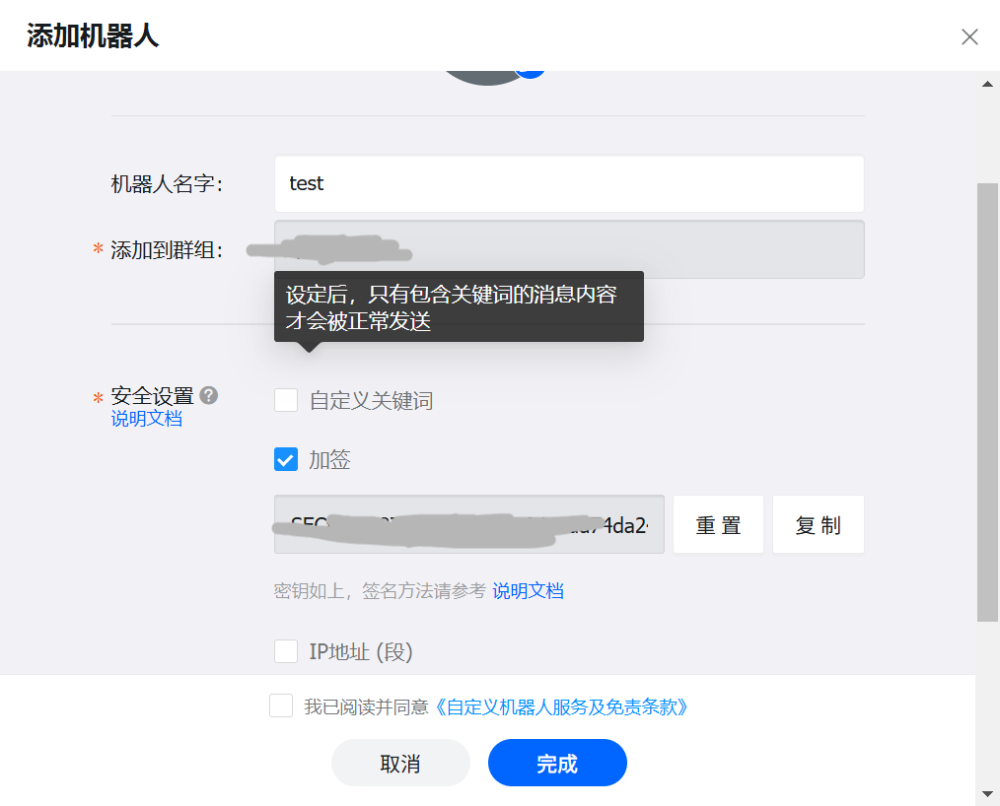

然后打勾并完成。


把机器人的名称,url,加签密钥填到里面即可，最后保存并启用机器人。

机器人地址和加签密钥在页面列表中会脱敏显示，但提交和数据库保存使用真实值。

## 自动播报

到达配置的每日播报时间后，系统会自动抓取指定日期的扣分记录和未指定记录，生成播报文本，发送到启用的钉钉机器人，并保存播报日志和抓取原始数据。

播报日期在学期范围内，且为周六、周日或周一时，如果当前轮值寝室配置了手机号，播报结尾会提醒寝室长进行包干区任务分工，并通过钉钉机器人真实 @ 对应手机号。

## 手动播报

在每日播报页面点击“立即播报”，或选择指定日期后执行补播。

注意：为避免播报接口并发攻击，系统设置为手动播报请求最短间隔为 5 秒。5 秒内重复提交会返回“请求过于频繁”，不会重复登录 VPN 与发送钉钉消息。

## 播报日志

播报日志可以查看：

- 操作时间。

- 发送状态。

- 机器人名称。

- 播报内容。

- 抓取原始数据。

日志支持导出和删除。

导出的格式和导入单项记录的字段格式相同，但是违规学号需要自己填或者导入后指定。

# 数据和日志位置

数据库文件是 `databases/police_style.db`。

日志文件是`log/server.log`

导出顺序配置位于`config/daily_export_order_学期名.json`

申诉模板数据位于`config/docx_templates_preferences.json`

# 常见问题

## 忘记密码

用DB Browser For Sqlite工具把`database/police_style.db`里面的user表删除即可。

## 每日播报失败

依次检查：

1. VPN 地址、账号和密码是否正确

2. VPN账号密码是否因为5次以上密码错误导致账号被锁。

3. 内网服务器地址、账号和密码是否正确。

3. 当前网络是否能访问 VPN 和内网系统，不建议在寝室中使用该功能。

4. 钉钉 Webhook 地址和加签密钥是否正确。

5. 机器人是否启用并已加入目标群。

6. 其他bug可以查看每日播报日志或者联系开发者。

## 提示请求过于频繁

登录失败限制或每日播报限流正在生效。等待对应限制时间后再操作。

## GUI无法启动

可能是3D加速被禁用的问题，请开启3D加速。

